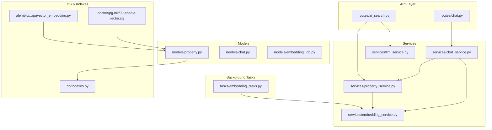
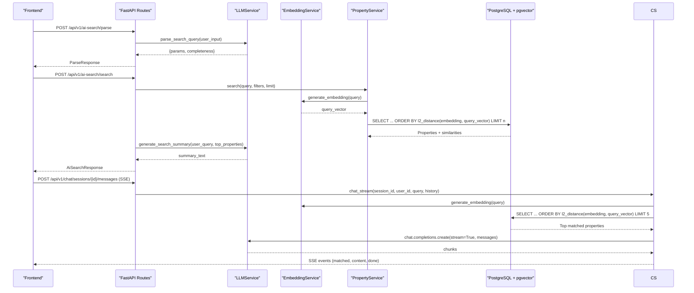
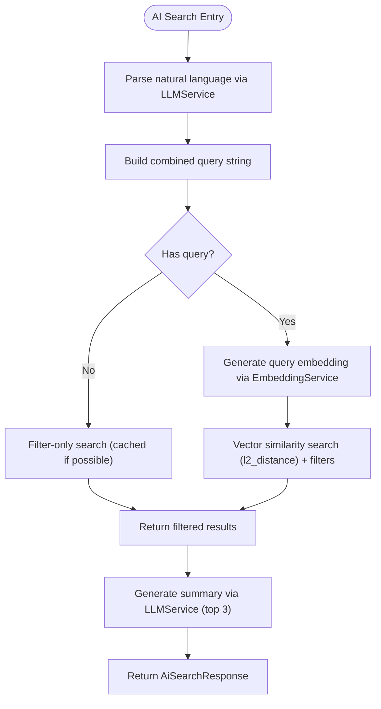
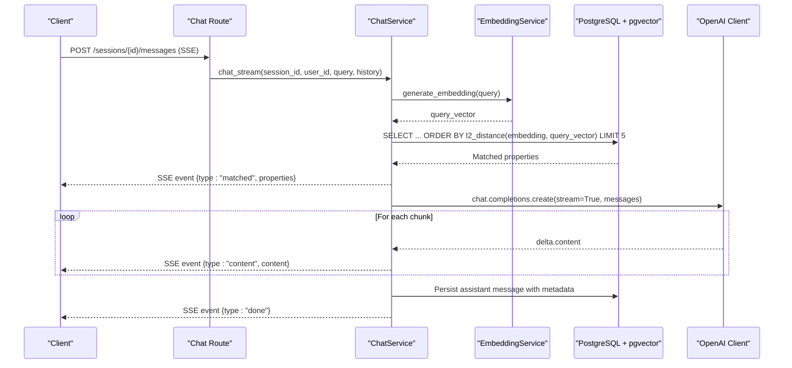
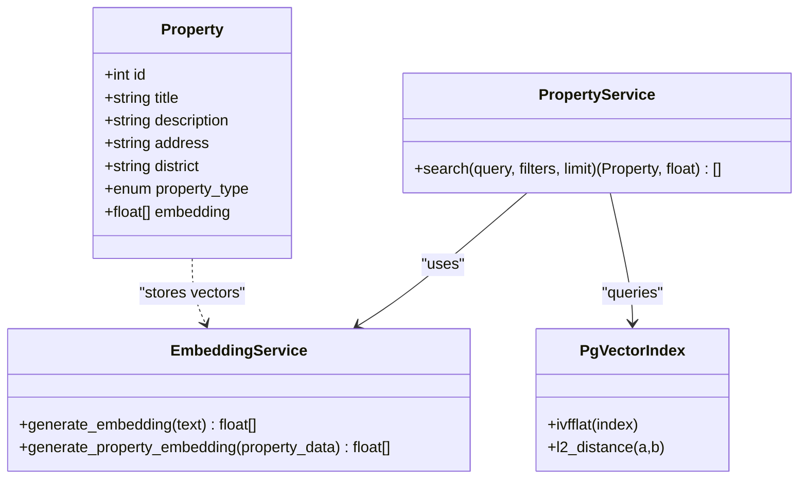
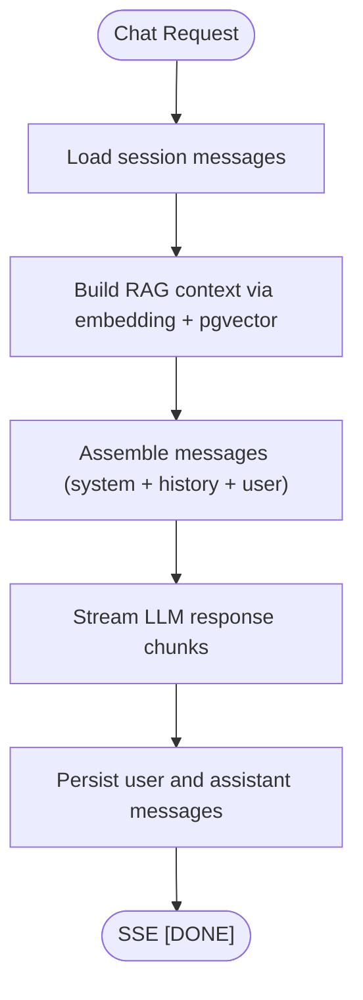
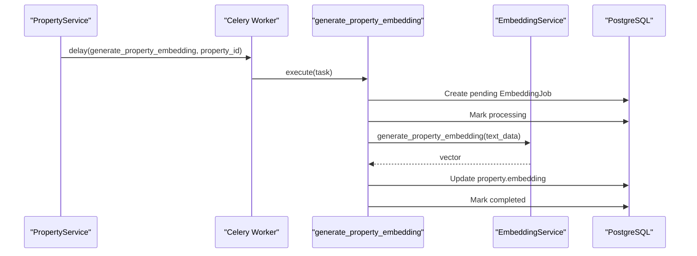
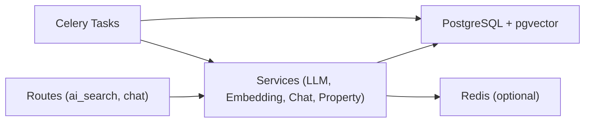

# AI & Machine Learning Features

<cite>
**Referenced Files in This Document**
- [ai_search.py](file://backend/app/api/v1/routes/ai_search.py)
- [chat.py](file://backend/app/api/v1/routes/chat.py)
- [embedding_service.py](file://backend/app/services/embedding_service.py)
- [llm_service.py](file://backend/app/services/llm_service.py)
- [chat_service.py](file://backend/app/services/chat_service.py)
- [property_service.py](file://backend/app/services/property_service.py)
- [embedding_tasks.py](file://backend/app/tasks/embedding_tasks.py)
- [config.py](file://backend/app/core/config.py)
- [property.py](file://backend/app/models/property.py)
- [chat.py](file://backend/app/models/chat.py)
- [embedding_job.py](file://backend/app/models/embedding_job.py)
- [indexes.py](file://backend/app/db/indexes.py)
- [20260620_0002_pgvector_embedding.py](file://backend/alembic/versions/20260620_0002_pgvector_embedding.py)
- [00-enable-vector.sql](file://docker/pg-init/00-enable-vector.sql)
</cite>

## Table of Contents
1. [Introduction](#introduction)
2. [Project Structure](#project-structure)
3. [Core Components](#core-components)
4. [Architecture Overview](#architecture-overview)
5. [Detailed Component Analysis](#detailed-component-analysis)
6. [Dependency Analysis](#dependency-analysis)
7. [Performance Considerations](#performance-considerations)
8. [Troubleshooting Guide](#troubleshooting-guide)
9. [Conclusion](#conclusion)
10. [Appendices](#appendices)

## Introduction
This document explains the AI-powered features of the Rental Housing Structure platform, focusing on:
- Semantic search using OpenAI embeddings and pgvector vector similarity matching
- Retrieval-Augmented Generation (RAG) chat assistant with real-time streaming via Server-Sent Events (SSE)
- Embedding generation pipeline for properties, including text preprocessing, vector storage, and similarity search
- Chat service implementation with context management, conversation history, and property recommendation engine
- Background task processing for embedding generation and reindexing operations
- Configuration options for multiple AI providers (OpenAI, DeepSeek), model selection, and performance tuning
- Cost optimization strategies, caching mechanisms, and fallback implementations
- Examples of natural language queries, chat interactions, and embedding search results
- Troubleshooting guides for AI service connectivity and performance monitoring

## Project Structure
The AI features are implemented primarily in the backend under FastAPI routes, services, models, tasks, and configuration. Key areas include:
- API routes for AI search and chat
- Services for LLM orchestration, embeddings, RAG context building, and property search
- Models for properties (with vector column), chat sessions/messages, and embedding jobs
- Celery background tasks for embedding generation and bulk reindexing
- Database indexes and migrations for pgvector support

**Diagram sources**
- [ai_search.py:1-160](file://backend/app/api/v1/routes/ai_search.py#L1-L160)
- [chat.py:1-143](file://backend/app/api/v1/routes/chat.py#L1-L143)
- [llm_service.py:1-209](file://backend/app/services/llm_service.py#L1-L209)
- [embedding_service.py:1-32](file://backend/app/services/embedding_service.py#L1-L32)
- [chat_service.py:1-302](file://backend/app/services/chat_service.py#L1-L302)
- [property_service.py:1-239](file://backend/app/services/property_service.py#L1-L239)
- [embedding_tasks.py:1-112](file://backend/app/tasks/embedding_tasks.py#L1-L112)
- [property.py:1-86](file://backend/app/models/property.py#L1-L86)
- [chat.py:1-62](file://backend/app/models/chat.py#L1-L62)
- [embedding_job.py:1-35](file://backend/app/models/embedding_job.py#L1-L35)
- [indexes.py:1-118](file://backend/app/db/indexes.py#L1-L118)
- [20260620_0002_pgvector_embedding.py:1-40](file://backend/alembic/versions/20260620_0002_pgvector_embedding.py#L1-L40)
- [00-enable-vector.sql:1-3](file://docker/pg-init/00-enable-vector.sql#L1-L3)

**Section sources**
- [ai_search.py:1-160](file://backend/app/api/v1/routes/ai_search.py#L1-L160)
- [chat.py:1-143](file://backend/app/api/v1/routes/chat.py#L1-L143)
- [embedding_service.py:1-32](file://backend/app/services/embedding_service.py#L1-L32)
- [llm_service.py:1-209](file://backend/app/services/llm_service.py#L1-L209)
- [chat_service.py:1-302](file://backend/app/services/chat_service.py#L1-L302)
- [property_service.py:1-239](file://backend/app/services/property_service.py#L1-L239)
- [embedding_tasks.py:1-112](file://backend/app/tasks/embedding_tasks.py#L1-L112)
- [property.py:1-86](file://backend/app/models/property.py#L1-L86)
- [chat.py:1-62](file://backend/app/models/chat.py#L1-L62)
- [embedding_job.py:1-35](file://backend/app/models/embedding_job.py#L1-L35)
- [indexes.py:1-118](file://backend/app/db/indexes.py#L1-L118)
- [20260620_0002_pgvector_embedding.py:1-40](file://backend/alembic/versions/20260620_0002_pgvector_embedding.py#L1-L40)
- [00-enable-vector.sql:1-3](file://docker/pg-init/00-enable-vector.sql#L1-L3)

## Core Components
- LLM Service: Unified interface to call DeepSeek or OpenAI chat models, with provider preference and fallback logic. Used for parsing natural language queries and generating summaries.
- Embedding Service: Generates OpenAI embeddings for text and property descriptions; used by both semantic search and RAG context building.
- Property Service: Implements hybrid search combining optional vector similarity with filters; includes Redis-based caching for non-vector queries.
- Chat Service: Provides session/message management, RAG context retrieval from pgvector, and SSE streaming responses for real-time chat.
- Embedding Tasks: Celery tasks to generate embeddings per property and bulk reindex all missing embeddings asynchronously.
- Models: Property with a vector column type, ChatSession/ChatMessage for conversation persistence, and EmbeddingJob for job tracking.
- DB Indexes: pgvector IVFFlat index creation utilities and Alembic migration enabling vector extension and indexing.

**Section sources**
- [llm_service.py:1-209](file://backend/app/services/llm_service.py#L1-L209)
- [embedding_service.py:1-32](file://backend/app/services/embedding_service.py#L1-L32)
- [property_service.py:1-239](file://backend/app/services/property_service.py#L1-L239)
- [chat_service.py:1-302](file://backend/app/services/chat_service.py#L1-L302)
- [embedding_tasks.py:1-112](file://backend/app/tasks/embedding_tasks.py#L1-L112)
- [property.py:1-86](file://backend/app/models/property.py#L1-L86)
- [chat.py:1-62](file://backend/app/models/chat.py#L1-L62)
- [embedding_job.py:1-35](file://backend/app/models/embedding_job.py#L1-L35)
- [indexes.py:1-118](file://backend/app/db/indexes.py#L1-L118)
- [20260620_0002_pgvector_embedding.py:1-40](file://backend/alembic/versions/20260620_0002_pgvector_embedding.py#L1-L40)

## Architecture Overview
High-level flow for AI search and chat:
- AI Search: Frontend calls parse/search endpoints; backend uses LLM to extract structured parameters, then performs vector + filter search and generates a summary.
- Chat Assistant: Frontend opens an SSE stream; backend builds RAG context by embedding the query and retrieving top similar properties from pgvector, then streams LLM responses chunk-by-chunk.

**Diagram sources**
- [ai_search.py:1-160](file://backend/app/api/v1/routes/ai_search.py#L1-L160)
- [chat.py:1-143](file://backend/app/api/v1/routes/chat.py#L1-L143)
- [llm_service.py:1-209](file://backend/app/services/llm_service.py#L1-L209)
- [embedding_service.py:1-32](file://backend/app/services/embedding_service.py#L1-L32)
- [chat_service.py:1-302](file://backend/app/services/chat_service.py#L1-L302)
- [property_service.py:1-239](file://backend/app/services/property_service.py#L1-L239)
- [property.py:1-86](file://backend/app/models/property.py#L1-L86)

## Detailed Component Analysis

### Semantic Search Implementation
- Query parsing: The parse endpoint uses LLMService to extract structured search parameters and completeness hints from natural language input.
- Vector search: When a query is provided, PropertyService computes an embedding via EmbeddingService and executes a similarity search using pgvector’s l2_distance ordering. Non-vector searches can be cached in Redis.
- Summary generation: After retrieving top results, LLMService generates a concise, friendly summary based on the user’s query and top properties.

**Diagram sources**
- [ai_search.py:1-160](file://backend/app/api/v1/routes/ai_search.py#L1-L160)
- [property_service.py:1-239](file://backend/app/services/property_service.py#L1-L239)
- [embedding_service.py:1-32](file://backend/app/services/embedding_service.py#L1-L32)
- [llm_service.py:1-209](file://backend/app/services/llm_service.py#L1-L209)

**Section sources**
- [ai_search.py:1-160](file://backend/app/api/v1/routes/ai_search.py#L1-L160)
- [property_service.py:1-239](file://backend/app/services/property_service.py#L1-L239)
- [embedding_service.py:1-32](file://backend/app/services/embedding_service.py#L1-L32)
- [llm_service.py:1-209](file://backend/app/services/llm_service.py#L1-L209)

### RAG Chat Assistant with SSE Streaming
- Session management: Create/list/close/delete sessions and retrieve message history.
- RAG context builder: Embeds the user query, retrieves top similar available properties from pgvector, and constructs a context block appended to the system prompt.
- Streaming response: Uses OpenAI client streaming to send chunks via SSE; also persists user and assistant messages with metadata (matched properties).

**Diagram sources**
- [chat.py:1-143](file://backend/app/api/v1/routes/chat.py#L1-L143)
- [chat_service.py:1-302](file://backend/app/services/chat_service.py#L1-L302)
- [embedding_service.py:1-32](file://backend/app/services/embedding_service.py#L1-L32)
- [property.py:1-86](file://backend/app/models/property.py#L1-L86)

**Section sources**
- [chat.py:1-143](file://backend/app/api/v1/routes/chat.py#L1-L143)
- [chat_service.py:1-302](file://backend/app/services/chat_service.py#L1-L302)
- [embedding_service.py:1-32](file://backend/app/services/embedding_service.py#L1-L32)
- [property.py:1-86](file://backend/app/models/property.py#L1-L86)

### Embedding Generation Process
- Text preprocessing: Property fields (title, description, address, district, property_type) are concatenated into a single text string.
- Vector storage: Embeddings are stored in a PostgreSQL vector column (dimension 1536) using a custom TypeDecorator that maps to pgvector.Vector when running on PostgreSQL.
- Similarity search: Queries are embedded and compared using l2_distance; results ordered by similarity.

**Diagram sources**
- [property.py:1-86](file://backend/app/models/property.py#L1-L86)
- [embedding_service.py:1-32](file://backend/app/services/embedding_service.py#L1-L32)
- [property_service.py:1-239](file://backend/app/services/property_service.py#L1-L239)
- [indexes.py:1-118](file://backend/app/db/indexes.py#L1-L118)

**Section sources**
- [embedding_service.py:1-32](file://backend/app/services/embedding_service.py#L1-L32)
- [property.py:1-86](file://backend/app/models/property.py#L1-L86)
- [property_service.py:1-239](file://backend/app/services/property_service.py#L1-L239)
- [indexes.py:1-118](file://backend/app/db/indexes.py#L1-L118)
- [20260620_0002_pgvector_embedding.py:1-40](file://backend/alembic/versions/20260620_0002_pgvector_embedding.py#L1-L40)
- [00-enable-vector.sql:1-3](file://docker/pg-init/00-enable-vector.sql#L1-L3)

### Chat Service Implementation
- Context management: Builds a system prompt with RAG context derived from top matched properties.
- Conversation history: Loads existing messages for the session and appends them to the message list before calling the LLM.
- Recommendation engine: Returns matched properties alongside streamed content, allowing the frontend to render recommendations in real time.

**Diagram sources**
- [chat_service.py:1-302](file://backend/app/services/chat_service.py#L1-L302)
- [chat.py:1-62](file://backend/app/models/chat.py#L1-L62)

**Section sources**
- [chat_service.py:1-302](file://backend/app/services/chat_service.py#L1-L302)
- [chat.py:1-62](file://backend/app/models/chat.py#L1-L62)

### Background Task Processing
- Per-property embedding: Enqueued when creating/updating a property; tracks job status, timestamps, and errors.
- Bulk reindex: Scans for properties without embeddings and enqueues individual embedding tasks.

**Diagram sources**
- [property_service.py:1-239](file://backend/app/services/property_service.py#L1-L239)
- [embedding_tasks.py:1-112](file://backend/app/tasks/embedding_tasks.py#L1-L112)
- [embedding_service.py:1-32](file://backend/app/services/embedding_service.py#L1-L32)
- [embedding_job.py:1-35](file://backend/app/models/embedding_job.py#L1-L35)

**Section sources**
- [embedding_tasks.py:1-112](file://backend/app/tasks/embedding_tasks.py#L1-L112)
- [property_service.py:1-239](file://backend/app/services/property_service.py#L1-L239)
- [embedding_job.py:1-35](file://backend/app/models/embedding_job.py#L1-L35)

### Configuration Options and Model Selection
- OpenAI settings: API key, embedding model, chat model.
- DeepSeek settings: API key, base URL, chat model; used as primary provider for LLMService with OpenAI fallback.
- Performance tuning: Rate limiting, Redis cache TTL, pgvector IVFFlat lists parameter.

Key environment variables:
- OPENAI_API_KEY, OPENAI_EMBEDDING_MODEL, OPENAI_CHAT_MODEL
- DEEPSEEK_API_KEY, DEEPSEEK_BASE_URL, DEEPSEEK_CHAT_MODEL
- REDIS_URL, RATE_LIMIT_REQUESTS, RATE_LIMIT_WINDOW_SECONDS

**Section sources**
- [config.py:1-167](file://backend/app/core/config.py#L1-L167)
- [llm_service.py:1-209](file://backend/app/services/llm_service.py#L1-L209)
- [indexes.py:1-118](file://backend/app/db/indexes.py#L1-L118)

## Dependency Analysis
Component relationships and coupling:
- Routes depend on services for business logic.
- Chat and AI search rely on EmbeddingService and pgvector for vector operations.
- LLMService abstracts provider-specific clients and provides fallback behavior.
- Background tasks decouple embedding generation from request paths.

**Diagram sources**
- [ai_search.py:1-160](file://backend/app/api/v1/routes/ai_search.py#L1-L160)
- [chat.py:1-143](file://backend/app/api/v1/routes/chat.py#L1-L143)
- [llm_service.py:1-209](file://backend/app/services/llm_service.py#L1-L209)
- [embedding_service.py:1-32](file://backend/app/services/embedding_service.py#L1-L32)
- [chat_service.py:1-302](file://backend/app/services/chat_service.py#L1-L302)
- [property_service.py:1-239](file://backend/app/services/property_service.py#L1-L239)
- [embedding_tasks.py:1-112](file://backend/app/tasks/embedding_tasks.py#L1-L112)

**Section sources**
- [ai_search.py:1-160](file://backend/app/api/v1/routes/ai_search.py#L1-L160)
- [chat.py:1-143](file://backend/app/api/v1/routes/chat.py#L1-L143)
- [llm_service.py:1-209](file://backend/app/services/llm_service.py#L1-L209)
- [embedding_service.py:1-32](file://backend/app/services/embedding_service.py#L1-L32)
- [chat_service.py:1-302](file://backend/app/services/chat_service.py#L1-L302)
- [property_service.py:1-239](file://backend/app/services/property_service.py#L1-L239)
- [embedding_tasks.py:1-112](file://backend/app/tasks/embedding_tasks.py#L1-L112)

## Performance Considerations
- Vector index tuning: IVFFlat index created with lists ≈ sqrt(row_count) for large datasets; exact scan preferred for small datasets (<1000 rows).
- Caching: Non-vector search results cached in Redis with a configurable TTL to reduce database load.
- Streaming: SSE streaming reduces perceived latency for chat responses.
- Provider selection: Prefer cost-effective provider (DeepSeek) for parsing/summaries; use OpenAI for embeddings where configured.

[No sources needed since this section provides general guidance]

## Troubleshooting Guide
- AI service connectivity:
  - Ensure OPENAI_API_KEY or DEEPSEEK_API_KEY is set; LLMService raises an error if neither is configured.
  - Verify DEEPSEEK_BASE_URL and model names match provider expectations.
- pgvector setup:
  - Confirm the vector extension is enabled in Docker init script and Alembic migration has run.
  - Check IVFFlat index existence and size; recreate if necessary.
- Embedding jobs:
  - Inspect EmbeddingJob records for failed statuses and error messages.
  - Re-run bulk reindex to populate missing embeddings.
- Performance monitoring:
  - Use EXPLAIN ANALYZE utilities to inspect query plans for vector and filter queries.
  - Monitor Redis availability; caching is disabled gracefully if unavailable.

**Section sources**
- [llm_service.py:1-209](file://backend/app/services/llm_service.py#L1-L209)
- [00-enable-vector.sql:1-3](file://docker/pg-init/00-enable-vector.sql#L1-L3)
- [20260620_0002_pgvector_embedding.py:1-40](file://backend/alembic/versions/20260620_0002_pgvector_embedding.py#L1-L40)
- [embedding_tasks.py:1-112](file://backend/app/tasks/embedding_tasks.py#L1-L112)
- [indexes.py:1-118](file://backend/app/db/indexes.py#L1-L118)

## Conclusion
The platform integrates semantic search and RAG-driven chat to deliver intelligent property discovery and conversational assistance. By leveraging OpenAI embeddings, pgvector similarity search, and SSE streaming, it balances responsiveness and accuracy. Background tasks ensure embeddings stay up-to-date, while configuration flexibility supports multiple AI providers and performance tuning.

[No sources needed since this section summarizes without analyzing specific files]

## Appendices

### Configuration Reference
- OpenAI
  - OPENAI_API_KEY: API key for embeddings and chat fallback
  - OPENAI_EMBEDDING_MODEL: Default embedding model name
  - OPENAI_CHAT_MODEL: Default chat model name
- DeepSeek
  - DEEPSEEK_API_KEY: API key for parsing and summaries
  - DEEPSEEK_BASE_URL: Base URL for DeepSeek API
  - DEEPSEEK_CHAT_MODEL: Model name for DeepSeek chat
- General
  - REDIS_URL: Redis connection string for caching
  - RATE_LIMIT_REQUESTS, RATE_LIMIT_WINDOW_SECONDS: Rate limiting thresholds

**Section sources**
- [config.py:1-167](file://backend/app/core/config.py#L1-L167)

### Example Interactions
- Natural language query examples:
  - “I need a two-bedroom apartment near Suzhou Industrial Park with a monthly rent between 2000 and 4000 yuan.”
  - “Looking for a quiet studio close to metro stations in Changning District.”
- Chat interaction example:
  - User: “Can you recommend affordable places within walking distance to universities?”
  - System (SSE): Sends matched properties first, then streams a friendly recommendation with details.
- Embedding search result example:
  - Returns a list of properties with similarity scores, sorted by closeness to the query vector.

[No sources needed since this section provides conceptual examples]