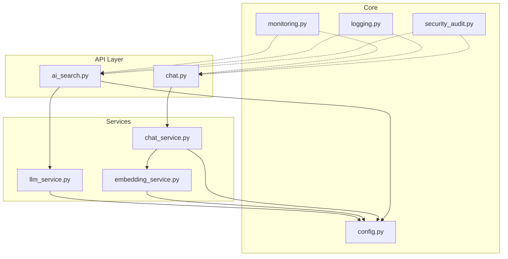
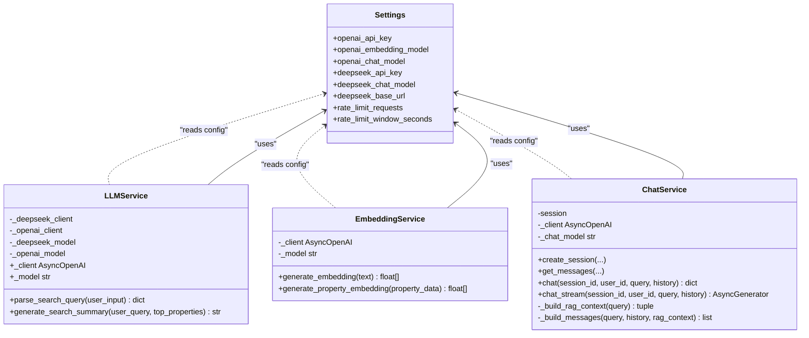
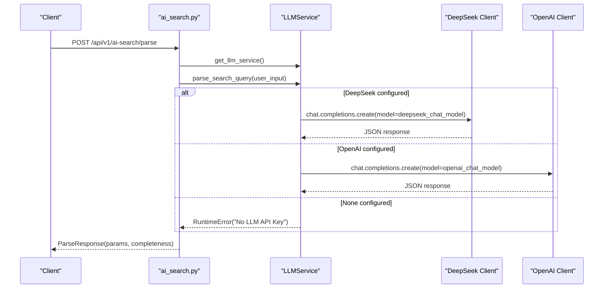
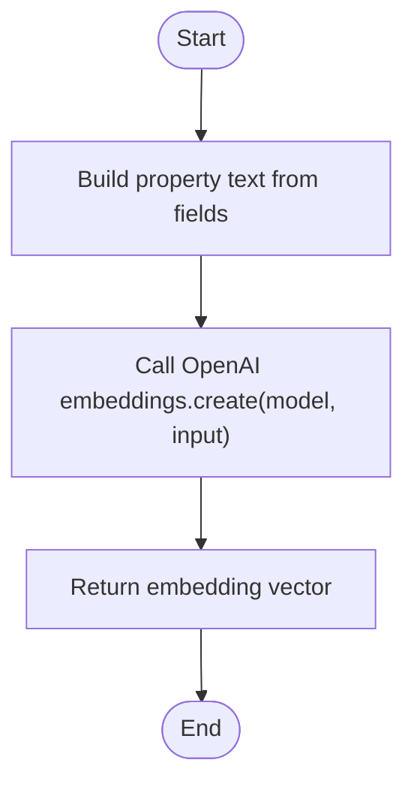
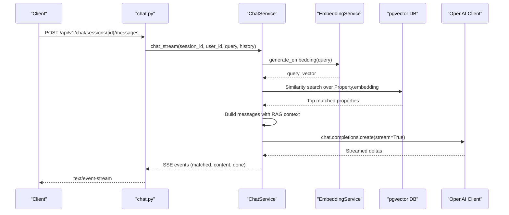
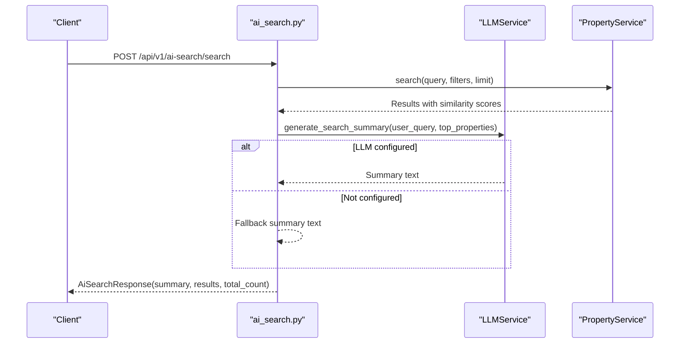
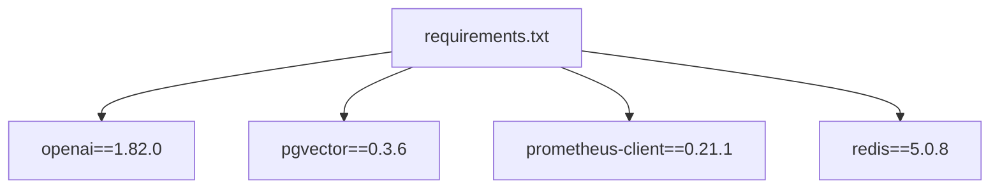

# AI Provider Integration & Configuration

<cite>
**Referenced Files in This Document**
- [config.py](file://backend/app/core/config.py)
- [llm_service.py](file://backend/app/services/llm_service.py)
- [embedding_service.py](file://backend/app/services/embedding_service.py)
- [chat_service.py](file://backend/app/services/chat_service.py)
- [ai_search.py](file://backend/app/api/v1/routes/ai_search.py)
- [chat.py](file://backend/app/api/v1/routes/chat.py)
- [monitoring.py](file://backend/app/core/monitoring.py)
- [logging.py](file://backend/app/core/logging.py)
- [security_audit.py](file://backend/app/core/security_audit.py)
- [requirements.txt](file://backend/requirements.txt)
</cite>

## Table of Contents
1. Introduction
2. Project Structure
3. Core Components
4. Architecture Overview
5. Detailed Component Analysis
6. Dependency Analysis
7. Performance Considerations
8. Troubleshooting Guide
9. Conclusion
10. Appendices

## Introduction
This document explains the AI provider integration and configuration management for the system, focusing on how multiple providers (OpenAI and DeepSeek) are supported through a modular architecture. It covers configuration of API keys, model selection, rate limiting, fallback mechanisms, provider abstraction, setup instructions, environment variables, credential management, model routing logic, cost optimization strategies, performance-based provider selection, error handling and retry behavior, usage monitoring, and security considerations.

## Project Structure
The AI-related functionality is implemented primarily under backend/app/services and backend/app/api/v1/routes, with configuration centralized in backend/app/core/config.py. The key modules involved are:
- Configuration: Settings for OpenAI and DeepSeek clients and models
- LLM Service: Unified interface to call DeepSeek or OpenAI with fallback
- Embedding Service: Vector embedding generation using OpenAI
- Chat Service: Conversational chat with RAG and streaming responses
- AI Search Route: Natural language parsing and search summary generation via LLMService
- Monitoring and Logging: Metrics and structured logging for observability
- Security and Rate Limiting: Middleware for request throttling

**Diagram sources**
- [ai_search.py:1-160](file://backend/app/api/v1/routes/ai_search.py#L1-L160)
- [chat.py:85-130](file://backend/app/api/v1/routes/chat.py#L85-L130)
- [llm_service.py:1-209](file://backend/app/services/llm_service.py#L1-L209)
- [embedding_service.py:1-32](file://backend/app/services/embedding_service.py#L1-L32)
- [chat_service.py:1-302](file://backend/app/services/chat_service.py#L1-L302)
- [config.py:1-167](file://backend/app/core/config.py#L1-L167)
- [monitoring.py:1-227](file://backend/app/core/monitoring.py#L1-L227)
- [logging.py:39-111](file://backend/app/core/logging.py#L39-L111)
- [security_audit.py:49-110](file://backend/app/core/security_audit.py#L49-L110)

**Section sources**
- [config.py:1-167](file://backend/app/core/config.py#L1-L167)
- [llm_service.py:1-209](file://backend/app/services/llm_service.py#L1-L209)
- [embedding_service.py:1-32](file://backend/app/services/embedding_service.py#L1-L32)
- [chat_service.py:1-302](file://backend/app/services/chat_service.py#L1-L302)
- [ai_search.py:1-160](file://backend/app/api/v1/routes/ai_search.py#L1-L160)
- [chat.py:85-130](file://backend/app/api/v1/routes/chat.py#L85-L130)
- [monitoring.py:1-227](file://backend/app/core/monitoring.py#L1-L227)
- [logging.py:39-111](file://backend/app/core/logging.py#L39-L111)
- [security_audit.py:49-110](file://backend/app/core/security_audit.py#L49-L110)

## Core Components
- Settings and Environment Variables: Centralized configuration for OpenAI and DeepSeek credentials and models, plus rate limiting parameters.
- LLMService: Unified provider abstraction that prefers DeepSeek and falls back to OpenAI; exposes parse_search_query and generate_search_summary.
- EmbeddingService: Uses OpenAI embeddings for vectorizing property text.
- ChatService: Provides non-streaming and streaming chat with RAG context built from pgvector similarity search; currently uses OpenAI client directly.
- AI Search Routes: Endpoints to parse natural language queries and generate summaries based on search results.
- Monitoring and Logging: Prometheus metrics and structured JSON logs for observability.
- Security and Rate Limiting: Token-bucket style rate limiter using Redis.

**Section sources**
- [config.py:46-70](file://backend/app/core/config.py#L46-L70)
- [config.py:154-161](file://backend/app/core/config.py#L154-L161)
- [llm_service.py:64-105](file://backend/app/services/llm_service.py#L64-L105)
- [embedding_service.py:17-32](file://backend/app/services/embedding_service.py#L17-L32)
- [chat_service.py:17-23](file://backend/app/services/chat_service.py#L17-L23)
- [ai_search.py:80-96](file://backend/app/api/v1/routes/ai_search.py#L80-L96)
- [ai_search.py:98-160](file://backend/app/api/v1/routes/ai_search.py#L98-L160)
- [monitoring.py:126-176](file://backend/app/core/monitoring.py#L126-L176)
- [logging.py:77-101](file://backend/app/core/logging.py#L77-L101)
- [security_audit.py:49-95](file://backend/app/core/security_audit.py#L49-L95)

## Architecture Overview
The system implements a provider abstraction layer to support multiple AI services. LLMService centralizes calls for parsing and summarization, preferring DeepSeek and falling back to OpenAI if configured. EmbeddingService and ChatService currently use OpenAI directly; ChatService integrates RAG by generating embeddings and querying pgvector for context before calling the chat completion endpoint.

**Diagram sources**
- [config.py:46-70](file://backend/app/core/config.py#L46-L70)
- [llm_service.py:64-105](file://backend/app/services/llm_service.py#L64-L105)
- [embedding_service.py:17-32](file://backend/app/services/embedding_service.py#L17-L32)
- [chat_service.py:17-23](file://backend/app/services/chat_service.py#L17-L23)

## Detailed Component Analysis

### LLMService (Provider Abstraction and Fallback)
LLMService initializes both DeepSeek and OpenAI clients when their respective API keys are present. It provides a unified interface for:
- Parsing natural language search queries into structured parameters
- Generating concise summaries of top search results

It selects the active client and model dynamically:
- Prefer DeepSeek if configured
- Fall back to OpenAI if DeepSeek is not available
- Raise an error if neither provider is configured

**Diagram sources**
- [ai_search.py:80-96](file://backend/app/api/v1/routes/ai_search.py#L80-L96)
- [llm_service.py:106-148](file://backend/app/services/llm_service.py#L106-L148)
- [llm_service.py:71-98](file://backend/app/services/llm_service.py#L71-L98)

**Section sources**
- [llm_service.py:64-105](file://backend/app/services/llm_service.py#L64-L105)
- [llm_service.py:106-148](file://backend/app/services/llm_service.py#L106-L148)
- [llm_service.py:150-198](file://backend/app/services/llm_service.py#L150-L198)
- [ai_search.py:80-96](file://backend/app/api/v1/routes/ai_search.py#L80-L96)

### EmbeddingService (Vector Embeddings)
EmbeddingService constructs text from property data and generates embeddings using OpenAI’s embeddings endpoint. It is used by ChatService to build RAG context by performing similarity searches against pgvector.

**Diagram sources**
- [embedding_service.py:6-14](file://backend/app/services/embedding_service.py#L6-L14)
- [embedding_service.py:23-28](file://backend/app/services/embedding_service.py#L23-L28)

**Section sources**
- [embedding_service.py:17-32](file://backend/app/services/embedding_service.py#L17-L32)

### ChatService (Chat with RAG and Streaming)
ChatService manages sessions and messages, builds RAG context by embedding the query and searching pgvector for similar properties, then calls OpenAI chat completions. It supports both full responses and streaming SSE chunks.

**Diagram sources**
- [chat.py:106-130](file://backend/app/api/v1/routes/chat.py#L106-L130)
- [chat_service.py:227-302](file://backend/app/services/chat_service.py#L227-L302)
- [chat_service.py:87-143](file://backend/app/services/chat_service.py#L87-L143)
- [embedding_service.py:23-28](file://backend/app/services/embedding_service.py#L23-L28)

**Section sources**
- [chat_service.py:171-225](file://backend/app/services/chat_service.py#L171-L225)
- [chat_service.py:227-302](file://backend/app/services/chat_service.py#L227-L302)
- [chat.py:106-130](file://backend/app/api/v1/routes/chat.py#L106-L130)

### AI Search Route (Parse and Summarize)
The AI search endpoints orchestrate natural language parsing and summary generation:
- /parse: Parses user input into structured search parameters and completeness hints
- /search: Executes property search and generates a concise summary using LLMService

**Diagram sources**
- [ai_search.py:98-160](file://backend/app/api/v1/routes/ai_search.py#L98-L160)
- [llm_service.py:150-198](file://backend/app/services/llm_service.py#L150-L198)

**Section sources**
- [ai_search.py:98-160](file://backend/app/api/v1/routes/ai_search.py#L98-L160)

## Dependency Analysis
External dependencies relevant to AI provider integration include:
- openai SDK for both chat and embeddings
- pgvector for similarity search
- prometheus-client for metrics
- redis for rate limiting

**Diagram sources**
- [requirements.txt:17-22](file://backend/requirements.txt#L17-L22)

**Section sources**
- [requirements.txt:17-22](file://backend/requirements.txt#L17-L22)

## Performance Considerations
- Model Selection Strategy:
  - Prefer DeepSeek for parsing and summarization due to lower cost; fall back to OpenAI if DeepSeek is unavailable.
  - Use smaller embedding models (e.g., text-embedding-3-small) for efficient vectorization.
- Streaming Responses:
  - Use streaming for chat to reduce perceived latency and improve UX.
- Rate Limiting:
  - Apply token-bucket rate limiting per IP and endpoint prefix to protect external APIs and maintain stability.
- Observability:
  - Track request counts, latencies, and in-flight requests via Prometheus middleware.
  - Use structured JSON logs in production to facilitate analysis.

[No sources needed since this section provides general guidance]

## Troubleshooting Guide
Common issues and resolutions:
- Missing API Keys:
  - If neither DeepSeek nor OpenAI keys are set, LLMService raises a runtime error during initialization. Ensure at least one provider is configured.
- Non-JSON LLM Output:
  - When parsing fails to return valid JSON, LLMService returns a default structure indicating missing fields and prompts for clarification.
- Provider Outages:
  - For AI search summary generation, failures are caught and handled gracefully with fallback text.
- Rate Limit Exceeded:
  - Requests exceeding configured limits receive HTTP 429 with Retry-After header. Adjust RATE_LIMIT_REQUESTS and RATE_LIMIT_WINDOW_SECONDS accordingly.
- Streaming Errors:
  - Chat stream errors are logged and returned as SSE events with error details.

**Section sources**
- [llm_service.py:71-98](file://backend/app/services/llm_service.py#L71-L98)
- [llm_service.py:125-148](file://backend/app/services/llm_service.py#L125-L148)
- [ai_search.py:136-152](file://backend/app/api/v1/routes/ai_search.py#L136-L152)
- [security_audit.py:66-95](file://backend/app/core/security_audit.py#L66-L95)
- [chat_service.py:298-302](file://backend/app/services/chat_service.py#L298-L302)

## Conclusion
The system provides a flexible and resilient AI provider integration layer supporting OpenAI and DeepSeek. LLMService abstracts provider differences and implements fallback logic, while EmbeddingService and ChatService leverage OpenAI for embeddings and chat respectively. Configuration is centralized, enabling easy switching between providers and tuning of models and rate limits. Monitoring and logging ensure operational visibility, and security measures like rate limiting protect against abuse.

[No sources needed since this section summarizes without analyzing specific files]

## Appendices

### Setup Instructions and Environment Variables
- Configure OpenAI:
  - OPENAI_API_KEY
  - OPENAI_EMBEDDING_MODEL
  - OPENAI_CHAT_MODEL
- Configure DeepSeek:
  - DEEPSEEK_API_KEY
  - DEEPSEEK_CHAT_MODEL
  - DEEPSEEK_BASE_URL
- Rate Limiting:
  - RATE_LIMIT_REQUESTS
  - RATE_LIMIT_WINDOW_SECONDS

Example .env entries:
- OPENAI_API_KEY=your_openai_key
- OPENAI_EMBEDDING_MODEL=text-embedding-3-small
- OPENAI_CHAT_MODEL=gpt-4o
- DEEPSEEK_API_KEY=your_deepseek_key
- DEEPSEEK_CHAT_MODEL=deepseek-chat
- DEEPSEEK_BASE_URL=https://api.deepseek.com
- RATE_LIMIT_REQUESTS=100
- RATE_LIMIT_WINDOW_SECONDS=60

**Section sources**
- [config.py:46-70](file://backend/app/core/config.py#L46-L70)
- [config.py:154-161](file://backend/app/core/config.py#L154-L161)

### Credential Management and Security Considerations
- Store secrets securely (e.g., environment variables, secret managers).
- Avoid logging sensitive data; use masked logging where applicable.
- Enforce HTTPS for all external API calls.
- Restrict access to /metrics endpoint in production.

**Section sources**
- [logging.py:103-111](file://backend/app/core/logging.py#L103-L111)
- [monitoring.py:167-176](file://backend/app/core/monitoring.py#L167-L176)

### Monitoring Provider Usage
- Prometheus metrics:
  - app_requests_total
  - app_request_duration_seconds
  - app_requests_in_flight
- Celery task metrics (if applicable):
  - celery_tasks_total
  - celery_task_duration_seconds
- Database pool metrics:
  - db_pool_size
  - db_pool_overflow
  - db_pool_checked_out

**Section sources**
- [monitoring.py:74-118](file://backend/app/core/monitoring.py#L74-L118)
- [monitoring.py:183-208](file://backend/app/core/monitoring.py#L183-L208)
- [monitoring.py:216-226](file://backend/app/core/monitoring.py#L216-L226)