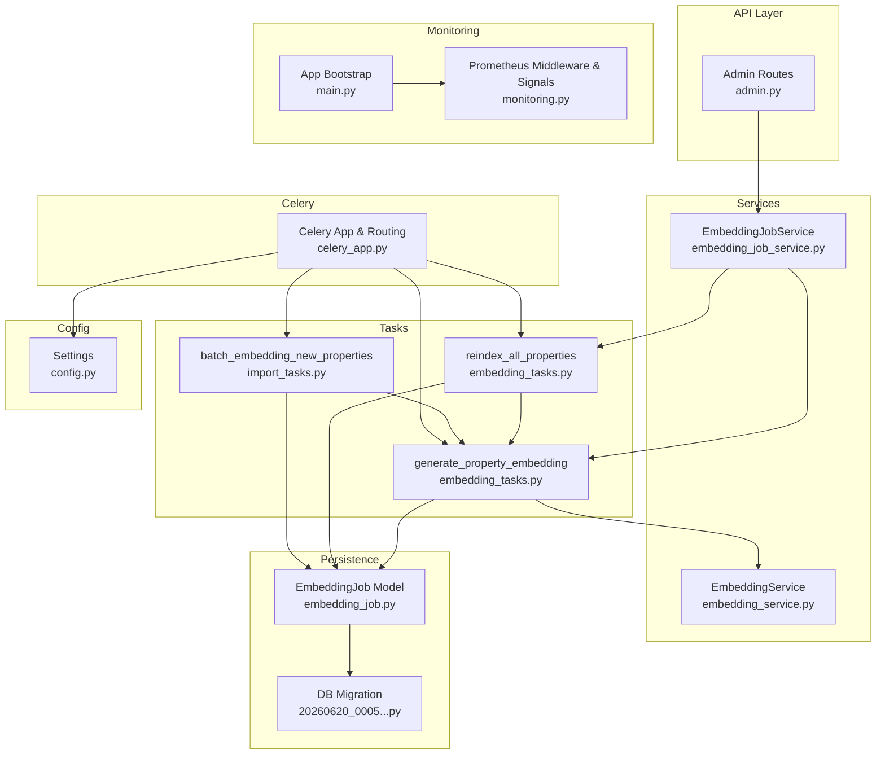
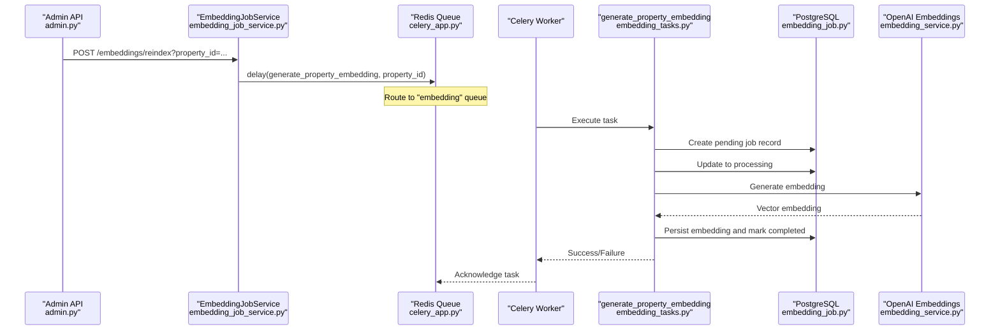
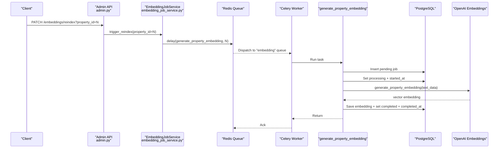
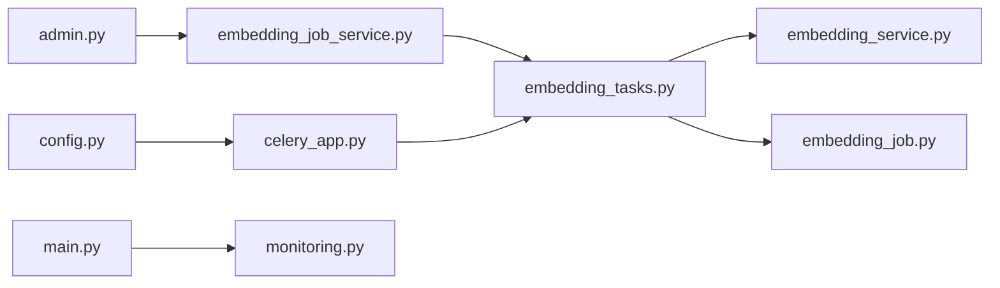
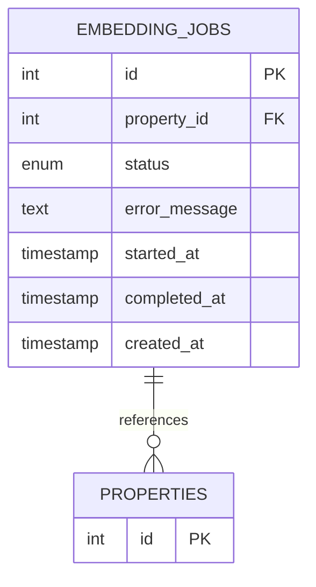

# Background Task Processing

<cite>
**Referenced Files in This Document**
- [celery_app.py](file://backend/app/celery_app.py)
- [embedding_tasks.py](file://backend/app/tasks/embedding_tasks.py)
- [import_tasks.py](file://backend/app/tasks/import_tasks.py)
- [embedding_job_service.py](file://backend/app/services/embedding_job_service.py)
- [embedding_service.py](file://backend/app/services/embedding_service.py)
- [embedding_job.py](file://backend/app/models/embedding_job.py)
- [admin.py](file://backend/app/api/v1/routes/admin.py)
- [main.py](file://backend/app/main.py)
- [monitoring.py](file://backend/app/core/monitoring.py)
- [config.py](file://backend/app/core/config.py)
- [20260620_0005_embedding_jobs_and_audit_logs.py](file://backend/alembic/versions/20260620_0005_embedding_jobs_and_audit_logs.py)
- [docker-compose.prod.yml](file://docker-compose.prod.yml)
</cite>

## Table of Contents
1. [Introduction](#introduction)
2. [Project Structure](#project-structure)
3. [Core Components](#core-components)
4. [Architecture Overview](#architecture-overview)
5. [Detailed Component Analysis](#detailed-component-analysis)
6. [Dependency Analysis](#dependency-analysis)
7. [Performance Considerations](#performance-considerations)
8. [Troubleshooting Guide](#troubleshooting-guide)
9. [Conclusion](#conclusion)
10. [Appendices](#appendices)

## Introduction
This document explains the background task processing system built with Celery for AI-related operations, focusing on embedding generation and reindexing workflows. It covers the queue architecture, task creation, worker distribution, result tracking via database job records, asynchronous processing patterns, retry and error handling, monitoring and logging, configuration options, scheduling considerations, operational examples, and scalability strategies.

## Project Structure
The background task system is implemented within the backend application:
- Celery app initialization and routing are defined centrally.
- Tasks live under a dedicated tasks package.
- Services encapsulate business logic (e.g., embedding service).
- Models define persistent state for jobs.
- Admin API endpoints trigger reindexing and expose stats.
- Monitoring integrates Prometheus metrics for HTTP and Celery tasks.
- Configuration is centralized and environment-driven.
- Docker Compose defines worker runtime settings.

**Diagram sources**
- [admin.py:112-132](file://backend/app/api/v1/routes/admin.py#L112-L132)
- [embedding_job_service.py:1-54](file://backend/app/services/embedding_job_service.py#L1-L54)
- [embedding_tasks.py:1-112](file://backend/app/tasks/embedding_tasks.py#L1-L112)
- [import_tasks.py:1-44](file://backend/app/tasks/import_tasks.py#L1-L44)
- [embedding_service.py:1-32](file://backend/app/services/embedding_service.py#L1-L32)
- [embedding_job.py:1-35](file://backend/app/models/embedding_job.py#L1-L35)
- [celery_app.py:1-31](file://backend/app/celery_app.py#L1-L31)
- [monitoring.py:1-227](file://backend/app/core/monitoring.py#L1-L227)
- [main.py:1-82](file://backend/app/main.py#L1-L82)
- [config.py:1-167](file://backend/app/core/config.py#L1-L167)
- [20260620_0005_embedding_jobs_and_audit_logs.py:1-67](file://backend/alembic/versions/20260620_0005_embedding_jobs_and_audit_logs.py#L1-L67)

**Section sources**
- [celery_app.py:1-31](file://backend/app/celery_app.py#L1-L31)
- [embedding_tasks.py:1-112](file://backend/app/tasks/embedding_tasks.py#L1-L112)
- [import_tasks.py:1-44](file://backend/app/tasks/import_tasks.py#L1-L44)
- [embedding_job_service.py:1-54](file://backend/app/services/embedding_job_service.py#L1-L54)
- [embedding_service.py:1-32](file://backend/app/services/embedding_service.py#L1-L32)
- [embedding_job.py:1-35](file://backend/app/models/embedding_job.py#L1-L35)
- [admin.py:112-132](file://backend/app/api/v1/routes/admin.py#L112-L132)
- [main.py:1-82](file://backend/app/main.py#L1-L82)
- [monitoring.py:1-227](file://backend/app/core/monitoring.py#L1-L227)
- [config.py:1-167](file://backend/app/core/config.py#L1-L167)
- [20260620_0005_embedding_jobs_and_audit_logs.py:1-67](file://backend/alembic/versions/20260620_0005_embedding_jobs_and_audit_logs.py#L1-L67)

## Core Components
- Celery Application and Routing
  - Initializes Celery with Redis as broker and result backend, sets JSON serialization, timezone, and routes specific tasks to dedicated queues.
- Embedding Tasks
  - generate_property_embedding: Creates an EmbeddingJob record, updates status transitions, calls EmbeddingService to produce embeddings, and persists results or errors.
  - reindex_all_properties: Scans properties without embeddings and enqueues individual embedding tasks.
  - batch_embedding_new_properties: Similar to reindex but used for bulk ingestion scenarios.
- Embedding Job Service
  - Provides list and stats queries over EmbeddingJob records and triggers reindexing via tasks.
- Embedding Service
  - Wraps async OpenAI client to generate embeddings from property text fields.
- Embedding Job Model
  - Defines job lifecycle states and timestamps persisted in the database.
- Admin API Endpoints
  - Expose /embeddings/stats and /embeddings/reindex to monitor and trigger background work.
- Monitoring
  - Prometheus middleware for HTTP metrics and Celery signal handlers for task-level metrics; exposed at /metrics.
- Configuration
  - Centralized settings including Redis URL, database URLs, and OpenAI parameters.

**Section sources**
- [celery_app.py:1-31](file://backend/app/celery_app.py#L1-L31)
- [embedding_tasks.py:1-112](file://backend/app/tasks/embedding_tasks.py#L1-L112)
- [import_tasks.py:1-44](file://backend/app/tasks/import_tasks.py#L1-L44)
- [embedding_job_service.py:1-54](file://backend/app/services/embedding_job_service.py#L1-L54)
- [embedding_service.py:1-32](file://backend/app/services/embedding_service.py#L1-L32)
- [embedding_job.py:1-35](file://backend/app/models/embedding_job.py#L1-L35)
- [admin.py:112-132](file://backend/app/api/v1/routes/admin.py#L112-L132)
- [monitoring.py:1-227](file://backend/app/core/monitoring.py#L1-L227)
- [config.py:1-167](file://backend/app/core/config.py#L1-L167)

## Architecture Overview
The system uses a producer-consumer pattern:
- Producers (APIs and services) enqueue tasks to Redis-backed queues.
- Workers consume tasks from queues, perform async DB operations, call external AI APIs, and persist job outcomes.
- Results and progress are tracked via database records and Prometheus metrics.

**Diagram sources**
- [admin.py:120-132](file://backend/app/api/v1/routes/admin.py#L120-L132)
- [embedding_job_service.py:45-54](file://backend/app/services/embedding_job_service.py#L45-L54)
- [celery_app.py:26-29](file://backend/app/celery_app.py#L26-L29)
- [embedding_tasks.py:16-80](file://backend/app/tasks/embedding_tasks.py#L16-L80)
- [embedding_service.py:17-32](file://backend/app/services/embedding_service.py#L17-L32)
- [embedding_job.py:17-35](file://backend/app/models/embedding_job.py#L17-L35)

## Detailed Component Analysis

### Celery Application and Routing
- Initializes Celery with Redis for both broker and backend.
- Configures JSON serialization and timezone.
- Sets connection timeouts and eager execution flags via environment variables.
- Routes embedding and import tasks to dedicated queues.

Operational implications:
- Dedicated queues allow targeted worker scaling per workload.
- Eager mode can be enabled for tests or local development.

**Section sources**
- [celery_app.py:1-31](file://backend/app/celery_app.py#L1-L31)

### Embedding Tasks
- generate_property_embedding
  - Lifecycle management: creates pending job, marks processing, attempts embedding generation, then marks completed or failed with error messages and timestamps.
  - Uses async SQLAlchemy sessions inside asyncio.run to interact with the database.
  - Integrates with EmbeddingService to call OpenAI embeddings.
  - Raises exceptions to trigger Celery retries.
- reindex_all_properties
  - Queries properties missing embeddings and enqueues per-property tasks.
- batch_embedding_new_properties
  - Similar scanning and batching behavior for import pipelines.

Retry and error handling:
- All tasks declare autoretry_for=(Exception,), retry_backoff=True, max_retries=3.
- Errors are captured in job records and logged.

**Section sources**
- [embedding_tasks.py:1-112](file://backend/app/tasks/embedding_tasks.py#L1-L112)
- [import_tasks.py:1-44](file://backend/app/tasks/import_tasks.py#L1-L44)

#### Sequence Diagram: Single Property Reindex

**Diagram sources**
- [admin.py:120-132](file://backend/app/api/v1/routes/admin.py#L120-L132)
- [embedding_job_service.py:45-54](file://backend/app/services/embedding_job_service.py#L45-L54)
- [embedding_tasks.py:16-80](file://backend/app/tasks/embedding_tasks.py#L16-L80)
- [embedding_service.py:17-32](file://backend/app/services/embedding_service.py#L17-L32)
- [embedding_job.py:17-35](file://backend/app/models/embedding_job.py#L17-L35)

### Embedding Job Service
- Lists recent jobs with pagination.
- Computes aggregate stats by status.
- Triggers single or full reindex by dispatching appropriate tasks.

Use cases:
- Admin dashboards display job counts and lists.
- Administrative actions initiate reindexing.

**Section sources**
- [embedding_job_service.py:1-54](file://backend/app/services/embedding_job_service.py#L1-L54)

### Embedding Service
- Builds descriptive text from property fields.
- Calls AsyncOpenAI to generate embeddings using configured model.

Integration notes:
- Requires OPENAI_API_KEY and OPENAI_EMBEDDING_MODEL settings.

**Section sources**
- [embedding_service.py:1-32](file://backend/app/services/embedding_service.py#L1-L32)
- [config.py:46-53](file://backend/app/core/config.py#L46-L53)

### Embedding Job Model and Database Schema
- Status enum: pending, processing, completed, failed.
- Timestamps for created_at, started_at, completed_at.
- Error message storage for diagnostics.
- Foreign key to properties with cascade delete.

Migration:
- Adds embedding_jobs table and indexes.

**Section sources**
- [embedding_job.py:1-35](file://backend/app/models/embedding_job.py#L1-L35)
- [20260620_0005_embedding_jobs_and_audit_logs.py:19-36](file://backend/alembic/versions/20260620_0005_embedding_jobs_and_audit_logs.py#L19-L36)

### Admin API Endpoints
- GET /embeddings/stats: Returns job statistics.
- POST /embeddings/reindex: Optional property_id to reindex a single property or all if omitted.

Security:
- Protected by admin requirement.

**Section sources**
- [admin.py:112-132](file://backend/app/api/v1/routes/admin.py#L112-L132)

### Monitoring and Logging
- PrometheusMiddleware tracks HTTP request counts, latency, and in-flight requests.
- install_celery_metrics installs Celery signals to track task count and duration.
- /metrics endpoint exposes Prometheus text format.
- App bootstrap adds middleware and mounts metrics endpoint.

Observability:
- Combine job status in DB with Prometheus metrics for comprehensive visibility.

**Section sources**
- [monitoring.py:74-118](file://backend/app/core/monitoring.py#L74-L118)
- [monitoring.py:126-176](file://backend/app/core/monitoring.py#L126-L176)
- [monitoring.py:183-208](file://backend/app/core/monitoring.py#L183-L208)
- [main.py:41-70](file://backend/app/main.py#L41-L70)

### Configuration Options
- Redis URL for broker/backend.
- Database URLs for async and sync access.
- OpenAI keys and model selection.
- Timezone and UTC enablement in Celery app.
- Environment toggles for eager task execution.

**Section sources**
- [config.py:15-24](file://backend/app/core/config.py#L15-L24)
- [config.py:46-53](file://backend/app/core/config.py#L46-L53)
- [celery_app.py:9-18](file://backend/app/celery_app.py#L9-L18)
- [celery_app.py:20-30](file://backend/app/celery_app.py#L20-L30)

## Dependency Analysis
Key relationships:
- Admin API depends on EmbeddingJobService.
- EmbeddingJobService dispatches tasks via Celery.
- Tasks depend on EmbeddingService and DB models.
- Celery app configures routing and serialization.
- Monitoring hooks into FastAPI and Celery signals.

**Diagram sources**
- [admin.py:112-132](file://backend/app/api/v1/routes/admin.py#L112-L132)
- [embedding_job_service.py:1-54](file://backend/app/services/embedding_job_service.py#L1-L54)
- [embedding_tasks.py:1-112](file://backend/app/tasks/embedding_tasks.py#L1-L112)
- [embedding_service.py:1-32](file://backend/app/services/embedding_service.py#L1-L32)
- [embedding_job.py:1-35](file://backend/app/models/embedding_job.py#L1-L35)
- [celery_app.py:1-31](file://backend/app/celery_app.py#L1-L31)
- [main.py:1-82](file://backend/app/main.py#L1-L82)
- [monitoring.py:1-227](file://backend/app/core/monitoring.py#L1-L227)
- [config.py:1-167](file://backend/app/core/config.py#L1-L167)

**Section sources**
- [admin.py:112-132](file://backend/app/api/v1/routes/admin.py#L112-L132)
- [embedding_job_service.py:1-54](file://backend/app/services/embedding_job_service.py#L1-L54)
- [embedding_tasks.py:1-112](file://backend/app/tasks/embedding_tasks.py#L1-L112)
- [embedding_service.py:1-32](file://backend/app/services/embedding_service.py#L1-L32)
- [embedding_job.py:1-35](file://backend/app/models/embedding_job.py#L1-L35)
- [celery_app.py:1-31](file://backend/app/celery_app.py#L1-L31)
- [main.py:1-82](file://backend/app/main.py#L1-L82)
- [monitoring.py:1-227](file://backend/app/core/monitoring.py#L1-L227)
- [config.py:1-167](file://backend/app/core/config.py#L1-L167)

## Performance Considerations
- Concurrency and Queues
  - Workers listen to multiple queues (celery, embedding, import) and concurrency is configurable.
  - Separate queues isolate embedding workloads for independent scaling.
- Resource Limits
  - Container memory limits/reservations constrain worker resource usage.
- External API Latency
  - Embedding generation depends on OpenAI; consider backoff and rate limiting at the service layer.
- Database Pool Usage
  - Each task opens its own async engine/session; ensure pool sizing aligns with expected concurrent tasks.
- Metrics
  - Use Prometheus metrics to observe task durations and throughput; tune concurrency based on observed latencies.

[No sources needed since this section provides general guidance]

## Troubleshooting Guide
Common issues and diagnostics:
- Jobs stuck in pending
  - Verify workers are running and listening to the correct queues.
  - Check Redis connectivity and broker URL configuration.
- Frequent failures
  - Inspect job error_message and logs.
  - Confirm OpenAI credentials and model availability.
- Slow performance
  - Review Prometheus histograms for task durations.
  - Adjust worker concurrency and memory limits.
- Missing embeddings after updates
  - Trigger reindex via admin endpoint and verify job stats.

Operational checks:
- Ensure /metrics endpoint is reachable.
- Validate that task routes map to the intended queues.
- Confirm database migrations have been applied.

**Section sources**
- [embedding_tasks.py:40-76](file://backend/app/tasks/embedding_tasks.py#L40-L76)
- [monitoring.py:183-208](file://backend/app/core/monitoring.py#L183-L208)
- [celery_app.py:20-30](file://backend/app/celery_app.py#L20-L30)
- [admin.py:112-132](file://backend/app/api/v1/routes/admin.py#L112-L132)

## Conclusion
The background task system leverages Celery with Redis to decouple embedding generation and reindexing from the web API. Jobs are persisted with clear lifecycle states, enabling robust tracking and diagnostics. Prometheus integration provides observability across HTTP and task execution. The design supports scalable worker deployment with dedicated queues and configurable concurrency, while maintaining reliable retry and error handling semantics.

[No sources needed since this section summarizes without analyzing specific files]

## Appendices

### Example Workflows

- Trigger reindex for a single property
  - Call PATCH /api/v1/admin/embeddings/reindex?property_id=<id>.
  - Observe job creation and status transitions in the database.
  - Monitor Prometheus metrics at /metrics for task latency and counts.

- Trigger full reindex
  - Call POST /api/v1/admin/embeddings/reindex without property_id.
  - System enqueues one task per property missing embeddings.

- Monitor job stats
  - Call GET /api/v1/admin/embeddings/stats to retrieve totals by status.

- View job list
  - Use EmbeddingJobService.list_jobs to paginate recent jobs.

**Section sources**
- [admin.py:112-132](file://backend/app/api/v1/routes/admin.py#L112-L132)
- [embedding_job_service.py:11-43](file://backend/app/services/embedding_job_service.py#L11-L43)
- [monitoring.py:167-176](file://backend/app/core/monitoring.py#L167-L176)

### Worker Scaling and Load Balancing
- Scale horizontally by running multiple worker containers.
- Assign workers to specific queues to balance load across embedding vs import workloads.
- Tune concurrency based on CPU/memory constraints and external API rate limits.

**Section sources**
- [docker-compose.prod.yml:114-118](file://docker-compose.prod.yml#L114-L118)
- [celery_app.py:26-29](file://backend/app/celery_app.py#L26-L29)

### Data Model Reference

**Diagram sources**
- [embedding_job.py:17-35](file://backend/app/models/embedding_job.py#L17-L35)
- [20260620_0005_embedding_jobs_and_audit_logs.py:22-36](file://backend/alembic/versions/20260620_0005_embedding_jobs_and_audit_logs.py#L22-L36)