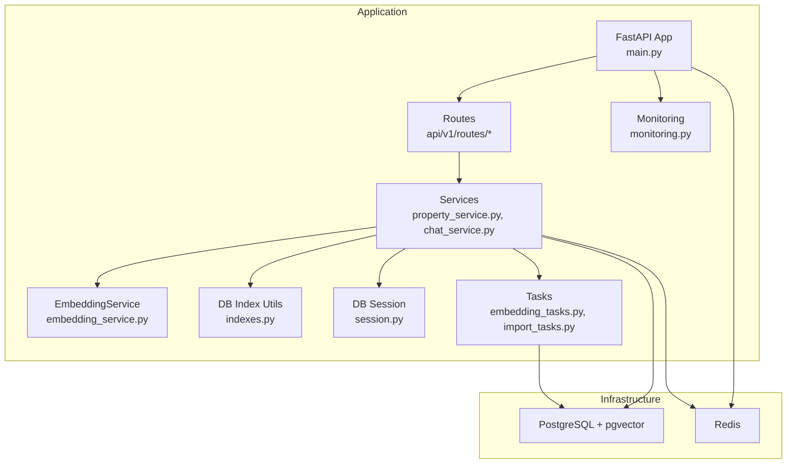
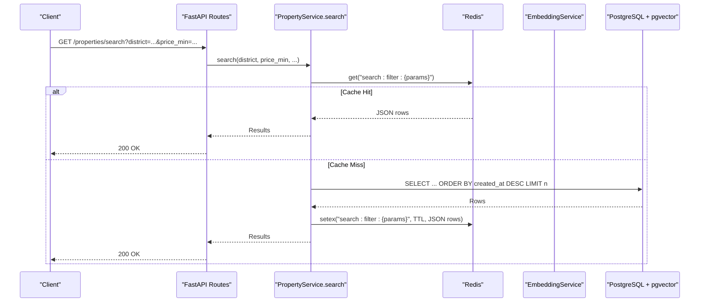
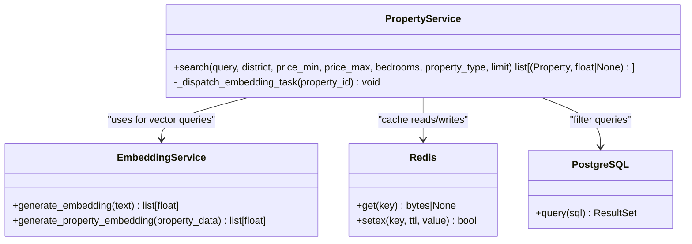
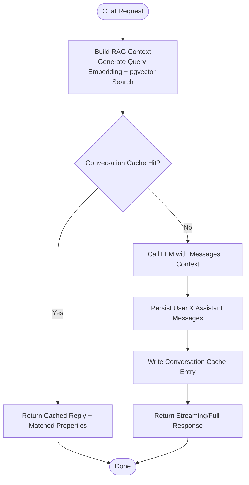
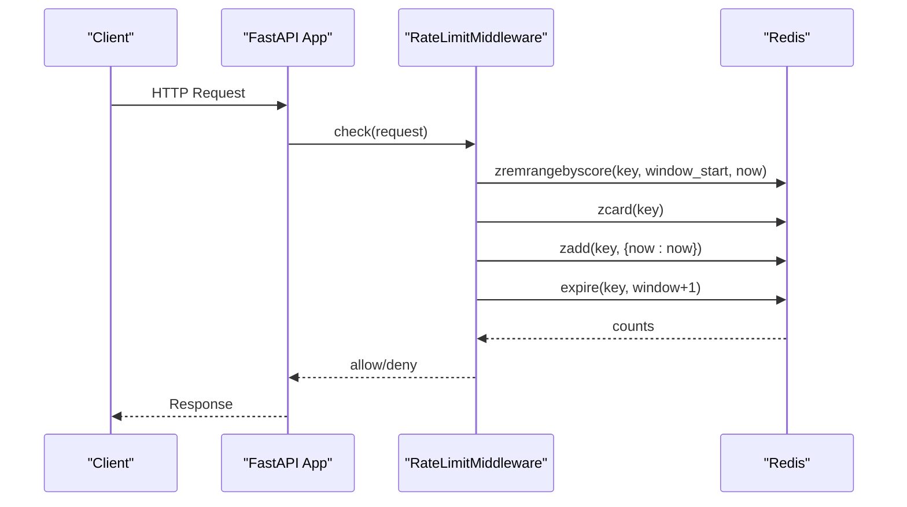
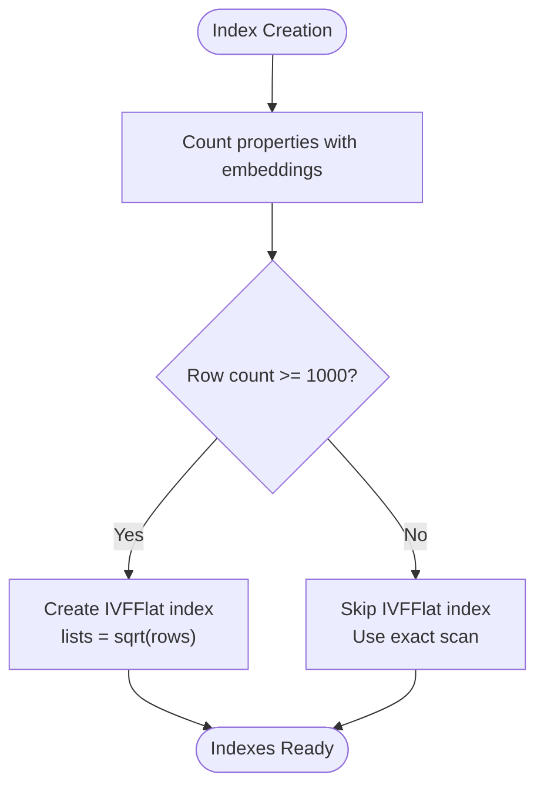
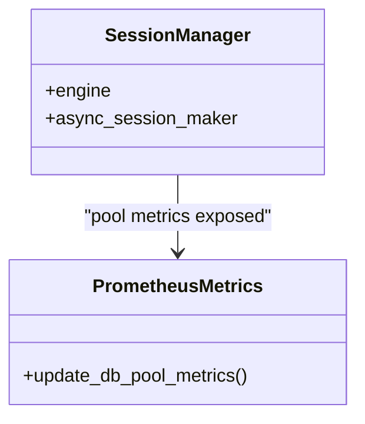
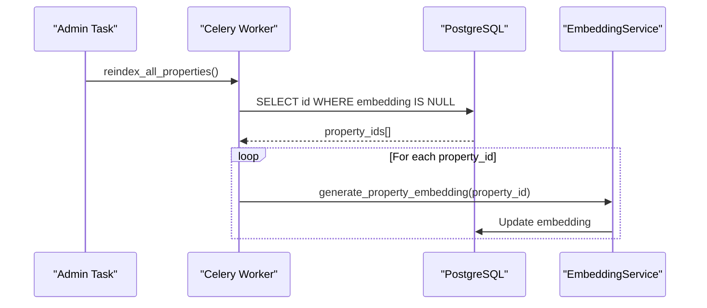
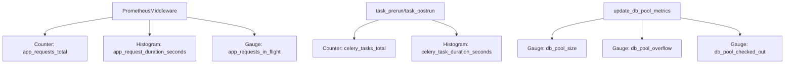
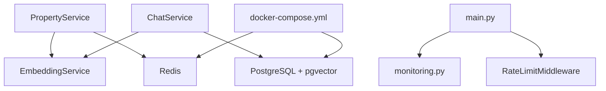

# Performance Optimization & Caching

<cite>
**Referenced Files in This Document**
- [main.py](file://backend/app/main.py)
- [config.py](file://backend/app/core/config.py)
- [monitoring.py](file://backend/app/core/monitoring.py)
- [property_service.py](file://backend/app/services/property_service.py)
- [embedding_service.py](file://backend/app/services/embedding_service.py)
- [chat_service.py](file://backend/app/services/chat_service.py)
- [indexes.py](file://backend/app/db/indexes.py)
- [session.py](file://backend/app/db/session.py)
- [embedding_tasks.py](file://backend/app/tasks/embedding_tasks.py)
- [import_tasks.py](file://backend/app/tasks/import_tasks.py)
- [chat.py](file://backend/app/api/v1/routes/chat.py)
- [docker-compose.yml](file://docker-compose.yml)
</cite>

## Table of Contents
1. [Introduction](#introduction)
2. [Project Structure](#project-structure)
3. [Core Components](#core-components)
4. [Architecture Overview](#architecture-overview)
5. [Detailed Component Analysis](#detailed-component-analysis)
6. [Dependency Analysis](#dependency-analysis)
7. [Performance Considerations](#performance-considerations)
8. [Troubleshooting Guide](#troubleshooting-guide)
9. [Conclusion](#conclusion)
10. [Appendices](#appendices)

## Introduction
This document explains performance optimization and caching strategies for AI features in the system, focusing on:
- Embedding caching to reduce API calls and costs
- Conversation caching for common queries and response patterns
- Redis integration for distributed caching and rate limiting
- Cache invalidation and warming techniques
- Vector search optimization with pgvector indexes and query tuning
- Connection pooling and async session management
- Request batching and parallel processing via Celery tasks
- Monitoring metrics, latency tracking, and bottleneck identification
- Configuration examples, tuning parameters, and monitoring dashboards
- Memory management, garbage collection, and resource utilization
- Load testing approaches and capacity planning

## Project Structure
The backend is a FastAPI application with layered architecture:
- API routes (FastAPI routers)
- Services (business logic)
- Models (SQLAlchemy ORM)
- Core (configuration, logging, security, monitoring)
- Tasks (Celery background jobs)
- Database (PostgreSQL + pgvector), Redis for caching and rate limiting

**Diagram sources**
- [main.py:17-78](file://backend/app/main.py#L17-L78)
- [property_service.py:91-195](file://backend/app/services/property_service.py#L91-L195)
- [embedding_service.py:17-32](file://backend/app/services/embedding_service.py#L17-L32)
- [indexes.py:16-48](file://backend/app/db/indexes.py#L16-L48)
- [monitoring.py:126-175](file://backend/app/core/monitoring.py#L126-L175)
- [session.py:1-14](file://backend/app/db/session.py#L1-L14)
- [embedding_tasks.py:16-80](file://backend/app/tasks/embedding_tasks.py#L16-L80)
- [import_tasks.py:13-43](file://backend/app/tasks/import_tasks.py#L13-L43)

**Section sources**
- [main.py:17-78](file://backend/app/main.py#L17-L78)
- [docker-compose.yml:29-46](file://docker-compose.yml#L29-L46)

## Core Components
- PropertyService.search: Implements filter-based search with optional vector similarity when a text query is provided. It caches non-vector results in Redis and avoids embedding generation for cached hits.
- EmbeddingService: Wraps OpenAI embeddings client to generate vectors from property text or user queries.
- ChatService: Provides chat sessions and streaming responses; builds RAG context by generating embeddings and querying pgvector for relevant properties.
- Redis Integration: Used for search result caching and rate limiting.
- Database Indexing: IVFFlat index creation for vector similarity and composite indexes for frequent queries.
- Monitoring: Prometheus middleware and gauges for HTTP requests, task execution, and DB pool status.
- Celery Tasks: Asynchronous embedding generation and batch reindexing.

**Section sources**
- [property_service.py:91-195](file://backend/app/services/property_service.py#L91-L195)
- [embedding_service.py:17-32](file://backend/app/services/embedding_service.py#L17-L32)
- [chat_service.py:87-142](file://backend/app/services/chat_service.py#L87-L142)
- [indexes.py:16-48](file://backend/app/db/indexes.py#L16-L48)
- [monitoring.py:126-175](file://backend/app/core/monitoring.py#L126-L175)
- [embedding_tasks.py:16-80](file://backend/app/tasks/embedding_tasks.py#L16-L80)
- [import_tasks.py:13-43](file://backend/app/tasks/import_tasks.py#L13-L43)

## Architecture Overview
The system integrates AI services (OpenAI embeddings and chat) with PostgreSQL/pgvector for semantic search and Redis for caching and rate limiting. Background tasks handle embedding generation asynchronously.

**Diagram sources**
- [property_service.py:91-195](file://backend/app/services/property_service.py#L91-L195)
- [docker-compose.yml:29-46](file://docker-compose.yml#L29-L46)

**Section sources**
- [property_service.py:91-195](file://backend/app/services/property_service.py#L91-L195)

## Detailed Component Analysis

### Embedding Service and Caching Strategy
- EmbeddingService generates embeddings using an async OpenAI client configured via settings.
- PropertyService.search uses Redis to cache deterministic filter-based queries (no text query). The cache key is derived from normalized parameters and TTL is set for short-lived results.
- When a text query is present, the service generates an embedding and performs vector similarity search; these results are not cached in the current implementation.

**Diagram sources**
- [embedding_service.py:17-32](file://backend/app/services/embedding_service.py#L17-L32)
- [property_service.py:91-195](file://backend/app/services/property_service.py#L91-L195)

**Section sources**
- [embedding_service.py:17-32](file://backend/app/services/embedding_service.py#L17-L32)
- [property_service.py:91-195](file://backend/app/services/property_service.py#L91-L195)

### Conversation Caching System
- ChatService provides both non-streaming and streaming chat endpoints. It builds RAG context by generating embeddings and retrieving top-k similar properties from pgvector.
- Current implementation does not cache conversation responses; it persists messages and streamed content to the database.
- To implement conversation caching:
  - Define a cache key based on session_id, user_id, and normalized query.
  - Cache assistant replies with metadata (matched_properties) and a TTL appropriate for conversational freshness.
  - Invalidate cache entries upon session updates or explicit refresh.

[No sources needed since this diagram shows conceptual workflow, not actual code structure]

### Redis Integration for Distributed Caching and Rate Limiting
- Redis is used for:
  - Search result caching (non-vector filters) with TTL.
  - Rate limiting per client IP and endpoint prefix using a token-bucket-like approach.
- Docker Compose configures Redis with persistence and memory policies suitable for development.

**Diagram sources**
- [main.py:44-57](file://backend/app/main.py#L44-L57)
- [docker-compose.yml:29-46](file://docker-compose.yml#L29-L46)

**Section sources**
- [property_service.py:31-41](file://backend/app/services/property_service.py#L31-L41)
- [main.py:44-57](file://backend/app/main.py#L44-L57)
- [docker-compose.yml:29-46](file://docker-compose.yml#L29-L46)

### Vector Search Optimization (pgvector)
- IVFFlat index creation adapts lists parameter to sqrt(row_count) for optimal recall/performance when row count exceeds threshold.
- Composite indexes are created for booking queries to optimize common access patterns.
- Performance checks include EXPLAIN ANALYZE for representative queries.

**Diagram sources**
- [indexes.py:16-48](file://backend/app/db/indexes.py#L16-L48)

**Section sources**
- [indexes.py:16-48](file://backend/app/db/indexes.py#L16-L48)
- [indexes.py:51-88](file://backend/app/db/indexes.py#L51-L88)
- [indexes.py:100-117](file://backend/app/db/indexes.py#L100-L117)

### Connection Pooling and Async Sessions
- SQLAlchemy async engine and sessionmaker are configured centrally.
- Monitoring exposes DB pool size, overflow, and checked-out connections via Prometheus gauges.

**Diagram sources**
- [session.py:1-14](file://backend/app/db/session.py#L1-L14)
- [monitoring.py:216-226](file://backend/app/core/monitoring.py#L216-L226)

**Section sources**
- [session.py:1-14](file://backend/app/db/session.py#L1-L14)
- [monitoring.py:105-118](file://backend/app/core/monitoring.py#L105-L118)
- [monitoring.py:216-226](file://backend/app/core/monitoring.py#L216-L226)

### Request Batching and Parallel Processing (Celery)
- Celery tasks generate embeddings for individual properties and batch reindex all missing embeddings.
- Tasks use autoretry and backoff for resilience.
- Import tasks can enqueue batch embedding jobs for new properties.

**Diagram sources**
- [embedding_tasks.py:83-111](file://backend/app/tasks/embedding_tasks.py#L83-L111)
- [import_tasks.py:13-43](file://backend/app/tasks/import_tasks.py#L13-L43)

**Section sources**
- [embedding_tasks.py:16-80](file://backend/app/tasks/embedding_tasks.py#L16-L80)
- [embedding_tasks.py:83-111](file://backend/app/tasks/embedding_tasks.py#L83-L111)
- [import_tasks.py:13-43](file://backend/app/tasks/import_tasks.py#L13-L43)

### Monitoring Metrics, Latency Tracking, and Bottleneck Identification
- Prometheus middleware collects request counts, latencies, and in-flight requests.
- Celery signals track task counts and durations.
- DB pool metrics expose connection pool health.
- Logging middleware records request duration and status codes.

**Diagram sources**
- [monitoring.py:126-175](file://backend/app/core/monitoring.py#L126-L175)
- [monitoring.py:183-208](file://backend/app/core/monitoring.py#L183-L208)
- [monitoring.py:216-226](file://backend/app/core/monitoring.py#L216-L226)

**Section sources**
- [monitoring.py:74-118](file://backend/app/core/monitoring.py#L74-L118)
- [monitoring.py:126-175](file://backend/app/core/monitoring.py#L126-L175)
- [monitoring.py:183-208](file://backend/app/core/monitoring.py#L183-L208)
- [monitoring.py:216-226](file://backend/app/core/monitoring.py#L216-L226)

## Dependency Analysis
Key dependencies and relationships:
- PropertyService depends on EmbeddingService for vector queries and Redis for caching.
- ChatService depends on EmbeddingService and pgvector for RAG context building.
- Main app wires Prometheus middleware, rate limiter, and metrics endpoint.
- Docker Compose defines PostgreSQL and Redis services.

**Diagram sources**
- [property_service.py:91-195](file://backend/app/services/property_service.py#L91-L195)
- [chat_service.py:87-142](file://backend/app/services/chat_service.py#L87-L142)
- [main.py:41-69](file://backend/app/main.py#L41-L69)
- [docker-compose.yml:9-46](file://docker-compose.yml#L9-L46)

**Section sources**
- [property_service.py:91-195](file://backend/app/services/property_service.py#L91-L195)
- [chat_service.py:87-142](file://backend/app/services/chat_service.py#L87-L142)
- [main.py:41-69](file://backend/app/main.py#L41-L69)
- [docker-compose.yml:9-46](file://docker-compose.yml#L9-L46)

## Performance Considerations
- Embedding caching:
  - Cache deterministic filter-based searches with TTL to reduce DB load and avoid unnecessary embedding calls.
  - Consider adding cache keys for vector queries if repeated identical queries occur frequently.
- Conversation caching:
  - Implement cache for assistant replies keyed by session and query normalization.
  - Use short TTLs to maintain freshness and invalidate on session updates.
- Redis configuration:
  - Set maxmemory and eviction policy appropriate for workload (e.g., allkeys-lru).
  - Enable persistence (AOF/RDB) depending on durability requirements.
- Vector search tuning:
  - Adjust IVFFlat lists parameter based on dataset size.
  - Add composite indexes for high-frequency filters.
  - Use EXPLAIN ANALYZE to validate plans and identify bottlenecks.
- Connection pooling:
  - Monitor pool size, overflow, and checked-out connections.
  - Tune pool parameters based on concurrency and DB capacity.
- Background processing:
  - Use Celery tasks for embedding generation and batch reindexing.
  - Configure retries and backoff for resilience.
- Monitoring:
  - Track request latency histograms and error rates.
  - Observe Celery task durations and failure counts.
  - Alert on DB pool saturation and Redis memory pressure.

[No sources needed since this section provides general guidance]

## Troubleshooting Guide
- Redis unavailable:
  - Search caching falls back gracefully without errors; verify connectivity and configuration.
- Embedding failures:
  - Celery tasks log exceptions and update job status; inspect task logs and retry behavior.
- High latency:
  - Review Prometheus histograms for slow endpoints; analyze DB plans with EXPLAIN ANALYZE.
- Rate limiting issues:
  - Ensure Redis is reachable; confirm window and limits in settings.

**Section sources**
- [property_service.py:31-41](file://backend/app/services/property_service.py#L31-L41)
- [embedding_tasks.py:70-76](file://backend/app/tasks/embedding_tasks.py#L70-L76)
- [indexes.py:100-117](file://backend/app/db/indexes.py#L100-L117)
- [main.py:44-57](file://backend/app/main.py#L44-L57)

## Conclusion
The system implements practical performance optimizations through Redis-backed caching for filter-based searches, robust vector search indexing with pgvector, asynchronous embedding generation via Celery, and comprehensive monitoring with Prometheus. Extending conversation caching and refining index parameters will further improve latency and cost efficiency. Continuous monitoring and load testing are essential to maintain performance under scale.

[No sources needed since this section summarizes without analyzing specific files]

## Appendices

### Cache Configuration Examples
- Search cache TTL: 300 seconds for filter-based results.
- Redis memory policy: allkeys-lru with maxmemory 256mb in development.

**Section sources**
- [property_service.py:22](file://backend/app/services/property_service.py#L22)
- [docker-compose.yml:36-41](file://docker-compose.yml#L36-L41)

### Performance Tuning Parameters
- IVFFlat lists: adaptive sqrt(row_count) for large datasets.
- Composite indexes: tenant/landlord/property + status for bookings.
- Prometheus buckets: request latency and task duration ranges.

**Section sources**
- [indexes.py:42-48](file://backend/app/db/indexes.py#L42-L48)
- [indexes.py:61-76](file://backend/app/db/indexes.py#L61-L76)
- [monitoring.py:80-103](file://backend/app/core/monitoring.py#L80-L103)

### Monitoring Dashboards
- HTTP request counts and latency by endpoint.
- Celery task success/failure counts and durations.
- DB pool size, overflow, and checked-out connections.

**Section sources**
- [monitoring.py:74-118](file://backend/app/core/monitoring.py#L74-L118)
- [monitoring.py:183-208](file://backend/app/core/monitoring.py#L183-L208)
- [monitoring.py:216-226](file://backend/app/core/monitoring.py#L216-L226)

### Memory Management and Garbage Collection
- Use async engines and sessions to minimize blocking I/O.
- Avoid holding large objects in memory during streaming responses.
- Monitor process memory usage and tune GC thresholds if necessary.

[No sources needed since this section provides general guidance]

### Load Testing and Capacity Planning
- Simulate concurrent search and chat requests to measure latency and throughput.
- Validate Redis hit ratios and DB pool saturation under load.
- Scale workers horizontally for Celery tasks and adjust pool sizes accordingly.

[No sources needed since this section provides general guidance]