# RAG Chat Assistant Implementation

<cite>
**Referenced Files in This Document**
- [chat.py](file://backend/app/api/v1/routes/chat.py)
- [ai_search.py](file://backend/app/api/v1/routes/ai_search.py)
- [chat_service.py](file://backend/app/services/chat_service.py)
- [llm_service.py](file://backend/app/services/llm_service.py)
- [embedding_service.py](file://backend/app/services/embedding_service.py)
- [property_service.py](file://backend/app/services/property_service.py)
- [chat.py (models)](file://backend/app/models/chat.py)
- [property.py](file://backend/app/models/property.py)
- [ai_search.py (schemas)](file://backend/app/schemas/ai_search.py)
- [property.py (schemas)](file://backend/app/schemas/property.py)
- [chat.ts](file://frontend/src/services/chat.ts)
- [AiSearch.vue](file://frontend/src/views/AiSearch.vue)
- [aiSearch.ts](file://frontend/src/services/aiSearch.ts)
</cite>

## Table of Contents
1. [Introduction](#introduction)
2. [Project Structure](#project-structure)
3. [Core Components](#core-components)
4. [Architecture Overview](#architecture-overview)
5. [Detailed Component Analysis](#detailed-component-analysis)
6. [Dependency Analysis](#dependency-analysis)
7. [Performance Considerations](#performance-considerations)
8. [Troubleshooting Guide](#troubleshooting-guide)
9. [Conclusion](#conclusion)
10. [Appendices](#appendices)

## Introduction
This document explains the Retrieval-Augmented Generation (RAG) chat assistant implementation that combines property database retrieval with generative AI responses. It covers:
- System architecture for combining semantic search and LLM-based generation
- Conversation management including context window handling, message history storage, and session persistence
- Real-time streaming responses using Server-Sent Events (SSE) for progressive token delivery
- Property recommendation engine based on semantic similarity via vector embeddings
- Prompt engineering strategies for property-specific conversations
- Conversation flow diagrams mapping retrieval, generation, and response formatting
- State management, memory limitations, and context optimization techniques
- Examples of typical user interactions and multi-turn conversations

## Project Structure
The RAG chat assistant spans backend services, models, schemas, API routes, and frontend components:
- Backend API routes expose REST endpoints for chat sessions and messages, and an AI search endpoint for natural language queries
- Services implement RAG logic, embedding generation, property search, and LLM orchestration
- Models define persistent entities for chat sessions/messages and properties with vector embeddings
- Schemas define request/response contracts
- Frontend provides a conversational UI and an AI search experience

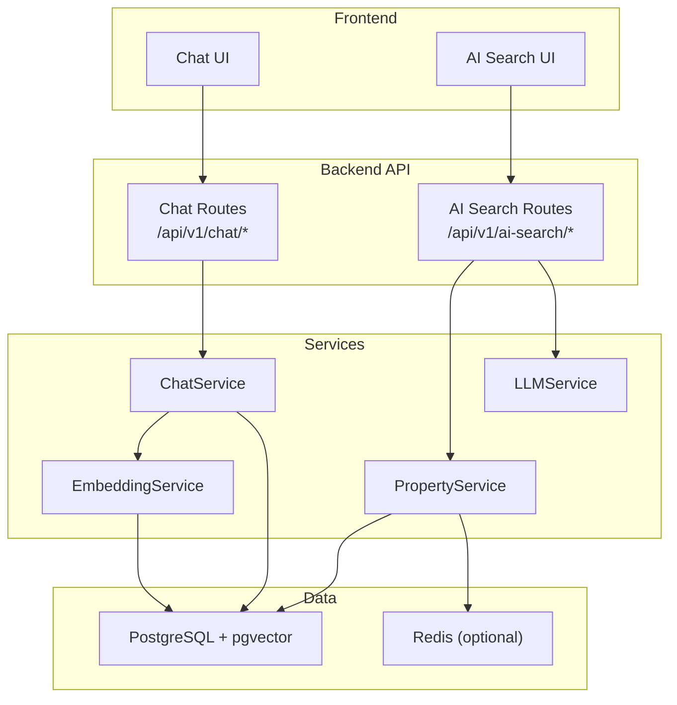

**Diagram sources**
- [chat.py:1-143](file://backend/app/api/v1/routes/chat.py#L1-L143)
- [ai_search.py:1-160](file://backend/app/api/v1/routes/ai_search.py#L1-L160)
- [chat_service.py:1-302](file://backend/app/services/chat_service.py#L1-L302)
- [embedding_service.py:1-32](file://backend/app/services/embedding_service.py#L1-L32)
- [property_service.py:1-239](file://backend/app/services/property_service.py#L1-L239)
- [llm_service.py:1-209](file://backend/app/services/llm_service.py#L1-L209)

**Section sources**
- [chat.py:1-143](file://backend/app/api/v1/routes/chat.py#L1-L143)
- [ai_search.py:1-160](file://backend/app/api/v1/routes/ai_search.py#L1-L160)
- [chat_service.py:1-302](file://backend/app/services/chat_service.py#L1-L302)
- [embedding_service.py:1-32](file://backend/app/services/embedding_service.py#L1-L32)
- [property_service.py:1-239](file://backend/app/services/property_service.py#L1-L239)
- [llm_service.py:1-209](file://backend/app/services/llm_service.py#L1-L209)

## Core Components
- Chat API routes: Create/list/delete sessions, list/send messages, stream SSE responses
- Chat service: Session/message persistence, RAG context building, OpenAI streaming calls, SSE chunking
- Embedding service: Generates text embeddings via configured provider
- Property service: Unified search with optional vector similarity and Redis caching
- LLM service: Parses natural language into structured parameters and generates summaries
- Data models: Chat sessions/messages and properties with vector columns
- Frontend: Chat client and AI search UI orchestrating parsing, form completion, and results display

Key responsibilities:
- Retrieval: Vector similarity over property embeddings to build RAG context
- Generation: LLM prompts incorporating system instructions, retrieved context, and conversation history
- Streaming: SSE events delivering matched properties first, then incremental content chunks
- Persistence: Store user and assistant messages with metadata for traceability

**Section sources**
- [chat.py:1-143](file://backend/app/api/v1/routes/chat.py#L1-L143)
- [chat_service.py:1-302](file://backend/app/services/chat_service.py#L1-L302)
- [embedding_service.py:1-32](file://backend/app/services/embedding_service.py#L1-L32)
- [property_service.py:1-239](file://backend/app/services/property_service.py#L1-L239)
- [llm_service.py:1-209](file://backend/app/services/llm_service.py#L1-L209)
- [chat.py (models):1-62](file://backend/app/models/chat.py#L1-L62)
- [property.py:1-86](file://backend/app/models/property.py#L1-L86)
- [ai_search.py (schemas):1-74](file://backend/app/schemas/ai_search.py#L1-L74)
- [property.py (schemas):1-79](file://backend/app/schemas/property.py#L1-L79)
- [chat.ts:1-24](file://frontend/src/services/chat.ts#L1-L24)
- [AiSearch.vue:1-593](file://frontend/src/views/AiSearch.vue#L1-L593)
- [aiSearch.ts:1-66](file://frontend/src/services/aiSearch.ts#L1-L66)

## Architecture Overview
The RAG pipeline integrates retrieval and generation:
- User query is embedded and used to find top-k similar properties from PostgreSQL with pgvector
- Retrieved properties are formatted into a context block appended to the system prompt
- The LLM generates a response conditioned on system instructions, context, and conversation history
- Responses are streamed as SSE events; matched properties are sent before content chunks

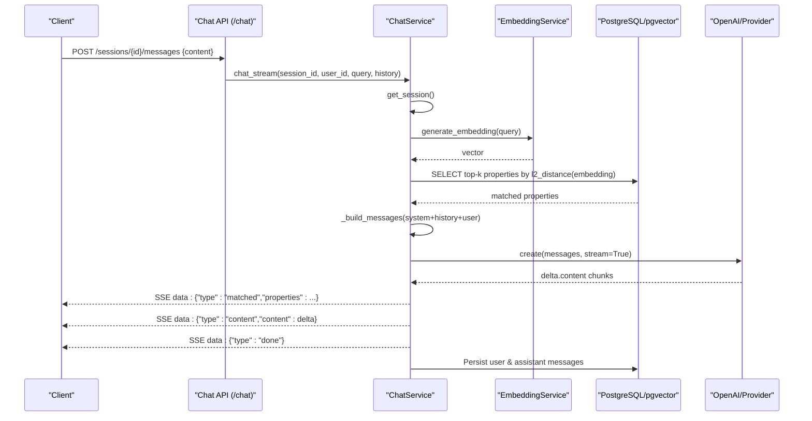

**Diagram sources**
- [chat.py:106-130](file://backend/app/api/v1/routes/chat.py#L106-L130)
- [chat_service.py:227-302](file://backend/app/services/chat_service.py#L227-L302)
- [embedding_service.py:23-28](file://backend/app/services/embedding_service.py#L23-L28)
- [property.py:78-78](file://backend/app/models/property.py#L78-L78)

## Detailed Component Analysis

### Chat API and Streaming
- Endpoints:
  - POST /sessions: create a new chat session
  - GET /sessions: list sessions for current user
  - GET /sessions/{id}/messages: retrieve message history
  - POST /sessions/{id}/messages: send a message and receive SSE stream
  - DELETE /sessions/{id}: delete a session
- Streaming behavior:
  - Returns media_type="text/event-stream" with appropriate headers
  - Yields SSE-formatted JSON events for matched properties, content chunks, and completion markers

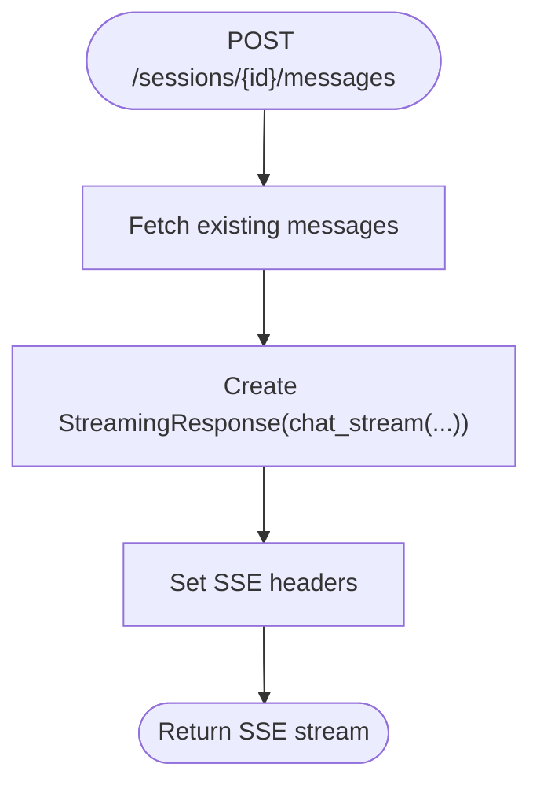

**Diagram sources**
- [chat.py:106-130](file://backend/app/api/v1/routes/chat.py#L106-L130)

**Section sources**
- [chat.py:1-143](file://backend/app/api/v1/routes/chat.py#L1-L143)

### ChatService: RAG Context and Streaming
- Session management:
  - Create, list, close, delete sessions; auto-title on first message
- Message persistence:
  - Save user and assistant messages with metadata (e.g., matched_properties)
- RAG context builder:
  - Generate embedding for query
  - Query top-k available properties by vector similarity
  - Format matched properties into a context string and structured list
- Prompt assembly:
  - System prompt includes role, rules, and optionally injected property context
  - History is appended followed by the latest user query
- Streaming:
  - Sends matched properties event first
  - Streams content chunks from LLM
  - Persists assistant message after completion
  - Emits done marker and final [DONE]

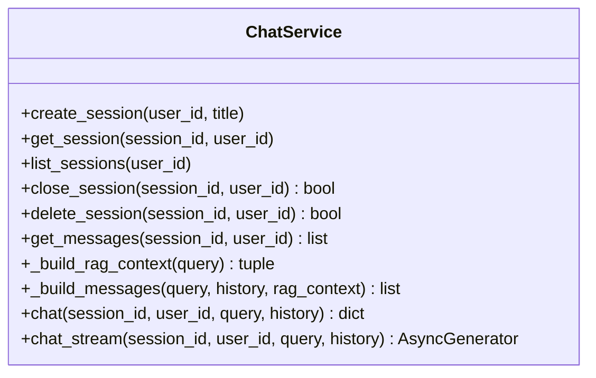

**Diagram sources**
- [chat_service.py:17-302](file://backend/app/services/chat_service.py#L17-L302)

**Section sources**
- [chat_service.py:1-302](file://backend/app/services/chat_service.py#L1-L302)

### EmbeddingService
- Generates embeddings for arbitrary text or property descriptions
- Uses configured provider model and API key
- Used by both chat RAG context building and property embedding tasks

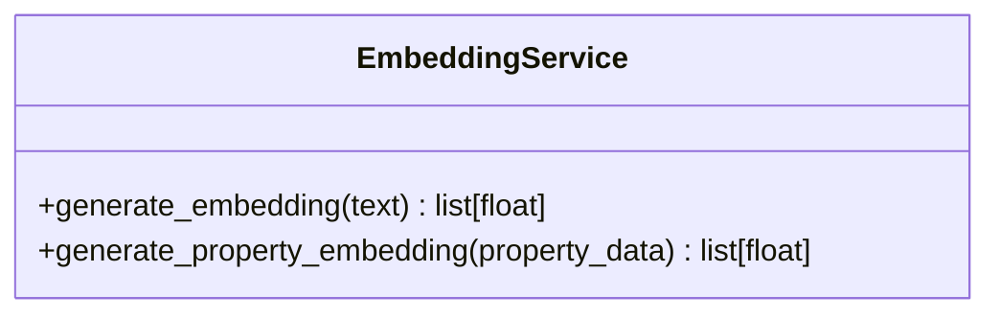

**Diagram sources**
- [embedding_service.py:17-32](file://backend/app/services/embedding_service.py#L17-L32)

**Section sources**
- [embedding_service.py:1-32](file://backend/app/services/embedding_service.py#L1-L32)

### PropertyService: Unified Search and Caching
- Supports hybrid search:
  - If query provided: compute embedding and rank by similarity
  - Else: order by creation time
- Filters by district, price range, bedrooms, property type
- Optional Redis cache for non-vector searches with TTL
- Dispatches background embedding tasks when properties change

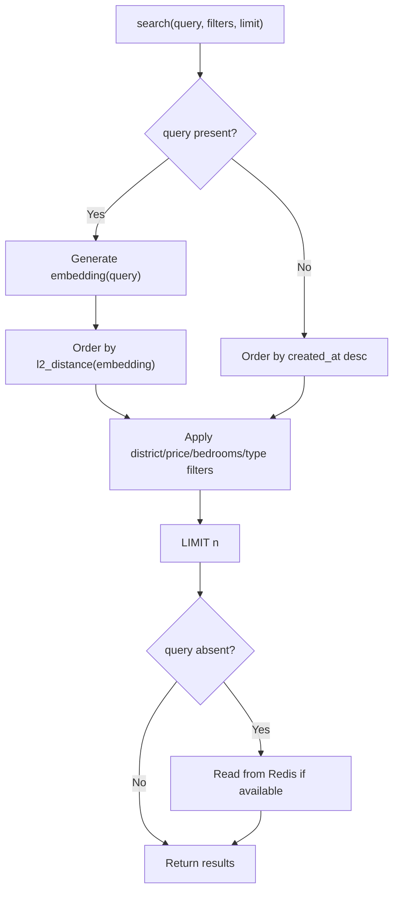

**Diagram sources**
- [property_service.py:91-195](file://backend/app/services/property_service.py#L91-L195)

**Section sources**
- [property_service.py:1-239](file://backend/app/services/property_service.py#L1-L239)

### LLMService: Parsing and Summaries
- parse_search_query:
  - Extracts structured search parameters and completeness report
  - Enforces required fields and returns friendly hints
- generate_search_summary:
  - Produces a concise, friendly summary for top properties
- Provider selection:
  - Prefers DeepSeek if configured; falls back to OpenAI

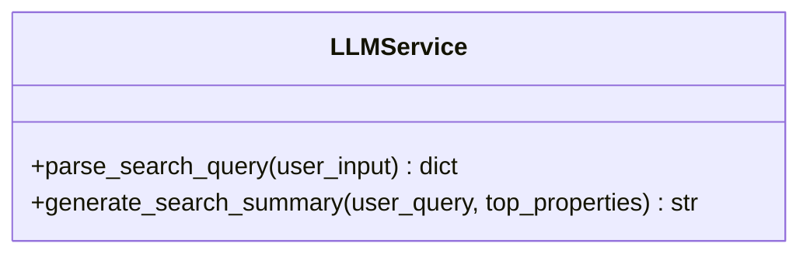

**Diagram sources**
- [llm_service.py:64-209](file://backend/app/services/llm_service.py#L64-L209)

**Section sources**
- [llm_service.py:1-209](file://backend/app/services/llm_service.py#L1-L209)

### Data Models and Schemas
- ChatSession and ChatMessage:
  - Track session lifecycle, titles, status, roles, content, and metadata
- Property:
  - Includes vector column for embeddings and indexes for filtering
- Schemas:
  - Define strict request/response structures for AI search and property results

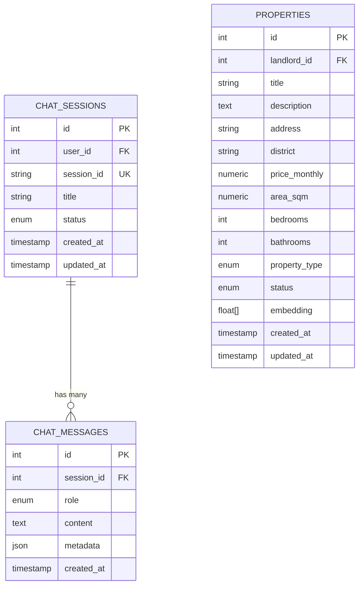

**Diagram sources**
- [chat.py (models):23-62](file://backend/app/models/chat.py#L23-L62)
- [property.py:38-86](file://backend/app/models/property.py#L38-L86)

**Section sources**
- [chat.py (models):1-62](file://backend/app/models/chat.py#L1-L62)
- [property.py:1-86](file://backend/app/models/property.py#L1-L86)
- [ai_search.py (schemas):1-74](file://backend/app/schemas/ai_search.py#L1-L74)
- [property.py (schemas):1-79](file://backend/app/schemas/property.py#L1-L79)

### Frontend Integration
- Chat client:
  - Creates sessions, lists sessions, fetches messages, deletes sessions
- AI Search UI:
  - Three-phase flow: input -> form completion -> results
  - Calls parse endpoint to extract parameters and missing fields
  - Calls search endpoint to retrieve results and AI-generated summary
  - Displays horizontal scroll of property cards with similarity indicators

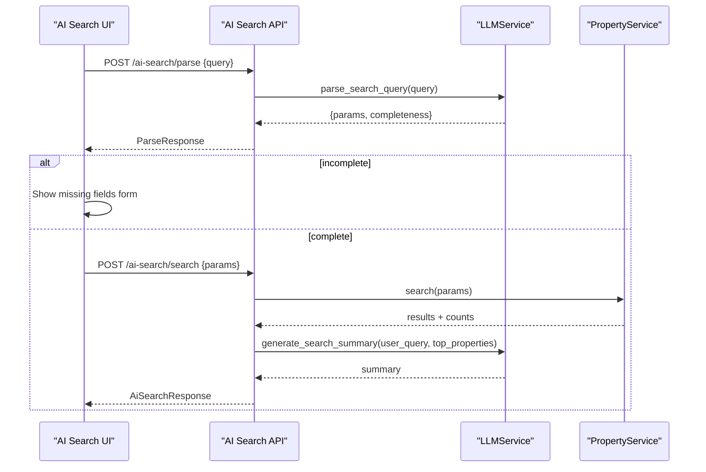

**Diagram sources**
- [ai_search.py:80-160](file://backend/app/api/v1/routes/ai_search.py#L80-L160)
- [llm_service.py:106-198](file://backend/app/services/llm_service.py#L106-L198)
- [property_service.py:91-195](file://backend/app/services/property_service.py#L91-L195)
- [AiSearch.vue:269-336](file://frontend/src/views/AiSearch.vue#L269-L336)
- [aiSearch.ts:56-66](file://frontend/src/services/aiSearch.ts#L56-L66)

**Section sources**
- [chat.ts:1-24](file://frontend/src/services/chat.ts#L1-L24)
- [AiSearch.vue:1-593](file://frontend/src/views/AiSearch.vue#L1-L593)
- [aiSearch.ts:1-66](file://frontend/src/services/aiSearch.ts#L1-L66)

## Dependency Analysis
- API layer depends on services for business logic
- ChatService depends on EmbeddingService and OpenAI client
- PropertyService depends on EmbeddingService for vector search and optional Redis cache
- LLMService abstracts provider selection and prompt templates
- Models define persistence contracts; schemas enforce API boundaries

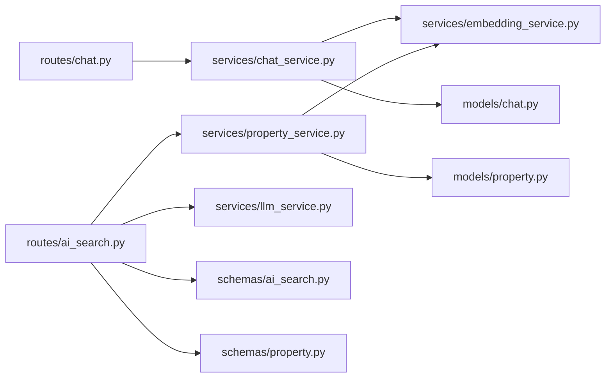

**Diagram sources**
- [chat.py:1-143](file://backend/app/api/v1/routes/chat.py#L1-L143)
- [ai_search.py:1-160](file://backend/app/api/v1/routes/ai_search.py#L1-L160)
- [chat_service.py:1-302](file://backend/app/services/chat_service.py#L1-L302)
- [embedding_service.py:1-32](file://backend/app/services/embedding_service.py#L1-L32)
- [property_service.py:1-239](file://backend/app/services/property_service.py#L1-L239)
- [llm_service.py:1-209](file://backend/app/services/llm_service.py#L1-L209)
- [chat.py (models):1-62](file://backend/app/models/chat.py#L1-L62)
- [property.py:1-86](file://backend/app/models/property.py#L1-L86)
- [ai_search.py (schemas):1-74](file://backend/app/schemas/ai_search.py#L1-L74)
- [property.py (schemas):1-79](file://backend/app/schemas/property.py#L1-L79)

**Section sources**
- [chat.py:1-143](file://backend/app/api/v1/routes/chat.py#L1-L143)
- [ai_search.py:1-160](file://backend/app/api/v1/routes/ai_search.py#L1-L160)
- [chat_service.py:1-302](file://backend/app/services/chat_service.py#L1-L302)
- [embedding_service.py:1-32](file://backend/app/services/embedding_service.py#L1-L32)
- [property_service.py:1-239](file://backend/app/services/property_service.py#L1-L239)
- [llm_service.py:1-209](file://backend/app/services/llm_service.py#L1-L209)
- [chat.py (models):1-62](file://backend/app/models/chat.py#L1-L62)
- [property.py:1-86](file://backend/app/models/property.py#L1-L86)
- [ai_search.py (schemas):1-74](file://backend/app/schemas/ai_search.py#L1-L74)
- [property.py (schemas):1-79](file://backend/app/schemas/property.py#L1-L79)

## Performance Considerations
- Vector search performance:
  - Use pgvector indices and filter by status to reduce candidate set
  - Limit top-k matches to control prompt size and latency
- Caching:
  - Non-vector searches cached in Redis with TTL to reduce DB load
- Streaming:
  - SSE enables immediate rendering of matched properties and incremental text
- Background tasks:
  - Embedding updates dispatched asynchronously to avoid blocking writes
- Memory and context limits:
  - Keep RAG context concise; only include top matches
  - Avoid overly long histories; consider truncation or summarization strategies

[No sources needed since this section provides general guidance]

## Troubleshooting Guide
- LLM unconfigured:
  - LLMService raises error if no API keys are set; ensure configuration
- Embedding failures:
  - Check provider availability and network connectivity
- Vector search empty results:
  - Ensure properties have embeddings and status is available
- SSE issues:
  - Verify server headers and proxy buffering settings
- Redis not available:
  - Search degrades gracefully without cache

**Section sources**
- [llm_service.py:91-99](file://backend/app/services/llm_service.py#L91-L99)
- [property_service.py:31-41](file://backend/app/services/property_service.py#L31-L41)
- [chat_service.py:298-301](file://backend/app/services/chat_service.py#L298-L301)

## Conclusion
The RAG chat assistant integrates semantic property retrieval with LLM-driven generation to deliver contextual, real-time recommendations. It balances accuracy and responsiveness through vector similarity, streaming SSE, and robust session management. With clear separation of concerns across routes, services, models, and schemas, the system is extensible and maintainable.

[No sources needed since this section summarizes without analyzing specific files]

## Appendices

### Conversation Flow Diagrams

#### Multi-Turn Chat Sequence
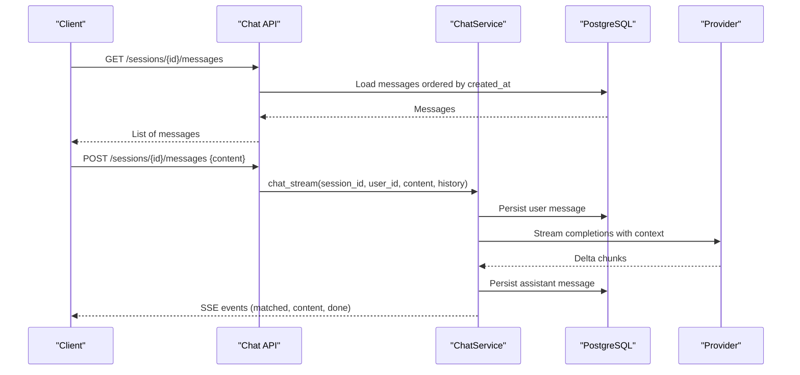

**Diagram sources**
- [chat.py:85-130](file://backend/app/api/v1/routes/chat.py#L85-L130)
- [chat_service.py:227-302](file://backend/app/services/chat_service.py#L227-L302)

#### Property Recommendation Engine Flow
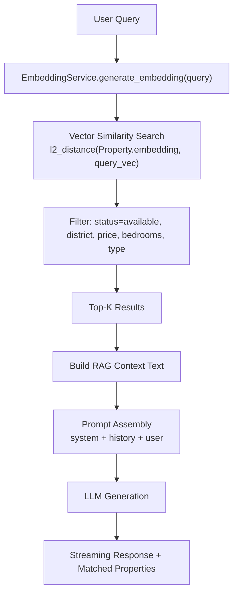

**Diagram sources**
- [chat_service.py:87-143](file://backend/app/services/chat_service.py#L87-L143)
- [embedding_service.py:23-28](file://backend/app/services/embedding_service.py#L23-L28)
- [property.py:78-78](file://backend/app/models/property.py#L78-L78)

### Prompt Engineering Strategies
- System prompts:
  - Role definition, rules for grounding answers in retrieved context, tone guidelines
- Few-shot examples:
  - Not explicitly implemented; rely on system instructions and context injection
- Response formatting:
  - Structured SSE events for matched properties and content chunks
  - Metadata attached to assistant messages for traceability

**Section sources**
- [chat_service.py:146-169](file://backend/app/services/chat_service.py#L146-L169)
- [llm_service.py:18-61](file://backend/app/services/llm_service.py#L18-L61)

### Example Interactions

- Typical single-turn chat:
  - User asks about affordable two-bedroom apartments near a metro station
  - System retrieves top matches, streams matched properties, then streams a concise recommendation
- Multi-turn refinement:
  - User narrows budget and district; system updates context and refines recommendations
- AI search workflow:
  - User enters natural language; system parses parameters, prompts for missing fields, executes search, and presents AI summary plus results

[No sources needed since this section provides conceptual examples]