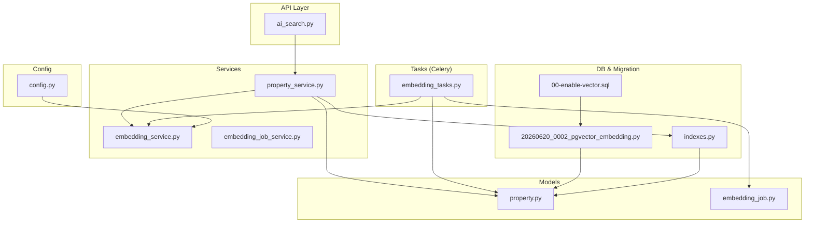
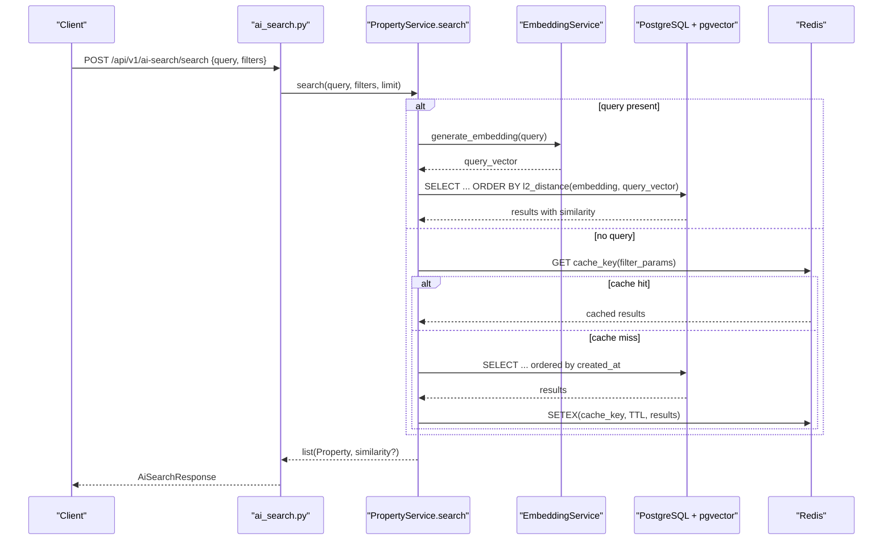
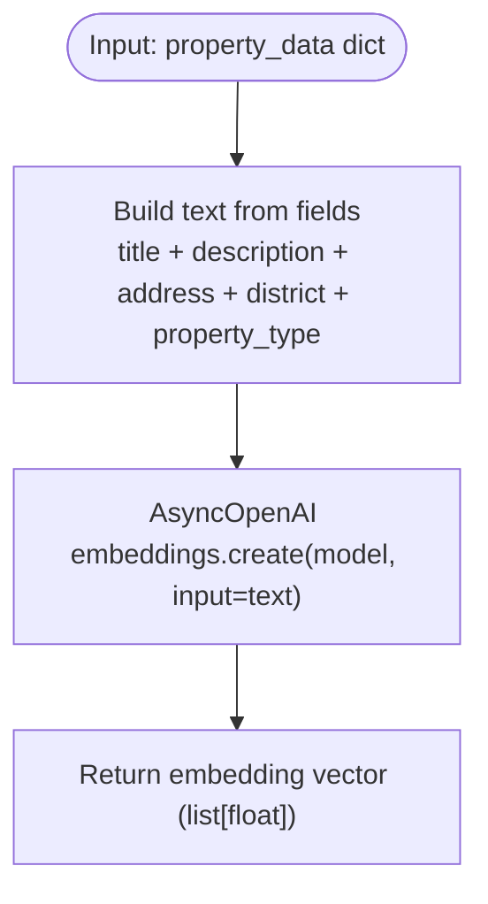
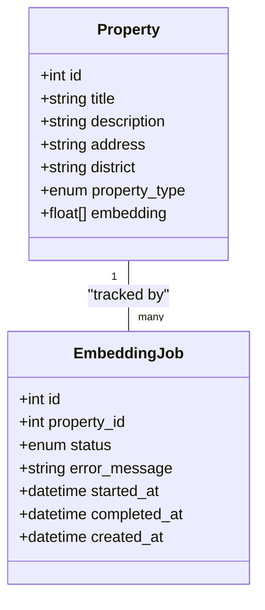
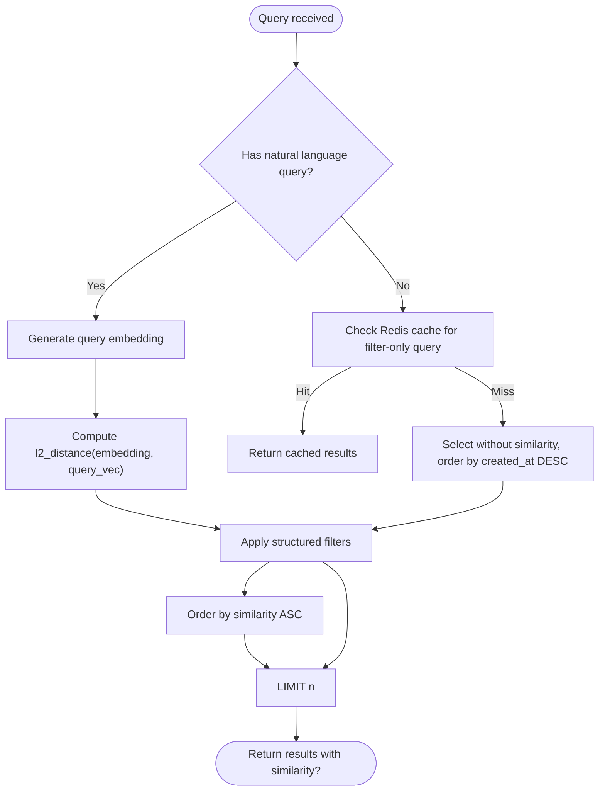
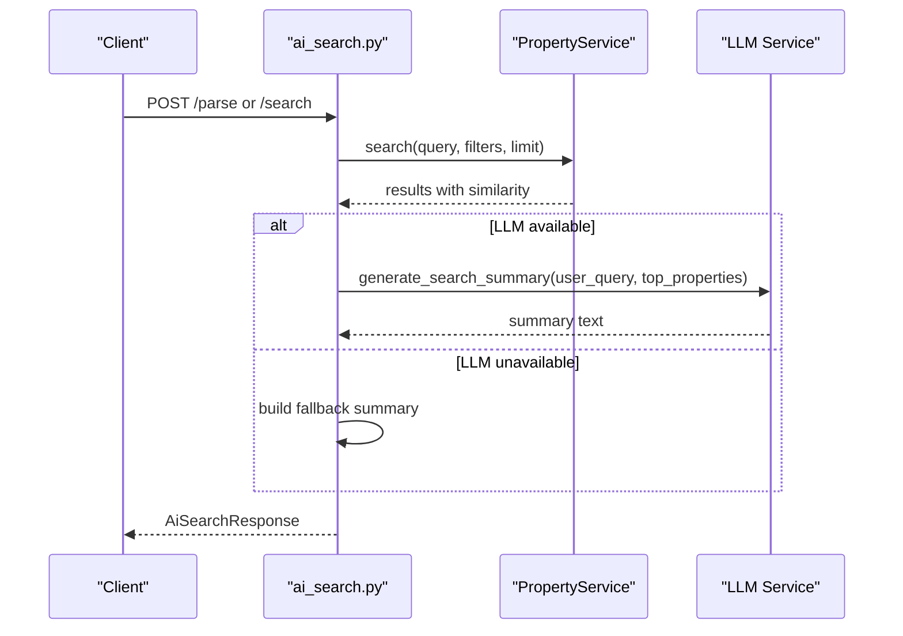
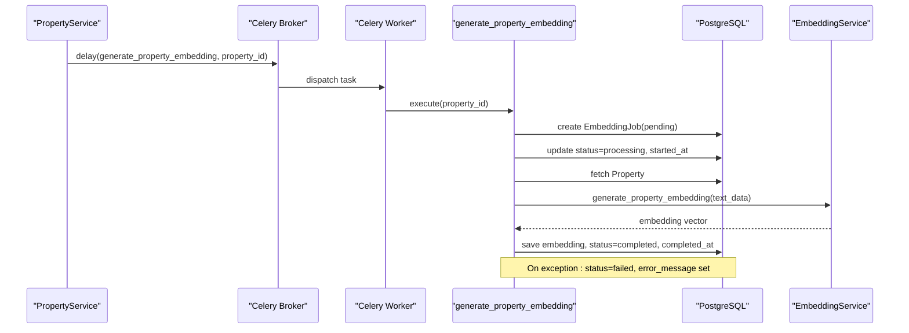
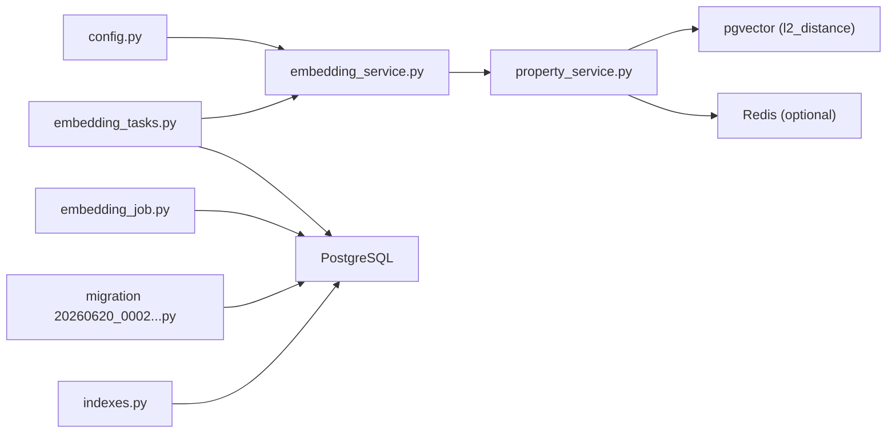

# Semantic Search & Vector Embeddings

<cite>
**Referenced Files in This Document**
- [embedding_service.py](file://backend/app/services/embedding_service.py)
- [property_service.py](file://backend/app/services/property_service.py)
- [ai_search.py](file://backend/app/api/v1/routes/ai_search.py)
- [embedding_tasks.py](file://backend/app/tasks/embedding_tasks.py)
- [embedding_job.py](file://backend/app/models/embedding_job.py)
- [embedding_job_service.py](file://backend/app/services/embedding_job_service.py)
- [property.py](file://backend/app/models/property.py)
- [20260620_0002_pgvector_embedding.py](file://backend/alembic/versions/20260620_0002_pgvector_embedding.py)
- [indexes.py](file://backend/app/db/indexes.py)
- [config.py](file://backend/app/core/config.py)
- [00-enable-vector.sql](file://docker/pg-init/00-enable-vector.sql)
- [test_embedding.py](file://backend/tests/test_embedding.py)
- [test_pgvector.py](file://backend/tests/test_pgvector.py)
- [README.md](file://backend/README.md)
</cite>

## Table of Contents
1. Introduction
2. Project Structure
3. Core Components
4. Architecture Overview
5. Detailed Component Analysis
6. Dependency Analysis
7. Performance Considerations
8. Troubleshooting Guide
9. Conclusion
10. Appendices

## Introduction
This document explains the semantic search and vector embeddings system for property data. It covers how property text is converted into numerical vectors using the OpenAI embeddings API, how pgvector stores and queries these vectors in PostgreSQL, and how similarity search is performed with distance metrics. It also documents batch processing via Celery, error handling and retries, configuration options for models and dimensions, natural language query examples, ranking and filtering behavior, cost optimization strategies, and caching mechanisms.

## Project Structure
The semantic search feature spans services, tasks, models, migrations, indexes, and tests:
- Services: embedding generation and property search orchestration
- Tasks: asynchronous embedding generation and reindexing
- Models: property schema with vector column and job tracking
- Migrations: enable pgvector extension and create IVFFlat index
- Index utilities: adaptive IVFFlat index creation and performance checks
- Configuration: OpenAI model selection and database URLs
- Tests: unit and integration tests for embeddings and pgvector

**Diagram sources**
- [ai_search.py](file://backend/app/api/v1/routes/ai_search.py)
- [property_service.py](file://backend/app/services/property_service.py)
- [embedding_service.py](file://backend/app/services/embedding_service.py)
- [embedding_tasks.py](file://backend/app/tasks/embedding_tasks.py)
- [property.py](file://backend/app/models/property.py)
- [embedding_job.py](file://backend/app/models/embedding_job.py)
- [20260620_0002_pgvector_embedding.py](file://backend/alembic/versions/20260620_0002_pgvector_embedding.py)
- [indexes.py](file://backend/app/db/indexes.py)
- [00-enable-vector.sql](file://docker/pg-init/00-enable-vector.sql)
- [config.py](file://backend/app/core/config.py)

**Section sources**
- [README.md](file://backend/README.md)

## Core Components
- EmbeddingService: wraps AsyncOpenAI to generate embeddings from text; builds a combined property text string from title, description, address, district, and property type fields.
- PropertyService.search: orchestrates hybrid search by generating an embedding for the user query when provided, computing similarity against stored property embeddings, applying structured filters, and returning ranked results with similarity scores.
- Celery Tasks: generate_property_embedding creates embeddings asynchronously per property; reindex_all_properties enqueues missing embeddings in bulk.
- Database Schema: properties.embedding uses pgvector with dimension 1536; IVFFlat index created for efficient L2 similarity search.
- Job Tracking: EmbeddingJob records lifecycle and errors for each embedding task.
- Configuration: OPENAI_EMBEDDING_MODEL and OPENAI_API_KEY control model choice and authentication; DATABASE_URL points to PostgreSQL with pgvector enabled.

Key implementation references:
- Text preprocessing pipeline and embedding call: [embedding_service.py](file://backend/app/services/embedding_service.py)
- Hybrid search with pgvector and Redis caching: [property_service.py](file://backend/app/services/property_service.py)
- Asynchronous embedding generation and retry/backoff: [embedding_tasks.py](file://backend/app/tasks/embedding_tasks.py)
- Job status model: [embedding_job.py](file://backend/app/models/embedding_job.py)
- Vector column and ORM mapping: [property.py](file://backend/app/models/property.py)
- Migration enabling pgvector and IVFFlat index: [20260620_0002_pgvector_embedding.py](file://backend/alembic/versions/20260620_0002_pgvector_embedding.py)
- Adaptive index creation utility: [indexes.py](file://backend/app/db/indexes.py)
- Environment configuration: [config.py](file://backend/app/core/config.py)
- Docker init script enabling vector extension: [00-enable-vector.sql](file://docker/pg-init/00-enable-vector.sql)

**Section sources**
- [embedding_service.py](file://backend/app/services/embedding_service.py)
- [property_service.py](file://backend/app/services/property_service.py)
- [embedding_tasks.py](file://backend/app/tasks/embedding_tasks.py)
- [embedding_job.py](file://backend/app/models/embedding_job.py)
- [property.py](file://backend/app/models/property.py)
- [20260620_0002_pgvector_embedding.py](file://backend/alembic/versions/20260620_0002_pgvector_embedding.py)
- [indexes.py](file://backend/app/db/indexes.py)
- [config.py](file://backend/app/core/config.py)
- [00-enable-vector.sql](file://docker/pg-init/00-enable-vector.sql)

## Architecture Overview
End-to-end flow for semantic search and embedding generation:

**Diagram sources**
- [ai_search.py](file://backend/app/api/v1/routes/ai_search.py)
- [property_service.py](file://backend/app/services/property_service.py)
- [embedding_service.py](file://backend/app/services/embedding_service.py)
- [20260620_0002_pgvector_embedding.py](file://backend/alembic/versions/20260620_0002_pgvector_embedding.py)

## Detailed Component Analysis

### Embedding Service and Text Preprocessing
- Combines title, description, address, district, and property_type into a single text string for embedding.
- Uses AsyncOpenAI to call the configured embedding model and returns a float vector.
- Dimensionality matches the pgvector column size (1536).

**Diagram sources**
- [embedding_service.py](file://backend/app/services/embedding_service.py)

**Section sources**
- [embedding_service.py](file://backend/app/services/embedding_service.py)
- [test_embedding.py](file://backend/tests/test_embedding.py)

### Property Model and pgvector Integration
- The Property model includes an embedding column mapped to pgvector’s Vector(1536) via a custom TypeDecorator that falls back to text on non-Postgres dialects.
- Migration enables the vector extension and adds the embedding column with an IVFFlat index tuned for L2 operations.
- An index utility can recreate or skip IVFFlat based on row count and existing index presence.

**Diagram sources**
- [property.py](file://backend/app/models/property.py)
- [embedding_job.py](file://backend/app/models/embedding_job.py)
- [20260620_0002_pgvector_embedding.py](file://backend/alembic/versions/20260620_0002_pgvector_embedding.py)
- [indexes.py](file://backend/app/db/indexes.py)

**Section sources**
- [property.py](file://backend/app/models/property.py)
- [20260620_0002_pgvector_embedding.py](file://backend/alembic/versions/20260620_0002_pgvector_embedding.py)
- [indexes.py](file://backend/app/db/indexes.py)
- [00-enable-vector.sql](file://docker/pg-init/00-enable-vector.sql)

### Hybrid Search Pipeline and Ranking
- When a natural language query is provided, the service generates its embedding and computes L2 distance against stored property embeddings, ordering by ascending distance (lower is more similar).
- Structured filters (district, price range, bedrooms, property_type) are applied after similarity computation.
- Results include a similarity score when vector search is used; otherwise, NULL similarity is returned.
- Non-vector searches are cached in Redis with a TTL to reduce load.

**Diagram sources**
- [property_service.py](file://backend/app/services/property_service.py)

**Section sources**
- [property_service.py](file://backend/app/services/property_service.py)

### AI Search API and Summary Generation
- The AI search endpoint composes a query string from the user’s natural language, district, and keywords, then delegates to PropertyService.search.
- It optionally generates an AI summary for top results if an LLM is configured; otherwise, it returns a fallback summary.

**Diagram sources**
- [ai_search.py](file://backend/app/api/v1/routes/ai_search.py)

**Section sources**
- [ai_search.py](file://backend/app/api/v1/routes/ai_search.py)

### Asynchronous Embedding Generation and Reindexing
- On property create/update, a background Celery task is dispatched to generate embeddings.
- Each job is tracked in EmbeddingJob with statuses pending, processing, completed, failed, including timestamps and error messages.
- Tasks use autoretry with exponential backoff and max retries.
- A reindex task scans for properties without embeddings and enqueues them individually.

**Diagram sources**
- [embedding_tasks.py](file://backend/app/tasks/embedding_tasks.py)
- [embedding_job.py](file://backend/app/models/embedding_job.py)
- [embedding_service.py](file://backend/app/services/embedding_service.py)
- [property_service.py](file://backend/app/services/property_service.py)

**Section sources**
- [embedding_tasks.py](file://backend/app/tasks/embedding_tasks.py)
- [embedding_job.py](file://backend/app/models/embedding_job.py)
- [embedding_job_service.py](file://backend/app/services/embedding_job_service.py)
- [property_service.py](file://backend/app/services/property_service.py)

## Dependency Analysis
- EmbeddingService depends on OpenAI client and settings for model and API key.
- PropertyService depends on EmbeddingService for query embedding and on pgvector functions for similarity.
- Celery tasks depend on EmbeddingService and SQLAlchemy async engine/session for DB access.
- Migrations and index utilities depend on pgvector extension and IVFFlat indexing.

**Diagram sources**
- [config.py](file://backend/app/core/config.py)
- [embedding_service.py](file://backend/app/services/embedding_service.py)
- [property_service.py](file://backend/app/services/property_service.py)
- [embedding_tasks.py](file://backend/app/tasks/embedding_tasks.py)
- [embedding_job.py](file://backend/app/models/embedding_job.py)
- [20260620_0002_pgvector_embedding.py](file://backend/alembic/versions/20260620_0002_pgvector_embedding.py)
- [indexes.py](file://backend/app/db/indexes.py)

**Section sources**
- [config.py](file://backend/app/core/config.py)
- [embedding_service.py](file://backend/app/services/embedding_service.py)
- [property_service.py](file://backend/app/services/property_service.py)
- [embedding_tasks.py](file://backend/app/tasks/embedding_tasks.py)
- [embedding_job.py](file://backend/app/models/embedding_job.py)
- [20260620_0002_pgvector_embedding.py](file://backend/alembic/versions/20260620_0002_pgvector_embedding.py)
- [indexes.py](file://backend/app/db/indexes.py)

## Performance Considerations
- Distance metric: L2 distance is used for similarity ordering; lower values indicate higher similarity.
- Indexing: IVFFlat index on properties.embedding with vector_l2_ops and lists parameter tuned to sqrt(row_count) for large datasets; exact scan preferred for small datasets (<1000 rows).
- Caching: Redis caches deterministic filter-only queries with a TTL to avoid repeated DB hits.
- Batch reindexing: reindex_all_properties enqueues all missing embeddings to be processed asynchronously.
- Query planning: Use EXPLAIN ANALYZE utilities to validate plans and ensure IVFFFlat usage when appropriate.

[No sources needed since this section provides general guidance]

## Troubleshooting Guide
- Missing embeddings: If a property lacks an embedding, it will not appear in semantic search results. Trigger reindex for missing embeddings.
- Celery worker required: Without a running worker, embeddings are not generated; check worker logs and queue name.
- Retry and failures: Failed jobs record error messages and timestamps; inspect job status and error details.
- pgvector extension: Ensure the vector extension is enabled in PostgreSQL; migration and docker init script handle this.
- Redis availability: If Redis is unavailable, caching is disabled gracefully; search still works but may be slower for frequent filter-only queries.

**Section sources**
- [embedding_tasks.py](file://backend/app/tasks/embedding_tasks.py)
- [embedding_job.py](file://backend/app/models/embedding_job.py)
- [property_service.py](file://backend/app/services/property_service.py)
- [00-enable-vector.sql](file://docker/pg-init/00-enable-vector.sql)
- [README.md](file://backend/README.md)

## Conclusion
The system integrates OpenAI embeddings with pgvector to provide semantic search over property listings. It combines natural language understanding with structured filters, tracks embedding jobs, and optimizes performance through IVFFlat indexing and optional Redis caching. Proper configuration and operational setup (Celery workers, pgvector extension) are essential for reliable operation.

[No sources needed since this section summarizes without analyzing specific files]

## Appendices

### Configuration Options
- OPENAI_API_KEY: Authentication for OpenAI embeddings API.
- OPENAI_EMBEDDING_MODEL: Embedding model identifier (e.g., text-embedding-3-small).
- DATABASE_URL: PostgreSQL connection string with pgvector enabled.
- REDIS_URL: Optional Redis URL for search result caching.
- AMAP_* variables: Geocoding and POI features (not directly related to embeddings).

**Section sources**
- [config.py](file://backend/app/core/config.py)

### Natural Language Queries and Examples
Examples of queries that leverage semantic search:
- “Near metro station two-bedroom apartments”
- “Quiet studio near university campus”
- “Affordable shared rooms in SIP”

These queries are transformed into embeddings and matched against property embeddings using L2 distance, then filtered by any additional structured parameters such as district or price range.

[No sources needed since this section doesn't analyze specific source files]

### Cost Optimization Strategies
- Prefer smaller embedding models where acceptable to reduce API costs.
- Cache frequent filter-only queries in Redis to avoid unnecessary embedding calls.
- Generate embeddings asynchronously and batch reindex during off-peak hours.
- Avoid regenerating embeddings on every write unless necessary; rely on background tasks.

[No sources needed since this section provides general guidance]

### Relevant Tests
- Unit tests verify embedding dimensionality and text preprocessing logic.
- Integration tests exercise pgvector-enabled endpoints and behaviors.

**Section sources**
- [test_embedding.py](file://backend/tests/test_embedding.py)
- [test_pgvector.py](file://backend/tests/test_pgvector.py)