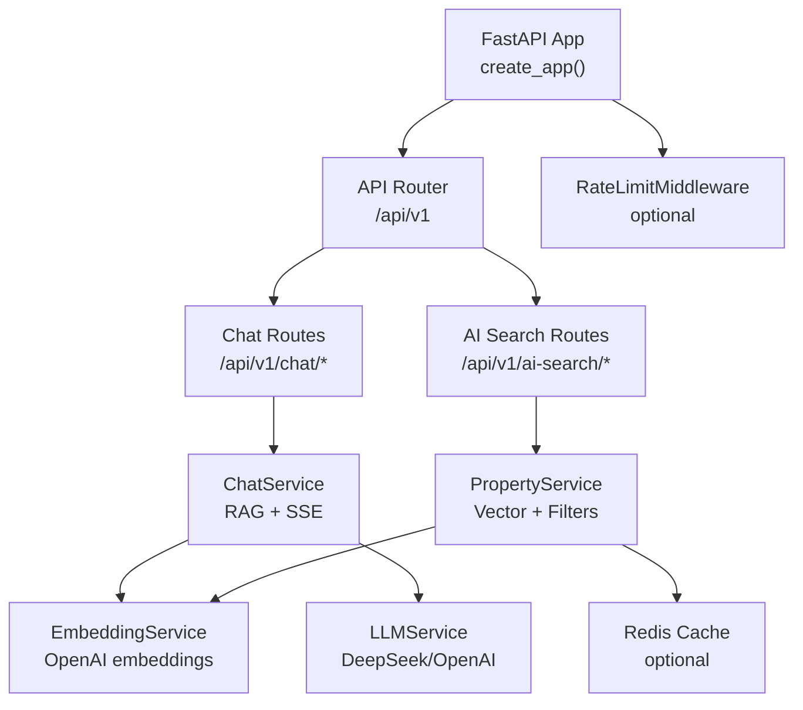
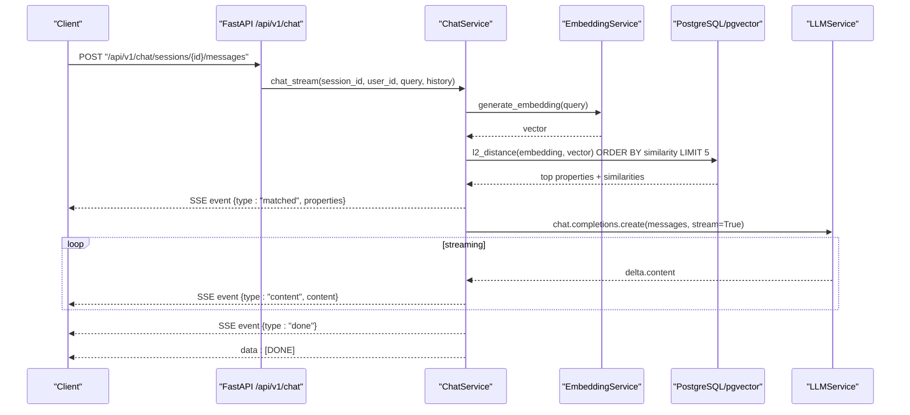
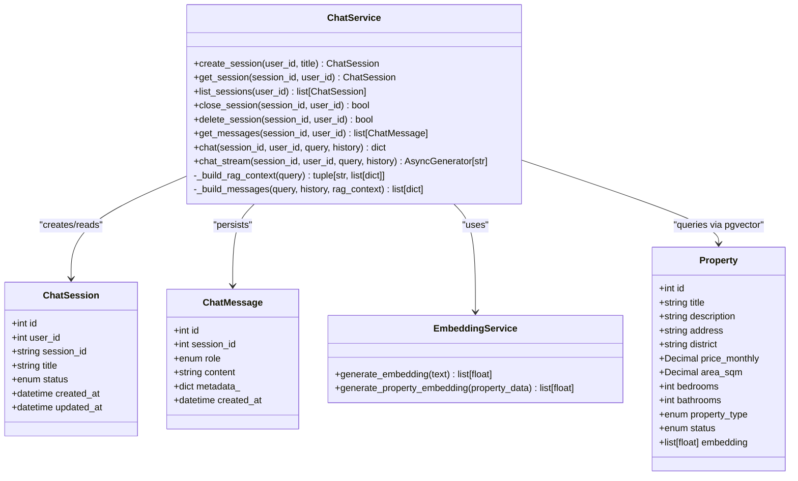
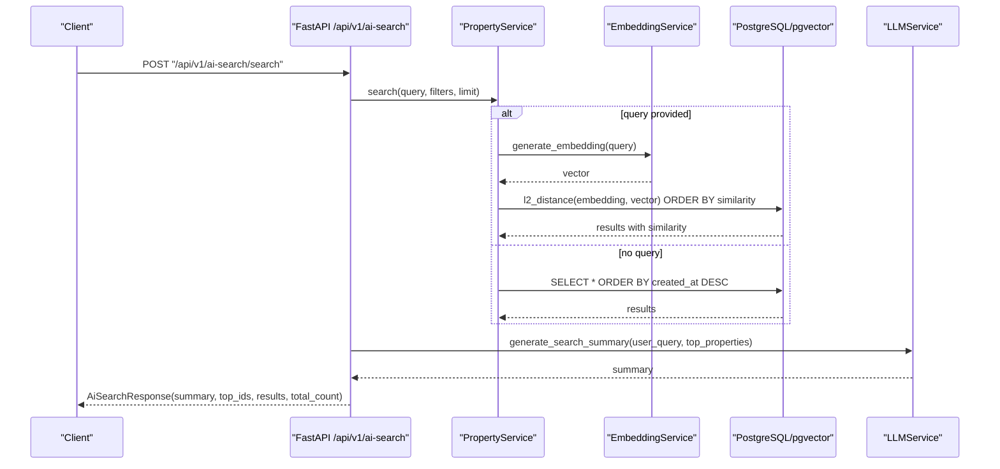
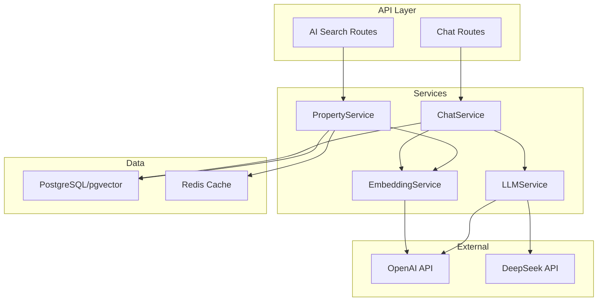

# AI Chat & Search APIs

<cite>
**Referenced Files in This Document**
- [main.py](file://backend/app/main.py)
- [router.py](file://backend/app/api/v1/router.py)
- [chat.py](file://backend/app/api/v1/routes/chat.py)
- [ai_search.py](file://backend/app/api/v1/routes/ai_search.py)
- [chat_service.py](file://backend/app/services/chat_service.py)
- [embedding_service.py](file://backend/app/services/embedding_service.py)
- [llm_service.py](file://backend/app/services/llm_service.py)
- [property_service.py](file://backend/app/services/property_service.py)
- [config.py](file://backend/app/core/config.py)
- [security_audit.py](file://backend/app/core/security_audit.py)
- [chat.py](file://backend/app/models/chat.py)
- [property.py](file://backend/app/models/property.py)
- [ai_search.py](file://backend/app/schemas/ai_search.py)
- [property.py](file://backend/app/schemas/property.py)
</cite>

## Table of Contents
1. [Introduction](#introduction)
2. [Project Structure](#project-structure)
3. [Core Components](#core-components)
4. [Architecture Overview](#architecture-overview)
5. [Detailed Component Analysis](#detailed-component-analysis)
6. [Dependency Analysis](#dependency-analysis)
7. [Performance Considerations](#performance-considerations)
8. [Troubleshooting Guide](#troubleshooting-guide)
9. [Conclusion](#conclusion)

## Introduction
This document provides detailed API documentation for the AI-powered chat and search endpoints, including:
- Chat assistant interface with Server-Sent Events (SSE) streaming responses, context-aware conversation handling, and property recommendation capabilities.
- Semantic search endpoints that support natural language queries, vector similarity matching, and result ranking.
- Embedding generation processes, Retrieval-Augmented Generation (RAG), and conversation state management.
- Examples of request/response formats, streaming response handling, query syntax, and result structures.
- Performance optimization strategies, rate limiting for LLM calls, and fallback mechanisms when AI services are unavailable.

## Project Structure
The AI chat and search features are implemented under the FastAPI application with clear separation between routes, services, schemas, and models. The main entry point mounts routers under a versioned prefix and applies global middleware such as CORS, Prometheus metrics, and optional Redis-backed rate limiting.

**Diagram sources**
- [main.py:17-78](file://backend/app/main.py#L17-L78)
- [router.py:1-23](file://backend/app/api/v1/router.py#L1-L23)
- [chat.py:1-143](file://backend/app/api/v1/routes/chat.py#L1-L143)
- [ai_search.py:1-160](file://backend/app/api/v1/routes/ai_search.py#L1-L160)
- [chat_service.py:1-302](file://backend/app/services/chat_service.py#L1-L302)
- [embedding_service.py:1-32](file://backend/app/services/embedding_service.py#L1-L32)
- [llm_service.py:1-209](file://backend/app/services/llm_service.py#L1-L209)
- [property_service.py:1-239](file://backend/app/services/property_service.py#L1-L239)
- [security_audit.py:49-95](file://backend/app/core/security_audit.py#L49-L95)

**Section sources**
- [main.py:17-78](file://backend/app/main.py#L17-L78)
- [router.py:1-23](file://backend/app/api/v1/router.py#L1-L23)

## Core Components
- Chat Assistant API:
  - Endpoints: create/list/get/delete sessions; send message via SSE.
  - Streaming responses include matched properties first, then content chunks, then completion markers.
  - RAG pipeline builds context from vector similarity search over properties.
- AI Search API:
  - Parse natural language into structured parameters with completeness report.
  - Unified search combining semantic vector similarity and filters; returns ranked results and an AI-generated summary.
- Embedding Service:
  - Generates text embeddings using OpenAI embedding model.
- LLM Service:
  - Unified provider abstraction preferring DeepSeek with OpenAI fallback; supports parsing and summary generation.
- Property Service:
  - Unified search with optional vector similarity and filter-based caching via Redis.

**Section sources**
- [chat.py:1-143](file://backend/app/api/v1/routes/chat.py#L1-L143)
- [ai_search.py:1-160](file://backend/app/api/v1/routes/ai_search.py#L1-L160)
- [chat_service.py:1-302](file://backend/app/services/chat_service.py#L1-L302)
- [embedding_service.py:1-32](file://backend/app/services/embedding_service.py#L1-L32)
- [llm_service.py:1-209](file://backend/app/services/llm_service.py#L1-L209)
- [property_service.py:1-239](file://backend/app/services/property_service.py#L1-L239)

## Architecture Overview
The system integrates multiple layers:
- API layer exposes REST endpoints and SSE streaming.
- Service layer orchestrates business logic, RAG context building, and LLM calls.
- Data layer uses PostgreSQL with pgvector for vector similarity and Redis for caching.
- External providers: OpenAI for embeddings and chat completions; DeepSeek for parsing and summaries with OpenAI fallback.

**Diagram sources**
- [chat.py:106-130](file://backend/app/api/v1/routes/chat.py#L106-L130)
- [chat_service.py:227-302](file://backend/app/services/chat_service.py#L227-L302)
- [embedding_service.py:23-28](file://backend/app/services/embedding_service.py#L23-L28)
- [property.py:78-78](file://backend/app/models/property.py#L78-L78)

## Detailed Component Analysis

### Chat Assistant API
- Base path: /api/v1/chat
- Endpoints:
  - POST /sessions: Create a new chat session.
  - GET /sessions: List all sessions for the current user.
  - GET /sessions/{session_id}/messages: Retrieve messages for a session.
  - POST /sessions/{session_id}/messages: Send a message and receive SSE streaming response.
  - DELETE /sessions/{session_id}: Delete a session.

Request/Response Formats:
- CreateSessionRequest:
  - title: string | null (max length 200)
- SessionResponse:
  - id: int
  - session_id: string
  - title: string | null
  - status: enum ("active", "closed")
  - created_at: ISO timestamp
  - updated_at: ISO timestamp
- MessageRequest:
  - content: string (min_length 1, max_length 4000)
- MessageResponse:
  - id: int
  - session_id: int
  - role: enum ("user", "assistant", "system")
  - content: string
  - metadata: object | null
  - created_at: ISO timestamp

Streaming Response Format (SSE):
- Event type "matched":
  - JSON payload includes matched properties with fields like id, title, district, address, price_monthly, bedrooms, bathrooms, area_sqm, property_type, similarity.
- Event type "content":
  - JSON payload includes incremental content chunk.
- Event type "done":
  - Indicates completion of streaming.
- Final marker:
  - data: [DONE]

Conversation State Management:
- Sessions persist user_id, session_id, title, status, timestamps.
- Messages persist per session with role, content, metadata, timestamps.
- Auto-title on first message if not provided.

RAG Context Building:
- Query is embedded using EmbeddingService.
- Vector similarity search over Property.embedding using l2_distance.
- Top 5 available properties returned as context to guide LLM responses.

Example Usage:
- Create session:
  - POST /api/v1/chat/sessions with body {"title": "Weekend rental search"}
- Send message:
  - POST /api/v1/chat/sessions/{session_id}/messages with body {"content": "Find me a quiet apartment near subway within 3000 yuan/month"}
- Handle SSE:
  - Read events until "done" and "[DONE]" marker.

**Section sources**
- [chat.py:15-43](file://backend/app/api/v1/routes/chat.py#L15-L43)
- [chat.py:47-143](file://backend/app/api/v1/routes/chat.py#L47-L143)
- [chat_service.py:26-83](file://backend/app/services/chat_service.py#L26-L83)
- [chat_service.py:87-142](file://backend/app/services/chat_service.py#L87-L142)
- [chat_service.py:171-226](file://backend/app/services/chat_service.py#L171-L226)
- [chat_service.py:227-302](file://backend/app/services/chat_service.py#L227-L302)
- [chat.py:12-62](file://backend/app/models/chat.py#L12-L62)

#### Class Diagram: Chat Models and Services

**Diagram sources**
- [chat.py:23-62](file://backend/app/models/chat.py#L23-L62)
- [chat_service.py:17-302](file://backend/app/services/chat_service.py#L17-L302)
- [embedding_service.py:17-32](file://backend/app/services/embedding_service.py#L17-L32)
- [property.py:38-86](file://backend/app/models/property.py#L38-L86)

### AI Search API
- Base path: /api/v1/ai-search
- Endpoints:
  - POST /parse: Parse natural language into structured parameters and completeness report.
  - POST /search: Execute unified search and generate AI summary.

Request/Response Formats:
- ParseRequest:
  - query: string (min_length 1, max_length 2000)
- ParseResponse:
  - params: ParsedSearchParams
    - district: string | null
    - price_min: int | null
    - price_max: int | null
    - bedrooms: int | null
    - property_type: string | null
    - keywords: string | null
  - completeness: CompletenessReport
    - is_complete: bool
    - missing_fields: list[MissingField]
      - field: string
      - label: string
      - hint: string
    - summary: string
- AiSearchRequest:
  - query: string (min_length 1)
  - district: string | null
  - price_min: int | null
  - price_max: int | null
  - bedrooms: int | null
  - property_type: string | null
  - keywords: string | null
  - limit: int (default 30, range 1..50)
- AiSearchResponse:
  - summary: string
  - top_ids: list[int]
  - results: list[PropertySearchResult]
  - total_count: int
  - search_params: AiSearchRequest

Semantic Search Behavior:
- If query is provided, vector similarity search is performed using l2_distance over Property.embedding.
- Filters can be applied (district, price range, bedrooms, property_type).
- Results are ranked by similarity or creation date when no query is provided.
- AI summary generated for top 3 properties using LLMService with fallback behavior.

Example Usage:
- Parse:
  - POST /api/v1/ai-search/parse with body {"query": "I want a two-bedroom apartment in Suzhou Industrial Park with budget up to 4000 yuan"}
- Search:
  - POST /api/v1/ai-search/search with body {"query": "...", "district": "Suzhou Industrial Park", "price_max": 4000, "bedrooms": 2, "limit": 30}

**Section sources**
- [ai_search.py:80-96](file://backend/app/api/v1/routes/ai_search.py#L80-L96)
- [ai_search.py:98-160](file://backend/app/api/v1/routes/ai_search.py#L98-L160)
- [ai_search.py:13-74](file://backend/app/schemas/ai_search.py#L13-L74)
- [property_service.py:91-195](file://backend/app/services/property_service.py#L91-L195)
- [llm_service.py:106-198](file://backend/app/services/llm_service.py#L106-L198)

#### Sequence Diagram: AI Search Flow

**Diagram sources**
- [ai_search.py:98-160](file://backend/app/api/v1/routes/ai_search.py#L98-L160)
- [property_service.py:91-195](file://backend/app/services/property_service.py#L91-L195)
- [embedding_service.py:23-28](file://backend/app/services/embedding_service.py#L23-L28)
- [llm_service.py:150-198](file://backend/app/services/llm_service.py#L150-L198)

### Embedding Generation Process
- Text embedding generation uses OpenAI embeddings API.
- For properties, composite text is built from title, description, address, district, and property type.
- Embeddings are stored in PostgreSQL using pgvector column type.

**Section sources**
- [embedding_service.py:6-32](file://backend/app/services/embedding_service.py#L6-L32)
- [property.py:12-22](file://backend/app/models/property.py#L12-L22)
- [property.py:78-78](file://backend/app/models/property.py#L78-L78)

### Conversation State Management
- Sessions and messages are persisted with timestamps and roles.
- Metadata stores search parameters and matched properties for each assistant reply.
- Auto-title feature sets session title from first user message if not provided.

**Section sources**
- [chat.py:23-62](file://backend/app/models/chat.py#L23-L62)
- [chat_service.py:171-226](file://backend/app/services/chat_service.py#L171-L226)

## Dependency Analysis
The following diagram shows key dependencies among components:

**Diagram sources**
- [chat.py:1-143](file://backend/app/api/v1/routes/chat.py#L1-L143)
- [ai_search.py:1-160](file://backend/app/api/v1/routes/ai_search.py#L1-L160)
- [chat_service.py:1-302](file://backend/app/services/chat_service.py#L1-L302)
- [property_service.py:1-239](file://backend/app/services/property_service.py#L1-L239)
- [embedding_service.py:1-32](file://backend/app/services/embedding_service.py#L1-L32)
- [llm_service.py:1-209](file://backend/app/services/llm_service.py#L1-L209)

**Section sources**
- [chat.py:1-143](file://backend/app/api/v1/routes/chat.py#L1-L143)
- [ai_search.py:1-160](file://backend/app/api/v1/routes/ai_search.py#L1-L160)
- [chat_service.py:1-302](file://backend/app/services/chat_service.py#L1-L302)
- [property_service.py:1-239](file://backend/app/services/property_service.py#L1-L239)
- [embedding_service.py:1-32](file://backend/app/services/embedding_service.py#L1-L32)
- [llm_service.py:1-209](file://backend/app/services/llm_service.py#L1-L209)

## Performance Considerations
- Vector Similarity Search:
  - Use pgvector index on Property.embedding for efficient l2_distance queries.
  - Limit top matches to reduce LLM context size and improve latency.
- Caching:
  - Non-vector searches cached in Redis with TTL to reduce database load.
  - Cache keys derived deterministically from filter parameters.
- Streaming Responses:
  - SSE enables real-time updates and better UX for long-running LLM responses.
- Rate Limiting:
  - Optional Redis-backed token-bucket limiter protects against excessive requests.
- Provider Fallback:
  - LLMService prefers DeepSeek and falls back to OpenAI if DeepSeek is unavailable.

**Section sources**
- [property_service.py:102-195](file://backend/app/services/property_service.py#L102-L195)
- [security_audit.py:49-95](file://backend/app/core/security_audit.py#L49-L95)
- [llm_service.py:91-105](file://backend/app/services/llm_service.py#L91-L105)

## Troubleshooting Guide
Common issues and resolutions:
- Chat session not found:
  - Ensure session exists and belongs to the current user before sending messages.
- LLM service unavailable:
  - Check configuration for DEEPSEEK_API_KEY or OPENAI_API_KEY.
  - Verify network connectivity and API quotas.
- Vector similarity yields no results:
  - Confirm Property.embedding is populated; trigger embedding task if needed.
- Rate limit exceeded:
  - Implement client-side retry with exponential backoff; check Retry-After header.
- Redis cache failures:
  - Graceful degradation proceeds without cache; verify Redis availability.

**Section sources**
- [chat_service.py:235-239](file://backend/app/services/chat_service.py#L235-L239)
- [llm_service.py:91-99](file://backend/app/services/llm_service.py#L91-L99)
- [property_service.py:113-133](file://backend/app/services/property_service.py#L113-L133)
- [security_audit.py:83-94](file://backend/app/core/security_audit.py#L83-L94)

## Conclusion
The AI-powered chat and search APIs provide a robust foundation for intelligent rental housing recommendations. By leveraging vector similarity, RAG, and streaming responses, the system delivers contextual, real-time interactions while maintaining performance through caching and rate limiting. Proper configuration of external providers ensures resilience and flexibility across different deployment environments.