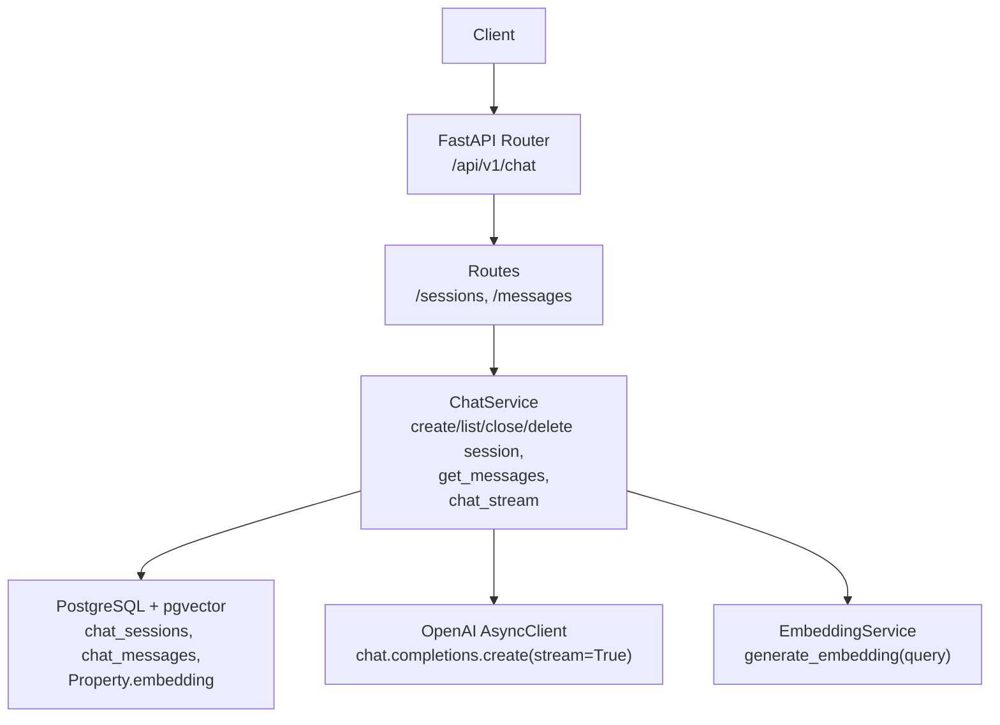
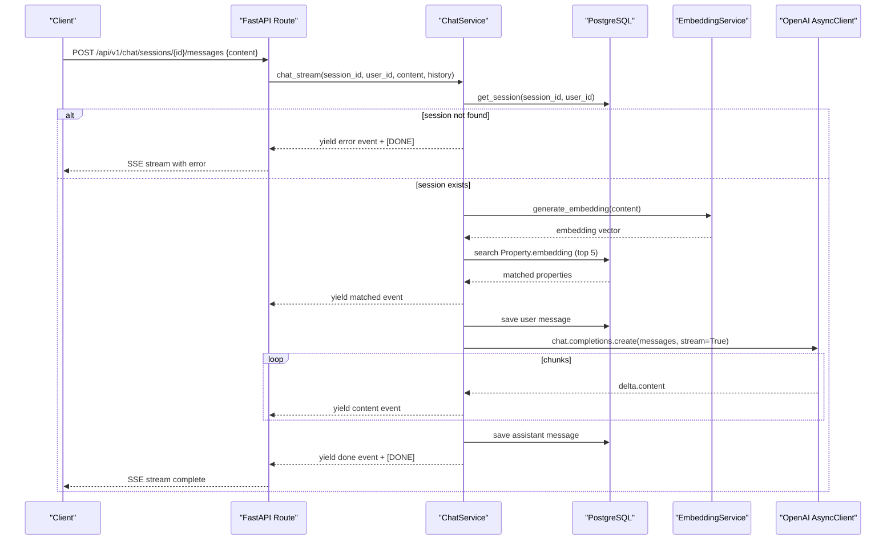
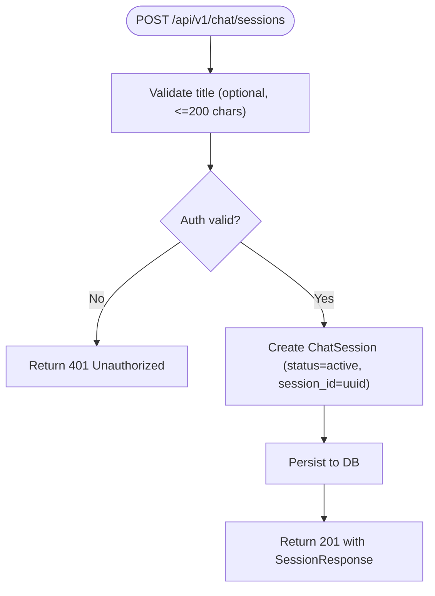
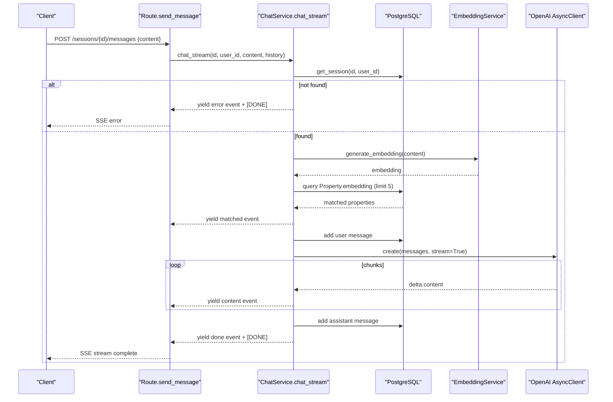
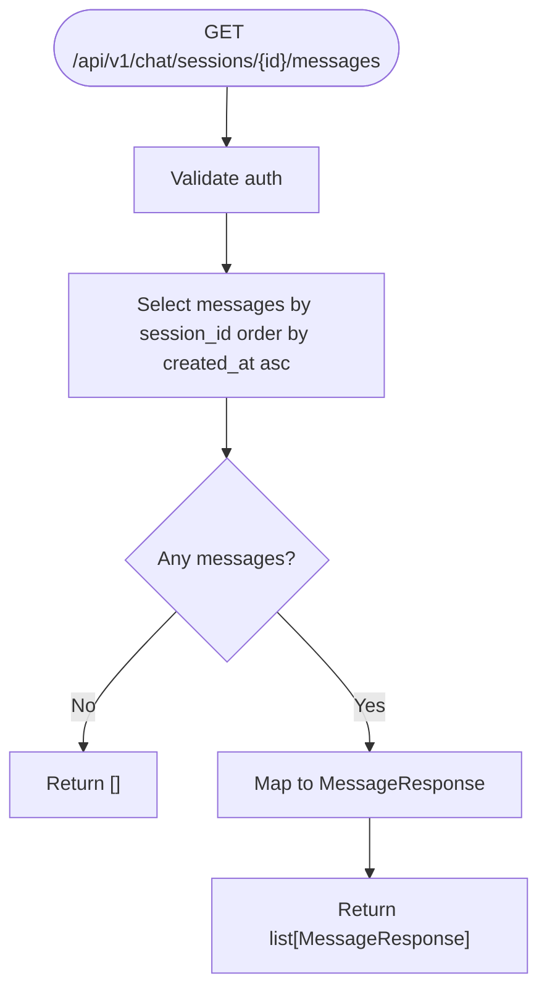
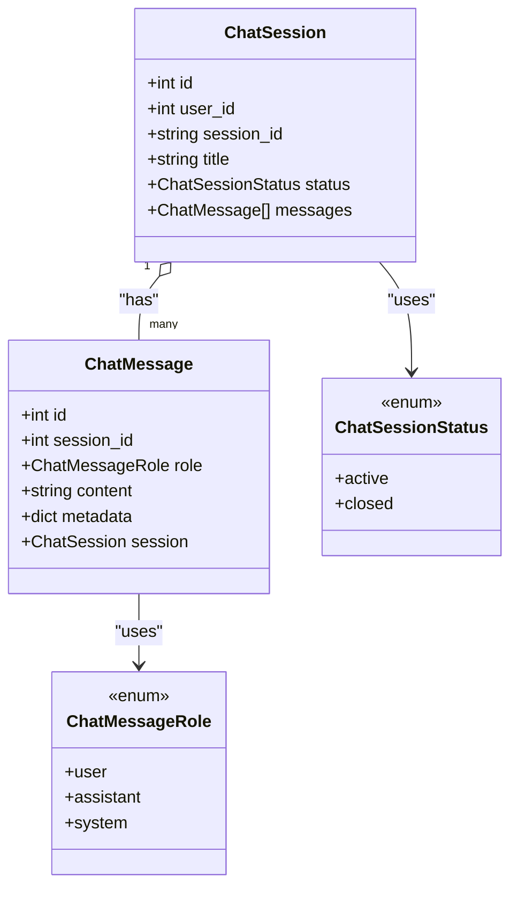
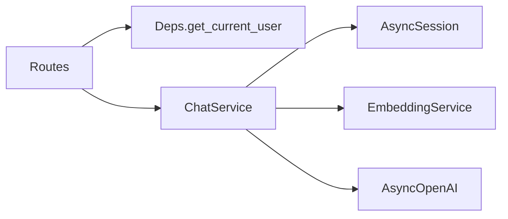

# Chat Assistant API

<cite>
**Referenced Files in This Document**
- [chat.py](file://backend/app/api/v1/routes/chat.py)
- [chat_service.py](file://backend/app/services/chat_service.py)
- [chat.py (models)](file://backend/app/models/chat.py)
- [deps.py](file://backend/app/api/deps.py)
- [security.py](file://backend/app/core/security.py)
- [config.py](file://backend/app/core/config.py)
- [router.py](file://backend/app/api/v1/router.py)
- [test_chat.py](file://backend/tests/test_chat.py)
- [chat.ts (frontend service)](file://frontend/src/services/chat.ts)
- [chat.ts (frontend types)](file://frontend/src/types/chat.ts)
</cite>

## Table of Contents
1. [Introduction](#introduction)
2. [Project Structure](#project-structure)
3. [Core Components](#core-components)
4. [Architecture Overview](#architecture-overview)
5. [Detailed Component Analysis](#detailed-component-analysis)
6. [Dependency Analysis](#dependency-analysis)
7. [Performance Considerations](#performance-considerations)
8. [Troubleshooting Guide](#troubleshooting-guide)
9. [Conclusion](#conclusion)
10. [Appendices](#appendices)

## Introduction
This document provides comprehensive API documentation for the AI Chat Assistant endpoints. It covers session management, real-time chat via Server-Sent Events (SSE), and conversation history retrieval. It also details authentication requirements, request/response schemas, SSE event formats, error handling, rate limiting considerations, fallback mechanisms when AI services are unavailable, session state management, conversation context preservation, and performance optimization strategies for real-time interactions.

## Project Structure
The Chat Assistant is implemented as a FastAPI module under the v1 API router. The key files include:
- Routes: define HTTP endpoints and request/response models
- Service: implements business logic, database access, RAG context building, and streaming responses
- Models: define persistent entities for sessions and messages
- Dependencies: provide authentication and database session injection
- Configuration: externalizes keys and model settings
- Tests: validate behavior and auth requirements
- Frontend types/service: illustrate client-side usage and SSE event shape

**Diagram sources**
- [router.py:1-23](file://backend/app/api/v1/router.py#L1-L23)
- [chat.py:1-143](file://backend/app/api/v1/routes/chat.py#L1-L143)
- [chat_service.py:1-302](file://backend/app/services/chat_service.py#L1-L302)
- [chat.py (models):1-62](file://backend/app/models/chat.py#L1-L62)

**Section sources**
- [router.py:1-23](file://backend/app/api/v1/router.py#L1-L23)
- [chat.py:1-143](file://backend/app/api/v1/routes/chat.py#L1-L143)

## Core Components
- Session Management Endpoints
  - POST /api/v1/chat/sessions
  - GET /api/v1/chat/sessions
  - DELETE /api/v1/chat/sessions/{session_id}
- Real-Time Chat Endpoint
  - POST /api/v1/chat/sessions/{session_id}/messages (SSE stream)
- Conversation History Retrieval
  - GET /api/v1/chat/sessions/{session_id}/messages

Authentication
- All endpoints require a valid Bearer token obtained from the auth flow. Unauthorized requests return 401 with WWW-Authenticate header.

Request/Response Schemas
- CreateSessionRequest
  - title: optional string, max length 200
- SessionResponse
  - id: integer
  - session_id: string (unique per session)
  - title: string or null
  - status: "active" | "closed"
  - created_at: ISO timestamp
  - updated_at: ISO timestamp
- MessageRequest
  - content: string, min length 1, max length 4000
- MessageResponse
  - id: integer
  - session_id: integer
  - role: "user" | "assistant" | "system"
  - content: string
  - metadata: object (nullable)
  - created_at: ISO timestamp

Streaming Response Format (SSE)
- Media type: text/event-stream
- Headers: Cache-Control: no-cache; Connection: keep-alive; X-Accel-Buffering: no
- Event format: data: <JSON>\n\n
  - Types:
    - matched: { type: "matched", properties: MatchedProperty[] }
    - content: { type: "content", content: string }
    - done: { type: "done" }
    - error: { type: "error", error: string }
  - Termination: final line data: [DONE]\n\n

Error Handling
- 401 Unauthorized if missing or invalid token
- 404 Not Found if session does not exist on delete
- Streaming errors yield an error event followed by [DONE]

Rate Limiting
- Rate limit configuration exists but is not applied to chat endpoints in the current implementation.

Fallback Mechanisms
- If the OpenAI client is unavailable or raises an exception during streaming, the service yields an error event and terminates the stream gracefully.

Session State Management
- Sessions have statuses active/closed.
- First message auto-sets session title if none provided.
- Messages are persisted with roles and metadata.

Conversation Context Preservation
- On sending a message, existing conversation history is fetched and included in the prompt to maintain context.
- RAG context is built using embeddings and returned alongside streamed content.

Performance Optimization
- Asynchronous database operations via asyncpg
- Streaming reduces perceived latency
- RAG limits top matches to 5
- Prompt tokens controlled via temperature and max_tokens

**Section sources**
- [chat.py:15-43](file://backend/app/api/v1/routes/chat.py#L15-L43)
- [chat.py:47-143](file://backend/app/api/v1/routes/chat.py#L47-L143)
- [chat_service.py:17-302](file://backend/app/services/chat_service.py#L17-L302)
- [chat.py (models):12-62](file://backend/app/models/chat.py#L12-L62)
- [deps.py:11-30](file://backend/app/api/deps.py#L11-L30)
- [config.py:46-66](file://backend/app/core/config.py#L46-L66)
- [test_chat.py:162-175](file://backend/tests/test_chat.py#L162-L175)

## Architecture Overview
The chat system integrates user sessions, message persistence, RAG-based property matching, and OpenAI streaming completions.

**Diagram sources**
- [chat.py:106-130](file://backend/app/api/v1/routes/chat.py#L106-L130)
- [chat_service.py:227-302](file://backend/app/services/chat_service.py#L227-L302)
- [chat.py (models):45-62](file://backend/app/models/chat.py#L45-L62)

## Detailed Component Analysis

### Session Management Endpoints

- POST /api/v1/chat/sessions
  - Purpose: Create a new chat session for the authenticated user.
  - Request body: CreateSessionRequest (title optional)
  - Response: SessionResponse
  - Status codes: 201 Created
  - Authentication: Required (Bearer token)
  - Behavior: Generates unique session_id, sets status to active, persists to DB

- GET /api/v1/chat/sessions
  - Purpose: List all sessions for the authenticated user.
  - Response: list[SessionResponse], ordered by updated_at desc
  - Status codes: 200 OK
  - Authentication: Required (Bearer token)

- DELETE /api/v1/chat/sessions/{session_id}
  - Purpose: Delete a specific session owned by the authenticated user.
  - Path parameter: session_id (integer)
  - Response: 204 No Content on success
  - Error: 404 Not Found if session does not exist
  - Authentication: Required (Bearer token)

**Diagram sources**
- [chat.py:47-62](file://backend/app/api/v1/routes/chat.py#L47-L62)
- [chat_service.py:26-36](file://backend/app/services/chat_service.py#L26-L36)
- [chat.py (models):23-42](file://backend/app/models/chat.py#L23-L42)

**Section sources**
- [chat.py:47-82](file://backend/app/api/v1/routes/chat.py#L47-L82)
- [chat_service.py:26-53](file://backend/app/services/chat_service.py#L26-L53)
- [chat.py (models):23-42](file://backend/app/models/chat.py#L23-L42)
- [deps.py:19-30](file://backend/app/api/deps.py#L19-L30)
- [test_chat.py:6-34](file://backend/tests/test_chat.py#L6-L34)

### Real-Time Chat Interface (SSE)

- POST /api/v1/chat/sessions/{session_id}/messages
  - Purpose: Send a message and receive a streaming response via SSE.
  - Path parameter: session_id (integer)
  - Request body: MessageRequest (content required, 1–4000 chars)
  - Response: text/event-stream with events:
    - matched: initial payload containing matched properties
    - content: incremental text chunks
    - done: completion marker
    - error: error payload followed by [DONE]
  - Headers:
    - media_type: text/event-stream
    - Cache-Control: no-cache
    - Connection: keep-alive
    - X-Accel-Buffering: no
  - Authentication: Required (Bearer token)
  - Behavior:
    - Fetches existing conversation history for context
    - Builds RAG context using embeddings and property similarity
    - Streams OpenAI completion chunks
    - Persists user and assistant messages with metadata

**Diagram sources**
- [chat.py:106-130](file://backend/app/api/v1/routes/chat.py#L106-L130)
- [chat_service.py:227-302](file://backend/app/services/chat_service.py#L227-L302)

**Section sources**
- [chat.py:106-130](file://backend/app/api/v1/routes/chat.py#L106-L130)
- [chat_service.py:227-302](file://backend/app/services/chat_service.py#L227-L302)
- [chat.ts (frontend types):35-41](file://frontend/src/types/chat.ts#L35-L41)

### Conversation History Retrieval

- GET /api/v1/chat/sessions/{session_id}/messages
  - Purpose: Retrieve all messages for a given session.
  - Path parameter: session_id (integer)
  - Response: list[MessageResponse], ordered by created_at asc
  - Authentication: Required (Bearer token)
  - Behavior: Returns empty array if session has no messages

**Diagram sources**
- [chat.py:85-103](file://backend/app/api/v1/routes/chat.py#L85-L103)
- [chat_service.py:73-83](file://backend/app/services/chat_service.py#L73-L83)
- [chat.py (models):45-62](file://backend/app/models/chat.py#L45-L62)

**Section sources**
- [chat.py:85-103](file://backend/app/api/v1/routes/chat.py#L85-L103)
- [chat_service.py:73-83](file://backend/app/services/chat_service.py#L73-L83)
- [chat.ts (frontend types):10-20](file://frontend/src/types/chat.ts#L10-L20)

### Data Models

**Diagram sources**
- [chat.py (models):12-62](file://backend/app/models/chat.py#L12-L62)

**Section sources**
- [chat.py (models):12-62](file://backend/app/models/chat.py#L12-L62)

## Dependency Analysis
- Authentication dependency: get_current_user enforces Bearer token validation and returns 401 on failure.
- Database dependency: get_db_session provides an async SQLAlchemy session.
- External dependencies:
  - OpenAI AsyncClient for chat completions (streaming)
  - EmbeddingService for generating embeddings and querying pgvector
  - PostgreSQL with pgvector extension for similarity search

**Diagram sources**
- [deps.py:11-30](file://backend/app/api/deps.py#L11-L30)
- [chat_service.py:17-23](file://backend/app/services/chat_service.py#L17-L23)

**Section sources**
- [deps.py:11-30](file://backend/app/api/deps.py#L11-L30)
- [chat_service.py:17-23](file://backend/app/services/chat_service.py#L17-L23)
- [config.py:46-66](file://backend/app/core/config.py#L46-L66)

## Performance Considerations
- Use asynchronous I/O for DB and OpenAI calls to reduce latency.
- Stream responses to improve perceived responsiveness.
- Limit RAG context size (top 5 properties) to control prompt size and cost.
- Control token usage via temperature and max_tokens.
- Ensure proper caching headers are set for SSE to avoid buffering issues.
- Consider implementing server-side rate limiting middleware if needed.

## Troubleshooting Guide
Common issues and resolutions:
- 401 Unauthorized
  - Cause: Missing or invalid Bearer token
  - Resolution: Ensure Authorization header includes a valid token from login endpoint
- 404 Not Found on delete
  - Cause: Session ID does not belong to the authenticated user or does not exist
  - Resolution: Verify session_id and ownership
- SSE stream not terminating
  - Cause: Client not reading until [DONE] or network interruption
  - Resolution: Implement client-side retry and reconnection logic; ensure proper event parsing
- AI service unavailable
  - Cause: OpenAI client raises an exception
  - Resolution: Service yields error event and terminates stream; implement client fallback UI and retry after delay

**Section sources**
- [deps.py:19-30](file://backend/app/api/deps.py#L19-L30)
- [chat.py:133-143](file://backend/app/api/v1/routes/chat.py#L133-L143)
- [chat_service.py:298-302](file://backend/app/services/chat_service.py#L298-L302)
- [test_chat.py:162-175](file://backend/tests/test_chat.py#L162-L175)

## Conclusion
The Chat Assistant API provides robust session management, real-time chat via SSE, and conversation history retrieval. It leverages RAG to enrich responses with relevant property information and maintains conversation context across messages. Authentication is enforced at the route level, and streaming ensures efficient real-time interactions. While rate limiting configuration exists, it is not currently applied to chat endpoints; consider adding middleware for production use. Proper client-side handling of SSE events and error scenarios will enhance reliability and user experience.

## Appendices

### Authentication Requirements
- All chat endpoints require a Bearer token obtained from the auth login endpoint.
- Unauthorized requests return 401 with WWW-Authenticate: Bearer.

**Section sources**
- [deps.py:11-30](file://backend/app/api/deps.py#L11-L30)
- [test_chat.py:162-175](file://backend/tests/test_chat.py#L162-L175)

### SSE Event Formats
- matched: { type: "matched", properties: MatchedProperty[] }
- content: { type: "content", content: string }
- done: { type: "done" }
- error: { type: "error", error: string }
- Termination: data: [DONE]\n\n

**Section sources**
- [chat_service.py:254-296](file://backend/app/services/chat_service.py#L254-L296)
- [chat.ts (frontend types):35-41](file://frontend/src/types/chat.ts#L35-L41)

### Client-Side Streaming Response Handling
- Use an SSE client to connect to POST /api/v1/chat/sessions/{session_id}/messages
- Parse events:
  - matched: render suggested properties
  - content: append incremental text
  - done: finalize rendering
  - error: display error and allow retry
- Handle connection drops with exponential backoff and reconnection

**Section sources**
- [chat.ts (frontend types):35-41](file://frontend/src/types/chat.ts#L35-L41)
- [chat.ts (frontend service):1-24](file://frontend/src/services/chat.ts#L1-L24)

### Rate Limiting Considerations
- Configuration fields exist for rate limiting (requests per window).
- Not currently enforced on chat endpoints.
- Recommendation: Add middleware to enforce per-user or global limits and return 429 Too Many Requests with Retry-After header.

**Section sources**
- [config.py:153-161](file://backend/app/core/config.py#L153-L161)

### Fallback Mechanisms When AI Services Are Unavailable
- On exceptions during streaming, the service yields an error event and terminates the stream.
- Clients should detect error events and present a fallback UI (e.g., “Service temporarily unavailable. Please try again later.”).
- Consider implementing a queue or background job to retry failed requests and notify users upon completion.

**Section sources**
- [chat_service.py:298-302](file://backend/app/services/chat_service.py#L298-L302)