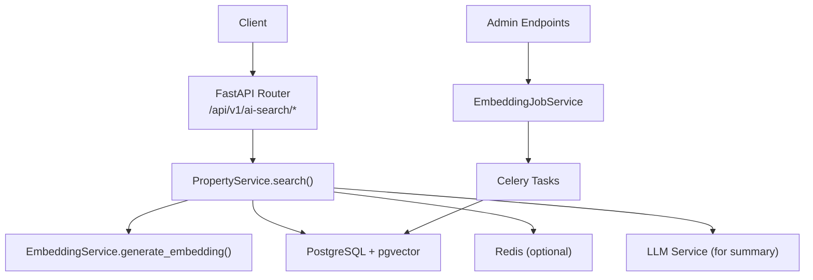
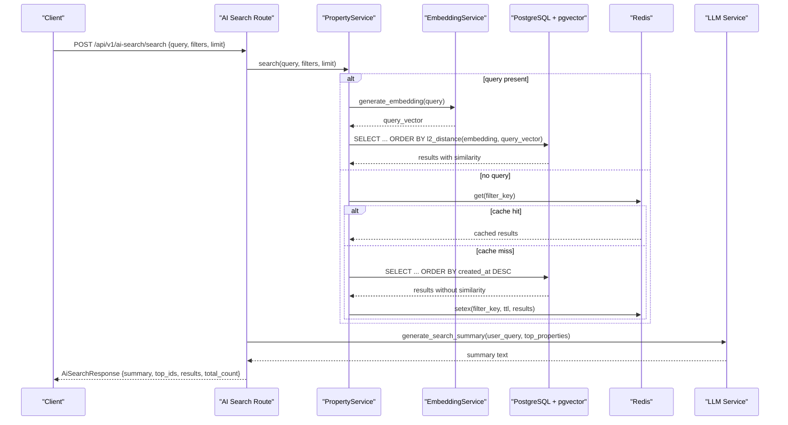
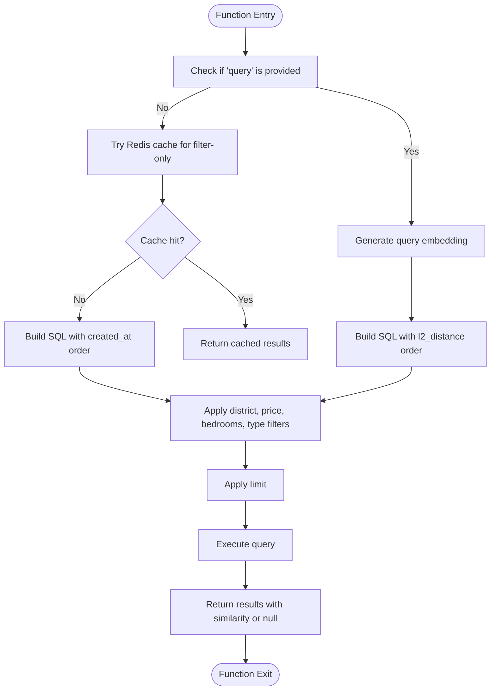
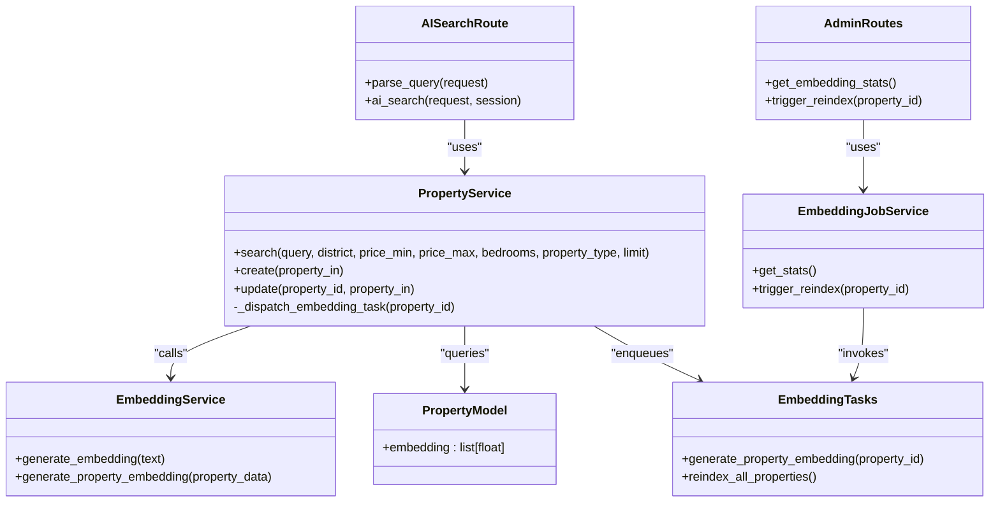

# Semantic Search & Vector Embeddings API

<cite>
**Referenced Files in This Document**
- [ai_search.py](file://backend/app/api/v1/routes/ai_search.py)
- [ai_search.py](file://backend/app/schemas/ai_search.py)
- [property_service.py](file://backend/app/services/property_service.py)
- [embedding_service.py](file://backend/app/services/embedding_service.py)
- [property.py](file://backend/app/models/property.py)
- [indexes.py](file://backend/app/db/indexes.py)
- [20260620_0002_pgvector_embedding.py](file://backend/alembic/versions/20260620_0002_pgvector_embedding.py)
- [00-enable-vector.sql](file://docker/pg-init/00-enable-vector.sql)
- [config.py](file://backend/app/core/config.py)
- [embedding_tasks.py](file://backend/app/tasks/embedding_tasks.py)
- [embedding_job_service.py](file://backend/app/services/embedding_job_service.py)
- [admin.py](file://backend/app/api/v1/routes/admin.py)
</cite>

## Table of Contents
1. [Introduction](#introduction)
2. [Project Structure](#project-structure)
3. [Core Components](#core-components)
4. [Architecture Overview](#architecture-overview)
5. [Detailed Component Analysis](#detailed-component-analysis)
6. [Dependency Analysis](#dependency-analysis)
7. [Performance Considerations](#performance-considerations)
8. [Troubleshooting Guide](#troubleshooting-guide)
9. [Conclusion](#conclusion)
10. [Appendices](#appendices)

## Introduction
This document provides detailed API documentation for semantic search and vector embedding endpoints. It covers natural language query processing, vector similarity matching using pgvector, result ranking algorithms, embedding generation processes (single and batch), and vector index optimization. It also documents search query syntax, filtering parameters, result pagination, relevance scoring, performance considerations, caching strategies, rate limiting guidance, fallback mechanisms, and scaling recommendations.

## Project Structure
The semantic search feature is implemented across FastAPI routes, services, models, tasks, and database migrations:
- API route for AI-powered search and parsing
- Schemas defining request/response structures
- Property service implementing vector similarity search with pgvector
- Embedding service generating vectors via OpenAI embeddings
- Celery tasks for asynchronous embedding generation and reindexing
- Database models and indexes for pgvector support
- Admin endpoints to monitor and trigger embedding jobs

**Diagram sources**
- [ai_search.py:80-160](file://backend/app/api/v1/routes/ai_search.py#L80-L160)
- [property_service.py:91-195](file://backend/app/services/property_service.py#L91-L195)
- [embedding_service.py:17-32](file://backend/app/services/embedding_service.py#L17-L32)
- [admin.py:112-132](file://backend/app/api/v1/routes/admin.py#L112-L132)
- [embedding_tasks.py:16-111](file://backend/app/tasks/embedding_tasks.py#L16-L111)

**Section sources**
- [ai_search.py:80-160](file://backend/app/api/v1/routes/ai_search.py#L80-L160)
- [property_service.py:91-195](file://backend/app/services/property_service.py#L91-L195)
- [embedding_service.py:17-32](file://backend/app/services/embedding_service.py#L17-L32)
- [admin.py:112-132](file://backend/app/api/v1/routes/admin.py#L112-L132)
- [embedding_tasks.py:16-111](file://backend/app/tasks/embedding_tasks.py#L16-L111)

## Core Components
- AI Search Route: Provides two endpoints:
  - Parse natural language into structured parameters and completeness report
  - Execute semantic search and generate a concise summary
- Property Service: Implements hybrid search combining vector similarity and filters; caches non-vector results in Redis when available
- Embedding Service: Generates property and query embeddings using OpenAI embeddings model
- Database Model: Property includes an optional vector column for embeddings
- Index Optimization: IVFFlat index creation for efficient vector similarity queries
- Admin Endpoints: Provide embedding job statistics and reindex triggers

Key responsibilities:
- Natural language parsing and summarization are handled by the AI search route
- Vector similarity computation uses pgvector’s l2_distance
- Caching improves performance for deterministic filter-only searches
- Asynchronous embedding generation ensures non-blocking writes

**Section sources**
- [ai_search.py:80-160](file://backend/app/api/v1/routes/ai_search.py#L80-L160)
- [ai_search.py:37-74](file://backend/app/schemas/ai_search.py#L37-L74)
- [property_service.py:91-195](file://backend/app/services/property_service.py#L91-L195)
- [embedding_service.py:17-32](file://backend/app/services/embedding_service.py#L17-L32)
- [property.py:38-86](file://backend/app/models/property.py#L38-L86)
- [indexes.py:16-48](file://backend/app/db/indexes.py#L16-L48)
- [admin.py:112-132](file://backend/app/api/v1/routes/admin.py#L112-L132)

## Architecture Overview
The semantic search pipeline integrates multiple layers:
- Client sends natural language or structured queries
- Route composes a search query string from provided fields
- Property service optionally generates a query embedding and performs vector similarity search
- Filters (district, price range, bedrooms, property type) are applied on top of similarity ordering
- Results include similarity scores where applicable
- Optional Redis cache stores deterministic filter-only results
- Optional LLM summarizes top results

**Diagram sources**
- [ai_search.py:98-160](file://backend/app/api/v1/routes/ai_search.py#L98-L160)
- [property_service.py:91-195](file://backend/app/services/property_service.py#L91-L195)
- [embedding_service.py:23-32](file://backend/app/services/embedding_service.py#L23-L32)

**Section sources**
- [ai_search.py:98-160](file://backend/app/api/v1/routes/ai_search.py#L98-L160)
- [property_service.py:91-195](file://backend/app/services/property_service.py#L91-L195)
- [embedding_service.py:23-32](file://backend/app/services/embedding_service.py#L23-L32)

## Detailed Component Analysis

### Semantic Search Endpoint: POST /api/v1/ai-search/search
- Purpose: Accepts natural language and/or structured filters, executes semantic search, and returns ranked results with optional AI summary.
- Request body fields:
  - query: natural language description used for both vector search and summary generation
  - district: optional district filter
  - price_min, price_max: optional numeric price range
  - bedrooms: optional bedroom count
  - property_type: optional enum value
  - keywords: additional keywords (used to augment query text)
  - limit: number of results (bounded between 1 and 50)
- Response structure:
  - summary: AI-generated overview of top matches
  - top_ids: IDs of top three properties used for summary
  - results: list of property objects including similarity score when applicable
  - total_count: number of returned results
  - search_params: echo of the original request parameters

Behavior highlights:
- If query is provided, a vector embedding is generated and similarity is computed using l2_distance
- Filters are applied after similarity ordering
- Non-vector searches are cached in Redis with TTL
- Summary generation gracefully degrades if LLM is unavailable

Example request payload:
- {
    "query": "quiet apartment near university with 2 bedrooms under 5000",
    "district": "Changning",
    "price_min": 3000,
    "price_max": 5000,
    "bedrooms": 2,
    "property_type": "apartment",
    "keywords": "garden, balcony",
    "limit": 20
  }

Example response structure:
- {
    "summary": "Found X matching properties in Changning...",
    "top_ids": [123, 456, 789],
    "results": [
      {
        "id": 123,
        "title": "...",
        "description": "...",
        "address": "...",
        "district": "Changning",
        "price_monthly": 4500,
        "area_sqm": 80,
        "bedrooms": 2,
        "bathrooms": 1,
        "property_type": "apartment",
        "status": "available",
        "latitude": ...,
        "longitude": ...,
        "created_at": "...",
        "updated_at": "...",
        "images": [...],
        "similarity": 0.123
      }
    ],
    "total_count": 20,
    "search_params": { ... }
  }

Notes:
- Similarity values reflect distance; lower values indicate higher similarity when using l2_distance
- Pagination is not explicitly supported by this endpoint; use limit to control result size

**Section sources**
- [ai_search.py:98-160](file://backend/app/api/v1/routes/ai_search.py#L98-L160)
- [ai_search.py:52-74](file://backend/app/schemas/ai_search.py#L52-L74)
- [property_service.py:91-195](file://backend/app/services/property_service.py#L91-L195)

### Natural Language Parsing Endpoint: POST /api/v1/ai-search/parse
- Purpose: Parses user input into structured search parameters and reports missing fields.
- Request body fields:
  - query: natural language description
- Response structure:
  - params: parsed parameters (district, price_min, price_max, bedrooms, property_type, keywords)
  - completeness: report indicating whether all required fields are present and hints for missing ones

Error handling:
- Returns 503 when LLM parsing fails due to runtime issues
- Returns 502 when AI parsing service is temporarily unavailable

**Section sources**
- [ai_search.py:80-96](file://backend/app/api/v1/routes/ai_search.py#L80-L96)
- [ai_search.py:37-46](file://backend/app/schemas/ai_search.py#L37-L46)

### Vector Similarity Search Implementation
- Query embedding generation:
  - Uses EmbeddingService to call OpenAI embeddings API
  - The model name is configurable via settings
- Similarity metric:
  - l2_distance between stored property embeddings and query embedding
- Ordering:
  - Results ordered by ascending similarity (lower distance = more similar)
- Filtering:
  - District, price range, bedrooms, and property type are applied as WHERE clauses
- Caching:
  - Deterministic filter-only searches are cached in Redis with TTL
- Result enrichment:
  - Each result includes similarity when vector search is used

**Diagram sources**
- [property_service.py:91-195](file://backend/app/services/property_service.py#L91-L195)
- [embedding_service.py:23-32](file://backend/app/services/embedding_service.py#L23-L32)

**Section sources**
- [property_service.py:91-195](file://backend/app/services/property_service.py#L91-L195)
- [embedding_service.py:23-32](file://backend/app/services/embedding_service.py#L23-L32)

### Embedding Generation Processes
- Single property embedding:
  - Triggered asynchronously when creating or updating a property
  - Task creates an EmbeddingJob record, marks status transitions, fetches property data, generates text representation, calls EmbeddingService, and persists the embedding
- Batch reindexing:
  - Admin endpoint triggers reindexing for all properties lacking embeddings
  - Enqueues individual embedding tasks per property

Text composition for embeddings:
- Combines title, description, address, district, and property_type into a single text block

Task reliability:
- Auto-retry with backoff and max retries
- Error messages recorded in EmbeddingJob

**Section sources**
- [embedding_tasks.py:16-111](file://backend/app/tasks/embedding_tasks.py#L16-L111)
- [embedding_service.py:6-32](file://backend/app/services/embedding_service.py#L6-L32)
- [property_service.py:225-239](file://backend/app/services/property_service.py#L225-L239)

### Vector Index Optimization
- Extension setup:
  - PostgreSQL vector extension enabled at container initialization
- Migration:
  - Adds embedding column and creates IVFFlat index with default lists parameter
- Adaptive index creation:
  - Utility function computes optimal lists based on sqrt(row_count)
  - Skips index creation for small datasets (<1000 rows) to prefer exact scans

Index details:
- Index name: ix_properties_embedding_ivfflat
- Operator class: vector_l2_ops
- With clause: lists tuned adaptively

**Section sources**
- [00-enable-vector.sql:1-2](file://docker/pg-init/00-enable-vector.sql#L1-L2)
- [20260620_0002_pgvector_embedding.py:21-35](file://backend/alembic/versions/20260620_0002_pgvector_embedding.py#L21-L35)
- [indexes.py:16-48](file://backend/app/db/indexes.py#L16-L48)

### Admin Endpoints for Embedding Management
- Get embedding stats:
  - Returns counts for total, completed, failed, pending jobs
- Trigger reindex:
  - Reindex a specific property or all properties lacking embeddings
  - Logs admin actions for auditability

**Section sources**
- [admin.py:112-132](file://backend/app/api/v1/routes/admin.py#L112-L132)
- [embedding_job_service.py:21-53](file://backend/app/services/embedding_job_service.py#L21-L53)

## Dependency Analysis
The following diagram shows key dependencies among components involved in semantic search and embeddings:

**Diagram sources**
- [ai_search.py:80-160](file://backend/app/api/v1/routes/ai_search.py#L80-L160)
- [property_service.py:91-239](file://backend/app/services/property_service.py#L91-L239)
- [embedding_service.py:17-32](file://backend/app/services/embedding_service.py#L17-L32)
- [property.py:38-86](file://backend/app/models/property.py#L38-L86)
- [embedding_tasks.py:16-111](file://backend/app/tasks/embedding_tasks.py#L16-L111)
- [embedding_job_service.py:21-53](file://backend/app/services/embedding_job_service.py#L21-L53)
- [admin.py:112-132](file://backend/app/api/v1/routes/admin.py#L112-L132)

**Section sources**
- [ai_search.py:80-160](file://backend/app/api/v1/routes/ai_search.py#L80-L160)
- [property_service.py:91-239](file://backend/app/services/property_service.py#L91-L239)
- [embedding_service.py:17-32](file://backend/app/services/embedding_service.py#L17-L32)
- [property.py:38-86](file://backend/app/models/property.py#L38-L86)
- [embedding_tasks.py:16-111](file://backend/app/tasks/embedding_tasks.py#L16-L111)
- [embedding_job_service.py:21-53](file://backend/app/services/embedding_job_service.py#L21-L53)
- [admin.py:112-132](file://backend/app/api/v1/routes/admin.py#L112-L132)

## Performance Considerations
- Vector operations:
  - Use IVFFlat index with adaptive lists parameter for large datasets
  - For small datasets (<1000 rows), exact scan is preferred to avoid overhead
- Caching strategies:
  - Cache deterministic filter-only searches in Redis with TTL to reduce DB load
  - Vector similarity results are not cached due to dynamic query embeddings
- Rate limiting:
  - Configuration supports rate limiting parameters; apply middleware or gateway-level controls to protect LLM and embedding endpoints
- Fallback mechanisms:
  - LLM summary generation degrades gracefully when unavailable
  - Redis availability is optional; search proceeds without cache if Redis is down
- Scaling vector search:
  - Tune IVFFlat lists based on dataset size
  - Monitor pgvector index usage and adjust lists accordingly
  - Consider partitioning or sharding if dataset grows significantly

[No sources needed since this section provides general guidance]

## Troubleshooting Guide
Common issues and resolutions:
- LLM parsing failures:
  - 503 indicates runtime errors during parsing; check LLM configuration and connectivity
  - 502 indicates temporary unavailability; retry later or verify service health
- Embedding generation failures:
  - Check EmbeddingJob status and error_message for details
  - Ensure OpenAI API key and model settings are correct
- Vector index not used:
  - Verify pgvector extension is enabled
  - Confirm IVFFlat index exists and lists parameter is appropriate
- Redis cache misses:
  - Validate Redis URL and connectivity
  - Inspect logs for cache retrieval/write failures

Operational checks:
- Use admin endpoints to view embedding stats and trigger reindexing
- Review task logs for retries and failures

**Section sources**
- [ai_search.py:80-96](file://backend/app/api/v1/routes/ai_search.py#L80-L96)
- [embedding_tasks.py:70-76](file://backend/app/tasks/embedding_tasks.py#L70-L76)
- [indexes.py:16-48](file://backend/app/db/indexes.py#L16-L48)
- [admin.py:112-132](file://backend/app/api/v1/routes/admin.py#L112-L132)

## Conclusion
The semantic search system combines natural language parsing, vector similarity matching with pgvector, and robust administrative tooling for embedding management. It leverages caching for deterministic queries and provides graceful degradation when external services are unavailable. Proper index tuning and monitoring ensure scalable and performant vector search operations.

[No sources needed since this section summarizes without analyzing specific files]

## Appendices

### Search Query Syntax and Filtering Parameters
- Natural language query:
  - Free-form text describing desired properties
  - Used to generate query embedding and summarize top results
- Structured filters:
  - district: string
  - price_min, price_max: numeric
  - bedrooms: integer
  - property_type: enum (apartment, house, studio, shared)
- Result pagination:
  - limit parameter controls number of results returned
  - No explicit offset/pagination support in this endpoint

**Section sources**
- [ai_search.py:98-160](file://backend/app/api/v1/routes/ai_search.py#L98-L160)
- [ai_search.py:52-74](file://backend/app/schemas/ai_search.py#L52-L74)
- [property_service.py:91-195](file://backend/app/services/property_service.py#L91-L195)

### Embedding Payloads and Text Composition
- Property embedding text composition:
  - Combines title, description, address, district, and property_type
- Embedding generation:
  - Calls OpenAI embeddings API with configured model
- Batch operations:
  - Admin-triggered reindex enqueues tasks for all properties lacking embeddings

**Section sources**
- [embedding_service.py:6-32](file://backend/app/services/embedding_service.py#L6-L32)
- [embedding_tasks.py:83-111](file://backend/app/tasks/embedding_tasks.py#L83-L111)
- [admin.py:120-132](file://backend/app/api/v1/routes/admin.py#L120-L132)

### Configuration and Environment Variables
- OpenAI settings:
  - openai_api_key, openai_embedding_model
- DeepSeek LLM settings:
  - deepseek_api_key, deepseek_chat_model, deepseek_base_url
- Redis settings:
  - redis_url
- Rate limiting:
  - rate_limit_requests, rate_limit_window_seconds

**Section sources**
- [config.py:46-70](file://backend/app/core/config.py#L46-L70)
- [config.py:24-24](file://backend/app/core/config.py#L24-L24)
- [config.py:153-161](file://backend/app/core/config.py#L153-L161)