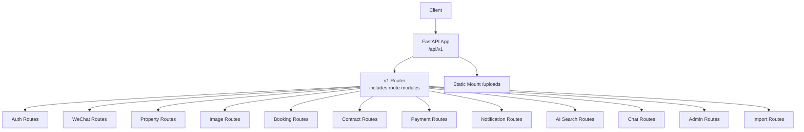
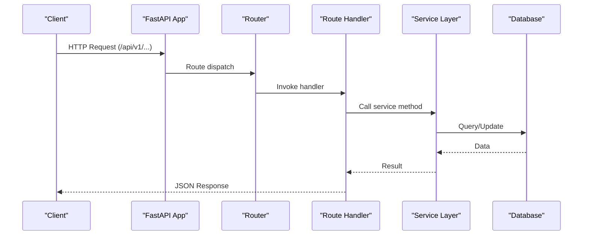
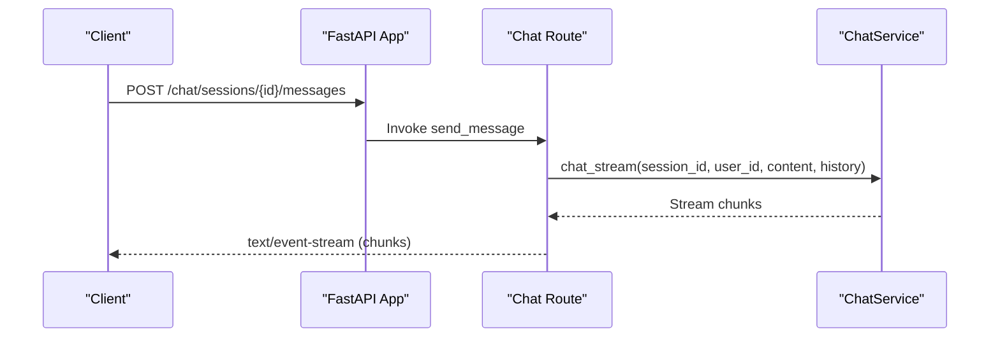
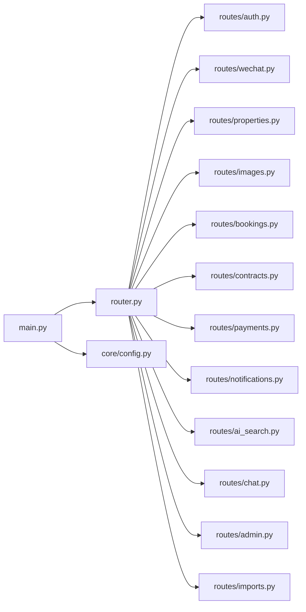

# API Reference

<cite>
**Referenced Files in This Document**
- [main.py](file://backend/app/main.py)
- [router.py](file://backend/app/api/v1/router.py)
- [config.py](file://backend/app/core/config.py)
- [auth.py](file://backend/app/api/v1/routes/auth.py)
- [wechat.py](file://backend/app/api/v1/routes/wechat.py)
- [properties.py](file://backend/app/api/v1/routes/properties.py)
- [images.py](file://backend/app/api/v1/routes/images.py)
- [bookings.py](file://backend/app/api/v1/routes/bookings.py)
- [contracts.py](file://backend/app/api/v1/routes/contracts.py)
- [payments.py](file://backend/app/api/v1/routes/payments.py)
- [notifications.py](file://backend/app/api/v1/routes/notifications.py)
- [ai_search.py](file://backend/app/api/v1/routes/ai_search.py)
- [chat.py](file://backend/app/api/v1/routes/chat.py)
- [admin.py](file://backend/app/api/v1/routes/admin.py)
- [imports.py](file://backend/app/api/v1/routes/imports.py)
</cite>

## Table of Contents
1. Introduction
2. Project Structure
3. Core Components
4. Architecture Overview
5. Detailed Component Analysis
6. Dependency Analysis
7. Performance Considerations
8. Troubleshooting Guide
9. Conclusion
10. Appendices

## Introduction
This document provides comprehensive API documentation for the Rental Housing Structure platform’s REST endpoints. It covers authentication, property management (including semantic search), booking system, chat assistant with SSE streaming, admin management, import/export, and notifications. Each endpoint includes HTTP methods, URL patterns, request/response schemas, authentication requirements, parameter specifications, status codes, validation rules, and examples. Authentication uses JWT tokens with role-based access control and rate limiting. API versioning is provided via a prefix path. Deprecation policies and migration guidance are included to support client evolution.

## Project Structure
The backend exposes all APIs under a single FastAPI application with a versioned router. Middleware handles CORS, Prometheus metrics, rate limiting, logging, and global exception handling. Static uploads are mounted for image retrieval.

**Diagram sources**
- [main.py:17-82](file://backend/app/main.py#L17-L82)
- [router.py:1-23](file://backend/app/api/v1/router.py#L1-L23)

**Section sources**
- [main.py:17-82](file://backend/app/main.py#L17-L82)
- [router.py:1-23](file://backend/app/api/v1/router.py#L1-L23)
- [config.py:10-12](file://backend/app/core/config.py#L10-L12)

## Core Components
- Versioning: All endpoints are prefixed by the configured API v1 prefix (default /api/v1).
- Authentication: Bearer JWT tokens; some endpoints require specific roles (tenant, landlord, admin).
- Rate Limiting: Redis-backed middleware applied globally when available.
- CORS: Configurable per environment.
- Metrics: Prometheus middleware and /metrics endpoint enabled.
- Logging: Request/response logging middleware.
- Exceptions: Global handlers registered.

Key configuration values include app name, API prefix, token expiration, upload limits, and third-party service settings.

**Section sources**
- [main.py:17-82](file://backend/app/main.py#L17-L82)
- [config.py:10-12](file://backend/app/core/config.py#L10-L12)
- [config.py:26-38](file://backend/app/core/config.py#L26-L38)
- [config.py:99-105](file://backend/app/core/config.py#L99-L105)
- [config.py:153-161](file://backend/app/core/config.py#L153-L161)

## Architecture Overview
The API follows a layered structure:
- Controllers (routes) define HTTP endpoints and validate inputs.
- Services encapsulate business logic and data operations.
- Models represent database entities.
- Schemas define request/response structures.
- Middleware provides cross-cutting concerns (CORS, metrics, rate limiting, logging).

[No sources needed since this diagram shows conceptual workflow, not actual code structure]

## Detailed Component Analysis

### Authentication Endpoints
Base path: /api/v1/auth

- POST /auth/register
  - Description: Register a new user account.
  - Authentication: None
  - Request body: See auth schema definitions.
  - Success response: Current user profile.
  - Status codes: 201 Created, 409 Conflict (duplicate username/email/phone).
  - Validation: Unique constraints enforced at registration.
  - Example curl:
    - curl -X POST https://api.example.com/api/v1/auth/register -H "Content-Type: application/json" -d '{"username":"...","email":"...","password":"..."}'

- POST /auth/login
  - Description: Authenticate with identifier and password; returns access token.
  - Authentication: None
  - Request body: Identifier and password.
  - Success response: TokenResponse with access_token.
  - Status codes: 200 OK, 401 Unauthorized (invalid credentials).
  - Example curl:
    - curl -X POST https://api.example.com/api/v1/auth/login -H "Content-Type: application/json" -d '{"identifier":"...","password":"..."}'

- POST /auth/refresh
  - Description: Issue a new access token using a refresh token from Authorization header.
  - Authentication: Requires Bearer refresh token.
  - Request headers: Authorization: Bearer <refresh_token>.
  - Success response: TokenResponse with new access_token.
  - Status codes: 200 OK, 401 Unauthorized (missing or invalid refresh token).
  - Example curl:
    - curl -X POST https://api.example.com/api/v1/auth/refresh -H "Authorization: Bearer <refresh_token>"

- GET /auth/me
  - Description: Get current authenticated user profile.
  - Authentication: Required (Bearer token).
  - Success response: Current user profile.
  - Status codes: 200 OK, 401 Unauthorized.
  - Example curl:
    - curl -X GET https://api.example.com/api/v1/auth/me -H "Authorization: Bearer <access_token>"

Authentication flow notes:
- Tokens are JWT; access token lifetime and algorithm are configurable.
- Refresh token rotation is supported via the refresh endpoint.
- Role-based access control is enforced by dependencies on routes requiring tenant, landlord, or admin roles.

**Section sources**
- [auth.py:14-34](file://backend/app/api/v1/routes/auth.py#L14-L34)
- [auth.py:37-60](file://backend/app/api/v1/routes/auth.py#L37-L60)
- [auth.py:63-89](file://backend/app/api/v1/routes/auth.py#L63-L89)
- [auth.py:92-94](file://backend/app/api/v1/routes/auth.py#L92-L94)
- [config.py:26-38](file://backend/app/core/config.py#L26-L38)

### WeChat Mini Program Endpoints
Base path: /api/v1

- POST /auth/wechat/login
  - Description: Exchange WeChat login code for JWT access token.
  - Authentication: None
  - Request body: WeChat login code.
  - Success response: Access token, user info, and whether it is a new user.
  - Status codes: 200 OK, 400 Bad Request (invalid code).
  - Example curl:
    - curl -X POST https://api.example.com/api/v1/auth/wechat/login -H "Content-Type: application/json" -d '{"code":"..."}'

- POST /auth/wechat/phone
  - Description: Bind WeChat phone number to the current user account.
  - Authentication: Required (Bearer token).
  - Request body: WeChat phone code.
  - Success response: Phone number bound.
  - Status codes: 200 OK, 400 Bad Request (binding failed).
  - Example curl:
    - curl -X POST https://api.example.com/api/v1/auth/wechat/phone -H "Authorization: Bearer <access_token>" -H "Content-Type: application/json" -d '{"code":"..."}'

- GET /wechat/config
  - Description: Retrieve WeChat Mini Program configuration (e.g., appid).
  - Authentication: None
  - Success response: Configuration object.
  - Status codes: 200 OK.
  - Example curl:
    - curl -X GET https://api.example.com/api/v1/wechat/config

**Section sources**
- [wechat.py:19-38](file://backend/app/api/v1/routes/wechat.py#L19-L38)
- [wechat.py:41-74](file://backend/app/api/v1/routes/wechat.py#L41-L74)
- [wechat.py:77-81](file://backend/app/api/v1/routes/wechat.py#L77-L81)

### Property Management APIs
Base path: /api/v1/properties

- POST /properties
  - Description: Create a new property (landlord only).
  - Authentication: Required (Bearer token; landlord or admin).
  - Request body: PropertyCreate schema fields.
  - Success response: PropertyRead.
  - Status codes: 201 Created, 403 Forbidden (not owner/admin), 422 Unprocessable Entity (invalid landlord_id).
  - Example curl:
    - curl -X POST https://api.example.com/api/v1/properties -H "Authorization: Bearer <access_token>" -H "Content-Type: application/json" -d '{"title":"...","description":"...","address":"...","district":"...","price_monthly":1234,"area_sqm":50,"bedrooms":2,"bathrooms":1,"property_type":"apartment","landlord_id":1}'

- GET /properties/search
  - Description: Semantic and filter-based property search.
  - Authentication: None
  - Query parameters:
    - q: Natural language query
    - district: District filter
    - price_min, price_max: Price range (>= 0)
    - bedrooms: Number of bedrooms (>= 0)
    - property_type: Type filter
    - limit: Pagination limit (1..100)
  - Success response: List of PropertySearchResult objects including images and similarity scores.
  - Status codes: 200 OK.
  - Example curl:
    - curl -G "https://api.example.com/api/v1/properties/search" --data-urlencode "q=cozy apartment near university" --data-urlencode "district=Xuhui" --data-urlencode "price_min=2000" --data-urlencode "price_max=5000" --data-urlencode "bedrooms=2" --data-urlencode "limit=20"

- GET /properties
  - Description: List properties with pagination and filters.
  - Authentication: None
  - Query parameters:
    - skip: Offset (>= 0)
    - limit: Page size (1..100)
    - district: District filter
    - status: Status filter (alias "status")
  - Success response: List of PropertyRead.
  - Status codes: 200 OK.
  - Example curl:
    - curl -G "https://api.example.com/api/v1/properties" --data-urlencode "skip=0" --data-urlencode "limit=20" --data-urlencode "district=Hongkou" --data-urlencode "status=available"

- GET /properties/{property_id}
  - Description: Get property details.
  - Authentication: None
  - Path parameter: property_id (int)
  - Success response: PropertyRead.
  - Status codes: 200 OK, 404 Not Found.
  - Example curl:
    - curl -X GET https://api.example.com/api/v1/properties/123

- PATCH /properties/{property_id}
  - Description: Update property (owner or admin).
  - Authentication: Required (Bearer token; landlord or admin).
  - Path parameter: property_id (int)
  - Request body: PropertyUpdate fields.
  - Success response: PropertyRead.
  - Status codes: 200 OK, 403 Forbidden, 404 Not Found.
  - Example curl:
    - curl -X PATCH https://api.example.com/api/v1/properties/123 -H "Authorization: Bearer <access_token>" -H "Content-Type: application/json" -d '{"title":"Updated title"}'

- DELETE /properties/{property_id}
  - Description: Delete property (owner or admin).
  - Authentication: Required (Bearer token; landlord or admin).
  - Path parameter: property_id (int)
  - Success response: 204 No Content.
  - Status codes: 204 No Content, 403 Forbidden, 404 Not Found.
  - Example curl:
    - curl -X DELETE https://api.example.com/api/v1/properties/123 -H "Authorization: Bearer <access_token>"

**Section sources**
- [properties.py:16-33](file://backend/app/api/v1/routes/properties.py#L16-L33)
- [properties.py:36-91](file://backend/app/api/v1/routes/properties.py#L36-L91)
- [properties.py:94-107](file://backend/app/api/v1/routes/properties.py#L94-L107)
- [properties.py:110-118](file://backend/app/api/v1/routes/properties.py#L110-L118)
- [properties.py:121-141](file://backend/app/api/v1/routes/properties.py#L121-L141)
- [properties.py:144-162](file://backend/app/api/v1/routes/properties.py#L144-L162)

### Property Image Management
Base path: /api/v1/properties/{property_id}/images

- POST /properties/{property_id}/images
  - Description: Upload multiple images for a property (owner or admin).
  - Authentication: Required (Bearer token; landlord or admin).
  - Path parameter: property_id (int)
  - Request: multipart/form-data with files list.
  - Constraints: Allowed types and max file size per config; max images per property enforced.
  - Success response: List of PropertyImageRead.
  - Status codes: 201 Created, 400 Bad Request (type/size/count exceeded), 403 Forbidden, 404 Not Found.
  - Example curl:
    - curl -X POST https://api.example.com/api/v1/properties/123/images -H "Authorization: Bearer <access_token>" -F "files=@image1.jpg" -F "files=@image2.png"

- GET /properties/{property_id}/images
  - Description: List images for a property.
  - Authentication: None
  - Path parameter: property_id (int)
  - Success response: List of PropertyImageRead.
  - Status codes: 200 OK, 404 Not Found.
  - Example curl:
    - curl -X GET https://api.example.com/api/v1/properties/123/images

- PATCH /properties/{property_id}/images/{image_id}/primary
  - Description: Set primary image for a property (owner or admin).
  - Authentication: Required (Bearer token; landlord or admin).
  - Path parameters: property_id (int), image_id (int)
  - Success response: Updated PropertyImageRead.
  - Status codes: 200 OK, 403 Forbidden, 404 Not Found.
  - Example curl:
    - curl -X PATCH https://api.example.com/api/v1/properties/123/images/456/primary -H "Authorization: Bearer <access_token>"

- DELETE /properties/{property_id}/images/{image_id}
  - Description: Delete an image (owner or admin).
  - Authentication: Required (Bearer token; landlord or admin).
  - Path parameters: property_id (int), image_id (int)
  - Success response: 204 No Content.
  - Status codes: 204 No Content, 403 Forbidden, 404 Not Found.
  - Example curl:
    - curl -X DELETE https://api.example.com/api/v1/properties/123/images/456 -H "Authorization: Bearer <access_token>"

Upload directory is mounted at /api/v1/uploads for static serving.

**Section sources**
- [images.py:26-80](file://backend/app/api/v1/routes/images.py#L26-L80)
- [images.py:83-106](file://backend/app/api/v1/routes/images.py#L83-L106)
- [images.py:109-133](file://backend/app/api/v1/routes/images.py#L109-L133)
- [images.py:136-150](file://backend/app/api/v1/routes/images.py#L136-L150)
- [main.py:74-76](file://backend/app/main.py#L74-L76)
- [config.py:99-105](file://backend/app/core/config.py#L99-L105)

### Booking System APIs
Base path: /api/v1/bookings

- POST /bookings
  - Description: Create a booking request (tenant only).
  - Authentication: Required (Bearer token; tenant).
  - Request body: BookingCreate fields; at least one of message or scheduled_date required.
  - Success response: BookingRead.
  - Status codes: 201 Created, 400 Bad Request (validation), 404 Not Found (property), 409 Conflict (conflict).
  - Example curl:
    - curl -X POST https://api.example.com/api/v1/bookings -H "Authorization: Bearer <access_token>" -H "Content-Type: application/json" -d '{"property_id":123,"message":"I would like to schedule a viewing.","scheduled_date":"2026-07-01T10:00:00Z"}'

- GET /bookings
  - Description: List bookings visible to the current user (tenant sees own; landlord/admin sees theirs).
  - Authentication: Required (Bearer token).
  - Success response: List of BookingRead.
  - Status codes: 200 OK.
  - Example curl:
    - curl -X GET https://api.example.com/api/v1/bookings -H "Authorization: Bearer <access_token>"

- GET /bookings/{booking_id}
  - Description: Get booking details (tenant, landlord, or admin).
  - Authentication: Required (Bearer token).
  - Path parameter: booking_id (int)
  - Success response: BookingRead.
  - Status codes: 200 OK, 403 Forbidden, 404 Not Found.
  - Example curl:
    - curl -X GET https://api.example.com/api/v1/bookings/789 -H "Authorization: Bearer <access_token>"

- PATCH /bookings/{booking_id}/status
  - Description: Update booking status to approved or rejected (landlord or admin).
  - Authentication: Required (Bearer token; landlord or admin).
  - Path parameter: booking_id (int)
  - Request body: BookingUpdate with status field.
  - Success response: BookingRead.
  - Status codes: 200 OK, 400 Bad Request (invalid status), 403 Forbidden, 404 Not Found.
  - Example curl:
    - curl -X PATCH https://api.example.com/api/v1/bookings/789/status -H "Authorization: Bearer <access_token>" -H "Content-Type: application/json" -d '{"status":"approved"}'

- PATCH /bookings/{booking_id}/cancel
  - Description: Cancel a booking (tenant or admin).
  - Authentication: Required (Bearer token; tenant or admin).
  - Path parameter: booking_id (int)
  - Success response: BookingRead.
  - Status codes: 200 OK, 403 Forbidden, 404 Not Found.
  - Example curl:
    - curl -X PATCH https://api.example.com/api/v1/bookings/789/cancel -H "Authorization: Bearer <access_token>"

**Section sources**
- [bookings.py:14-41](file://backend/app/api/v1/routes/bookings.py#L14-L41)
- [bookings.py:44-52](file://backend/app/api/v1/routes/bookings.py#L44-L52)
- [bookings.py:55-68](file://backend/app/api/v1/routes/bookings.py#L55-L68)
- [bookings.py:71-93](file://backend/app/api/v1/routes/bookings.py#L71-L93)
- [bookings.py:96-111](file://backend/app/api/v1/routes/bookings.py#L96-L111)

### Contract Management APIs
Base path: /api/v1/contracts

- POST /contracts/{booking_id}/generate
  - Description: Generate a contract for an approved booking (tenant, landlord, or admin).
  - Authentication: Required (Bearer token).
  - Path parameter: booking_id (int)
  - Success response: ContractResponse.
  - Status codes: 201 Created, 403 Forbidden, 404 Not Found, 409 Conflict (invalid state).
  - Example curl:
    - curl -X POST https://api.example.com/api/v1/contracts/789/generate -H "Authorization: Bearer <access_token>"

- GET /contracts/{contract_id}
  - Description: Get contract details (tenant, landlord, or admin).
  - Authentication: Required (Bearer token).
  - Path parameter: contract_id (string)
  - Success response: ContractResponse.
  - Status codes: 200 OK, 403 Forbidden, 404 Not Found.
  - Example curl:
    - curl -X GET https://api.example.com/api/v1/contracts/abc123 -H "Authorization: Bearer <access_token>"

- POST /contracts/{contract_id}/sign
  - Description: Sign contract (tenant or admin).
  - Authentication: Required (Bearer token; tenant or admin).
  - Path parameter: contract_id (string)
  - Success response: ContractResponse.
  - Status codes: 200 OK, 403 Forbidden, 404 Not Found, 409 Conflict (already signed).
  - Example curl:
    - curl -X POST https://api.example.com/api/v1/contracts/abc123/sign -H "Authorization: Bearer <access_token>"

- GET /contracts/{contract_id}/download
  - Description: Download contract content as plain text.
  - Authentication: Required (Bearer token).
  - Path parameter: contract_id (string)
  - Success response: PlainTextResponse with contract content.
  - Status codes: 200 OK, 403 Forbidden, 404 Not Found.
  - Example curl:
    - curl -X GET https://api.example.com/api/v1/contracts/abc123/download -H "Authorization: Bearer <access_token>"

**Section sources**
- [contracts.py:14-33](file://backend/app/api/v1/routes/contracts.py#L14-L33)
- [contracts.py:36-51](file://backend/app/api/v1/routes/contracts.py#L36-L51)
- [contracts.py:54-71](file://backend/app/api/v1/routes/contracts.py#L54-L71)
- [contracts.py:74-88](file://backend/app/api/v1/routes/contracts.py#L74-L88)

### Payment APIs
Base path: /api/v1/payments

- POST /payments/create
  - Description: Create a deposit payment for a booking (tenant or admin).
  - Authentication: Required (Bearer token; tenant or admin).
  - Request body: PaymentCreate fields (booking_id, amount).
  - Success response: PaymentResponse.
  - Status codes: 201 Created, 403 Forbidden, 404 Not Found.
  - Example curl:
    - curl -X POST https://api.example.com/api/v1/payments/create -H "Authorization: Bearer <access_token>" -H "Content-Type: application/json" -d '{"booking_id":789,"amount":2000}'

- POST /payments/{payment_id}/callback
  - Description: Payment provider callback (simulated success).
  - Authentication: None (internal webhook).
  - Path parameter: payment_id (string).
  - Success response: PaymentResponse with updated status.
  - Status codes: 200 OK, 404 Not Found.
  - Example curl:
    - curl -X POST https://api.example.com/api/v1/payments/def456/callback

- GET /payments/{payment_id}
  - Description: Get payment details (owner or admin).
  - Authentication: Required (Bearer token).
  - Path parameter: payment_id (string)
  - Success response: PaymentResponse.
  - Status codes: 200 OK, 403 Forbidden, 404 Not Found.
  - Example curl:
    - curl -X GET https://api.example.com/api/v1/payments/def456 -H "Authorization: Bearer <access_token>"

**Section sources**
- [payments.py:15-45](file://backend/app/api/v1/routes/payments.py#L15-L45)
- [payments.py:48-69](file://backend/app/api/v1/routes/payments.py#L48-L69)
- [payments.py:72-85](file://backend/app/api/v1/routes/payments.py#L72-L85)

### Notification Services
Base path: /api/v1/notifications

- GET /notifications
  - Description: List notifications for the current user.
  - Authentication: Required (Bearer token).
  - Success response: List of NotificationRead.
  - Status codes: 200 OK.
  - Example curl:
    - curl -X GET https://api.example.com/api/v1/notifications -H "Authorization: Bearer <access_token>"

- PATCH /notifications/{notification_id}/read
  - Description: Mark a notification as read (owner only).
  - Authentication: Required (Bearer token).
  - Path parameter: notification_id (int)
  - Success response: NotificationRead.
  - Status codes: 200 OK, 403 Forbidden, 404 Not Found.
  - Example curl:
    - curl -X PATCH https://api.example.com/api/v1/notifications/101/read -H "Authorization: Bearer <access_token>"

- PATCH /notifications/read-all
  - Description: Mark all notifications as read for the current user.
  - Authentication: Required (Bearer token).
  - Success response: {detail: "All notifications marked as read"}.
  - Status codes: 200 OK.
  - Example curl:
    - curl -X PATCH https://api.example.com/api/v1/notifications/read-all -H "Authorization: Bearer <access_token>"

- GET /notifications/unread-count
  - Description: Get unread notification count for the current user.
  - Authentication: Required (Bearer token).
  - Success response: UnreadCount with count.
  - Status codes: 200 OK.
  - Example curl:
    - curl -X GET https://api.example.com/api/v1/notifications/unread-count -H "Authorization: Bearer <access_token>"

**Section sources**
- [notifications.py:12-17](file://backend/app/api/v1/routes/notifications.py#L12-L17)
- [notifications.py:20-31](file://backend/app/api/v1/routes/notifications.py#L20-L31)
- [notifications.py:34-40](file://backend/app/api/v1/routes/notifications.py#L34-L40)
- [notifications.py:43-49](file://backend/app/api/v1/routes/notifications.py#L43-L49)

### AI Search Endpoints
Base path: /api/v1/ai-search

- POST /ai-search/parse
  - Description: Parse natural language into structured search parameters and completeness report.
  - Authentication: None
  - Request body: ParseRequest with query string.
  - Success response: ParseResponse with params and completeness.
  - Status codes: 200 OK, 502 Bad Gateway (LLM unavailable), 503 Service Unavailable (runtime error).
  - Example curl:
    - curl -X POST https://api.example.com/api/v1/ai-search/parse -H "Content-Type: application/json" -d '{"query":"Find a quiet studio near XJTLU within 3000 RMB/month."}'

- POST /ai-search/search
  - Description: Execute semantic search and generate AI summary for top results.
  - Authentication: None
  - Request body: AiSearchRequest with query, district, keywords, price_min/max, bedrooms, property_type, limit.
  - Success response: AiSearchResponse with summary, top_ids, results, total_count, search_params.
  - Status codes: 200 OK.
  - Example curl:
    - curl -X POST https://api.example.com/api/v1/ai-search/search -H "Content-Type: application/json" -d '{"query":"quiet studio near XJTLU","district":"Qibao","keywords":"garden view","price_min":2000,"price_max":3500,"bedrooms":0,"property_type":"studio","limit":10}'

**Section sources**
- [ai_search.py:80-95](file://backend/app/api/v1/routes/ai_search.py#L80-L95)
- [ai_search.py:98-160](file://backend/app/api/v1/routes/ai_search.py#L98-L160)

### Chat Assistant with SSE Streaming
Base path: /api/v1/chat

- POST /chat/sessions
  - Description: Create a new chat session (authenticated).
  - Authentication: Required (Bearer token).
  - Request body: CreateSessionRequest with optional title.
  - Success response: SessionResponse.
  - Status codes: 201 Created.
  - Example curl:
    - curl -X POST https://api.example.com/api/v1/chat/sessions -H "Authorization: Bearer <access_token>" -H "Content-Type: application/json" -d '{"title":"Renting help"}'

- GET /chat/sessions
  - Description: List sessions for the current user.
  - Authentication: Required (Bearer token).
  - Success response: List of SessionResponse.
  - Status codes: 200 OK.
  - Example curl:
    - curl -X GET https://api.example.com/api/v1/chat/sessions -H "Authorization: Bearer <access_token>"

- GET /chat/sessions/{session_id}/messages
  - Description: Get messages for a session (owner only).
  - Authentication: Required (Bearer token).
  - Path parameter: session_id (int)
  - Success response: List of MessageResponse.
  - Status codes: 200 OK.
  - Example curl:
    - curl -X GET https://api.example.com/api/v1/chat/sessions/1/messages -H "Authorization: Bearer <access_token>"

- POST /chat/sessions/{session_id}/messages
  - Description: Send a message and receive streamed server-sent events (SSE).
  - Authentication: Required (Bearer token).
  - Path parameter: session_id (int)
  - Request body: MessageRequest with content.
  - Response: text/event-stream with incremental chunks.
  - Headers: Cache-Control: no-cache, Connection: keep-alive, X-Accel-Buffering: no.
  - Status codes: 200 OK.
  - Example curl:
    - curl -N -X POST https://api.example.com/api/v1/chat/sessions/1/messages -H "Authorization: Bearer <access_token>" -H "Content-Type: application/json" -d '{"content":"What are good neighborhoods near universities?"}'

- DELETE /chat/sessions/{session_id}
  - Description: Delete a session (owner only).
  - Authentication: Required (Bearer token).
  - Path parameter: session_id (int)
  - Success response: 204 No Content.
  - Status codes: 204 No Content, 404 Not Found.
  - Example curl:
    - curl -X DELETE https://api.example.com/api/v1/chat/sessions/1 -H "Authorization: Bearer <access_token>"

SSE sequence diagram:

**Diagram sources**
- [chat.py:106-130](file://backend/app/api/v1/routes/chat.py#L106-L130)

**Section sources**
- [chat.py:47-62](file://backend/app/api/v1/routes/chat.py#L47-L62)
- [chat.py:65-82](file://backend/app/api/v1/routes/chat.py#L65-L82)
- [chat.py:85-103](file://backend/app/api/v1/routes/chat.py#L85-L103)
- [chat.py:106-130](file://backend/app/api/v1/routes/chat.py#L106-L130)
- [chat.py:133-142](file://backend/app/api/v1/routes/chat.py#L133-L142)

### Admin Management APIs
Base path: /api/v1/admin

- GET /admin/stats
  - Description: Get system statistics (admin only).
  - Authentication: Required (Bearer token; admin).
  - Success response: Stats dictionary.
  - Status codes: 200 OK.
  - Example curl:
    - curl -X GET https://api.example.com/api/v1/admin/stats -H "Authorization: Bearer <access_token>"

- GET /admin/logs
  - Description: List audit logs with filtering and pagination (admin only).
  - Authentication: Required (Bearer token; admin).
  - Query parameters:
    - skip: Offset (>= 0)
    - limit: Page size (1..200)
    - action: Filter by action
    - user_id: Filter by user id
  - Success response: List of log entries.
  - Status codes: 200 OK.
  - Example curl:
    - curl -G "https://api.example.com/api/v1/admin/logs" --data-urlencode "skip=0" --data-urlencode "limit=50" --data-urlencode "action=user_login"

- PATCH /admin/properties/{property_id}/status
  - Description: Moderate property status (admin only).
  - Authentication: Required (Bearer token; admin).
  - Path parameter: property_id (int)
  - Query parameter: new_status (one of available, rented, maintenance, offline)
  - Success response: Detail message.
  - Status codes: 200 OK, 400 Bad Request (invalid status), 404 Not Found.
  - Example curl:
    - curl -X PATCH "https://api.example.com/api/v1/admin/properties/123/status?new_status=maintenance" -H "Authorization: Bearer <access_token>"

- PATCH /admin/users/{user_id}/role
  - Description: Update user role (admin only).
  - Authentication: Required (Bearer token; admin).
  - Path parameter: user_id (int)
  - Query parameter: new_role (tenant, landlord, admin)
  - Success response: UserRead.
  - Status codes: 200 OK, 400 Bad Request (invalid role), 404 Not Found.
  - Example curl:
    - curl -X PATCH "https://api.example.com/api/v1/admin/users/101/role?new_role=landlord" -H "Authorization: Bearer <access_token>"

- GET /admin/embeddings/stats
  - Description: Get embedding job statistics (admin only).
  - Authentication: Required (Bearer token; admin).
  - Success response: Embedding stats dictionary.
  - Status codes: 200 OK.
  - Example curl:
    - curl -X GET https://api.example.com/api/v1/admin/embeddings/stats -H "Authorization: Bearer <access_token>"

- POST /admin/embeddings/reindex
  - Description: Trigger reindexing of embeddings (optional property_id).
  - Authentication: Required (Bearer token; admin).
  - Query parameter: property_id (optional int)
  - Success response: Reindex result dictionary.
  - Status codes: 200 OK.
  - Example curl:
    - curl -X POST "https://api.example.com/api/v1/admin/embeddings/reindex?property_id=123" -H "Authorization: Bearer <access_token>"

**Section sources**
- [admin.py:16-21](file://backend/app/api/v1/routes/admin.py#L16-L21)
- [admin.py:24-48](file://backend/app/api/v1/routes/admin.py#L24-L48)
- [admin.py:51-80](file://backend/app/api/v1/routes/admin.py#L51-L80)
- [admin.py:83-109](file://backend/app/api/v1/routes/admin.py#L83-L109)
- [admin.py:112-117](file://backend/app/api/v1/routes/admin.py#L112-L117)
- [admin.py:120-132](file://backend/app/api/v1/routes/admin.py#L120-L132)

### Import/Export Functionality
Base path: /api/v1/import

- POST /import/upload
  - Description: Upload CSV/Excel file for bulk import (admin only).
  - Authentication: Required (Bearer token; admin).
  - Request: multipart/form-data with file (.csv, .xlsx, .xls); max 10 MB.
  - Success response: Import task metadata (id, source_name, source_type, status, counts, timestamps).
  - Status codes: 200 OK, 400 Bad Request (unsupported type, too large).
  - Example curl:
    - curl -X POST https://api.example.com/api/v1/import/upload -H "Authorization: Bearer <access_token>" -F "file=@properties.csv"

- GET /import/tasks
  - Description: List import tasks with filtering and pagination (admin only).
  - Authentication: Required (Bearer token; admin).
  - Query parameters:
    - skip: Offset (>= 0)
    - limit: Page size (1..200)
    - status: Filter by status
  - Success response: List of task summaries.
  - Status codes: 200 OK.
  - Example curl:
    - curl -G "https://api.example.com/api/v1/import/tasks" --data-urlencode "skip=0" --data-urlencode "limit=50" --data-urlencode "status=completed"

- GET /import/tasks/{task_id}
  - Description: Get import task detail including error log (admin only).
  - Authentication: Required (Bearer token; admin).
  - Path parameter: task_id (int)
  - Success response: Task detail with parsed error_log if present.
  - Status codes: 200 OK, 404 Not Found.
  - Example curl:
    - curl -X GET https://api.example.com/api/v1/import/tasks/1 -H "Authorization: Bearer <access_token>"

- POST /import/tasks/{task_id}/retry
  - Description: Retry failed records for a completed/failed task (admin only).
  - Authentication: Required (Bearer token; admin).
  - Path parameter: task_id (int)
  - Success response: Updated task summary with error_log.
  - Status codes: 200 OK, 400 Bad Request (invalid status), 404 Not Found.
  - Example curl:
    - curl -X POST https://api.example.com/api/v1/import/tasks/1/retry -H "Authorization: Bearer <access_token>"

**Section sources**
- [imports.py:39-91](file://backend/app/api/v1/routes/imports.py#L39-L91)
- [imports.py:94-118](file://backend/app/api/v1/routes/imports.py#L94-L118)
- [imports.py:121-152](file://backend/app/api/v1/routes/imports.py#L121-L152)
- [imports.py:155-193](file://backend/app/api/v1/routes/imports.py#L155-L193)

## Dependency Analysis
High-level dependency relationships among route modules and shared components:

**Diagram sources**
- [main.py:17-82](file://backend/app/main.py#L17-L82)
- [router.py:1-23](file://backend/app/api/v1/router.py#L1-L23)
- [config.py:10-12](file://backend/app/core/config.py#L10-L12)

**Section sources**
- [router.py:1-23](file://backend/app/api/v1/router.py#L1-L23)
- [main.py:17-82](file://backend/app/main.py#L17-L82)

## Performance Considerations
- Use pagination (skip/limit) for list endpoints to reduce payload sizes.
- For property search, leverage semantic queries and appropriate filters to minimize LLM calls and DB scans.
- Enable SSE for long-running chat interactions to avoid timeouts and improve UX.
- Configure rate limiting thresholds based on expected traffic; monitor Prometheus metrics.
- Optimize image uploads by compressing client-side and respecting allowed types and sizes.
- Cache frequently accessed read-only data where possible (e.g., public property listings) at reverse proxy level.

[No sources needed since this section provides general guidance]

## Troubleshooting Guide
Common issues and resolutions:
- 401 Unauthorized: Ensure Authorization header contains a valid Bearer token; refresh tokens may be expired.
- 403 Forbidden: Verify user role matches endpoint requirements (tenant/landlord/admin).
- 404 Not Found: Check resource IDs and ownership permissions.
- 409 Conflict: Duplicate registrations or conflicting states (e.g., already signed contract).
- 400 Bad Request: Validate input constraints (file types, sizes, enums).
- 502/503: External services (LLM, WeChat) may be unavailable; retry with backoff.

Operational checks:
- Confirm Redis availability for rate limiting; fallback behavior allows requests without limiter.
- Review global exception handlers and request logs for stack traces.
- Inspect Prometheus metrics for latency and error rates.

**Section sources**
- [main.py:44-57](file://backend/app/main.py#L44-L57)
- [main.py:59-66](file://backend/app/main.py#L59-L66)

## Conclusion
This API reference documents all major endpoints across authentication, property management, bookings, contracts, payments, notifications, AI search, chat with SSE, admin tools, and imports. The system enforces JWT-based authentication with role-based access control, supports semantic search, and provides robust admin capabilities. Clients should implement proper error handling, respect rate limits, and use pagination and SSE appropriately for performance and reliability.

[No sources needed since this section summarizes without analyzing specific files]

## Appendices

### Authentication Flow and Security
- JWT tokens: Access tokens issued on login; refresh tokens used to obtain new access tokens.
- Roles: tenant, landlord, admin; enforced via dependencies on protected endpoints.
- Rate limiting: Redis-backed middleware; configurable window and request count.
- CORS: Configurable per environment; default relaxed in development.

**Section sources**
- [auth.py:37-60](file://backend/app/api/v1/routes/auth.py#L37-L60)
- [auth.py:63-89](file://backend/app/api/v1/routes/auth.py#L63-L89)
- [config.py:26-38](file://backend/app/core/config.py#L26-L38)
- [config.py:153-161](file://backend/app/core/config.py#L153-L161)
- [main.py:27-39](file://backend/app/main.py#L27-L39)

### API Versioning and Deprecation Policy
- Versioning: All endpoints are under /api/v1 prefix.
- Deprecation: When deprecating endpoints, return a warning header and maintain backward compatibility for at least one minor version.
- Migration guide: Announce changes in release notes; provide parallel endpoints during transition; update clients gradually.

**Section sources**
- [config.py:10-12](file://backend/app/core/config.py#L10-L12)

### Client Implementation Guidelines
- Always include Authorization: Bearer <token> for protected endpoints.
- Handle 401 by refreshing tokens; retry once after refresh.
- Implement retries with exponential backoff for transient errors (5xx).
- Use SSE clients for chat endpoints; handle connection keep-alive and buffering headers.
- Respect rate limits; observe response headers for remaining quota if exposed.

[No sources needed since this section provides general guidance]

### SDK Usage Patterns
- Initialize HTTP client with base URL set to https://api.example.com/api/v1.
- Attach interceptor to inject Authorization header from local storage.
- Wrap common operations (login, register, refresh) in utility functions.
- Provide typed models for request/response schemas aligned with Pydantic models.

[No sources needed since this section provides general guidance]