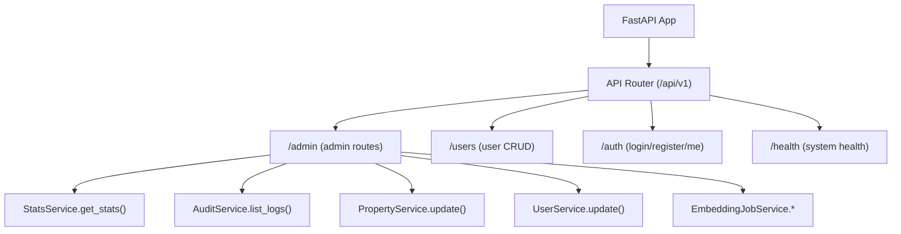
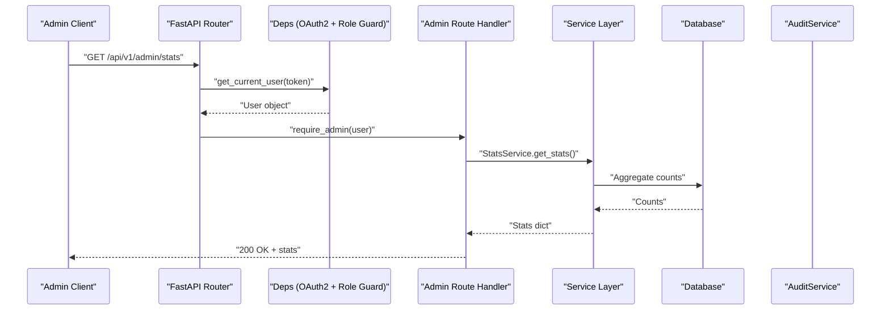
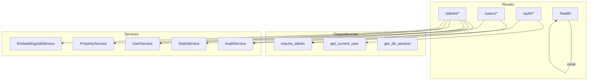

# Admin Management APIs

<cite>
**Referenced Files in This Document**
- [router.py](file://backend/app/api/v1/router.py)
- [admin.py](file://backend/app/api/v1/routes/admin.py)
- [users.py](file://backend/app/api/v1/routes/users.py)
- [auth.py](file://backend/app/api/v1/routes/auth.py)
- [health.py](file://backend/app/api/v1/routes/health.py)
- [deps.py](file://backend/app/api/deps.py)
- [user_service.py](file://backend/app/services/user_service.py)
- [stats_service.py](file://backend/app/services/stats_service.py)
- [audit_service.py](file://backend/app/services/audit_service.py)
- [property_service.py](file://backend/app/services/property_service.py)
- [user.py](file://backend/app/models/user.py)
- [audit_log.py](file://backend/app/models/audit_log.py)
- [property.py](file://backend/app/models/property.py)
- [user.py (schema)](file://backend/app/schemas/user.py)
- [auth.py (schema)](file://backend/app/schemas/auth.py)
</cite>

## Table of Contents
1. [Introduction](#introduction)
2. [Project Structure](#project-structure)
3. [Core Components](#core-components)
4. [Architecture Overview](#architecture-overview)
5. [Detailed Component Analysis](#detailed-component-analysis)
6. [Dependency Analysis](#dependency-analysis)
7. [Performance Considerations](#performance-considerations)
8. [Troubleshooting Guide](#troubleshooting-guide)
9. [Conclusion](#conclusion)
10. [Appendices](#appendices)

## Introduction
This document provides comprehensive API documentation for administrative endpoints, focusing on:
- User management operations including listing users and role assignment
- System monitoring via audit logs and statistics
- Property moderation capabilities and content status workflows
- Authentication requirements for admin access
- Audit trail queries and reporting
- Security considerations and system maintenance operations

The backend is built with FastAPI and uses SQLAlchemy async sessions, Pydantic schemas, and service-layer abstractions for data access and business logic.

## Project Structure
Administrative routes are mounted under the /api/v1/admin prefix. The router aggregates multiple route modules, including admin, users, auth, health, and others.

**Diagram sources**
- [router.py:1-23](file://backend/app/api/v1/router.py#L1-L23)
- [admin.py:16-132](file://backend/app/api/v1/routes/admin.py#L16-L132)
- [users.py:27-34](file://backend/app/api/v1/routes/users.py#L27-L34)
- [auth.py:37-94](file://backend/app/api/v1/routes/auth.py#L37-L94)
- [health.py:6-8](file://backend/app/api/v1/routes/health.py#L6-L8)

**Section sources**
- [router.py:1-23](file://backend/app/api/v1/router.py#L1-L23)

## Core Components
- Admin routes: Provide stats, audit logs, property moderation, user role updates, embedding job controls.
- User routes: Provide user listing and profile operations; some require admin role.
- Auth routes: Provide login, register, token refresh, and current user info.
- Health route: Simple liveness probe.
- Dependencies: OAuth2 bearer token parsing, DB session injection, role-based dependency guards.
- Services: Encapsulate database operations and cross-cutting concerns like auditing and statistics.
- Models and Schemas: Define entities, enums, and request/response contracts.

Key responsibilities:
- Authentication and authorization via dependencies
- Data access via services
- Auditing of sensitive actions
- Validation via Pydantic schemas

**Section sources**
- [admin.py:16-132](file://backend/app/api/v1/routes/admin.py#L16-L132)
- [users.py:27-34](file://backend/app/api/v1/routes/users.py#L27-L34)
- [auth.py:37-94](file://backend/app/api/v1/routes/auth.py#L37-L94)
- [health.py:6-8](file://backend/app/api/v1/routes/health.py#L6-L8)
- [deps.py:11-57](file://backend/app/api/deps.py#L11-L57)

## Architecture Overview
High-level flow for admin endpoints:
- Client sends HTTP requests with a Bearer token
- Dependency layer validates token and enforces admin role
- Route handlers call services to perform operations
- Services interact with models and persist changes
- Sensitive actions are recorded in audit logs

**Diagram sources**
- [router.py:14](file://backend/app/api/v1/router.py#L14)
- [admin.py:16-21](file://backend/app/api/v1/routes/admin.py#L16-L21)
- [deps.py:19-57](file://backend/app/api/deps.py#L19-L57)
- [stats_service.py:13-43](file://backend/app/services/stats_service.py#L13-L43)

## Detailed Component Analysis

### Authentication and Authorization
- Token issuance and refresh:
  - POST /api/v1/auth/login returns an access token
  - POST /api/v1/auth/refresh issues a new access token using a refresh token from Authorization header
  - GET /api/v1/auth/me returns current user details
- Admin requirement:
  - All admin endpoints depend on require_admin which checks UserRole.admin
  - Non-admin users receive 403 Forbidden

Security notes:
- Tokens are validated via OAuth2PasswordBearer
- Unauthorized or expired tokens return 401 with WWW-Authenticate header
- Refresh endpoint requires a valid Bearer token in Authorization header

**Section sources**
- [auth.py:37-94](file://backend/app/api/v1/routes/auth.py#L37-L94)
- [deps.py:11-57](file://backend/app/api/deps.py#L11-L57)
- [auth.py (schema):25-28](file://backend/app/schemas/auth.py#L25-L28)

### User Management Endpoints
- List users (admin only):
  - GET /api/v1/users
  - Query parameters: skip (default 0), limit (default 20, max 100)
  - Response: list of user objects
  - Note: No role filtering parameter is implemented in this endpoint
- Get user by ID (admin only):
  - GET /api/v1/users/{user_id}
- Update user (admin only):
  - PATCH /api/v1/users/{user_id}
  - Request body supports updating username, password_hash, phone, wechat_openid, email, role, status
- Delete user (admin only):
  - DELETE /api/v1/users/{user_id}

Role assignment:
- PATCH /api/v1/admin/users/{user_id}/role
  - Query parameter: new_role must be one of tenant, landlord, admin
  - Returns updated user object
  - Creates an audit log entry for user_role_change

User status management:
- Use PATCH /api/v1/users/{user_id} with status field set to active, disabled, or deleted

Examples of usage patterns:
- To list users: GET /api/v1/users?skip=0&limit=50
- To assign role: PATCH /api/v1/admin/users/{user_id}/role?new_role=landlord
- To disable a user: PATCH /api/v1/users/{user_id} with { "status": "disabled" }

**Section sources**
- [users.py:27-34](file://backend/app/api/v1/routes/users.py#L27-L34)
- [users.py:61-102](file://backend/app/api/v1/routes/users.py#L61-L102)
- [admin.py:83-109](file://backend/app/api/v1/routes/admin.py#L83-L109)
- [user_service.py:32-56](file://backend/app/services/user_service.py#L32-L56)
- [user.py (schema):21-28](file://backend/app/schemas/user.py#L21-L28)
- [user.py (model):18-42](file://backend/app/models/user.py#L18-L42)

### System Monitoring Endpoints
- Stats and analytics:
  - GET /api/v1/admin/stats
  - Returns total_users, total_properties, total_bookings, pending_bookings, properties_by_district
- Audit logs:
  - GET /api/v1/admin/logs
  - Query parameters: skip (default 0), limit (default 50, max 200), action (optional), user_id (optional)
  - Response: list of log entries with id, user_id, action, resource_type, resource_id, details, ip_address, created_at

Example audit trail queries:
- Filter by action: GET /api/v1/admin/logs?action=user_login
- Filter by user: GET /api/v1/admin/logs?user_id=123&limit=100

**Section sources**
- [admin.py:16-21](file://backend/app/api/v1/routes/admin.py#L16-L21)
- [admin.py:24-48](file://backend/app/api/v1/routes/admin.py#L24-L48)
- [stats_service.py:13-43](file://backend/app/services/stats_service.py#L13-L43)
- [audit_service.py:34-54](file://backend/app/services/audit_service.py#L34-L54)

### Property Moderation and Content Approval Workflows
- Moderate property status:
  - PATCH /api/v1/admin/properties/{property_id}/status?new_status={available|rented|maintenance|offline}
  - Validates status against allowed values
  - Updates property via PropertyService.update
  - Records audit log with action property_moderate and details {"new_status": ...}
- Status model:
  - PropertyStatus enum includes available, rented, maintenance, offline

Content approval workflow example:
- Set property to offline during review
- After approval, set to available
- Track all changes via audit logs

Bulk operations:
- Not implemented directly in admin routes
- Recommended approach: iterate over target IDs and call PATCH /api/v1/admin/properties/{property_id}/status per item
- Alternatively, implement a dedicated bulk endpoint if needed

**Section sources**
- [admin.py:51-80](file://backend/app/api/v1/routes/admin.py#L51-L80)
- [property_service.py:197-214](file://backend/app/services/property_service.py#L197-L214)
- [property.py:31-35](file://backend/app/models/property.py#L31-L35)

### Embedding Job Controls (System Maintenance)
- Get embedding stats:
  - GET /api/v1/admin/embeddings/stats
- Trigger reindex:
  - POST /api/v1/admin/embeddings/reindex?property_id={optional}
  - Dispatches background tasks to generate embeddings
  - Logs action embedding_reindex with optional property_id

Use cases:
- Monitor embedding job progress and completion
- Rebuild vector indexes after data migrations or corrections

**Section sources**
- [admin.py:112-132](file://backend/app/api/v1/routes/admin.py#L112-L132)

### System Health Check
- GET /api/v1/health
- Returns {"status": "ok"} for liveness probes

**Section sources**
- [health.py:6-8](file://backend/app/api/v1/routes/health.py#L6-L8)

## Dependency Analysis
Component relationships and coupling:
- Admin routes depend on:
  - require_admin for authorization
  - StatsService, AuditService, PropertyService, UserService, EmbeddingJobService
- Users routes depend on:
  - require_admin for protected endpoints
  - UserService for CRUD operations
- Auth routes depend on:
  - AuthService for authentication and token handling
  - AuditService for logging login/register events
- Health route is independent

Potential circular dependencies:
- None detected at route level; imports are localized within handlers where necessary

External integration points:
- Database via SQLAlchemy async sessions
- Optional Redis for search result caching (used by PropertyService.search)
- Background task queue for embeddings (Celery)

**Diagram sources**
- [admin.py:16-132](file://backend/app/api/v1/routes/admin.py#L16-L132)
- [users.py:27-34](file://backend/app/api/v1/routes/users.py#L27-L34)
- [auth.py:37-94](file://backend/app/api/v1/routes/auth.py#L37-L94)
- [deps.py:19-57](file://backend/app/api/deps.py#L19-L57)

**Section sources**
- [admin.py:16-132](file://backend/app/api/v1/routes/admin.py#L16-L132)
- [users.py:27-34](file://backend/app/api/v1/routes/users.py#L27-L34)
- [auth.py:37-94](file://backend/app/api/v1/routes/auth.py#L37-L94)
- [deps.py:19-57](file://backend/app/api/deps.py#L19-L57)

## Performance Considerations
- Pagination:
  - Admin logs support skip/limit to avoid large payloads
  - Users list supports skip/limit
- Indexing:
  - AuditLog has indexes on action, resource_type, user_id, created_at
  - Property has index on district and status
- Caching:
  - PropertyService.search caches non-vector results in Redis when available
- Background jobs:
  - Embedding generation is dispatched asynchronously to avoid blocking requests

Recommendations:
- Keep limit values reasonable for admin logs and lists
- Use targeted filters (action, user_id) for audit queries
- Ensure Redis availability for improved search performance

[No sources needed since this section provides general guidance]

## Troubleshooting Guide
Common errors and resolutions:
- 401 Unauthorized:
  - Missing or invalid Bearer token
  - Expired token; use refresh endpoint to obtain a new access token
- 403 Forbidden:
  - User lacks admin role; ensure current_user.role == admin
- 404 Not Found:
  - User or property not found during update/moderation
- 400 Bad Request:
  - Invalid role or property status provided
- 409 Conflict:
  - Unique constraint violations (username, email, phone, wechat_openid)

Debugging tips:
- Inspect audit logs to trace admin actions and identify who changed what
- Verify token presence and format in Authorization header
- Validate query parameters and request bodies against schema constraints

**Section sources**
- [deps.py:19-57](file://backend/app/api/deps.py#L19-L57)
- [admin.py:58-63](file://backend/app/api/v1/routes/admin.py#L58-L63)
- [admin.py:90-94](file://backend/app/api/v1/routes/admin.py#L90-L94)
- [users.py:20-24](file://backend/app/api/v1/routes/users.py#L20-L24)

## Conclusion
The admin management APIs provide robust capabilities for user lifecycle management, system monitoring, property moderation, and maintenance operations. Security is enforced through bearer token validation and role-based access control. Audit trails capture critical administrative actions, enabling accountability and troubleshooting. For bulk operations, iterate over individual endpoints or consider implementing dedicated batch endpoints as needs evolve.

[No sources needed since this section summarizes without analyzing specific files]

## Appendices

### API Reference Summary

- Authentication
  - POST /api/v1/auth/login
  - POST /api/v1/auth/refresh
  - GET /api/v1/auth/me

- Admin
  - GET /api/v1/admin/stats
  - GET /api/v1/admin/logs?skip=&limit=&action=&user_id=
  - PATCH /api/v1/admin/properties/{property_id}/status?new_status=
  - PATCH /api/v1/admin/users/{user_id}/role?new_role=
  - GET /api/v1/admin/embeddings/stats
  - POST /api/v1/admin/embeddings/reindex?property_id=

- Users (Admin-only endpoints)
  - GET /api/v1/users?skip=&limit=
  - GET /api/v1/users/{user_id}
  - PATCH /api/v1/users/{user_id}
  - DELETE /api/v1/users/{user_id}

- Health
  - GET /api/v1/health

**Section sources**
- [auth.py:37-94](file://backend/app/api/v1/routes/auth.py#L37-L94)
- [admin.py:16-132](file://backend/app/api/v1/routes/admin.py#L16-L132)
- [users.py:27-102](file://backend/app/api/v1/routes/users.py#L27-L102)
- [health.py:6-8](file://backend/app/api/v1/routes/health.py#L6-L8)