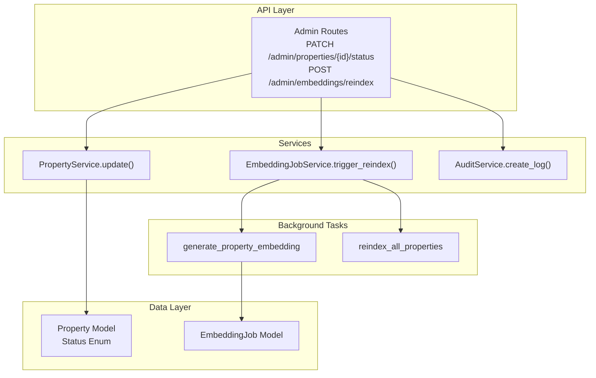
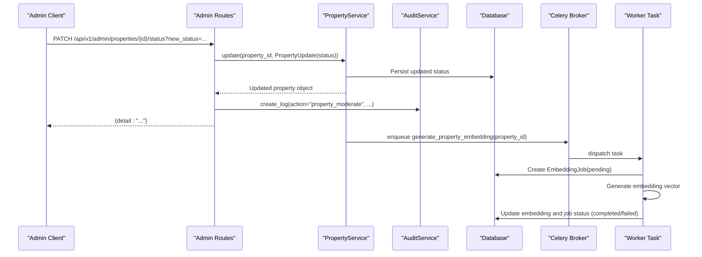
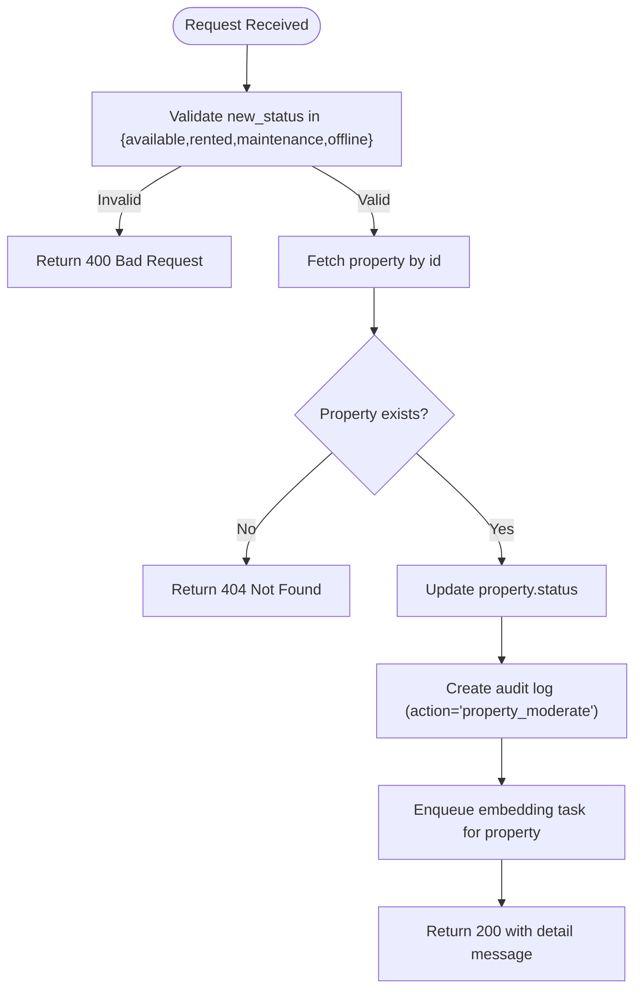
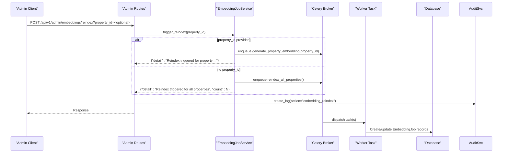
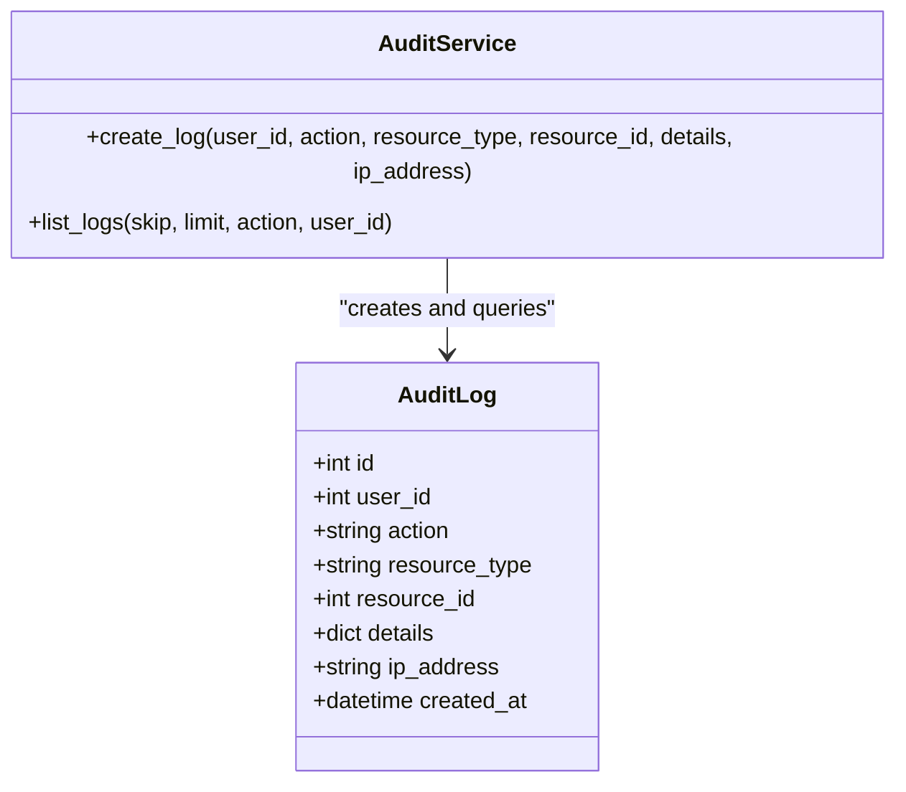
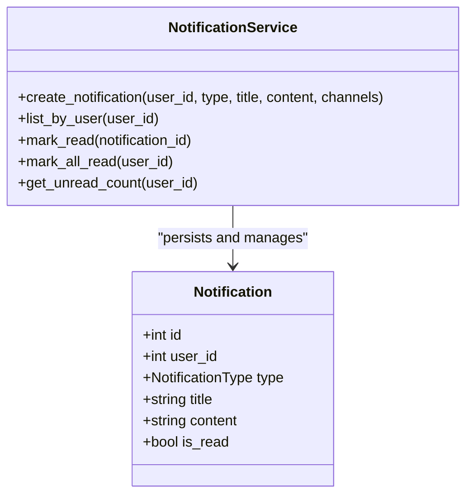
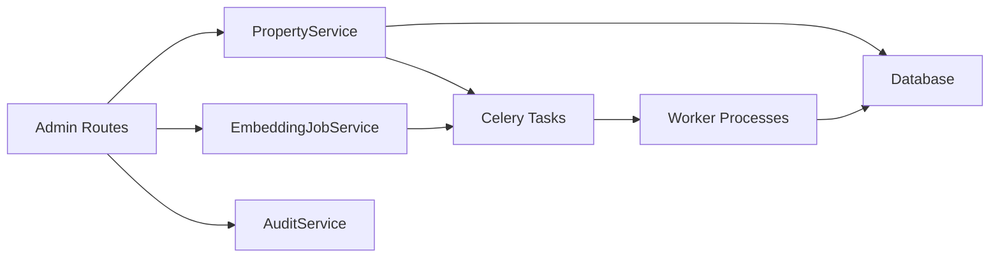

# Content Moderation

<cite>
**Referenced Files in This Document**
- [admin.py](file://backend/app/api/v1/routes/admin.py)
- [property_service.py](file://backend/app/services/property_service.py)
- [embedding_job_service.py](file://backend/app/services/embedding_job_service.py)
- [audit_service.py](file://backend/app/services/audit_service.py)
- [property.py](file://backend/app/models/property.py)
- [property_schema.py](file://backend/app/schemas/property.py)
- [embedding_tasks.py](file://backend/app/tasks/embedding_tasks.py)
- [notification_service.py](file://backend/app/services/notification_service.py)
- [notification_model.py](file://backend/app/models/notification.py)
- [test_admin.py](file://backend/tests/test_admin.py)
</cite>

## Table of Contents
1. [Introduction](#introduction)
2. [Project Structure](#project-structure)
3. [Core Components](#core-components)
4. [Architecture Overview](#architecture-overview)
5. [Detailed Component Analysis](#detailed-component-analysis)
6. [Dependency Analysis](#dependency-analysis)
7. [Performance Considerations](#performance-considerations)
8. [Troubleshooting Guide](#troubleshooting-guide)
9. [Conclusion](#conclusion)

## Introduction
This document provides detailed API documentation for content moderation endpoints focused on property status management and embedding reindexing. It covers:
- PATCH /api/v1/admin/properties/{property_id}/status for changing a property’s moderation status
- POST /api/v1/admin/embeddings/reindex for maintaining search index consistency
- Audit trail recording for moderation actions
- Notification system integration points
- Bulk moderation capabilities (where available)

The goal is to help administrators and integrators understand request/response formats, validation rules, workflows, and operational considerations.

## Project Structure
The moderation features are implemented under the admin API routes and supported by services, models, and background tasks:
- Admin routes define endpoints and orchestrate service calls
- Services encapsulate business logic and persistence interactions
- Models define data structures and constraints
- Tasks handle asynchronous work such as embedding generation and reindexing
- Tests validate behavior and error handling

**Diagram sources**
- [admin.py:51-80](file://backend/app/api/v1/routes/admin.py#L51-L80)
- [property_service.py:197-214](file://backend/app/services/property_service.py#L197-L214)
- [embedding_job_service.py:45-53](file://backend/app/services/embedding_job_service.py#L45-L53)
- [audit_service.py:11-32](file://backend/app/services/audit_service.py#L11-L32)
- [property.py:31-36](file://backend/app/models/property.py#L31-L36)
- [embedding_tasks.py:16-80](file://backend/app/tasks/embedding_tasks.py#L16-L80)

**Section sources**
- [admin.py:1-133](file://backend/app/api/v1/routes/admin.py#L1-L133)
- [property_service.py:1-239](file://backend/app/services/property_service.py#L1-L239)
- [embedding_job_service.py:1-54](file://backend/app/services/embedding_job_service.py#L1-L54)
- [audit_service.py:1-55](file://backend/app/services/audit_service.py#L1-L55)
- [property.py:1-86](file://backend/app/models/property.py#L1-L86)
- [property_schema.py:1-79](file://backend/app/schemas/property.py#L1-L79)
- [embedding_tasks.py:1-112](file://backend/app/tasks/embedding_tasks.py#L1-L112)

## Core Components
- Property Status Management
  - Endpoint: PATCH /api/v1/admin/properties/{property_id}/status
  - Purpose: Update a property’s moderation status to one of the allowed values
  - Valid statuses: available, rented, maintenance, offline
  - Authentication: Requires an authenticated admin user
  - Request parameters:
    - path: property_id (integer)
    - query: new_status (string; must be one of the valid statuses)
  - Response: JSON with a detail message indicating success
  - Side effects:
    - Updates the property record via PropertyService.update()
    - Creates an audit log entry with action "property_moderate"
    - Triggers an asynchronous embedding task for the property (via PropertyService._dispatch_embedding_task)
  - Error responses:
    - 400 Bad Request if new_status is invalid
    - 404 Not Found if the property does not exist
    - 401 Unauthorized or 403 Forbidden if not authenticated or not an admin

- Embedding Reindexing
  - Endpoint: POST /api/v1/admin/embeddings/reindex
  - Purpose: Trigger reindexing of embeddings for search consistency
  - Authentication: Requires an authenticated admin user
  - Request parameters:
    - query: property_id (optional integer)
      - If provided: reindex only that property
      - If omitted: reindex all properties missing embeddings
  - Response: JSON with a detail message; when reindexing all, includes a count of queued jobs
  - Side effects:
    - Schedules background tasks via Celery:
      - generate_property_embedding(property_id) for single property
      - reindex_all_properties() for all properties
    - Creates an audit log entry with action "embedding_reindex"

- Audit Trail
  - Endpoints:
    - GET /api/v1/admin/logs (for reviewing moderation and other admin actions)
  - Fields recorded include user_id, action, resource_type, resource_id, details, ip_address, created_at
  - Filtering supports skip, limit, action, and user_id

- Notifications
  - The notification subsystem exists and can be integrated into moderation flows
  - Currently, moderation endpoints do not automatically create notifications; they can be extended to do so using NotificationService

- Bulk Moderation
  - No dedicated bulk status update endpoint is present
  - Administrators can iterate over properties and call the single-property endpoint per item
  - For embedding reindexing, bulk operation is supported via POST /api/v1/admin/embeddings/reindex without property_id

**Section sources**
- [admin.py:51-80](file://backend/app/api/v1/routes/admin.py#L51-L80)
- [admin.py:120-132](file://backend/app/api/v1/routes/admin.py#L120-L132)
- [admin.py:24-48](file://backend/app/api/v1/routes/admin.py#L24-L48)
- [property_service.py:197-214](file://backend/app/services/property_service.py#L197-L214)
- [property_service.py:225-239](file://backend/app/services/property_service.py#L225-L239)
- [embedding_job_service.py:45-53](file://backend/app/services/embedding_job_service.py#L45-L53)
- [audit_service.py:11-32](file://backend/app/services/audit_service.py#L11-L32)
- [notification_service.py:43-69](file://backend/app/services/notification_service.py#L43-L69)
- [test_admin.py:97-109](file://backend/tests/test_admin.py#L97-L109)

## Architecture Overview
The moderation workflow integrates API routing, service layer operations, database updates, audit logging, and background tasks.

**Diagram sources**
- [admin.py:51-80](file://backend/app/api/v1/routes/admin.py#L51-L80)
- [property_service.py:197-214](file://backend/app/services/property_service.py#L197-L214)
- [property_service.py:225-239](file://backend/app/services/property_service.py#L225-L239)
- [embedding_tasks.py:16-80](file://backend/app/tasks/embedding_tasks.py#L16-L80)
- [audit_service.py:11-32](file://backend/app/services/audit_service.py#L11-L32)

## Detailed Component Analysis

### Property Status Management Endpoint
- Method and Path: PATCH /api/v1/admin/properties/{property_id}/status
- Authentication and Authorization:
  - Requires authentication
  - Requires admin role (enforced by dependency)
- Request Parameters:
  - path: property_id (integer)
  - query: new_status (string; must be one of: available, rented, maintenance, offline)
- Validation Rules:
  - new_status must be one of the allowed values; otherwise returns 400
  - property_id must correspond to an existing property; otherwise returns 404
- Success Response:
  - JSON body containing a detail message confirming the status change
- Side Effects:
  - Database update of property.status
  - Audit log creation with action "property_moderate"
  - Asynchronous embedding task enqueued for the property

**Diagram sources**
- [admin.py:51-80](file://backend/app/api/v1/routes/admin.py#L51-L80)
- [property_service.py:197-214](file://backend/app/services/property_service.py#L197-L214)
- [property_service.py:225-239](file://backend/app/services/property_service.py#L225-L239)

**Section sources**
- [admin.py:51-80](file://backend/app/api/v1/routes/admin.py#L51-L80)
- [property_service.py:197-214](file://backend/app/services/property_service.py#L197-L214)
- [property.py:31-36](file://backend/app/models/property.py#L31-L36)
- [property_schema.py:31-44](file://backend/app/schemas/property.py#L31-L44)
- [test_admin.py:97-109](file://backend/tests/test_admin.py#L97-L109)

### Embedding Reindexing Endpoint
- Method and Path: POST /api/v1/admin/embeddings/reindex
- Authentication and Authorization:
  - Requires authentication
  - Requires admin role (enforced by dependency)
- Request Parameters:
  - query: property_id (optional integer)
    - If provided: triggers reindex for a single property
    - If omitted: triggers reindex for all properties missing embeddings
- Success Response:
  - JSON body with a detail message
  - When reindexing all, includes a count of queued jobs
- Side Effects:
  - Background task scheduling:
    - Single property: generate_property_embedding.delay(property_id)
    - All properties: reindex_all_properties.delay()
  - Audit log creation with action "embedding_reindex"

**Diagram sources**
- [admin.py:120-132](file://backend/app/api/v1/routes/admin.py#L120-L132)
- [embedding_job_service.py:45-53](file://backend/app/services/embedding_job_service.py#L45-L53)
- [embedding_tasks.py:83-111](file://backend/app/tasks/embedding_tasks.py#L83-L111)
- [audit_service.py:11-32](file://backend/app/services/audit_service.py#L11-L32)

**Section sources**
- [admin.py:120-132](file://backend/app/api/v1/routes/admin.py#L120-L132)
- [embedding_job_service.py:45-53](file://backend/app/services/embedding_job_service.py#L45-L53)
- [embedding_tasks.py:16-80](file://backend/app/tasks/embedding_tasks.py#L16-L80)
- [embedding_tasks.py:83-111](file://backend/app/tasks/embedding_tasks.py#L83-L111)

### Audit Trail Integration
- Recording:
  - property_moderate: Created when a property status is changed
  - embedding_reindex: Created when reindex is triggered
- Querying:
  - GET /api/v1/admin/logs supports pagination and filtering by action and user_id
- Data fields:
  - id, user_id, action, resource_type, resource_id, details, ip_address, created_at

**Diagram sources**
- [audit_service.py:11-32](file://backend/app/services/audit_service.py#L11-L32)
- [audit_service.py:34-54](file://backend/app/services/audit_service.py#L34-L54)
- [audit_log_model.py:10-24](file://backend/app/models/audit_log.py#L10-L24)

**Section sources**
- [admin.py:24-48](file://backend/app/api/v1/routes/admin.py#L24-L48)
- [audit_service.py:11-54](file://backend/app/services/audit_service.py#L11-L54)

### Notification System Integration Points
- NotificationService supports creating notifications and dispatching them via channels (WeChat, SMS, Email)
- Current moderation endpoints do not automatically create notifications; this can be extended by calling NotificationService.create_notification() after successful moderation actions

**Diagram sources**
- [notification_service.py:43-69](file://backend/app/services/notification_service.py#L43-L69)
- [notification_model.py:20-35](file://backend/app/models/notification.py#L20-L35)

**Section sources**
- [notification_service.py:1-164](file://backend/app/services/notification_service.py#L1-L164)
- [notification_model.py:1-36](file://backend/app/models/notification.py#L1-L36)

## Dependency Analysis
- Admin routes depend on:
  - PropertyService for updating property status
  - EmbeddingJobService for triggering reindex
  - AuditService for logging actions
- PropertyService depends on:
  - SQLAlchemy session for persistence
  - POIService for generating/refreshing POI data
  - Celery task dispatcher for embedding generation
- EmbeddingJobService depends on:
  - Celery tasks for single and bulk reindex
- Background tasks depend on:
  - Async database engine/session for independent execution
  - EmbeddingService for vector generation

**Diagram sources**
- [admin.py:51-80](file://backend/app/api/v1/routes/admin.py#L51-L80)
- [property_service.py:197-214](file://backend/app/services/property_service.py#L197-L214)
- [embedding_job_service.py:45-53](file://backend/app/services/embedding_job_service.py#L45-L53)
- [embedding_tasks.py:16-80](file://backend/app/tasks/embedding_tasks.py#L16-L80)

**Section sources**
- [admin.py:1-133](file://backend/app/api/v1/routes/admin.py#L1-L133)
- [property_service.py:1-239](file://backend/app/services/property_service.py#L1-L239)
- [embedding_job_service.py:1-54](file://backend/app/services/embedding_job_service.py#L1-L54)
- [embedding_tasks.py:1-112](file://backend/app/tasks/embedding_tasks.py#L1-L112)

## Performance Considerations
- Property status updates are synchronous and lightweight; however, they trigger asynchronous embedding tasks which may add load to workers
- Embedding generation involves external model inference and should be rate-limited and monitored
- Reindexing all properties can enqueue many tasks; consider staggering or batching strategies if needed
- Audit logs are appended per action; ensure indexing and pagination are tuned for high-volume environments
- Optional Redis caching for search results improves performance but is not directly tied to moderation endpoints

[No sources needed since this section provides general guidance]

## Troubleshooting Guide
- Invalid status value
  - Symptom: 400 Bad Request when setting property status
  - Cause: new_status not in {available, rented, maintenance, offline}
  - Resolution: Use one of the allowed values
- Property not found
  - Symptom: 404 Not Found when updating status
  - Cause: property_id does not exist
  - Resolution: Verify property_id and access permissions
- Authentication/Authorization failures
  - Symptom: 401 Unauthorized or 403 Forbidden
  - Cause: Missing token or insufficient privileges (not admin)
  - Resolution: Ensure admin credentials and correct headers
- Embedding reindex not reflected immediately
  - Symptom: Search results unchanged right after reindex
  - Cause: Background processing delay
  - Resolution: Check embedding job stats and worker logs; wait for completion
- Audit logs missing
  - Symptom: No entries for moderation actions
  - Cause: Service errors or transaction issues
  - Resolution: Inspect server logs and database state

**Section sources**
- [admin.py:51-80](file://backend/app/api/v1/routes/admin.py#L51-L80)
- [admin.py:120-132](file://backend/app/api/v1/routes/admin.py#L120-L132)
- [test_admin.py:97-109](file://backend/tests/test_admin.py#L97-L109)

## Conclusion
The content moderation APIs provide robust controls for property status management and embedding reindexing, with comprehensive audit trails and extensibility for notifications. Administrators can reliably moderate individual properties and maintain search index consistency through targeted or bulk reindex operations. Integrators should account for asynchronous processing and monitor job queues for optimal reliability.