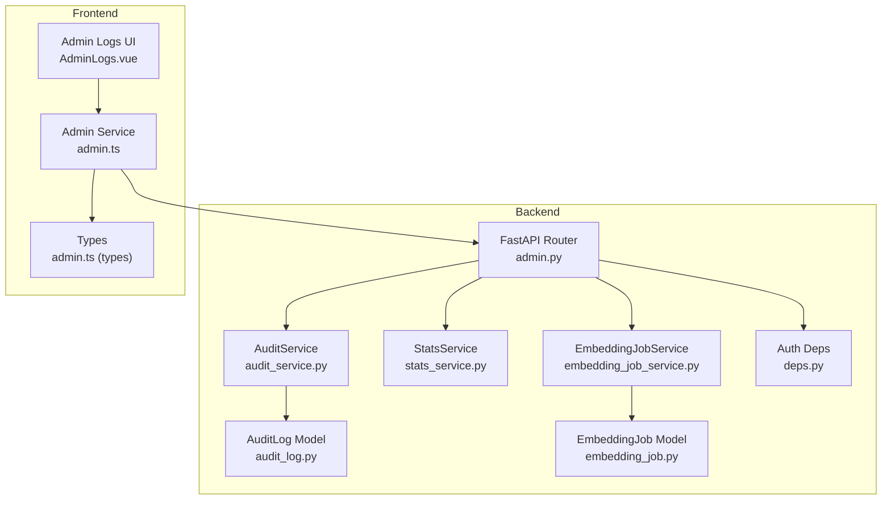
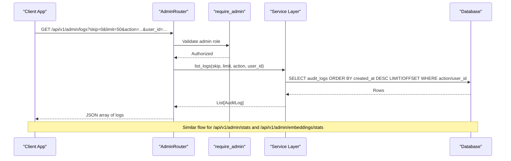
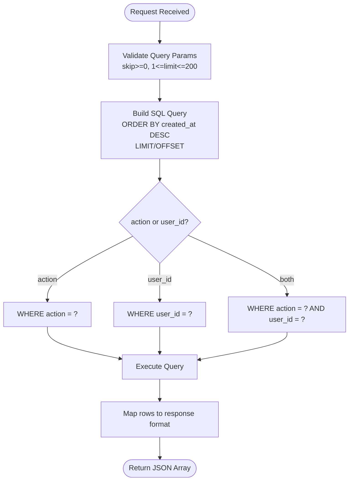
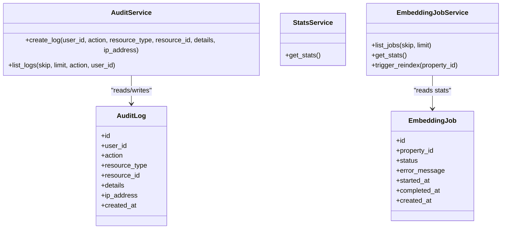
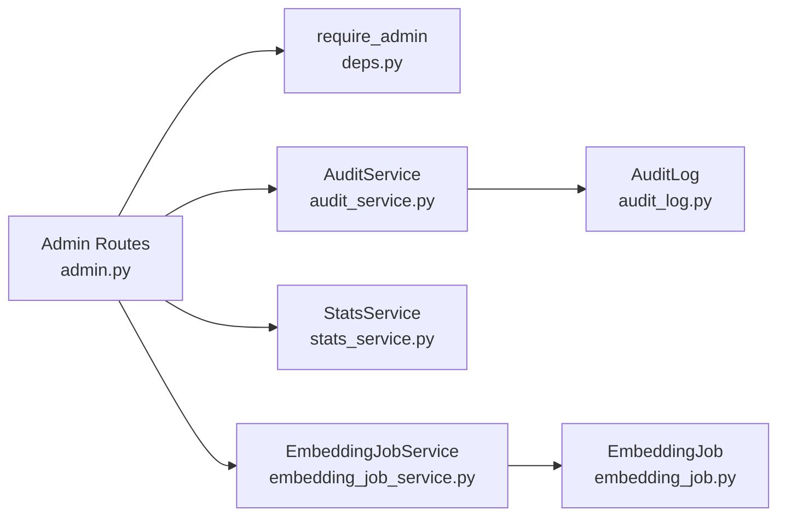

# System Monitoring & Logs

<cite>
**Referenced Files in This Document**
- [admin.py](file://backend/app/api/v1/routes/admin.py)
- [audit_service.py](file://backend/app/services/audit_service.py)
- [stats_service.py](file://backend/app/services/stats_service.py)
- [embedding_job_service.py](file://backend/app/services/embedding_job_service.py)
- [audit_log.py](file://backend/app/models/audit_log.py)
- [embedding_job.py](file://backend/app/models/embedding_job.py)
- [deps.py](file://backend/app/api/deps.py)
- [AdminLogs.vue](file://frontend/src/views/admin/AdminLogs.vue)
- [admin.ts](file://frontend/src/services/admin.ts)
- [admin.ts (types)](file://frontend/src/types/admin.ts)
</cite>

## Table of Contents
1. [Introduction](#introduction)
2. [Project Structure](#project-structure)
3. [Core Components](#core-components)
4. [Architecture Overview](#architecture-overview)
5. [Detailed Component Analysis](#detailed-component-analysis)
6. [Dependency Analysis](#dependency-analysis)
7. [Performance Considerations](#performance-considerations)
8. [Troubleshooting Guide](#troubleshooting-guide)
9. [Conclusion](#conclusion)
10. [Appendices](#appendices)

## Introduction
This document provides comprehensive API documentation for system monitoring and audit log endpoints exposed under the admin namespace. It covers:
- GET /api/v1/admin/logs: Retrieve audit logs with filtering by action and user_id, plus pagination via skip and limit.
- GET /api/v1/admin/stats: System statistics and analytics including counts and district distribution.
- GET /api/v1/admin/embeddings/stats: Embedding job monitoring metrics.

It also includes examples of querying logs, interpreting statistical data, performance considerations, search patterns, and reporting capabilities.

## Project Structure
The monitoring and logging features are implemented as FastAPI routes backed by SQLAlchemy services and models. The frontend consumes these APIs through a dedicated admin service and displays them in an admin UI.

**Diagram sources**
- [admin.py:16-48](file://backend/app/api/v1/routes/admin.py#L16-L48)
- [audit_service.py:7-54](file://backend/app/services/audit_service.py#L7-L54)
- [stats_service.py:9-43](file://backend/app/services/stats_service.py#L9-L43)
- [embedding_job_service.py:7-43](file://backend/app/services/embedding_job_service.py#L7-L43)
- [audit_log.py:10-24](file://backend/app/models/audit_log.py#L10-L24)
- [embedding_job.py:17-34](file://backend/app/models/embedding_job.py#L17-L34)
- [deps.py:51-57](file://backend/app/api/deps.py#L51-L57)
- [AdminLogs.vue:68-86](file://frontend/src/views/admin/AdminLogs.vue#L68-L86)
- [admin.ts:5-17](file://frontend/src/services/admin.ts#L5-L17)
- [admin.ts (types):16-25](file://frontend/src/types/admin.ts#L16-L25)

**Section sources**
- [admin.py:16-48](file://backend/app/api/v1/routes/admin.py#L16-L48)
- [audit_service.py:7-54](file://backend/app/services/audit_service.py#L7-L54)
- [stats_service.py:9-43](file://backend/app/services/stats_service.py#L9-L43)
- [embedding_job_service.py:7-43](file://backend/app/services/embedding_job_service.py#L7-L43)
- [audit_log.py:10-24](file://backend/app/models/audit_log.py#L10-L24)
- [embedding_job.py:17-34](file://backend/app/models/embedding_job.py#L17-L34)
- [deps.py:51-57](file://backend/app/api/deps.py#L51-L57)
- [AdminLogs.vue:68-86](file://frontend/src/views/admin/AdminLogs.vue#L68-L86)
- [admin.ts:5-17](file://frontend/src/services/admin.ts#L5-L17)
- [admin.ts (types):16-25](file://frontend/src/types/admin.ts#L16-L25)

## Core Components
- Admin Routes: Provide endpoints for stats, logs, and embedding stats. All endpoints require admin authentication.
- Audit Service: Creates and lists audit logs with optional filters and pagination.
- Stats Service: Aggregates key system metrics such as total users, properties, bookings, pending bookings, and top districts.
- Embedding Job Service: Provides embedding job statistics and reindex triggers.
- Models: Define database schema for audit logs and embedding jobs.
- Frontend Integration: Admin UI and service layer consume these endpoints to display logs and stats.

**Section sources**
- [admin.py:16-48](file://backend/app/api/v1/routes/admin.py#L16-L48)
- [audit_service.py:7-54](file://backend/app/services/audit_service.py#L7-L54)
- [stats_service.py:9-43](file://backend/app/services/stats_service.py#L9-L43)
- [embedding_job_service.py:7-43](file://backend/app/services/embedding_job_service.py#L7-L43)
- [audit_log.py:10-24](file://backend/app/models/audit_log.py#L10-L24)
- [embedding_job.py:17-34](file://backend/app/models/embedding_job.py#L17-L34)
- [AdminLogs.vue:68-86](file://frontend/src/views/admin/AdminLogs.vue#L68-L86)
- [admin.ts:5-17](file://frontend/src/services/admin.ts#L5-L17)

## Architecture Overview
The admin endpoints follow a layered architecture:
- HTTP Layer: FastAPI router defines endpoints and query parameters.
- Service Layer: Business logic encapsulated in services performs DB queries and aggregates results.
- Data Layer: SQLAlchemy models represent tables; indexes optimize common queries.
- Security: Admin-only access enforced via dependency injection.

**Diagram sources**
- [admin.py:24-48](file://backend/app/api/v1/routes/admin.py#L24-L48)
- [audit_service.py:34-54](file://backend/app/services/audit_service.py#L34-L54)
- [stats_service.py:13-43](file://backend/app/services/stats_service.py#L13-L43)
- [embedding_job_service.py:21-43](file://backend/app/services/embedding_job_service.py#L21-L43)
- [deps.py:51-57](file://backend/app/api/deps.py#L51-L57)

## Detailed Component Analysis

### Endpoint: GET /api/v1/admin/logs
Retrieves audit logs with optional filtering and pagination. Requires admin authentication.

- Path: /api/v1/admin/logs
- Method: GET
- Authentication: Admin required (Bearer token)
- Query Parameters:
  - skip: integer, default 0, minimum 0
  - limit: integer, default 50, range 1..200
  - action: string, optional exact match filter
  - user_id: integer, optional exact match filter
- Response: Array of log objects with fields:
  - id: integer
  - user_id: integer or null
  - action: string
  - resource_type: string or null
  - resource_id: integer or null
  - details: object or null
  - ip_address: string or null
  - created_at: ISO 8601 timestamp (UTC)

Example requests:
- Get latest 50 logs: GET /api/v1/admin/logs
- Filter by action: GET /api/v1/admin/logs?action=user_role_change
- Filter by user: GET /api/v1/admin/logs?user_id=123
- Paginate: GET /api/v1/admin/logs?skip=100&limit=25

Notes:
- Results are ordered by created_at descending.
- Filters are combined with AND semantics when both action and user_id are provided.

**Section sources**
- [admin.py:24-48](file://backend/app/api/v1/routes/admin.py#L24-L48)
- [audit_service.py:34-54](file://backend/app/services/audit_service.py#L34-L54)
- [audit_log.py:10-24](file://backend/app/models/audit_log.py#L10-L24)
- [admin.ts:10-17](file://frontend/src/services/admin.ts#L10-L17)
- [admin.ts (types):16-25](file://frontend/src/types/admin.ts#L16-L25)
- [AdminLogs.vue:68-86](file://frontend/src/views/admin/AdminLogs.vue#L68-L86)

#### Flowchart: Log Retrieval Logic

**Diagram sources**
- [audit_service.py:34-54](file://backend/app/services/audit_service.py#L34-L54)

### Endpoint: GET /api/v1/admin/stats
Returns aggregated system statistics.

- Path: /api/v1/admin/stats
- Method: GET
- Authentication: Admin required
- Response Fields:
  - total_users: integer
  - total_properties: integer
  - total_bookings: integer
  - pending_bookings: integer
  - properties_by_district: array of { district: string, count: number } (top 10 by count)

Interpretation:
- Use total_users and total_properties for platform scale.
- pending_bookings indicates operational workload.
- properties_by_district helps visualize geographic distribution.

Example request:
- GET /api/v1/admin/stats

**Section sources**
- [admin.py:16-22](file://backend/app/api/v1/routes/admin.py#L16-L22)
- [stats_service.py:13-43](file://backend/app/services/stats_service.py#L13-L43)
- [admin.ts:6-8](file://frontend/src/services/admin.ts#L6-L8)
- [admin.ts (types):1-7](file://frontend/src/types/admin.ts#L1-7)

### Endpoint: GET /api/v1/admin/embeddings/stats
Provides embedding job monitoring metrics.

- Path: /api/v1/admin/embeddings/stats
- Method: GET
- Authentication: Admin required
- Response Fields:
  - total: integer
  - completed: integer
  - failed: integer
  - pending: integer

Interpretation:
- Monitor pipeline health via completed vs failed counts.
- Use pending to gauge backlog.

Example request:
- GET /api/v1/admin/embeddings/stats

**Section sources**
- [admin.py:112-117](file://backend/app/api/v1/routes/admin.py#L112-L117)
- [embedding_job_service.py:21-43](file://backend/app/services/embedding_job_service.py#L21-L43)
- [admin.ts:31-33](file://frontend/src/services/admin.ts#L31-L33)
- [admin.ts (types):9-14](file://frontend/src/types/admin.ts#L9-L14)

### Data Models

#### AuditLog
- Table: audit_logs
- Columns:
  - id: primary key, indexed
  - user_id: nullable foreign key to users.id, indexed
  - action: string up to 100 chars, not null, indexed
  - resource_type: string up to 50 chars, nullable, indexed
  - resource_id: integer, nullable
  - details: JSON, nullable
  - ip_address: string up to 45 chars, nullable
  - created_at: UTC timestamp, not null

Indexes:
- id, user_id, action, resource_type are indexed to support efficient filtering and sorting.

**Section sources**
- [audit_log.py:10-24](file://backend/app/models/audit_log.py#L10-L24)

#### EmbeddingJob
- Table: embedding_jobs
- Columns:
  - id: primary key, indexed
  - property_id: foreign key to properties.id, cascading delete, indexed
  - status: enum {pending, processing, completed, failed}, not null
  - error_message: text, nullable
  - started_at: UTC timestamp, nullable
  - completed_at: UTC timestamp, nullable
  - created_at: UTC timestamp, not null

Statuses:
- pending: queued
- processing: currently running
- completed: finished successfully
- failed: finished with error

**Section sources**
- [embedding_job.py:17-34](file://backend/app/models/embedding_job.py#L17-L34)

### Class Diagram: Services and Models

**Diagram sources**
- [audit_service.py:7-54](file://backend/app/services/audit_service.py#L7-L54)
- [stats_service.py:9-43](file://backend/app/services/stats_service.py#L9-L43)
- [embedding_job_service.py:7-43](file://backend/app/services/embedding_job_service.py#L7-L43)
- [audit_log.py:10-24](file://backend/app/models/audit_log.py#L10-L24)
- [embedding_job.py:17-34](file://backend/app/models/embedding_job.py#L17-L34)

## Dependency Analysis
Authentication and authorization are enforced at the route level using dependency injection.

**Diagram sources**
- [admin.py:16-48](file://backend/app/api/v1/routes/admin.py#L16-L48)
- [deps.py:51-57](file://backend/app/api/deps.py#L51-L57)
- [audit_service.py:7-54](file://backend/app/services/audit_service.py#L7-L54)
- [stats_service.py:9-43](file://backend/app/services/stats_service.py#L9-L43)
- [embedding_job_service.py:7-43](file://backend/app/services/embedding_job_service.py#L7-L43)
- [audit_log.py:10-24](file://backend/app/models/audit_log.py#L10-L24)
- [embedding_job.py:17-34](file://backend/app/models/embedding_job.py#L17-L34)

**Section sources**
- [deps.py:51-57](file://backend/app/api/deps.py#L51-L57)
- [admin.py:16-48](file://backend/app/api/v1/routes/admin.py#L16-L48)

## Performance Considerations
- Pagination: Use skip and limit to avoid large payloads. Default limit is 50; maximum allowed is 200.
- Indexing: AuditLog has indexes on action, user_id, and resource_type to speed up filtering. Sorting by created_at desc is optimized by table ordering.
- Query Complexity: Filtering by action and user_id uses simple equality checks; combining both adds an AND condition.
- Stats Queries: Aggregate counts use COUNT and GROUP BY; top 10 districts are limited to reduce overhead.
- Embedding Stats: Counts per status are computed with separate scalar queries; consider batching if needed.

Recommendations:
- Keep limit within recommended bounds to balance responsiveness and throughput.
- For heavy dashboards, cache stats responses briefly if acceptable staleness exists.
- Ensure database indexes remain healthy; monitor slow queries on audit_logs.

[No sources needed since this section provides general guidance]

## Troubleshooting Guide
Common issues and resolutions:
- 401 Unauthorized: Missing or invalid bearer token. Ensure client sends a valid JWT from login endpoint.
- 403 Forbidden: User lacks admin role. Verify current_user.role equals admin.
- Empty logs: No matching records for filters. Try removing filters or adjusting skip/limit.
- Large payloads: Exceeding limit causes validation errors. Reduce limit to <= 200.
- Slow responses: High skip values can degrade performance. Implement cursor-based pagination if needed.

Security notes:
- All endpoints require admin privileges.
- IP address is recorded in audit logs for traceability.

**Section sources**
- [deps.py:19-30](file://backend/app/api/deps.py#L19-L30)
- [deps.py:51-57](file://backend/app/api/deps.py#L51-L57)
- [admin.py:24-48](file://backend/app/api/v1/routes/admin.py#L24-L48)

## Conclusion
The admin monitoring endpoints provide essential observability into system activity and operational metrics. Audit logs support targeted filtering and pagination, while stats and embedding job endpoints offer quick insights into platform health. Proper indexing and pagination ensure scalability, and admin-only security protects sensitive data.

[No sources needed since this section summarizes without analyzing specific files]

## Appendices

### Example Usage Patterns
- Log querying:
  - Recent actions by a specific user: GET /api/v1/admin/logs?user_id=123&limit=25
  - Role change events: GET /api/v1/admin/logs?action=user_role_change
- Statistical interpretation:
  - Rising pending_bookings may indicate capacity constraints.
  - District distribution informs marketing and expansion strategies.
- Embedding metrics:
  - Increasing failed counts suggest downstream service issues; investigate error messages in embedding jobs.

### Search Patterns and Reporting
- Exact-match filters:
  - action: matches exact strings like "user_role_change", "property_moderate", "embedding_reindex".
  - user_id: numeric ID of the actor.
- Time-based analysis:
  - Sort order is newest first; clients can compute time windows by parsing created_at.
- Reporting:
  - Export logs periodically for compliance.
  - Aggregate stats daily for trend analysis.

### Log Retention Policies
- Current implementation does not include automatic retention or cleanup tasks for audit logs.
- Recommended practices:
  - Implement scheduled cleanup to archive or purge old logs based on retention policy.
  - Partition or archive by time ranges to maintain query performance.
  - Integrate with external storage for long-term retention.

[No sources needed since this section provides general guidance]