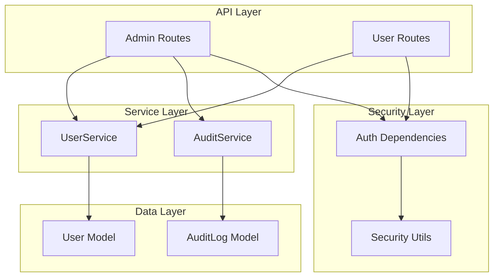
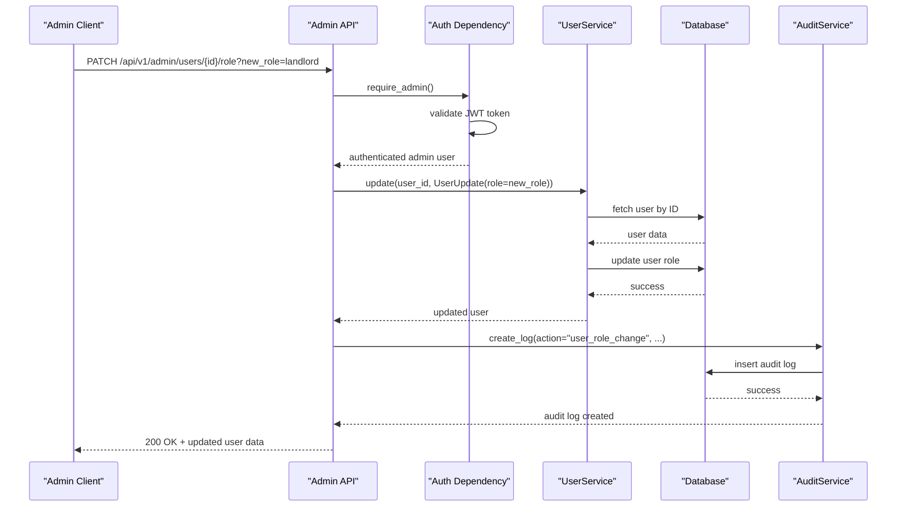
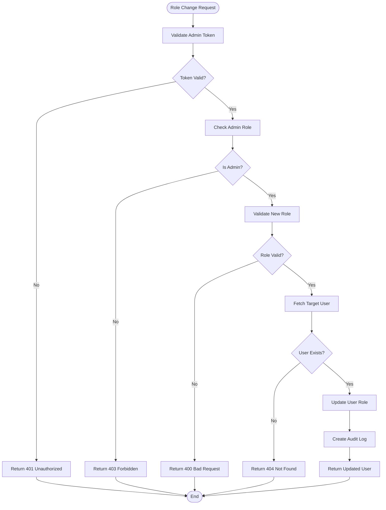
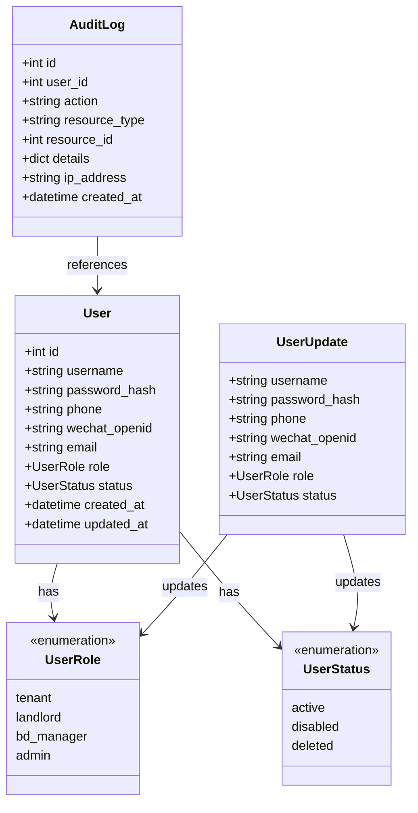
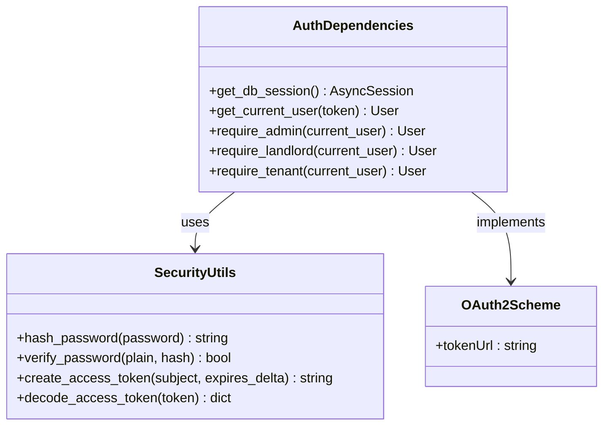
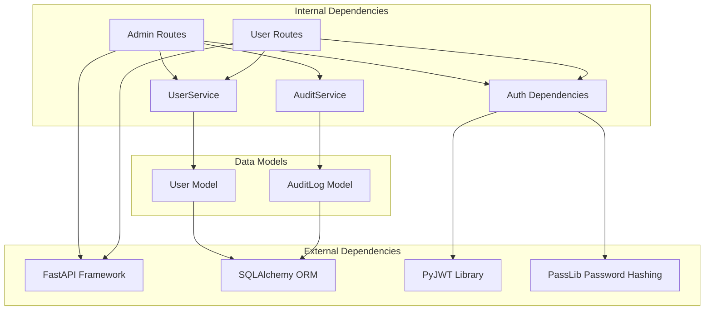
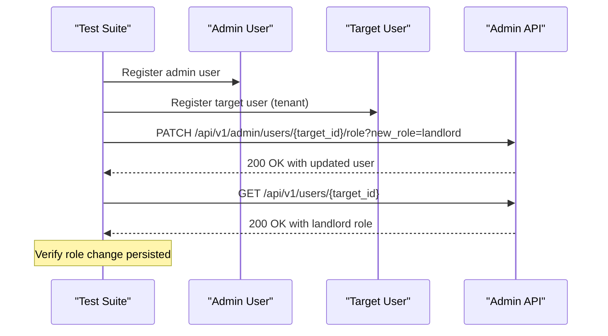

# User Administration

<cite>
**Referenced Files in This Document**
- [admin.py](file://backend/app/api/v1/routes/admin.py)
- [users.py](file://backend/app/api/v1/routes/users.py)
- [user_service.py](file://backend/app/services/user_service.py)
- [audit_service.py](file://backend/app/services/audit_service.py)
- [deps.py](file://backend/app/api/deps.py)
- [user.py](file://backend/app/models/user.py)
- [user_schema.py](file://backend/app/schemas/user.py)
- [audit_log.py](file://backend/app/models/audit_log.py)
- [security.py](file://backend/app/core/security.py)
- [test_admin.py](file://backend/tests/test_admin.py)
- [test_users.py](file://backend/tests/test_users.py)
</cite>

## Table of Contents
1. [Introduction](#introduction)
2. [Project Structure](#project-structure)
3. [Core Components](#core-components)
4. [Architecture Overview](#architecture-overview)
5. [Detailed Component Analysis](#detailed-component-analysis)
6. [Dependency Analysis](#dependency-analysis)
7. [Performance Considerations](#performance-considerations)
8. [Security Considerations](#security-considerations)
9. [Troubleshooting Guide](#troubleshooting-guide)
10. [Conclusion](#conclusion)

## Introduction

This document provides comprehensive API documentation for user administration endpoints, focusing on role assignment and user management capabilities. The system implements a robust user administration framework with role-based access control (RBAC), audit logging, and comprehensive security measures.

The primary focus is on the PATCH `/api/v1/admin/users/{user_id}/role` endpoint for role assignment, which supports three valid roles: tenant, landlord, and admin. The system also provides user status management capabilities through general user update endpoints.

## Project Structure

The user administration functionality is implemented across several key components:

**Diagram sources**
- [admin.py:1-133](file://backend/app/api/v1/routes/admin.py#L1-L133)
- [users.py:1-102](file://backend/app/api/v1/routes/users.py#L1-L102)
- [user_service.py:1-57](file://backend/app/services/user_service.py#L1-L57)
- [audit_service.py:1-55](file://backend/app/services/audit_service.py#L1-L55)

**Section sources**
- [admin.py:1-133](file://backend/app/api/v1/routes/admin.py#L1-L133)
- [users.py:1-102](file://backend/app/api/v1/routes/users.py#L1-L102)

## Core Components

### Role Assignment Endpoint

The core role assignment functionality is implemented in the admin routes with comprehensive validation and audit logging.

#### PATCH /api/v1/admin/users/{user_id}/role

This endpoint allows administrators to change a user's role within the system.

**Request Parameters:**
- `user_id` (path parameter): The ID of the user whose role needs to be updated
- `new_role` (query parameter): The new role to assign (tenant, landlord, or admin)

**Response Schema:**
Returns a `UserRead` object containing the updated user information including the new role.

**Valid Roles:**
- `tenant`: Regular user who rents properties
- `landlord`: Property owner who lists properties for rent
- `admin`: System administrator with full privileges

**Error Handling:**
- 400 Bad Request: Invalid role specified
- 401 Unauthorized: Missing or invalid authentication token
- 403 Forbidden: Current user is not an admin
- 404 Not Found: Target user does not exist

**Audit Logging:**
All role changes are automatically logged with details including the action type, target user ID, and new role value.

**Section sources**
- [admin.py:83-109](file://backend/app/api/v1/routes/admin.py#L83-L109)

### User Status Management

User status management is handled through the general user update endpoints, providing comprehensive user lifecycle management.

#### PATCH /api/v1/users/{user_id}

This endpoint allows administrators to update various user attributes including status.

**Request Schema:**
- `username`: Optional username update
- `email`: Optional email update  
- `phone`: Optional phone number update
- `role`: Optional role update (admin only)
- `status`: Optional status update (active, disabled, deleted)

**Valid Status Values:**
- `active`: Normal user account
- `disabled`: Account temporarily suspended
- `deleted`: Account marked for deletion

**Section sources**
- [users.py:73-90](file://backend/app/api/v1/routes/users.py#L73-L90)
- [user_schema.py:21-29](file://backend/app/schemas/user.py#L21-L29)

## Architecture Overview

The user administration system follows a layered architecture pattern with clear separation of concerns:

**Diagram sources**
- [admin.py:83-109](file://backend/app/api/v1/routes/admin.py#L83-L109)
- [user_service.py:37-47](file://backend/app/services/user_service.py#L37-L47)
- [audit_service.py:11-32](file://backend/app/services/audit_service.py#L11-L32)

## Detailed Component Analysis

### Role Assignment Flow

The role assignment process involves multiple validation steps and security checks:

**Diagram sources**
- [admin.py:83-109](file://backend/app/api/v1/routes/admin.py#L83-L109)

### Data Models and Schemas

The system uses well-defined data models and schemas to ensure data integrity:

**Diagram sources**
- [user.py:11-42](file://backend/app/models/user.py#L11-L42)
- [user_schema.py:21-45](file://backend/app/schemas/user.py#L21-L45)
- [audit_log.py:10-24](file://backend/app/models/audit_log.py#L10-L24)

### Security Implementation

The security layer implements comprehensive authentication and authorization:

**Diagram sources**
- [deps.py:14-57](file://backend/app/api/deps.py#L14-L57)
- [security.py:12-33](file://backend/app/core/security.py#L12-L33)

**Section sources**
- [user.py:11-42](file://backend/app/models/user.py#L11-L42)
- [user_schema.py:21-45](file://backend/app/schemas/user.py#L21-L45)
- [audit_log.py:10-24](file://backend/app/models/audit_log.py#L10-L24)
- [deps.py:14-57](file://backend/app/api/deps.py#L14-L57)
- [security.py:12-33](file://backend/app/core/security.py#L12-L33)

## Dependency Analysis

The user administration system has clear dependency relationships:

**Diagram sources**
- [admin.py:1-12](file://backend/app/api/v1/routes/admin.py#L1-L12)
- [users.py:1-8](file://backend/app/api/v1/routes/users.py#L1-L8)
- [user_service.py:1-5](file://backend/app/services/user_service.py#L1-L5)
- [audit_service.py:1-4](file://backend/app/services/audit_service.py#L1-L4)

**Section sources**
- [admin.py:1-12](file://backend/app/api/v1/routes/admin.py#L1-L12)
- [users.py:1-8](file://backend/app/api/v1/routes/users.py#L1-L8)

## Performance Considerations

The user administration endpoints are designed with performance in mind:

- **Database Queries**: Uses efficient single-row lookups for user operations
- **Connection Pooling**: Leverages async database sessions for concurrent request handling
- **Validation**: Performs input validation at the API layer to prevent unnecessary database operations
- **Audit Logging**: Asynchronous audit log creation minimizes response time impact
- **Pagination**: User listing endpoints support pagination for large datasets

## Security Considerations

### Authentication and Authorization

The system implements comprehensive security measures:

1. **JWT-based Authentication**: All administrative endpoints require valid JWT tokens
2. **Role-based Access Control**: Only users with admin role can perform administrative actions
3. **Input Validation**: Strict validation of role values and user data
4. **Audit Trail**: Complete logging of all administrative actions
5. **Password Security**: Secure password hashing using bcrypt

### Permission Requirements

- **Admin Role Required**: All user administration endpoints require admin privileges
- **Token Validation**: Every request must include a valid, non-expired JWT token
- **Resource Ownership**: Users cannot modify their own role/status through profile endpoints

### Audit Trail Generation

Every administrative action generates detailed audit logs including:
- Action type and timestamp
- Admin user ID performing the action
- Target user ID being modified
- Specific changes made (old vs new values)
- IP address of the requesting client

**Section sources**
- [deps.py:51-57](file://backend/app/api/deps.py#L51-L57)
- [audit_service.py:11-32](file://backend/app/services/audit_service.py#L11-L32)
- [security.py:12-33](file://backend/app/core/security.py#L12-L33)

## Troubleshooting Guide

### Common Error Scenarios

#### 401 Unauthorized Errors
- **Cause**: Missing or invalid JWT token
- **Solution**: Ensure proper authentication header with valid token
- **Debug**: Check token expiration and signature validity

#### 403 Forbidden Errors  
- **Cause**: Non-admin user attempting administrative actions
- **Solution**: Verify user has admin role assigned
- **Debug**: Check current user role in token payload

#### 400 Bad Request Errors
- **Cause**: Invalid role value (must be tenant, landlord, or admin)
- **Solution**: Use one of the three supported role values
- **Debug**: Validate role parameter against allowed values

#### 404 Not Found Errors
- **Cause**: Target user ID does not exist
- **Solution**: Verify user exists before attempting role change
- **Debug**: Check user existence via GET /api/v1/users/{user_id}

### Testing Role Changes

The test suite provides comprehensive examples of role change operations:

**Diagram sources**
- [test_admin.py:112-146](file://backend/tests/test_admin.py#L112-L146)

**Section sources**
- [test_admin.py:112-146](file://backend/tests/test_admin.py#L112-L146)
- [test_users.py:198-231](file://backend/tests/test_users.py#L198-L231)

## Conclusion

The user administration system provides a secure, auditable, and well-structured API for managing user roles and status. The PATCH `/api/v1/admin/users/{user_id}/role` endpoint offers comprehensive role assignment capabilities with robust validation, security controls, and complete audit logging.

Key features include:
- Three-tier role system (tenant, landlord, admin)
- Comprehensive error handling and validation
- Complete audit trail for all administrative actions
- Strong authentication and authorization controls
- Extensible architecture supporting future enhancements

The system is production-ready with comprehensive test coverage and follows best practices for API design, security, and maintainability.