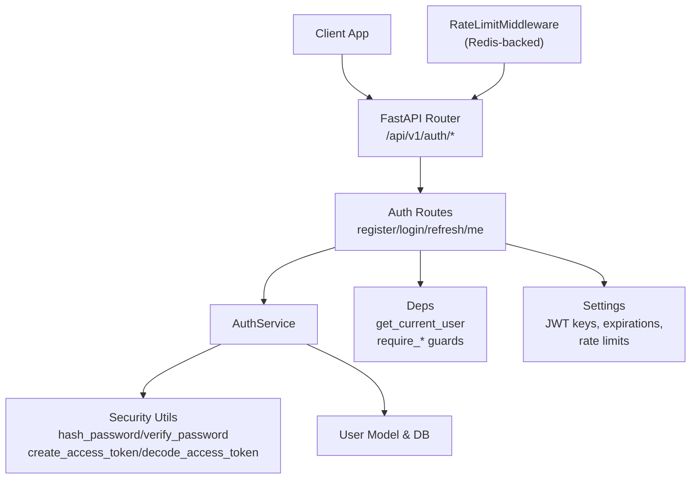
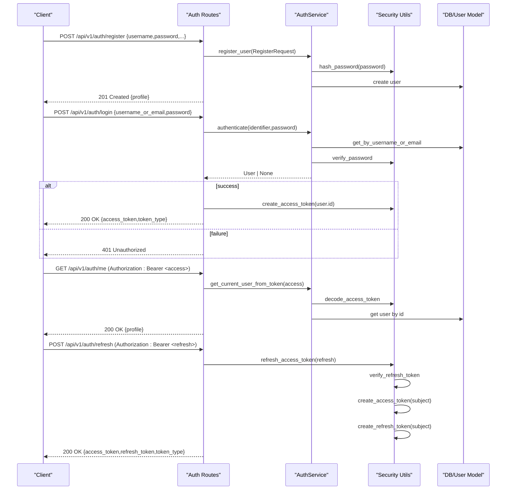
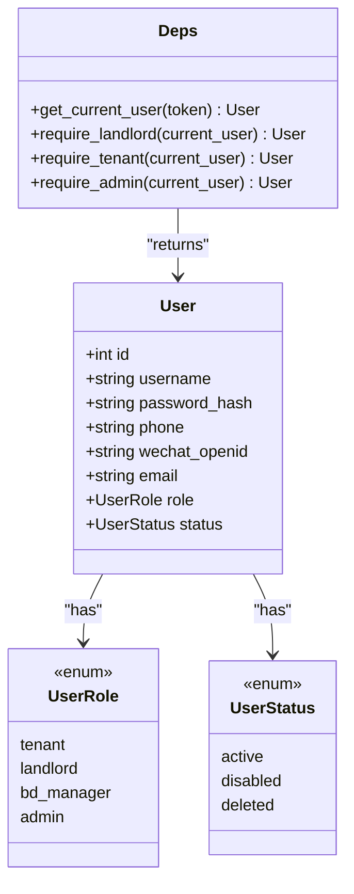
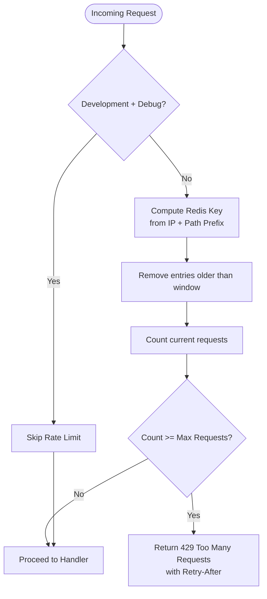
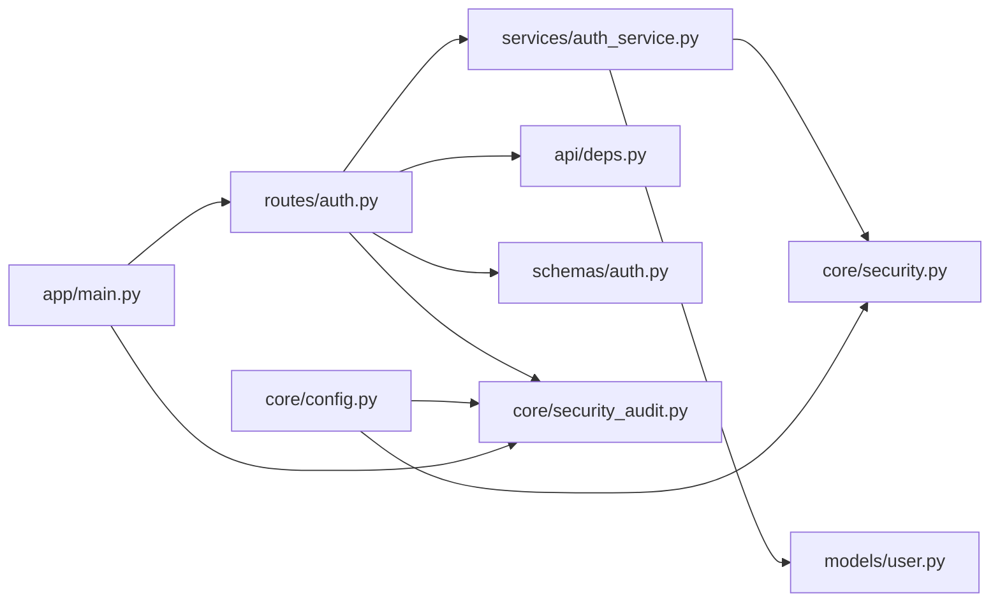

# Authentication & Authorization

<cite>
**Referenced Files in This Document**
- [auth.py](file://backend/app/api/v1/routes/auth.py)
- [auth.py](file://backend/app/schemas/auth.py)
- [auth_service.py](file://backend/app/services/auth_service.py)
- [security.py](file://backend/app/core/security.py)
- [security_audit.py](file://backend/app/core/security_audit.py)
- [deps.py](file://backend/app/api/deps.py)
- [user.py](file://backend/app/models/user.py)
- [config.py](file://backend/app/core/config.py)
- [main.py](file://backend/app/main.py)
- [test_auth.py](file://backend/tests/test_auth.py)
</cite>

## Table of Contents
1. [Introduction](#introduction)
2. [Project Structure](#project-structure)
3. [Core Components](#core-components)
4. [Architecture Overview](#architecture-overview)
5. [Detailed Component Analysis](#detailed-component-analysis)
6. [Dependency Analysis](#dependency-analysis)
7. [Performance Considerations](#performance-considerations)
8. [Troubleshooting Guide](#troubleshooting-guide)
9. [Conclusion](#conclusion)
10. [Appendices](#appendices)

## Introduction
This document provides comprehensive API documentation for authentication and authorization endpoints, including user registration, login, token refresh, and current user retrieval. It explains the request/response schemas, JWT token structure, password validation rules, error handling, role-based access control (RBAC), security measures, rate limiting, session management, and integration patterns for client applications.

## Project Structure
The authentication system is implemented across FastAPI routes, Pydantic schemas, service logic, core security utilities, dependency injection, and configuration:

- Routes: define HTTP endpoints under /api/v1/auth
- Schemas: validate requests and responses
- Services: implement business logic for registration, authentication, and token creation
- Core Security: hashing, JWT encode/decode, refresh token utilities, and rate limiting middleware
- Dependencies: OAuth2 bearer extraction and RBAC guards
- Configuration: secrets, token lifetimes, CORS, and rate limits
- Application bootstrap: middleware wiring and router inclusion

**Diagram sources**
- [auth.py:1-94](file://backend/app/api/v1/routes/auth.py#L1-L94)
- [auth_service.py:1-77](file://backend/app/services/auth_service.py#L1-L77)
- [security.py:1-34](file://backend/app/core/security.py#L1-L34)
- [security_audit.py:1-150](file://backend/app/core/security_audit.py#L1-L150)
- [deps.py:1-58](file://backend/app/api/deps.py#L1-L58)
- [config.py:1-167](file://backend/app/core/config.py#L1-L167)
- [main.py:1-82](file://backend/app/main.py#L1-L82)

**Section sources**
- [auth.py:1-94](file://backend/app/api/v1/routes/auth.py#L1-L94)
- [auth.py:1-63](file://backend/app/schemas/auth.py#L1-L63)
- [auth_service.py:1-77](file://backend/app/services/auth_service.py#L1-L77)
- [security.py:1-34](file://backend/app/core/security.py#L1-L34)
- [security_audit.py:1-150](file://backend/app/core/security_audit.py#L1-L150)
- [deps.py:1-58](file://backend/app/api/deps.py#L1-L58)
- [user.py:1-48](file://backend/app/models/user.py#L1-L48)
- [config.py:1-167](file://backend/app/core/config.py#L1-L167)
- [main.py:1-82](file://backend/app/main.py#L1-L82)

## Core Components
- Registration endpoint: validates input, hashes password, persists user, returns profile
- Login endpoint: authenticates by username or email, issues short-lived access token
- Refresh endpoint: accepts a long-lived refresh token to issue new access and refresh tokens
- Current user endpoint: requires valid Bearer access token and returns user profile
- RBAC guards: enforce tenant, landlord, admin roles on protected endpoints
- Rate limiting: Redis-backed sliding window per IP + path prefix
- JWT: HS256 with configurable expiration; refresh tokens include type claim

Key responsibilities:
- Input validation via Pydantic models
- Password hashing via bcrypt
- Token issuance and decoding via PyJWT
- Role checks via dependency functions
- Audit logging for register and login events

**Section sources**
- [auth.py:1-94](file://backend/app/api/v1/routes/auth.py#L1-L94)
- [auth.py:1-63](file://backend/app/schemas/auth.py#L1-L63)
- [auth_service.py:1-77](file://backend/app/services/auth_service.py#L1-L77)
- [security.py:1-34](file://backend/app/core/security.py#L1-L34)
- [security_audit.py:1-150](file://backend/app/core/security_audit.py#L1-L150)
- [deps.py:1-58](file://backend/app/api/deps.py#L1-L58)
- [user.py:1-48](file://backend/app/models/user.py#L1-L48)
- [config.py:1-167](file://backend/app/core/config.py#L1-L167)

## Architecture Overview
Authentication flow overview:
- Register: client sends credentials; server hashes password and creates user; returns profile
- Login: client sends identifier and password; server verifies and returns access token
- Access protected endpoints: client includes Bearer access token; server decodes and resolves user
- Refresh: client sends refresh token; server validates and returns new access and refresh tokens
- RBAC: additional dependencies enforce role requirements on other endpoints

**Diagram sources**
- [auth.py:1-94](file://backend/app/api/v1/routes/auth.py#L1-L94)
- [auth_service.py:1-77](file://backend/app/services/auth_service.py#L1-L77)
- [security.py:1-34](file://backend/app/core/security.py#L1-L34)
- [security_audit.py:102-149](file://backend/app/core/security_audit.py#L102-L149)
- [deps.py:19-30](file://backend/app/api/deps.py#L19-L30)
- [user.py:24-48](file://backend/app/models/user.py#L24-L48)

## Detailed Component Analysis

### Endpoints

#### POST /api/v1/auth/register
- Purpose: Create a new user account
- Request body:
  - username: string, length 1–100
  - password: string, length 8–128
  - phone: optional string, max length 32
  - email: optional valid email
  - role: enum; default tenant
- Response:
  - 201 Created: user profile object (id, username, phone, wechat_openid, email, role, status, timestamps)
  - 409 Conflict: duplicate username, email, or phone
- Notes:
  - Password is hashed before storage
  - Audit log entry created on successful registration

**Section sources**
- [auth.py:14-34](file://backend/app/api/v1/routes/auth.py#L14-L34)
- [auth.py:8-14](file://backend/app/schemas/auth.py#L8-L14)
- [auth_service.py:19-27](file://backend/app/services/auth_service.py#L19-L27)
- [security.py:12-13](file://backend/app/core/security.py#L12-L13)
- [user.py:24-48](file://backend/app/models/user.py#L24-L48)

#### POST /api/v1/auth/login
- Purpose: Authenticate user and return an access token
- Request body:
  - username_or_email: string, length 1–255
  - password: string, length 1–128
- Response:
  - 200 OK: {access_token, token_type="bearer"}
  - 401 Unauthorized: invalid credentials or inactive user
- Notes:
  - Identifier can be either username or email
  - Audit log entry created on successful login

**Section sources**
- [auth.py:37-60](file://backend/app/api/v1/routes/auth.py#L37-L60)
- [auth.py:16-23](file://backend/app/schemas/auth.py#L16-L23)
- [auth_service.py:29-38](file://backend/app/services/auth_service.py#L29-L38)
- [security.py:16-19](file://backend/app/core/security.py#L16-L19)

#### POST /api/v1/auth/refresh
- Purpose: Exchange a refresh token for a new access token (and a new refresh token)
- Headers:
  - Authorization: Bearer <refresh_token>
- Response:
  - 200 OK: {access_token, token_type="bearer"}
  - 401 Unauthorized: missing or invalid refresh token, expired refresh token, wrong token type
- Notes:
  - Uses refresh token utilities that also issue a new refresh token alongside the access token

**Section sources**
- [auth.py:63-89](file://backend/app/api/v1/routes/auth.py#L63-L89)
- [security_audit.py:139-149](file://backend/app/core/security_audit.py#L139-L149)
- [security_audit.py:113-136](file://backend/app/core/security_audit.py#L113-L136)

#### GET /api/v1/auth/me
- Purpose: Retrieve the authenticated user’s profile
- Headers:
  - Authorization: Bearer <access_token>
- Response:
  - 200 OK: user profile object
  - 401 Unauthorized: invalid or expired token
- Notes:
  - Requires a valid access token resolved to an active user

**Section sources**
- [auth.py:92-94](file://backend/app/api/v1/routes/auth.py#L92-L94)
- [deps.py:19-30](file://backend/app/api/deps.py#L19-L30)
- [auth_service.py:40-51](file://backend/app/services/auth_service.py#L40-L51)

### Request/Response Schemas

- RegisterRequest
  - Fields: username, password, phone (optional), email (optional), role (enum)
  - Validation: min/max lengths, email format, role defaults to tenant

- LoginRequest
  - Fields: username_or_email, password
  - Computed property: identifier equals username_or_email

- TokenResponse
  - Fields: access_token (string), token_type (default "bearer")

- CurrentUserResponse
  - Fields: id, username, phone, wechat_openid, email, role, status, created_at, updated_at
  - Serialization from ORM model attributes enabled

**Section sources**
- [auth.py:8-28](file://backend/app/schemas/auth.py#L8-L28)
- [auth.py:40-52](file://backend/app/schemas/auth.py#L40-L52)

### JWT Token Structure

- Access Token
  - Algorithm: HS256 (configurable)
  - Payload fields:
    - sub: subject (user id as string)
    - exp: expiration timestamp
  - Lifetime: configured via settings (minutes)

- Refresh Token
  - Algorithm: HS256 (same secret as access)
  - Payload fields:
    - sub: subject (user id as string)
    - exp: expiration timestamp
    - type: "refresh"
  - Lifetime: configured via settings (days)

- Secret Key and Algorithm
  - auth_secret_key: symmetric key used for signing and verification
  - auth_algorithm: algorithm name (default HS256)

**Section sources**
- [security.py:22-33](file://backend/app/core/security.py#L22-L33)
- [security_audit.py:102-110](file://backend/app/core/security_audit.py#L102-L110)
- [config.py:26-38](file://backend/app/core/config.py#L26-L38)

### Password Validation Rules
- Minimum length: 8 characters
- Maximum length: 128 characters
- Storage: bcrypt-hashed using passlib CryptContext
- Verification: constant-time comparison via passlib

**Section sources**
- [auth.py:8-14](file://backend/app/schemas/auth.py#L8-L14)
- [security.py:9-19](file://backend/app/core/security.py#L9-L19)

### Error Handling

Common scenarios and responses:
- Duplicate registration (username/email/phone): 409 Conflict
- Invalid credentials or inactive user: 401 Unauthorized
- Missing or invalid Authorization header: 401 Unauthorized
- Expired or invalid refresh token: 401 Unauthorized
- Rate limit exceeded: 429 Too Many Requests with Retry-After header

Examples validated by tests:
- Successful registration returns 201 with profile
- Successful login returns 200 with access token
- Wrong password returns 401
- Accessing /me without token returns 401

**Section sources**
- [auth.py:30-34](file://backend/app/api/v1/routes/auth.py#L30-L34)
- [auth.py:45-50](file://backend/app/api/v1/routes/auth.py#L45-L50)
- [auth.py:68-84](file://backend/app/api/v1/routes/auth.py#L68-L84)
- [security_audit.py:83-94](file://backend/app/core/security_audit.py#L83-L94)
- [test_auth.py:6-18](file://backend/tests/test_auth.py#L6-L18)
- [test_auth.py:22-40](file://backend/tests/test_auth.py#L22-L40)
- [test_auth.py:43-57](file://backend/tests/test_auth.py#L43-L57)
- [test_auth.py:61-64](file://backend/tests/test_auth.py#L61-L64)
- [test_auth.py:67-92](file://backend/tests/test_auth.py#L67-L92)

### Role-Based Access Control (RBAC)
Roles:
- tenant
- landlord
- bd_manager
- admin

Guards:
- require_landlord: allows landlord or admin
- require_tenant: allows tenant or admin
- require_admin: allows admin only

Usage pattern:
- Protected endpoints depend on these guards after verifying the access token

**Diagram sources**
- [user.py:11-22](file://backend/app/models/user.py#L11-L22)
- [user.py:24-48](file://backend/app/models/user.py#L24-L48)
- [deps.py:33-57](file://backend/app/api/deps.py#L33-L57)

**Section sources**
- [user.py:11-22](file://backend/app/models/user.py#L11-L22)
- [deps.py:33-57](file://backend/app/api/deps.py#L33-L57)

### Security Measures
- Password hashing: bcrypt via passlib
- JWT signing: HS256 with strong secret key
- Token expiry: short-lived access tokens; longer-lived refresh tokens
- Input validation: Pydantic models enforce field constraints
- Rate limiting: Redis-backed sliding window per IP + path prefix
- CORS: configurable origins; relaxed in development, tightened in production
- Audit logging: registration and login events recorded with IP address

**Section sources**
- [security.py:9-19](file://backend/app/core/security.py#L9-L19)
- [security.py:22-33](file://backend/app/core/security.py#L22-L33)
- [security_audit.py:49-94](file://backend/app/core/security_audit.py#L49-L94)
- [main.py:27-39](file://backend/app/main.py#L27-L39)
- [config.py:26-38](file://backend/app/core/config.py#L26-L38)
- [config.py:153-161](file://backend/app/core/config.py#L153-L161)

### Rate Limiting
- Implementation: Redis-backed token-bucket style limiter
- Scope: per client IP and URL path prefix
- Behavior:
  - In development with debug enabled, limiter is bypassed
  - Exceeding limit returns 429 with Retry-After header
- Configuration:
  - RATE_LIMIT_REQUESTS: maximum requests per window
  - RATE_LIMIT_WINDOW_SECONDS: window duration in seconds

**Diagram sources**
- [security_audit.py:49-94](file://backend/app/core/security_audit.py#L49-L94)
- [config.py:153-161](file://backend/app/core/config.py#L153-L161)

**Section sources**
- [security_audit.py:49-94](file://backend/app/core/security_audit.py#L49-L94)
- [main.py:44-57](file://backend/app/main.py#L44-L57)
- [config.py:153-161](file://backend/app/core/config.py#L153-L161)

### Session Management
- Stateless JWT-based sessions: no server-side session store
- Access tokens are short-lived; clients should cache and reuse until expiry
- Refresh tokens allow obtaining new access tokens without re-authentication
- No explicit logout mechanism is implemented; consider revocation strategies if needed

**Section sources**
- [security.py:22-33](file://backend/app/core/security.py#L22-L33)
- [security_audit.py:102-149](file://backend/app/core/security_audit.py#L102-L149)

### Integration Patterns for Clients
- Registration:
  - Send POST /api/v1/auth/register with required fields
  - Handle 201 response and store user profile
  - Handle 409 conflict for duplicates
- Login:
  - Send POST /api/v1/auth/login with username_or_email and password
  - Store access_token and set Authorization header as "Bearer <access_token>"
  - Handle 401 for invalid credentials
- Accessing protected endpoints:
  - Include Authorization header with access token
  - On 401, attempt refresh
- Token refresh:
  - Send POST /api/v1/auth/refresh with Authorization: Bearer <refresh_token>
  - Update stored access_token and refresh_token
  - Handle 401 for invalid/expired refresh tokens
- Current user:
  - GET /api/v1/auth/me to retrieve profile and verify token validity

**Section sources**
- [auth.py:14-94](file://backend/app/api/v1/routes/auth.py#L14-L94)
- [test_auth.py:6-92](file://backend/tests/test_auth.py#L6-L92)

## Dependency Analysis
High-level dependencies among components:

**Diagram sources**
- [auth.py:1-94](file://backend/app/api/v1/routes/auth.py#L1-L94)
- [auth_service.py:1-77](file://backend/app/services/auth_service.py#L1-L77)
- [security.py:1-34](file://backend/app/core/security.py#L1-L34)
- [security_audit.py:1-150](file://backend/app/core/security_audit.py#L1-L150)
- [deps.py:1-58](file://backend/app/api/deps.py#L1-L58)
- [user.py:1-48](file://backend/app/models/user.py#L1-L48)
- [auth.py:1-63](file://backend/app/schemas/auth.py#L1-L63)
- [config.py:1-167](file://backend/app/core/config.py#L1-L167)
- [main.py:1-82](file://backend/app/main.py#L1-L82)

**Section sources**
- [auth.py:1-94](file://backend/app/api/v1/routes/auth.py#L1-L94)
- [auth_service.py:1-77](file://backend/app/services/auth_service.py#L1-L77)
- [security.py:1-34](file://backend/app/core/security.py#L1-L34)
- [security_audit.py:1-150](file://backend/app/core/security_audit.py#L1-L150)
- [deps.py:1-58](file://backend/app/api/deps.py#L1-L58)
- [user.py:1-48](file://backend/app/models/user.py#L1-L48)
- [auth.py:1-63](file://backend/app/schemas/auth.py#L1-L63)
- [config.py:1-167](file://backend/app/core/config.py#L1-L167)
- [main.py:1-82](file://backend/app/main.py#L1-L82)

## Performance Considerations
- Short-lived access tokens reduce exposure window and minimize server-side state
- Refresh tokens enable seamless renewal without repeated credential submission
- Rate limiting protects against brute-force and abuse; ensure Redis availability
- Avoid storing sensitive data in tokens; keep payload minimal (subject and expiry)
- Use efficient password hashing parameters (bcrypt cost factor) appropriate for your environment

[No sources needed since this section provides general guidance]

## Troubleshooting Guide
Common issues and resolutions:
- 401 Unauthorized on login:
  - Verify username_or_email exists and password matches
  - Ensure user status is active
- 401 Unauthorized on protected endpoints:
  - Confirm Authorization header uses "Bearer <access_token>"
  - Check token expiry and refresh if necessary
- 409 Conflict on registration:
  - Username, email, or phone already exists; choose different values
- 429 Too Many Requests:
  - Back off according to Retry-After header; check rate limit configuration
- Refresh failures:
  - Ensure refresh token is present and not expired
  - Validate token type is "refresh"

Operational checks:
- Verify Redis connectivity for rate limiting
- Confirm AUTH_SECRET_KEY and algorithm settings match between services
- Review audit logs for registration and login events

**Section sources**
- [auth.py:30-34](file://backend/app/api/v1/routes/auth.py#L30-L34)
- [auth.py:45-50](file://backend/app/api/v1/routes/auth.py#L45-L50)
- [auth.py:68-84](file://backend/app/api/v1/routes/auth.py#L68-L84)
- [security_audit.py:83-94](file://backend/app/core/security_audit.py#L83-L94)
- [deps.py:19-30](file://backend/app/api/deps.py#L19-L30)

## Conclusion
The authentication and authorization system implements secure, stateless JWT-based flows with robust input validation, password hashing, and role-based access controls. Rate limiting and audit logging enhance resilience and observability. Clients should manage short-lived access tokens and use refresh tokens to maintain sessions securely.

[No sources needed since this section summarizes without analyzing specific files]

## Appendices

### Configuration Keys
- AUTH_SECRET_KEY: symmetric key for JWT signing
- AUTH_ALGORITHM: JWT algorithm (default HS256)
- ACCESS_TOKEN_EXPIRE_MINUTES: access token lifetime
- REFRESH_TOKEN_EXPIRE_DAYS: refresh token lifetime
- RATE_LIMIT_REQUESTS: max requests per window
- RATE_LIMIT_WINDOW_SECONDS: window duration in seconds
- CORS_ORIGINS: allowed origins (production vs development behavior differs)

**Section sources**
- [config.py:26-38](file://backend/app/core/config.py#L26-L38)
- [config.py:153-161](file://backend/app/core/config.py#L153-L161)
- [main.py:27-39](file://backend/app/main.py#L27-L39)