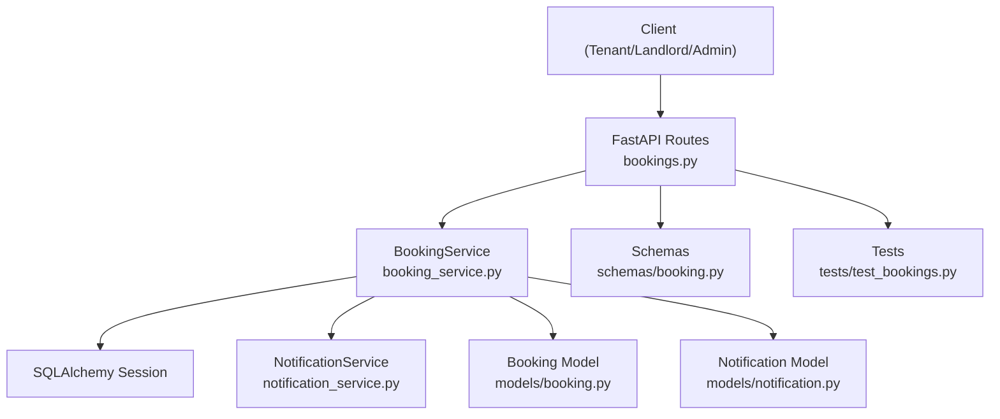
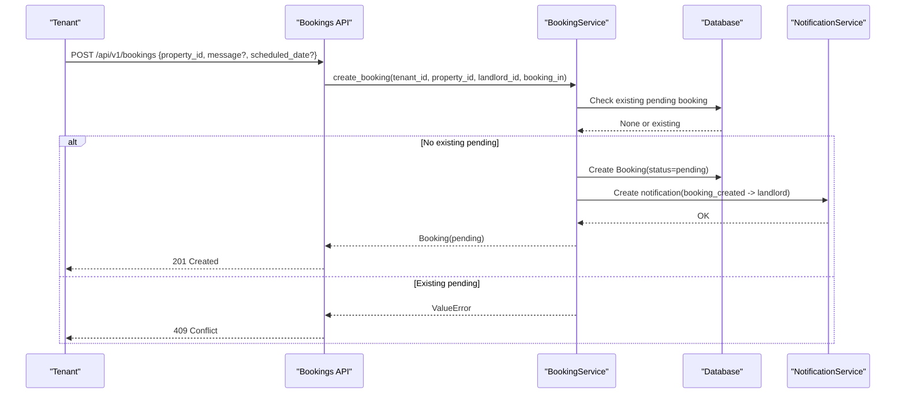
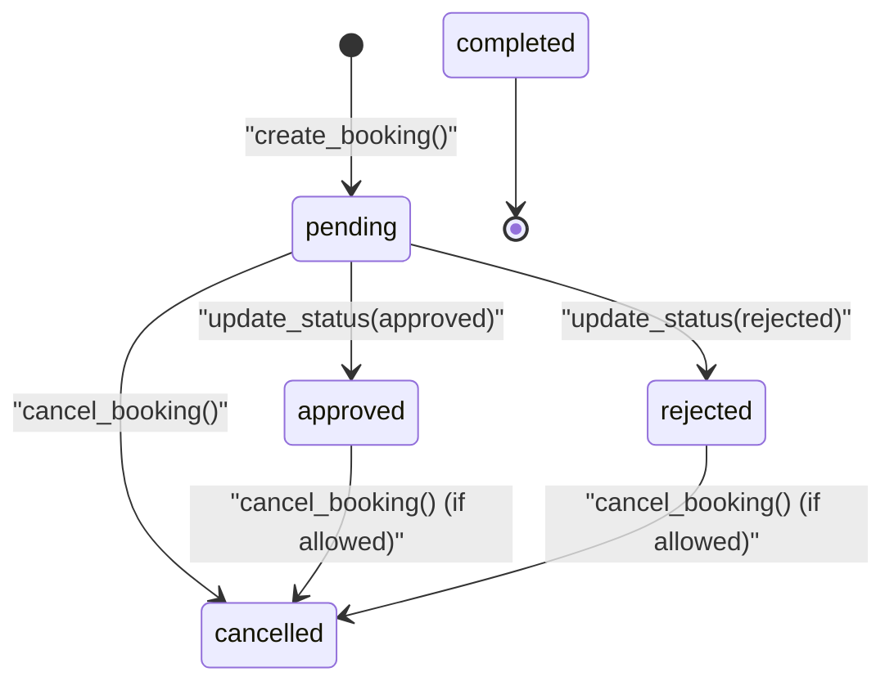
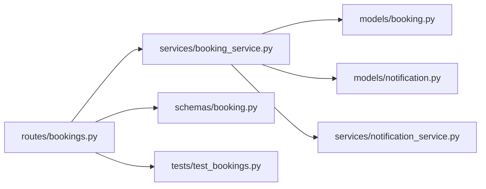

# Booking Status Workflow

<cite>
**Referenced Files in This Document**
- [booking.py](file://backend/app/models/booking.py)
- [booking.py](file://backend/app/schemas/booking.py)
- [bookings.py](file://backend/app/api/v1/routes/bookings.py)
- [booking_service.py](file://backend/app/services/booking_service.py)
- [notification.py](file://backend/app/models/notification.py)
- [notification_service.py](file://backend/app/services/notification_service.py)
- [audit_log.py](file://backend/app/models/audit_log.py)
- [audit_service.py](file://backend/app/services/audit_service.py)
- [property.py](file://backend/app/models/property.py)
- [20260620_0004_booking_and_notification.py](file://backend/alembic/versions/20260620_0004_booking_and_notification.py)
- [test_bookings.py](file://backend/tests/test_bookings.py)
</cite>

## Table of Contents
1. Introduction
2. Project Structure
3. Core Components
4. Architecture Overview
5. Detailed Component Analysis
6. Dependency Analysis
7. Performance Considerations
8. Troubleshooting Guide
9. Conclusion

## Introduction
This document explains the booking status lifecycle and workflow management for the rental housing system. It covers all supported statuses, valid transitions, validation rules, business constraints, notifications, audit logging, concurrency handling, and edge cases. The goal is to provide a clear, code-backed reference for developers and operators who need to understand or extend the booking workflow.

## Project Structure
The booking workflow spans API routes, service logic, data models, schemas, notifications, and tests:
- API layer exposes endpoints to create bookings, update status, and cancel.
- Service layer enforces state transitions and triggers notifications.
- Models define the domain entities and enumerations.
- Schemas validate request/response payloads.
- Tests verify key behaviors such as creation, approval, rejection, cancellation, and duplicate prevention.

**Diagram sources**
- [bookings.py:1-112](file://backend/app/api/v1/routes/bookings.py#L1-L112)
- [booking_service.py:1-164](file://backend/app/services/booking_service.py#L1-L164)
- [booking.py:1-47](file://backend/app/models/booking.py#L1-L47)
- [notification.py:1-36](file://backend/app/models/notification.py#L1-L36)
- [notification_service.py:1-164](file://backend/app/services/notification_service.py#L1-L164)
- [booking.py:1-35](file://backend/app/schemas/booking.py#L1-L35)
- [test_bookings.py:1-264](file://backend/tests/test_bookings.py#L1-L264)

**Section sources**
- [bookings.py:1-112](file://backend/app/api/v1/routes/bookings.py#L1-L112)
- [booking_service.py:1-164](file://backend/app/services/booking_service.py#L1-L164)
- [booking.py:1-47](file://backend/app/models/booking.py#L1-L47)
- [notification.py:1-36](file://backend/app/models/notification.py#L1-L36)
- [notification_service.py:1-164](file://backend/app/services/notification_service.py#L1-L164)
- [booking.py:1-35](file://backend/app/schemas/booking.py#L1-L35)
- [test_bookings.py:1-264](file://backend/tests/test_bookings.py#L1-L264)

## Core Components
- Booking model defines the entity and its status enumeration.
- Booking schemas define input/output contracts for API requests/responses.
- BookingService encapsulates business logic for creating bookings and updating statuses, including notification dispatch.
- NotificationService persists notifications and dispatches them via Celery tasks to WeChat, SMS, and Email channels.
- AuditLog and AuditService provide an infrastructure for audit logging (not currently invoked by booking flows).

Key responsibilities:
- Enforce allowed status transitions at the API/service boundary.
- Prevent duplicate pending bookings per tenant-property pair.
- Emit notifications on significant status changes.
- Maintain referential integrity with users and properties.

**Section sources**
- [booking.py:10-47](file://backend/app/models/booking.py#L10-L47)
- [booking.py:8-35](file://backend/app/schemas/booking.py#L8-L35)
- [booking_service.py:11-164](file://backend/app/services/booking_service.py#L11-L164)
- [notification_service.py:37-164](file://backend/app/services/notification_service.py#L37-L164)
- [audit_log.py:10-25](file://backend/app/models/audit_log.py#L10-L25)
- [audit_service.py:7-55](file://backend/app/services/audit_service.py#L7-L55)

## Architecture Overview
The booking workflow follows a layered architecture:
- API routes enforce role-based access and basic validation.
- Service methods implement state transitions and side effects (notifications).
- Data persistence uses SQLAlchemy with async sessions.
- Notifications are persisted and dispatched asynchronously.

**Diagram sources**
- [bookings.py:14-41](file://backend/app/api/v1/routes/bookings.py#L14-L41)
- [booking_service.py:15-79](file://backend/app/services/booking_service.py#L15-L79)
- [notification_service.py:43-69](file://backend/app/services/notification_service.py#L43-L69)

**Section sources**
- [bookings.py:14-41](file://backend/app/api/v1/routes/bookings.py#L14-L41)
- [booking_service.py:15-79](file://backend/app/services/booking_service.py#L15-L79)
- [notification_service.py:43-69](file://backend/app/services/notification_service.py#L43-L69)

## Detailed Component Analysis

### State Machine and Transitions
Supported statuses:
- pending
- approved
- rejected
- cancelled
- completed

Valid transitions enforced by the current implementation:
- pending → approved (landlord only)
- pending → rejected (landlord only)
- any non-terminal → cancelled (tenant only; see notes below)
- completed is present in the enum and used for notifications, but there is no explicit transition path to it in the current booking service.

Invalid attempts:
- Approving or rejecting from non-pending states is not explicitly blocked by the service method; however, the API restricts allowed values to approved/rejected and relies on caller context. If needed, add preconditions to block invalid transitions.
- Cancelling from terminal states should be prevented if business rules require it.

Edge cases:
- Duplicate pending bookings for the same tenant and property are rejected at creation time.
- Only the landlord can approve/reject; only the tenant can cancel; admin overrides exist for read and certain operations.

**Diagram sources**
- [booking_service.py:81-142](file://backend/app/services/booking_service.py#L81-L142)
- [bookings.py:71-111](file://backend/app/api/v1/routes/bookings.py#L71-L111)
- [booking.py:10-16](file://backend/app/models/booking.py#L10-L16)

**Section sources**
- [booking.py:10-16](file://backend/app/models/booking.py#L10-L16)
- [booking_service.py:81-142](file://backend/app/services/booking_service.py#L81-L142)
- [bookings.py:71-111](file://backend/app/api/v1/routes/bookings.py#L71-L111)

### Validation Rules and Business Constraints
- Creation requires either message or scheduled_date; otherwise returns 400.
- Property must exist; otherwise returns 404.
- Duplicate pending booking for the same tenant and property returns 409.
- Landlord-only actions: approve/reject via PATCH /status.
- Tenant-only action: cancel via PATCH /cancel.
- Admin roles have elevated permissions for reading and specific updates where checks allow.

Examples validated by tests:
- Successful creation and listing.
- Duplicate pending booking rejected with 409.
- Landlord approves and rejects different bookings.
- Tenant cancels a booking successfully.
- Unauthenticated requests are rejected.

**Section sources**
- [bookings.py:14-41](file://backend/app/api/v1/routes/bookings.py#L14-L41)
- [booking_service.py:15-79](file://backend/app/services/booking_service.py#L15-L79)
- [test_bookings.py:6-264](file://backend/tests/test_bookings.py#L6-L264)

### Relationship Between Booking Status and Property Availability
- The Property model includes a status field (available, rented, maintenance, offline), but the current booking service does not automatically change property status based on booking status.
- Deposit and fee fields on Booking are derived from the associated Property during creation.

Implications:
- If you want property availability to reflect booking outcomes (e.g., mark rented upon completion), add logic in the service to update Property.status accordingly.

**Section sources**
- [property.py:31-86](file://backend/app/models/property.py#L31-L86)
- [booking_service.py:35-53](file://backend/app/services/booking_service.py#L35-L53)

### Notification Triggers for Status Changes
Notifications are created when:
- A new booking is created (landlord notified).
- A booking is approved (tenant notified).
- A booking is rejected (tenant notified).
- A booking is cancelled (landlord notified).
- A booking is completed (tenant and landlord notified).

Channels include WeChat, SMS, and Email depending on the notification type. Dispatch failures are logged but do not block DB writes.

**Section sources**
- [booking_service.py:55-79](file://backend/app/services/booking_service.py#L55-L79)
- [booking_service.py:90-141](file://backend/app/services/booking_service.py#L90-L141)
- [notification_service.py:43-69](file://backend/app/services/notification_service.py#L43-L69)
- [notification_service.py:108-164](file://backend/app/services/notification_service.py#L108-L164)
- [notification.py:10-36](file://backend/app/models/notification.py#L10-L36)

### Audit Logging for Status Modifications
AuditLog and AuditService exist and can record user actions, resource types, IDs, details, and IP addresses. However, the current booking service does not call AuditService for status changes. To enable audit trails:
- Invoke AuditService.create_log within update_status and cancel_booking flows.
- Include details like previous status, new status, actor, and timestamp.

**Section sources**
- [audit_log.py:10-25](file://backend/app/models/audit_log.py#L10-L25)
- [audit_service.py:11-32](file://backend/app/services/audit_service.py#L11-L32)
- [booking_service.py:81-142](file://backend/app/services/booking_service.py#L81-L142)

### Concurrency Handling
Current behavior:
- Duplicate pending bookings are prevented by checking for an existing pending booking before creation.
- There is no explicit database-level unique constraint on (tenant_id, property_id, status=pending).
- update_status performs a simple get-and-update without optimistic locking or conditional updates.

Risks:
- Race conditions could allow concurrent approvals/rejections or cancellations if multiple actors act simultaneously.
- Without row-level locks or conditional updates, last-write-wins may occur.

Recommendations:
- Add a unique partial index or check constraint to prevent duplicate pending bookings at the DB level.
- Implement optimistic locking (e.g., version column) or conditional updates in update_status to ensure transitions are applied only from expected previous states.
- Use database transactions with appropriate isolation levels and row locks for critical updates.

**Section sources**
- [booking_service.py:23-33](file://backend/app/services/booking_service.py#L23-L33)
- [booking_service.py:81-88](file://backend/app/services/booking_service.py#L81-L88)
- [20260620_0004_booking_and_notification.py:18-42](file://backend/alembic/versions/20260620_0004_booking_and_notification.py#L18-L42)

### Examples of Valid and Invalid Transitions
Valid transitions:
- Create booking → pending
- Landlord approves → approved
- Landlord rejects → rejected
- Tenant cancels → cancelled

Invalid attempts:
- Approve/reject from non-pending states (not explicitly blocked; consider adding preconditions).
- Cancel from terminal states (not explicitly blocked; consider adding preconditions).
- Non-landlord attempting to approve/reject → 403 Forbidden.
- Non-tenant attempting to cancel → 403 Forbidden.
- Duplicate pending booking → 409 Conflict.

These behaviors are verified by tests.

**Section sources**
- [test_bookings.py:68-118](file://backend/tests/test_bookings.py#L68-L118)
- [test_bookings.py:120-200](file://backend/tests/test_bookings.py#L120-L200)
- [test_bookings.py:202-253](file://backend/tests/test_bookings.py#L202-L253)
- [bookings.py:71-111](file://backend/app/api/v1/routes/bookings.py#L71-L111)

## Dependency Analysis
High-level dependencies among components involved in the booking workflow:

**Diagram sources**
- [bookings.py:1-112](file://backend/app/api/v1/routes/bookings.py#L1-L112)
- [booking_service.py:1-164](file://backend/app/services/booking_service.py#L1-L164)
- [booking.py:1-47](file://backend/app/models/booking.py#L1-L47)
- [notification.py:1-36](file://backend/app/models/notification.py#L1-L36)
- [notification_service.py:1-164](file://backend/app/services/notification_service.py#L1-L164)
- [booking.py:1-35](file://backend/app/schemas/booking.py#L1-L35)
- [test_bookings.py:1-264](file://backend/tests/test_bookings.py#L1-L264)

**Section sources**
- [bookings.py:1-112](file://backend/app/api/v1/routes/bookings.py#L1-L112)
- [booking_service.py:1-164](file://backend/app/services/booking_service.py#L1-L164)
- [booking.py:1-47](file://backend/app/models/booking.py#L1-L47)
- [notification.py:1-36](file://backend/app/models/notification.py#L1-L36)
- [notification_service.py:1-164](file://backend/app/services/notification_service.py#L1-L164)
- [booking.py:1-35](file://backend/app/schemas/booking.py#L1-L35)
- [test_bookings.py:1-264](file://backend/tests/test_bookings.py#L1-L264)

## Performance Considerations
- Database queries are straightforward selects and single-row updates; they are efficient for typical workloads.
- Notifications are dispatched asynchronously via Celery tasks, avoiding blocking the main request flow.
- Consider indexing frequently filtered fields (already present for tenant_id, property_id, landlord_id).
- For high concurrency, use database-level constraints and conditional updates to reduce retries and conflicts.

[No sources needed since this section provides general guidance]

## Troubleshooting Guide
Common issues and resolutions:
- 400 Bad Request when creating a booking: Ensure either message or scheduled_date is provided.
- 404 Not Found: Verify property exists and booking ID is correct.
- 403 Forbidden: Confirm the actor has permission (landlord for approve/reject, tenant for cancel).
- 409 Conflict: A pending booking already exists for the tenant and property; resolve by cancelling or awaiting landlord decision.
- Notifications not received: Check Celery workers and channel configurations; failures are logged but do not block DB writes.

Operational tips:
- Inspect logs for notification dispatch warnings.
- Review test suites to reproduce scenarios locally.
- Add audit logging calls to capture detailed state changes for forensics.

**Section sources**
- [bookings.py:14-41](file://backend/app/api/v1/routes/bookings.py#L14-L41)
- [bookings.py:71-111](file://backend/app/api/v1/routes/bookings.py#L71-L111)
- [notification_service.py:108-164](file://backend/app/services/notification_service.py#L108-L164)
- [test_bookings.py:6-264](file://backend/tests/test_bookings.py#L6-L264)

## Conclusion
The booking workflow implements a clear lifecycle with well-defined roles and notifications. While the core transitions are functional, additional safeguards—such as explicit preconditions for transitions, database-level uniqueness for pending bookings, optimistic locking, and comprehensive audit logging—are recommended to strengthen correctness, observability, and concurrency safety. Integrating property availability updates upon booking completion would further align business expectations with system behavior.

[No sources needed since this section summarizes without analyzing specific files]