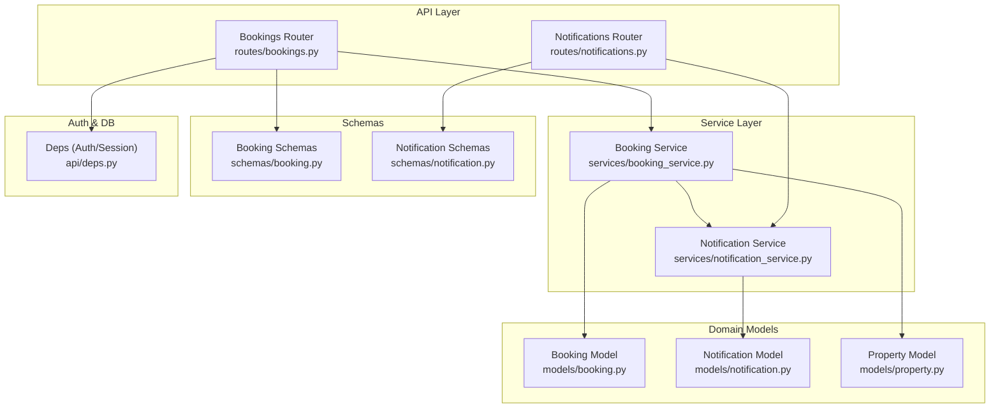
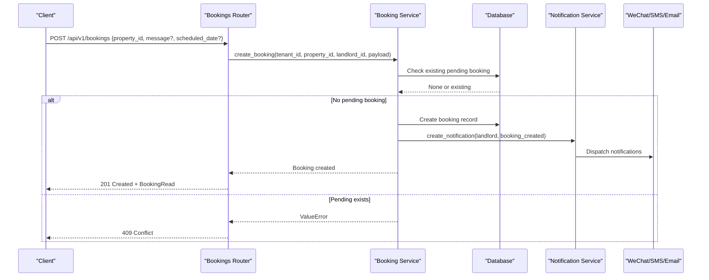
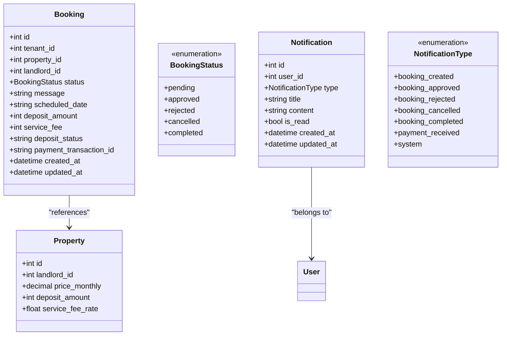
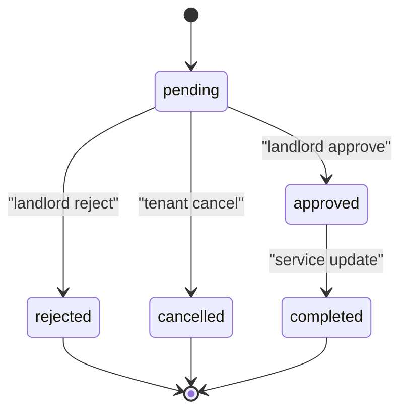
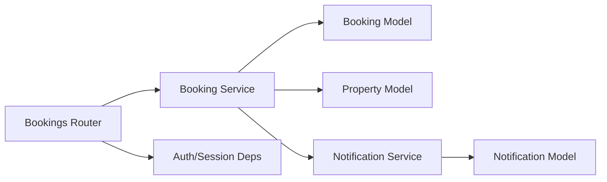

# Booking System APIs

<cite>
**Referenced Files in This Document**
- [bookings.py](file://backend/app/api/v1/routes/bookings.py)
- [booking_service.py](file://backend/app/services/booking_service.py)
- [booking.py](file://backend/app/models/booking.py)
- [booking.py](file://backend/app/schemas/booking.py)
- [notification.py](file://backend/app/models/notification.py)
- [notifications.py](file://backend/app/api/v1/routes/notifications.py)
- [notification_service.py](file://backend/app/services/notification_service.py)
- [deps.py](file://backend/app/api/deps.py)
- [property.py](file://backend/app/models/property.py)
- [test_bookings.py](file://backend/tests/test_bookings.py)
</cite>

## Table of Contents
1. [Introduction](#introduction)
2. [Project Structure](#project-structure)
3. [Core Components](#core-components)
4. [Architecture Overview](#architecture-overview)
5. [Detailed Component Analysis](#detailed-component-analysis)
6. [Dependency Analysis](#dependency-analysis)
7. [Performance Considerations](#performance-considerations)
8. [Troubleshooting Guide](#troubleshooting-guide)
9. [Conclusion](#conclusion)
10. [Appendices](#appendices)

## Introduction
This document provides comprehensive API documentation for the booking system endpoints, covering the full booking lifecycle: creating bookings, retrieving bookings with role-based filtering, updating status (approval/rejection), and cancellation workflows. It also documents landlord-specific operations, tenant booking history, notification triggers, status transitions, date validation rules, conflict resolution mechanisms, concurrent handling considerations, availability checking behavior, and business rule enforcement.

## Project Structure
The booking feature is implemented as a FastAPI module with clear separation between routes, services, models, and schemas. Notifications are integrated via a dedicated service that persists notifications and dispatches them to multiple channels asynchronously.

**Diagram sources**
- [bookings.py:1-112](file://backend/app/api/v1/routes/bookings.py#L1-L112)
- [booking_service.py:1-164](file://backend/app/services/booking_service.py#L1-L164)
- [booking.py:1-47](file://backend/app/models/booking.py#L1-L47)
- [booking.py:1-35](file://backend/app/schemas/booking.py#L1-L35)
- [notification.py:1-36](file://backend/app/models/notification.py#L1-L36)
- [notifications.py:1-50](file://backend/app/api/v1/routes/notifications.py#L1-L50)
- [notification_service.py:1-164](file://backend/app/services/notification_service.py#L1-L164)
- [deps.py:1-58](file://backend/app/api/deps.py#L1-L58)
- [property.py:1-86](file://backend/app/models/property.py#L1-L86)

**Section sources**
- [bookings.py:1-112](file://backend/app/api/v1/routes/bookings.py#L1-L112)
- [booking_service.py:1-164](file://backend/app/services/booking_service.py#L1-L164)
- [booking.py:1-47](file://backend/app/models/booking.py#L1-L47)
- [booking.py:1-35](file://backend/app/schemas/booking.py#L1-L35)
- [notification.py:1-36](file://backend/app/models/notification.py#L1-L36)
- [notifications.py:1-50](file://backend/app/api/v1/routes/notifications.py#L1-L50)
- [notification_service.py:1-164](file://backend/app/services/notification_service.py#L1-L164)
- [deps.py:1-58](file://backend/app/api/deps.py#L1-L58)
- [property.py:1-86](file://backend/app/models/property.py#L1-L86)

## Core Components
- Bookings API router defines endpoints for creating, listing, retrieving, updating status, and cancelling bookings.
- Booking service encapsulates business logic including duplicate pending booking checks, deposit/service fee calculation from property data, status updates, and notification triggers.
- Notification service persists notifications and dispatches them to WeChat, SMS, and Email channels asynchronously.
- Models define database schema and enumerations for booking statuses and notification types.
- Schemas define request/response payloads for API contracts.

Key responsibilities:
- Authorization and session injection via dependency providers.
- Role-based access control for tenants and landlords.
- Business rule enforcement for duplicate pending bookings and landlord-only approvals.
- Asynchronous notifications on key events.

**Section sources**
- [bookings.py:14-111](file://backend/app/api/v1/routes/bookings.py#L14-L111)
- [booking_service.py:15-164](file://backend/app/services/booking_service.py#L15-L164)
- [notification_service.py:43-164](file://backend/app/services/notification_service.py#L43-L164)
- [booking.py:10-47](file://backend/app/models/booking.py#L10-L47)
- [booking.py:8-35](file://backend/app/schemas/booking.py#L8-L35)
- [deps.py:19-48](file://backend/app/api/deps.py#L19-L48)

## Architecture Overview
The booking system follows a layered architecture:
- API layer exposes REST endpoints with Pydantic schemas for validation.
- Service layer implements business logic and orchestrates domain interactions.
- Data layer uses SQLAlchemy async ORM with enums and relationships.
- Notification subsystem integrates with Celery tasks for multi-channel delivery.

**Diagram sources**
- [bookings.py:14-41](file://backend/app/api/v1/routes/bookings.py#L14-L41)
- [booking_service.py:15-79](file://backend/app/services/booking_service.py#L15-L79)
- [notification_service.py:43-69](file://backend/app/services/notification_service.py#L43-L69)

## Detailed Component Analysis

### Endpoints

#### Create Booking
- Method: POST
- Path: /api/v1/bookings
- Auth: Tenant or Admin required
- Request body fields:
  - property_id (integer, required)
  - message (string, optional, max length 2000)
  - scheduled_date (string, optional, max length 32)
- Validation rules:
  - At least one of message or scheduled_date must be provided; otherwise returns 400 Bad Request.
  - Property existence check; if not found returns 404 Not Found.
  - Duplicate pending booking prevention for the same tenant and property; returns 409 Conflict if a pending booking already exists.
- Response:
  - 201 Created with BookingRead object
- Side effects:
  - Creates a booking with default status pending.
  - Calculates deposit_amount and service_fee based on property values.
  - Triggers landlord notification (booking_created).
  - Attempts to send tenant confirmation via WeChat template message (non-blocking).

Example request:
- JSON payload includes property_id, optional message, and optional scheduled_date formatted as a string (e.g., YYYY-MM-DD).

**Section sources**
- [bookings.py:14-41](file://backend/app/api/v1/routes/bookings.py#L14-L41)
- [booking_service.py:15-79](file://backend/app/services/booking_service.py#L15-L79)
- [booking.py:8-12](file://backend/app/schemas/booking.py#L8-L12)
- [property.py:75-76](file://backend/app/models/property.py#L75-L76)

#### List Bookings
- Method: GET
- Path: /api/v1/bookings
- Auth: Any authenticated user
- Behavior:
  - If current user is landlord or admin: returns bookings owned by the landlord.
  - Otherwise: returns bookings made by the tenant.
- Response:
  - 200 OK with list of BookingRead objects ordered by creation time descending.

**Section sources**
- [bookings.py:44-52](file://backend/app/api/v1/routes/bookings.py#L44-L52)
- [booking_service.py:144-160](file://backend/app/services/booking_service.py#L144-L160)

#### Get Booking by ID
- Method: GET
- Path: /api/v1/bookings/{booking_id}
- Auth: Any authenticated user
- Access control:
  - Only the tenant, landlord, or admin can view the booking; otherwise returns 403 Forbidden.
- Response:
  - 200 OK with BookingRead object
  - 404 Not Found if booking does not exist

**Section sources**
- [bookings.py:55-68](file://backend/app/api/v1/routes/bookings.py#L55-L68)

#### Update Booking Status (Approve/Reject)
- Method: PATCH
- Path: /api/v1/bookings/{booking_id}/status
- Auth: Landlord or Admin required
- Request body fields:
  - status (enum): approved or rejected only
- Validation:
  - Invalid status values return 400 Bad Request.
  - Only the landlord (or admin) can update the status; otherwise returns 403 Forbidden.
- Response:
  - 200 OK with updated BookingRead object
- Side effects:
  - Updates booking status.
  - Sends tenant notification for approval or rejection.

**Section sources**
- [bookings.py:71-93](file://backend/app/api/v1/routes/bookings.py#L71-L93)
- [booking_service.py:81-142](file://backend/app/services/booking_service.py#L81-L142)
- [notification.py:10-15](file://backend/app/models/notification.py#L10-L15)

#### Cancel Booking
- Method: PATCH
- Path: /api/v1/bookings/{booking_id}/cancel
- Auth: Tenant or Admin required
- Access control:
  - Only the tenant (or admin) can cancel; otherwise returns 403 Forbidden.
- Response:
  - 200 OK with updated BookingRead object
- Side effects:
  - Sets status to cancelled.
  - Sends landlord notification for cancellation.

**Section sources**
- [bookings.py:96-111](file://backend/app/api/v1/routes/bookings.py#L96-L111)
- [booking_service.py:81-142](file://backend/app/services/booking_service.py#L81-L142)

### Data Models and Schemas

#### Booking Model
- Fields include identifiers (tenant_id, property_id, landlord_id), status enum, message, scheduled_date, deposit-related fields, timestamps.
- Status enum values: pending, approved, rejected, cancelled, completed.

#### Booking Schemas
- BookingCreate: property_id, message, scheduled_date
- BookingUpdate: status, deposit_status, payment_transaction_id
- BookingRead: full read model including computed deposit and service fee, timestamps

**Section sources**
- [booking.py:10-47](file://backend/app/models/booking.py#L10-L47)
- [booking.py:8-35](file://backend/app/schemas/booking.py#L8-L35)

### Notification Integration
- NotificationType enum covers booking_created, booking_approved, booking_rejected, booking_cancelled, booking_completed, payment_received, system.
- NotificationService creates persistent records and dispatches to WeChat, SMS, and Email via Celery tasks.
- Channel templates map notification types to WeChat template IDs.

**Section sources**
- [notification.py:10-15](file://backend/app/models/notification.py#L10-L15)
- [notification_service.py:12-34](file://backend/app/services/notification_service.py#L12-L34)
- [notification_service.py:43-69](file://backend/app/services/notification_service.py#L43-L69)

### Authorization and Dependencies
- OAuth2 bearer token authentication via get_current_user.
- Role guards: require_landlord, require_tenant enforce access control.
- Database sessions injected via get_db_session.

**Section sources**
- [deps.py:19-48](file://backend/app/api/deps.py#L19-L48)

## Architecture Overview

**Diagram sources**
- [booking.py:10-47](file://backend/app/models/booking.py#L10-L47)
- [notification.py:10-36](file://backend/app/models/notification.py#L10-L36)
- [property.py:38-86](file://backend/app/models/property.py#L38-L86)

## Detailed Component Analysis

### Booking Lifecycle and Status Transitions
- Initial state: pending upon creation.
- Approve/Reject: landlord-only transition to approved or rejected.
- Cancel: tenant-only transition to cancelled.
- Completed: supported by service mapping but not exposed via current endpoints; would trigger additional notifications.

**Diagram sources**
- [booking.py:10-16](file://backend/app/models/booking.py#L10-L16)
- [booking_service.py:81-142](file://backend/app/services/booking_service.py#L81-L142)

### Date Validation Rules
- scheduled_date is an optional string field with a maximum length constraint.
- The backend does not perform explicit date parsing or range validation; it stores the string value as-is.
- Frontend components format dates as YYYY-MM-DD strings before submission.

**Section sources**
- [booking.py:8-12](file://backend/app/schemas/booking.py#L8-L12)
- [frontend/src/components/BookingDateDialog.vue:146-151](file://frontend/src/components/BookingDateDialog.vue#L146-L151)

### Conflict Resolution Mechanisms
- Duplicate pending booking prevention:
  - When creating a booking, the service checks for any existing pending booking for the same tenant and property.
  - If found, raises a ValueError which is translated into a 409 Conflict response.
- Concurrency considerations:
  - The check-and-create pattern is not wrapped in a transactional lock at the database level; under high concurrency, race conditions could allow duplicates.
  - Recommendation: add a unique partial index or use advisory locks to ensure atomicity.

**Section sources**
- [booking_service.py:23-33](file://backend/app/services/booking_service.py#L23-L33)
- [test_bookings.py:69-117](file://backend/tests/test_bookings.py#L69-L117)

### Availability Checking
- Current implementation does not implement calendar-based availability checks or slot-level conflicts.
- The scheduled_date is stored as a free-form string without validation against other bookings.
- To support availability checking, introduce:
  - A dedicated availability model or table for booked slots.
  - Range overlap queries to prevent double-booking within specified intervals.
  - Indexing on property_id and date ranges for performance.

[No sources needed since this section proposes enhancements beyond current code]

### Business Rule Enforcement
- Deposit and service fee calculation:
  - deposit_amount defaults to property.deposit_amount if present, else 1000.
  - service_fee is calculated as int(float(property.price_monthly) * property.service_fee_rate), defaulting to 0 if property missing.
- Role-based access:
  - Tenant-only cancellation endpoint enforces ownership.
  - Landlord-only status update endpoint enforces ownership.
  - Admin roles bypass ownership checks where applicable.

**Section sources**
- [booking_service.py:35-50](file://backend/app/services/booking_service.py#L35-L50)
- [bookings.py:89-90](file://backend/app/api/v1/routes/bookings.py#L89-L90)
- [bookings.py:107-108](file://backend/app/api/v1/routes/bookings.py#L107-L108)

### Notification Triggers
- On booking creation:
  - Landlord receives a booking_created notification across wechat, sms, email.
  - Tenant may receive a WeChat template confirmation message (best-effort).
- On status changes:
  - Approved: tenant notified.
  - Rejected: tenant notified.
  - Cancelled: landlord notified.
  - Completed: tenant and landlord notified.

**Section sources**
- [booking_service.py:55-79](file://backend/app/services/booking_service.py#L55-L79)
- [booking_service.py:90-142](file://backend/app/services/notification_service.py#L90-L142)
- [notification_service.py:12-34](file://backend/app/services/notification_service.py#L12-L34)

### Example Workflows

#### Creating a Booking with Date Range
- Request:
  - POST /api/v1/bookings
  - Body: { "property_id": 123, "message": "I would like to schedule a viewing", "scheduled_date": "2026-07-01" }
- Expected response:
  - 201 Created with BookingRead including status pending, calculated deposit_amount and service_fee.

**Section sources**
- [test_bookings.py:45-58](file://backend/tests/test_bookings.py#L45-L58)

#### Approval Workflow
- Landlord calls:
  - PATCH /api/v1/bookings/{id}/status with { "status": "approved" }
- Result:
  - Booking status becomes approved.
  - Tenant receives approval notification.

**Section sources**
- [test_bookings.py:165-171](file://backend/tests/test_bookings.py#L165-L171)
- [booking_service.py:90-105](file://backend/app/services/booking_service.py#L90-L105)

#### Cancellation Workflow
- Tenant calls:
  - PATCH /api/v1/bookings/{id}/cancel
- Result:
  - Booking status becomes cancelled.
  - Landlord receives cancellation notification.

**Section sources**
- [test_bookings.py:247-252](file://backend/tests/test_bookings.py#L247-L252)
- [booking_service.py:106-112](file://backend/app/services/booking_service.py#L106-L112)

## Dependency Analysis

**Diagram sources**
- [bookings.py:1-112](file://backend/app/api/v1/routes/bookings.py#L1-L112)
- [booking_service.py:1-164](file://backend/app/services/booking_service.py#L1-L164)
- [booking.py:1-47](file://backend/app/models/booking.py#L1-L47)
- [property.py:1-86](file://backend/app/models/property.py#L1-L86)
- [notification_service.py:1-164](file://backend/app/services/notification_service.py#L1-L164)
- [notification.py:1-36](file://backend/app/models/notification.py#L1-L36)
- [deps.py:1-58](file://backend/app/api/deps.py#L1-L58)

**Section sources**
- [bookings.py:1-112](file://backend/app/api/v1/routes/bookings.py#L1-L112)
- [booking_service.py:1-164](file://backend/app/services/booking_service.py#L1-L164)
- [notification_service.py:1-164](file://backend/app/services/notification_service.py#L1-L164)
- [deps.py:1-58](file://backend/app/api/deps.py#L1-L58)

## Performance Considerations
- Query efficiency:
  - Listing endpoints order by created_at desc; ensure indexes exist on created_at and foreign keys.
- Concurrency:
  - Duplicate pending booking check should be protected by a unique partial index or advisory lock to avoid race conditions.
- Notifications:
  - Channel dispatch is fire-and-forget via Celery; failures are logged and do not block DB writes.
- Calculations:
  - Deposit and service fee calculations occur per booking creation; caching property values may reduce repeated reads if needed.

[No sources needed since this section provides general guidance]

## Troubleshooting Guide
Common issues and resolutions:
- 400 Bad Request when creating a booking:
  - Ensure at least one of message or scheduled_date is provided.
- 404 Not Found:
  - Property does not exist or booking ID invalid.
- 409 Conflict:
  - A pending booking already exists for the same tenant and property.
- 403 Forbidden:
  - Insufficient role or ownership mismatch (only landlord can approve/reject; only tenant can cancel).
- 401 Unauthorized:
  - Missing or invalid bearer token.

Operational tips:
- Verify notification channel configuration if messages are not delivered.
- Review Celery worker logs for failed channel dispatches.
- Add logging around duplicate checks if investigating race conditions.

**Section sources**
- [bookings.py:20-24](file://backend/app/api/v1/routes/bookings.py#L20-L24)
- [bookings.py:26-28](file://backend/app/api/v1/routes/bookings.py#L26-L28)
- [bookings.py:38-39](file://backend/app/api/v1/routes/bookings.py#L38-L39)
- [bookings.py:89-90](file://backend/app/api/v1/routes/bookings.py#L89-L90)
- [bookings.py:107-108](file://backend/app/api/v1/routes/bookings.py#L107-L108)
- [deps.py:24-29](file://backend/app/api/deps.py#L24-L29)

## Conclusion
The booking system provides a robust foundation for managing property view requests with clear role-based access control, notification integration, and basic business rules. While calendar-based availability and strict date validation are not currently enforced, the architecture supports future enhancements such as slot-level conflict resolution and transactional guarantees for concurrency safety.

[No sources needed since this section summarizes without analyzing specific files]

## Appendices

### API Summary Table

| Endpoint | Method | Path | Auth | Request Body | Response | Notes |
|---|---|---|---|---|---|---|
| Create Booking | POST | /api/v1/bookings | Tenant/Admin | property_id, message?, scheduled_date? | 201 BookingRead | Validates presence of message or scheduled_date; prevents duplicate pending bookings |
| List Bookings | GET | /api/v1/bookings | Authenticated | None | 200 list[BookingRead] | Landlord/admin sees their properties' bookings; tenant sees own bookings |
| Get Booking | GET | /api/v1/bookings/{id} | Authenticated | None | 200 BookingRead | Access restricted to tenant, landlord, or admin |
| Update Status | PATCH | /api/v1/bookings/{id}/status | Landlord/Admin | status (approved|rejected) | 200 BookingRead | Enforces landlord ownership; sends tenant notifications |
| Cancel Booking | PATCH | /api/v1/bookings/{id}/cancel | Tenant/Admin | None | 200 BookingRead | Enforces tenant ownership; sends landlord notifications |

**Section sources**
- [bookings.py:14-111](file://backend/app/api/v1/routes/bookings.py#L14-L111)
- [booking_service.py:15-164](file://backend/app/services/booking_service.py#L15-L164)
- [notification_service.py:43-164](file://backend/app/services/notification_service.py#L43-L164)