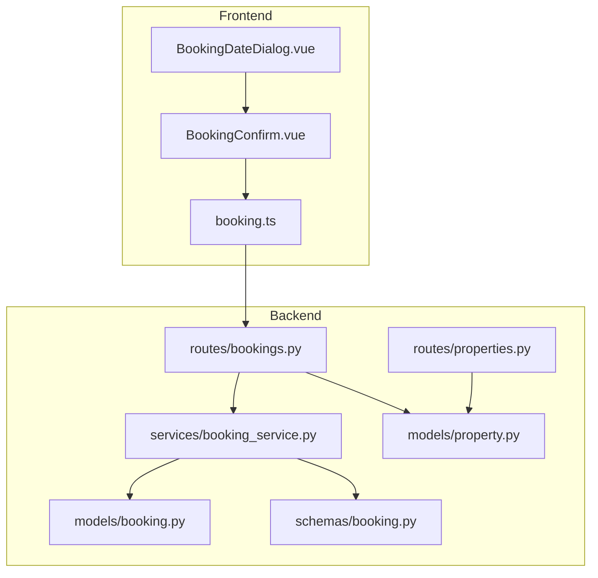
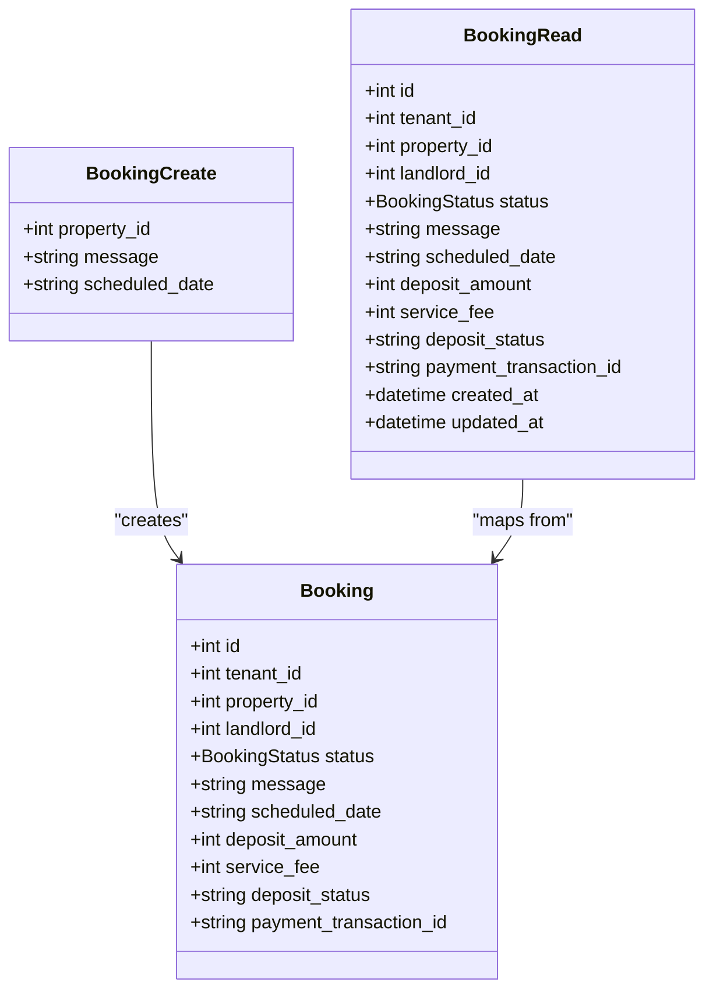
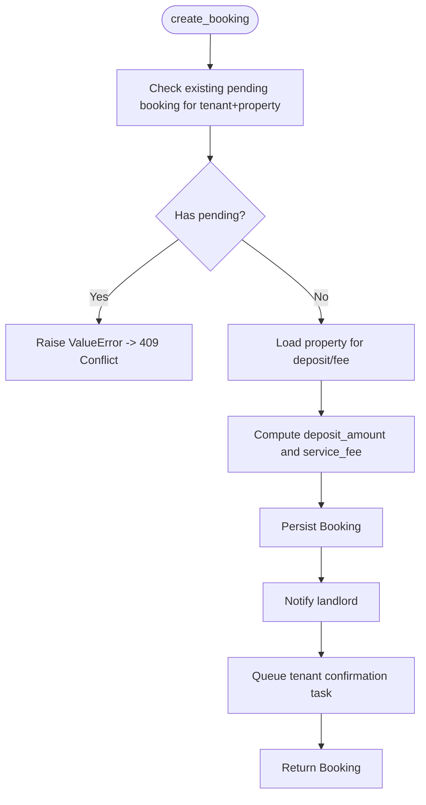
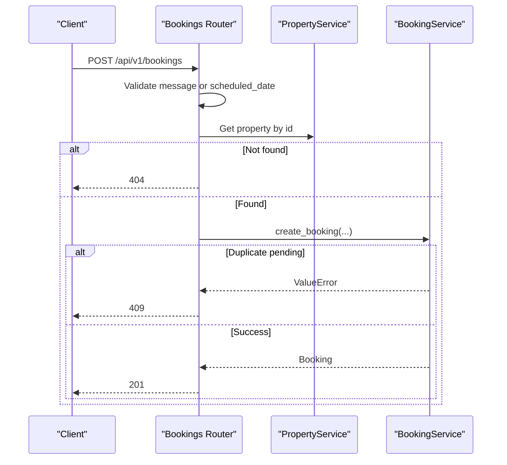
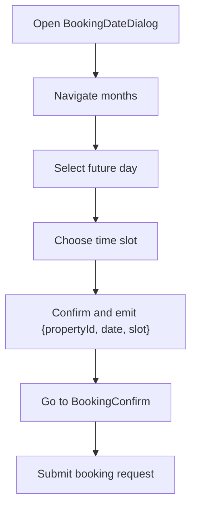
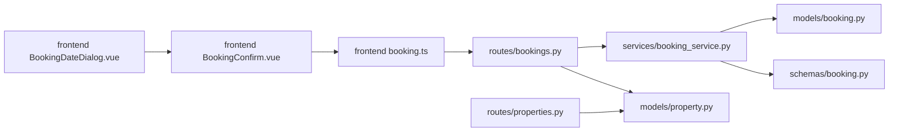

# Calendar Integration

<cite>
**Referenced Files in This Document**
- [booking.py](file://backend/app/models/booking.py)
- [booking.py](file://backend/app/schemas/booking.py)
- [bookings.py](file://backend/app/api/v1/routes/bookings.py)
- [booking_service.py](file://backend/app/services/booking_service.py)
- [property.py](file://backend/app/models/property.py)
- [properties.py](file://backend/app/api/v1/routes/properties.py)
- [booking.ts](file://frontend/src/services/booking.ts)
- [BookingDateDialog.vue](file://frontend/src/components/BookingDateDialog.vue)
- [BookingConfirm.vue](file://frontend/src/views/BookingConfirm.vue)
- [test_bookings.py](file://backend/tests/test_bookings.py)
</cite>

## Table of Contents
1. [Introduction](#introduction)
2. [Project Structure](#project-structure)
3. [Core Components](#core-components)
4. [Architecture Overview](#architecture-overview)
5. [Detailed Component Analysis](#detailed-component-analysis)
6. [Dependency Analysis](#dependency-analysis)
7. [Performance Considerations](#performance-considerations)
8. [Troubleshooting Guide](#troubleshooting-guide)
9. [Conclusion](#conclusion)

## Introduction
This document explains the calendar-related booking functionality and date conflict resolution across the backend and frontend. It covers how scheduled dates are validated, how availability is determined, and how conflicts are detected and prevented. It also documents available endpoints for retrieving property calendars and checking date availability, as well as patterns for managing recurring bookings, timezone handling, and synchronization strategies. Finally, it provides performance guidance for large datasets, caching approaches for availability queries, and real-time update considerations.

## Project Structure
The booking feature spans models, schemas, services, API routes, and frontend components:
- Backend model and schema define the booking entity and request/response contracts.
- Service layer implements business logic including duplicate pending booking prevention and notifications.
- API routes expose endpoints for creating, listing, updating status, and canceling bookings.
- Frontend provides a date picker dialog and confirmation view to collect and submit booking requests.

**Diagram sources**
- [bookings.py:1-112](file://backend/app/api/v1/routes/bookings.py#L1-L112)
- [booking_service.py:1-164](file://backend/app/services/booking_service.py#L1-L164)
- [booking.py:1-47](file://backend/app/models/booking.py#L1-L47)
- [booking.py:1-35](file://backend/app/schemas/booking.py#L1-L35)
- [property.py:1-86](file://backend/app/models/property.py#L1-L86)
- [properties.py:1-162](file://backend/app/api/v1/routes/properties.py#L1-L162)
- [BookingDateDialog.vue:1-305](file://frontend/src/components/BookingDateDialog.vue#L1-L305)
- [BookingConfirm.vue:125-170](file://frontend/src/views/BookingConfirm.vue#L125-L170)
- [booking.ts:1-24](file://frontend/src/services/booking.ts#L1-L24)

**Section sources**
- [bookings.py:1-112](file://backend/app/api/v1/routes/bookings.py#L1-L112)
- [booking_service.py:1-164](file://backend/app/services/booking_service.py#L1-L164)
- [booking.py:1-47](file://backend/app/models/booking.py#L1-L47)
- [booking.py:1-35](file://backend/app/schemas/booking.py#L1-L35)
- [property.py:1-86](file://backend/app/models/property.py#L1-L86)
- [properties.py:1-162](file://backend/app/api/v1/routes/properties.py#L1-L162)
- [BookingDateDialog.vue:1-305](file://frontend/src/components/BookingDateDialog.vue#L1-L305)
- [BookingConfirm.vue:125-170](file://frontend/src/views/BookingConfirm.vue#L125-L170)
- [booking.ts:1-24](file://frontend/src/services/booking.ts#L1-L24)

## Core Components
- Booking model and schema: Define fields such as tenant_id, property_id, landlord_id, status, message, and scheduled_date (string). Status enum includes pending, approved, rejected, cancelled, completed.
- Booking service: Creates bookings with validation against existing pending bookings for the same tenant and property; computes deposit and service fee from property data; sends notifications.
- Bookings API: Endpoints to create, list, get by id, update status (approved/rejected), and cancel. Enforces role-based access control.
- Property model: Provides price_monthly, deposit_amount, service_fee_rate used during booking creation.
- Frontend components: Date selection UI with past-date blocking and time slot selection; confirmation view that collects contact info and submits booking.

Key responsibilities:
- Validation: Prevent duplicate pending bookings per tenant-property pair.
- Availability: Current implementation does not enforce day-level or time-slot-level conflicts; only pending duplicates are blocked.
- Notifications: Landlord notified on creation; tenant notified on approval/rejection/cancellation/completion.

**Section sources**
- [booking.py:10-47](file://backend/app/models/booking.py#L10-L47)
- [booking.py:8-35](file://backend/app/schemas/booking.py#L8-L35)
- [booking_service.py:15-79](file://backend/app/services/booking_service.py#L15-L79)
- [bookings.py:14-41](file://backend/app/api/v1/routes/bookings.py#L14-L41)
- [property.py:57-76](file://backend/app/models/property.py#L57-L76)
- [BookingDateDialog.vue:119-165](file://frontend/src/components/BookingDateDialog.vue#L119-L165)
- [BookingConfirm.vue:125-170](file://frontend/src/views/BookingConfirm.vue#L125-L170)

## Architecture Overview
End-to-end flow for creating a booking request:

```mermaid
sequenceDiagram
participant FE as "Frontend<br/>BookingDateDialog.vue / BookingConfirm.vue"
participant API as "FastAPI Router<br/>routes/bookings.py"
participant SVC as "Service<br/>booking_service.py"
participant DB as "Database<br/>models/booking.py"
participant PROP as "Property Model<br/>models/property.py"
FE->>API : POST /api/v1/bookings {property_id, message?, scheduled_date?}
API->>API : Validate required fields
API->>PROP : Get property by id
API->>SVC : create_booking(tenant_id, property_id, landlord_id, booking_in)
SVC->>DB : Check existing pending booking for tenant+property
alt Duplicate pending exists
SVC-->>API : ValueError
API-->>FE : 409 Conflict
else No duplicate
SVC->>DB : Create Booking record
SVC-->>API : Booking object
API-->>FE : 201 Created
end
```

**Diagram sources**
- [bookings.py:14-41](file://backend/app/api/v1/routes/bookings.py#L14-L41)
- [booking_service.py:15-79](file://backend/app/services/booking_service.py#L15-L79)
- [booking.py:18-47](file://backend/app/models/booking.py#L18-L47)
- [property.py:48-76](file://backend/app/models/property.py#L48-L76)

## Detailed Component Analysis

### Booking Data Model and Schema
- Fields include identifiers, status, optional message, and an optional scheduled_date string.
- Status transitions are managed via service methods and enforced at the API layer.

**Diagram sources**
- [booking.py:18-47](file://backend/app/models/booking.py#L18-L47)
- [booking.py:8-35](file://backend/app/schemas/booking.py#L8-L35)

**Section sources**
- [booking.py:18-47](file://backend/app/models/booking.py#L18-L47)
- [booking.py:8-35](file://backend/app/schemas/booking.py#L8-L35)

### Booking Service Logic
- Duplicate pending check: Ensures a tenant cannot have multiple pending bookings for the same property.
- Deposit and fee calculation: Uses property’s deposit_amount and service_fee_rate to compute values.
- Notifications: Emits notifications to landlord and tenant based on status changes.

**Diagram sources**
- [booking_service.py:15-79](file://backend/app/services/booking_service.py#L15-L79)

**Section sources**
- [booking_service.py:15-79](file://backend/app/services/booking_service.py#L15-L79)

### API Endpoints
- POST /api/v1/bookings: Create booking request. Requires either message or scheduled_date. Returns 201 on success, 409 if duplicate pending exists, 404 if property not found.
- GET /api/v1/bookings: List bookings filtered by current user role (landlord/admin vs tenant).
- GET /api/v1/bookings/{id}: Retrieve a single booking with authorization checks.
- PATCH /api/v1/bookings/{id}/status: Update status to approved or rejected (landlord-only).
- PATCH /api/v1/bookings/{id}/cancel: Cancel booking (tenant-only).

**Diagram sources**
- [bookings.py:14-41](file://backend/app/api/v1/routes/bookings.py#L14-L41)

**Section sources**
- [bookings.py:14-112](file://backend/app/api/v1/routes/bookings.py#L14-L112)

### Frontend Calendar and Time Slot Selection
- Date picker blocks past days and allows month navigation without selecting past dates.
- Time slots are predefined (morning, afternoon, evening).
- Confirmation view pre-fills selected date and slot, validates contact info, and submits booking.

**Diagram sources**
- [BookingDateDialog.vue:95-165](file://frontend/src/components/BookingDateDialog.vue#L95-L165)
- [BookingConfirm.vue:125-170](file://frontend/src/views/BookingConfirm.vue#L125-L170)

**Section sources**
- [BookingDateDialog.vue:95-165](file://frontend/src/components/BookingDateDialog.vue#L95-L165)
- [BookingConfirm.vue:125-170](file://frontend/src/views/BookingConfirm.vue#L125-L170)

### Property Calendar and Availability Endpoints
- There is no dedicated endpoint for retrieving a property’s calendar or checking date availability in the current codebase.
- Clients can infer availability by listing bookings for a property and filtering by status and scheduled_date. However, this approach requires client-side aggregation and does not provide server-side conflict detection beyond pending duplicates.

Recommendation: Add a GET /api/v1/properties/{property_id}/availability endpoint that returns booked dates and statuses for a given range.

[No sources needed since this section proposes enhancements not present in the code]

### Recurring Bookings
- The current schema stores a single scheduled_date per booking. There is no native support for recurring bookings.
- To implement recurring patterns, extend the model to include recurrence rules (e.g., frequency, interval, end date) and generate concrete instances for conflict checks.

[No sources needed since this section proposes enhancements not present in the code]

### Timezone Handling
- scheduled_date is stored as a string. The frontend formats dates as YYYY-MM-DD using local time.
- For robust multi-timezone support, store timestamps in UTC and convert to local time on the client. Consider storing both UTC datetime and display-friendly strings.

[No sources needed since this section provides general guidance]

### Calendar Synchronization Patterns
- Real-time updates: Use polling or WebSocket events to reflect booking status changes (approved/rejected/cancelled/completed).
- Caching: Cache availability results for short TTLs to reduce database load.

[No sources needed since this section provides general guidance]

## Dependency Analysis
High-level dependencies among core components:

**Diagram sources**
- [bookings.py:1-112](file://backend/app/api/v1/routes/bookings.py#L1-L112)
- [booking_service.py:1-164](file://backend/app/services/booking_service.py#L1-L164)
- [booking.py:1-47](file://backend/app/models/booking.py#L1-L47)
- [booking.py:1-35](file://backend/app/schemas/booking.py#L1-L35)
- [property.py:1-86](file://backend/app/models/property.py#L1-L86)
- [properties.py:1-162](file://backend/app/api/v1/routes/properties.py#L1-L162)
- [BookingDateDialog.vue:1-305](file://frontend/src/components/BookingDateDialog.vue#L1-L305)
- [BookingConfirm.vue:125-170](file://frontend/src/views/BookingConfirm.vue#L125-L170)
- [booking.ts:1-24](file://frontend/src/services/booking.ts#L1-L24)

**Section sources**
- [bookings.py:1-112](file://backend/app/api/v1/routes/bookings.py#L1-L112)
- [booking_service.py:1-164](file://backend/app/services/booking_service.py#L1-L164)
- [booking.py:1-47](file://backend/app/models/booking.py#L1-L47)
- [booking.py:1-35](file://backend/app/schemas/booking.py#L1-L35)
- [property.py:1-86](file://backend/app/models/property.py#L1-L86)
- [properties.py:1-162](file://backend/app/api/v1/routes/properties.py#L1-L162)
- [BookingDateDialog.vue:1-305](file://frontend/src/components/BookingDateDialog.vue#L1-L305)
- [BookingConfirm.vue:125-170](file://frontend/src/views/BookingConfirm.vue#L125-L170)
- [booking.ts:1-24](file://frontend/src/services/booking.ts#L1-L24)

## Performance Considerations
- Indexes: Ensure indexes exist on foreign keys and frequently queried fields (tenant_id, property_id, status, scheduled_date) to optimize conflict checks and availability queries.
- Query optimization: When implementing availability endpoints, use range filters and aggregate booked dates efficiently.
- Caching: Cache availability results for short TTLs (e.g., 1–5 minutes) keyed by property_id and date range. Invalidate cache on booking mutations.
- Pagination: For listing bookings, paginate responses to avoid large payloads.
- Concurrency: Use database constraints or transactions to prevent race conditions when creating bookings under high concurrency.

[No sources needed since this section provides general guidance]

## Troubleshooting Guide
Common issues and resolutions:
- 409 Conflict on booking creation: Indicates a duplicate pending booking for the same tenant and property. Resolve by waiting for approval/rejection or canceling the existing pending booking.
- 404 Not Found: Property or booking not found. Verify IDs and permissions.
- 403 Forbidden: Unauthorized action (e.g., non-landlord attempting to update status). Ensure correct role and ownership.
- 401 Unauthorized: Missing or invalid token when accessing protected endpoints.

Validation examples from tests:
- Duplicate pending booking rejection returns 409.
- Successful creation returns 201 with expected fields.
- Landlord can approve/reject; tenant can cancel.

**Section sources**
- [bookings.py:14-112](file://backend/app/api/v1/routes/bookings.py#L14-L112)
- [booking_service.py:15-79](file://backend/app/services/booking_service.py#L15-L79)
- [test_bookings.py:68-118](file://backend/tests/test_bookings.py#L68-L118)
- [test_bookings.py:120-200](file://backend/tests/test_bookings.py#L120-L200)
- [test_bookings.py:202-253](file://backend/tests/test_bookings.py#L202-L253)
- [test_bookings.py:255-264](file://backend/tests/test_bookings.py#L255-L264)

## Conclusion
The current booking system supports scheduling visits with a simple date field and prevents duplicate pending bookings per tenant-property pair. Availability checking and time-slot conflict detection are not implemented server-side; clients must handle these concerns or adopt recommended enhancements. Adding dedicated availability endpoints, enforcing time-slot conflicts, supporting recurring bookings, and improving timezone handling will strengthen the calendar integration. Performance best practices like indexing, caching, and pagination should be applied to scale effectively.