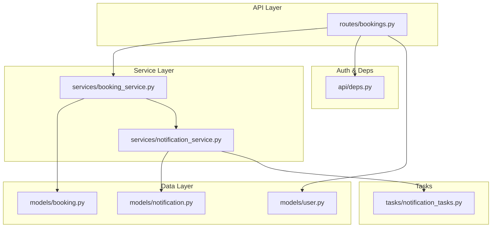
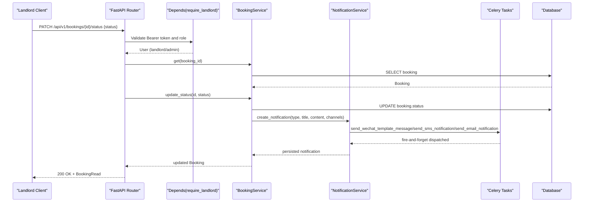
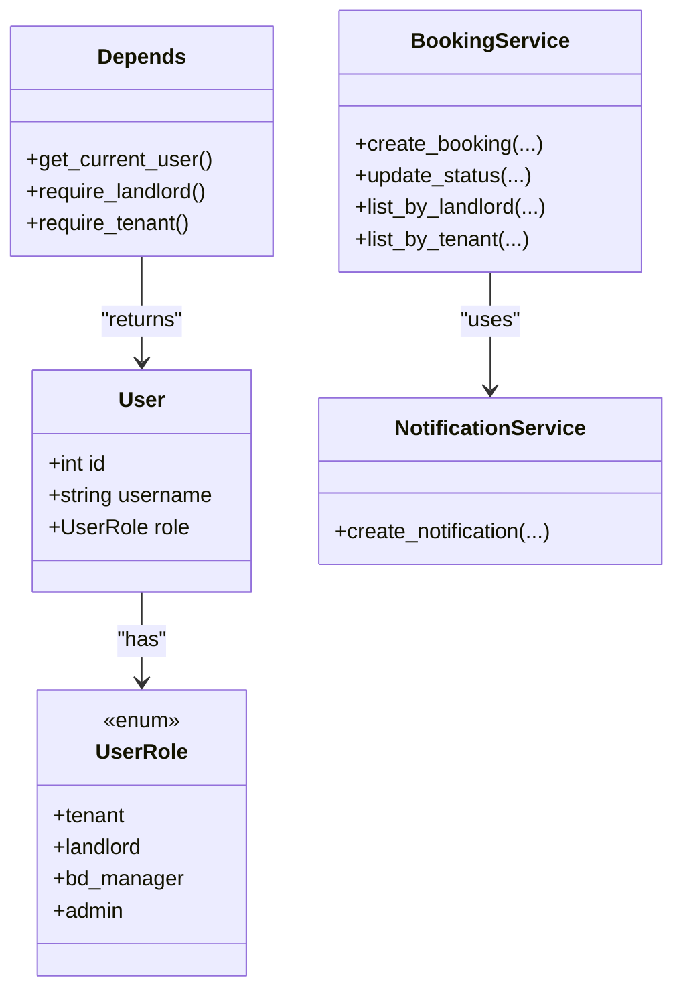

# Landlord Management

<cite>
**Referenced Files in This Document**
- [bookings.py](file://backend/app/api/v1/routes/bookings.py)
- [booking_service.py](file://backend/app/services/booking_service.py)
- [booking.py](file://backend/app/models/booking.py)
- [booking.py (schema)](file://backend/app/schemas/booking.py)
- [deps.py](file://backend/app/api/deps.py)
- [notification_service.py](file://backend/app/services/notification_service.py)
- [notification_tasks.py](file://backend/app/tasks/notification_tasks.py)
- [notification.py](file://backend/app/models/notification.py)
- [user.py](file://backend/app/models/user.py)
- [test_bookings.py](file://backend/tests/test_bookings.py)
</cite>

## Table of Contents
1. [Introduction](#introduction)
2. [Project Structure](#project-structure)
3. [Core Components](#core-components)
4. [Architecture Overview](#architecture-overview)
5. [Detailed Component Analysis](#detailed-component-analysis)
6. [Dependency Analysis](#dependency-analysis)
7. [Performance Considerations](#performance-considerations)
8. [Troubleshooting Guide](#troubleshooting-guide)
9. [Conclusion](#conclusion)

## Introduction
This document provides comprehensive API documentation for landlord booking management features, focusing on:
- PATCH /api/v1/bookings/{id}/status for approving or rejecting bookings with status validation and authorization checks
- GET /api/v1/bookings to list all bookings for properties owned by the authenticated landlord
- Access control mechanisms ensuring only property owners can manage their bookings
- Approval workflows, rejection reasons, and notification triggers
- Concurrent booking handling, availability conflicts, and business rule enforcement for landlord operations

The backend is implemented using FastAPI with SQLAlchemy async sessions, Pydantic schemas, Celery-based notifications, and role-based access control.

## Project Structure
Key modules involved in landlord booking management:
- API routes define endpoints and enforce role-based access
- Services encapsulate business logic including listing, creation, and status updates
- Models define database schema and enumerations
- Schemas validate request/response payloads
- Notification service integrates DB persistence and asynchronous channel dispatch
- Tests cover core flows and edge cases

**Diagram sources**
- [bookings.py:1-112](file://backend/app/api/v1/routes/bookings.py#L1-L112)
- [booking_service.py:1-164](file://backend/app/services/booking_service.py#L1-L164)
- [notification_service.py:1-164](file://backend/app/services/notification_service.py#L1-L164)
- [booking.py:1-47](file://backend/app/models/booking.py#L1-L47)
- [user.py:1-48](file://backend/app/models/user.py#L1-L48)
- [notification.py:1-36](file://backend/app/models/notification.py#L1-L36)
- [notification_tasks.py:1-217](file://backend/app/tasks/notification_tasks.py#L1-L217)
- [deps.py:1-58](file://backend/app/api/deps.py#L1-L58)

**Section sources**
- [bookings.py:1-112](file://backend/app/api/v1/routes/bookings.py#L1-L112)
- [booking_service.py:1-164](file://backend/app/services/booking_service.py#L1-L164)
- [notification_service.py:1-164](file://backend/app/services/notification_service.py#L1-L164)
- [booking.py:1-47](file://backend/app/models/booking.py#L1-L47)
- [user.py:1-48](file://backend/app/models/user.py#L1-L48)
- [notification.py:1-36](file://backend/app/models/notification.py#L1-L36)
- [notification_tasks.py:1-217](file://backend/app/tasks/notification_tasks.py#L1-L217)
- [deps.py:1-58](file://backend/app/api/deps.py#L1-L58)

## Core Components
- BookingStatus enum defines allowed states: pending, approved, rejected, cancelled, completed
- Booking model stores tenant, property, landlord references and financial fields
- BookingCreate/BookingUpdate/BookingRead schemas validate inputs and outputs
- BookingService implements business rules: duplicate pending prevention, listing by owner, status transitions, and notifications
- NotificationService persists notifications and dispatches via WeChat/SMS/Email tasks
- Role-based dependencies ensure only landlords/admins can approve/reject; tenants can cancel; admins have elevated privileges

**Section sources**
- [booking.py:10-16](file://backend/app/models/booking.py#L10-L16)
- [booking.py:18-47](file://backend/app/models/booking.py#L18-L47)
- [booking.py (schema):8-35](file://backend/app/schemas/booking.py#L8-L35)
- [booking_service.py:11-164](file://backend/app/services/booking_service.py#L11-L164)
- [notification_service.py:37-164](file://backend/app/services/notification_service.py#L37-L164)
- [user.py:11-16](file://backend/app/models/user.py#L11-L16)
- [deps.py:33-48](file://backend/app/api/deps.py#L33-L48)

## Architecture Overview
High-level flow for landlord approval/rejection and listing:

**Diagram sources**
- [bookings.py:71-93](file://backend/app/api/v1/routes/bookings.py#L71-L93)
- [booking_service.py:81-142](file://backend/app/services/booking_service.py#L81-L142)
- [notification_service.py:43-69](file://backend/app/services/notification_service.py#L43-L69)
- [notification_tasks.py:53-97](file://backend/app/tasks/notification_tasks.py#L53-L97)

## Detailed Component Analysis

### Endpoint: PATCH /api/v1/bookings/{id}/status
Purpose: Approve or reject a booking. Only the property’s landlord (or admin) can perform this action. Status must be one of approved or rejected.

Request
- Method: PATCH
- Path: /api/v1/bookings/{id}/status
- Headers: Authorization: Bearer <token>
- Body:
  - status: "approved" | "rejected"

Authorization and Validation
- Requires landlord or admin role via require_landlord dependency
- Validates status value against BookingStatus enum
- Ensures current user owns the property associated with the booking (current_user.id == booking.landlord_id), unless admin

Response
- 200 OK: Updated BookingRead object
- 400 Bad Request: Invalid status value
- 401 Unauthorized: Missing or invalid token
- 403 Forbidden: Non-owner attempt without admin role
- 404 Not Found: Booking does not exist

Business Rules
- Only approved or rejected are valid transitions via this endpoint
- Admin can override ownership check

Notifications
- On approved: notifies tenant via wechat/sms/email
- On rejected: notifies tenant via wechat/sms/email

Example Flow
- Landlord calls PATCH with status=approved
- System updates booking status and creates notification records
- Celery tasks dispatch WeChat template message, SMS, and email asynchronously

**Section sources**
- [bookings.py:71-93](file://backend/app/api/v1/routes/bookings.py#L71-L93)
- [booking_service.py:81-142](file://backend/app/services/booking_service.py#L81-L142)
- [deps.py:33-39](file://backend/app/api/deps.py#L33-L39)
- [notification_service.py:90-141](file://backend/app/services/notification_service.py#L90-L141)
- [notification_tasks.py:53-97](file://backend/app/tasks/notification_tasks.py#L53-L97)

### Endpoint: GET /api/v1/bookings
Purpose: List bookings filtered by user role. For landlords (and admins), returns all bookings for properties they own. For tenants, returns their own bookings.

Request
- Method: GET
- Path: /api/v1/bookings
- Headers: Authorization: Bearer <token>

Authorization and Filtering
- Requires authentication via get_current_user
- If current_user.role is landlord or admin: list_by_landlord(current_user.id)
- Else if tenant: list_by_tenant(current_user.id)

Response
- 200 OK: Array of BookingRead objects ordered by created_at descending

Access Control
- Landlords see only bookings where landlord_id matches their id
- Tenants see only bookings where tenant_id matches their id
- Admins can see landlord-scoped listings when acting as landlord

**Section sources**
- [bookings.py:44-52](file://backend/app/api/v1/routes/bookings.py#L44-L52)
- [booking_service.py:144-160](file://backend/app/services/booking_service.py#L144-L160)
- [deps.py:19-30](file://backend/app/api/deps.py#L19-L30)

### Data Models and Schemas
- BookingStatus: pending, approved, rejected, cancelled, completed
- Booking: links tenant, property, landlord; includes deposit/service fee fields and payment transaction id
- BookingCreate: property_id, optional message and scheduled_date
- BookingUpdate: status, deposit_status, payment_transaction_id
- BookingRead: full read representation including timestamps

Complexity
- Listing queries are O(n) over matching rows with simple index filters on tenant_id/landlord_id
- Status update is O(1) per row update plus notification creation

**Section sources**
- [booking.py:10-47](file://backend/app/models/booking.py#L10-L47)
- [booking.py (schema):8-35](file://backend/app/schemas/booking.py#L8-L35)

### Notification Triggers and Channels
Triggers
- New booking created: notify landlord
- Booking approved: notify tenant
- Booking rejected: notify tenant
- Booking cancelled: notify landlord
- Booking completed: notify tenant and landlord

Channels
- WeChat template messages
- SMS
- Email

Dispatch Mechanism
- NotificationService.create_notification persists record and dispatches Celery tasks
- Tasks handle external integrations asynchronously with retries and logging

**Section sources**
- [booking_service.py:55-78](file://backend/app/services/booking_service.py#L55-L78)
- [booking_service.py:90-141](file://backend/app/services/booking_service.py#L90-L141)
- [notification_service.py:43-69](file://backend/app/services/notification_service.py#L43-L69)
- [notification_tasks.py:53-97](file://backend/app/tasks/notification_tasks.py#L53-L97)
- [notification_tasks.py:100-114](file://backend/app/tasks/notification_tasks.py#L100-L114)
- [notification_tasks.py:136-173](file://backend/app/tasks/notification_tasks.py#L136-L173)
- [notification_tasks.py:178-216](file://backend/app/tasks/notification_tasks.py#L178-L216)

### Business Rule Enforcement and Availability Conflicts
Duplicate Pending Prevention
- When creating a booking, system checks for existing pending booking for the same tenant and property
- If found, raises conflict error to prevent duplicates

Availability Conflicts
- No explicit date-range overlap checks are enforced at the booking layer
- Landlords should consider scheduling constraints before approving; future enhancements could add calendar conflict detection

Concurrent Handling
- Create path uses a single query to detect pending duplicates; race conditions between concurrent requests are possible
- Update path performs a direct update without optimistic locking; last-write-wins semantics apply

Recommendations
- Add unique constraint or advisory lock on (tenant_id, property_id, status=pending) to prevent races
- Introduce versioning or optimistic concurrency control for status updates
- Implement date-range conflict checks if needed

**Section sources**
- [booking_service.py:23-33](file://backend/app/services/booking_service.py#L23-L33)
- [booking_service.py:81-88](file://backend/app/services/booking_service.py#L81-L88)

### Rejection Reasons
Current Implementation
- The BookingUpdate schema allows updating status but does not include a reason field
- Notifications for rejected bookings do not carry a custom reason

Workaround Options
- Extend BookingUpdate to include an optional reason field
- Store reason in a separate audit log or extend notification content
- Update notification templates to include reason text

**Section sources**
- [booking.py (schema):14-18](file://backend/app/schemas/booking.py#L14-L18)
- [booking_service.py:99-105](file://backend/app/services/booking_service.py#L99-L105)

## Dependency Analysis
Role-based access control and dependencies:

**Diagram sources**
- [user.py:11-16](file://backend/app/models/user.py#L11-L16)
- [deps.py:19-48](file://backend/app/api/deps.py#L19-L48)
- [booking_service.py:11-164](file://backend/app/services/booking_service.py#L11-L164)
- [notification_service.py:37-164](file://backend/app/services/notification_service.py#L37-L164)

**Section sources**
- [user.py:11-16](file://backend/app/models/user.py#L11-L16)
- [deps.py:19-48](file://backend/app/api/deps.py#L19-L48)
- [booking_service.py:11-164](file://backend/app/services/booking_service.py#L11-L164)
- [notification_service.py:37-164](file://backend/app/services/notification_service.py#L37-L164)

## Performance Considerations
- Listing endpoints use simple indexed filters on tenant_id/landlord_id; ensure indexes exist on these columns
- Notification dispatch is asynchronous; avoid blocking response time
- Avoid unnecessary joins; return minimal fields in responses
- Consider pagination for large landlord booking lists

[No sources needed since this section provides general guidance]

## Troubleshooting Guide
Common Issues and Resolutions
- 401 Unauthorized: Ensure Bearer token is present and valid; verify login flow
- 403 Forbidden: Check user role and ownership; only landlord/admin can approve/reject; non-owner attempts will fail
- 400 Bad Request: Verify status is exactly "approved" or "rejected"; payload must match schema
- 404 Not Found: Confirm booking exists and belongs to the requested id
- Duplicate Pending Error: Tenant cannot create another pending booking for the same property until the first is resolved

Diagnostic Steps
- Inspect logs for notification task failures (WeChat/SMS/Email)
- Verify database state for booking status and ownership fields
- Use tests to reproduce scenarios and confirm expected behavior

**Section sources**
- [bookings.py:71-93](file://backend/app/api/v1/routes/bookings.py#L71-L93)
- [booking_service.py:23-33](file://backend/app/services/booking_service.py#L23-L33)
- [notification_service.py:122-163](file://backend/app/services/notification_service.py#L122-L163)
- [test_bookings.py:120-199](file://backend/tests/test_bookings.py#L120-L199)

## Conclusion
The landlord booking management APIs provide secure, role-based controls for approving or rejecting bookings and listing bookings scoped to property ownership. Notifications are reliably persisted and dispatched asynchronously across multiple channels. While basic business rules like duplicate pending prevention are enforced, additional safeguards such as optimistic concurrency and date-range conflict checks can further strengthen reliability and data integrity.