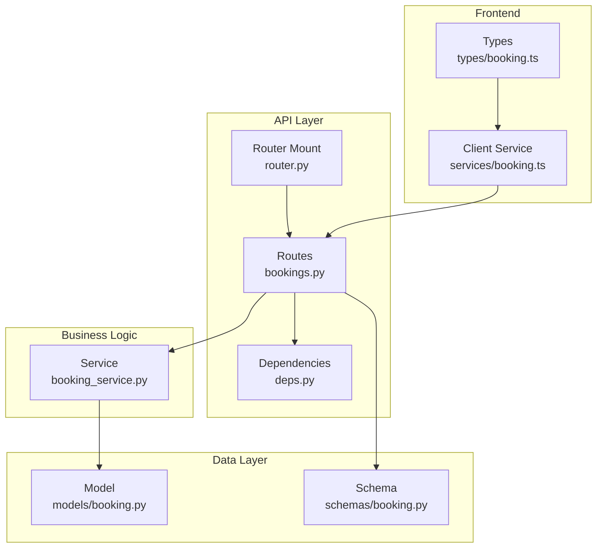
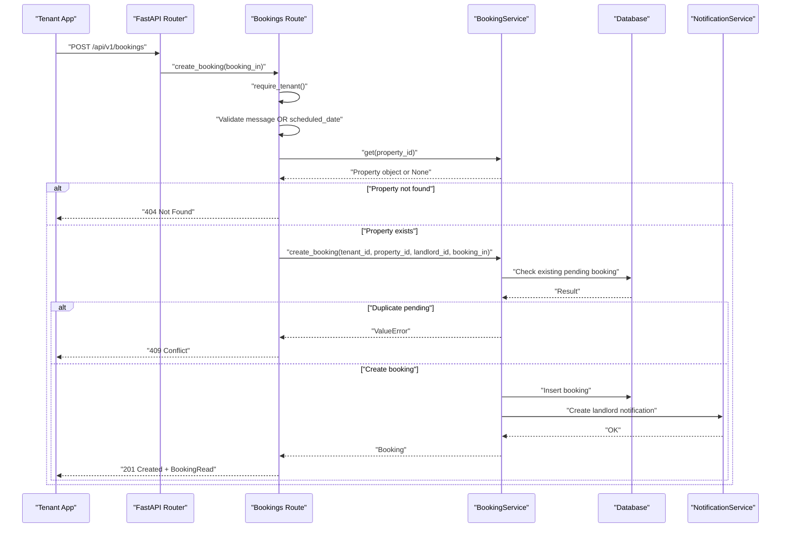
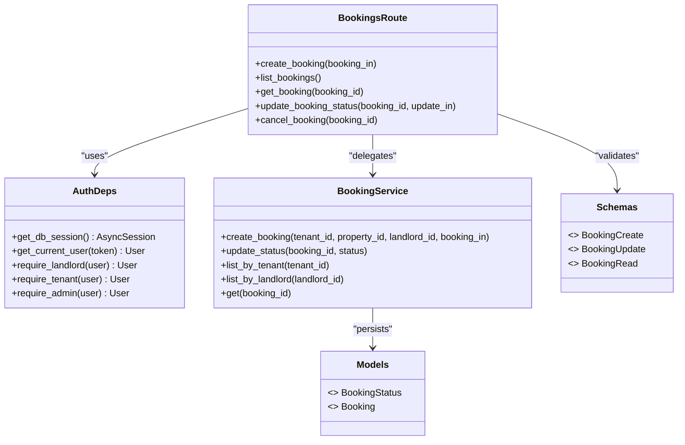
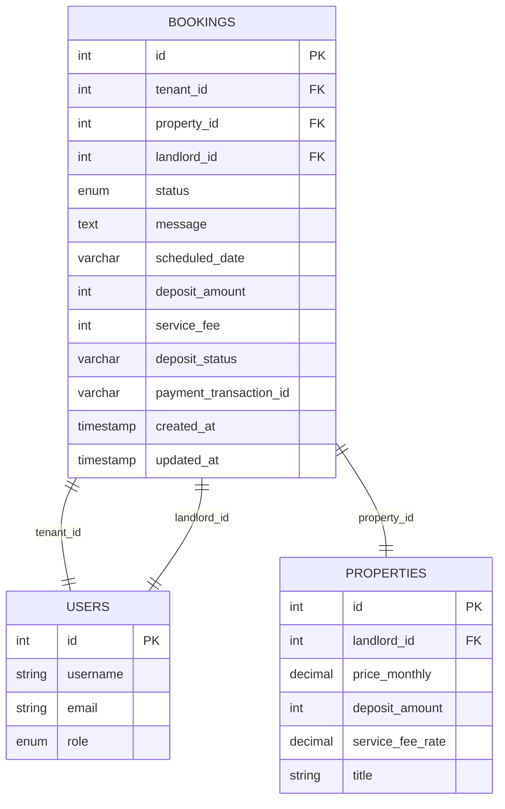

# Tenant Booking Operations

<cite>
**Referenced Files in This Document**
- [bookings.py](file://backend/app/api/v1/routes/bookings.py)
- [booking_service.py](file://backend/app/services/booking_service.py)
- [booking.py](file://backend/app/models/booking.py)
- [booking.py](file://backend/app/schemas/booking.py)
- [deps.py](file://backend/app/api/deps.py)
- [router.py](file://backend/app/api/v1/router.py)
- [test_bookings.py](file://backend/tests/test_bookings.py)
- [booking.ts](file://frontend/src/services/booking.ts)
- [booking.ts](file://frontend/src/types/booking.ts)
</cite>

## Table of Contents
1. [Introduction](#introduction)
2. [Project Structure](#project-structure)
3. [Core Components](#core-components)
4. [Architecture Overview](#architecture-overview)
5. [Detailed Component Analysis](#detailed-component-analysis)
6. [Dependency Analysis](#dependency-analysis)
7. [Performance Considerations](#performance-considerations)
8. [Troubleshooting Guide](#troubleshooting-guide)
9. [Conclusion](#conclusion)
10. [Appendices](#appendices)

## Introduction
This document provides detailed API documentation for tenant booking operations, focusing on:
- Creating new bookings via POST /api/v1/bookings with required fields and validation rules
- Retrieving a tenant’s booking history via GET /api/v1/bookings
- Cancelling a booking via PATCH /api/v1/bookings/{id}/cancel, including status transitions and notification behavior
- Request/response examples, error handling scenarios, and integration patterns for tenant-facing applications

The endpoints are implemented using FastAPI with Pydantic schemas, SQLAlchemy models, and role-based access control.

## Project Structure
The booking feature spans routes, services, schemas, models, dependencies, tests, and frontend client code. The router mounts the bookings module under the /api/v1 prefix.

**Diagram sources**
- [router.py:1-23](file://backend/app/api/v1/router.py#L1-L23)
- [bookings.py:1-112](file://backend/app/api/v1/routes/bookings.py#L1-L112)
- [booking_service.py:1-164](file://backend/app/services/booking_service.py#L1-L164)
- [booking.py:1-47](file://backend/app/models/booking.py#L1-L47)
- [booking.py:1-35](file://backend/app/schemas/booking.py#L1-L35)
- [deps.py:1-58](file://backend/app/api/deps.py#L1-L58)
- [booking.ts:1-25](file://frontend/src/services/booking.ts#L1-L25)
- [booking.ts:1-42](file://frontend/src/types/booking.ts#L1-L42)

**Section sources**
- [router.py:1-23](file://backend/app/api/v1/router.py#L1-L23)

## Core Components
- Routes (FastAPI): Define HTTP endpoints for creating, listing, retrieving, updating status, and cancelling bookings. Enforce authentication and authorization.
- Service: Encapsulates business logic such as duplicate pending booking checks, deposit/service fee calculation, persistence, and notifications.
- Schema: Pydantic models define request and response shapes and constraints.
- Model: SQLAlchemy model defines database schema and enum states.
- Dependencies: Authentication and role guards (tenant, landlord, admin).
- Frontend: TypeScript types and service methods that call the backend endpoints.

Key responsibilities:
- POST /api/v1/bookings: Validate inputs, ensure property exists, prevent duplicate pending bookings, compute deposit and service fee, persist booking, notify landlord, optionally send tenant confirmation message.
- GET /api/v1/bookings: Return all bookings for the current user; tenants see their own, landlords/admins see those they manage.
- PATCH /api/v1/bookings/{id}/cancel: Allow only the tenant or admin to cancel; transition to cancelled and notify landlord.

**Section sources**
- [bookings.py:14-41](file://backend/app/api/v1/routes/bookings.py#L14-L41)
- [bookings.py:44-52](file://backend/app/api/v1/routes/bookings.py#L44-L52)
- [bookings.py:96-111](file://backend/app/api/v1/routes/bookings.py#L96-L111)
- [booking_service.py:15-79](file://backend/app/services/booking_service.py#L15-L79)
- [booking_service.py:81-142](file://backend/app/services/booking_service.py#L81-L142)
- [booking_service.py:144-160](file://backend/app/services/booking_service.py#L144-L160)
- [booking.py:8-18](file://backend/app/schemas/booking.py#L8-L18)
- [booking.py:10-46](file://backend/app/models/booking.py#L10-L46)
- [deps.py:19-48](file://backend/app/api/deps.py#L19-L48)

## Architecture Overview
The booking flow uses layered architecture:
- Client calls REST endpoints
- Route handlers validate requests and enforce roles
- Service performs business rules and persists data
- Notifications are sent asynchronously where applicable

**Diagram sources**
- [bookings.py:14-41](file://backend/app/api/v1/routes/bookings.py#L14-L41)
- [booking_service.py:15-79](file://backend/app/services/booking_service.py#L15-L79)

## Detailed Component Analysis

### Endpoint: POST /api/v1/bookings
Purpose: Create a new booking request for a property by a tenant.

Authentication and Authorization:
- Requires authenticated tenant or admin.

Request Body (BookingCreate):
- property_id: integer, required
- message: string, optional, max length 2000
- scheduled_date: string, optional, max length 32

Validation Rules:
- At least one of message or scheduled_date must be provided.
- Property must exist; otherwise returns 404.
- Duplicate pending booking for the same tenant and property is rejected with 409.

Processing:
- Computes deposit_amount and service_fee based on property details if available.
- Persists booking with default status pending and deposit_status unpaid.
- Sends landlord notification about new booking request.
- Optionally sends tenant confirmation message via task queue.

Response:
- 201 Created with BookingRead object.

Error Responses:
- 400 Bad Request: Missing both message and scheduled_date.
- 401 Unauthorized: Invalid or missing token.
- 403 Forbidden: User is not tenant or admin.
- 404 Not Found: Property does not exist.
- 409 Conflict: Tenant already has a pending booking for this property.

Request Example:
- Content-Type: application/json
- Headers: Authorization: Bearer <token>
- Body: { "property_id": 123, "message": "I would like to view this property", "scheduled_date": "2026-07-01" }

Response Example:
- Status: 201
- Body: BookingRead object including id, tenant_id, property_id, landlord_id, status, message, scheduled_date, deposit_amount, service_fee, deposit_status, payment_transaction_id, created_at, updated_at.

Integration Notes:
- Ensure at least one of message or scheduled_date is set.
- Handle 409 by prompting the tenant to wait for approval or choose another property.
- Use returned deposit_amount and service_fee to guide subsequent payment flows.

**Section sources**
- [bookings.py:14-41](file://backend/app/api/v1/routes/bookings.py#L14-L41)
- [booking_service.py:15-79](file://backend/app/services/booking_service.py#L15-L79)
- [booking.py:8-18](file://backend/app/schemas/booking.py#L8-L18)
- [deps.py:42-48](file://backend/app/api/deps.py#L42-L48)
- [test_bookings.py:45-66](file://backend/tests/test_bookings.py#L45-L66)
- [test_bookings.py:106-117](file://backend/tests/test_bookings.py#L106-L117)

### Endpoint: GET /api/v1/bookings
Purpose: Retrieve booking history for the current user.

Authentication and Authorization:
- Requires authenticated user (tenant, landlord, or admin).

Behavior:
- If current user is landlord or admin: return bookings managed by them.
- Otherwise: return bookings belonging to the tenant.

Response:
- 200 OK with array of BookingRead objects.

Filtering Options:
- No query parameters are defined for filtering; all bookings for the current user are returned.

Request Example:
- Headers: Authorization: Bearer <token>

Response Example:
- Status: 200
- Body: Array of BookingRead objects sorted by creation time descending.

Integration Notes:
- For tenant apps, display the list ordered by most recent first.
- For landlord dashboards, use the same endpoint to show all bookings under their management.

**Section sources**
- [bookings.py:44-52](file://backend/app/api/v1/routes/bookings.py#L44-L52)
- [booking_service.py:144-160](file://backend/app/services/booking_service.py#L144-L160)
- [test_bookings.py:60-66](file://backend/tests/test_bookings.py#L60-L66)

### Endpoint: PATCH /api/v1/bookings/{id}/cancel
Purpose: Cancel an existing booking.

Authentication and Authorization:
- Requires authenticated tenant or admin.

Workflow:
- Verify booking exists.
- Verify caller is the tenant who owns the booking or an admin.
- Update booking status to cancelled.
- Send landlord notification about cancellation.

Status Transitions:
- Any non-terminal state can be transitioned to cancelled by the tenant or admin.
- The system sets status to cancelled and notifies the landlord.

Response:
- 200 OK with updated BookingRead object.

Error Responses:
- 401 Unauthorized: Invalid or missing token.
- 403 Forbidden: Caller is not the tenant or admin.
- 404 Not Found: Booking does not exist.

Request Example:
- Method: PATCH
- Path: /api/v1/bookings/{id}/cancel
- Headers: Authorization: Bearer <token>

Response Example:
- Status: 200
- Body: Updated BookingRead with status "cancelled".

Cancellation Policies:
- Tenants may cancel their own bookings at any time before completion.
- Admins may cancel on behalf of tenants.
- Landlords cannot cancel via this endpoint; they approve/reject via the status update endpoint.

**Section sources**
- [bookings.py:96-111](file://backend/app/api/v1/routes/bookings.py#L96-L111)
- [booking_service.py:81-142](file://backend/app/services/booking_service.py#L81-L142)
- [test_bookings.py:240-252](file://backend/tests/test_bookings.py#L240-L252)

### Additional Endpoints Relevant to Bookings

#### GET /api/v1/bookings/{booking_id}
- Returns a single booking if the caller is the tenant, landlord, or admin.
- Returns 404 if not found; 403 if access denied.

#### PATCH /api/v1/bookings/{booking_id}/status
- Allows landlord or admin to update status to approved or rejected.
- Validates allowed statuses and ownership.

These endpoints support the full lifecycle and are used by landlord workflows.

**Section sources**
- [bookings.py:55-68](file://backend/app/api/v1/routes/bookings.py#L55-L68)
- [bookings.py:71-93](file://backend/app/api/v1/routes/bookings.py#L71-L93)

## Dependency Analysis
Role-based access control and session management are centralized in dependencies.

**Diagram sources**
- [deps.py:14-58](file://backend/app/api/deps.py#L14-L58)
- [bookings.py:14-111](file://backend/app/api/v1/routes/bookings.py#L14-L111)
- [booking_service.py:11-164](file://backend/app/services/booking_service.py#L11-L164)
- [booking.py:10-46](file://backend/app/models/booking.py#L10-L46)
- [booking.py:8-35](file://backend/app/schemas/booking.py#L8-L35)

**Section sources**
- [deps.py:19-48](file://backend/app/api/deps.py#L19-L48)
- [bookings.py:14-111](file://backend/app/api/v1/routes/bookings.py#L14-L111)
- [booking_service.py:11-164](file://backend/app/services/booking_service.py#L11-L164)

## Performance Considerations
- Duplicate pending booking check uses a targeted query to avoid unnecessary scans.
- Deposit and service fee calculations are performed once per create operation.
- Notifications are created synchronously; background tasks are used for tenant confirmation messages to avoid blocking responses.
- Listing endpoints order results by created_at descending for efficient UI rendering.

[No sources needed since this section provides general guidance]

## Troubleshooting Guide
Common errors and resolutions:
- 400 Bad Request: Missing both message and scheduled_date. Provide at least one field.
- 401 Unauthorized: Token invalid or expired. Re-authenticate and retry.
- 403 Forbidden: Insufficient role. Ensure the user is tenant or admin for create/cancel; landlord/admin for status updates.
- 404 Not Found: Property or booking does not exist. Verify IDs and existence.
- 409 Conflict: Duplicate pending booking. Wait for landlord decision or choose another property.

Integration tips:
- Always include Authorization header with a valid bearer token.
- Handle 409 by informing the tenant that a pending booking already exists.
- After cancellation, refresh the booking list to reflect the updated status.

**Section sources**
- [bookings.py:20-28](file://backend/app/api/v1/routes/bookings.py#L20-L28)
- [bookings.py:62-68](file://backend/app/api/v1/routes/bookings.py#L62-L68)
- [bookings.py:89-93](file://backend/app/api/v1/routes/bookings.py#L89-L93)
- [bookings.py:104-111](file://backend/app/api/v1/routes/bookings.py#L104-L111)
- [deps.py:24-48](file://backend/app/api/deps.py#L24-L48)
- [test_bookings.py:256-264](file://backend/tests/test_bookings.py#L256-L264)

## Conclusion
The tenant booking API provides a clear and secure workflow for creating, viewing, and cancelling bookings. Validation ensures data integrity, while role-based access controls protect resources. Notifications keep stakeholders informed throughout the process. Tenant-facing applications should handle common error cases gracefully and follow the documented request/response formats.

[No sources needed since this section summarizes without analyzing specific files]

## Appendices

### Data Model: Booking

**Diagram sources**
- [booking.py:18-46](file://backend/app/models/booking.py#L18-L46)

### Frontend Integration Patterns
- Types: Use Booking and BookingCreate interfaces to type-check requests and responses.
- Service Methods:
  - create(data): POST /bookings
  - list(): GET /bookings
  - getById(id): GET /bookings/{id}
  - updateStatus(id, status): PATCH /bookings/{id}/status
  - cancel(id): PATCH /bookings/{id}/cancel

**Section sources**
- [booking.ts:4-24](file://frontend/src/services/booking.ts#L4-L24)
- [booking.ts:1-24](file://frontend/src/types/booking.ts#L1-L24)