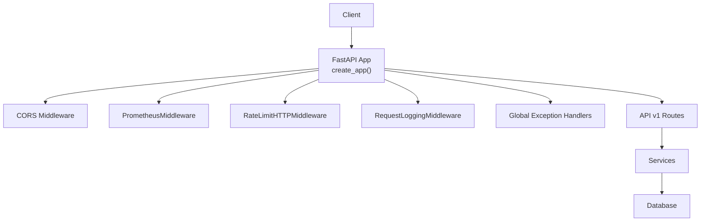
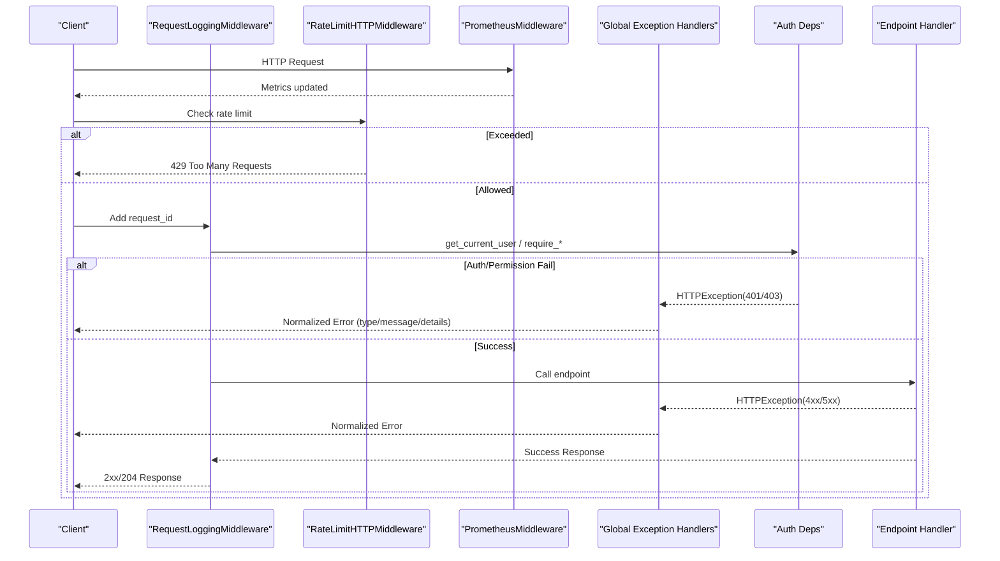
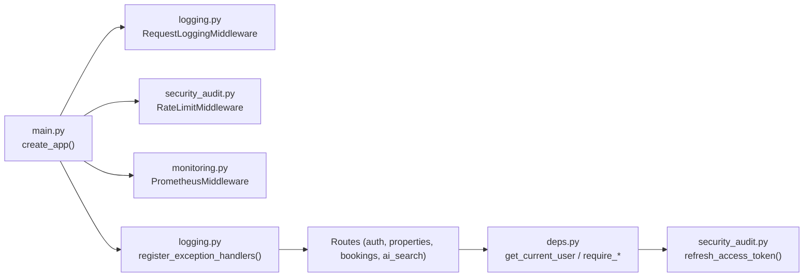

# Error Handling & Status Codes

<cite>
**Referenced Files in This Document**
- [main.py](file://backend/app/main.py)
- [logging.py](file://backend/app/core/logging.py)
- [security_audit.py](file://backend/app/core/security_audit.py)
- [deps.py](file://backend/app/api/deps.py)
- [auth.py](file://backend/app/api/v1/routes/auth.py)
- [properties.py](file://backend/app/api/v1/routes/properties.py)
- [bookings.py](file://backend/app/api/v1/routes/bookings.py)
- [ai_search.py](file://backend/app/api/v1/routes/ai_search.py)
- [monitoring.py](file://backend/app/core/monitoring.py)
</cite>

## Table of Contents
1. [Introduction](#introduction)
2. [Project Structure](#project-structure)
3. [Core Components](#core-components)
4. [Architecture Overview](#architecture-overview)
5. [Detailed Component Analysis](#detailed-component-analysis)
6. [Dependency Analysis](#dependency-analysis)
7. [Performance Considerations](#performance-considerations)
8. [Troubleshooting Guide](#troubleshooting-guide)
9. [Conclusion](#conclusion)

## Introduction
This document defines the API error handling strategy and status codes used across all endpoints. It standardizes HTTP responses, validation errors, authentication and authorization failures, rate limiting, service unavailability, and internal server errors. It also provides guidance on request IDs for debugging, logging strategies, and client-side best practices.

## Project Structure
Error handling is implemented centrally and applied consistently across routes:
- Global exception handlers normalize all errors into a consistent JSON structure.
- Middleware adds request IDs, logs requests/responses, and enforces rate limits.
- Route-level code raises HTTP exceptions with appropriate status codes and messages.
- Monitoring metrics capture request counts and latencies for observability.

**Diagram sources**
- [main.py:17-78](file://backend/app/main.py#L17-L78)
- [logging.py:124-167](file://backend/app/core/logging.py#L124-L167)
- [security_audit.py:49-94](file://backend/app/core/security_audit.py#L49-L94)
- [monitoring.py:126-159](file://backend/app/core/monitoring.py#L126-L159)

**Section sources**
- [main.py:17-78](file://backend/app/main.py#L17-L78)

## Core Components
- Global exception handlers convert FastAPI/Starlette exceptions into a unified error envelope.
- Validation errors are normalized to include message and location details.
- Authentication and authorization errors are raised via dependency functions.
- Rate limiting returns 429 with Retry-After header when exceeded.
- Service unavailability uses 503 or 502 where applicable.
- Internal server errors return 500 with a safe message.

Key behaviors:
- All errors follow a consistent response shape with type, message, and optional details.
- Request ID is attached to logs and can be surfaced in responses if needed by clients.
- Sensitive fields are masked in logs.

**Section sources**
- [logging.py:170-231](file://backend/app/core/logging.py#L170-L231)
- [deps.py:19-57](file://backend/app/api/deps.py#L19-L57)
- [security_audit.py:66-94](file://backend/app/core/security_audit.py#L66-L94)
- [ai_search.py:80-89](file://backend/app/api/v1/routes/ai_search.py#L80-L89)

## Architecture Overview
The request lifecycle includes middleware layers that log, measure, and enforce limits before reaching route handlers. Exceptions are caught globally and transformed into standardized responses.

**Diagram sources**
- [main.py:41-63](file://backend/app/main.py#L41-L63)
- [logging.py:124-167](file://backend/app/core/logging.py#L124-L167)
- [security_audit.py:66-94](file://backend/app/core/security_audit.py#L66-L94)
- [deps.py:19-57](file://backend/app/api/deps.py#L19-L57)
- [logging.py:226-231](file://backend/app/core/logging.py#L226-L231)

## Detailed Component Analysis

### Standard HTTP Status Codes
- 200 OK: Successful GET/PUT/PATCH operations returning data.
- 201 Created: Successful resource creation (e.g., register, create property, create booking).
- 204 No Content: Successful deletion without body.
- 400 Bad Request: Invalid request payload or business rule violation (e.g., missing required fields).
- 401 Unauthorized: Missing or invalid token; refresh token issues.
- 403 Forbidden: Insufficient permissions (role-based guards).
- 404 Not Found: Resource does not exist.
- 409 Conflict: Duplicate resources or state conflicts (e.g., existing username/email/phone, booking conflicts).
- 422 Unprocessable Entity: Pydantic validation errors or semantic input errors.
- 429 Too Many Requests: Rate limit exceeded with Retry-After header.
- 500 Internal Server Error: Unexpected server-side failure.
- 502/503: External service unavailable or gateway error.

Examples by feature:
- Authentication
  - Login success: 200 with tokens.
  - Register success: 201 with user object.
  - Invalid credentials: 401.
  - Duplicate registration: 409.
  - Refresh token invalid/expired: 401.
- Properties
  - Create property: 201 or 403/422 depending on ownership/validation.
  - Get/Update/Delete: 404 if not found; 403 if unauthorized.
- Bookings
  - Create booking: 201 or 400/404/409 based on inputs/state.
  - Update status/cancel: 400/403/404 as applicable.
- AI Search
  - External service down: 503 or 502.

**Section sources**
- [auth.py:13-34](file://backend/app/api/v1/routes/auth.py#L13-L34)
- [auth.py:36-60](file://backend/app/api/v1/routes/auth.py#L36-L60)
- [auth.py:63-89](file://backend/app/api/v1/routes/auth.py#L63-L89)
- [properties.py:16-33](file://backend/app/api/v1/routes/properties.py#L16-L33)
- [properties.py:110-162](file://backend/app/api/v1/routes/properties.py#L110-L162)
- [bookings.py:14-41](file://backend/app/api/v1/routes/bookings.py#L14-L41)
- [bookings.py:71-93](file://backend/app/api/v1/routes/bookings.py#L71-L93)
- [bookings.py:96-111](file://backend/app/api/v1/routes/bookings.py#L96-L111)
- [ai_search.py:80-89](file://backend/app/api/v1/routes/ai_search.py#L80-L89)

### Unified Error Response Schema
All errors are wrapped in a consistent envelope:
- error.type: String indicating error category (e.g., "validation_error", "http_error", "internal_error").
- error.message: Human-readable summary.
- error.details: Optional array of field-specific errors (for validation), each with msg and loc.

Notes:
- For validation errors, details contain structured entries describing each field issue.
- For HTTP exceptions, message reflects the original detail.
- For internal errors, message is generic to avoid leaking internals.

**Section sources**
- [logging.py:170-190](file://backend/app/core/logging.py#L170-L190)
- [logging.py:193-224](file://backend/app/core/logging.py#L193-L224)

### Authentication Errors
- Missing or invalid access token: 401 with WWW-Authenticate header.
- Incorrect login credentials: 401.
- Invalid or expired refresh token: 401.
- Token format errors during refresh: 401.

Best practices:
- Clients should treat 401 as “re-authenticate” and optionally attempt refresh flow.
- Store tokens securely and handle expiration proactively.

**Section sources**
- [deps.py:19-30](file://backend/app/api/deps.py#L19-L30)
- [auth.py:45-50](file://backend/app/api/v1/routes/auth.py#L45-L50)
- [auth.py:63-89](file://backend/app/api/v1/routes/auth.py#L63-L89)
- [security_audit.py:113-136](file://backend/app/core/security_audit.py#L113-L136)

### Authorization Errors
- Role-based guards raise 403 when the current user lacks required role.
- Ownership checks (e.g., landlord-only updates) raise 403.

Common scenarios:
- Tenant accessing landlord-only endpoints: 403.
- Landlord updating another’s property: 403.

**Section sources**
- [deps.py:33-57](file://backend/app/api/deps.py#L33-L57)
- [properties.py:28-32](file://backend/app/api/v1/routes/properties.py#L28-L32)
- [bookings.py:65-66](file://backend/app/api/v1/routes/bookings.py#L65-L66)

### Validation Errors
- Pydantic validation failures produce 422 with structured details.
- Semantic input checks may also return 422 or 400 depending on context.

Typical details include:
- Field path (loc) and human-readable message (msg).

**Section sources**
- [logging.py:193-201](file://backend/app/core/logging.py#L193-L201)
- [properties.py:24-27](file://backend/app/api/v1/routes/properties.py#L24-L27)
- [bookings.py:20-24](file://backend/app/api/v1/routes/bookings.py#L20-L24)

### Rate Limiting Responses
- When exceeding configured limits, the API returns 429 with Retry-After header.
- The window and max requests are configurable via settings.

Client behavior:
- Respect Retry-After and implement exponential backoff.

**Section sources**
- [security_audit.py:66-94](file://backend/app/core/security_audit.py#L66-L94)

### Service Unavailability
- External dependencies failing result in 503 or 502.
- These indicate temporary conditions; clients should retry with backoff.

**Section sources**
- [ai_search.py:80-89](file://backend/app/api/v1/routes/ai_search.py#L80-L89)

### Internal Server Errors
- Any unhandled exception results in 500 with a safe message.
- Full stack traces are logged but not exposed to clients.

**Section sources**
- [logging.py:216-224](file://backend/app/core/logging.py#L216-L224)

### Example Error Scenarios
- Registration conflict: 409 with message indicating duplicate username/email/phone.
- Booking creation with missing fields: 400 with message specifying requirements.
- Property not found: 404 with message indicating resource absence.
- Access denied to tenant-only endpoint: 403 with permission message.
- Rate limit exceeded: 429 with Retry-After seconds.
- AI search service down: 503 or 502 with descriptive message.

**Section sources**
- [auth.py:30-34](file://backend/app/api/v1/routes/auth.py#L30-L34)
- [bookings.py:20-24](file://backend/app/api/v1/routes/bookings.py#L20-L24)
- [properties.py:116-118](file://backend/app/api/v1/routes/properties.py#L116-L118)
- [bookings.py:65-66](file://backend/app/api/v1/routes/bookings.py#L65-L66)
- [security_audit.py:83-94](file://backend/app/core/security_audit.py#L83-L94)
- [ai_search.py:80-89](file://backend/app/api/v1/routes/ai_search.py#L80-L89)

### Debugging with Request IDs
- Each request receives a unique request_id attached to logs.
- Use this ID to correlate client errors with server logs.
- Logs include method, path, status_code, duration_ms, and client IP.

Operational tips:
- Include request_id in client error logs and support tickets.
- Filter logs by request_id to trace full lifecycle.

**Section sources**
- [logging.py:124-167](file://backend/app/core/logging.py#L124-L167)

### Logging Strategies
- Structured JSON logs in production; colored console logs in development.
- Sensitive fields are masked automatically.
- Request/response middleware records key metadata and durations.
- Prometheus metrics track request counts, latency, and in-flight requests.

Integration points:
- Centralized setup ensures consistent formatting and levels.
- Third-party noisy loggers are suppressed in production.

**Section sources**
- [logging.py:77-101](file://backend/app/core/logging.py#L77-L101)
- [logging.py:103-122](file://backend/app/core/logging.py#L103-L122)
- [monitoring.py:126-159](file://backend/app/core/monitoring.py#L126-L159)

### Client-Side Error Handling Best Practices
- Normalize responses using the unified error envelope.
- Handle 401 by attempting refresh or prompting re-login.
- Handle 403 by redirecting or showing insufficient permissions UI.
- Handle 422 by displaying field-specific messages from details.
- Handle 429 by honoring Retry-After and implementing backoff.
- Handle 5xx by retrying with jitter and surfacing user-friendly messages.
- Log request_id from server errors for support.

[No sources needed since this section provides general guidance]

## Dependency Analysis
The following diagram shows how components depend on each other for error handling and observability.

**Diagram sources**
- [main.py:41-63](file://backend/app/main.py#L41-L63)
- [logging.py:226-231](file://backend/app/core/logging.py#L226-L231)
- [deps.py:19-57](file://backend/app/api/deps.py#L19-L57)
- [security_audit.py:139-149](file://backend/app/core/security_audit.py#L139-L149)

**Section sources**
- [main.py:41-63](file://backend/app/main.py#L41-L63)
- [logging.py:226-231](file://backend/app/core/logging.py#L226-L231)
- [deps.py:19-57](file://backend/app/api/deps.py#L19-L57)

## Performance Considerations
- Rate limiting protects backend stability under high load.
- Prometheus metrics enable monitoring of latency and error rates.
- Avoid excessive logging in hot paths; rely on structured logs and sampling if needed.
- Use pagination and query constraints to prevent heavy payloads.

[No sources needed since this section provides general guidance]

## Troubleshooting Guide
- Identify the request_id from the client error and search logs for it.
- Check status code categories:
  - 4xx: Client-side issues (input, auth, permissions).
  - 5xx: Server-side issues (external services, unexpected exceptions).
- For 429, honor Retry-After and reduce request frequency.
- For 401/403, verify token validity and user roles.
- For 422, inspect details to correct specific fields.
- For 503/502, retry later and check external service health.

**Section sources**
- [logging.py:124-167](file://backend/app/core/logging.py#L124-L167)
- [security_audit.py:83-94](file://backend/app/core/security_audit.py#L83-L94)
- [logging.py:193-224](file://backend/app/core/logging.py#L193-L224)

## Conclusion
This API enforces consistent error handling through centralized exception handlers and middleware. All responses follow a uniform schema, making client integration predictable. Authentication and authorization are enforced via dependency functions, while rate limiting and metrics provide operational resilience. Developers should leverage request IDs for debugging and adopt robust client-side error handling patterns.