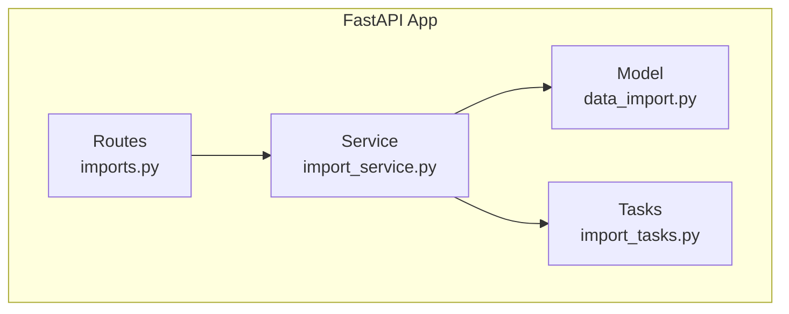
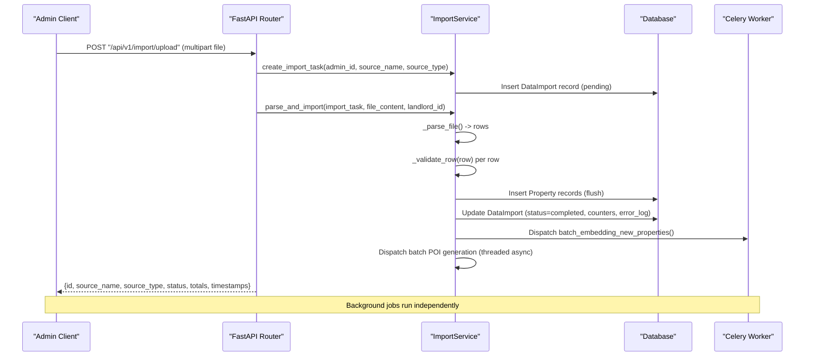
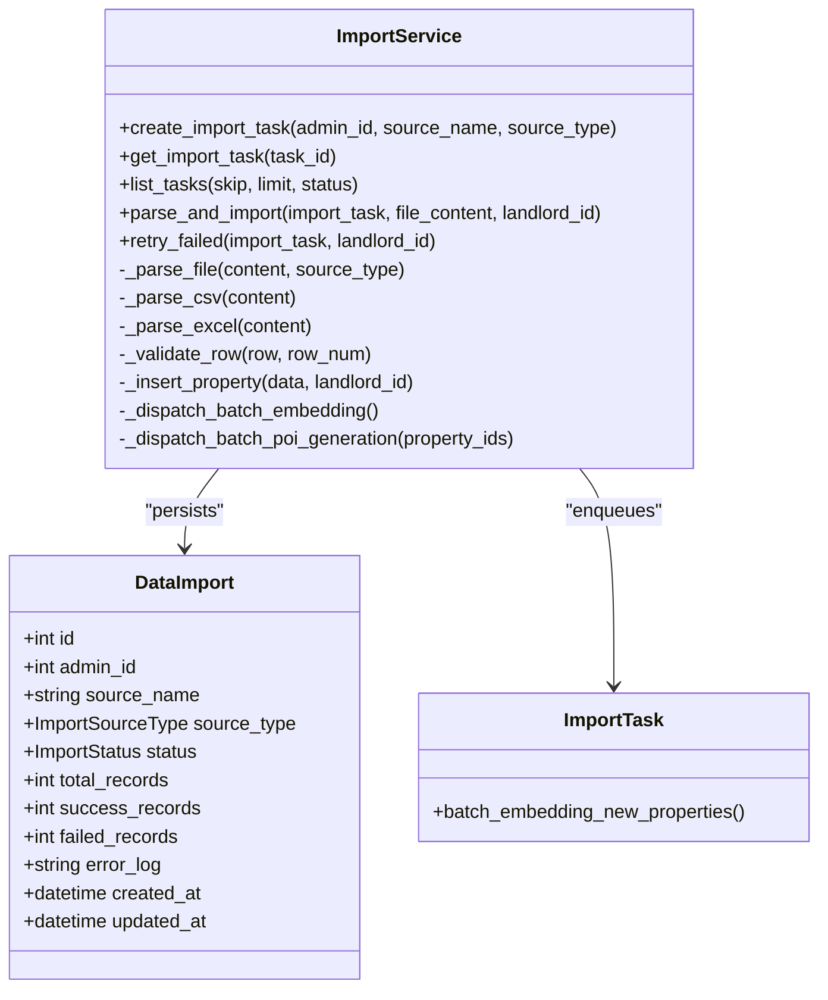

# Import & Export APIs

<cite>
**Referenced Files in This Document**
- [imports.py](file://backend/app/api/v1/routes/imports.py)
- [import_service.py](file://backend/app/services/import_service.py)
- [data_import.py](file://backend/app/models/data_import.py)
- [import_tasks.py](file://backend/app/tasks/import_tasks.py)
- [router.py](file://backend/app/api/v1/router.py)
- [test_import.py](file://backend/tests/test_import.py)
</cite>

## Table of Contents
1. [Introduction](#introduction)
2. [Project Structure](#project-structure)
3. [Core Components](#core-components)
4. [Architecture Overview](#architecture-overview)
5. [Detailed Component Analysis](#detailed-component-analysis)
6. [Dependency Analysis](#dependency-analysis)
7. [Performance Considerations](#performance-considerations)
8. [Troubleshooting Guide](#troubleshooting-guide)
9. [Conclusion](#conclusion)
10. [Appendices](#appendices)

## Introduction
This document provides detailed API documentation for data import functionality and clarifies the current status of export capabilities. The system supports bulk data import via file uploads (CSV and Excel), import job management, progress tracking, validation rules, error reporting, and retry mechanisms. It also documents asynchronous batch processing for embedding generation and POI generation triggered after successful imports.

Export endpoints for generating reports or data dumps are not implemented in the current codebase; this section notes their absence and suggests future directions.

## Project Structure
The import feature is implemented under the FastAPI application with a clear separation between routes, services, models, and tasks:

- Routes: HTTP endpoints for upload, listing, detail retrieval, and retry operations.
- Service: Business logic for parsing files, validating rows, inserting properties, and dispatching background tasks.
- Model: Database schema for import task tracking.
- Tasks: Celery-based background jobs for batch embedding generation.

**Diagram sources**
- [imports.py:1-194](file://backend/app/api/v1/routes/imports.py#L1-L194)
- [import_service.py:1-403](file://backend/app/services/import_service.py#L1-L403)
- [data_import.py:1-53](file://backend/app/models/data_import.py#L1-L53)
- [import_tasks.py:1-44](file://backend/app/tasks/import_tasks.py#L1-L44)

**Section sources**
- [router.py:1-23](file://backend/app/api/v1/router.py#L1-L23)

## Core Components
- Upload endpoint: POST /api/v1/import/upload
  - Accepts multipart/form-data with a single file field named "file".
  - Supports CSV (.csv) and Excel (.xlsx, .xls).
  - Enforces maximum file size of 10 MB.
  - Requires admin authentication.
  - Returns an import task object including id, source_name, source_type, status, total_records, success_records, failed_records, and created_at.

- List tasks endpoint: GET /api/v1/import/tasks
  - Lists import tasks with pagination (skip, limit) and optional filtering by status.
  - Requires admin authentication.

- Task detail endpoint: GET /api/v1/import/tasks/{task_id}
  - Returns full details including error_log (JSON array of row-level errors when present).
  - Requires admin authentication.

- Retry endpoint: POST /api/v1/import/tasks/{task_id}/retry
  - Re-attempts only previously failed rows recorded in error_log.
  - Requires admin authentication.

Supported file formats:
- CSV: UTF-8 with optional BOM; headers normalized to lowercase and trimmed.
- Excel: Active sheet parsed using openpyxl; headers normalized similarly.

Data validation rules:
- Required fields: title, address, district, price_monthly.
- Optional fields: description, area_sqm, bedrooms, bathrooms, property_type, latitude, longitude, status.
- Validation constraints include non-negative price, positive area, integer counts, enum values for property_type and status, and coordinate ranges.

Error reporting:
- Row-level errors captured as JSON entries with row number and error message.
- Global errors (e.g., no data rows found) stored in error_log.

Asynchronous processing:
- After successful insertions, the service triggers:
  - Batch embedding generation for new properties via Celery.
  - Batch POI generation for imported properties.

**Section sources**
- [imports.py:1-194](file://backend/app/api/v1/routes/imports.py#L1-L194)
- [import_service.py:1-403](file://backend/app/services/import_service.py#L1-L403)
- [data_import.py:1-53](file://backend/app/models/data_import.py#L1-L53)
- [import_tasks.py:1-44](file://backend/app/tasks/import_tasks.py#L1-L44)

## Architecture Overview
The import workflow involves synchronous request handling followed by asynchronous background tasks:

**Diagram sources**
- [imports.py:39-91](file://backend/app/api/v1/routes/imports.py#L39-L91)
- [import_service.py:77-136](file://backend/app/services/import_service.py#L77-L136)
- [import_tasks.py:13-43](file://backend/app/tasks/import_tasks.py#L13-L43)

## Detailed Component Analysis

### Upload Endpoint: POST /api/v1/import/upload
- Authentication: Admin-only via require_admin dependency.
- File validation:
  - Filename must be provided.
  - Allowed extensions: .csv, .xlsx, .xls.
  - Maximum file size: 10 MB.
- Processing:
  - Creates an import task record.
  - Parses file content into rows.
  - Validates each row against required and optional fields.
  - Inserts valid rows into the database.
  - Updates task counters and status.
  - Stores row-level errors in error_log if any.
  - Triggers background tasks for embeddings and POIs.

Response fields:
- id: Import task identifier.
- source_name: Original filename.
- source_type: "csv" or "excel".
- status: "pending", "processing", "completed", or "failed".
- total_records: Number of rows parsed.
- success_records: Successfully inserted rows.
- failed_records: Rows that failed validation or insertion.
- created_at: ISO timestamp.

Error responses:
- 400 Bad Request: Unsupported file type or file too large.
- 401 Unauthorized: Missing or invalid token.
- 403 Forbidden: Non-admin user.

Example request structure:
- Content-Type: multipart/form-data
- Field name: file
- Supported types: text/csv, application/vnd.openxmlformats-officedocument.spreadsheetml.sheet, application/vnd.ms-excel

Example response body:
- JSON object containing the fields listed above.

**Section sources**
- [imports.py:17-91](file://backend/app/api/v1/routes/imports.py#L17-L91)
- [test_import.py:44-77](file://backend/tests/test_import.py#L44-L77)

### List Tasks Endpoint: GET /api/v1/import/tasks
- Query parameters:
  - skip: int >= 0 (default 0)
  - limit: int between 1 and 200 (default 50)
  - status: optional filter by status string
- Response: Array of task summaries including id, admin_id, source_name, source_type, status, totals, and created_at.

**Section sources**
- [imports.py:94-118](file://backend/app/api/v1/routes/imports.py#L94-L118)
- [test_import.py:173-211](file://backend/tests/test_import.py#L173-L211)

### Task Detail Endpoint: GET /api/v1/import/tasks/{task_id}
- Returns full task details including error_log (parsed from JSON when present).
- Error cases:
  - 404 Not Found: Task does not exist.

**Section sources**
- [imports.py:121-152](file://backend/app/api/v1/routes/imports.py#L121-L152)
- [test_import.py:214-251](file://backend/tests/test_import.py#L214-L251)

### Retry Endpoint: POST /api/v1/import/tasks/{task_id}/retry
- Behavior:
  - Only allowed when task status is "completed" or "failed".
  - Re-processes rows recorded in error_log.
  - Updates success/failure counters and clears or updates error_log accordingly.
  - Triggers background tasks if new successes occur.
- Error cases:
  - 404 Not Found: Task does not exist.
  - 400 Bad Request: Invalid status for retry.

**Section sources**
- [imports.py:155-193](file://backend/app/api/v1/routes/imports.py#L155-L193)
- [test_import.py:341-375](file://backend/tests/test_import.py#L341-L375)

### Import Service: Parsing and Validation
- File parsing:
  - CSV: Decodes UTF-8 with optional BOM; normalizes header keys to lowercase and trims whitespace.
  - Excel: Uses openpyxl; reads active sheet; normalizes headers similarly.
- Validation rules:
  - Required fields: title, address, district, price_monthly.
  - Optional fields: description, area_sqm, bedrooms, bathrooms, property_type, latitude, longitude, status.
  - Constraints:
    - price_monthly: Decimal, non-negative.
    - area_sqm: Decimal, positive if provided.
    - bedrooms/bathrooms: Integer, non-negative if provided.
    - property_type/status: Must match predefined enums.
    - latitude/longitude: Decimal within geographic ranges if both provided.
- Deduplication:
  - Prevents duplicate properties based on title + address combination.
- Background tasks:
  - Batch embedding generation enqueued via Celery.
  - Batch POI generation executed asynchronously in a separate thread.

**Section sources**
- [import_service.py:187-231](file://backend/app/services/import_service.py#L187-L231)
- [import_service.py:233-323](file://backend/app/services/import_service.py#L233-L323)
- [import_service.py:325-356](file://backend/app/services/import_service.py#L325-L356)
- [import_service.py:357-402](file://backend/app/services/import_service.py#L357-L402)

### Data Import Model: DataImport
- Fields:
  - id: Primary key.
  - admin_id: Foreign key to users table.
  - source_name: Original file name.
  - source_type: Enum (csv, excel, api).
  - status: Enum (pending, processing, completed, failed).
  - total_records, success_records, failed_records: Counters.
  - error_log: JSON text storing row-level errors.
  - created_at, updated_at: Timestamps.

**Section sources**
- [data_import.py:10-53](file://backend/app/models/data_import.py#L10-L53)

### Celery Task: Batch Embedding Generation
- Task name: batch_embedding_new_properties
- Behavior:
  - Queries properties without embeddings.
  - Enqueues individual embedding generation tasks for each property.
  - Configured with autoretry and backoff, max retries set to 3.

**Section sources**
- [import_tasks.py:13-43](file://backend/app/tasks/import_tasks.py#L13-L43)

## Dependency Analysis
The import module depends on:
- FastAPI router configuration mounting the import routes under /api/v1/import.
- SQLAlchemy async session for database operations.
- Pydantic-like validation handled within the service layer.
- Celery for background embedding tasks.
- openpyxl for Excel parsing (optional dependency raised at runtime if missing).

**Diagram sources**
- [import_service.py:34-184](file://backend/app/services/import_service.py#L34-L184)
- [data_import.py:23-53](file://backend/app/models/data_import.py#L23-L53)
- [import_tasks.py:13-43](file://backend/app/tasks/import_tasks.py#L13-L43)

**Section sources**
- [router.py:15](file://backend/app/api/v1/router.py#L15)
- [import_service.py:1-403](file://backend/app/services/import_service.py#L1-L403)
- [data_import.py:1-53](file://backend/app/models/data_import.py#L1-L53)
- [import_tasks.py:1-44](file://backend/app/tasks/import_tasks.py#L1-L44)

## Performance Considerations
- File size limit: 10 MB enforced at the route level.
- Parsing complexity: O(n) for CSV/Excel where n is number of rows.
- Validation complexity: O(n) with constant-time checks per row.
- Database writes: Flush after each insertion; transaction boundaries managed by service commits.
- Background tasks: Asynchronous embedding and POI generation decouple heavy work from request-response path.
- Potential bottlenecks:
  - Large Excel files may consume memory due to openpyxl read_only mode usage.
  - High volume of validations and inserts can increase DB load.
- Recommendations:
  - Consider chunked processing for very large files.
  - Add rate limiting and queue depth controls for background tasks.
  - Monitor Celery worker health and scaling.

[No sources needed since this section provides general guidance]

## Troubleshooting Guide
Common issues and resolutions:
- Unsupported file type: Ensure file extension is .csv, .xlsx, or .xls.
- File too large: Reduce file size below 10 MB.
- Missing required fields: Include title, address, district, price_monthly in every row.
- Invalid price_monthly: Provide a valid numeric value; ensure it is non-negative.
- Duplicate property: Avoid rows with identical title and address combinations.
- Openpyxl not installed: Install openpyxl to enable Excel import.
- Task not found: Verify task_id exists before querying detail or retry.
- Retry not allowed: Only retry tasks with status "completed" or "failed".

Error response examples:
- 400 Bad Request: Unsupported file type or file too large.
- 401 Unauthorized: Missing or invalid JWT token.
- 403 Forbidden: User lacks admin role.
- 404 Not Found: Import task does not exist.

Validation error format:
- error_log contains an array of objects with fields:
  - row: Row number (1-based).
  - error: Human-readable error message.
  - data: Original row data (when available during retry).

Progress update format:
- Status transitions: pending → processing → completed (or failed).
- Counters updated after processing: total_records, success_records, failed_records.
- Timestamps: created_at and updated_at reflect lifecycle changes.

**Section sources**
- [imports.py:17-91](file://backend/app/api/v1/routes/imports.py#L17-L91)
- [import_service.py:87-136](file://backend/app/services/import_service.py#L87-L136)
- [test_import.py:147-169](file://backend/tests/test_import.py#L147-L169)

## Conclusion
The import API provides robust bulk data ingestion with comprehensive validation, error reporting, and retry capabilities. Asynchronous background tasks enhance performance by offloading embedding and POI generation. Export endpoints are not currently implemented; consider adding report generation and data dump features in future iterations.

[No sources needed since this section summarizes without analyzing specific files]

## Appendices

### API Endpoints Summary
- POST /api/v1/import/upload
  - Description: Upload CSV/Excel file for bulk import.
  - Auth: Admin required.
  - Max file size: 10 MB.
  - Response: Import task summary.

- GET /api/v1/import/tasks
  - Description: List import tasks with pagination and optional status filter.
  - Auth: Admin required.
  - Response: Array of task summaries.

- GET /api/v1/import/tasks/{task_id}
  - Description: Retrieve detailed import task information including error_log.
  - Auth: Admin required.
  - Response: Task detail object.

- POST /api/v1/import/tasks/{task_id}/retry
  - Description: Retry previously failed rows for a given task.
  - Auth: Admin required.
  - Response: Updated task summary.

### Data Models
- DataImport fields: id, admin_id, source_name, source_type, status, total_records, success_records, failed_records, error_log, created_at, updated_at.

### Example Import File Structures
- CSV header example:
  - title,address,district,price_monthly,bedrooms,bathrooms,property_type,status,area_sqm,latitude,longitude,description
- Excel: Same column names in the first row of the active sheet.

### Validation Rules Reference
- Required: title, address, district, price_monthly.
- Optional: description, area_sqm, bedrooms, bathrooms, property_type, latitude, longitude, status.
- Constraints:
  - price_monthly: Decimal, non-negative.
  - area_sqm: Decimal, positive if provided.
  - bedrooms/bathrooms: Integer, non-negative if provided.
  - property_type/status: Enum values.
  - latitude/longitude: Decimal within geographic ranges if both provided.

### Error Reporting Examples
- Row-level error entry:
  - {"row": 3, "error": "Invalid price_monthly: ..."}
- Global error entry:
  - {"row": 0, "error": "No data rows found in file"}

### Progress Tracking
- Poll GET /api/v1/import/tasks/{task_id} to monitor status and counters.
- Use error_log to diagnose failures and retry via POST /api/v1/import/tasks/{task_id}/retry.

### Scheduled Imports and Batch Processing
- No scheduled import endpoints are implemented in the current codebase.
- Batch processing occurs asynchronously:
  - Batch embedding generation via Celery task.
  - Batch POI generation via threaded async execution.

### Export Endpoints
- Not implemented in the current codebase.
- Future considerations:
  - Report generation endpoints (e.g., GET /api/v1/export/properties?format=csv).
  - Data dump endpoints with pagination and filters.
  - Export job management similar to import tasks.

**Section sources**
- [imports.py:1-194](file://backend/app/api/v1/routes/imports.py#L1-L194)
- [import_service.py:1-403](file://backend/app/services/import_service.py#L1-L403)
- [data_import.py:1-53](file://backend/app/models/data_import.py#L1-L53)
- [import_tasks.py:1-44](file://backend/app/tasks/import_tasks.py#L1-L44)
- [test_import.py:1-376](file://backend/tests/test_import.py#L1-L376)