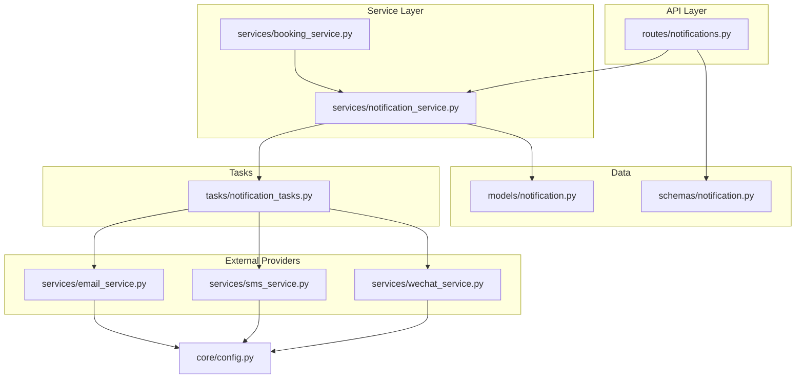
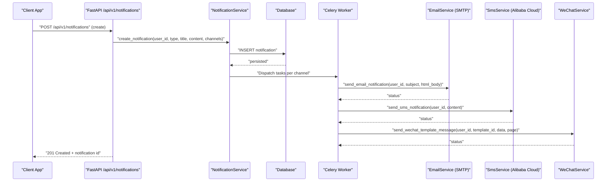
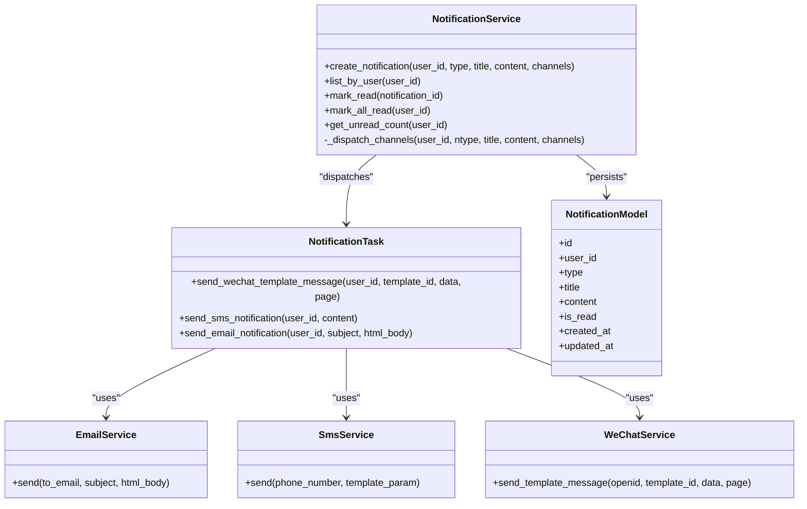

# Notification Services

<cite>
**Referenced Files in This Document**
- [notifications.py](file://backend/app/api/v1/routes/notifications.py)
- [notification_service.py](file://backend/app/services/notification_service.py)
- [notification_tasks.py](file://backend/app/tasks/notification_tasks.py)
- [email_service.py](file://backend/app/services/email_service.py)
- [sms_service.py](file://backend/app/services/sms_service.py)
- [wechat_service.py](file://backend/app/services/wechat_service.py)
- [notification.py](file://backend/app/models/notification.py)
- [notification_schema.py](file://backend/app/schemas/notification.py)
- [booking_service.py](file://backend/app/services/booking_service.py)
- [config.py](file://backend/app/core/config.py)
- [test_notifications.py](file://backend/tests/test_notifications.py)
</cite>

## Table of Contents
1. [Introduction](#introduction)
2. [Project Structure](#project-structure)
3. [Core Components](#core-components)
4. [Architecture Overview](#architecture-overview)
5. [Detailed Component Analysis](#detailed-component-analysis)
6. [Dependency Analysis](#dependency-analysis)
7. [Performance Considerations](#performance-considerations)
8. [Troubleshooting Guide](#troubleshooting-guide)
9. [Conclusion](#conclusion)
10. [Appendices](#appendices)

## Introduction
This document provides comprehensive API documentation for the notification services, including:
- In-app notification management endpoints
- Email notifications via SMTP
- SMS alerts through Alibaba Cloud
- WeChat template message delivery (in-app center and push channels)
- Notification types, delivery status tracking, retry mechanisms
- Rate limiting configuration, template customization, and batching guidance

The system persists notifications in a database and dispatches them asynchronously to multiple channels using Celery tasks.

## Project Structure
Notification-related components are organized by layer:
- API routes expose REST endpoints for listing and managing in-app notifications
- Service layer encapsulates business logic and channel dispatching
- Tasks define asynchronous workers for external integrations
- Services implement external providers (SMTP, Alibaba Cloud SMS, WeChat)
- Models and schemas define data structures and validation
- Configuration centralizes provider settings and rate limits

**Diagram sources**
- [notifications.py:1-50](file://backend/app/api/v1/routes/notifications.py#L1-L50)
- [notification_service.py:1-164](file://backend/app/services/notification_service.py#L1-L164)
- [notification_tasks.py:1-217](file://backend/app/tasks/notification_tasks.py#L1-L217)
- [email_service.py:1-76](file://backend/app/services/email_service.py#L1-L76)
- [sms_service.py:1-96](file://backend/app/services/sms_service.py#L1-L96)
- [wechat_service.py:1-146](file://backend/app/services/wechat_service.py#L1-L146)
- [notification.py:1-36](file://backend/app/models/notification.py#L1-L36)
- [notification_schema.py:1-23](file://backend/app/schemas/notification.py#L1-L23)
- [booking_service.py:1-164](file://backend/app/services/booking_service.py#L1-L164)
- [config.py:1-167](file://backend/app/core/config.py#L1-L167)

**Section sources**
- [notifications.py:1-50](file://backend/app/api/v1/routes/notifications.py#L1-L50)
- [notification_service.py:1-164](file://backend/app/services/notification_service.py#L1-L164)
- [notification_tasks.py:1-217](file://backend/app/tasks/notification_tasks.py#L1-L217)
- [email_service.py:1-76](file://backend/app/services/email_service.py#L1-L76)
- [sms_service.py:1-96](file://backend/app/services/sms_service.py#L1-L96)
- [wechat_service.py:1-146](file://backend/app/services/wechat_service.py#L1-L146)
- [notification.py:1-36](file://backend/app/models/notification.py#L1-L36)
- [notification_schema.py:1-23](file://backend/app/schemas/notification.py#L1-L23)
- [booking_service.py:1-164](file://backend/app/services/booking_service.py#L1-L164)
- [config.py:1-167](file://backend/app/core/config.py#L1-L167)

## Core Components
- API Endpoints
  - List notifications for current user
  - Mark a specific notification as read
  - Mark all notifications as read
  - Get unread count
- Notification Service
  - Create notification record and dispatch to channels
  - Query and update read state
  - Compute unread counts
- Celery Tasks
  - Send WeChat template messages
  - Send SMS via Alibaba Cloud
  - Send email via SMTP
- External Provider Services
  - EmailService: SMTP sending with TLS support
  - SmsService: Alibaba Cloud SMS signing and request
  - WeChatService: Access token caching and template messaging
- Data Model and Schema
  - Notification model with type enum and read flag
  - Pydantic schemas for responses

Key behaviors:
- Channel dispatch is fire-and-forget; failures are logged but do not block DB writes
- Each task supports auto-retry with backoff and max retries
- Unread count and list operations are scoped to the authenticated user

**Section sources**
- [notifications.py:1-50](file://backend/app/api/v1/routes/notifications.py#L1-L50)
- [notification_service.py:1-164](file://backend/app/services/notification_service.py#L1-L164)
- [notification_tasks.py:1-217](file://backend/app/tasks/notification_tasks.py#L1-L217)
- [email_service.py:1-76](file://backend/app/services/email_service.py#L1-L76)
- [sms_service.py:1-96](file://backend/app/services/sms_service.py#L1-L96)
- [wechat_service.py:1-146](file://backend/app/services/wechat_service.py#L1-L146)
- [notification.py:1-36](file://backend/app/models/notification.py#L1-L36)
- [notification_schema.py:1-23](file://backend/app/schemas/notification.py#L1-L23)

## Architecture Overview
End-to-end flow for creating and delivering notifications:

**Diagram sources**
- [notifications.py:1-50](file://backend/app/api/v1/routes/notifications.py#L1-L50)
- [notification_service.py:43-69](file://backend/app/services/notification_service.py#L43-L69)
- [notification_tasks.py:53-97](file://backend/app/tasks/notification_tasks.py#L53-L97)
- [email_service.py:17-58](file://backend/app/services/email_service.py#L17-L58)
- [sms_service.py:41-95](file://backend/app/services/sms_service.py#L41-L95)
- [wechat_service.py:90-119](file://backend/app/services/wechat_service.py#L90-L119)

## Detailed Component Analysis

### API Endpoints
Base path: /api/v1/notifications

- GET /api/v1/notifications
  - Description: List notifications for the authenticated user
  - Authentication: Required (Bearer token)
  - Response: Array of NotificationRead objects
  - Notes: Ordered by creation time descending

- PATCH /api/v1/notifications/{notification_id}/read
  - Description: Mark a single notification as read
  - Authentication: Required
  - Response: Updated NotificationRead object
  - Errors: 404 if not found; 403 if not owned by current user

- PATCH /api/v1/notifications/read-all
  - Description: Mark all notifications for the current user as read
  - Authentication: Required
  - Response: Success message

- GET /api/v1/notifications/unread-count
  - Description: Get unread notification count for the current user
  - Authentication: Required
  - Response: UnreadCount object with integer count

Notes on missing endpoints:
- POST /api/v1/notifications: Not implemented in the current routes file. Notifications are created programmatically via NotificationService from domain services (e.g., booking flows).
- GET/PUT /api/v1/notifications/preferences: Not implemented in the current codebase. Preferences can be modeled and added later.

Example responses (based on schema):
- NotificationRead fields include id, user_id, type, title, content, is_read, created_at, updated_at
- UnreadCount includes count

**Section sources**
- [notifications.py:12-49](file://backend/app/api/v1/routes/notifications.py#L12-L49)
- [notification_schema.py:8-23](file://backend/app/schemas/notification.py#L8-L23)
- [test_notifications.py:49-141](file://backend/tests/test_notifications.py#L49-L141)

### Notification Creation and Management
- Programmatic creation
  - Use NotificationService.create_notification to persist a notification and dispatch channels
  - Channels parameter accepts a subset or all of ["wechat", "sms", "email"]; defaults to all three
  - Dispatch uses Celery tasks; failures are logged and do not block persistence

- Read management
  - Mark individual or all notifications as read
  - Unread count computed efficiently via aggregation query

- Integration points
  - BookingService triggers notifications on booking lifecycle events (created, approved, rejected, cancelled, completed)

**Section sources**
- [notification_service.py:43-104](file://backend/app/services/notification_service.py#L43-L104)
- [booking_service.py:55-141](file://backend/app/services/booking_service.py#L55-L141)

### Delivery Channels and Status Tracking

#### Email via SMTP
- Implementation: EmailService.send
- Behavior:
  - Skips silently if SMTP not configured or recipient empty
  - Uses TLS when enabled
  - Returns status dict with optional error info
- Retry: Handled at Celery task level (autoretry_for, retry_backoff, max_retries)

**Section sources**
- [email_service.py:17-76](file://backend/app/services/email_service.py#L17-L76)
- [notification_tasks.py:178-216](file://backend/app/tasks/notification_tasks.py#L178-L216)

#### SMS via Alibaba Cloud
- Implementation: SmsService.send
- Behavior:
  - Generates HMAC-SHA1 signature and sends HTTP GET to endpoint
  - Skips if credentials missing or phone number empty
  - Returns status dict with biz_id on success
- Retry: Handled at Celery task level

**Section sources**
- [sms_service.py:25-95](file://backend/app/services/sms_service.py#L25-L95)
- [notification_tasks.py:136-173](file://backend/app/tasks/notification_tasks.py#L136-L173)

#### WeChat Template Messages
- Implementation: WeChatService.send_template_message
- Behavior:
  - Caches access token with expiration
  - Sends template message with optional page link
  - Raises errors on non-zero errcode
- Retry: Handled at Celery task level

**Section sources**
- [wechat_service.py:67-119](file://backend/app/services/wechat_service.py#L67-L119)
- [notification_tasks.py:53-97](file://backend/app/tasks/notification_tasks.py#L53-L97)

#### Task-level Retry Mechanism
- All Celery tasks use autoretry_for=(Exception,), retry_backoff=True, max_retries=3
- This ensures transient failures are retried with exponential backoff

**Section sources**
- [notification_tasks.py:53-97](file://backend/app/tasks/notification_tasks.py#L53-L97)
- [notification_tasks.py:136-173](file://backend/app/tasks/notification_tasks.py#L136-L173)
- [notification_tasks.py:178-216](file://backend/app/tasks/notification_tasks.py#L178-L216)

### Notification Types
Supported types include:
- booking_created
- booking_approved
- booking_rejected
- booking_cancelled
- booking_completed
- payment_received
- system

These types drive channel mapping and template selection.

**Section sources**
- [notification.py:10-17](file://backend/app/models/notification.py#L10-L17)
- [notification_service.py:12-34](file://backend/app/services/notification_service.py#L12-L34)

### In-App Notification Center
- The frontend consumes GET /api/v1/notifications and GET /api/v1/notifications/unread-count
- Users can mark items as read individually or all at once
- The UI should reflect real-time updates based on these endpoints

**Section sources**
- [notifications.py:12-49](file://backend/app/api/v1/routes/notifications.py#L12-L49)

## Dependency Analysis
High-level dependencies among components:

**Diagram sources**
- [notification_service.py:37-164](file://backend/app/services/notification_service.py#L37-L164)
- [notification_tasks.py:53-216](file://backend/app/tasks/notification_tasks.py#L53-L216)
- [email_service.py:11-76](file://backend/app/services/email_service.py#L11-L76)
- [sms_service.py:15-96](file://backend/app/services/sms_service.py#L15-L96)
- [wechat_service.py:23-146](file://backend/app/services/wechat_service.py#L23-L146)
- [notification.py:20-36](file://backend/app/models/notification.py#L20-L36)

**Section sources**
- [notification_service.py:37-164](file://backend/app/services/notification_service.py#L37-L164)
- [notification_tasks.py:53-216](file://backend/app/tasks/notification_tasks.py#L53-L216)
- [email_service.py:11-76](file://backend/app/services/email_service.py#L11-L76)
- [sms_service.py:15-96](file://backend/app/services/sms_service.py#L15-L96)
- [wechat_service.py:23-146](file://backend/app/services/wechat_service.py#L23-L146)
- [notification.py:20-36](file://backend/app/models/notification.py#L20-L36)

## Performance Considerations
- Asynchronous delivery: All channel dispatches are offloaded to Celery tasks, preventing blocking I/O in API handlers
- Retry with backoff: Celery tasks automatically retry transient failures up to three times
- Efficient queries: Unread count uses aggregation; list operations order by created_at desc
- Batching recommendations:
  - Group multiple notifications into batched tasks when appropriate (e.g., daily digests)
  - Implement a queue-based aggregator that coalesces similar notifications before dispatch
- Rate limiting:
  - Global rate limit settings exist (requests/window), but provider-specific throttling should be enforced in services or tasks
  - For Alibaba Cloud SMS and WeChat APIs, consider adding per-provider rate limiting and circuit breakers

[No sources needed since this section provides general guidance]

## Troubleshooting Guide
Common issues and diagnostics:
- Missing provider configuration
  - Email skipped if SMTP host/user/password not set
  - SMS skipped if access keys/sign/template not set
  - WeChat skipped if user lacks openid
- External service errors
  - Non-zero errcodes raise exceptions; logs capture details
  - Celery retries handle transient network or auth failures
- Authorization errors
  - Mark-read endpoints return 403 if notification does not belong to current user
  - Unauthenticated requests return 401

Operational checks:
- Verify Celery worker health and task queues
- Inspect logs for “skipped” reasons and exception traces
- Validate environment variables for SMTP, SMS, and WeChat settings

**Section sources**
- [email_service.py:23-34](file://backend/app/services/email_service.py#L23-L34)
- [sms_service.py:47-57](file://backend/app/services/sms_service.py#L47-L57)
- [notification_tasks.py:74-78](file://backend/app/tasks/notification_tasks.py#L74-L78)
- [notifications.py:26-31](file://backend/app/api/v1/routes/notifications.py#L26-L31)
- [test_notifications.py:136-141](file://backend/tests/test_notifications.py#L136-L141)

## Conclusion
The notification system provides robust, multi-channel delivery with reliable persistence and asynchronous processing. It supports key notification types tied to booking and payment workflows, offers an in-app notification center, and integrates with SMTP, Alibaba Cloud SMS, and WeChat template messaging. Retry mechanisms and logging ensure resilience, while configuration-driven settings enable flexible deployment. Future enhancements can add preference management, richer delivery status tracking, and advanced batching strategies.

[No sources needed since this section summarizes without analyzing specific files]

## Appendices

### API Reference Summary
- GET /api/v1/notifications
  - Auth: Required
  - Response: List of NotificationRead
- PATCH /api/v1/notifications/{notification_id}/read
  - Auth: Required
  - Response: NotificationRead
- PATCH /api/v1/notifications/read-all
  - Auth: Required
  - Response: Success message
- GET /api/v1/notifications/unread-count
  - Auth: Required
  - Response: UnreadCount

Note:
- POST /api/v1/notifications is not exposed; create notifications via backend services
- GET/PUT /api/v1/notifications/preferences are not implemented

**Section sources**
- [notifications.py:12-49](file://backend/app/api/v1/routes/notifications.py#L12-L49)
- [notification_schema.py:8-23](file://backend/app/schemas/notification.py#L8-L23)

### Configuration Keys
- SMTP: SMTP_HOST, SMTP_PORT, SMTP_USER, SMTP_PASSWORD, SMTP_FROM_NAME, SMTP_FROM_EMAIL, SMTP_USE_TLS
- SMS (Alibaba Cloud): SMS_PROVIDER, SMS_ACCESS_KEY_ID, SMS_ACCESS_KEY_SECRET, SMS_SIGN_NAME, SMS_TEMPLATE_CODE, SMS_ENDPOINT
- WeChat: WECHAT_APPID, WECHAT_SECRET, WECHAT_TOKEN_URL
- Rate Limiting: RATE_LIMIT_REQUESTS, RATE_LIMIT_WINDOW_SECONDS

**Section sources**
- [config.py:121-161](file://backend/app/core/config.py#L121-L161)

### Example Payloads and Responses
- NotificationRead response fields: id, user_id, type, title, content, is_read, created_at, updated_at
- UnreadCount response field: count
- Task results:
  - Email: {"status": "sent"} or {"status": "skipped", "reason": "..."}
  - SMS: {"status": "sent", "biz_id": "..."} or {"status": "failed", "error": "..."}
  - WeChat: {"status": "sent", "msgid": "..."} or {"status": "skipped", "reason": "no openid"}

**Section sources**
- [notification_schema.py:8-23](file://backend/app/schemas/notification.py#L8-L23)
- [email_service.py:23-58](file://backend/app/services/email_service.py#L23-L58)
- [sms_service.py:87-95](file://backend/app/services/sms_service.py#L87-L95)
- [notification_tasks.py:91-97](file://backend/app/tasks/notification_tasks.py#L91-L97)