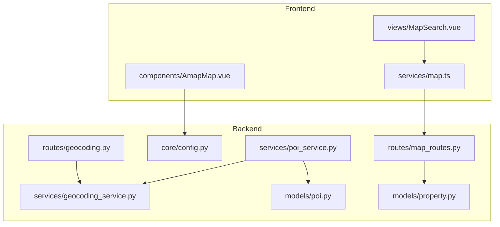
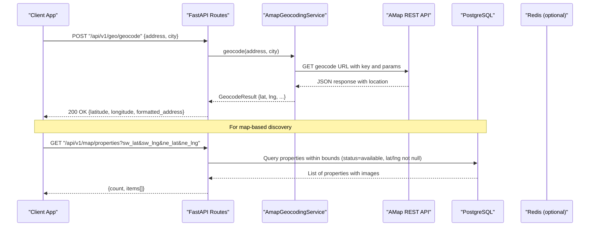
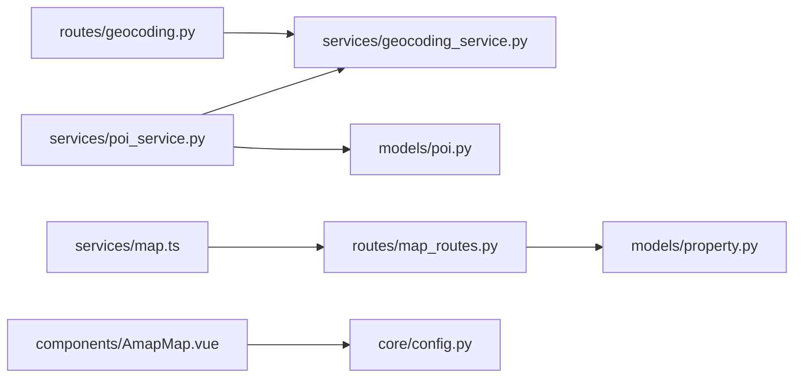
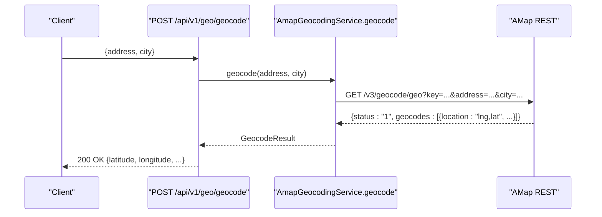
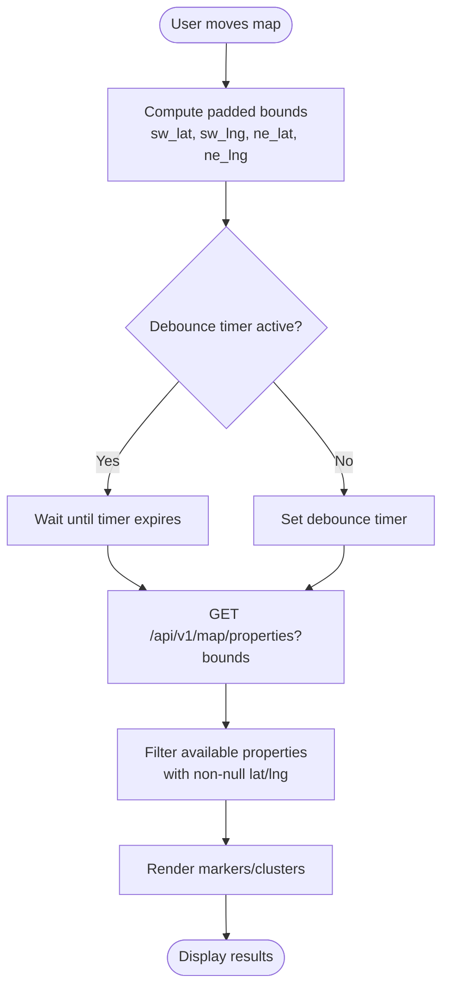

# Geospatial Features

<cite>
**Referenced Files in This Document**
- [geocoding.py](file://backend/app/api/v1/routes/geocoding.py)
- [geocoding_service.py](file://backend/app/services/geocoding_service.py)
- [geocoding.py](file://backend/app/schemas/geocoding.py)
- [property.py](file://backend/app/models/property.py)
- [property.py](file://backend/app/schemas/property.py)
- [map_routes.py](file://backend/app/api/v1/routes/map_routes.py)
- [map.ts](file://frontend/src/services/map.ts)
- [AmapMap.vue](file://frontend/src/components/AmapMap.vue)
- [MapSearch.vue](file://frontend/src/views/MapSearch.vue)
- [config.py](file://backend/app/core/config.py)
- [poi_service.py](file://backend/app/services/poi_service.py)
- [poi.py](file://backend/app/models/poi.py)
- [test_geocoding.py](file://backend/tests/test_geocoding.py)
</cite>

## Table of Contents
1. Introduction
2. Project Structure
3. Core Components
4. Architecture Overview
5. Detailed Component Analysis
6. Dependency Analysis
7. Performance Considerations
8. Troubleshooting Guide
9. Conclusion
10. Appendices

## Introduction
This document provides comprehensive API documentation for geospatial features in the property management system. It covers:
- Address geocoding via AMap to convert property addresses into latitude/longitude coordinates
- Geographic search capabilities including distance-based queries, area-based filtering, and proximity calculations
- Coordinate validation, geocoding accuracy considerations, and fallback mechanisms
- Integration between property models and geospatial data (latitude/longitude fields)
- Examples of geocoding requests, coordinate validation, and map-based property discovery
- Performance considerations for large-scale geospatial queries, caching strategies, and error handling

## Project Structure
The geospatial feature spans backend APIs, services, schemas, models, scripts, and frontend components:
- Backend API routes expose geocoding and map endpoints
- Services implement AMap integration and POI enrichment
- Schemas define request/response contracts
- Models store coordinates and POI metadata
- Frontend components render maps and perform viewport-based queries

**Diagram sources**
- [geocoding.py:1-25](file://backend/app/api/v1/routes/geocoding.py#L1-L25)
- [map_routes.py:1-80](file://backend/app/api/v1/routes/map_routes.py#L1-L80)
- [geocoding_service.py:1-145](file://backend/app/services/geocoding_service.py#L1-L145)
- [poi_service.py:1-311](file://backend/app/services/poi_service.py#L1-L311)
- [property.py:1-86](file://backend/app/models/property.py#L1-L86)
- [poi.py:1-28](file://backend/app/models/poi.py#L1-L28)
- [config.py:74-151](file://backend/app/core/config.py#L74-L151)
- [AmapMap.vue:1-198](file://frontend/src/components/AmapMap.vue#L1-L198)
- [MapSearch.vue:1-612](file://frontend/src/views/MapSearch.vue#L1-L612)
- [map.ts:1-57](file://frontend/src/services/map.ts#L1-L57)

**Section sources**
- [geocoding.py:1-25](file://backend/app/api/v1/routes/geocoding.py#L1-L25)
- [map_routes.py:1-80](file://backend/app/api/v1/routes/map_routes.py#L1-L80)
- [geocoding_service.py:1-145](file://backend/app/services/geocoding_service.py#L1-L145)
- [poi_service.py:1-311](file://backend/app/services/poi_service.py#L1-L311)
- [property.py:1-86](file://backend/app/models/property.py#L1-L86)
- [poi.py:1-28](file://backend/app/models/poi.py#L1-L28)
- [config.py:74-151](file://backend/app/core/config.py#L74-L151)
- [AmapMap.vue:1-198](file://frontend/src/components/AmapMap.vue#L1-L198)
- [MapSearch.vue:1-612](file://frontend/src/views/MapSearch.vue#L1-L612)
- [map.ts:1-57](file://frontend/src/services/map.ts#L1-L57)

## Core Components
- Geocoding API route: POST /api/v1/geo/geocode
- Map properties endpoint: GET /api/v1/map/properties
- AMap geocoding service: address-to-coordinate conversion and nearby POI search
- Property model with latitude/longitude fields
- POI service for enriching properties with nearby facilities and summaries
- Frontend map service and components for viewport-based queries and rendering

Key responsibilities:
- Validate inputs and enforce constraints on coordinates
- Call AMap REST APIs with configured keys and timeouts
- Return structured responses for clients
- Support area-based filtering using bounding boxes
- Provide fallbacks when external services fail

**Section sources**
- [geocoding.py:1-25](file://backend/app/api/v1/routes/geocoding.py#L1-L25)
- [geocoding_service.py:1-145](file://backend/app/services/geocoding_service.py#L1-L145)
- [map_routes.py:1-80](file://backend/app/api/v1/routes/map_routes.py#L1-L80)
- [property.py:1-86](file://backend/app/models/property.py#L1-L86)
- [poi_service.py:1-311](file://backend/app/services/poi_service.py#L1-L311)

## Architecture Overview
The geospatial architecture integrates backend APIs with AMap services and frontend map components:

**Diagram sources**
- [geocoding.py:1-25](file://backend/app/api/v1/routes/geocoding.py#L1-L25)
- [geocoding_service.py:46-85](file://backend/app/services/geocoding_service.py#L46-L85)
- [map_routes.py:14-68](file://backend/app/api/v1/routes/map_routes.py#L14-L68)
- [property.py:72-73](file://backend/app/models/property.py#L72-L73)

## Detailed Component Analysis

### Geocoding API
- Endpoint: POST /api/v1/geo/geocode
- Request body:
  - address: string (required, length 1–300)
  - city: string (optional, max length 100)
- Response:
  - address: string
  - latitude: Decimal
  - longitude: Decimal
  - formatted_address: string | None
  - level: string | None
  - province: string | None
  - city: string | None
  - district: string | None
- Error handling:
  - 503 Service Unavailable if AMap key is missing or service unavailable
  - 400 Bad Request if AMap returns invalid or empty results

Example request:
- POST /api/v1/geo/geocode
- Body: {"address": "江苏省苏州市工业园区星湖街1号", "city": "苏州"}

Example response:
- 200 OK: {"address": "...", "latitude": 31.299456, "longitude": 120.585123, "formatted_address": "...", "province": "江苏省", "city": "苏州市", "district": "工业园区"}

**Section sources**
- [geocoding.py:1-25](file://backend/app/api/v1/routes/geocoding.py#L1-L25)
- [geocoding.py:1-19](file://backend/app/schemas/geocoding.py#L1-L19)
- [test_geocoding.py:47-98](file://backend/tests/test_geocoding.py#L47-L98)

### AMap Geocoding Service
Responsibilities:
- Validate configuration (AMAP_WEB_KEY)
- Build request parameters and call AMap geocode URL
- Parse response and return structured result
- Nearby POI search by keyword and radius, sorted by distance

Key methods:
- geocode(address, city): Returns GeocodeResult with latitude/longitude and metadata
- search_nearby(location, keyword, radius, page_size, category): Returns list of NearbyPoiItem sorted by distance

Error handling:
- Missing key raises RuntimeError (mapped to 503 at route layer)
- Invalid or empty results raise ValueError (mapped to 400 at route layer)

Configuration:
- amap_web_key, amap_geocode_url, amap_geocode_timeout_seconds
- amap_around_url, amap_nearby_radius_meters, amap_nearby_page_size

**Section sources**
- [geocoding_service.py:1-145](file://backend/app/services/geocoding_service.py#L1-L145)
- [config.py:74-97](file://backend/app/core/config.py#L74-L97)

### Map Properties Endpoint
- Endpoint: GET /api/v1/map/properties
- Query parameters:
  - sw_lat: float (south-west latitude)
  - sw_lng: float (south-west longitude)
  - ne_lat: float (north-east latitude)
  - ne_lng: float (north-east longitude)
  - limit: int (default 500, max 1000)
- Behavior:
  - Filters available properties with non-null latitude/longitude
  - Applies bounding box filter if all four bounds are provided
  - Returns lightweight property objects including primary image URL

Response structure:
- count: number
- items: array of property objects with id, title, district, address, price_monthly, bedrooms, bathrooms, property_type, latitude, longitude, area_sqm, primary_image_url

Frontend integration:
- map.ts calls this endpoint with current viewport bounds
- MapSearch.vue debounces move/zoom events to reduce load

**Section sources**
- [map_routes.py:14-68](file://backend/app/api/v1/routes/map_routes.py#L14-L68)
- [map.ts:38-56](file://frontend/src/services/map.ts#L38-L56)
- [MapSearch.vue:124-145](file://frontend/src/views/MapSearch.vue#L124-L145)

### Property Model and Schema
- Property model includes:
  - latitude: Numeric(9,6), nullable
  - longitude: Numeric(9,6), nullable
- Property schema enforces:
  - latitude range [-90, 90]
  - longitude range [-180, 180]

Usage:
- Coordinates are stored upon successful geocoding
- Search endpoints include latitude/longitude in responses
- Map endpoints filter by non-null coordinates

**Section sources**
- [property.py:72-73](file://backend/app/models/property.py#L72-L73)
- [property.py:22-23](file://backend/app/schemas/property.py#L22-L23)

### POI Service and Enrichment
Purpose:
- Generate neighborhood context for properties using AMap nearby search
- Compose summary text optionally via OpenAI chat completion
- Persist POI content and categories in database

Workflow:
- Resolve location from existing coordinates or geocode address
- Collect nearby categories (transportation, medical, education, shopping, dining, lifestyle)
- Merge and deduplicate POIs by name, keeping closest distances
- Compose summary deterministically or via LLM
- Fallback to mock POI data per district if AMap fails

Data model:
- PropertyPOI stores content (summary), poi_data (JSON), generated_at, reviewed flags

**Section sources**
- [poi_service.py:109-311](file://backend/app/services/poi_service.py#L109-L311)
- [poi.py:12-27](file://backend/app/models/poi.py#L12-L27)

### Frontend Map Components
- AmapMap.vue:
  - Renders AMap marker if coordinates and JS key are available
  - Provides fallback link to AMap web marker
  - Dynamically loads AMap script with security config
- MapSearch.vue:
  - Uses Leaflet for interactive map
  - Debounced viewport queries to backend
  - Custom clustering logic based on zoom level
  - Integrates with map.ts service for API calls

**Section sources**
- [AmapMap.vue:1-198](file://frontend/src/components/AmapMap.vue#L1-L198)
- [MapSearch.vue:1-612](file://frontend/src/views/MapSearch.vue#L1-L612)
- [map.ts:1-57](file://frontend/src/services/map.ts#L1-L57)

## Dependency Analysis
Component relationships and coupling:
- Geocoding route depends on AmapGeocodingService
- POI service depends on AmapGeocodingService and optional OpenAI client
- Map route depends on Property model and database session
- Frontend components depend on backend map endpoints and AMap JS SDK

Potential circular dependencies:
- None detected; services are layered and imported lazily where needed

External integrations:
- AMap REST APIs for geocoding and nearby search
- Optional Redis for search result caching
- Optional OpenAI for POI summary generation

**Diagram sources**
- [geocoding.py:1-25](file://backend/app/api/v1/routes/geocoding.py#L1-L25)
- [geocoding_service.py:1-145](file://backend/app/services/geocoding_service.py#L1-L145)
- [map_routes.py:1-80](file://backend/app/api/v1/routes/map_routes.py#L1-L80)
- [property.py:1-86](file://backend/app/models/property.py#L1-L86)
- [poi_service.py:1-311](file://backend/app/services/poi_service.py#L1-L311)
- [poi.py:1-28](file://backend/app/models/poi.py#L1-L28)
- [map.ts:1-57](file://frontend/src/services/map.ts#L1-L57)
- [AmapMap.vue:1-198](file://frontend/src/components/AmapMap.vue#L1-L198)
- [config.py:74-151](file://backend/app/core/config.py#L74-L151)

**Section sources**
- [geocoding.py:1-25](file://backend/app/api/v1/routes/geocoding.py#L1-L25)
- [geocoding_service.py:1-145](file://backend/app/services/geocoding_service.py#L1-L145)
- [map_routes.py:1-80](file://backend/app/api/v1/routes/map_routes.py#L1-L80)
- [poi_service.py:1-311](file://backend/app/services/poi_service.py#L1-L311)
- [property.py:1-86](file://backend/app/models/property.py#L1-L86)
- [poi.py:1-28](file://backend/app/models/poi.py#L1-L28)
- [map.ts:1-57](file://frontend/src/services/map.ts#L1-L57)
- [AmapMap.vue:1-198](file://frontend/src/components/AmapMap.vue#L1-L198)
- [config.py:74-151](file://backend/app/core/config.py#L74-L151)

## Performance Considerations
- Bounding box queries:
  - Use sw_lat/sw_lng/ne_lat/ne_lng to limit dataset size
  - Ensure indexes on latitude/longitude if frequent spatial queries are expected
- Caching:
  - Non-vector search results cached in Redis with TTL (e.g., 5 minutes)
  - Cache keys derived deterministically from query parameters
- Rate limiting:
  - AMap requests use configurable timeout; consider rate limits at application layer
- Frontend optimization:
  - Debounce map movement/zoom events to avoid excessive API calls
  - Clustering reduces marker rendering overhead at low zoom levels

[No sources needed since this section provides general guidance]

## Troubleshooting Guide
Common issues and resolutions:
- Missing AMap key:
  - Symptom: 503 Service Unavailable on geocoding requests
  - Resolution: Configure AMAP_WEB_KEY in environment settings
- Invalid or empty geocoding results:
  - Symptom: 400 Bad Request with info message
  - Resolution: Verify address format and city parameter; ensure AMap account has sufficient quota
- No properties in viewport:
  - Symptom: Empty items list
  - Resolution: Confirm properties have non-null latitude/longitude and status=available
- POI generation failures:
  - Symptom: Fallback to mock POI data
  - Resolution: Check AMap availability and network connectivity; verify OpenAI key if used

**Section sources**
- [geocoding.py:14-23](file://backend/app/api/v1/routes/geocoding.py#L14-L23)
- [geocoding_service.py:46-85](file://backend/app/services/geocoding_service.py#L46-L85)
- [poi_service.py:164-195](file://backend/app/services/poi_service.py#L164-L195)

## Conclusion
The geospatial features provide robust address geocoding via AMap, efficient map-based property discovery through bounding box queries, and enriched neighborhood context via POI generation. The design emphasizes clear separation of concerns, resilient error handling, and performance optimizations such as caching and debouncing. Best practices for address normalization and coordinate precision are enforced through schema validations and careful parsing of external service responses.

[No sources needed since this section summarizes without analyzing specific files]

## Appendices

### API Definitions

#### Geocoding
- Method: POST
- Path: /api/v1/geo/geocode
- Request body:
  - address: string (required, min_length=1, max_length=300)
  - city: string (optional, max_length=100)
- Response:
  - address: string
  - latitude: Decimal
  - longitude: Decimal
  - formatted_address: string | None
  - level: string | None
  - province: string | None
  - city: string | None
  - district: string | None
- Status codes:
  - 200 OK
  - 400 Bad Request (invalid input or service error)
  - 503 Service Unavailable (missing key or service down)

**Section sources**
- [geocoding.py:9-25](file://backend/app/api/v1/routes/geocoding.py#L9-L25)
- [geocoding.py:6-19](file://backend/app/schemas/geocoding.py#L6-L19)

#### Map Properties
- Method: GET
- Path: /api/v1/map/properties
- Query parameters:
  - sw_lat: float (optional)
  - sw_lng: float (optional)
  - ne_lat: float (optional)
  - ne_lng: float (optional)
  - limit: int (default 500, le=1000)
- Response:
  - count: number
  - items: array of property objects with id, title, district, address, price_monthly, bedrooms, bathrooms, property_type, latitude, longitude, area_sqm, primary_image_url

**Section sources**
- [map_routes.py:14-68](file://backend/app/api/v1/routes/map_routes.py#L14-L68)

### Data Models

#### Property
- Fields relevant to geospatial:
  - latitude: Numeric(9,6), nullable
  - longitude: Numeric(9,6), nullable

**Section sources**
- [property.py:72-73](file://backend/app/models/property.py#L72-L73)

#### PropertyPOI
- Fields:
  - id: UUID
  - property_id: FK to properties.id
  - content: Text (summary)
  - poi_data: JSON (categories and POI items)
  - generated_at: DateTime(timezone=True)
  - reviewed: Boolean

**Section sources**
- [poi.py:12-27](file://backend/app/models/poi.py#L12-L27)

### Configuration Keys
- AMAP_WEB_KEY: AMap web key for geocoding and nearby search
- AMAP_GEOCODE_URL: Geocoding endpoint URL
- AMAP_GEOCODE_TIMEOUT_SECONDS: Timeout for geocoding requests
- AMAP_AROUND_URL: Nearby search endpoint URL
- AMAP_NEARBY_RADIUS_METERS: Default radius for nearby search
- AMAP_NEARBY_PAGE_SIZE: Default page size for nearby search
- AMAP_JS_KEY: AMap JS key for frontend map rendering

**Section sources**
- [config.py:74-151](file://backend/app/core/config.py#L74-L151)

### Example Workflows

#### Geocoding Request Flow

**Diagram sources**
- [geocoding.py:9-25](file://backend/app/api/v1/routes/geocoding.py#L9-L25)
- [geocoding_service.py:46-85](file://backend/app/services/geocoding_service.py#L46-L85)

#### Map-Based Property Discovery Flow

**Diagram sources**
- [map_routes.py:14-68](file://backend/app/api/v1/routes/map_routes.py#L14-L68)
- [MapSearch.vue:124-145](file://frontend/src/views/MapSearch.vue#L124-L145)

### Best Practices
- Address normalization:
  - Trim whitespace and standardize city/address order before geocoding
  - Prefer combining district and address for better resolution
- Coordinate precision:
  - Store coordinates with up to 6 decimal places (approx. 0.1 meter precision)
  - Validate ranges during schema validation
- Error resilience:
  - Implement retries with exponential backoff for transient AMap errors
  - Log detailed error contexts for debugging
- Caching strategy:
  - Cache frequently accessed locations and search results with appropriate TTL
  - Invalidate cache on property updates that affect coordinates

[No sources needed since this section provides general guidance]