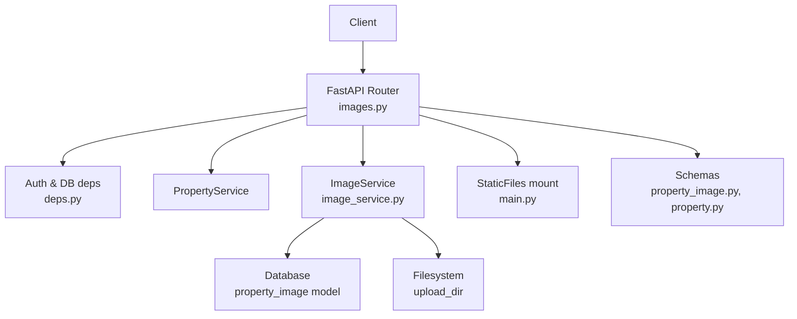
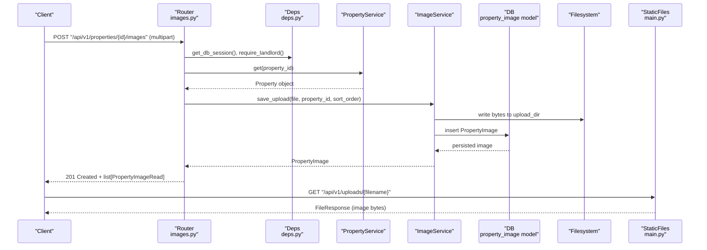
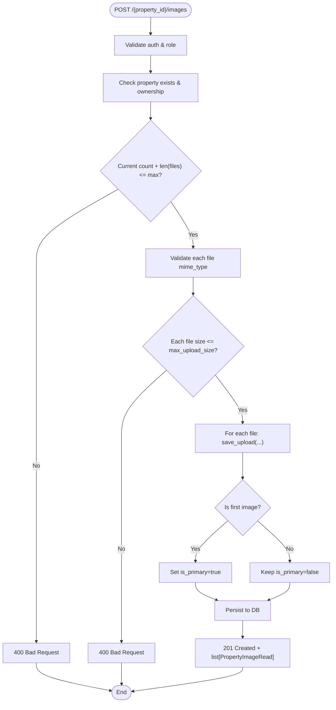
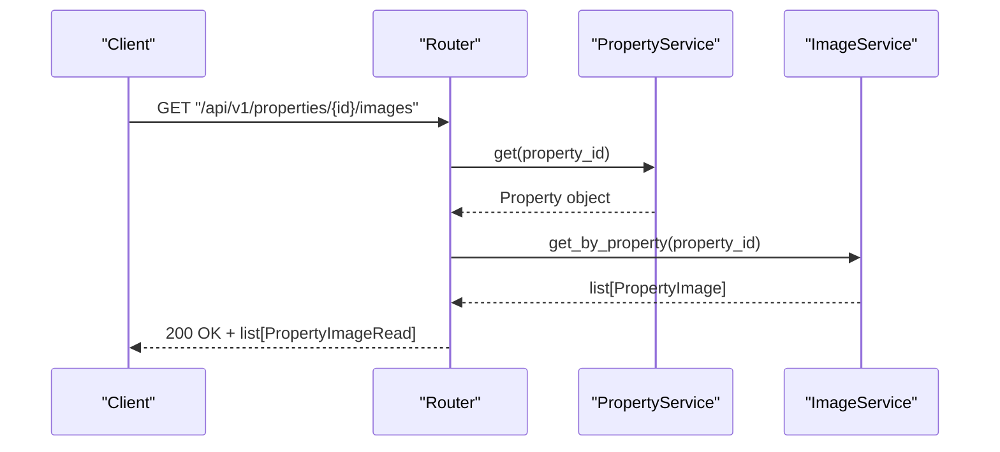
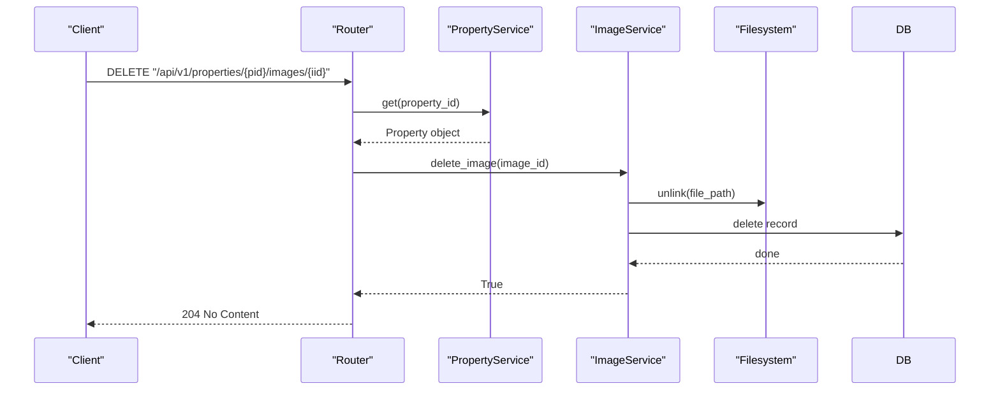
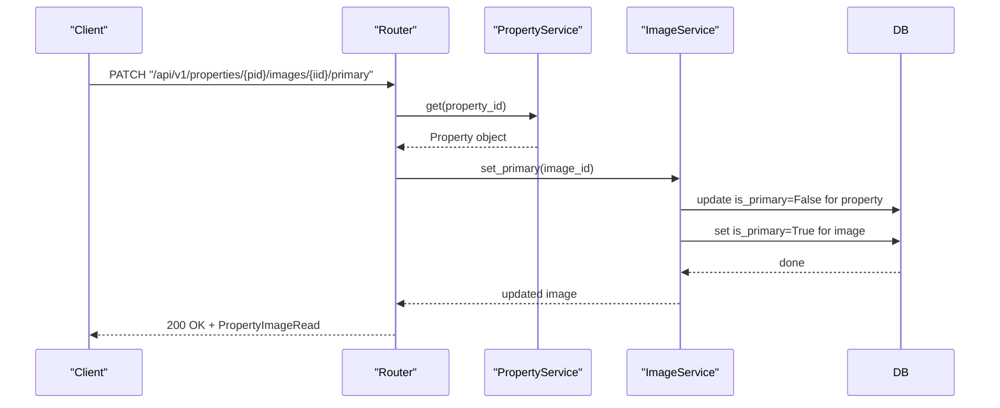
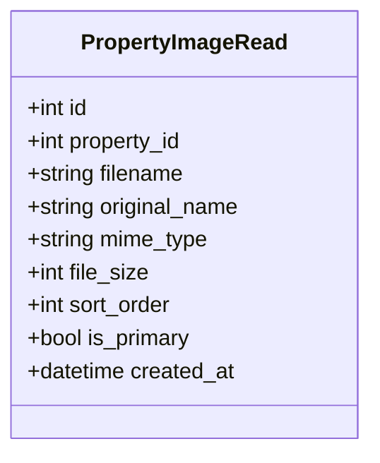
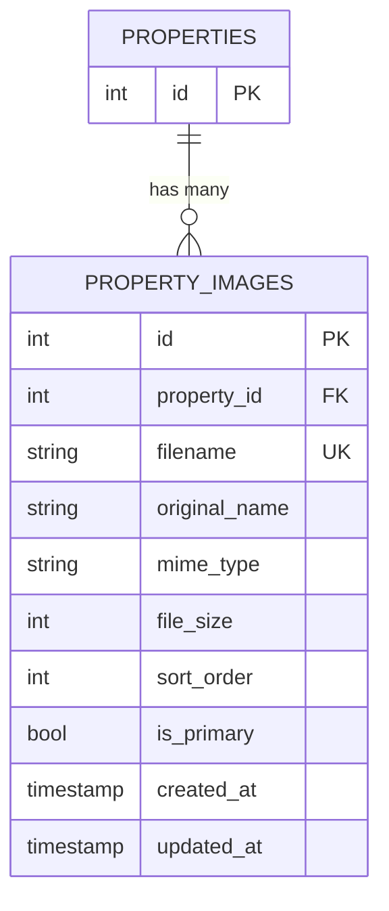
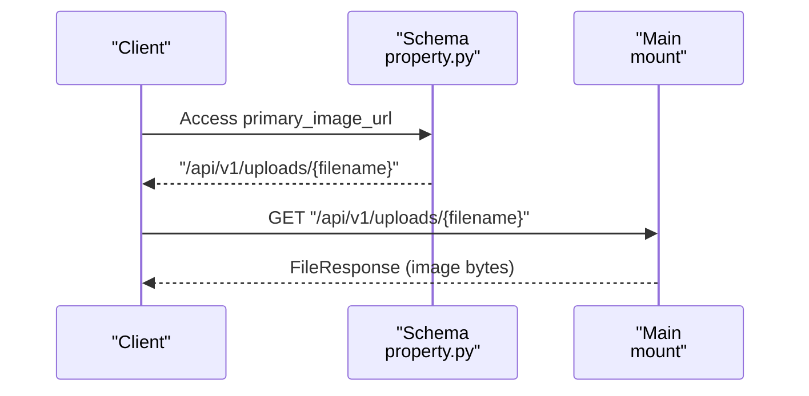
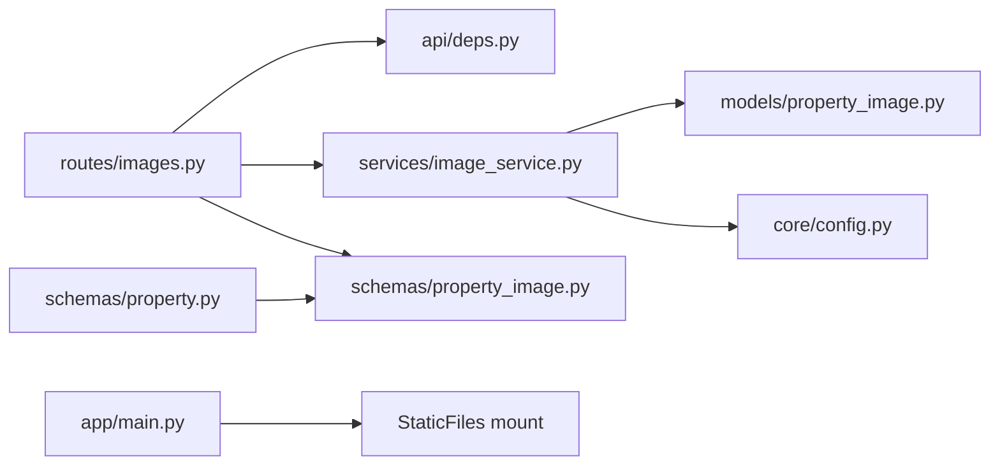

# Image Management

<cite>
**Referenced Files in This Document**
- [images.py](file://backend/app/api/v1/routes/images.py)
- [property_image.py](file://backend/app/schemas/property_image.py)
- [property_image_model.py](file://backend/app/models/property_image.py)
- [image_service.py](file://backend/app/services/image_service.py)
- [config.py](file://backend/app/core/config.py)
- [deps.py](file://backend/app/api/deps.py)
- [main.py](file://backend/app/main.py)
- [property_schema.py](file://backend/app/schemas/property.py)
- [test_images.py](file://backend/tests/test_images.py)
</cite>

## Table of Contents
1. [Introduction](#introduction)
2. [Project Structure](#project-structure)
3. [Core Components](#core-components)
4. [Architecture Overview](#architecture-overview)
5. [Detailed Component Analysis](#detailed-component-analysis)
6. [Dependency Analysis](#dependency-analysis)
7. [Performance Considerations](#performance-considerations)
8. [Troubleshooting Guide](#troubleshooting-guide)
9. [Conclusion](#conclusion)
10. [Appendices](#appendices)

## Introduction
This document provides detailed API documentation for property image management functionality. It covers:
- Uploading images to properties with multipart form data, including file validation (mime_type and size limits), filename handling, and original name preservation.
- Retrieving property images, including primary image identification via the is_primary flag and sorting by sort_order.
- Managing image metadata through the PropertyImageRead schema fields.
- Deleting images and setting a primary image.
- Image URL generation and static serving.
- Security considerations for uploads, storage configuration, and optimization strategies.
- Error handling for invalid file types, size limits, and storage failures.

## Project Structure
The image management feature spans routes, services, models, schemas, configuration, and tests:
- Routes define REST endpoints for upload, list, delete, and set-primary operations.
- Service encapsulates business logic for saving, deleting, reordering, and querying images.
- Model defines database schema for images.
- Schema defines response structure for clients.
- Configuration controls upload directory, allowed types, size limits, and per-property limits.
- Main application mounts a static file server to serve uploaded images.

**Diagram sources**
- [images.py:1-151](file://backend/app/api/v1/routes/images.py#L1-L151)
- [image_service.py:1-95](file://backend/app/services/image_service.py#L1-L95)
- [property_image_model.py:1-23](file://backend/app/models/property_image.py#L1-L23)
- [property_image.py:1-22](file://backend/app/schemas/property_image.py#L1-L22)
- [property_schema.py:46-79](file://backend/app/schemas/property.py#L46-L79)
- [main.py:71-76](file://backend/app/main.py#L71-L76)
- [deps.py:14-39](file://backend/app/api/deps.py#L14-L39)

**Section sources**
- [images.py:1-151](file://backend/app/api/v1/routes/images.py#L1-L151)
- [image_service.py:1-95](file://backend/app/services/image_service.py#L1-L95)
- [property_image_model.py:1-23](file://backend/app/models/property_image.py#L1-L23)
- [property_image.py:1-22](file://backend/app/schemas/property_image.py#L1-L22)
- [property_schema.py:46-79](file://backend/app/schemas/property.py#L46-L79)
- [main.py:71-76](file://backend/app/main.py#L71-L76)
- [deps.py:14-39](file://backend/app/api/deps.py#L14-L39)

## Core Components
- Upload endpoint: POST /api/v1/properties/{property_id}/images
  - Accepts multipart/form-data with field files as a list of files.
  - Validates property ownership and role (landlord or admin).
  - Enforces per-property image count limit and per-file type and size constraints.
  - Assigns sort_order sequentially based on current count and index.
  - Sets is_primary true for the first image of a property; subsequent images are not primary.
  - Returns list[PropertyImageRead].

- List endpoint: GET /api/v1/properties/{property_id}/images
  - Returns all images for a property sorted by sort_order then id.
  - Includes is_primary flag for each image.

- Delete endpoint: DELETE /api/v1/properties/{property_id}/images/{image_id}
  - Removes both the database record and the physical file from disk.
  - Requires landlord/admin ownership.

- Set primary endpoint: PATCH /api/v1/properties/{property_id}/images/{image_id}/primary
  - Unsets is_primary for all other images of the same property and sets it for the target image.
  - Requires landlord/admin ownership.

- Image URL generation:
  - Primary image URL is constructed as /api/v1/uploads/{filename}.
  - The backend serves static files under /api/v1/uploads mounted to the configured upload directory.

- Metadata schema:
  - PropertyImageRead includes id, property_id, filename, original_name, mime_type, file_size, sort_order, is_primary, created_at.

**Section sources**
- [images.py:26-80](file://backend/app/api/v1/routes/images.py#L26-L80)
- [images.py:136-151](file://backend/app/api/v1/routes/images.py#L136-L151)
- [images.py:83-107](file://backend/app/api/v1/routes/images.py#L83-L107)
- [images.py:109-133](file://backend/app/api/v1/routes/images.py#L109-L133)
- [property_schema.py:55-60](file://backend/app/schemas/property.py#L55-L60)
- [property_schema.py:74-79](file://backend/app/schemas/property.py#L74-L79)
- [main.py:71-76](file://backend/app/main.py#L71-L76)
- [property_image.py:10-22](file://backend/app/schemas/property_image.py#L10-L22)

## Architecture Overview
The image management flow involves FastAPI route handlers that enforce authentication and authorization, delegate to service methods for persistence and filesystem operations, and return Pydantic responses. Static file serving is provided by mounting a directory.

**Diagram sources**
- [images.py:26-80](file://backend/app/api/v1/routes/images.py#L26-L80)
- [image_service.py:27-52](file://backend/app/services/image_service.py#L27-L52)
- [property_image_model.py:8-22](file://backend/app/models/property_image.py#L8-L22)
- [main.py:71-76](file://backend/app/main.py#L71-L76)
- [deps.py:14-39](file://backend/app/api/deps.py#L14-L39)

## Detailed Component Analysis

### Upload Images Endpoint
- Path: POST /api/v1/properties/{property_id}/images
- Authentication: Bearer token required; requires landlord or admin role.
- Authorization: Caller must own the property unless admin.
- Request:
  - Content-Type: multipart/form-data
  - Field: files (list of files)
- Validation:
  - Per-file content_type must be in allowed_image_types.
  - Per-file size must not exceed max_upload_size.
  - Total images after upload must not exceed max_images_per_property.
- Behavior:
  - Generates safe filenames using UUID + extension.
  - Preserves original_name from client-provided filename.
  - Records mime_type and file_size.
  - Assigns sort_order incrementally starting from current_count.
  - First image becomes is_primary; others default to false.
- Response:
  - 201 Created with list[PropertyImageRead].
- Errors:
  - 404 Not Found if property does not exist.
  - 403 Forbidden if user cannot manage this property.
  - 400 Bad Request if unsupported file type, file too large, or exceeding per-property limit.

**Diagram sources**
- [images.py:26-80](file://backend/app/api/v1/routes/images.py#L26-L80)
- [image_service.py:27-52](file://backend/app/services/image_service.py#L27-L52)

**Section sources**
- [images.py:26-80](file://backend/app/api/v1/routes/images.py#L26-L80)
- [config.py:99-105](file://backend/app/core/config.py#L99-L105)
- [image_service.py:27-52](file://backend/app/services/image_service.py#L27-L52)

### List Images Endpoint
- Path: GET /api/v1/properties/{property_id}/images
- Authentication: None required for listing.
- Authorization: Property existence check only.
- Behavior:
  - Returns images ordered by sort_order ascending, then by id.
- Response:
  - 200 OK with list[PropertyImageRead].
- Errors:
  - 404 Not Found if property does not exist.

**Diagram sources**
- [images.py:136-151](file://backend/app/api/v1/routes/images.py#L136-L151)
- [image_service.py:87-94](file://backend/app/services/image_service.py#L87-L94)

**Section sources**
- [images.py:136-151](file://backend/app/api/v1/routes/images.py#L136-L151)
- [image_service.py:87-94](file://backend/app/services/image_service.py#L87-L94)

### Delete Image Endpoint
- Path: DELETE /api/v1/properties/{property_id}/images/{image_id}
- Authentication: Bearer token required; requires landlord or admin role.
- Authorization: Caller must own the property unless admin.
- Behavior:
  - Deletes the image record from the database.
  - Removes the physical file from the upload directory.
- Response:
  - 204 No Content on success.
- Errors:
  - 404 Not Found if property or image does not exist.
  - 403 Forbidden if user cannot manage this property.

**Diagram sources**
- [images.py:83-107](file://backend/app/api/v1/routes/images.py#L83-L107)
- [image_service.py:54-66](file://backend/app/services/image_service.py#L54-L66)

**Section sources**
- [images.py:83-107](file://backend/app/api/v1/routes/images.py#L83-L107)
- [image_service.py:54-66](file://backend/app/services/image_service.py#L54-L66)

### Set Primary Image Endpoint
- Path: PATCH /api/v1/properties/{property_id}/images/{image_id}/primary
- Authentication: Bearer token required; requires landlord or admin role.
- Authorization: Caller must own the property unless admin.
- Behavior:
  - Unsets is_primary for all images belonging to the same property.
  - Sets is_primary for the specified image.
- Response:
  - 200 OK with updated PropertyImageRead.
- Errors:
  - 404 Not Found if property or image does not exist.
  - 403 Forbidden if user cannot manage this property.

**Diagram sources**
- [images.py:109-133](file://backend/app/api/v1/routes/images.py#L109-L133)
- [image_service.py:68-85](file://backend/app/services/image_service.py#L68-L85)

**Section sources**
- [images.py:109-133](file://backend/app/api/v1/routes/images.py#L109-L133)
- [image_service.py:68-85](file://backend/app/services/image_service.py#L68-L85)

### Image Metadata Schema
- PropertyImageRead fields:
  - id: integer
  - property_id: integer
  - filename: string (server-generated unique name)
  - original_name: string (client-provided filename preserved)
  - mime_type: string (content_type)
  - file_size: integer (bytes)
  - sort_order: integer (ascending order)
  - is_primary: boolean (single primary per property)
  - created_at: datetime

**Diagram sources**
- [property_image.py:10-22](file://backend/app/schemas/property_image.py#L10-L22)

**Section sources**
- [property_image.py:10-22](file://backend/app/schemas/property_image.py#L10-L22)

### Database Model
- PropertyImage table columns:
  - id: primary key, indexed
  - property_id: foreign key to properties.id, cascading delete
  - filename: unique, string
  - original_name: string
  - mime_type: string
  - file_size: integer
  - sort_order: integer, default 0
  - is_primary: boolean, default false
- Relationships:
  - Back-reference to Property via relationship.

**Diagram sources**
- [property_image_model.py:8-22](file://backend/app/models/property_image.py#L8-L22)

**Section sources**
- [property_image_model.py:8-22](file://backend/app/models/property_image.py#L8-L22)

### Image URL Generation and Serving
- Primary image URL construction:
  - For a property, the primary image URL is built as /api/v1/uploads/{filename}.
- Static file serving:
  - The application mounts /api/v1/uploads to the configured upload directory.
- Usage:
  - Clients can request the primary image directly via the generated URL.

**Diagram sources**
- [property_schema.py:55-60](file://backend/app/schemas/property.py#L55-L60)
- [property_schema.py:74-79](file://backend/app/schemas/property.py#L74-L79)
- [main.py:71-76](file://backend/app/main.py#L71-L76)

**Section sources**
- [property_schema.py:55-60](file://backend/app/schemas/property.py#L55-L60)
- [property_schema.py:74-79](file://backend/app/schemas/property.py#L74-L79)
- [main.py:71-76](file://backend/app/main.py#L71-L76)

## Dependency Analysis
- Route dependencies:
  - Uses get_db_session for database sessions.
  - Uses require_landlord for authorization checks.
- Service dependencies:
  - ImageService depends on settings for upload_dir and uses SQLAlchemy session for queries.
- Configuration dependencies:
  - Settings provide upload_dir, max_upload_size, allowed_image_types, max_images_per_property.
- Static serving dependency:
  - main.py mounts StaticFiles at /api/v1/uploads.

**Diagram sources**
- [images.py:1-151](file://backend/app/api/v1/routes/images.py#L1-L151)
- [deps.py:14-39](file://backend/app/api/deps.py#L14-L39)
- [image_service.py:1-95](file://backend/app/services/image_service.py#L1-L95)
- [property_image_model.py:1-23](file://backend/app/models/property_image.py#L1-L23)
- [property_image.py:1-22](file://backend/app/schemas/property_image.py#L1-L22)
- [property_schema.py:46-79](file://backend/app/schemas/property.py#L46-L79)
- [main.py:71-76](file://backend/app/main.py#L71-L76)

**Section sources**
- [images.py:1-151](file://backend/app/api/v1/routes/images.py#L1-L151)
- [deps.py:14-39](file://backend/app/api/deps.py#L14-L39)
- [image_service.py:1-95](file://backend/app/services/image_service.py#L1-L95)
- [property_image_model.py:1-23](file://backend/app/models/property_image.py#L1-L23)
- [property_image.py:1-22](file://backend/app/schemas/property_image.py#L1-L22)
- [property_schema.py:46-79](file://backend/app/schemas/property.py#L46-L79)
- [main.py:71-76](file://backend/app/main.py#L71-L76)

## Performance Considerations
- Sorting:
  - Listing images orders by sort_order then id, ensuring stable ordering.
- Storage:
  - Files are written synchronously to disk during upload; consider async streaming for very large files.
- Limits:
  - Enforce max_upload_size and max_images_per_property to prevent resource exhaustion.
- Primary image selection:
  - First image automatically becomes primary; avoid unnecessary updates by setting is_primary only when needed.

[No sources needed since this section provides general guidance]

## Troubleshooting Guide
Common errors and their causes:
- Unsupported file type:
  - Occurs when content_type is not in allowed_image_types.
  - Action: Ensure MIME types match allowed list.
- File too large:
  - Occurs when file.size exceeds max_upload_size.
  - Action: Compress or resize images before upload.
- Exceeding per-property limit:
  - Occurs when current_count + len(files) > max_images_per_property.
  - Action: Remove existing images or reduce batch size.
- Unauthorized access:
  - 401 Unauthorized if missing or invalid token.
  - 403 Forbidden if user lacks landlord/admin role or does not own the property.
  - Action: Authenticate and ensure correct role/ownership.
- Not found:
  - 404 Not Found for missing property or image.
  - Action: Verify IDs and existence.

Validation examples are covered by tests:
- Successful upload and primary marking.
- Listing images.
- Rejection of non-image types.
- Deletion and verification of removal.
- Setting a different image as primary.
- Unauthorized attempts blocked.

**Section sources**
- [images.py:60-71](file://backend/app/api/v1/routes/images.py#L60-L71)
- [images.py:40-48](file://backend/app/api/v1/routes/images.py#L40-L48)
- [images.py:93-101](file://backend/app/api/v1/routes/images.py#L93-L101)
- [images.py:119-127](file://backend/app/api/v1/routes/images.py#L119-L127)
- [test_images.py:121-137](file://backend/tests/test_images.py#L121-L137)
- [test_images.py:140-166](file://backend/tests/test_images.py#L140-L166)
- [test_images.py:169-206](file://backend/tests/test_images.py#L169-L206)
- [test_images.py:209-249](file://backend/tests/test_images.py#L209-L249)

## Conclusion
The image management system provides secure, validated, and well-structured endpoints for uploading, listing, deleting, and managing primary images for properties. It preserves original filenames, enforces strict validation, and exposes clear metadata via PropertyImageRead. Static file serving enables direct image access via generated URLs. Proper configuration and error handling ensure robust operation across environments.

[No sources needed since this section summarizes without analyzing specific files]

## Appendices

### API Definitions

- Upload Images
  - Method: POST
  - Path: /api/v1/properties/{property_id}/images
  - Headers: Authorization: Bearer <token>
  - Body: multipart/form-data with field files (array of files)
  - Success: 201 Created, body: list[PropertyImageRead]
  - Errors: 400 (type/size/limit), 403 (forbidden), 404 (not found)

- List Images
  - Method: GET
  - Path: /api/v1/properties/{property_id}/images
  - Success: 200 OK, body: list[PropertyImageRead]
  - Errors: 404 (not found)

- Delete Image
  - Method: DELETE
  - Path: /api/v1/properties/{property_id}/images/{image_id}
  - Headers: Authorization: Bearer <token>
  - Success: 204 No Content
  - Errors: 403 (forbidden), 404 (not found)

- Set Primary Image
  - Method: PATCH
  - Path: /api/v1/properties/{property_id}/images/{image_id}/primary
  - Headers: Authorization: Bearer <token>
  - Success: 200 OK, body: PropertyImageRead
  - Errors: 403 (forbidden), 404 (not found)

**Section sources**
- [images.py:26-80](file://backend/app/api/v1/routes/images.py#L26-L80)
- [images.py:136-151](file://backend/app/api/v1/routes/images.py#L136-L151)
- [images.py:83-107](file://backend/app/api/v1/routes/images.py#L83-L107)
- [images.py:109-133](file://backend/app/api/v1/routes/images.py#L109-L133)

### Example Requests

- Multipart Upload
  - Use a client library to send a POST to /api/v1/properties/{property_id}/images with field files containing one or more image files.
  - Ensure Authorization header includes a valid bearer token.

- Image URL
  - Retrieve the primary image URL from the property’s primary_image_url field or construct /api/v1/uploads/{filename}.
  - Directly request the URL to download the image.

- Thumbnail Handling
  - Thumbnails are not implemented in the current codebase.
  - Recommended approach: generate thumbnails asynchronously upon upload and store them alongside originals, exposing separate endpoints or query parameters for thumbnail sizes.

**Section sources**
- [property_schema.py:55-60](file://backend/app/schemas/property.py#L55-L60)
- [property_schema.py:74-79](file://backend/app/schemas/property.py#L74-L79)
- [main.py:71-76](file://backend/app/main.py#L71-L76)

### Security and Configuration

- Security Considerations
  - Require authentication and landlord/admin roles for mutating operations.
  - Validate file types against an allowlist.
  - Enforce maximum file size and per-property image count.
  - Generate safe filenames using UUIDs to avoid path traversal.

- Storage Backend Configuration
  - upload_dir: Directory where images are stored.
  - max_upload_size: Maximum allowed file size in bytes.
  - allowed_image_types: Allowed MIME types.
  - max_images_per_property: Maximum number of images per property.

- Optimization Strategies
  - Implement background processing for resizing/compressing images.
  - Serve optimized variants via query parameters or dedicated endpoints.
  - Consider CDN integration for static assets.

**Section sources**
- [config.py:99-105](file://backend/app/core/config.py#L99-L105)
- [deps.py:33-39](file://backend/app/api/deps.py#L33-L39)
- [image_service.py:27-52](file://backend/app/services/image_service.py#L27-L52)