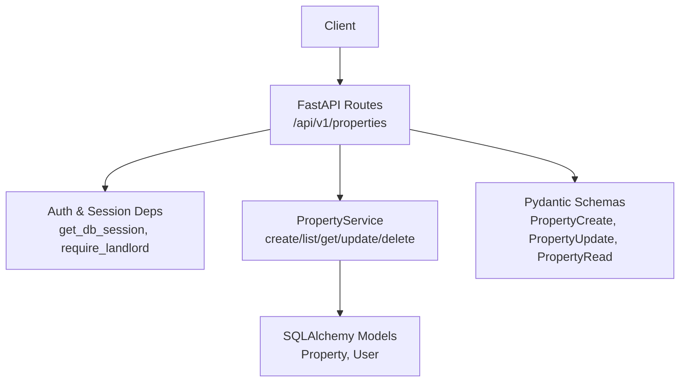
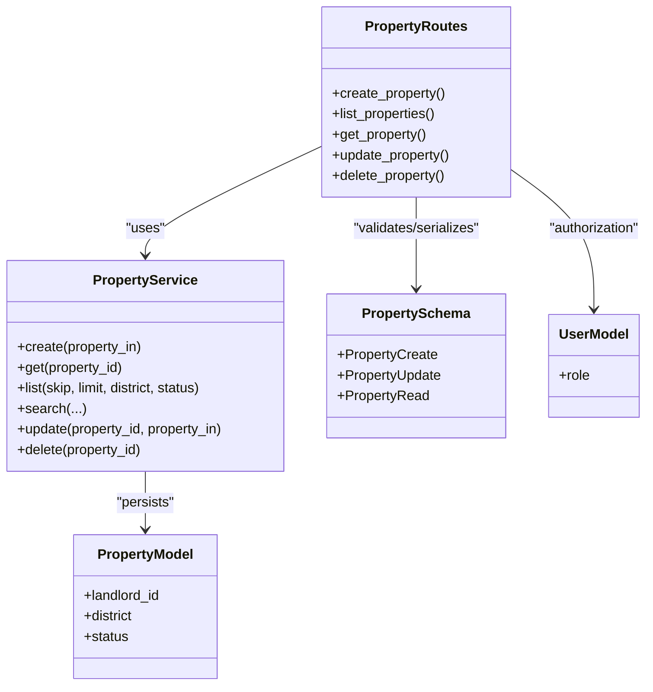

# Property CRUD Operations

<cite>
**Referenced Files in This Document**
- [properties.py](file://backend/app/api/v1/routes/properties.py)
- [property.py](file://backend/app/schemas/property.py)
- [property_image.py](file://backend/app/schemas/property_image.py)
- [property_model.py](file://backend/app/models/property.py)
- [user_model.py](file://backend/app/models/user.py)
- [deps.py](file://backend/app/api/deps.py)
- [property_service.py](file://backend/app/services/property_service.py)
- [test_properties.py](file://backend/tests/test_properties.py)
- [conftest.py](file://backend/tests/conftest.py)
</cite>

## Table of Contents
1. [Introduction](#introduction)
2. [Project Structure](#project-structure)
3. [Core Components](#core-components)
4. [Architecture Overview](#architecture-overview)
5. [Detailed Component Analysis](#detailed-component-analysis)
6. [Dependency Analysis](#dependency-analysis)
7. [Performance Considerations](#performance-considerations)
8. [Troubleshooting Guide](#troubleshooting-guide)
9. [Conclusion](#conclusion)
10. [Appendices](#appendices)

## Introduction
This document provides comprehensive API documentation for property CRUD operations exposed by the backend service. It covers:
- Creating properties with validation and landlord ownership checks
- Listing properties with pagination, district filtering, and status filtering
- Retrieving a single property by ID
- Partial updates using a safe update schema
- Deleting properties with ownership validation
It also details authentication requirements, authorization rules (landlord vs admin), request/response formats, error handling scenarios, and data validation constraints.

## Project Structure
The property endpoints are implemented as FastAPI routes that depend on Pydantic schemas for validation, SQLAlchemy models for persistence, and a service layer for business logic. Authentication and role-based access control are enforced via dependency injection.



**Diagram sources**
- [properties.py:1-162](file://backend/app/api/v1/routes/properties.py#L1-L162)
- [deps.py:1-58](file://backend/app/api/deps.py#L1-L58)
- [property_service.py:44-239](file://backend/app/services/property_service.py#L44-L239)
- [property_model.py:38-86](file://backend/app/models/property.py#L38-L86)
- [user_model.py:24-48](file://backend/app/models/user.py#L24-L48)
- [property.py:11-79](file://backend/app/schemas/property.py#L11-L79)

**Section sources**
- [properties.py:1-162](file://backend/app/api/v1/routes/properties.py#L1-L162)
- [deps.py:1-58](file://backend/app/api/deps.py#L1-L58)
- [property_service.py:44-239](file://backend/app/services/property_service.py#L44-L239)
- [property_model.py:38-86](file://backend/app/models/property.py#L38-L86)
- [user_model.py:24-48](file://backend/app/models/user.py#L24-L48)
- [property.py:11-79](file://backend/app/schemas/property.py#L11-L79)

## Core Components
- API Routes: Define HTTP endpoints and orchestrate validation, authorization, and service calls.
- Schemas: Validate input payloads and serialize responses.
- Models: Represent database tables and constraints.
- Service Layer: Encapsulate business logic, including listing, search, create, update, delete, and side effects like POI generation and embedding tasks.
- Dependencies: Provide database sessions and enforce authentication and roles.

Key responsibilities:
- POST /api/v1/properties: Create a new property after validating landlord existence and ownership permissions.
- GET /api/v1/properties: List properties with skip/limit pagination, optional district and status filters.
- GET /api/v1/properties/{id}: Retrieve a specific property.
- PATCH /api/v1/properties/{id}: Partially update a property with ownership checks.
- DELETE /api/v1/properties/{id}: Delete a property with ownership checks.

**Section sources**
- [properties.py:16-162](file://backend/app/api/v1/routes/properties.py#L16-L162)
- [property_service.py:44-239](file://backend/app/services/property_service.py#L44-L239)
- [property.py:11-79](file://backend/app/schemas/property.py#L11-L79)
- [property_model.py:38-86](file://backend/app/models/property.py#L38-L86)
- [deps.py:19-58](file://backend/app/api/deps.py#L19-L58)

## Architecture Overview
The following sequence diagrams illustrate key workflows for creating, updating, and deleting properties.

### Create Property Workflow
```mermaid
sequenceDiagram
participant Client as "Client"
participant Router as "POST /api/v1/properties"
participant Auth as "require_landlord"
participant DB as "AsyncSession"
participant UserService as "UserService.get"
participant PropSvc as "PropertyService.create"
Client->>Router : "POST /api/v1/properties {PropertyCreate}"
Router->>Auth : "Validate token and role"
Auth-->>Router : "User (landlord/admin)"
Router->>DB : "Open session"
Router->>UserService : "Get landlord by landlord_id"
UserService-->>Router : "Landlord or None"
alt "Landlord not found"
Router-->>Client : "422 Unprocessable Entity"
else "Landlord exists"
Router->>Router : "Check ownership (admin allowed; otherwise must be self)"
alt "Not owner and not admin"
Router-->>Client : "403 Forbidden"
else "Authorized"
Router->>PropSvc : "Create property"
PropSvc->>DB : "Persist and refresh"
PropSvc-->>Router : "Property object"
Router-->>Client : "201 Created {PropertyRead}"
end
end
```

**Diagram sources**
- [properties.py:16-33](file://backend/app/api/v1/routes/properties.py#L16-L33)
- [deps.py:33-39](file://backend/app/api/deps.py#L33-L39)
- [property_service.py:48-60](file://backend/app/services/property_service.py#L48-L60)

### Update Property Workflow
```mermaid
sequenceDiagram
participant Client as "Client"
participant Router as "PATCH /api/v1/properties/{id}"
participant Auth as "require_landlord"
participant PropSvc as "PropertyService.get/update"
Client->>Router : "PATCH /api/v1/properties/{id} {PropertyUpdate}"
Router->>Auth : "Validate token and role"
Auth-->>Router : "User (landlord/admin)"
Router->>PropSvc : "Get existing property"
alt "Not found"
Router-->>Client : "404 Not Found"
else "Found"
Router->>Router : "Ownership check (admin allowed; otherwise must be owner)"
alt "Not owner and not admin"
Router-->>Client : "403 Forbidden"
else "Authorized"
Router->>PropSvc : "Partial update"
PropSvc-->>Router : "Updated property"
Router-->>Client : "200 OK {PropertyRead}"
end
end
```

**Diagram sources**
- [properties.py:121-141](file://backend/app/api/v1/routes/properties.py#L121-L141)
- [deps.py:33-39](file://backend/app/api/deps.py#L33-L39)
- [property_service.py:197-214](file://backend/app/services/property_service.py#L197-L214)

### Delete Property Workflow
```mermaid
sequenceDiagram
participant Client as "Client"
participant Router as "DELETE /api/v1/properties/{id}"
participant Auth as "require_landlord"
participant PropSvc as "PropertyService.get/delete"
Client->>Router : "DELETE /api/v1/properties/{id}"
Router->>Auth : "Validate token and role"
Auth-->>Router : "User (landlord/admin)"
Router->>PropSvc : "Get existing property"
alt "Not found"
Router-->>Client : "404 Not Found"
else "Found"
Router->>Router : "Ownership check (admin allowed; otherwise must be owner)"
alt "Not owner and not admin"
Router-->>Client : "403 Forbidden"
else "Authorized"
Router->>PropSvc : "Delete property"
PropSvc-->>Router : "True/False"
alt "Deletion failed"
Router-->>Client : "404 Not Found"
else "Deleted"
Router-->>Client : "204 No Content"
end
end
end
```

**Diagram sources**
- [properties.py:144-162](file://backend/app/api/v1/routes/properties.py#L144-L162)
- [deps.py:33-39](file://backend/app/api/deps.py#L33-L39)
- [property_service.py:216-223](file://backend/app/services/property_service.py#L216-L223)

## Detailed Component Analysis

### Authentication and Authorization
- Authentication: Bearer token required. The OAuth2 scheme is configured to obtain tokens from the login endpoint. If invalid or expired, a 401 Unauthorized response is returned.
- Role-based Access Control:
  - require_landlord allows users with landlord or admin roles.
  - Business logic further enforces ownership: landlords can only manage their own properties; admins can manage any property.

Request headers:
- Authorization: Bearer <token>

Error codes:
- 401 Unauthorized: Invalid or expired token
- 403 Forbidden: Missing landlord/admin role or insufficient ownership

**Section sources**
- [deps.py:11-39](file://backend/app/api/deps.py#L11-L39)
- [user_model.py:11-16](file://backend/app/models/user.py#L11-L16)

### Data Validation and Schemas
- PropertyBase fields include title, description, address, district, price_monthly, area_sqm, bedrooms, bathrooms, property_type, status, latitude, longitude, deposit_amount, service_fee_rate.
- PropertyCreate extends base with landlord_id (required).
- PropertyUpdate supports partial updates (all fields optional).
- PropertyRead includes id, landlord_id, timestamps, and images list; exposes primary_image_url helper.

Validation highlights:
- String length constraints for title, address, district.
- Numeric constraints: price_monthly >= 0, area_sqm > 0 if provided, bedrooms/bathrooms >= 0.
- Enumerations for property_type and status.
- Latitude/longitude bounds.

Response model:
- PropertyRead serializes domain objects and includes associated images.

**Section sources**
- [property.py:11-79](file://backend/app/schemas/property.py#L11-L79)
- [property_image.py:10-22](file://backend/app/schemas/property_image.py#L10-L22)
- [property_model.py:38-86](file://backend/app/models/property.py#L38-L86)

### Endpoints

#### POST /api/v1/properties
Purpose:
- Create a new property.

Authorization:
- Requires landlord or admin role.
- Landlords can only create properties for themselves; admins can create for any landlord.

Request body:
- PropertyCreate schema fields:
  - landlord_id (integer, required)
  - title (string, min_length=1, max_length=200)
  - description (string, optional)
  - address (string, min_length=1, max_length=300)
  - district (string, min_length=1, max_length=100)
  - price_monthly (decimal, ge=0)
  - area_sqm (decimal, gt=0, optional)
  - bedrooms (integer, ge=0, default 0)
  - bathrooms (integer, ge=0, default 0)
  - property_type (enum: apartment|house|studio|shared, default apartment)
  - status (enum: available|rented|maintenance|offline, default available)
  - latitude (decimal, -90..90, optional)
  - longitude (decimal, -180..180, optional)
  - deposit_amount (integer, optional)
  - service_fee_rate (float, optional)

Response:
- 201 Created with PropertyRead object.

Errors:
- 401 Unauthorized: Missing or invalid token.
- 403 Forbidden: Non-admin landlord attempting to create for another landlord.
- 422 Unprocessable Entity: landlord_id does not reference an existing user or payload validation errors.

Example request:
- Headers: Authorization: Bearer <token>
- Body: { "landlord_id": 123, "title": "Cozy studio", "address": "123 Main St", "district": "Downtown", "price_monthly": 1200 }

Example response:
- Status: 201
- Body: { "id": 1, "landlord_id": 123, "title": "Cozy studio", ... , "images": [] }

**Section sources**
- [properties.py:16-33](file://backend/app/api/v1/routes/properties.py#L16-L33)
- [property.py:27-28](file://backend/app/schemas/property.py#L27-L28)
- [test_properties.py:22-30](file://backend/tests/test_properties.py#L22-L30)
- [conftest.py:72-84](file://backend/tests/conftest.py#L72-L84)

#### GET /api/v1/properties
Purpose:
- List properties with pagination and optional filters.

Query parameters:
- skip (integer, ge=0, default 0): Number of records to skip.
- limit (integer, ge=1, le=100, default 20): Maximum number of records to return.
- district (string, optional): Filter by district.
- status (string, optional): Alias "status_filter" in route; filter by status enum value.

Response:
- 200 OK with array of PropertyRead objects.

Notes:
- Results ordered by created_at descending.
- Filtering applied when parameters are provided.

Example request:
- GET /api/v1/properties?skip=0&limit=20&district=SIP&status=available

Example response:
- Status: 200
- Body: [ { "id": 1, "landlord_id": 123, "title": "...", ... }, ... ]

**Section sources**
- [properties.py:94-107](file://backend/app/api/v1/routes/properties.py#L94-L107)
- [property_service.py:75-89](file://backend/app/services/property_service.py#L75-L89)

#### GET /api/v1/properties/{id}
Purpose:
- Retrieve a single property by ID.

Path parameter:
- property_id (integer)

Response:
- 200 OK with PropertyRead object.

Errors:
- 404 Not Found: Property does not exist.

Example request:
- GET /api/v1/properties/1

Example response:
- Status: 200
- Body: { "id": 1, "landlord_id": 123, "title": "...", "images": [...] }

**Section sources**
- [properties.py:110-118](file://backend/app/api/v1/routes/properties.py#L110-L118)
- [property_service.py:62-73](file://backend/app/services/property_service.py#L62-L73)

#### PATCH /api/v1/properties/{id}
Purpose:
- Partially update a property.

Authorization:
- Requires landlord or admin role.
- Ownership check: landlords can only update their own properties; admins can update any.

Path parameter:
- property_id (integer)

Request body:
- PropertyUpdate schema fields (all optional):
  - title, description, address, district, price_monthly, area_sqm, bedrooms, bathrooms, property_type, status, latitude, longitude

Response:
- 200 OK with updated PropertyRead object.

Errors:
- 404 Not Found: Property does not exist.
- 403 Forbidden: Insufficient ownership or role.

Example request:
- PATCH /api/v1/properties/1
- Body: { "price_monthly": 1300, "status": "maintenance" }

Example response:
- Status: 200
- Body: { "id": 1, "landlord_id": 123, "price_monthly": 1300, "status": "maintenance", ... }

**Section sources**
- [properties.py:121-141](file://backend/app/api/v1/routes/properties.py#L121-L141)
- [property.py:31-44](file://backend/app/schemas/property.py#L31-L44)
- [property_service.py:197-214](file://backend/app/services/property_service.py#L197-L214)

#### DELETE /api/v1/properties/{id}
Purpose:
- Remove a property.

Authorization:
- Requires landlord or admin role.
- Ownership check: landlords can only delete their own properties; admins can delete any.

Path parameter:
- property_id (integer)

Response:
- 204 No Content on success.

Errors:
- 404 Not Found: Property does not exist or deletion fails.
- 403 Forbidden: Insufficient ownership or role.

Example request:
- DELETE /api/v1/properties/1

Example response:
- Status: 204
- Body: (none)

**Section sources**
- [properties.py:144-162](file://backend/app/api/v1/routes/properties.py#L144-L162)
- [property_service.py:216-223](file://backend/app/services/property_service.py#L216-L223)

### Data Validation Rules and Constraints
- Title: string, 1–200 characters.
- Address: string, 1–300 characters.
- District: string, 1–100 characters.
- Price monthly: decimal >= 0.
- Area sqm: decimal > 0 if provided.
- Bedrooms/Bathrooms: integers >= 0.
- Property type: one of apartment, house, studio, shared.
- Status: one of available, rented, maintenance, offline.
- Latitude: decimal between -90 and 90.
- Longitude: decimal between -180 and 180.
- Deposit amount: integer, optional.
- Service fee rate: float, optional.

Database-level constraints mirror these validations (e.g., non-negative price, positive area if set, non-negative rooms).

**Section sources**
- [property.py:11-44](file://backend/app/schemas/property.py#L11-L44)
- [property_model.py:40-46](file://backend/app/models/property.py#L40-L46)

### Permission Checks: Landlord vs Admin
- require_landlord dependency allows landlord or admin roles.
- Route handlers enforce ownership:
  - For create: landlord_id must match current_user.id unless current_user is admin.
  - For update/delete: existing_property.landlord_id must match current_user.id unless current_user is admin.

**Section sources**
- [deps.py:33-39](file://backend/app/api/deps.py#L33-L39)
- [properties.py:28-32](file://backend/app/api/v1/routes/properties.py#L28-L32)
- [properties.py:132-136](file://backend/app/api/v1/routes/properties.py#L132-L136)
- [properties.py:154-158](file://backend/app/api/v1/routes/properties.py#L154-L158)

## Dependency Analysis
The property module depends on:
- Authentication and session dependencies for secure access and database connectivity.
- Service layer for business logic and side effects (POI generation, embedding task dispatch).
- Schemas for validation and serialization.
- Models for persistence and constraints.



**Diagram sources**
- [properties.py:16-162](file://backend/app/api/v1/routes/properties.py#L16-L162)
- [property_service.py:44-239](file://backend/app/services/property_service.py#L44-L239)
- [property.py:11-79](file://backend/app/schemas/property.py#L11-L79)
- [user_model.py:24-48](file://backend/app/models/user.py#L24-L48)
- [property_model.py:38-86](file://backend/app/models/property.py#L38-L86)

**Section sources**
- [properties.py:1-162](file://backend/app/api/v1/routes/properties.py#L1-L162)
- [property_service.py:44-239](file://backend/app/services/property_service.py#L44-L239)
- [property.py:11-79](file://backend/app/schemas/property.py#L11-L79)
- [user_model.py:24-48](file://backend/app/models/user.py#L24-L48)
- [property_model.py:38-86](file://backend/app/models/property.py#L38-L86)

## Performance Considerations
- Pagination: Use skip and limit to avoid large result sets.
- Indexing: Database indexes on district and status improve filtered queries.
- Caching: Search functionality caches non-vector results in Redis with TTL; this reduces repeated query costs.
- Side Effects: Creation and updates trigger asynchronous tasks (POI generation, embeddings); these do not block responses but may add background load.

[No sources needed since this section provides general guidance]

## Troubleshooting Guide
Common issues and resolutions:
- 401 Unauthorized: Ensure Authorization header contains a valid Bearer token obtained from the login endpoint.
- 403 Forbidden: Verify the user has landlord or admin role and owns the property (unless admin).
- 404 Not Found: Confirm the property ID exists before update/delete.
- 422 Unprocessable Entity: Check landlord_id references an existing user and all field constraints are satisfied.

Debugging tips:
- Log token validity and role resolution during auth failures.
- Validate landlord existence explicitly during creation to catch invalid IDs early.
- Review service-layer exceptions for POI/embedding tasks; they are logged but do not fail requests.

**Section sources**
- [deps.py:19-39](file://backend/app/api/deps.py#L19-L39)
- [properties.py:22-32](file://backend/app/api/v1/routes/properties.py#L22-L32)
- [properties.py:129-141](file://backend/app/api/v1/routes/properties.py#L129-L141)
- [properties.py:151-162](file://backend/app/api/v1/routes/properties.py#L151-L162)
- [property_service.py:54-60](file://backend/app/services/property_service.py#L54-L60)
- [property_service.py:208-214](file://backend/app/services/property_service.py#L208-L214)

## Conclusion
The property CRUD APIs provide robust validation, clear authorization semantics, and efficient querying. Landlords can manage only their own properties, while admins have full control. Proper use of pagination and filters ensures scalable listing operations. Error handling is explicit and test-covered, aiding reliable integration.

[No sources needed since this section summarizes without analyzing specific files]

## Appendices

### Request/Response Examples Summary
- POST /api/v1/properties
  - Request: JSON body with PropertyCreate fields including landlord_id.
  - Response: 201 with PropertyRead.
  - Errors: 401, 403, 422.
- GET /api/v1/properties
  - Query params: skip, limit, district, status.
  - Response: 200 with array of PropertyRead.
- GET /api/v1/properties/{id}
  - Path param: property_id.
  - Response: 200 with PropertyRead.
  - Errors: 404.
- PATCH /api/v1/properties/{id}
  - Path param: property_id.
  - Request: JSON body with PropertyUpdate fields.
  - Response: 200 with PropertyRead.
  - Errors: 403, 404.
- DELETE /api/v1/properties/{id}
  - Path param: property_id.
  - Response: 204 No Content.
  - Errors: 403, 404.

**Section sources**
- [properties.py:16-162](file://backend/app/api/v1/routes/properties.py#L16-L162)
- [property.py:11-79](file://backend/app/schemas/property.py#L11-L79)
- [test_properties.py:22-30](file://backend/tests/test_properties.py#L22-L30)
- [conftest.py:72-84](file://backend/tests/conftest.py#L72-L84)