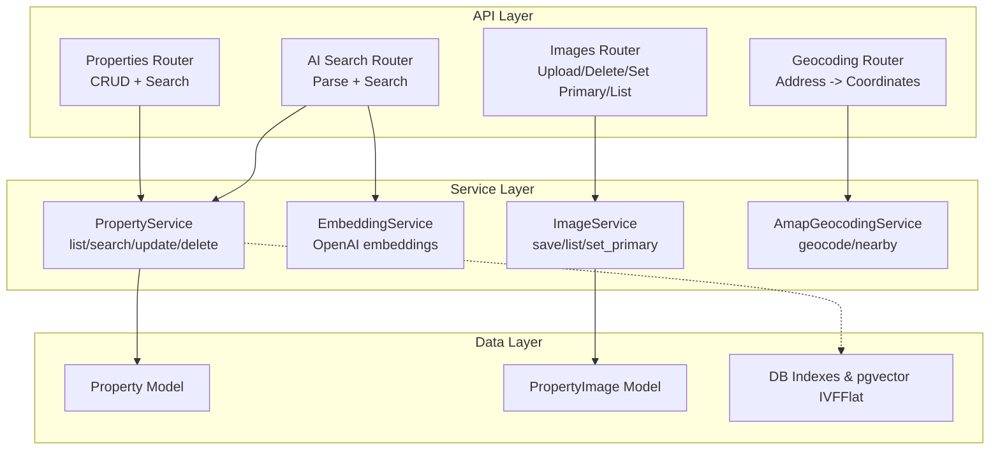
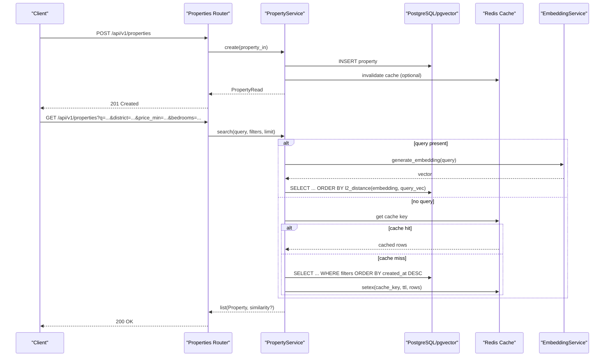
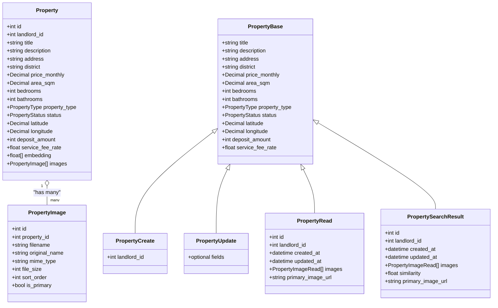
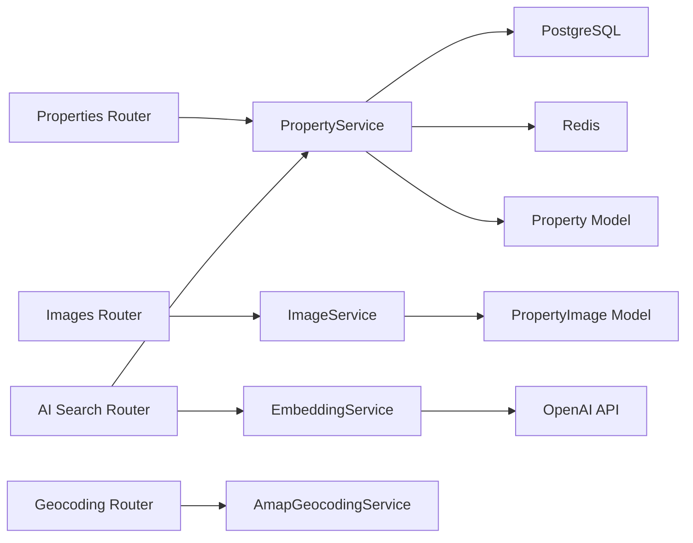

# Property Management APIs

<cite>
**Referenced Files in This Document**
- [properties.py](file://backend/app/api/v1/routes/properties.py)
- [ai_search.py](file://backend/app/api/v1/routes/ai_search.py)
- [images.py](file://backend/app/api/v1/routes/images.py)
- [geocoding.py](file://backend/app/api/v1/routes/geocoding.py)
- [property_service.py](file://backend/app/services/property_service.py)
- [embedding_service.py](file://backend/app/services/embedding_service.py)
- [property.py](file://backend/app/models/property.py)
- [property_image.py](file://backend/app/models/property_image.py)
- [property_schema.py](file://backend/app/schemas/property.py)
- [property_image_schema.py](file://backend/app/schemas/property_image.py)
- [ai_search_schema.py](file://backend/app/schemas/ai_search.py)
- [indexes.py](file://backend/app/db/indexes.py)
- [config.py](file://backend/app/core/config.py)
</cite>

## Table of Contents
1. [Introduction](#introduction)
2. [Project Structure](#project-structure)
3. [Core Components](#core-components)
4. [Architecture Overview](#architecture-overview)
5. [Detailed Component Analysis](#detailed-component-analysis)
6. [Dependency Analysis](#dependency-analysis)
7. [Performance Considerations](#performance-considerations)
8. [Troubleshooting Guide](#troubleshooting-guide)
9. [Conclusion](#conclusion)

## Introduction
This document provides comprehensive API documentation for property management endpoints, including CRUD operations, semantic search with natural language queries, advanced filtering by location, price, bedrooms, and property type, image upload integration, geospatial support, pagination, sorting, and performance considerations for large datasets.

## Project Structure
The property-related functionality is implemented across FastAPI routes, Pydantic schemas, SQLAlchemy models, and services:
- Routes define HTTP endpoints for properties, images, AI search, and geocoding.
- Schemas define request/response validation and serialization.
- Models define database tables and relationships.
- Services encapsulate business logic, caching, embeddings, and external integrations.

**Diagram sources**
- [properties.py:16-162](file://backend/app/api/v1/routes/properties.py#L16-L162)
- [images.py:26-151](file://backend/app/api/v1/routes/images.py#L26-L151)
- [ai_search.py:80-160](file://backend/app/api/v1/routes/ai_search.py#L80-L160)
- [geocoding.py:9-25](file://backend/app/api/v1/routes/geocoding.py#L9-L25)
- [property_service.py:44-239](file://backend/app/services/property_service.py#L44-L239)
- [embedding_service.py:17-32](file://backend/app/services/embedding_service.py#L17-L32)
- [property.py:38-86](file://backend/app/models/property.py#L38-L86)
- [property_image.py:8-23](file://backend/app/models/property_image.py#L8-L23)
- [indexes.py:16-48](file://backend/app/db/indexes.py#L16-L48)

**Section sources**
- [properties.py:16-162](file://backend/app/api/v1/routes/properties.py#L16-L162)
- [ai_search.py:80-160](file://backend/app/api/v1/routes/ai_search.py#L80-L160)
- [images.py:26-151](file://backend/app/api/v1/routes/images.py#L26-L151)
- [geocoding.py:9-25](file://backend/app/api/v1/routes/geocoding.py#L9-L25)
- [property_service.py:44-239](file://backend/app/services/property_service.py#L44-L239)
- [embedding_service.py:17-32](file://backend/app/services/embedding_service.py#L17-L32)
- [property.py:38-86](file://backend/app/models/property.py#L38-L86)
- [property_image.py:8-23](file://backend/app/models/property_image.py#L8-L23)
- [indexes.py:16-48](file://backend/app/db/indexes.py#L16-L48)

## Core Components
- Properties CRUD and listing with filters are exposed via the properties router.
- Semantic search endpoint supports natural language queries combined with structured filters.
- Image management endpoints allow uploading, deleting, setting primary, and listing images per property.
- Geocoding endpoint converts addresses to coordinates using AMap.
- Property service implements list/search/update/delete with optional Redis caching and async embedding task dispatching.
- Embedding service generates vector embeddings via OpenAI for semantic similarity search.
- Database indexes include composite indexes on district/status and an optional IVFFlat index on embeddings for fast vector search.

**Section sources**
- [properties.py:16-162](file://backend/app/api/v1/routes/properties.py#L16-L162)
- [ai_search.py:80-160](file://backend/app/api/v1/routes/ai_search.py#L80-L160)
- [images.py:26-151](file://backend/app/api/v1/routes/images.py#L26-L151)
- [geocoding.py:9-25](file://backend/app/api/v1/routes/geocoding.py#L9-L25)
- [property_service.py:75-195](file://backend/app/services/property_service.py#L75-L195)
- [embedding_service.py:17-32](file://backend/app/services/embedding_service.py#L17-L32)
- [indexes.py:16-48](file://backend/app/db/indexes.py#L16-L48)

## Architecture Overview
The property management system follows a layered architecture:
- API layer (FastAPI routers) handles HTTP requests, validates inputs, and enforces authorization.
- Service layer performs business logic, interacts with DB, caches results, and orchestrates embeddings.
- Data layer uses SQLAlchemy models and PostgreSQL with pgvector for vector similarity search.

**Diagram sources**
- [properties.py:16-91](file://backend/app/api/v1/routes/properties.py#L16-L91)
- [property_service.py:91-195](file://backend/app/services/property_service.py#L91-L195)
- [embedding_service.py:17-32](file://backend/app/services/embedding_service.py#L17-L32)
- [indexes.py:16-48](file://backend/app/db/indexes.py#L16-L48)

## Detailed Component Analysis

### Properties Endpoints
- Create property
  - Method: POST
  - Path: /api/v1/properties
  - Auth: Landlord required; admin can create for any landlord_id
  - Request body: PropertyCreate schema fields
  - Response: PropertyRead with id, timestamps, images array, and derived primary_image_url
  - Validation rules: title length, address/district lengths, non-negative price, positive area if provided, bedroom/bathroom non-negative, valid enums for property_type and status, latitude/longitude bounds
  - Status codes: 201 Created, 403 Forbidden, 422 Unprocessable Entity (invalid landlord_id or validation errors), 404 Not Found (if update/delete path used)

- List properties
  - Method: GET
  - Path: /api/v1/properties
  - Query parameters:
    - skip: integer >= 0 (pagination offset)
    - limit: integer between 1 and 100 (page size)
    - district: string filter
    - status: string filter (alias "status")
  - Sorting: default order by created_at descending
  - Response: list[PropertyRead]

- Get property by ID
  - Method: GET
  - Path: /api/v1/properties/{id}
  - Response: PropertyRead
  - Error: 404 Not Found if not found

- Update property
  - Method: PATCH
  - Path: /api/v1/properties/{id}
  - Auth: Landlord required; admin can update any property
  - Request body: PropertyUpdate schema fields (partial updates allowed)
  - Response: PropertyRead
  - Authorization: landlords can only update their own properties
  - Error: 404 Not Found, 403 Forbidden

- Delete property
  - Method: DELETE
  - Path: /api/v1/properties/{id}
  - Auth: Landlord required; admin can delete any property
  - Authorization: landlords can only delete their own properties
  - Response: 204 No Content
  - Error: 404 Not Found, 403 Forbidden

- Search properties (semantic + filters)
  - Method: GET
  - Path: /api/v1/properties/search
  - Query parameters:
    - q: natural language query (optional)
    - district: string filter
    - price_min: decimal >= 0 (optional)
    - price_max: decimal >= 0 (optional)
    - bedrooms: integer >= 0 (optional)
    - property_type: enum value (optional)
    - limit: integer between 1 and 100
  - Behavior:
    - If q is provided, computes embedding and ranks by L2 distance to property embeddings
    - If q is absent, applies filters and sorts by created_at desc
    - Non-vector searches are cached in Redis with TTL
  - Response: list[PropertySearchResult] including images and similarity score when applicable

**Section sources**
- [properties.py:16-162](file://backend/app/api/v1/routes/properties.py#L16-L162)
- [property_schema.py:11-79](file://backend/app/schemas/property.py#L11-L79)
- [property_service.py:75-195](file://backend/app/services/property_service.py#L75-L195)

### AI Search Endpoints
- Parse natural language query
  - Method: POST
  - Path: /api/v1/ai-search/parse
  - Request body: ParseRequest with query string
  - Response: ParseResponse containing parsed params and completeness report
  - Errors: 502/503 if LLM unavailable

- AI-powered search
  - Method: POST
  - Path: /api/v1/ai-search/search
  - Request body: AiSearchRequest with query, district, price_min/max, bedrooms, property_type, keywords, limit
  - Behavior:
    - Builds search_query from query + district + keywords
    - Calls PropertyService.search with combined filters
    - Generates summary for top 3 results using LLM (graceful fallback if unavailable)
  - Response: AiSearchResponse with summary, top_ids, results, total_count, search_params

**Section sources**
- [ai_search.py:80-160](file://backend/app/api/v1/routes/ai_search.py#L80-L160)
- [ai_search_schema.py:1-74](file://backend/app/schemas/ai_search.py#L1-74)
- [property_service.py:91-195](file://backend/app/services/property_service.py#L91-L195)

### Image Upload and Management
- Upload images
  - Method: POST
  - Path: /api/v1/properties/{property_id}/images
  - Auth: Landlord required; admin can manage any property’s images
  - Form data: files (multipart list of UploadFile)
  - Validation:
    - Allowed MIME types from configuration
    - Max file size from configuration
    - Max images per property enforced
  - Response: list[PropertyImageRead]
  - Errors: 400 Bad Request (type/size/count), 403 Forbidden, 404 Not Found

- Delete image
  - Method: DELETE
  - Path: /api/v1/properties/{property_id}/images/{image_id}
  - Auth: Landlord required
  - Response: 204 No Content
  - Errors: 404 Not Found, 403 Forbidden

- Set primary image
  - Method: PATCH
  - Path: /api/v1/properties/{property_id}/images/{image_id}/primary
  - Auth: Landlord required
  - Response: PropertyImageRead
  - Errors: 404 Not Found, 403 Forbidden

- List images
  - Method: GET
  - Path: /api/v1/properties/{property_id}/images
  - Response: list[PropertyImageRead]
  - Errors: 404 Not Found

**Section sources**
- [images.py:26-151](file://backend/app/api/v1/routes/images.py#L26-L151)
- [property_image_schema.py:1-22](file://backend/app/schemas/property_image.py#L1-22)
- [property_image.py:8-23](file://backend/app/models/property_image.py#L8-L23)
- [config.py:99-105](file://backend/app/core/config.py#L99-L105)

### Geospatial Support
- Geocode address
  - Method: POST
  - Path: /api/v1/geo/geocode
  - Request body: GeocodeRequest with address and city
  - Response: GeocodeResponse with coordinates
  - Errors: 400 Bad Request (invalid input), 503 Service Unavailable (external service error)

Note: The Property model includes latitude and longitude fields for storing coordinates. These can be populated via geocoding workflows.

**Section sources**
- [geocoding.py:9-25](file://backend/app/api/v1/routes/geocoding.py#L9-L25)
- [property.py:72-73](file://backend/app/models/property.py#L72-L73)

### Data Models and Schemas
- Property model defines core fields, constraints, and relationships including images and POI association.
- PropertyImage model stores metadata for uploaded images and links to properties.
- Schemas enforce validation rules and provide response shapes.

**Diagram sources**
- [property.py:38-86](file://backend/app/models/property.py#L38-L86)
- [property_image.py:8-23](file://backend/app/models/property_image.py#L8-L23)
- [property_schema.py:11-79](file://backend/app/schemas/property.py#L11-L79)
- [property_image_schema.py:1-22](file://backend/app/schemas/property_image.py#L1-22)

**Section sources**
- [property.py:38-86](file://backend/app/models/property.py#L38-L86)
- [property_image.py:8-23](file://backend/app/models/property_image.py#L8-L23)
- [property_schema.py:11-79](file://backend/app/schemas/property.py#L11-L79)
- [property_image_schema.py:1-22](file://backend/app/schemas/property_image.py#L1-22)

## Dependency Analysis
- Route dependencies:
  - Properties router depends on PropertyService and User dependency for authorization.
  - Images router depends on PropertyService and ImageService.
  - AI search router depends on PropertyService and LLM service.
  - Geocoding router depends on AmapGeocodingService.
- Service dependencies:
  - PropertyService uses SQLAlchemy session, optional Redis client, and dispatches embedding tasks asynchronously.
  - EmbeddingService uses OpenAI Async client configured via settings.
- Data dependencies:
  - Property model has relationship to PropertyImage and POI.
  - Indexes optimize district/status queries and vector similarity search.

**Diagram sources**
- [properties.py:16-162](file://backend/app/api/v1/routes/properties.py#L16-L162)
- [images.py:26-151](file://backend/app/api/v1/routes/images.py#L26-L151)
- [ai_search.py:80-160](file://backend/app/api/v1/routes/ai_search.py#L80-L160)
- [geocoding.py:9-25](file://backend/app/api/v1/routes/geocoding.py#L9-L25)
- [property_service.py:44-239](file://backend/app/services/property_service.py#L44-L239)
- [embedding_service.py:17-32](file://backend/app/services/embedding_service.py#L17-L32)
- [property.py:38-86](file://backend/app/models/property.py#L38-L86)
- [property_image.py:8-23](file://backend/app/models/property_image.py#L8-L23)

**Section sources**
- [properties.py:16-162](file://backend/app/api/v1/routes/properties.py#L16-L162)
- [images.py:26-151](file://backend/app/api/v1/routes/images.py#L26-L151)
- [ai_search.py:80-160](file://backend/app/api/v1/routes/ai_search.py#L80-L160)
- [geocoding.py:9-25](file://backend/app/api/v1/routes/geocoding.py#L9-L25)
- [property_service.py:44-239](file://backend/app/services/property_service.py#L44-L239)
- [embedding_service.py:17-32](file://backend/app/services/embedding_service.py#L17-L32)
- [property.py:38-86](file://backend/app/models/property.py#L38-L86)
- [property_image.py:8-23](file://backend/app/models/property_image.py#L8-L23)

## Performance Considerations
- Caching:
  - Non-vector search results are cached in Redis with a configurable TTL. Keys are deterministic based on filter parameters.
- Vector search optimization:
  - IVFFlat index on embeddings is created automatically when row count exceeds threshold; lists parameter adapts to sqrt(row_count).
- Pagination and limits:
  - Listing and search endpoints enforce max page sizes to prevent heavy responses.
- Asynchronous embedding generation:
  - Embedding tasks are dispatched in background threads to avoid blocking requests.
- Composite indexes:
  - District and status composite index improves filtered listing performance.

Recommendations:
- Tune Redis TTL and eviction policies according to traffic patterns.
- Monitor pgvector index rebuilds and recall/performance trade-offs.
- Use appropriate limit values and consider client-side pagination UX.
- Ensure embedding vectors exist before relying on semantic search; fall back to filter-based ranking when embeddings are missing.

**Section sources**
- [property_service.py:22-41](file://backend/app/services/property_service.py#L22-L41)
- [property_service.py:102-195](file://backend/app/services/property_service.py#L102-L195)
- [indexes.py:16-48](file://backend/app/db/indexes.py#L16-L48)
- [property.py:45-46](file://backend/app/models/property.py#L45-L46)

## Troubleshooting Guide
Common issues and resolutions:
- 403 Forbidden on create/update/delete:
  - Ensure the current user is a landlord and owns the property (or is admin).
- 404 Not Found:
  - Verify property exists before update/delete; check IDs and access permissions.
- 400 Bad Request on image uploads:
  - Check MIME types and file sizes against configuration; ensure total images do not exceed per-property limit.
- 502/503 on AI search or geocoding:
  - External LLM or map services may be unavailable; implement retries and graceful fallbacks.
- Slow search performance:
  - Confirm Redis availability for caching; verify pgvector IVFFlat index creation; adjust limit and filters.

Operational checks:
- Validate environment variables for Redis, OpenAI keys, and AMap keys.
- Inspect logs for embedding task dispatch failures and POI generation exceptions.

**Section sources**
- [images.py:52-71](file://backend/app/api/v1/routes/images.py#L52-L71)
- [ai_search.py:86-90](file://backend/app/api/v1/routes/ai_search.py#L86-L90)
- [geocoding.py:14-23](file://backend/app/api/v1/routes/geocoding.py#L14-L23)
- [property_service.py:54-60](file://backend/app/services/property_service.py#L54-L60)
- [config.py:24-24](file://backend/app/core/config.py#L24-L24)

## Conclusion
The property management APIs provide robust CRUD operations, flexible filtering, semantic search powered by embeddings, image management, and geospatial capabilities. With caching, indexing, and asynchronous processing, the system scales well for large datasets while maintaining responsive user experiences. Proper authentication, validation, and error handling ensure reliability and security.