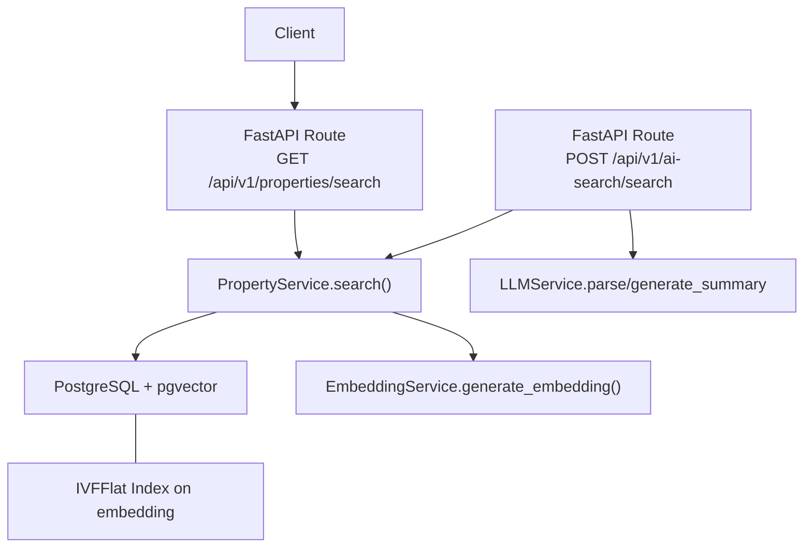
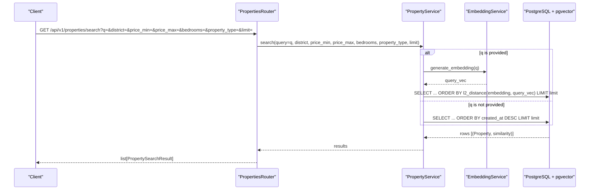
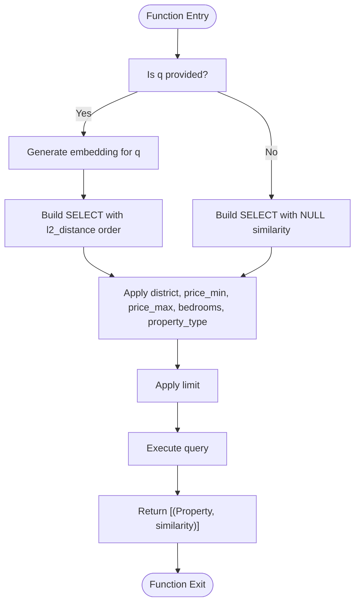
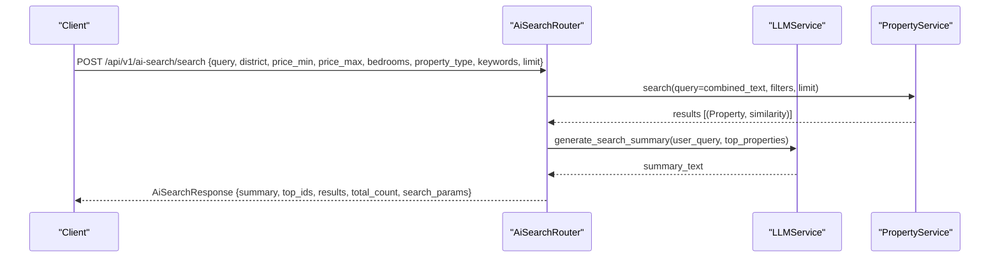
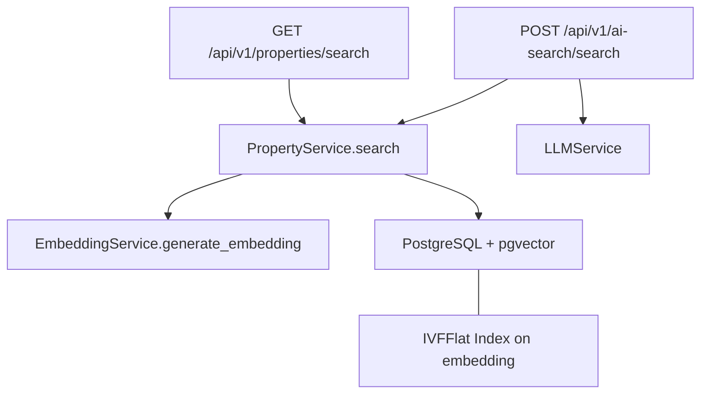

# Semantic Search & Filtering

<cite>
**Referenced Files in This Document**
- [properties.py](file://backend/app/api/v1/routes/properties.py)
- [property_service.py](file://backend/app/services/property_service.py)
- [ai_search.py](file://backend/app/api/v1/routes/ai_search.py)
- [ai_search_schemas.py](file://backend/app/schemas/ai_search.py)
- [property_schema.py](file://backend/app/schemas/property.py)
- [embedding_service.py](file://backend/app/services/embedding_service.py)
- [llm_service.py](file://backend/app/services/llm_service.py)
- [property_model.py](file://backend/app/models/property.py)
- [indexes.py](file://backend/app/db/indexes.py)
- [pgvector_migration.py](file://backend/alembic/versions/20260620_0002_pgvector_embedding.py)
- [enable_vector.sql](file://docker/pg-init/00-enable-vector.sql)
- [test_search.py](file://backend/tests/test_search.py)
</cite>

## Table of Contents
1. [Introduction](#introduction)
2. [Project Structure](#project-structure)
3. [Core Components](#core-components)
4. [Architecture Overview](#architecture-overview)
5. [Detailed Component Analysis](#detailed-component-analysis)
6. [Dependency Analysis](#dependency-analysis)
7. [Performance Considerations](#performance-considerations)
8. [Troubleshooting Guide](#troubleshooting-guide)
9. [Conclusion](#conclusion)
10. [Appendices](#appendices)

## Introduction
This document provides comprehensive API documentation for property semantic search and advanced filtering, focusing on the GET /api/v1/properties/search endpoint. It explains natural language query support via the q parameter, district-based search, price range filtering (price_min, price_max with ge=0 validation), bedroom count filtering (bedrooms with ge=0), and property_type filtering. It also documents the PropertySearchResult response schema including similarity scores for ranking results, pagination via the limit parameter (ge=1, le=100), and performance considerations for large datasets. Practical examples are provided to demonstrate natural language queries like "affordable studio near university," multi-criteria searches combining location and price filters, and result interpretation using similarity scoring. Query optimization techniques and search performance tuning recommendations are included.

## Project Structure
The semantic search feature spans FastAPI routes, service layer logic, Pydantic schemas, database models, embedding generation, and optional LLM-powered parsing and summarization. The core route is defined under the properties router, while the AI-powered search flow uses a separate AI search router that composes structured parameters and invokes the same underlying search service.

**Diagram sources**
- [properties.py:36-91](file://backend/app/api/v1/routes/properties.py#L36-L91)
- [ai_search.py:98-160](file://backend/app/api/v1/routes/ai_search.py#L98-L160)
- [property_service.py:91-195](file://backend/app/services/property_service.py#L91-L195)
- [embedding_service.py:17-32](file://backend/app/services/embedding_service.py#L17-L32)
- [llm_service.py:106-198](file://backend/app/services/llm_service.py#L106-L198)
- [indexes.py:16-48](file://backend/app/db/indexes.py#L16-L48)

**Section sources**
- [properties.py:36-91](file://backend/app/api/v1/routes/properties.py#L36-L91)
- [ai_search.py:98-160](file://backend/app/api/v1/routes/ai_search.py#L98-L160)
- [property_service.py:91-195](file://backend/app/services/property_service.py#L91-L195)
- [embedding_service.py:17-32](file://backend/app/services/embedding_service.py#L17-L32)
- [llm_service.py:106-198](file://backend/app/services/llm_service.py#L106-L198)
- [indexes.py:16-48](file://backend/app/db/indexes.py#L16-L48)

## Core Components
- GET /api/v1/properties/search: Accepts natural language query via q and filters (district, price_min, price_max, bedrooms, property_type). Returns a list of PropertySearchResult objects with optional similarity scores when vector search is used.
- PropertyService.search(): Implements both exact filter-only queries and vector similarity search when q is provided. Applies district, price range, bedroom count, and property type filters. Supports Redis caching for non-vector queries.
- PropertySearchResult: Response schema includes all property fields plus images and an optional similarity score for ranking.
- EmbeddingService: Generates embeddings for text using OpenAI-compatible APIs; used to convert q into a vector for similarity search.
- AI Search Router (optional): Provides POST /api/v1/ai-search endpoints for parsing natural language into structured parameters and generating summaries. Uses LLMService for parsing and summarization.

Key behaviors:
- Natural language queries (q) trigger vector similarity search using l2_distance over stored embeddings.
- Filters are applied as SQL WHERE clauses after or alongside similarity ordering.
- Results include similarity values when vector search is active; otherwise similarity is null.
- Pagination is controlled by limit (ge=1, le=100); no offset parameter is provided for this endpoint.

**Section sources**
- [properties.py:36-91](file://backend/app/api/v1/routes/properties.py#L36-L91)
- [property_service.py:91-195](file://backend/app/services/property_service.py#L91-L195)
- [property_schema.py:64-79](file://backend/app/schemas/property.py#L64-L79)
- [embedding_service.py:17-32](file://backend/app/services/embedding_service.py#L17-L32)
- [ai_search.py:98-160](file://backend/app/api/v1/routes/ai_search.py#L98-L160)
- [ai_search_schemas.py:52-73](file://backend/app/schemas/ai_search.py#L52-L73)

## Architecture Overview
The search architecture combines traditional filtering with semantic vector search. When q is present, the system generates an embedding for the query and performs similarity ranking against property embeddings. Filters narrow the candidate set before limiting results. Non-vector searches can be cached in Redis to improve performance.

**Diagram sources**
- [properties.py:36-91](file://backend/app/api/v1/routes/properties.py#L36-L91)
- [property_service.py:135-168](file://backend/app/services/property_service.py#L135-L168)
- [embedding_service.py:23-32](file://backend/app/services/embedding_service.py#L23-L32)

## Detailed Component Analysis

### Endpoint: GET /api/v1/properties/search
- Purpose: Retrieve properties matching natural language query and/or filters.
- Parameters:
  - q: Optional natural language query string. Triggers vector similarity search when provided.
  - district: Optional string filter for district.
  - price_min: Optional Decimal >= 0.
  - price_max: Optional Decimal >= 0.
  - bedrooms: Optional integer >= 0.
  - property_type: Optional string filter (e.g., apartment, house, studio, shared).
  - limit: Integer between 1 and 100 (default 20). Controls number of results returned.
- Response: Array of PropertySearchResult objects. Each object includes property details, images, and similarity (float or null).
- Behavior:
  - If q is provided, similarity ranking is computed using l2_distance over embeddings.
  - Filters are applied as additional WHERE conditions.
  - Results are limited by limit.
  - Similarity is null when q is not provided.

Example usage patterns:
- Natural language: q="affordable studio near university", limit=20
- Multi-criteria: district="SIP", price_min=4000, price_max=6000, bedrooms=2, property_type="apartment", limit=50

**Section sources**
- [properties.py:36-91](file://backend/app/api/v1/routes/properties.py#L36-L91)
- [test_search.py:30-77](file://backend/tests/test_search.py#L30-L77)

### Service Layer: PropertyService.search
- Responsibilities:
  - Build SQL query based on presence of q and filters.
  - Generate embedding for q if provided.
  - Apply district, price_min, price_max, bedrooms, property_type filters.
  - Order by similarity (if q) or created_at desc (if not q).
  - Limit results.
  - Cache non-vector results in Redis with TTL.
- Complexity:
  - Vector search involves embedding generation (external API call) and l2_distance computation.
  - Filter-only queries are cacheable and typically faster.
- Error handling:
  - Graceful fallback when Redis is unavailable.
  - Logging for cache misses/failures.

**Diagram sources**
- [property_service.py:91-195](file://backend/app/services/property_service.py#L91-L195)

**Section sources**
- [property_service.py:91-195](file://backend/app/services/property_service.py#L91-L195)

### Response Schema: PropertySearchResult
- Fields: All base property fields (title, description, address, district, price_monthly, area_sqm, bedrooms, bathrooms, property_type, status, latitude, longitude, timestamps), images array, and similarity (float | None).
- Similarity semantics: Lower l2_distance indicates higher similarity when q is provided; null when q is absent.

**Section sources**
- [property_schema.py:64-79](file://backend/app/schemas/property.py#L64-L79)

### AI-Powered Search (Optional Flow)
- POST /api/v1/ai-search/parse: Parses natural language into structured parameters and completeness report using LLMService.
- POST /api/v1/ai-search/search: Executes search using PropertyService.search and optionally generates summary using LLMService.
- Request/response schemas are defined in ai_search_schemas.py.

**Diagram sources**
- [ai_search.py:98-160](file://backend/app/api/v1/routes/ai_search.py#L98-L160)
- [ai_search_schemas.py:52-73](file://backend/app/schemas/ai_search.py#L52-L73)
- [llm_service.py:150-198](file://backend/app/services/llm_service.py#L150-L198)

**Section sources**
- [ai_search.py:98-160](file://backend/app/api/v1/routes/ai_search.py#L98-L160)
- [ai_search_schemas.py:52-73](file://backend/app/schemas/ai_search.py#L52-L73)
- [llm_service.py:150-198](file://backend/app/services/llm_service.py#L150-L198)

## Dependency Analysis
- Route depends on PropertyService for search logic.
- PropertyService depends on EmbeddingService for vector generation and PostgreSQL + pgvector for similarity search.
- AI search route depends on LLMService for parsing and summarization.
- Database indexes optimize vector search performance (IVFFlat index on embedding).

**Diagram sources**
- [properties.py:36-91](file://backend/app/api/v1/routes/properties.py#L36-L91)
- [property_service.py:91-195](file://backend/app/services/property_service.py#L91-L195)
- [embedding_service.py:17-32](file://backend/app/services/embedding_service.py#L17-L32)
- [ai_search.py:98-160](file://backend/app/api/v1/routes/ai_search.py#L98-L160)
- [indexes.py:16-48](file://backend/app/db/indexes.py#L16-L48)

**Section sources**
- [properties.py:36-91](file://backend/app/api/v1/routes/properties.py#L36-L91)
- [property_service.py:91-195](file://backend/app/services/property_service.py#L91-L195)
- [embedding_service.py:17-32](file://backend/app/services/embedding_service.py#L17-L32)
- [ai_search.py:98-160](file://backend/app/api/v1/routes/ai_search.py#L98-L160)
- [indexes.py:16-48](file://backend/app/db/indexes.py#L16-L48)

## Performance Considerations
- Vector search overhead: Generating embeddings for each query incurs external API latency. Prefer batching or caching where possible.
- Indexing: IVFFlat index on embedding improves recall/performance for large datasets. For small datasets (<1000 rows), exact scan may be preferred.
- Caching: Non-vector filter-only queries are cached in Redis with TTL to reduce repeated DB load.
- Limits: Use limit to cap result sets; default is 20, maximum is 100.
- Ordering: Without q, results are ordered by created_at desc; with q, ordered by similarity (l2_distance ascending).
- Monitoring: Use EXPLAIN ANALYZE utilities to inspect query plans and tune indexes.

Recommendations:
- Keep limit conservative for high-traffic endpoints.
- Ensure embeddings exist for properties to enable vector search.
- Tune IVFFlat lists parameter based on dataset size.
- Monitor Redis availability and handle failures gracefully.

**Section sources**
- [property_service.py:102-195](file://backend/app/services/property_service.py#L102-L195)
- [indexes.py:16-48](file://backend/app/db/indexes.py#L16-L48)
- [pgvector_migration.py:21-35](file://backend/alembic/versions/20260620_0002_pgvector_embedding.py#L21-L35)
- [enable_vector.sql:1-2](file://docker/pg-init/00-enable-vector.sql#L1-L2)

## Troubleshooting Guide
Common issues and resolutions:
- No results for natural language query: Ensure embeddings are generated and available for properties. Verify q is correctly passed and not empty.
- High latency: Check embedding service availability and network latency. Consider reducing limit or enabling caching for frequent filter-only queries.
- Invalid parameters: Validate price_min, price_max, bedrooms constraints (ge=0). Ensure limit within [1, 100].
- Missing pgvector extension: Confirm vector extension is enabled in PostgreSQL.
- Redis unavailable: Search still works without caching; logs indicate fallback behavior.

Validation checks:
- Price range: price_min and price_max must be >= 0.
- Bedrooms: Must be >= 0.
- Limit: Must be between 1 and 100.

**Section sources**
- [properties.py:36-46](file://backend/app/api/v1/routes/properties.py#L36-L46)
- [property_service.py:102-195](file://backend/app/services/property_service.py#L102-L195)
- [enable_vector.sql:1-2](file://docker/pg-init/00-enable-vector.sql#L1-L2)

## Conclusion
The GET /api/v1/properties/search endpoint provides robust property search capabilities combining natural language understanding with precise filtering. With vector similarity ranking, structured filters, and optional AI-powered parsing and summarization, it supports diverse user intents. Proper indexing, caching, and parameter validation ensure efficient and reliable performance across varying dataset sizes.

## Appendices

### Example Queries and Interpretation
- Natural language: q="affordable studio near university"
  - Expect similarity-ranked results; lower l2_distance indicates better match.
- Multi-criteria: district="SIP", price_min=4000, price_max=6000, bedrooms=2, property_type="apartment", limit=50
  - Exact filters applied; similarity null unless q is provided.
- Result interpretation:
  - similarity field indicates ranking relevance when q is present.
  - Images array includes primary image URL via primary_image_url property.

**Section sources**
- [test_search.py:30-77](file://backend/tests/test_search.py#L30-L77)
- [property_schema.py:64-79](file://backend/app/schemas/property.py#L64-L79)