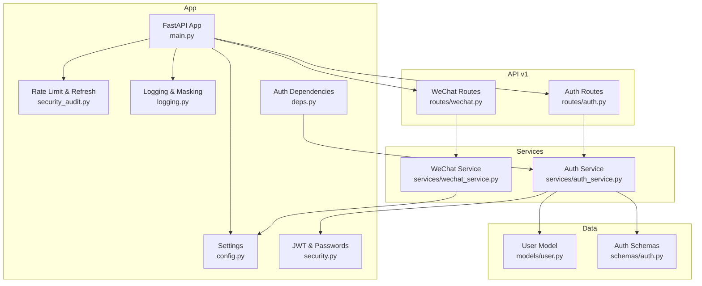
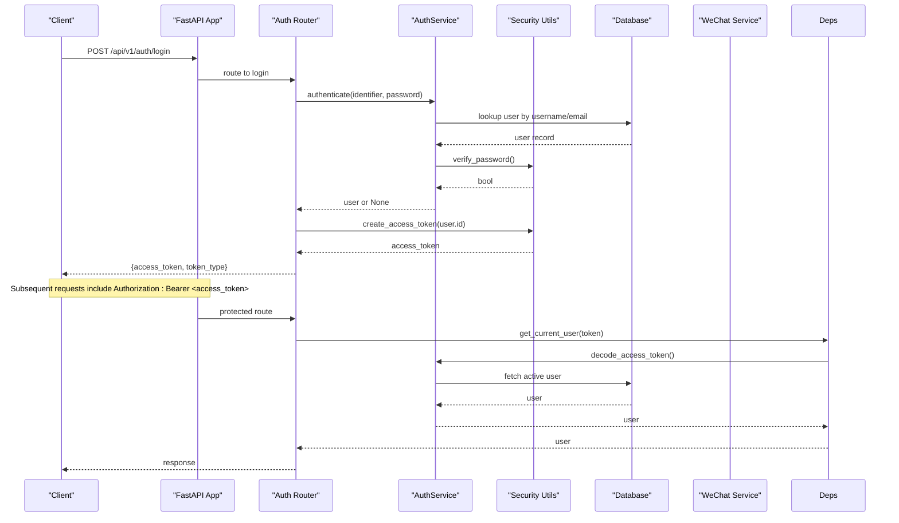
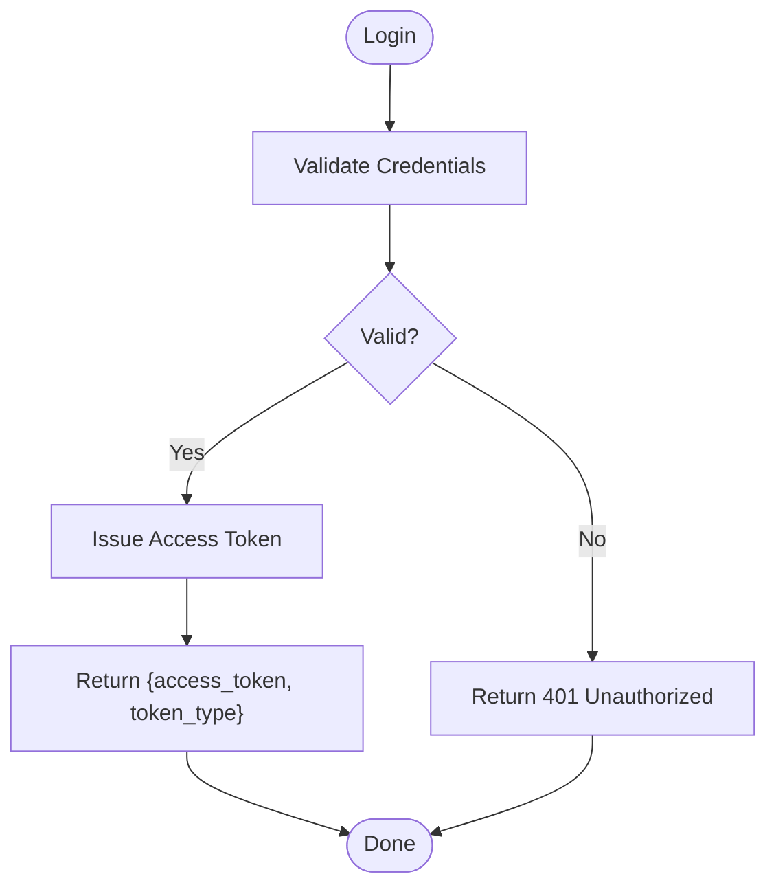
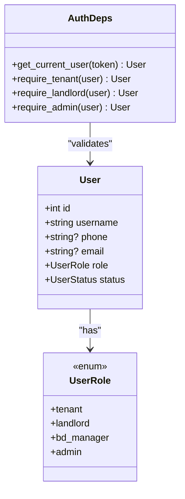
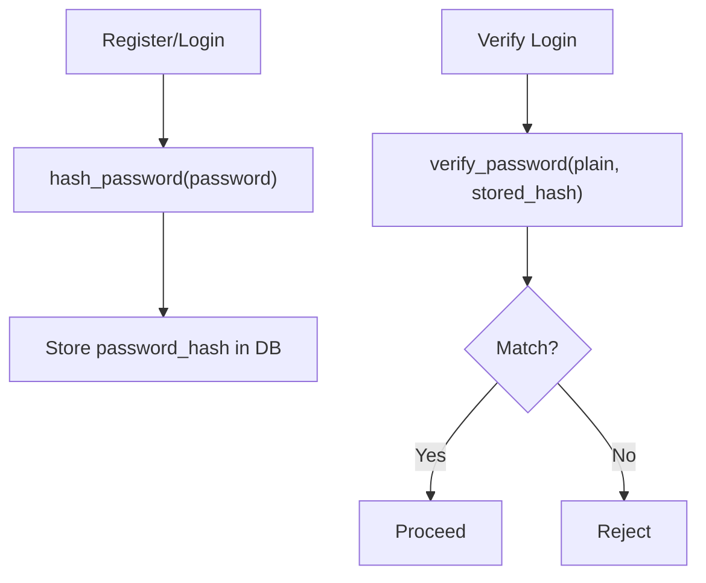
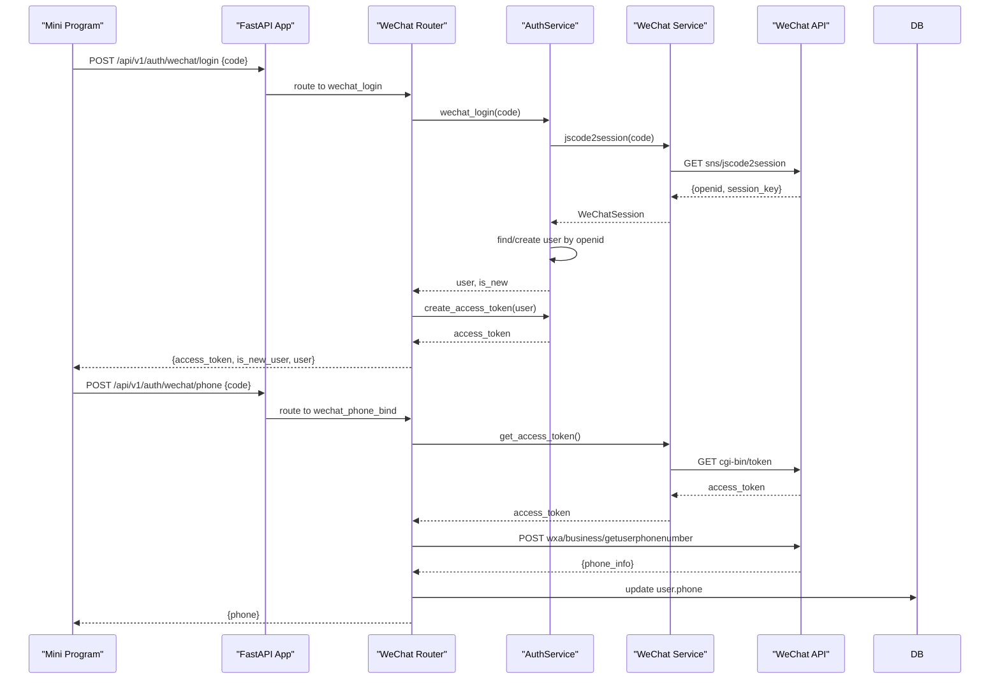
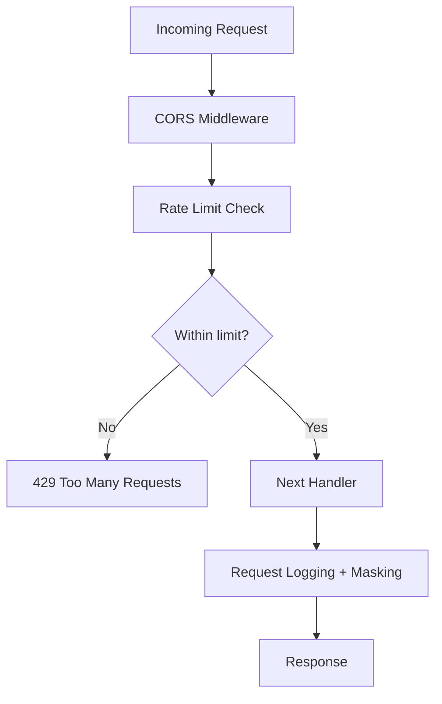
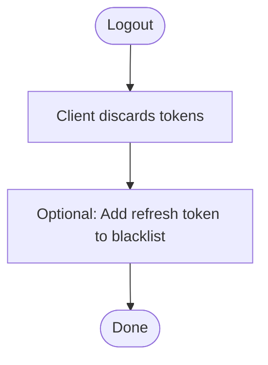
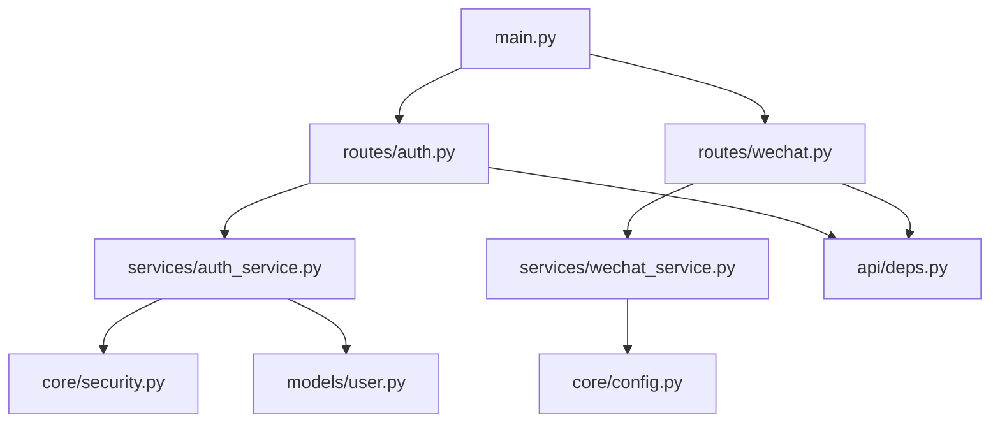

# Authentication & Security

<cite>
**Referenced Files in This Document**
- [main.py](file://backend/app/main.py)
- [config.py](file://backend/app/core/config.py)
- [security.py](file://backend/app/core/security.py)
- [security_audit.py](file://backend/app/core/security_audit.py)
- [logging.py](file://backend/app/core/logging.py)
- [deps.py](file://backend/app/api/deps.py)
- [auth.py](file://backend/app/api/v1/routes/auth.py)
- [wechat.py](file://backend/app/api/v1/routes/wechat.py)
- [auth_service.py](file://backend/app/services/auth_service.py)
- [wechat_service.py](file://backend/app/services/wechat_service.py)
- [user.py](file://backend/app/models/user.py)
- [auth.py](file://backend/app/schemas/auth.py)
- [test_auth.py](file://backend/tests/test_auth.py)
</cite>

## Table of Contents
1. [Introduction](#introduction)
2. [Project Structure](#project-structure)
3. [Core Components](#core-components)
4. [Architecture Overview](#architecture-overview)
5. [Detailed Component Analysis](#detailed-component-analysis)
6. [Dependency Analysis](#dependency-analysis)
7. [Performance Considerations](#performance-considerations)
8. [Troubleshooting Guide](#troubleshooting-guide)
9. [Conclusion](#conclusion)
10. [Appendices](#appendices)

## Introduction
This document explains the authentication and security implementation across all platforms for the rental housing system. It covers JWT-based authentication with access and refresh tokens, multi-role authorization (tenant, landlord, BD manager, administrator), bcrypt password hashing, WeChat Mini Program login and phone binding, middleware for CORS and rate limiting, input validation, SQL injection prevention, logging and sensitive data masking, OWASP Top 10 compliance measures, session management, logout procedures, token revocation strategies, protected routes, role-based access control, secure API endpoints, and recommendations for security audits and penetration testing.

## Project Structure
The backend is a FastAPI application organized by features:
- Core: configuration, security primitives, audit utilities, logging, monitoring
- API v1: routers for auth, WeChat integration, and domain resources
- Services: business logic for authentication, WeChat, users, etc.
- Models and Schemas: database models and request/response schemas
- Tests: end-to-end and unit tests for auth flows

**Diagram sources**
- [main.py:17-78](file://backend/app/main.py#L17-L78)
- [config.py:7-167](file://backend/app/core/config.py#L7-L167)
- [security.py:1-34](file://backend/app/core/security.py#L1-L34)
- [security_audit.py:49-149](file://backend/app/core/security_audit.py#L49-L149)
- [logging.py:124-168](file://backend/app/core/logging.py#L124-L168)
- [deps.py:19-57](file://backend/app/api/deps.py#L19-L57)
- [auth.py:14-94](file://backend/app/api/v1/routes/auth.py#L14-L94)
- [wechat.py:19-82](file://backend/app/api/v1/routes/wechat.py#L19-L82)
- [auth_service.py:14-77](file://backend/app/services/auth_service.py#L14-L77)
- [wechat_service.py:23-146](file://backend/app/services/wechat_service.py#L23-L146)
- [user.py:11-48](file://backend/app/models/user.py#L11-L48)
- [auth.py:8-63](file://backend/app/schemas/auth.py#L8-L63)

**Section sources**
- [main.py:17-78](file://backend/app/main.py#L17-L78)
- [config.py:7-167](file://backend/app/core/config.py#L7-L167)

## Core Components
- JWT and password hashing:
  - Access token creation/decoding using HS256 and configurable secret and algorithm.
  - Bcrypt password hashing via passlib CryptContext.
- Role-based authorization:
  - User roles: tenant, landlord, bd_manager, admin.
  - Dependency guards: require_tenant, require_landlord, require_admin.
- Rate limiting:
  - Redis-backed token-bucket style limiter per client IP + endpoint prefix.
- Logging and sensitive data masking:
  - Structured JSON logs in production; colored console logs in development.
  - Automatic masking of sensitive fields and patterns in logs.
- Configuration:
  - Environment-driven settings for CORS, rate limits, JWT parameters, WeChat app credentials, and more.

**Section sources**
- [security.py:9-34](file://backend/app/core/security.py#L9-L34)
- [deps.py:33-57](file://backend/app/api/deps.py#L33-L57)
- [security_audit.py:49-95](file://backend/app/core/security_audit.py#L49-L95)
- [logging.py:103-121](file://backend/app/core/logging.py#L103-L121)
- [config.py:26-44](file://backend/app/core/config.py#L26-L44)

## Architecture Overview
High-level flow for authentication and authorization:
- Clients authenticate via username/password or WeChat Mini Program code exchange.
- Server issues short-lived access tokens and long-lived refresh tokens.
- Protected routes enforce identity and role checks via dependencies.
- Middleware enforces CORS, rate limiting, structured logging, and metrics.

**Diagram sources**
- [auth.py:37-60](file://backend/app/api/v1/routes/auth.py#L37-L60)
- [auth_service.py:29-38](file://backend/app/services/auth_service.py#L29-L38)
- [security.py:22-34](file://backend/app/core/security.py#L22-L34)
- [deps.py:19-30](file://backend/app/api/deps.py#L19-L30)

## Detailed Component Analysis

### JWT-Based Authentication Flow
- Token generation:
  - Access tokens contain subject (user id) and expiration; encoded with HS256 and configured secret.
  - Refresh tokens are created with type "refresh" and longer expiry.
- Token validation:
  - Access tokens decoded and validated; user must be active.
  - Refresh tokens verified and rotated on use.
- Rotation strategy:
  - On refresh, both new access and refresh tokens are issued.
  - Revocation can be implemented by maintaining a blacklist in Redis keyed by token jti or subject+exp.

**Diagram sources**
- [auth.py:37-60](file://backend/app/api/v1/routes/auth.py#L37-L60)
- [auth_service.py:37-38](file://backend/app/services/auth_service.py#L37-L38)
- [security.py:22-28](file://backend/app/core/security.py#L22-L28)

**Section sources**
- [security.py:22-34](file://backend/app/core/security.py#L22-L34)
- [security_audit.py:102-149](file://backend/app/core/security_audit.py#L102-L149)
- [auth.py:63-89](file://backend/app/api/v1/routes/auth.py#L63-L89)

### Multi-Role Authorization System
- Roles:
  - tenant, landlord, bd_manager, admin.
- Guards:
  - require_tenant: allows tenant or admin.
  - require_landlord: allows landlord or admin.
  - require_admin: requires admin only.
- Usage:
  - Apply guards as dependencies on routes to restrict access.

**Diagram sources**
- [user.py:11-42](file://backend/app/models/user.py#L11-L42)
- [deps.py:33-57](file://backend/app/api/deps.py#L33-L57)

**Section sources**
- [user.py:11-42](file://backend/app/models/user.py#L11-L42)
- [deps.py:33-57](file://backend/app/api/deps.py#L33-L57)

### Password Hashing with Bcrypt
- Implementation:
  - passlib CryptContext with bcrypt scheme.
  - hash_password and verify_password helpers.
- Best practices:
  - Use strong cost factor (>=12) in production.
  - Rotate hashes if upgrading algorithms.
  - Never log passwords or raw hashes.

**Diagram sources**
- [security.py:9-19](file://backend/app/core/security.py#L9-L19)
- [auth_service.py:19-35](file://backend/app/services/auth_service.py#L19-L35)

**Section sources**
- [security.py:9-19](file://backend/app/core/security.py#L9-L19)
- [auth_service.py:19-35](file://backend/app/services/auth_service.py#L19-L35)

### WeChat Mini Program Authentication Flow
- Code exchange:
  - Frontend calls wx.login() to obtain code.
  - Backend exchanges code for openid and session_key via WeChat API.
- User identification:
  - Lookup existing user by openid; create tenant user if not found.
- Phone number binding:
  - After login, call WeChat getuserphonenumber with access token and bind phone to user.

**Diagram sources**
- [wechat.py:19-74](file://backend/app/api/v1/routes/wechat.py#L19-L74)
- [auth_service.py:53-76](file://backend/app/services/auth_service.py#L53-L76)
- [wechat_service.py:45-88](file://backend/app/services/wechat_service.py#L45-L88)

**Section sources**
- [wechat.py:19-82](file://backend/app/api/v1/routes/wechat.py#L19-L82)
- [auth_service.py:53-76](file://backend/app/services/auth_service.py#L53-L76)
- [wechat_service.py:45-88](file://backend/app/services/wechat_service.py#L45-L88)

### Security Middleware and Headers
- CORS:
  - Allow origins from config; relaxed in development, tightened in production.
  - allow_credentials enabled for bearer tokens.
- Rate limiting:
  - Redis-backed middleware tracks requests per IP + path prefix; returns 429 when exceeded.
- Input validation:
  - Pydantic schemas validate requests; global handler returns structured errors.
- SQL injection prevention:
  - SQLAlchemy parameterized queries used throughout; no string concatenation for SQL.
- Security headers:
  - Configure additional headers (e.g., HSTS, X-Frame-Options) via custom middleware or reverse proxy.
- Sensitive data masking:
  - Request logging masks sensitive fields and patterns automatically.

**Diagram sources**
- [main.py:27-57](file://backend/app/main.py#L27-L57)
- [security_audit.py:49-95](file://backend/app/core/security_audit.py#L49-L95)
- [logging.py:124-168](file://backend/app/core/logging.py#L124-L168)

**Section sources**
- [main.py:27-57](file://backend/app/main.py#L27-L57)
- [security_audit.py:49-95](file://backend/app/core/security_audit.py#L49-L95)
- [logging.py:103-121](file://backend/app/core/logging.py#L103-L121)

### Session Management, Logout, and Token Revocation
- Stateless sessions:
  - No server-side sessions; stateless JWT approach.
- Logout:
  - Client discards tokens; optionally revoke refresh tokens by blacklisting in Redis.
- Token revocation:
  - Maintain a Redis set of revoked refresh tokens keyed by token identifier or subject+exp.
  - On refresh, check blacklist before issuing new tokens.

[No sources needed since this section provides general guidance]

### Protected Routes and Role-Based Access Control
- Protected routes:
  - Use get_current_user dependency to enforce authentication.
- Role-based access:
  - Apply require_tenant, require_landlord, require_admin on specific routes.
- Examples:
  - Tenant-only endpoints: depend on require_tenant.
  - Landlord-only endpoints: depend on require_landlord.
  - Admin-only endpoints: depend on require_admin.

**Section sources**
- [deps.py:19-57](file://backend/app/api/deps.py#L19-L57)

### Secure API Endpoints
- Authentication:
  - All protected endpoints require Authorization: Bearer <access_token>.
- Validation:
  - Pydantic schemas ensure inputs are valid and safe.
- Error handling:
  - Global handlers return consistent error structures without leaking internals.

**Section sources**
- [auth.py:14-94](file://backend/app/api/v1/routes/auth.py#L14-L94)
- [logging.py:170-231](file://backend/app/core/logging.py#L170-L231)

## Dependency Analysis
Key dependencies and relationships:
- FastAPI app composes middleware and routers.
- Auth router depends on AuthService and security utilities.
- WeChat router depends on AuthService and WeChatService.
- Dependencies module provides OAuth2PasswordBearer and role guards.

**Diagram sources**
- [main.py:17-78](file://backend/app/main.py#L17-L78)
- [auth.py:14-94](file://backend/app/api/v1/routes/auth.py#L14-L94)
- [wechat.py:19-82](file://backend/app/api/v1/routes/wechat.py#L19-L82)
- [auth_service.py:14-77](file://backend/app/services/auth_service.py#L14-L77)
- [wechat_service.py:23-146](file://backend/app/services/wechat_service.py#L23-L146)
- [security.py:1-34](file://backend/app/core/security.py#L1-L34)
- [user.py:11-48](file://backend/app/models/user.py#L11-L48)
- [config.py:7-167](file://backend/app/core/config.py#L7-L167)
- [deps.py:19-57](file://backend/app/api/deps.py#L19-L57)

**Section sources**
- [main.py:17-78](file://backend/app/main.py#L17-L78)
- [deps.py:19-57](file://backend/app/api/deps.py#L19-L57)

## Performance Considerations
- Short-lived access tokens reduce exposure window.
- Long-lived refresh tokens should be rotated and blacklisted upon revocation.
- Rate limiting protects against brute-force and abuse; tune thresholds per environment.
- Structured logging avoids excessive I/O overhead; consider sampling in high-throughput scenarios.
- Redis-backed rate limiter scales horizontally with shared state.

[No sources needed since this section provides general guidance]

## Troubleshooting Guide
Common issues and resolutions:
- Invalid or expired token:
  - Ensure Authorization header uses Bearer scheme and token is current.
  - Use refresh endpoint to obtain new tokens.
- Incorrect credentials:
  - Verify username/email and password; check user status is active.
- Rate limit exceeded:
  - Retry after Retry-After seconds; adjust limits if legitimate traffic spikes.
- WeChat login failures:
  - Confirm appid/secret and network connectivity; handle errcode responses.
- Phone binding failures:
  - Ensure valid code and sufficient permissions; inspect WeChat API response.

**Section sources**
- [deps.py:24-30](file://backend/app/api/deps.py#L24-L30)
- [auth.py:45-60](file://backend/app/api/v1/routes/auth.py#L45-L60)
- [security_audit.py:83-95](file://backend/app/core/security_audit.py#L83-L95)
- [wechat.py:28-33](file://backend/app/api/v1/routes/wechat.py#L28-L33)
- [wechat.py:60-74](file://backend/app/api/v1/routes/wechat.py#L60-L74)

## Conclusion
The system implements robust authentication and security mechanisms:
- JWT with access and refresh tokens, rotation, and potential revocation.
- Multi-role authorization with clear guard dependencies.
- Bcrypt password hashing with best practices.
- WeChat Mini Program integration for seamless login and phone binding.
- Middleware for CORS, rate limiting, input validation, and structured logging with sensitive data masking.
- OWASP Top 10 compliance checklist integrated into audit utilities.

[No sources needed since this section summarizes without analyzing specific files]

## Appendices

### OWASP Top 10 Compliance Measures
- Broken Access Control: Role-based guards enforced via dependencies.
- Cryptographic Failures: Bcrypt for passwords; JWT HS256 with strong secrets.
- Injection: Parameterized queries via SQLAlchemy.
- Insecure Design: Rate limiting and input validation.
- Security Misconfiguration: Tightened CORS in production.
- Vulnerable Components: Pinned versions in requirements.
- Auth Failures: JWT expiry, refresh tokens, bcrypt cost >= 12 recommended.
- Software & Data Integrity: No deserialization of untrusted data.
- Logging & Monitoring: Structured logging and audit trail.
- SSRF: No user-supplied URLs fetched server-side.

**Section sources**
- [security_audit.py:25-36](file://backend/app/core/security_audit.py#L25-L36)

### Security Audit Tools and Penetration Testing Recommendations
- Static analysis:
  - Run linters and security scanners (e.g., bandit, safety) on dependencies.
- Dynamic analysis:
  - Use vulnerability scanners against deployed endpoints.
- Penetration testing:
  - Focus on authentication bypass, token manipulation, role escalation, rate limit bypass, and input validation weaknesses.
- Continuous monitoring:
  - Integrate Prometheus metrics and alerting for anomalies.

[No sources needed since this section provides general guidance]