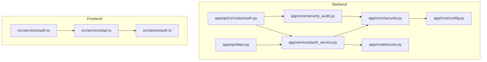
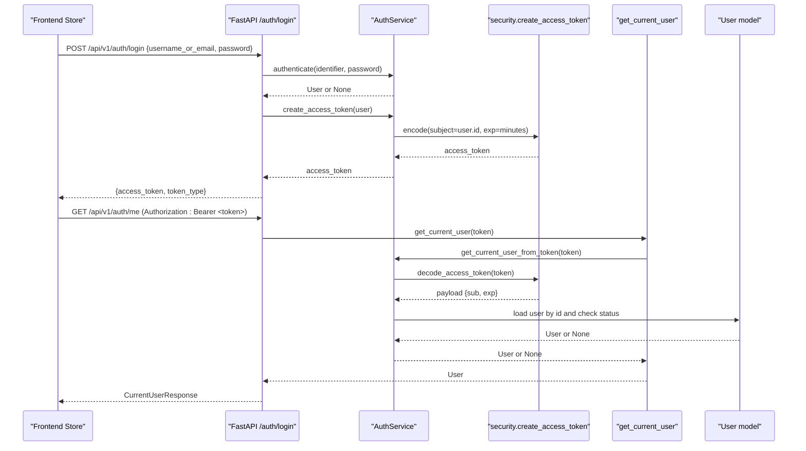
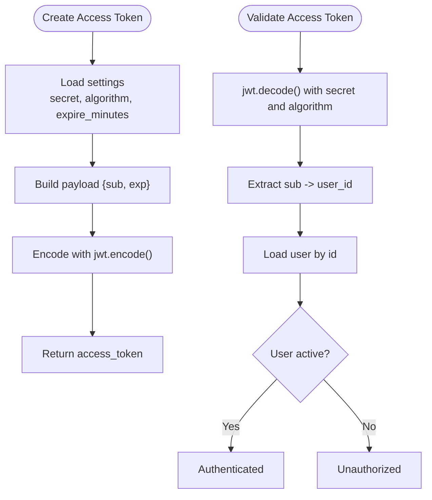
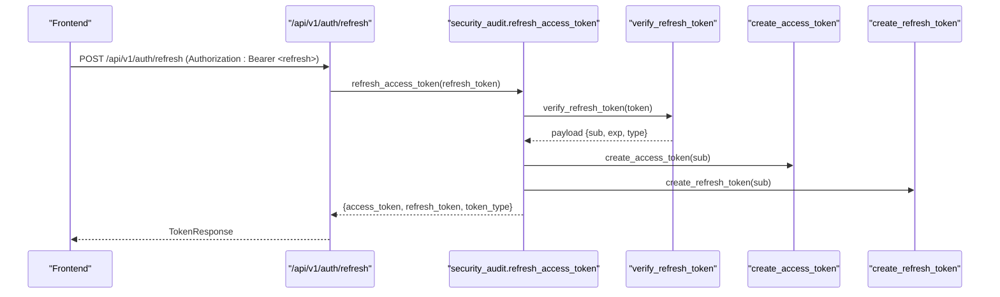
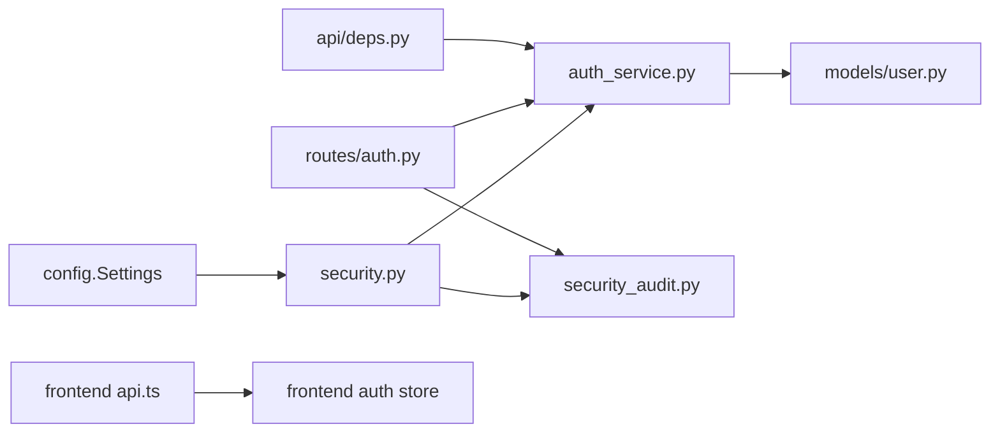

# JWT Authentication & Token Management

<cite>
**Referenced Files in This Document**
- [security.py](file://backend/app/core/security.py)
- [config.py](file://backend/app/core/config.py)
- [security_audit.py](file://backend/app/core/security_audit.py)
- [auth.py](file://backend/app/api/v1/routes/auth.py)
- [deps.py](file://backend/app/api/deps.py)
- [auth_service.py](file://backend/app/services/auth_service.py)
- [user.py](file://backend/app/models/user.py)
- [auth.ts](file://frontend/src/services/auth.ts)
- [api.ts](file://frontend/src/services/api.ts)
- [auth.ts (store)](file://frontend/src/stores/auth.ts)
- [test_auth.py](file://backend/tests/test_auth.py)
</cite>

## Table of Contents
1. [Introduction](#introduction)
2. [Project Structure](#project-structure)
3. [Core Components](#core-components)
4. [Architecture Overview](#architecture-overview)
5. [Detailed Component Analysis](#detailed-component-analysis)
6. [Dependency Analysis](#dependency-analysis)
7. [Performance Considerations](#performance-considerations)
8. [Troubleshooting Guide](#troubleshooting-guide)
9. [Conclusion](#conclusion)
10. [Appendices](#appendices)

## Introduction
This document explains the JWT-based authentication system, covering token lifecycle, security configuration, storage strategies, protected routes, middleware, refresh flows, and logout behavior. It focuses on how access tokens are created and validated, how refresh tokens are supported, and how client-side stores attach tokens to requests.

## Project Structure
The JWT implementation spans backend core utilities, API routes, dependency injection for user extraction, service layer orchestration, and frontend HTTP interceptors and store logic.



**Diagram sources**
- [security.py:1-34](file://backend/app/core/security.py#L1-L34)
- [config.py:26-38](file://backend/app/core/config.py#L26-L38)
- [security_audit.py:101-149](file://backend/app/core/security_audit.py#L101-L149)
- [auth.py:37-94](file://backend/app/api/v1/routes/auth.py#L37-L94)
- [deps.py:11-30](file://backend/app/api/deps.py#L11-L30)
- [auth_service.py:37-51](file://backend/app/services/auth_service.py#L37-L51)
- [user.py:24-48](file://backend/app/models/user.py#L24-L48)
- [api.ts:12-22](file://frontend/src/services/api.ts#L12-L22)
- [auth.ts (store):17-29](file://frontend/src/stores/auth.ts#L17-L29)
- [auth.ts (service):10-17](file://frontend/src/services/auth.ts#L10-L17)

**Section sources**
- [security.py:1-34](file://backend/app/core/security.py#L1-L34)
- [config.py:26-38](file://backend/app/core/config.py#L26-L38)
- [security_audit.py:101-149](file://backend/app/core/security_audit.py#L101-L149)
- [auth.py:37-94](file://backend/app/api/v1/routes/auth.py#L37-L94)
- [deps.py:11-30](file://backend/app/api/deps.py#L11-L30)
- [auth_service.py:37-51](file://backend/app/services/auth_service.py#L37-L51)
- [user.py:24-48](file://backend/app/models/user.py#L24-L48)
- [api.ts:12-22](file://frontend/src/services/api.ts#L12-L22)
- [auth.ts (store):17-29](file://frontend/src/stores/auth.ts#L17-L29)
- [auth.ts (service):10-17](file://frontend/src/services/auth.ts#L10-L17)

## Core Components
- Access token creation and decoding: implemented with PyJWT using configurable secret, algorithm, and expiration.
- Refresh token support: long-lived tokens with type enforcement and rotation on refresh.
- User extraction from token: FastAPI dependency that decodes the token and loads an active user.
- Frontend token attachment: Axios interceptor adds Authorization header; store persists tokens.

Key responsibilities:
- Configuration: secrets, algorithms, expirations.
- Security primitives: password hashing, token encode/decode.
- Service orchestration: registration, login, token issuance, current user resolution.
- API endpoints: register, login, refresh, me.
- Client integration: request/response interceptors and local storage.

**Section sources**
- [config.py:26-38](file://backend/app/core/config.py#L26-L38)
- [security.py:22-33](file://backend/app/core/security.py#L22-L33)
- [security_audit.py:101-149](file://backend/app/core/security_audit.py#L101-L149)
- [auth_service.py:37-51](file://backend/app/services/auth_service.py#L37-L51)
- [auth.py:37-94](file://backend/app/api/v1/routes/auth.py#L37-L94)
- [deps.py:11-30](file://backend/app/api/deps.py#L11-L30)
- [api.ts:12-22](file://frontend/src/services/api.ts#L12-L22)
- [auth.ts (store):17-29](file://frontend/src/stores/auth.ts#L17-L29)

## Architecture Overview
End-to-end flow for login and protected access:



**Diagram sources**
- [auth.py:37-60](file://backend/app/api/v1/routes/auth.py#L37-L60)
- [auth_service.py:29-38](file://backend/app/services/auth_service.py#L29-L38)
- [security.py:22-33](file://backend/app/core/security.py#L22-L33)
- [deps.py:19-30](file://backend/app/api/deps.py#L19-L30)
- [user.py:24-48](file://backend/app/models/user.py#L24-L48)

## Detailed Component Analysis

### Access Token Lifecycle
- Creation: subject is the user ID; expiration is configured via settings; signed with configured algorithm and secret.
- Validation: decode verifies signature and expiry; service resolves user by subject and checks active status.



**Diagram sources**
- [security.py:22-33](file://backend/app/core/security.py#L22-L33)
- [auth_service.py:40-51](file://backend/app/services/auth_service.py#L40-L51)
- [config.py:26-34](file://backend/app/core/config.py#L26-L34)

**Section sources**
- [security.py:22-33](file://backend/app/core/security.py#L22-L33)
- [auth_service.py:40-51](file://backend/app/services/auth_service.py#L40-L51)
- [config.py:26-34](file://backend/app/core/config.py#L26-L34)

### Refresh Token Handling
- Creation: long-lived token with type="refresh" and days-based expiration.
- Verification: enforces type and handles expired/invalid tokens.
- Rotation: issuing a new access token also issues a new refresh token.



**Diagram sources**
- [auth.py:63-89](file://backend/app/api/v1/routes/auth.py#L63-L89)
- [security_audit.py:101-149](file://backend/app/core/security_audit.py#L101-L149)
- [security.py:22-28](file://backend/app/core/security.py#L22-L28)

**Section sources**
- [security_audit.py:101-149](file://backend/app/core/security_audit.py#L101-L149)
- [auth.py:63-89](file://backend/app/api/v1/routes/auth.py#L63-L89)
- [security.py:22-28](file://backend/app/core/security.py#L22-L28)

### Protected Routes and Middleware
- OAuth2 scheme expects Authorization header with Bearer token.
- Dependency decodes token, loads user, and enforces active status.
- Role guards enforce tenant/landlord/admin roles.

```mermaid
classDiagram
class OAuth2Scheme {
+tokenUrl="/api/v1/auth/login"
}
class GetCurrentUser {
+Depends(oauth2_scheme)
+Depends(get_db_session)
+returns User
}
class RequireTenant {
+Depends(get_current_user)
+role in {tenant, admin}
}
class RequireLandlord {
+Depends(get_current_user)
+role in {landlord, admin}
}
class RequireAdmin {
+Depends(get_current_user)
+role == admin
}
GetCurrentUser --> OAuth2Scheme : "extracts token"
RequireTenant --> GetCurrentUser : "depends on"
RequireLandlord --> GetCurrentUser : "depends on"
RequireAdmin --> GetCurrentUser : "depends on"
```

**Diagram sources**
- [deps.py:11-30](file://backend/app/api/deps.py#L11-L30)
- [deps.py:33-57](file://backend/app/api/deps.py#L33-L57)

**Section sources**
- [deps.py:11-30](file://backend/app/api/deps.py#L11-L30)
- [deps.py:33-57](file://backend/app/api/deps.py#L33-L57)

### Token Storage Strategies
- Frontend:
  - Stores access_token and user profile in localStorage.
  - Axios interceptor attaches Authorization header automatically.
  - On 401, clears storage and redirects to login.
- Backend:
  - No server-side token storage for access tokens.
  - Refresh tokens are stateless but can be extended with Redis/blacklist if needed.

Security considerations:
- localStorage is vulnerable to XSS; consider HttpOnly cookies for production hardening.
- If using cookies, ensure SameSite and Secure flags and CSRF protection.

**Section sources**
- [api.ts:12-22](file://frontend/src/services/api.ts#L12-L22)
- [api.ts:24-54](file://frontend/src/services/api.ts#L24-L54)
- [auth.ts (store):17-29](file://frontend/src/stores/auth.ts#L17-L29)

### Logout Procedures
- Frontend logout clears stored tokens and navigates to login page.
- No explicit server-side logout endpoint is present; access tokens become invalid upon expiry.

Recommendations:
- Add a server-side logout endpoint to invalidate refresh tokens (e.g., blacklist).
- For cookie-based storage, clear HttpOnly cookies server-side.

**Section sources**
- [auth.ts (store):78-81](file://frontend/src/stores/auth.ts#L78-L81)

### Token Revocation and Blacklist
Current implementation:
- Stateless JWTs without server-side revocation.
- Rate limiting uses Redis, but not used for token blacklisting.

Recommended approach:
- Maintain a Redis set of revoked refresh tokens keyed by jti or subject+exp.
- On refresh, check blacklist before issuing new tokens.
- On logout, add refresh token to blacklist.

[No sources needed since this section provides general guidance]

## Dependency Analysis
High-level dependencies among components:



**Diagram sources**
- [config.py:26-38](file://backend/app/core/config.py#L26-L38)
- [security.py:22-33](file://backend/app/core/security.py#L22-L33)
- [auth_service.py:37-51](file://backend/app/services/auth_service.py#L37-L51)
- [security_audit.py:101-149](file://backend/app/core/security_audit.py#L101-L149)
- [auth.py:37-94](file://backend/app/api/v1/routes/auth.py#L37-L94)
- [deps.py:11-30](file://backend/app/api/deps.py#L11-L30)
- [api.ts:12-22](file://frontend/src/services/api.ts#L12-L22)
- [auth.ts (store):17-29](file://frontend/src/stores/auth.ts#L17-L29)

**Section sources**
- [config.py:26-38](file://backend/app/core/config.py#L26-L38)
- [security.py:22-33](file://backend/app/core/security.py#L22-L33)
- [auth_service.py:37-51](file://backend/app/services/auth_service.py#L37-L51)
- [security_audit.py:101-149](file://backend/app/core/security_audit.py#L101-L149)
- [auth.py:37-94](file://backend/app/api/v1/routes/auth.py#L37-L94)
- [deps.py:11-30](file://backend/app/api/deps.py#L11-L30)
- [api.ts:12-22](file://frontend/src/services/api.ts#L12-L22)
- [auth.ts (store):17-29](file://frontend/src/stores/auth.ts#L17-L29)

## Performance Considerations
- Keep access tokens short-lived to limit exposure window.
- Use efficient user lookups by primary key; avoid heavy queries in auth path.
- Consider caching active user sessions if frequent re-validation is needed.
- Rate limiting is already Redis-backed; ensure Redis latency is low.

[No sources needed since this section provides general guidance]

## Troubleshooting Guide
Common issues and resolutions:
- 401 Unauthorized on protected routes:
  - Ensure Authorization header is present and correct.
  - Verify token has not expired and is signed with expected algorithm.
- Login failures:
  - Confirm credentials and that user status is active.
- Refresh failures:
  - Ensure refresh token type is enforced and not expired.
- CORS or network errors:
  - Check baseURL and headers in axios client.

Relevant behaviors:
- Frontend clears storage and redirects on 401.
- Backend returns standardized error details and WWW-Authenticate header on auth failures.

**Section sources**
- [api.ts:24-54](file://frontend/src/services/api.ts#L24-L54)
- [deps.py:19-30](file://backend/app/api/deps.py#L19-L30)
- [auth.py:45-50](file://backend/app/api/v1/routes/auth.py#L45-L50)
- [security_audit.py:127-136](file://backend/app/core/security_audit.py#L127-L136)

## Conclusion
The system implements a robust JWT workflow with configurable signing and expiration, role-based access control, and a refresh token mechanism. The frontend integrates seamlessly via interceptors and local storage. For enhanced security, consider adding server-side refresh token revocation and moving to HttpOnly cookies with CSRF protections.

[No sources needed since this section summarizes without analyzing specific files]

## Appendices

### API Endpoints Summary
- Register: POST /api/v1/auth/register
- Login: POST /api/v1/auth/login
- Refresh: POST /api/v1/auth/refresh (requires Authorization: Bearer <refresh_token>)
- Me: GET /api/v1/auth/me (requires Authorization: Bearer <access_token>)

**Section sources**
- [auth.py:14-34](file://backend/app/api/v1/routes/auth.py#L14-L34)
- [auth.py:37-60](file://backend/app/api/v1/routes/auth.py#L37-L60)
- [auth.py:63-89](file://backend/app/api/v1/routes/auth.py#L63-L89)
- [auth.py:92-94](file://backend/app/api/v1/routes/auth.py#L92-L94)

### Test Coverage Highlights
- Successful registration and login
- Wrong password handling
- Protected route requires token
- Me endpoint returns current user when authenticated

**Section sources**
- [test_auth.py:6-18](file://backend/tests/test_auth.py#L6-L18)
- [test_auth.py:22-39](file://backend/tests/test_auth.py#L22-L39)
- [test_auth.py:43-57](file://backend/tests/test_auth.py#L43-L57)
- [test_auth.py:61-64](file://backend/tests/test_auth.py#L61-L64)
- [test_auth.py:68-92](file://backend/tests/test_auth.py#L68-L92)