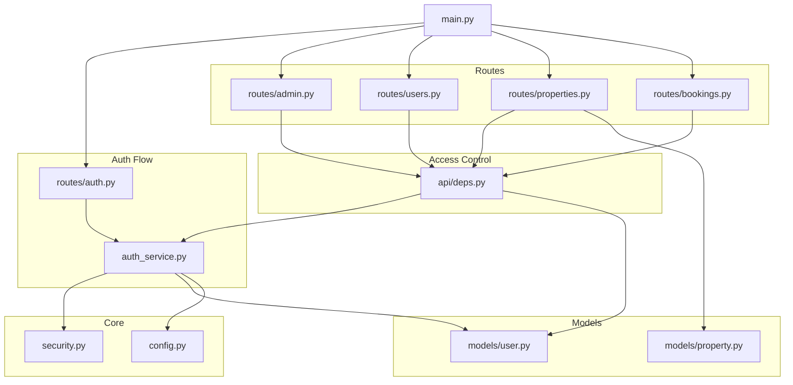
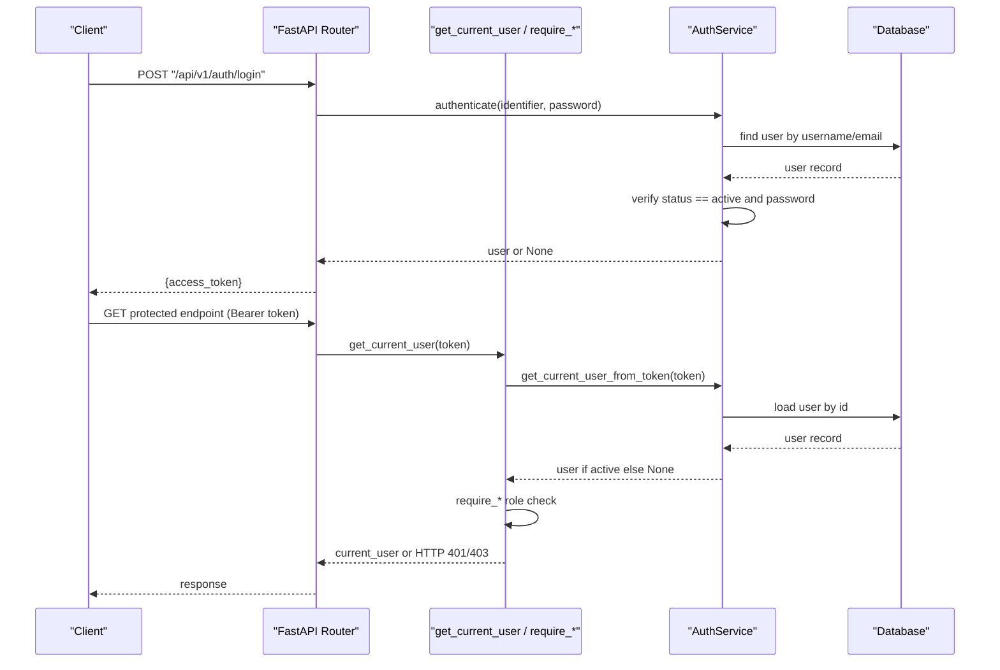
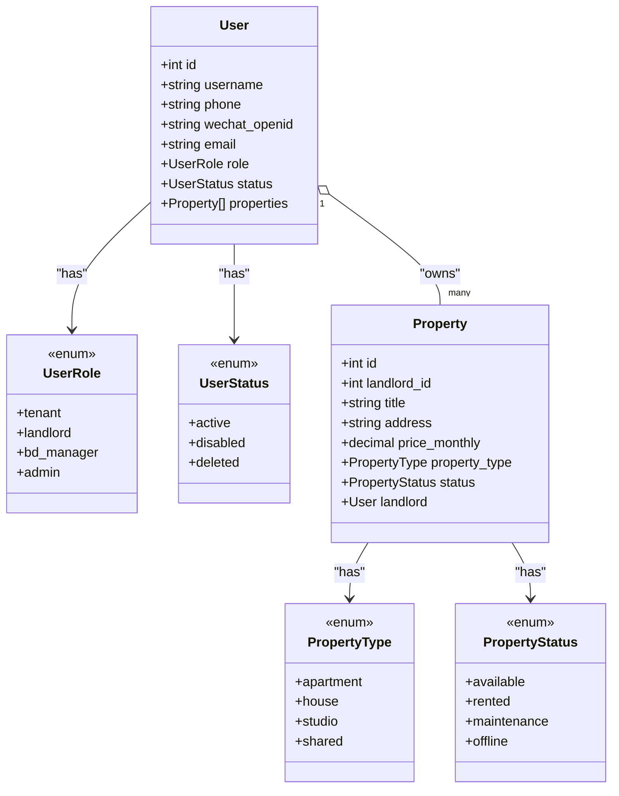
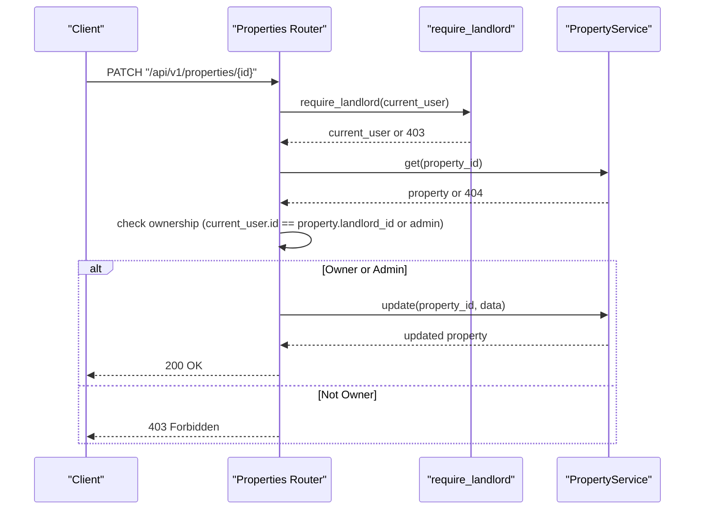
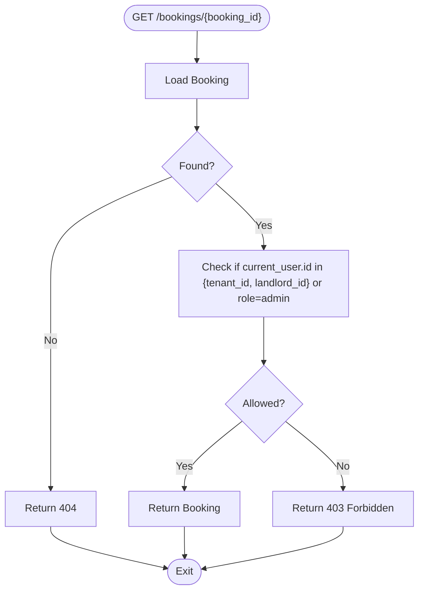
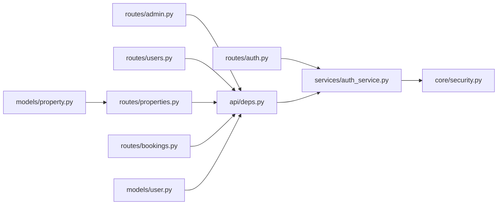

# Multi-Role Authorization System

<cite>
**Referenced Files in This Document**
- [user.py](file://backend/app/models/user.py)
- [deps.py](file://backend/app/api/deps.py)
- [security.py](file://backend/app/core/security.py)
- [auth_service.py](file://backend/app/services/auth_service.py)
- [auth.py](file://backend/app/api/v1/routes/auth.py)
- [admin.py](file://backend/app/api/v1/routes/admin.py)
- [users.py](file://backend/app/api/v1/routes/users.py)
- [properties.py](file://backend/app/api/v1/routes/properties.py)
- [bookings.py](file://backend/app/api/v1/routes/bookings.py)
- [property.py](file://backend/app/models/property.py)
- [main.py](file://backend/app/main.py)
- [config.py](file://backend/app/core/config.py)
</cite>

## Table of Contents
1. [Introduction](#introduction)
2. [Project Structure](#project-structure)
3. [Core Components](#core-components)
4. [Architecture Overview](#architecture-overview)
5. [Detailed Component Analysis](#detailed-component-analysis)
6. [Dependency Analysis](#dependency-analysis)
7. [Performance Considerations](#performance-considerations)
8. [Troubleshooting Guide](#troubleshooting-guide)
9. [Conclusion](#conclusion)
10. [Appendices](#appendices)

## Introduction
This document explains the multi-role authorization system that supports tenants, landlords, BD managers, and administrators. It covers:
- Role hierarchy and permission matrix
- Access control implementation using FastAPI dependencies
- User model role field and status management (active, disabled, deleted) and their impact on API access
- Examples of role-based decorators, route protection, and dynamic permission checking
- Admin-specific endpoints and restricted access patterns
- Permission inheritance, custom role creation, and dynamic permission assignment strategies
- Practical examples for protecting different resource types based on roles and ownership relationships

## Project Structure
The authorization system is implemented across models, services, core security utilities, and FastAPI routes with dependency injection.

**Diagram sources**
- [main.py:17-82](file://backend/app/main.py#L17-L82)
- [auth.py:1-94](file://backend/app/api/v1/routes/auth.py#L1-L94)
- [auth_service.py:1-77](file://backend/app/services/auth_service.py#L1-L77)
- [security.py:1-34](file://backend/app/core/security.py#L1-L34)
- [deps.py:1-58](file://backend/app/api/deps.py#L1-L58)
- [user.py:1-48](file://backend/app/models/user.py#L1-L48)
- [property.py:1-86](file://backend/app/models/property.py#L1-L86)
- [admin.py:1-133](file://backend/app/api/v1/routes/admin.py#L1-L133)
- [users.py:1-102](file://backend/app/api/v1/routes/users.py#L1-L102)
- [properties.py:1-162](file://backend/app/api/v1/routes/properties.py#L1-L162)
- [bookings.py:1-112](file://backend/app/api/v1/routes/bookings.py#L1-L112)

**Section sources**
- [main.py:17-82](file://backend/app/main.py#L17-L82)
- [config.py:1-167](file://backend/app/core/config.py#L1-L167)

## Core Components
- Roles and Statuses
  - Roles: tenant, landlord, bd_manager, admin
  - Statuses: active, disabled, deleted
  - The default role for new users is tenant; default status is active
- Token Lifecycle
  - JWT access tokens are created and decoded using secure settings from configuration
  - Authentication service validates user existence and active status when resolving current user from token
- Dependency Injection
  - get_current_user resolves authenticated user from bearer token
  - require_tenant, require_landlord, require_admin enforce role-based access at route level
- Ownership Checks
  - Landlords can only manage properties they own unless they are admins
  - Bookings enforce owner checks for both tenants and landlords

Key implementation references:
- Role/status enums and User model fields
- OAuth2 scheme and FastAPI dependencies for auth and role enforcement
- Auth service methods for login, registration, WeChat login, and token handling
- Route-level usage of dependencies to protect endpoints

**Section sources**
- [user.py:11-48](file://backend/app/models/user.py#L11-L48)
- [security.py:22-34](file://backend/app/core/security.py#L22-L34)
- [auth_service.py:29-51](file://backend/app/services/auth_service.py#L29-L51)
- [deps.py:19-57](file://backend/app/api/deps.py#L19-L57)
- [auth.py:37-60](file://backend/app/api/v1/routes/auth.py#L37-L60)

## Architecture Overview
The authorization architecture combines JWT-based authentication with FastAPI dependency injection for role-based access control and ownership validation.

**Diagram sources**
- [auth.py:37-60](file://backend/app/api/v1/routes/auth.py#L37-L60)
- [auth_service.py:29-51](file://backend/app/services/auth_service.py#L29-L51)
- [deps.py:19-57](file://backend/app/api/deps.py#L19-L57)

## Detailed Component Analysis

### User Model and Role/Status Management
- Role enum includes tenant, landlord, bd_manager, admin
- Status enum includes active, disabled, deleted
- Default values: role=tenant, status=active
- Relationship to Property via landlord back-populates

Impact on API access:
- Only active users can authenticate and obtain tokens
- Inactive/disabled/deleted users cannot log in or use protected endpoints

**Section sources**
- [user.py:11-48](file://backend/app/models/user.py#L11-L48)

### Authentication Service and Token Handling
- register_user creates a new user with hashed password and provided role
- authenticate verifies credentials and ensures user status is active
- create_access_token encodes JWT with subject=user.id and expiration from settings
- get_current_user_from_token decodes JWT, loads user, and checks active status
- wechat_login supports mini program flow and auto-creates tenant users if not found

Security considerations:
- Password hashing uses bcrypt via CryptContext
- JWT algorithm and secret key come from configuration

**Section sources**
- [auth_service.py:19-77](file://backend/app/services/auth_service.py#L19-L77)
- [security.py:12-34](file://backend/app/core/security.py#L12-L34)
- [config.py:26-38](file://backend/app/core/config.py#L26-L38)

### FastAPI Dependencies for Role-Based Access Control
- get_db_session provides async database session
- get_current_user extracts bearer token, decodes it via AuthService, and raises 401 if invalid/expired
- require_tenant allows tenant or admin
- require_landlord allows landlord or admin
- require_admin restricts to admin only

Usage pattern:
- Routes declare Depends(require_*) to enforce roles
- Routes may also use Depends(get_current_user) for user-scoped operations without extra role checks

**Section sources**
- [deps.py:14-57](file://backend/app/api/deps.py#L14-L57)

### Admin Endpoints and Restricted Access Patterns
Admin-only endpoints include:
- Stats retrieval
- Audit logs listing
- Property moderation (status updates)
- User role updates
- Embedding stats and reindex triggers

All these endpoints depend on require_admin and log actions via audit service.

**Section sources**
- [admin.py:16-133](file://backend/app/api/v1/routes/admin.py#L16-L133)

### Users Endpoints
- Create user (no role guard here; typically used by admin flows)
- List users (require_admin)
- Get/update my profile (requires authentication)
- Get/update/delete specific users (require_admin)

**Section sources**
- [users.py:13-102](file://backend/app/api/v1/routes/users.py#L13-L102)

### Properties Endpoints and Ownership Enforcement
- Create property requires landlord or admin; non-admin landlords must set landlord_id equal to their own id
- Update/Delete property require landlord or admin; non-admin landlords can only modify their own properties
- Public read/search/list endpoints do not require authentication

Ownership checks compare current_user.id with property.landlord_id unless current_user.role is admin.

**Section sources**
- [properties.py:16-162](file://backend/app/api/v1/routes/properties.py#L16-L162)
- [property.py:48-86](file://backend/app/models/property.py#L48-L86)

### Bookings Endpoints and Dual Ownership
- Create booking requires tenant or admin; validates property exists
- List bookings returns landlord’s bookings for landlord/admin, otherwise tenant’s bookings
- Get booking enforces access for tenant, landlord, or admin
- Update booking status requires landlord or admin; only the owning landlord can update unless admin
- Cancel booking requires tenant or admin; only the owning tenant can cancel unless admin

These endpoints demonstrate dynamic permission checking based on ownership and role.

**Section sources**
- [bookings.py:14-112](file://backend/app/api/v1/routes/bookings.py#L14-L112)

### Class Diagram: Models and Relationships

**Diagram sources**
- [user.py:11-48](file://backend/app/models/user.py#L11-L48)
- [property.py:24-86](file://backend/app/models/property.py#L24-L86)

### Sequence Diagram: Protected Resource Update (Property)

**Diagram sources**
- [properties.py:121-162](file://backend/app/api/v1/routes/properties.py#L121-L162)

### Flowchart: Dynamic Permission Check (Booking Detail)

**Diagram sources**
- [bookings.py:55-68](file://backend/app/api/v1/routes/bookings.py#L55-L68)

## Dependency Analysis
The authorization system relies on clear separation between authentication, role enforcement, and business logic.

**Diagram sources**
- [auth.py:1-94](file://backend/app/api/v1/routes/auth.py#L1-L94)
- [auth_service.py:1-77](file://backend/app/services/auth_service.py#L1-L77)
- [security.py:1-34](file://backend/app/core/security.py#L1-L34)
- [deps.py:1-58](file://backend/app/api/deps.py#L1-L58)
- [admin.py:1-133](file://backend/app/api/v1/routes/admin.py#L1-L133)
- [users.py:1-102](file://backend/app/api/v1/routes/users.py#L1-L102)
- [properties.py:1-162](file://backend/app/api/v1/routes/properties.py#L1-L162)
- [bookings.py:1-112](file://backend/app/api/v1/routes/bookings.py#L1-L112)
- [user.py:1-48](file://backend/app/models/user.py#L1-L48)
- [property.py:1-86](file://backend/app/models/property.py#L1-L86)

**Section sources**
- [deps.py:19-57](file://backend/app/api/deps.py#L19-L57)
- [auth_service.py:29-51](file://backend/app/services/auth_service.py#L29-L51)

## Performance Considerations
- Minimize DB queries in hot paths: cache user lookups where appropriate, but ensure active status is always validated for auth decisions
- Use pagination and filters on list endpoints to reduce payload sizes
- Avoid unnecessary joins; fetch related entities lazily or selectively
- Keep JWT payloads minimal (subject only) to reduce overhead
- Ensure indexes exist on frequently filtered columns (e.g., users.username, users.email, properties.district, properties.status)

[No sources needed since this section provides general guidance]

## Troubleshooting Guide
Common issues and resolutions:
- 401 Unauthorized: Invalid or expired token; ensure Authorization header contains valid Bearer token and token has not expired
- 403 Forbidden: Insufficient role or ownership mismatch; verify current_user.role and ownership checks
- 404 Not Found: Resource does not exist; confirm IDs and relationships
- Integrity errors: Duplicate username/email/phone/wechat_openid; handle conflicts gracefully

Operational checks:
- Confirm user status is active before expecting successful authentication
- Validate environment variables for JWT secret and algorithm
- Review audit logs for admin actions and troubleshooting

**Section sources**
- [deps.py:24-30](file://backend/app/api/deps.py#L24-L30)
- [auth_service.py:40-51](file://backend/app/services/auth_service.py#L40-L51)
- [admin.py:73-108](file://backend/app/api/v1/routes/admin.py#L73-L108)

## Conclusion
The system implements a robust multi-role authorization framework using FastAPI dependencies and JWT-based authentication. Roles define coarse-grained permissions, while ownership checks provide fine-grained control over resources. Admin endpoints are strictly guarded, and dynamic permission checks ensure safe access across tenants and landlords. Extensibility points include adding new roles, implementing permission matrices, and integrating policy engines for complex scenarios.

[No sources needed since this section summarizes without analyzing specific files]

## Appendices

### Role Hierarchy and Permission Matrix
- Tenant: Can create bookings, view own bookings, update own profile
- Landlord: Can manage own properties, manage bookings for own properties
- BD Manager: Defined in model; no explicit route guards currently; can be added via require_bd_manager dependency
- Admin: Full access to admin endpoints, can override ownership checks, moderate properties, change user roles

Permission matrix summary:
- Auth endpoints: All users (login/register/me)
- Users endpoints: Admin for CRUD except me endpoints
- Properties endpoints: Landlord/Admin for write; public for read/search
- Bookings endpoints: Tenant for create/cancel; Landlord/Admin for status updates; all participants can view

**Section sources**
- [user.py:11-16](file://backend/app/models/user.py#L11-L16)
- [deps.py:33-57](file://backend/app/api/deps.py#L33-L57)
- [properties.py:16-162](file://backend/app/api/v1/routes/properties.py#L16-L162)
- [bookings.py:14-112](file://backend/app/api/v1/routes/bookings.py#L14-L112)

### Implementing Role-Based Decorators and Route Protection
- Use require_tenant, require_landlord, require_admin as FastAPI dependencies
- For custom roles, add a new require_xxx dependency in deps.py and apply it to routes
- Combine role checks with ownership checks inside route handlers for fine-grained control

**Section sources**
- [deps.py:33-57](file://backend/app/api/deps.py#L33-L57)
- [properties.py:28-33](file://backend/app/api/v1/routes/properties.py#L28-L33)

### Dynamic Permission Checking
- Example: Booking detail access checks tenant_id, landlord_id, or admin role
- Example: Property update/delete checks landlord_id against current_user.id unless admin

**Section sources**
- [bookings.py:65-66](file://backend/app/api/v1/routes/bookings.py#L65-L66)
- [properties.py:132-136](file://backend/app/api/v1/routes/properties.py#L132-L136)

### Admin-Specific Endpoints
- Stats, logs, property moderation, user role changes, embedding operations
- All require admin role and log actions for auditability

**Section sources**
- [admin.py:16-133](file://backend/app/api/v1/routes/admin.py#L16-L133)

### Custom Role Creation and Dynamic Assignment
- Add new role to UserRole enum
- Implement corresponding require_xxx dependency
- Provide admin endpoints to assign roles to users
- Enforce new role checks in relevant routes

**Section sources**
- [user.py:11-16](file://backend/app/models/user.py#L11-L16)
- [admin.py:83-109](file://backend/app/api/v1/routes/admin.py#L83-L109)

### Protecting Different Resource Types Based on Roles and Ownership
- Properties: Landlord/Admin ownership checks
- Bookings: Tenant/Landlord/Admin ownership checks
- Users: Admin-only for administrative operations; self-service for profile updates

**Section sources**
- [properties.py:16-162](file://backend/app/api/v1/routes/properties.py#L16-L162)
- [bookings.py:14-112](file://backend/app/api/v1/routes/bookings.py#L14-L112)
- [users.py:37-58](file://backend/app/api/v1/routes/users.py#L37-L58)