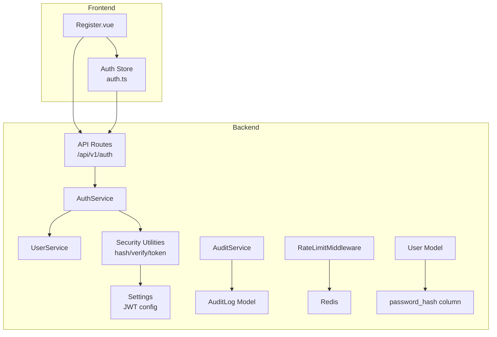
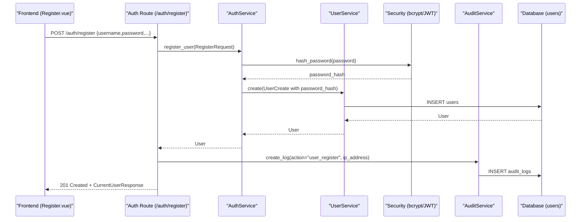
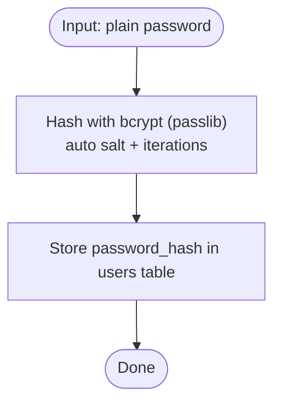
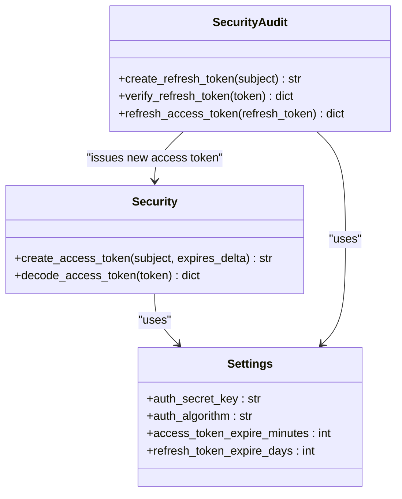
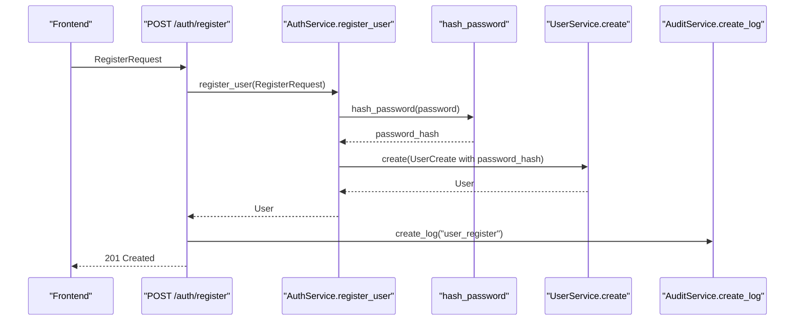
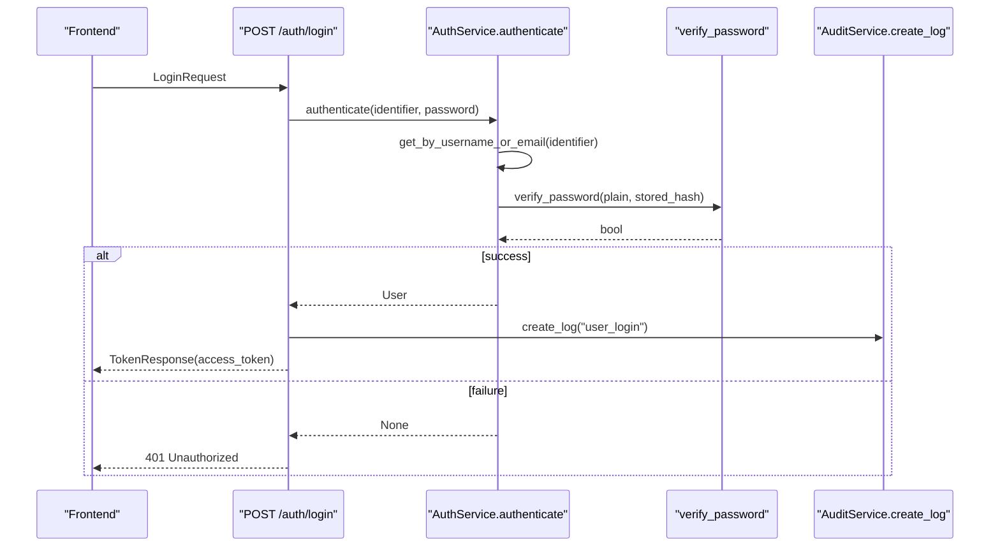
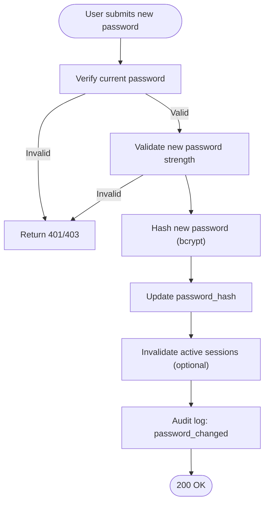
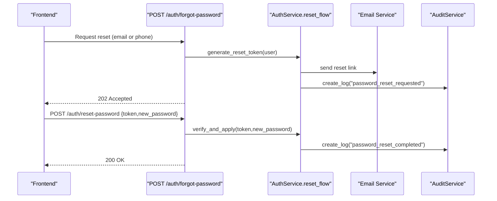
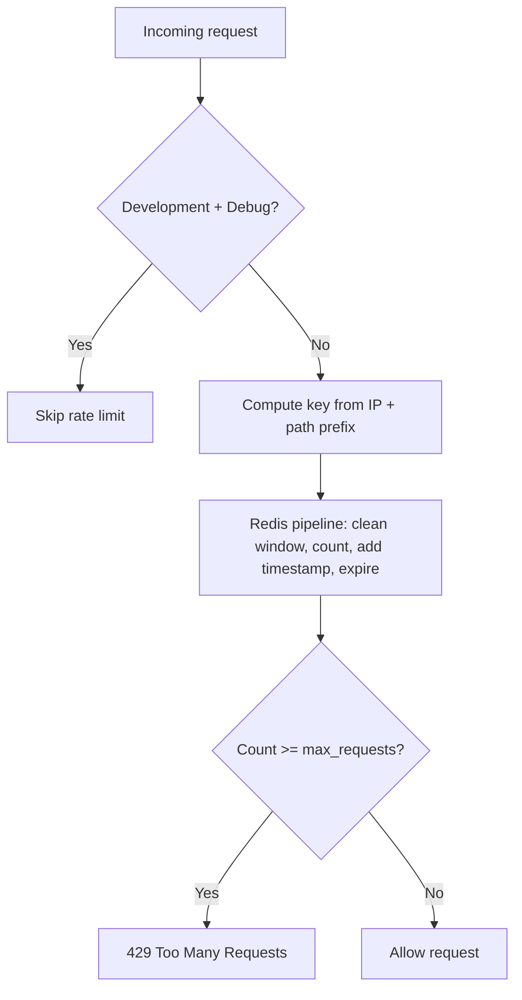
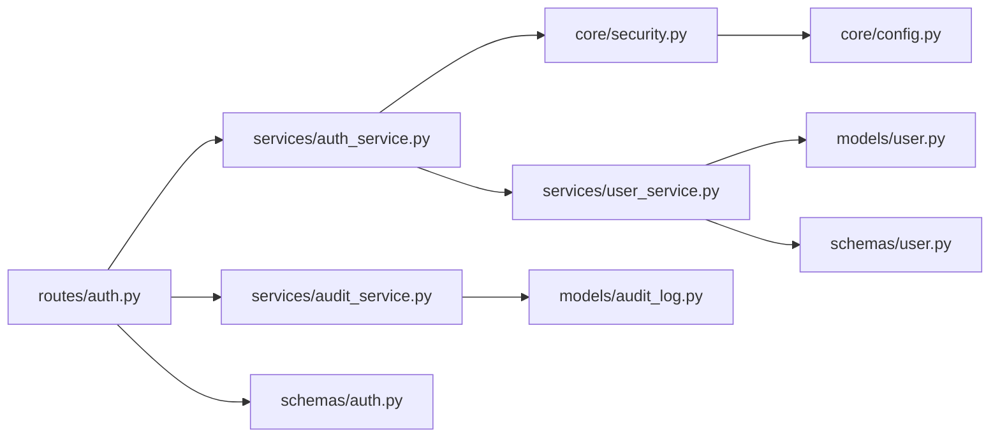

# Password Security & Validation

<cite>
**Referenced Files in This Document**
- [security.py](file://backend/app/core/security.py)
- [config.py](file://backend/app/core/config.py)
- [security_audit.py](file://backend/app/core/security_audit.py)
- [user.py](file://backend/app/models/user.py)
- [auth.py](file://backend/app/schemas/auth.py)
- [user.py](file://backend/app/schemas/user.py)
- [auth.py](file://backend/app/api/v1/routes/auth.py)
- [auth_service.py](file://backend/app/services/auth_service.py)
- [user_service.py](file://backend/app/services/user_service.py)
- [audit_log.py](file://backend/app/models/audit_log.py)
- [audit_service.py](file://backend/app/services/audit_service.py)
- [users.py](file://backend/app/api/v1/routes/users.py)
- [Register.vue](file://frontend/src/views/Register.vue)
- [auth.ts](file://frontend/src/stores/auth.ts)
- [README.md](file://README.md)
</cite>

## Table of Contents
1. [Introduction](#introduction)
2. [Project Structure](#project-structure)
3. [Core Components](#core-components)
4. [Architecture Overview](#architecture-overview)
5. [Detailed Component Analysis](#detailed-component-analysis)
6. [Dependency Analysis](#dependency-analysis)
7. [Performance Considerations](#performance-considerations)
8. [Troubleshooting Guide](#troubleshooting-guide)
9. [Conclusion](#conclusion)
10. [Appendices](#appendices)

## Introduction
This document explains the password security implementation across the system, focusing on:
- Hashing algorithm selection and configuration (bcrypt with passlib)
- Salt generation and iteration parameters
- Password validation rules for registration and login
- Secure storage practices and token handling
- Brute force prevention via rate limiting
- Audit logging for authentication events
- Frontend validation and real-time feedback
- Migration strategies for existing users
- Password change and reset workflows (current capabilities and recommended enhancements)

## Project Structure
Password-related functionality spans core security utilities, schemas, services, API routes, models, audit logging, and frontend validation.

**Diagram sources**
- [auth.py:1-94](file://backend/app/api/v1/routes/auth.py#L1-L94)
- [auth_service.py:1-77](file://backend/app/services/auth_service.py#L1-L77)
- [user_service.py:1-57](file://backend/app/services/user_service.py#L1-L57)
- [security.py:1-34](file://backend/app/core/security.py#L1-L34)
- [config.py:26-38](file://backend/app/core/config.py#L26-L38)
- [audit_service.py:1-55](file://backend/app/services/audit_service.py#L1-L55)
- [audit_log.py:1-25](file://backend/app/models/audit_log.py#L1-L25)
- [user.py:24-48](file://backend/app/models/user.py#L24-L48)
- [Register.vue:66-119](file://frontend/src/views/Register.vue#L66-L119)
- [auth.ts:36-100](file://frontend/src/stores/auth.ts#L36-L100)

**Section sources**
- [auth.py:1-94](file://backend/app/api/v1/routes/auth.py#L1-L94)
- [auth_service.py:1-77](file://backend/app/services/auth_service.py#L1-L77)
- [security.py:1-34](file://backend/app/core/security.py#L1-L34)
- [config.py:26-38](file://backend/app/core/config.py#L26-L38)
- [audit_service.py:1-55](file://backend/app/services/audit_service.py#L1-L55)
- [audit_log.py:1-25](file://backend/app/models/audit_log.py#L1-L25)
- [user.py:24-48](file://backend/app/models/user.py#L24-L48)
- [Register.vue:66-119](file://frontend/src/views/Register.vue#L66-L119)
- [auth.ts:36-100](file://frontend/src/stores/auth.ts#L36-L100)

## Core Components
- Password hashing and verification: bcrypt via passlib CryptContext; hash_password and verify_password functions.
- JWT access tokens: creation and decoding using HS256 with configurable secret and expiry.
- Registration and login flows: schema validation, user lookup, credential verification, token issuance, and audit logging.
- Rate limiting: Redis-backed middleware to throttle requests per IP and endpoint prefix.
- User model: stores username, email, phone, role, status, and password_hash.
- Audit logging: records authentication events with IP address and timestamps.
- Frontend validation: minimum length and confirm-password checks during registration.

Key responsibilities:
- Core security module centralizes cryptographic operations and token management.
- Services orchestrate business logic for auth and user updates.
- Schemas enforce input constraints at API boundaries.
- Models define persistent fields including hashed passwords.
- Audit service persists security-relevant actions.

**Section sources**
- [security.py:1-34](file://backend/app/core/security.py#L1-L34)
- [auth.py:1-63](file://backend/app/schemas/auth.py#L1-L63)
- [user.py:1-45](file://backend/app/schemas/user.py#L1-L45)
- [auth.py:1-94](file://backend/app/api/v1/routes/auth.py#L1-L94)
- [auth_service.py:1-77](file://backend/app/services/auth_service.py#L1-L77)
- [user_service.py:1-57](file://backend/app/services/user_service.py#L1-L57)
- [audit_log.py:1-25](file://backend/app/models/audit_log.py#L1-L25)
- [audit_service.py:1-55](file://backend/app/services/audit_service.py#L1-L55)
- [user.py:24-48](file://backend/app/models/user.py#L24-L48)
- [Register.vue:66-119](file://frontend/src/views/Register.vue#L66-L119)
- [auth.ts:36-100](file://frontend/src/stores/auth.ts#L36-L100)

## Architecture Overview
The authentication architecture integrates FastAPI routes, Pydantic schemas, SQLAlchemy models, and a secure core layer.

**Diagram sources**
- [auth.py:14-34](file://backend/app/api/v1/routes/auth.py#L14-L34)
- [auth_service.py:19-27](file://backend/app/services/auth_service.py#L19-L27)
- [security.py:12-19](file://backend/app/core/security.py#L12-L19)
- [user_service.py:12-17](file://backend/app/services/user_service.py#L12-L17)
- [audit_service.py:11-32](file://backend/app/services/audit_service.py#L11-L32)
- [audit_log.py:10-25](file://backend/app/models/audit_log.py#L10-L25)
- [user.py:24-48](file://backend/app/models/user.py#L24-L48)

## Detailed Component Analysis

### Password Hashing and Verification
- Algorithm: bcrypt via passlib CryptContext configured with schemes=["bcrypt"].
- Cost factor: documented as cost >= 12 in OWASP compliance notes; default passlib behavior applies unless overridden.
- Salt: automatically generated by bcrypt when hashing.
- Functions:
  - hash_password: returns a bcrypt string containing salt and iterations.
  - verify_password: validates plain text against stored hash.

**Diagram sources**
- [security.py:9-19](file://backend/app/core/security.py#L9-L19)
- [user.py](file://backend/app/models/user.py#L29)
- [README.md:217-227](file://README.md#L217-L227)

**Section sources**
- [security.py:1-34](file://backend/app/core/security.py#L1-L34)
- [user.py:24-48](file://backend/app/models/user.py#L24-L48)
- [README.md:217-227](file://README.md#L217-L227)

### Token Management (Access and Refresh)
- Access tokens: created with subject=user.id and configurable expiry minutes.
- Decoding: verifies signature and expiration using HS256 and configured secret.
- Refresh tokens: long-lived tokens with type="refresh"; rotation issues new access and refresh tokens.

**Diagram sources**
- [security.py:22-34](file://backend/app/core/security.py#L22-L34)
- [security_audit.py:102-149](file://backend/app/core/security_audit.py#L102-L149)
- [config.py:26-38](file://backend/app/core/config.py#L26-L38)

**Section sources**
- [security.py:22-34](file://backend/app/core/security.py#L22-L34)
- [security_audit.py:97-149](file://backend/app/core/security_audit.py#L97-L149)
- [config.py:26-38](file://backend/app/core/config.py#L26-L38)

### Registration Flow
- Schema validation enforces min/max lengths for username/password and optional email/phone.
- AuthService hashes the password and delegates user creation to UserService.
- Audit log records registration with IP address.

**Diagram sources**
- [auth.py:14-34](file://backend/app/api/v1/routes/auth.py#L14-L34)
- [auth_service.py:19-27](file://backend/app/services/auth_service.py#L19-L27)
- [security.py:12-19](file://backend/app/core/security.py#L12-L19)
- [user_service.py:12-17](file://backend/app/services/user_service.py#L12-L17)
- [audit_service.py:11-32](file://backend/app/services/audit_service.py#L11-L32)

**Section sources**
- [auth.py:14-34](file://backend/app/api/v1/routes/auth.py#L14-L34)
- [auth_service.py:19-27](file://backend/app/services/auth_service.py#L19-L27)
- [user_service.py:12-17](file://backend/app/services/user_service.py#L12-L17)
- [audit_service.py:11-32](file://backend/app/services/audit_service.py#L11-L32)

### Login Flow
- Accepts username_or_email and password.
- Looks up user by identifier, checks active status, verifies password.
- Issues access token and logs successful login.

**Diagram sources**
- [auth.py:37-60](file://backend/app/api/v1/routes/auth.py#L37-L60)
- [auth_service.py:29-38](file://backend/app/services/auth_service.py#L29-L38)
- [security.py:16-19](file://backend/app/core/security.py#L16-L19)
- [audit_service.py:11-32](file://backend/app/services/audit_service.py#L11-L32)

**Section sources**
- [auth.py:37-60](file://backend/app/api/v1/routes/auth.py#L37-L60)
- [auth_service.py:29-38](file://backend/app/services/auth_service.py#L29-L38)
- [security.py:16-19](file://backend/app/core/security.py#L16-L19)
- [audit_service.py:11-32](file://backend/app/services/audit_service.py#L11-L32)

### Password Change Workflow (Current Capabilities and Recommendations)
- Current state:
  - UserProfileUpdate does not include password_hash; admin update allows setting password_hash via UserUpdate.
  - No dedicated “change my password” endpoint is exposed for authenticated users.
- Recommended enhancement:
  - Add PATCH /users/me/password requiring current password and new password.
  - Validate new password strength server-side.
  - Invalidate active sessions upon password change.
  - Log password change events.

[No sources needed since this diagram shows conceptual workflow, not actual code structure]

**Section sources**
- [user.py:21-29](file://backend/app/schemas/user.py#L21-L29)
- [users.py:42-58](file://backend/app/api/v1/routes/users.py#L42-L58)
- [audit_service.py:11-32](file://backend/app/services/audit_service.py#L11-L32)

### Password Reset Functionality (Recommended Implementation)
- Not currently implemented. Recommended approach:
  - Generate a time-limited, single-use reset token (signed JWT or opaque token).
  - Send reset link via email/SMS.
  - Validate token, allow one-time password change.
  - Invalidate reset token after use and log event.

[No sources needed since this diagram shows conceptual workflow, not actual code structure]

### Brute Force Attack Prevention
- Rate limiting middleware tracks requests per client IP and endpoint prefix using Redis.
- Returns 429 Too Many Requests when threshold exceeded.
- Development mode can bypass based on settings.

**Diagram sources**
- [security_audit.py:49-95](file://backend/app/core/security_audit.py#L49-L95)
- [config.py:153-161](file://backend/app/core/config.py#L153-L161)

**Section sources**
- [security_audit.py:49-95](file://backend/app/core/security_audit.py#L49-L95)
- [config.py:153-161](file://backend/app/core/config.py#L153-L161)

### Password Validation Rules
- Backend schema validation:
  - Registration password: min_length=8, max_length=128.
  - Login password: min_length=1, max_length=128.
- Frontend validation:
  - Minimum length enforced in UI.
  - Confirm password must match.

Recommendations:
- Enforce complexity requirements (uppercase, lowercase, digit, special character).
- Integrate common password detection (e.g., haveibeenpwned k-anonymity API or local list).
- Provide real-time feedback in frontend.

**Section sources**
- [auth.py:8-18](file://backend/app/schemas/auth.py#L8-L18)
- [Register.vue:73-83](file://frontend/src/views/Register.vue#L73-L83)

### Secure Storage Practices
- password_hash stored in users table with appropriate length.
- No plaintext passwords are persisted.
- Audit logs record authentication events without sensitive payload details.

**Section sources**
- [user.py](file://backend/app/models/user.py#L29)
- [audit_log.py:10-25](file://backend/app/models/audit_log.py#L10-L25)

### Security Audit Logging
- Authentication events logged:
  - user_register
  - user_login
- Fields include user_id, action, resource_type, resource_id, ip_address, created_at.

**Section sources**
- [auth.py:22-28](file://backend/app/api/v1/routes/auth.py#L22-L28)
- [auth.py:52-58](file://backend/app/api/v1/routes/auth.py#L52-L58)
- [audit_service.py:11-32](file://backend/app/services/audit_service.py#L11-L32)
- [audit_log.py:10-25](file://backend/app/models/audit_log.py#L10-L25)

### Frontend Password Validation and Real-Time Feedback
- Registration form enforces:
  - Required username and password.
  - Minimum password length.
  - Confirm password matching.
- Auth store handles registration and login calls and displays messages.

Enhancements:
- Show dynamic strength meter.
- Warn about common passwords.
- Debounce validation to avoid excessive reflows.

**Section sources**
- [Register.vue:66-119](file://frontend/src/views/Register.vue#L66-L119)
- [auth.ts:44-66](file://frontend/src/stores/auth.ts#L44-L66)

### Password Migration Strategies for Existing Users
- For legacy systems with weak hashing:
  - On first login, detect old hash format.
  - Re-hash with bcrypt and update stored password_hash.
  - Optionally prompt user to set a new password.
- For bulk migration:
  - Run a background job to iterate users and upgrade hashes.
  - Ensure idempotency and progress tracking.
  - Maintain rollback plan and audit trail.

[No sources needed since this section provides general guidance]

## Dependency Analysis
The following diagram maps key dependencies among modules involved in password security.

**Diagram sources**
- [auth.py:1-94](file://backend/app/api/v1/routes/auth.py#L1-L94)
- [auth_service.py:1-77](file://backend/app/services/auth_service.py#L1-L77)
- [security.py:1-34](file://backend/app/core/security.py#L1-L34)
- [user_service.py:1-57](file://backend/app/services/user_service.py#L1-L57)
- [audit_service.py:1-55](file://backend/app/services/audit_service.py#L1-L55)
- [audit_log.py:1-25](file://backend/app/models/audit_log.py#L1-L25)
- [user.py:24-48](file://backend/app/models/user.py#L24-L48)
- [config.py:26-38](file://backend/app/core/config.py#L26-L38)
- [auth.py:1-63](file://backend/app/schemas/auth.py#L1-L63)
- [user.py:1-45](file://backend/app/schemas/user.py#L1-L45)

**Section sources**
- [auth.py:1-94](file://backend/app/api/v1/routes/auth.py#L1-L94)
- [auth_service.py:1-77](file://backend/app/services/auth_service.py#L1-L77)
- [security.py:1-34](file://backend/app/core/security.py#L1-L34)
- [user_service.py:1-57](file://backend/app/services/user_service.py#L1-L57)
- [audit_service.py:1-55](file://backend/app/services/audit_service.py#L1-L55)
- [audit_log.py:1-25](file://backend/app/models/audit_log.py#L1-L25)
- [user.py:24-48](file://backend/app/models/user.py#L24-L48)
- [config.py:26-38](file://backend/app/core/config.py#L26-L38)
- [auth.py:1-63](file://backend/app/schemas/auth.py#L1-L63)
- [user.py:1-45](file://backend/app/schemas/user.py#L1-L45)

## Performance Considerations
- bcrypt cost factor impacts CPU usage; ensure it balances security and latency.
- Rate limiting reduces brute-force load but requires efficient Redis operations.
- Avoid synchronous hashing in request threads if possible; consider async-friendly patterns or task queues for heavy operations.
- Cache frequently accessed non-sensitive data where appropriate.

[No sources needed since this section provides general guidance]

## Troubleshooting Guide
Common issues and resolutions:
- Invalid credentials:
  - Ensure user exists and is active.
  - Verify password matches stored bcrypt hash.
- Duplicate registration:
  - Handle IntegrityError for unique constraints on username/email/phone.
- Rate limiting:
  - Monitor 429 responses; adjust thresholds if legitimate traffic is blocked.
- Token errors:
  - Check secret key and algorithm consistency between access and refresh token flows.

Operational checks:
- Confirm audit logs are recorded for registration and login.
- Validate that password_hash is never returned in responses.

**Section sources**
- [auth.py:30-34](file://backend/app/api/v1/routes/auth.py#L30-L34)
- [auth.py:45-50](file://backend/app/api/v1/routes/auth.py#L45-L50)
- [security_audit.py:83-94](file://backend/app/core/security_audit.py#L83-L94)
- [test_users.py:139-182](file://backend/tests/test_users.py#L139-L182)

## Conclusion
The system implements robust password security using bcrypt hashing, structured validation, JWT-based authentication, and audit logging. Rate limiting mitigates brute-force attacks. While password change and reset features require additional endpoints, the foundation supports secure extension. Frontend validation complements backend safeguards, and ongoing improvements should focus on complexity enforcement, common password detection, and comprehensive audit coverage.

## Appendices

### Configuration Keys Relevant to Security
- AUTH_SECRET_KEY: JWT signing secret.
- AUTH_ALGORITHM: JWT algorithm (HS256).
- ACCESS_TOKEN_EXPIRE_MINUTES: Short-lived access token duration.
- REFRESH_TOKEN_EXPIRE_DAYS: Long-lived refresh token duration.
- RATE_LIMIT_REQUESTS: Max requests per window.
- RATE_LIMIT_WINDOW_SECONDS: Window size for rate limiting.

**Section sources**
- [config.py:26-38](file://backend/app/core/config.py#L26-L38)
- [config.py:153-161](file://backend/app/core/config.py#L153-L161)