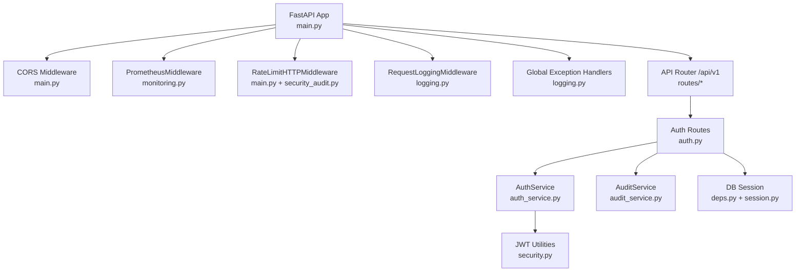
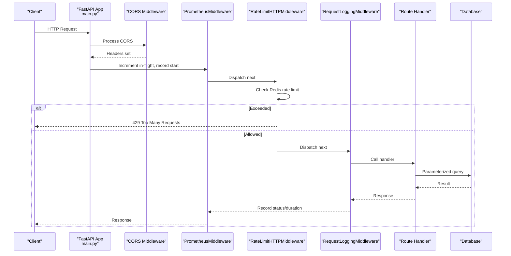
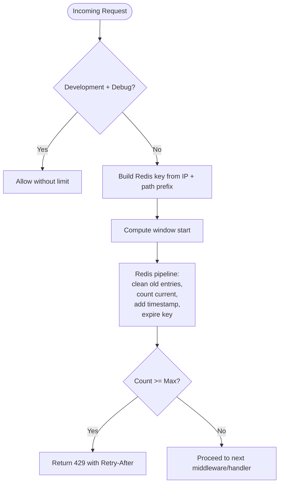
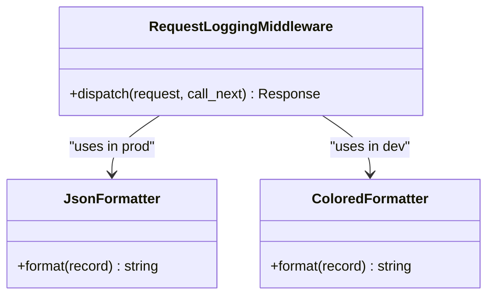
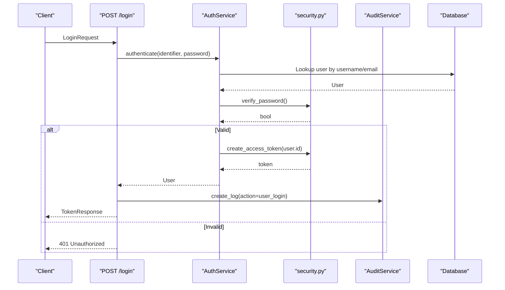
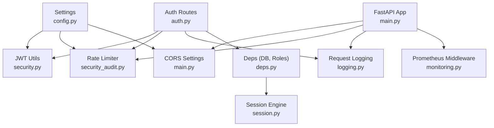

# Security Middleware & Protection

<cite>
**Referenced Files in This Document**
- [main.py](file://backend/app/main.py)
- [config.py](file://backend/app/core/config.py)
- [security.py](file://backend/app/core/security.py)
- [security_audit.py](file://backend/app/core/security_audit.py)
- [logging.py](file://backend/app/core/logging.py)
- [monitoring.py](file://backend/app/core/monitoring.py)
- [deps.py](file://backend/app/api/deps.py)
- [auth.py](file://backend/app/api/v1/routes/auth.py)
- [session.py](file://backend/app/db/session.py)
- [user.py](file://backend/app/schemas/user.py)
- [auth_schemas.py](file://backend/app/schemas/auth.py)
- [property.py](file://backend/app/schemas/property.py)
</cite>

## Table of Contents
1. [Introduction](#introduction)
2. [Project Structure](#project-structure)
3. [Core Components](#core-components)
4. [Architecture Overview](#architecture-overview)
5. [Detailed Component Analysis](#detailed-component-analysis)
6. [Dependency Analysis](#dependency-analysis)
7. [Performance Considerations](#performance-considerations)
8. [Troubleshooting Guide](#troubleshooting-guide)
9. [Conclusion](#conclusion)
10. [Appendices](#appendices)

## Introduction
This document explains the security middleware implementation and request/response processing chain for the backend service. It covers CORS configuration, rate limiting, input validation, SQL injection prevention, security headers guidance, custom middleware examples (request logging, IP whitelisting, request size limits), input sanitization, parameter validation using Pydantic models, database query parameterization, debugging security issues, monitoring suspicious activities, and implementing security audit trails.

## Project Structure
The security-related components are organized under core modules and integrated into the FastAPI application at startup:
- Application bootstrap and middleware wiring: main.py
- Configuration and environment-driven settings: config.py
- Authentication utilities and token handling: security.py
- Security audit utilities including rate limiting and refresh tokens: security_audit.py
- Structured logging and global exception handlers: logging.py
- Prometheus metrics collection: monitoring.py
- Dependency injection for DB sessions and role-based access: deps.py
- Auth routes demonstrating usage of services and audit logs: auth.py
- Database session setup: session.py
- Input validation schemas (Pydantic): user.py, auth_schemas.py, property.py

**Diagram sources**
- [main.py:17-78](file://backend/app/main.py#L17-L78)
- [monitoring.py:126-176](file://backend/app/core/monitoring.py#L126-L176)
- [security_audit.py:49-95](file://backend/app/core/security_audit.py#L49-L95)
- [logging.py:124-168](file://backend/app/core/logging.py#L124-L168)
- [auth.py:14-94](file://backend/app/api/v1/routes/auth.py#L14-L94)
- [session.py:1-14](file://backend/app/db/session.py#L1-L14)

**Section sources**
- [main.py:17-78](file://backend/app/main.py#L17-L78)
- [config.py:7-167](file://backend/app/core/config.py#L7-L167)

## Core Components
- CORS configuration: Configurable origins based on environment; credentials allowed; methods and headers wildcarded.
- Rate limiting: Redis-backed sliding window per client IP and endpoint prefix; returns 429 with Retry-After header when exceeded.
- Request logging: Structured JSON logs in production; colored console logs in development; masks sensitive fields; attaches request IDs and user IDs.
- Global exception handling: Normalizes error responses and logs structured errors.
- Metrics: Prometheus middleware collects request counts, latency, and in-flight requests; optional Celery task metrics.
- Authentication: JWT access tokens with configurable expiry; bcrypt password hashing; refresh token support.
- Authorization: Role-based guards via dependency functions.
- Input validation: Pydantic models enforce field types, lengths, ranges, and formats.
- SQL injection prevention: SQLAlchemy ORM and parameterized queries used throughout.

**Section sources**
- [main.py:27-60](file://backend/app/main.py#L27-L60)
- [security_audit.py:49-95](file://backend/app/core/security_audit.py#L49-L95)
- [logging.py:33-122](file://backend/app/core/logging.py#L33-L122)
- [logging.py:170-231](file://backend/app/core/logging.py#L170-L231)
- [monitoring.py:126-176](file://backend/app/core/monitoring.py#L126-L176)
- [security.py:9-34](file://backend/app/core/security.py#L9-L34)
- [deps.py:19-57](file://backend/app/api/deps.py#L19-L57)
- [auth_schemas.py:8-38](file://backend/app/schemas/auth.py#L8-L38)
- [user.py:8-45](file://backend/app/schemas/user.py#L8-L45)
- [property.py:11-44](file://backend/app/schemas/property.py#L11-L44)

## Architecture Overview
The middleware pipeline is applied in the order added to the FastAPI app. Requests traverse through Prometheus metrics, rate limiting, request logging, then reach route handlers. Responses traverse back through the same stack.

**Diagram sources**
- [main.py:33-60](file://backend/app/main.py#L33-L60)
- [monitoring.py:126-160](file://backend/app/core/monitoring.py#L126-L160)
- [security_audit.py:66-95](file://backend/app/core/security_audit.py#L66-L95)
- [logging.py:124-168](file://backend/app/core/logging.py#L124-L168)

## Detailed Component Analysis

### CORS Configuration
- Origins: In production, uses configured list; in development, allows all.
- Credentials: Enabled to support cookies or authorization headers from browsers.
- Methods and headers: Wildcarded for flexibility.

Recommendation: Tighten allow_methods and allow_headers to only what is required in production.

**Section sources**
- [main.py:27-39](file://backend/app/main.py#L27-L39)
- [config.py:40-44](file://backend/app/core/config.py#L40-L44)

### Rate Limiting
- Implementation: Token-bucket style using Redis sorted sets keyed by hashed client IP and path prefix.
- Behavior: Skips in debug mode; otherwise enforces max requests per window; returns 429 with Retry-After header.
- Integration: Wrapped in BaseHTTPMiddleware and added early in the pipeline.

**Diagram sources**
- [security_audit.py:66-95](file://backend/app/core/security_audit.py#L66-L95)
- [main.py:44-57](file://backend/app/main.py#L44-L57)

**Section sources**
- [security_audit.py:49-95](file://backend/app/core/security_audit.py#L49-L95)
- [main.py:44-57](file://backend/app/main.py#L44-L57)
- [config.py:153-161](file://backend/app/core/config.py#L153-L161)

### Request Logging and Sensitive Data Masking
- Adds a unique request ID to each request.
- Logs method, path, status code, duration, client IP, and user ID when available.
- Masks sensitive fields and patterns (passwords, phone numbers, emails).
- Produces structured JSON in production and colored console logs in development.

**Diagram sources**
- [logging.py:124-168](file://backend/app/core/logging.py#L124-L168)
- [logging.py:33-75](file://backend/app/core/logging.py#L33-L75)

**Section sources**
- [logging.py:33-122](file://backend/app/core/logging.py#L33-L122)
- [logging.py:124-168](file://backend/app/core/logging.py#L124-L168)

### Global Exception Handling
- Normalizes validation errors, HTTP exceptions, and unhandled exceptions into consistent JSON responses.
- Logs structured error details with request context.

**Section sources**
- [logging.py:170-231](file://backend/app/core/logging.py#L170-L231)

### Prometheus Metrics
- Tracks total requests, latency histograms, and in-flight gauge.
- Provides a /metrics endpoint for scraping.
- Optional Celery task metrics integration.

**Section sources**
- [monitoring.py:74-119](file://backend/app/core/monitoring.py#L74-L119)
- [monitoring.py:126-176](file://backend/app/core/monitoring.py#L126-L176)
- [monitoring.py:183-208](file://backend/app/core/monitoring.py#L183-L208)

### Authentication and Authorization
- Password hashing and verification with bcrypt.
- JWT access token creation and decoding with configurable algorithm and secret.
- Refresh token support for issuing new access tokens.
- Role-based dependencies for landlord, tenant, and admin access control.

**Diagram sources**
- [auth.py:37-60](file://backend/app/api/v1/routes/auth.py#L37-L60)
- [auth_service.py:29-38](file://backend/app/services/auth_service.py#L29-L38)
- [security.py:22-34](file://backend/app/core/security.py#L22-L34)

**Section sources**
- [security.py:9-34](file://backend/app/core/security.py#L9-L34)
- [security_audit.py:102-149](file://backend/app/core/security_audit.py#L102-L149)
- [deps.py:19-57](file://backend/app/api/deps.py#L19-L57)
- [auth.py:37-94](file://backend/app/api/v1/routes/auth.py#L37-L94)

### Input Validation with Pydantic Models
- Enforces field constraints such as min/max length, numeric ranges, email format, and enum values.
- Examples include registration/login payloads, user profiles, and property data.

**Section sources**
- [auth_schemas.py:8-38](file://backend/app/schemas/auth.py#L8-L38)
- [user.py:8-45](file://backend/app/schemas/user.py#L8-L45)
- [property.py:11-44](file://backend/app/schemas/property.py#L11-L44)

### SQL Injection Prevention
- Uses SQLAlchemy ORM and parameterized queries throughout.
- Avoids string concatenation for SQL; relies on ORM constructs and text-bound parameters where necessary.

**Section sources**
- [session.py:1-14](file://backend/app/db/session.py#L1-L14)
- [security_audit.py:25-36](file://backend/app/core/security_audit.py#L25-36)

### Security Headers Guidance
Current implementation does not add protective headers globally. Recommended additions:
- Content-Security-Policy: Restrict script sources and inline scripts.
- X-Frame-Options: Set DENY or SAMEORIGIN to prevent clickjacking.
- X-Content-Type-Options: nosniff to prevent MIME sniffing.
- Strict-Transport-Security: Enforce HTTPS in production.
- Referrer-Policy: Control referrer information.
- Permissions-Policy: Restrict browser features.

Implementation approach: Add a Starlette middleware that injects these headers on every response.

[No sources needed since this section provides general guidance]

### Custom Middleware Examples

#### Request Size Limits
- Purpose: Prevent large payload attacks and resource exhaustion.
- Approach: Create a middleware that inspects Content-Length and rejects oversized requests before body parsing.

[No sources needed since this section provides general guidance]

#### IP Whitelisting
- Purpose: Restrict access to specific endpoints to known IPs.
- Approach: Create a middleware that checks request.client.host against an allowlist and returns 403 if not permitted.

[No sources needed since this section provides general guidance]

#### Request Logging Enhancements
- Already implemented via RequestLoggingMiddleware; can be extended to capture additional fields like user agent or correlation IDs.

**Section sources**
- [logging.py:124-168](file://backend/app/core/logging.py#L124-L168)

## Dependency Analysis
The following diagram shows how core security components depend on configuration and integrate into the application lifecycle.

**Diagram sources**
- [config.py:7-167](file://backend/app/core/config.py#L7-L167)
- [security.py:22-34](file://backend/app/core/security.py#L22-L34)
- [security_audit.py:49-95](file://backend/app/core/security_audit.py#L49-L95)
- [main.py:27-60](file://backend/app/main.py#L27-L60)
- [logging.py:124-168](file://backend/app/core/logging.py#L124-L168)
- [monitoring.py:126-176](file://backend/app/core/monitoring.py#L126-L176)
- [auth.py:37-94](file://backend/app/api/v1/routes/auth.py#L37-L94)
- [deps.py:14-57](file://backend/app/api/deps.py#L14-L57)
- [session.py:1-14](file://backend/app/db/session.py#L1-L14)

**Section sources**
- [main.py:17-78](file://backend/app/main.py#L17-L78)
- [config.py:7-167](file://backend/app/core/config.py#L7-L167)

## Performance Considerations
- Rate limiting adds Redis round-trips; ensure Redis latency is low and consider batching or local fallbacks if needed.
- Request logging should avoid heavy serialization; current masking depth limit helps prevent excessive recursion.
- Prometheus metrics use lightweight counters and histograms; ensure scrape intervals are reasonable.
- CORS wildcarding in development is convenient but should be restricted in production to reduce overhead and risk.

[No sources needed since this section provides general guidance]

## Troubleshooting Guide
- Validate CORS behavior: Confirm origin lists and credentials settings match client expectations.
- Investigate rate limit rejections: Inspect Redis keys and count thresholds; check environment flags that skip limits in debug mode.
- Review structured logs: Use request_id to trace full request flow across middleware and handlers.
- Monitor metrics: Check /metrics for spikes in 4xx/5xx rates and latency percentiles.
- Audit trail: Verify audit logs for authentication events and critical actions.

**Section sources**
- [logging.py:124-168](file://backend/app/core/logging.py#L124-L168)
- [monitoring.py:167-176](file://backend/app/core/monitoring.py#L167-L176)
- [auth.py:22-28](file://backend/app/api/v1/routes/auth.py#L22-L28)

## Conclusion
The backend implements a robust security middleware pipeline with CORS, rate limiting, structured logging, global exception handling, and Prometheus metrics. Authentication leverages bcrypt and JWT with refresh token support, while authorization uses role-based dependencies. Input validation is enforced via Pydantic models, and SQL injection risks are mitigated through parameterized queries. To further harden the system, add protective security headers, implement request size limits, and introduce IP whitelisting for sensitive endpoints.

[No sources needed since this section summarizes without analyzing specific files]

## Appendices

### Security Audit Trail
- The system records audit logs for key actions such as user registration and login, capturing user ID, action type, resource identifiers, and IP address.

**Section sources**
- [auth.py:22-28](file://backend/app/api/v1/routes/auth.py#L22-L28)
- [auth.py:52-58](file://backend/app/api/v1/routes/auth.py#L52-L58)