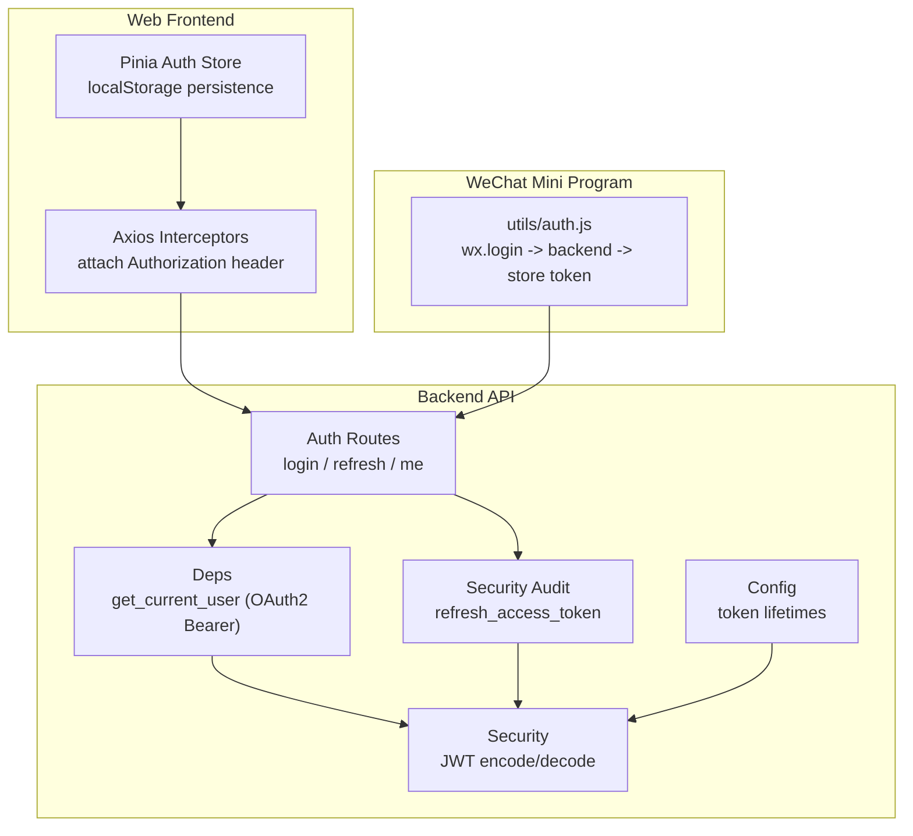
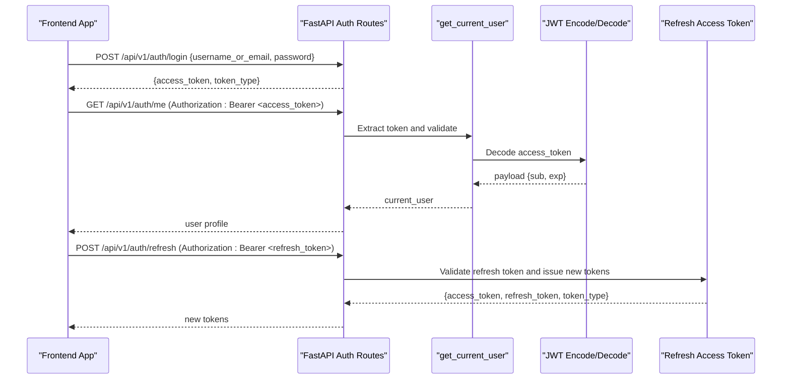
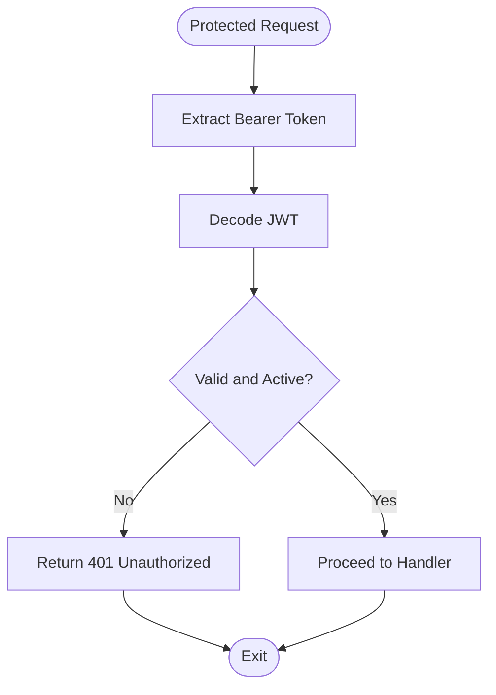
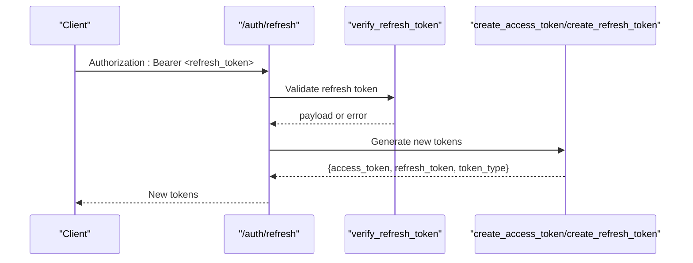
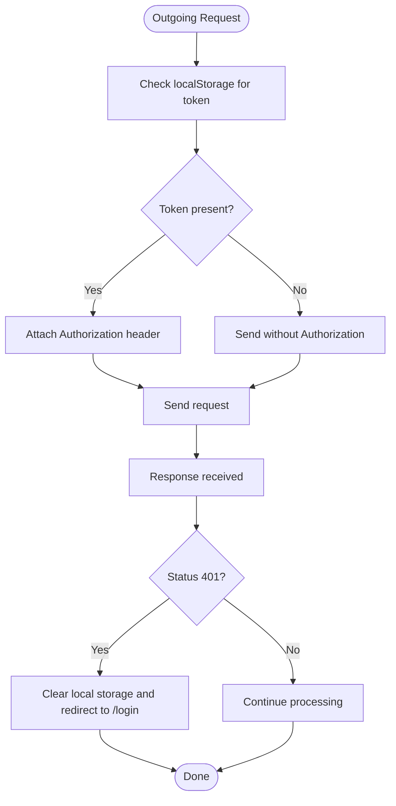
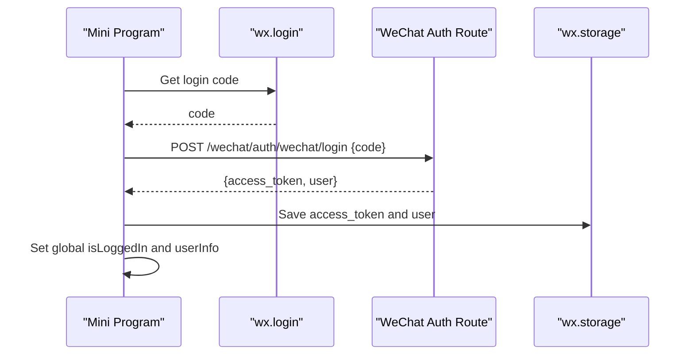
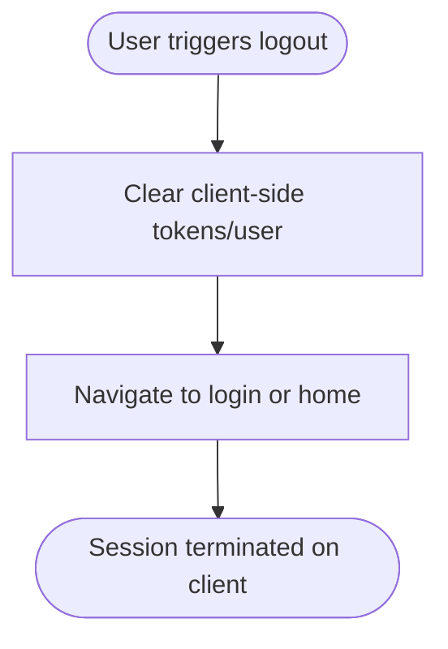
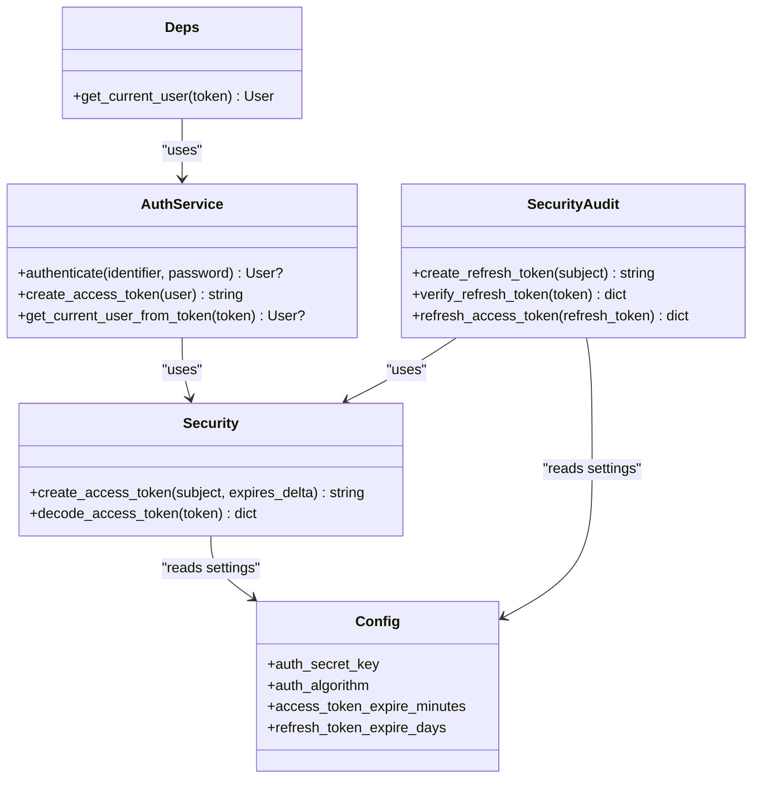

# Session Management & Logout

<cite>
**Referenced Files in This Document**
- [auth.py](file://backend/app/api/v1/routes/auth.py)
- [deps.py](file://backend/app/api/deps.py)
- [security.py](file://backend/app/core/security.py)
- [security_audit.py](file://backend/app/core/security_audit.py)
- [config.py](file://backend/app/core/config.py)
- [auth_service.py](file://backend/app/services/auth_service.py)
- [auth.ts](file://frontend/src/services/auth.ts)
- [api.ts](file://frontend/src/services/api.ts)
- [auth_store.ts](file://frontend/src/stores/auth.ts)
- [wechat_routes.py](file://backend/app/api/v1/routes/wechat.py)
- [auth_miniprogram.js](file://wechat-miniprogram/utils/auth.js)
</cite>

## Table of Contents
1. [Introduction](#introduction)
2. [Project Structure](#project-structure)
3. [Core Components](#core-components)
4. [Architecture Overview](#architecture-overview)
5. [Detailed Component Analysis](#detailed-component-analysis)
6. [Dependency Analysis](#dependency-analysis)
7. [Performance Considerations](#performance-considerations)
8. [Troubleshooting Guide](#troubleshooting-guide)
9. [Conclusion](#conclusion)
10. [Appendices](#appendices)

## Introduction
This document explains session management and logout procedures across the web frontend, backend API, and WeChat Mini Program. It covers token-based sessions (access tokens), automatic refresh via refresh tokens, session timeout handling, concurrent session considerations, logout flows, client-side cleanup, and secure storage practices. It also provides guidance for implementing “remember me,” cross-tab synchronization, mobile app background security, and strategies for handling session conflicts, forced logouts, and recovery.

## Project Structure
The session system spans three layers:
- Backend: FastAPI routes and dependencies for authentication, JWT creation/decoding, and refresh token issuance.
- Web Frontend: Axios interceptors attach Bearer tokens; Pinia store persists tokens and user data to localStorage.
- WeChat Mini Program: Local storage holds access tokens; login uses WeChat code exchange to obtain a JWT.

**Diagram sources**
- [auth.py:37-89](file://backend/app/api/v1/routes/auth.py#L37-L89)
- [deps.py:19-30](file://backend/app/api/deps.py#L19-L30)
- [security.py:22-33](file://backend/app/core/security.py#L22-L33)
- [security_audit.py:139-149](file://backend/app/core/security_audit.py#L139-L149)
- [config.py:26-38](file://backend/app/core/config.py#L26-L38)
- [auth.ts:10-21](file://frontend/src/services/auth.ts#L10-L21)
- [api.ts:12-22](file://frontend/src/services/api.ts#L12-L22)
- [auth_store.ts:17-42](file://frontend/src/stores/auth.ts#L17-L42)
- [auth_miniprogram.js:9-33](file://wechat-miniprogram/utils/auth.js#L9-L33)

**Section sources**
- [auth.py:37-89](file://backend/app/api/v1/routes/auth.py#L37-L89)
- [deps.py:19-30](file://backend/app/api/deps.py#L19-L30)
- [security.py:22-33](file://backend/app/core/security.py#L22-L33)
- [security_audit.py:139-149](file://backend/app/core/security_audit.py#L139-L149)
- [config.py:26-38](file://backend/app/core/config.py#L26-L38)
- [auth.ts:10-21](file://frontend/src/services/auth.ts#L10-L21)
- [api.ts:12-22](file://frontend/src/services/api.ts#L12-L22)
- [auth_store.ts:17-42](file://frontend/src/stores/auth.ts#L17-L42)
- [auth_miniprogram.js:9-33](file://wechat-miniprogram/utils/auth.js#L9-L33)

## Core Components
- Access Token Lifecycle
  - Creation: The backend creates short-lived access tokens signed with HS256 using a secret key and configurable expiration minutes.
  - Decoding: Protected endpoints decode the token to identify the subject (user ID).
  - Expiration: When expired or invalid, protected endpoints return 401 Unauthorized.

- Refresh Token Flow
  - A dedicated endpoint accepts a refresh token in the Authorization header and returns new access and refresh tokens.
  - Refresh tokens are long-lived by configuration and carry an explicit type claim.

- Authentication Dependencies
  - OAuth2PasswordBearer extracts the Bearer token from requests.
  - get_current_user decodes the token and validates the user’s active status.

- Client-Side Persistence
  - Web: Axios interceptor attaches Authorization headers; Pinia store persists tokens and user info to localStorage.
  - WeChat Mini Program: Stores access_token and user in wx.storage and updates global state.

**Section sources**
- [security.py:22-33](file://backend/app/core/security.py#L22-L33)
- [security_audit.py:102-149](file://backend/app/core/security_audit.py#L102-L149)
- [auth.py:37-89](file://backend/app/api/v1/routes/auth.py#L37-L89)
- [deps.py:19-30](file://backend/app/api/deps.py#L19-L30)
- [api.ts:12-22](file://frontend/src/services/api.ts#L12-L22)
- [auth_store.ts:17-42](file://frontend/src/stores/auth.ts#L17-L42)
- [auth_miniprogram.js:9-33](file://wechat-miniprogram/utils/auth.js#L9-L33)

## Architecture Overview
End-to-end flow for login, protected access, and token refresh.

**Diagram sources**
- [auth.py:37-89](file://backend/app/api/v1/routes/auth.py#L37-L89)
- [deps.py:19-30](file://backend/app/api/deps.py#L19-L30)
- [security.py:22-33](file://backend/app/core/security.py#L22-L33)
- [security_audit.py:139-149](file://backend/app/core/security_audit.py#L139-L149)

## Detailed Component Analysis

### Backend Authentication and Token Handling
- Login Endpoint
  - Validates credentials and returns an access token.
  - Emits audit logs for login events.
- Refresh Endpoint
  - Accepts a refresh token in the Authorization header.
  - Returns both a new access token and a new refresh token.
- Current User Dependency
  - Uses OAuth2 Bearer scheme to extract the token.
  - Decodes and verifies the token; returns 401 if invalid/expired.

**Diagram sources**
- [deps.py:19-30](file://backend/app/api/deps.py#L19-L30)
- [security.py:31-33](file://backend/app/core/security.py#L31-L33)

**Section sources**
- [auth.py:37-89](file://backend/app/api/v1/routes/auth.py#L37-L89)
- [deps.py:19-30](file://backend/app/api/deps.py#L19-L30)
- [security.py:22-33](file://backend/app/core/security.py#L22-L33)

### Token Refresh Implementation
- Refresh Token Verification
  - Ensures token type is “refresh” and not expired.
- Issuance
  - Issues a new access token and a new refresh token on successful validation.

**Diagram sources**
- [auth.py:63-89](file://backend/app/api/v1/routes/auth.py#L63-L89)
- [security_audit.py:113-149](file://backend/app/core/security_audit.py#L113-L149)

**Section sources**
- [auth.py:63-89](file://backend/app/api/v1/routes/auth.py#L63-L89)
- [security_audit.py:102-149](file://backend/app/core/security_audit.py#L102-L149)

### Web Frontend Session Storage and Interceptors
- Axios Interceptor
  - Attaches Authorization header when a token exists in localStorage.
  - On 401 responses, clears local storage and redirects to login (except during login attempts).
- Pinia Auth Store
  - Persists access_token and user to localStorage.
  - Provides login, logout, and fetchCurrentUser operations.

**Diagram sources**
- [api.ts:12-54](file://frontend/src/services/api.ts#L12-L54)
- [auth_store.ts:17-42](file://frontend/src/stores/auth.ts#L17-L42)

**Section sources**
- [api.ts:12-54](file://frontend/src/services/api.ts#L12-L54)
- [auth_store.ts:17-42](file://frontend/src/stores/auth.ts#L17-L42)

### WeChat Mini Program Session Handling
- Login Flow
  - Calls wx.login to obtain a code, exchanges it for a JWT at the backend, and stores access_token and user in wx.storage.
- Global State
  - Updates app.globalData.isLoggedIn and userInfo after successful login.
- Logout
  - Clears stored tokens and resets global state.

**Diagram sources**
- [auth_miniprogram.js:9-33](file://wechat-miniprogram/utils/auth.js#L9-L33)
- [wechat_routes.py:19-38](file://backend/app/api/v1/routes/wechat.py#L19-L38)

**Section sources**
- [auth_miniprogram.js:9-33](file://wechat-miniprogram/utils/auth.js#L9-L33)
- [wechat_routes.py:19-38](file://backend/app/api/v1/routes/wechat.py#L19-L38)

### Logout Across Platforms
- Web Frontend
  - Clears local storage and navigates to login page.
- WeChat Mini Program
  - Removes access_token and user from storage and resets global flags.
- Backend
  - Stateless JWT design means server-side invalidation requires additional mechanisms (see recommendations below).

**Diagram sources**
- [auth_store.ts:78-81](file://frontend/src/stores/auth.ts#L78-L81)
- [auth_miniprogram.js:58-63](file://wechat-miniprogram/utils/auth.js#L58-L63)

**Section sources**
- [auth_store.ts:78-81](file://frontend/src/stores/auth.ts#L78-L81)
- [auth_miniprogram.js:58-63](file://wechat-miniprogram/utils/auth.js#L58-L63)

## Dependency Analysis
Key relationships between components involved in session management:

**Diagram sources**
- [auth_service.py:29-51](file://backend/app/services/auth_service.py#L29-L51)
- [security.py:22-33](file://backend/app/core/security.py#L22-L33)
- [security_audit.py:102-149](file://backend/app/core/security_audit.py#L102-L149)
- [deps.py:19-30](file://backend/app/api/deps.py#L19-L30)
- [config.py:26-38](file://backend/app/core/config.py#L26-L38)

**Section sources**
- [auth_service.py:29-51](file://backend/app/services/auth_service.py#L29-L51)
- [security.py:22-33](file://backend/app/core/security.py#L22-L33)
- [security_audit.py:102-149](file://backend/app/core/security_audit.py#L102-L149)
- [deps.py:19-30](file://backend/app/api/deps.py#L19-L30)
- [config.py:26-38](file://backend/app/core/config.py#L26-L38)

## Performance Considerations
- Short-lived access tokens reduce exposure risk but increase refresh calls; implement proactive refresh before expiry to avoid 401 interruptions.
- Avoid storing large payloads in tokens; keep JWT minimal (subject and exp).
- Use efficient client-side checks to prevent unnecessary network calls when tokens are valid.
- For high concurrency, ensure token decoding and user lookups are optimized; consider caching user profiles briefly if needed.

[No sources needed since this section provides general guidance]

## Troubleshooting Guide
Common issues and resolutions:
- 401 Unauthorized on protected endpoints
  - Cause: Missing, expired, or invalid token.
  - Resolution: Ensure Authorization header is attached; handle 401 by clearing storage and redirecting to login; use refresh endpoint to obtain new tokens.
- Refresh token rejected
  - Cause: Invalid token type or expired refresh token.
  - Resolution: Confirm refresh token is used only on the refresh endpoint; prompt re-login if expired.
- Cross-tab inconsistencies
  - Cause: Tokens updated in one tab not reflected in others.
  - Resolution: Implement storage event listeners to sync state across tabs.
- Forced logout scenarios
  - Cause: Server-side revocation not enforced due to stateless JWT.
  - Resolution: Introduce a server-side token blacklist or versioned claims to invalidate sessions centrally.

**Section sources**
- [api.ts:24-54](file://frontend/src/services/api.ts#L24-L54)
- [auth.py:63-89](file://backend/app/api/v1/routes/auth.py#L63-L89)
- [deps.py:19-30](file://backend/app/api/deps.py#L19-L30)

## Conclusion
The system implements a robust, stateless JWT session model with short-lived access tokens and long-lived refresh tokens. Clients persist tokens securely and handle 401 errors gracefully. To enhance security and control, consider adding server-side token revocation, proactive refresh logic, and cross-tab synchronization. Mobile apps should leverage platform secure storage and enforce background task protections.

[No sources needed since this section summarizes without analyzing specific files]

## Appendices

### Implementing “Remember Me”
- Strategy
  - Persist access_token and user in localStorage (web) or wx.storage (mini program).
  - Optionally store a refresh token securely and use it to renew access tokens automatically.
- Considerations
  - Limit “remember me” duration via refresh token lifetime.
  - Provide clear UI controls to revoke remembered sessions.

[No sources needed since this section provides general guidance]

### Session Persistence and Cross-Tab Synchronization
- Web
  - Listen to storage events to synchronize token changes across tabs.
  - On refresh, restore state from localStorage and verify with /auth/me.
- Mini Program
  - On app launch, check storage and perform silent login if needed.

[No sources needed since this section provides general guidance]

### Mobile App Background Task Security
- Do not schedule sensitive tasks while unauthenticated.
- Re-validate tokens before background operations.
- Use secure storage APIs provided by the platform.

[No sources needed since this section provides general guidance]

### Secure Session Storage Practices
- Prefer HttpOnly cookies for web where feasible to mitigate XSS risks.
- If using localStorage, ensure strict CSP and sanitize inputs.
- Rotate secrets regularly and configure appropriate token lifetimes.

[No sources needed since this section provides general guidance]

### Handling Session Conflicts and Recovery
- Conflicts
  - Multiple devices may hold different tokens; prefer server-side revocation lists or token versions to resolve conflicts.
- Recovery
  - After forced logout, clients should clear local state and prompt re-authentication.
  - Provide graceful fallbacks when refresh fails (e.g., show login screen).

[No sources needed since this section provides general guidance]