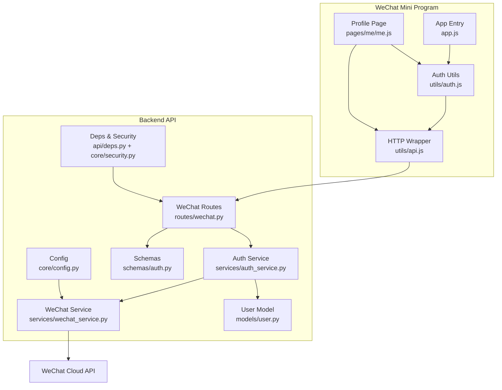
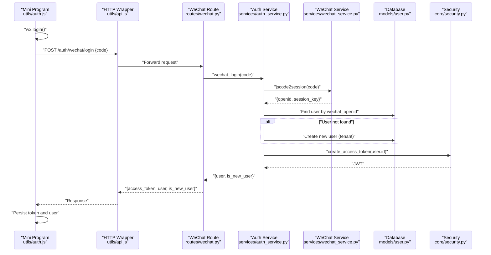
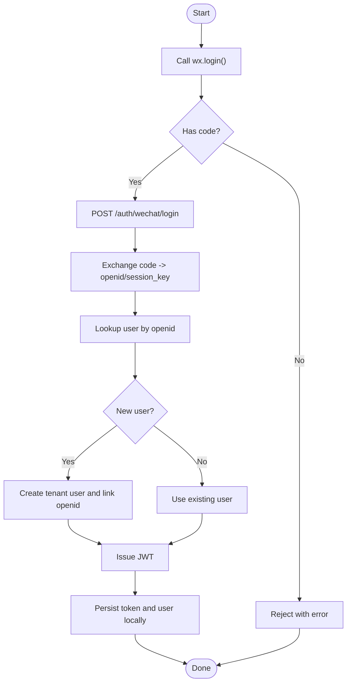
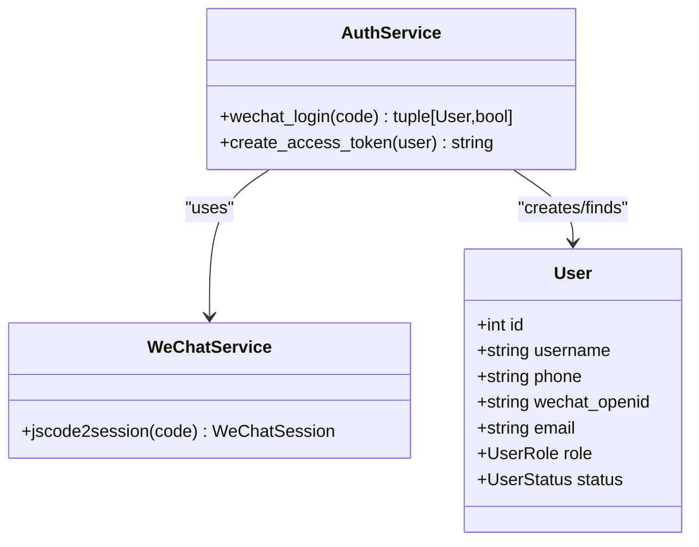
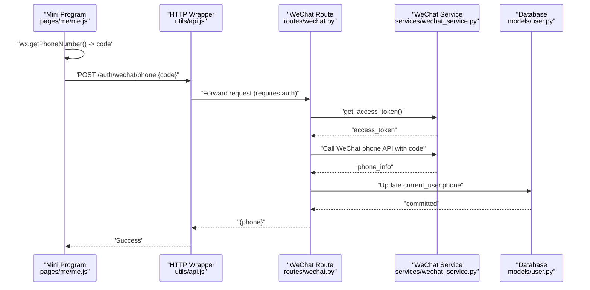
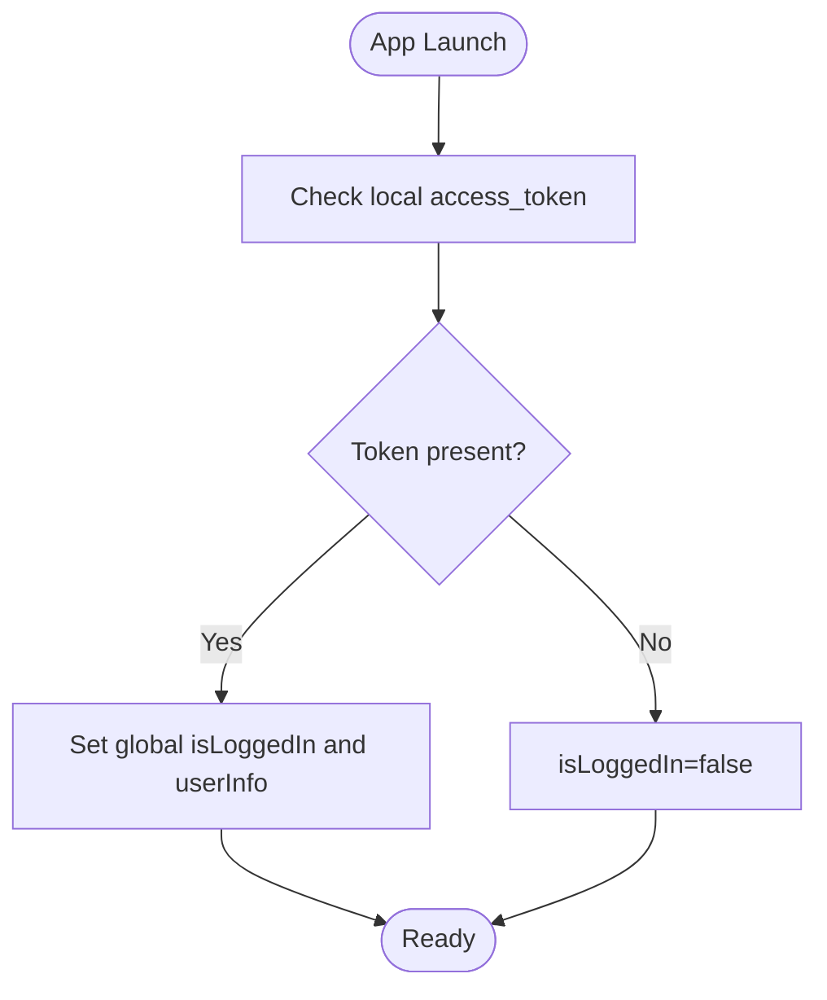
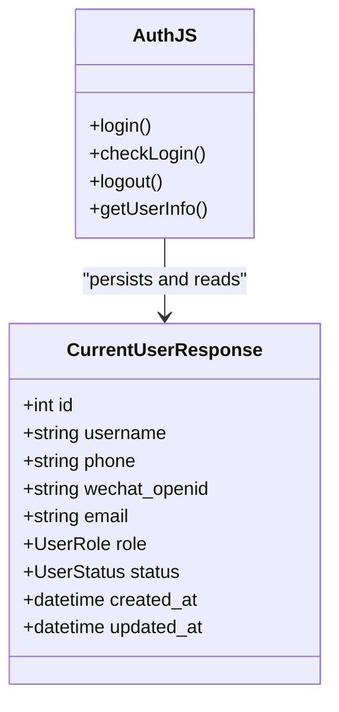
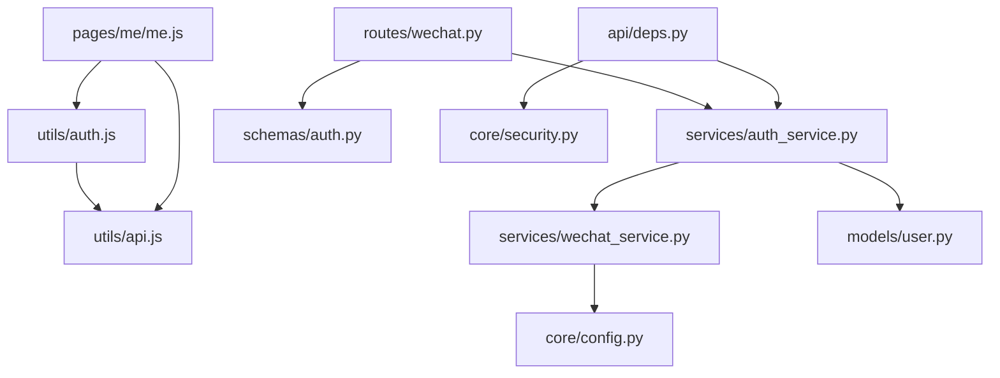

# WeChat Mini Program Authentication

<cite>
**Referenced Files in This Document**
- [auth.js](file://wechat-miniprogram/utils/auth.js)
- [api.js](file://wechat-miniprogram/utils/api.js)
- [app.js](file://wechat-miniprogram/app.js)
- [me.js](file://wechat-miniprogram/pages/me/me.js)
- [wechat.py](file://backend/app/api/v1/routes/wechat.py)
- [auth_service.py](file://backend/app/services/auth_service.py)
- [wechat_service.py](file://backend/app/services/wechat_service.py)
- [auth.py](file://backend/app/schemas/auth.py)
- [user.py](file://backend/app/models/user.py)
- [security.py](file://backend/app/core/security.py)
- [deps.py](file://backend/app/api/deps.py)
- [config.py](file://backend/app/core/config.py)
- [test_wechat.py](file://backend/tests/test_wechat.py)
</cite>

## Table of Contents
1. [Introduction](#introduction)
2. [Project Structure](#project-structure)
3. [Core Components](#core-components)
4. [Architecture Overview](#architecture-overview)
5. [Detailed Component Analysis](#detailed-component-analysis)
6. [Dependency Analysis](#dependency-analysis)
7. [Performance Considerations](#performance-considerations)
8. [Troubleshooting Guide](#troubleshooting-guide)
9. [Conclusion](#conclusion)
10. [Appendices](#appendices)

## Introduction
This document explains the end-to-end authentication integration for the WeChat Mini Program, covering:
- Login flow from wx.login() code exchange to session establishment and JWT issuance
- OpenID retrieval and user identification
- Automatic user creation for new WeChat users and linking for existing users
- Phone number binding workflow and profile synchronization
- Session persistence and user state management across pages
- Security considerations for code transmission, session management, and privacy compliance

## Project Structure
The authentication spans both frontend (Mini Program) and backend services:
- Frontend: login orchestration, token storage, API interceptor, and UI flows
- Backend: FastAPI routes, service layer for WeChat APIs, user management, JWT security, and configuration

**Diagram sources**
- [app.js:1-21](file://wechat-miniprogram/app.js#L1-L21)
- [auth.js:1-81](file://wechat-miniprogram/utils/auth.js#L1-L81)
- [api.js:1-52](file://wechat-miniprogram/utils/api.js#L1-L52)
- [me.js:1-104](file://wechat-miniprogram/pages/me/me.js#L1-L104)
- [wechat.py:1-82](file://backend/app/api/v1/routes/wechat.py#L1-L82)
- [auth_service.py:1-77](file://backend/app/services/auth_service.py#L1-L77)
- [wechat_service.py:1-146](file://backend/app/services/wechat_service.py#L1-L146)
- [auth.py:1-63](file://backend/app/schemas/auth.py#L1-L63)
- [user.py:1-48](file://backend/app/models/user.py#L1-L48)
- [deps.py:1-58](file://backend/app/api/deps.py#L1-L58)
- [security.py:1-34](file://backend/app/core/security.py#L1-L34)
- [config.py:1-167](file://backend/app/core/config.py#L1-L167)

**Section sources**
- [app.js:1-21](file://wechat-miniprogram/app.js#L1-L21)
- [auth.js:1-81](file://wechat-miniprogram/utils/auth.js#L1-L81)
- [api.js:1-52](file://wechat-miniprogram/utils/api.js#L1-L52)
- [me.js:1-104](file://wechat-miniprogram/pages/me/me.js#L1-L104)
- [wechat.py:1-82](file://backend/app/api/v1/routes/wechat.py#L1-L82)
- [auth_service.py:1-77](file://backend/app/services/auth_service.py#L1-L77)
- [wechat_service.py:1-146](file://backend/app/services/wechat_service.py#L1-L146)
- [auth.py:1-63](file://backend/app/schemas/auth.py#L1-L63)
- [user.py:1-48](file://backend/app/models/user.py#L1-L48)
- [deps.py:1-58](file://backend/app/api/deps.py#L1-L58)
- [security.py:1-34](file://backend/app/core/security.py#L1-L34)
- [config.py:1-167](file://backend/app/core/config.py#L1-L167)

## Core Components
- Mini Program Auth Utils: orchestrates wx.login(), exchanges code with backend, persists tokens and user info, checks login status, and handles logout.
- HTTP Wrapper: attaches Authorization header, handles 401 by clearing local state, and centralizes error display.
- App Entry: initializes global state and checks login on launch.
- Profile Page: triggers login, phone binding, role switching, and logout flows.
- Backend WeChat Routes: endpoints for login, phone binding, and config exposure.
- Auth Service: performs openid lookup/creation, returns JWT-ready user.
- WeChat Service: calls WeChat APIs (code2session, access token, messages).
- Schemas: request/response models for WeChat login and phone binding.
- User Model: stores openid, phone, roles, and status.
- Security: JWT encode/decode and password hashing utilities.
- Config: environment-driven settings including WeChat appid/secret and token expiry.

**Section sources**
- [auth.js:1-81](file://wechat-miniprogram/utils/auth.js#L1-L81)
- [api.js:1-52](file://wechat-miniprogram/utils/api.js#L1-L52)
- [app.js:1-21](file://wechat-miniprogram/app.js#L1-L21)
- [me.js:1-104](file://wechat-miniprogram/pages/me/me.js#L1-L104)
- [wechat.py:1-82](file://backend/app/api/v1/routes/wechat.py#L1-L82)
- [auth_service.py:1-77](file://backend/app/services/auth_service.py#L1-L77)
- [wechat_service.py:1-146](file://backend/app/services/wechat_service.py#L1-L146)
- [auth.py:1-63](file://backend/app/schemas/auth.py#L1-L63)
- [user.py:1-48](file://backend/app/models/user.py#L1-L48)
- [security.py:1-34](file://backend/app/core/security.py#L1-L34)
- [config.py:1-167](file://backend/app/core/config.py#L1-L167)

## Architecture Overview
End-to-end login sequence from Mini Program to backend and WeChat cloud:

**Diagram sources**
- [auth.js:1-81](file://wechat-miniprogram/utils/auth.js#L1-L81)
- [api.js:1-52](file://wechat-miniprogram/utils/api.js#L1-L52)
- [wechat.py:1-82](file://backend/app/api/v1/routes/wechat.py#L1-L82)
- [auth_service.py:1-77](file://backend/app/services/auth_service.py#L1-L77)
- [wechat_service.py:1-146](file://backend/app/services/wechat_service.py#L1-L146)
- [user.py:1-48](file://backend/app/models/user.py#L1-L48)
- [security.py:1-34](file://backend/app/core/security.py#L1-L34)

## Detailed Component Analysis

### Login Flow: wx.login() to JWT
- Mini Program calls wx.login() to obtain a temporary code.
- Sends code to backend via POST /api/v1/auth/wechat/login.
- Backend exchanges code for openid using WeChat jscode2session.
- Looks up user by openid; if missing, creates a new tenant user and links openid.
- Issues JWT and returns it along with user info and is_new_user flag.
- Mini Program persists access_token and user object in local storage and updates global state.

**Diagram sources**
- [auth.js:1-81](file://wechat-miniprogram/utils/auth.js#L1-L81)
- [wechat.py:1-82](file://backend/app/api/v1/routes/wechat.py#L1-L82)
- [auth_service.py:1-77](file://backend/app/services/auth_service.py#L1-L77)
- [wechat_service.py:1-146](file://backend/app/services/wechat_service.py#L1-L146)
- [user.py:1-48](file://backend/app/models/user.py#L1-L48)
- [security.py:1-34](file://backend/app/core/security.py#L1-L34)

**Section sources**
- [auth.js:1-81](file://wechat-miniprogram/utils/auth.js#L1-L81)
- [wechat.py:1-82](file://backend/app/api/v1/routes/wechat.py#L1-L82)
- [auth_service.py:1-77](file://backend/app/services/auth_service.py#L1-L77)
- [wechat_service.py:1-146](file://backend/app/services/wechat_service.py#L1-L146)
- [user.py:1-48](file://backend/app/models/user.py#L1-L48)
- [security.py:1-34](file://backend/app/core/security.py#L1-L34)

### Automatic User Creation and Linking
- If no user exists for the openid, a new user is created with default tenant role and a generated username derived from openid.
- The openid is linked to the newly created user record.
- Subsequent logins with the same openid will return the existing user and is_new_user = false.

**Diagram sources**
- [auth_service.py:1-77](file://backend/app/services/auth_service.py#L1-L77)
- [wechat_service.py:1-146](file://backend/app/services/wechat_service.py#L1-L146)
- [user.py:1-48](file://backend/app/models/user.py#L1-L48)

**Section sources**
- [auth_service.py:1-77](file://backend/app/services/auth_service.py#L1-L77)
- [user.py:1-48](file://backend/app/models/user.py#L1-L48)

### Phone Number Binding Workflow
- After login, the user can bind their phone number using WeChat’s getPhoneNumber flow.
- The Mini Program sends the returned code to POST /api/v1/auth/wechat/phone.
- Backend obtains a WeChat access token and calls the phone number API to retrieve the phone number.
- The phone number is saved to the current user and persisted.

**Diagram sources**
- [me.js:1-104](file://wechat-miniprogram/pages/me/me.js#L1-L104)
- [api.js:1-52](file://wechat-miniprogram/utils/api.js#L1-L52)
- [wechat.py:1-82](file://backend/app/api/v1/routes/wechat.py#L1-L82)
- [wechat_service.py:1-146](file://backend/app/services/wechat_service.py#L1-L146)
- [user.py:1-48](file://backend/app/models/user.py#L1-L48)

**Section sources**
- [me.js:1-104](file://wechat-miniprogram/pages/me/me.js#L1-L104)
- [wechat.py:1-82](file://backend/app/api/v1/routes/wechat.py#L1-L82)
- [wechat_service.py:1-146](file://backend/app/services/wechat_service.py#L1-L146)

### Session Persistence and State Management
- On successful login, the Mini Program stores access_token and user JSON in local storage and sets global isLoggedIn and userInfo flags.
- The HTTP wrapper automatically attaches Bearer token to requests and clears local state on 401 responses, prompting re-login.
- App entry checks for an existing token on launch and restores login state accordingly.

**Diagram sources**
- [app.js:1-21](file://wechat-miniprogram/app.js#L1-L21)
- [auth.js:1-81](file://wechat-miniprogram/utils/auth.js#L1-L81)
- [api.js:1-52](file://wechat-miniprogram/utils/api.js#L1-L52)

**Section sources**
- [app.js:1-21](file://wechat-miniprogram/app.js#L1-L21)
- [auth.js:1-81](file://wechat-miniprogram/utils/auth.js#L1-L81)
- [api.js:1-52](file://wechat-miniprogram/utils/api.js#L1-L52)

### User Profile Synchronization
- The backend returns a CurrentUserResponse containing id, username, phone, wechat_openid, email, role, status, and timestamps.
- The Mini Program stores this user object and refreshes UI components when needed (e.g., after phone binding or role switch).

**Diagram sources**
- [auth.py:1-63](file://backend/app/schemas/auth.py#L1-L63)
- [auth.js:1-81](file://wechat-miniprogram/utils/auth.js#L1-L81)

**Section sources**
- [auth.py:1-63](file://backend/app/schemas/auth.py#L1-L63)
- [auth.js:1-81](file://wechat-miniprogram/utils/auth.js#L1-L81)

### Security Considerations
- Code Transmission:
  - Temporary codes are short-lived and should be sent immediately over HTTPS to the backend.
  - Avoid logging or storing wx.login() codes beyond immediate use.
- Session Management:
  - JWTs are issued with configurable expiration; clients must handle 401 by clearing local state and re-authenticating.
  - Tokens are stored in secure local storage and attached via Authorization header.
- Privacy Compliance:
  - Only collect necessary user data (openid, phone if consented).
  - Respect WeChat platform policies for phone number collection and template messaging.
  - Ensure secrets (appid, secret, auth keys) are managed via environment variables and never exposed to the client.

**Section sources**
- [api.js:1-52](file://wechat-miniprogram/utils/api.js#L1-L52)
- [auth.py:1-63](file://backend/app/schemas/auth.py#L1-L63)
- [config.py:1-167](file://backend/app/core/config.py#L1-L167)
- [security.py:1-34](file://backend/app/core/security.py#L1-L34)

## Dependency Analysis
Key dependencies and relationships:
- Mini Program utils depend on each other and on global app state.
- Backend routes depend on services and schemas.
- Services depend on configuration and external APIs.
- Security utilities provide JWT operations used by auth service and dependency injection.

**Diagram sources**
- [auth.js:1-81](file://wechat-miniprogram/utils/auth.js#L1-L81)
- [api.js:1-52](file://wechat-miniprogram/utils/api.js#L1-L52)
- [me.js:1-104](file://wechat-miniprogram/pages/me/me.js#L1-L104)
- [wechat.py:1-82](file://backend/app/api/v1/routes/wechat.py#L1-L82)
- [auth_service.py:1-77](file://backend/app/services/auth_service.py#L1-L77)
- [wechat_service.py:1-146](file://backend/app/services/wechat_service.py#L1-L146)
- [auth.py:1-63](file://backend/app/schemas/auth.py#L1-L63)
- [user.py:1-48](file://backend/app/models/user.py#L1-L48)
- [deps.py:1-58](file://backend/app/api/deps.py#L1-L58)
- [security.py:1-34](file://backend/app/core/security.py#L1-L34)
- [config.py:1-167](file://backend/app/core/config.py#L1-L167)

**Section sources**
- [auth.js:1-81](file://wechat-miniprogram/utils/auth.js#L1-L81)
- [api.js:1-52](file://wechat-miniprogram/utils/api.js#L1-L52)
- [me.js:1-104](file://wechat-miniprogram/pages/me/me.js#L1-L104)
- [wechat.py:1-82](file://backend/app/api/v1/routes/wechat.py#L1-L82)
- [auth_service.py:1-77](file://backend/app/services/auth_service.py#L1-L77)
- [wechat_service.py:1-146](file://backend/app/services/wechat_service.py#L1-L146)
- [auth.py:1-63](file://backend/app/schemas/auth.py#L1-L63)
- [user.py:1-48](file://backend/app/models/user.py#L1-L48)
- [deps.py:1-58](file://backend/app/api/deps.py#L1-L58)
- [security.py:1-34](file://backend/app/core/security.py#L1-L34)
- [config.py:1-167](file://backend/app/core/config.py#L1-L167)

## Performance Considerations
- Token Caching:
  - WeChat access token is cached in memory with expiration handling to reduce network calls.
- Local Storage:
  - Keep only minimal state (token and user) to avoid heavy payloads.
- Request Interceptor:
  - Centralized error handling prevents redundant retries and improves UX.
- Database Queries:
  - Lookup by unique openid index ensures fast user resolution.

[No sources needed since this section provides general guidance]

## Troubleshooting Guide
Common issues and resolutions:
- Invalid or Expired Code:
  - Re-run wx.login() to obtain a fresh code before calling backend login endpoint.
- 401 Unauthorized:
  - Clear local token and user, then trigger re-login.
- Phone Binding Failure:
  - Verify that the phone binding code is valid and recent; check WeChat API response details.
- Configuration Errors:
  - Ensure WECHAT_APPID and WECHAT_SECRET are correctly set in environment variables.

**Section sources**
- [api.js:1-52](file://wechat-miniprogram/utils/api.js#L1-L52)
- [wechat.py:1-82](file://backend/app/api/v1/routes/wechat.py#L1-L82)
- [config.py:1-167](file://backend/app/core/config.py#L1-L167)
- [test_wechat.py:1-183](file://backend/tests/test_wechat.py#L1-L183)

## Conclusion
The WeChat Mini Program authentication integrates seamlessly with the backend to provide secure, stateless sessions via JWT. It supports automatic user creation, openid-based identification, phone number binding, and consistent user state across pages. Proper handling of tokens, privacy-conscious data practices, and robust error management ensure a reliable and compliant experience.

[No sources needed since this section summarizes without analyzing specific files]

## Appendices

### API Definitions
- POST /api/v1/auth/wechat/login
  - Request body: WeChatLoginRequest { code }
  - Response: WeChatLoginResponse { access_token, token_type, is_new_user, user }
- POST /api/v1/auth/wechat/phone
  - Requires Bearer token
  - Request body: WeChatPhoneRequest { code, iv?, encrypted_data? }
  - Response: { phone }
- GET /api/v1/wechat/config
  - Response: WeChatConfigResponse { appid }

**Section sources**
- [wechat.py:1-82](file://backend/app/api/v1/routes/wechat.py#L1-L82)
- [auth.py:1-63](file://backend/app/schemas/auth.py#L1-L63)

### Data Models
- User fields include id, username, phone, wechat_openid, email, role, status, and timestamps.
- CurrentUserResponse exposes these fields for client consumption.

**Section sources**
- [user.py:1-48](file://backend/app/models/user.py#L1-L48)
- [auth.py:1-63](file://backend/app/schemas/auth.py#L1-L63)