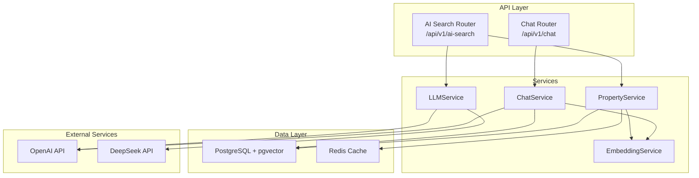
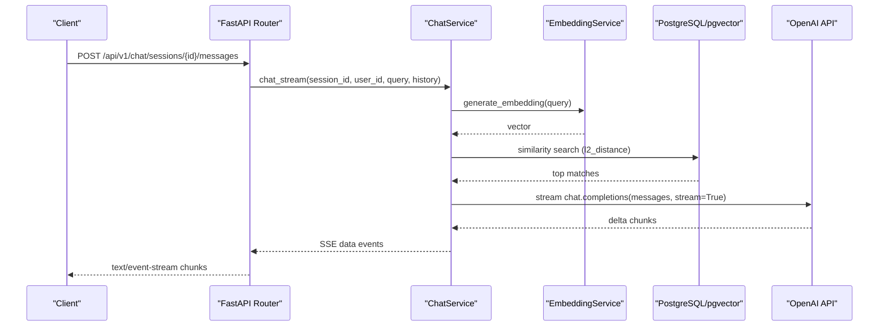
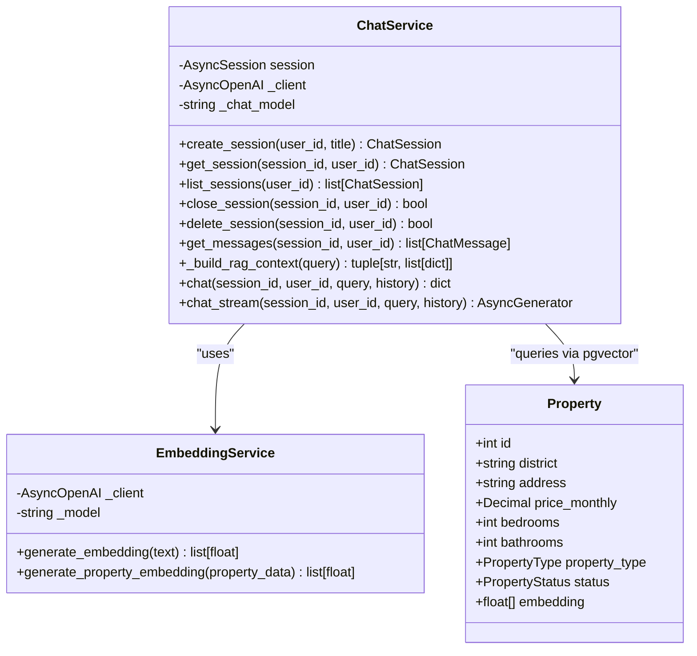
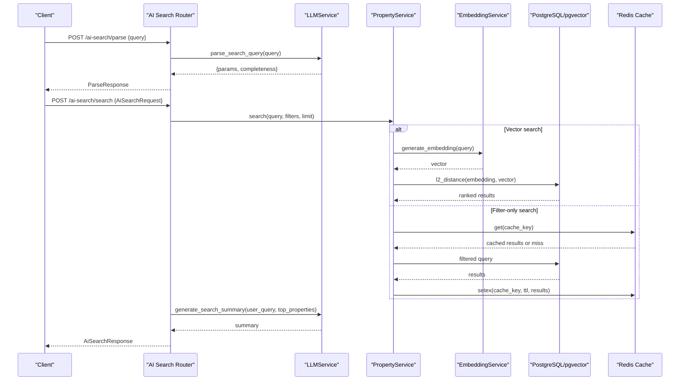
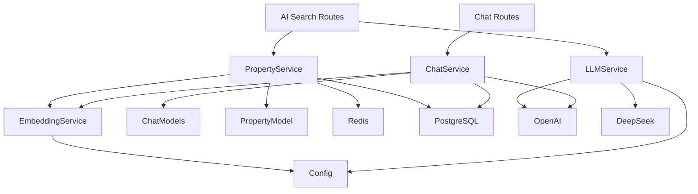

# AI Chat & Search Routes

<cite>
**Referenced Files in This Document**
- [chat.py](file://backend/app/api/v1/routes/chat.py)
- [ai_search.py](file://backend/app/api/v1/routes/ai_search.py)
- [router.py](file://backend/app/api/v1/router.py)
- [main.py](file://backend/app/main.py)
- [chat_service.py](file://backend/app/services/chat_service.py)
- [embedding_service.py](file://backend/app/services/embedding_service.py)
- [llm_service.py](file://backend/app/services/llm_service.py)
- [property_service.py](file://backend/app/services/property_service.py)
- [config.py](file://backend/app/core/config.py)
- [chat_models.py](file://backend/app/models/chat.py)
- [property_model.py](file://backend/app/models/property.py)
- [ai_search_schemas.py](file://backend/app/schemas/ai_search.py)
- [embedding_tasks.py](file://backend/app/tasks/embedding_tasks.py)
- [security_audit.py](file://backend/app/core/security_audit.py)
</cite>

## Table of Contents
1. [Introduction](#introduction)
2. [Project Structure](#project-structure)
3. [Core Components](#core-components)
4. [Architecture Overview](#architecture-overview)
5. [Detailed Component Analysis](#detailed-component-analysis)
6. [Dependency Analysis](#dependency-analysis)
7. [Performance Considerations](#performance-considerations)
8. [Troubleshooting Guide](#troubleshooting-guide)
9. [Conclusion](#conclusion)

## Introduction
This document provides comprehensive documentation for the AI-powered chat and search API routes:
- Real-time conversational interface under /api/v1/chat/ with streaming responses
- Natural language property search and semantic matching under /api/v1/ai-search/
- RAG (Retrieval-Augmented Generation) implementation using pgvector for vector similarity search
- OpenAI integration patterns for embeddings and chat completions
- Streaming response handling, context management, conversation persistence
- Embedding generation triggers, search query optimization, and performance tuning strategies
- Rate limiting for AI services, fallback mechanisms, and error handling for external API failures

## Project Structure
The AI chat and search features are implemented as FastAPI routers mounted under the v1 API prefix. The main application wires middleware including CORS, Prometheus metrics, rate limiting, request logging, and global exception handlers.

**Diagram sources**
- [router.py:1-23](file://backend/app/api/v1/router.py#L1-L23)
- [main.py:1-82](file://backend/app/main.py#L1-L82)
- [chat.py:1-143](file://backend/app/api/v1/routes/chat.py#L1-L143)
- [ai_search.py:1-160](file://backend/app/api/v1/routes/ai_search.py#L1-L160)
- [chat_service.py:1-302](file://backend/app/services/chat_service.py#L1-L302)
- [property_service.py:1-200](file://backend/app/services/property_service.py#L1-L200)
- [embedding_service.py:1-32](file://backend/app/services/embedding_service.py#L1-L32)
- [llm_service.py:1-209](file://backend/app/services/llm_service.py#L1-L209)

**Section sources**
- [router.py:1-23](file://backend/app/api/v1/router.py#L1-L23)
- [main.py:1-82](file://backend/app/main.py#L1-L82)

## Core Components
- Chat API endpoints: session lifecycle, message retrieval, and streaming chat
- AI Search endpoints: natural language parsing and search with summary generation
- ChatService: manages sessions/messages, builds RAG context, streams OpenAI responses
- PropertyService: unified search with optional vector similarity and Redis caching
- LLMService: unified provider abstraction with DeepSeek primary and OpenAI fallback
- EmbeddingService: OpenAI embedding generation for queries and properties
- Configuration: API keys, model names, rate limits, and environment settings
- Models: chat sessions/messages, property schema with pgvector column
- Tasks: background embedding generation and reindexing

**Section sources**
- [chat.py:1-143](file://backend/app/api/v1/routes/chat.py#L1-L143)
- [ai_search.py:1-160](file://backend/app/api/v1/routes/ai_search.py#L1-L160)
- [chat_service.py:1-302](file://backend/app/services/chat_service.py#L1-L302)
- [property_service.py:1-200](file://backend/app/services/property_service.py#L1-L200)
- [embedding_service.py:1-32](file://backend/app/services/embedding_service.py#L1-L32)
- [llm_service.py:1-209](file://backend/app/services/llm_service.py#L1-L209)
- [config.py:1-167](file://backend/app/core/config.py#L1-L167)
- [chat_models.py:1-62](file://backend/app/models/chat.py#L1-L62)
- [property_model.py:1-86](file://backend/app/models/property.py#L1-L86)
- [ai_search_schemas.py:1-74](file://backend/app/schemas/ai_search.py#L1-L74)
- [embedding_tasks.py:1-111](file://backend/app/tasks/embedding_tasks.py#L1-L111)

## Architecture Overview
The system integrates multiple layers to deliver AI-driven chat and search experiences:
- API layer exposes REST endpoints for chat and AI search
- Service layer orchestrates business logic, database access, and external APIs
- Data layer uses PostgreSQL with pgvector for vector similarity search and Redis for caching
- External providers include OpenAI (embeddings and chat) and DeepSeek (primary LLM with OpenAI fallback)

**Diagram sources**
- [chat.py:106-130](file://backend/app/api/v1/routes/chat.py#L106-L130)
- [chat_service.py:227-302](file://backend/app/services/chat_service.py#L227-L302)
- [embedding_service.py:23-28](file://backend/app/services/embedding_service.py#L23-L28)
- [property_model.py:78-78](file://backend/app/models/property.py#L78-L78)

## Detailed Component Analysis

### Chat API Endpoints (/api/v1/chat/)
- Create session: POST /sessions
- List sessions: GET /sessions
- Get messages: GET /sessions/{session_id}/messages
- Send message (streaming): POST /sessions/{session_id}/messages
- Delete session: DELETE /sessions/{session_id}

Streaming behavior:
- Returns Server-Sent Events (SSE) with media type text/event-stream
- Emits matched properties first, then content chunks, then done markers
- Includes headers to disable buffering and cache

Context management:
- Builds RAG context by generating an embedding for the query and performing vector similarity search against available properties
- Injects matched properties into the system prompt to ground responses

Conversation persistence:
- User and assistant messages are persisted with metadata including matched properties
- Sessions support auto-title on first message

Error handling:
- Streams error event if session not found or exceptions occur
- Ensures final [DONE] marker is always emitted

**Section sources**
- [chat.py:47-143](file://backend/app/api/v1/routes/chat.py#L47-L143)
- [chat_service.py:171-302](file://backend/app/services/chat_service.py#L171-L302)
- [chat_models.py:23-62](file://backend/app/models/chat.py#L23-L62)

#### Chat Class Diagram

**Diagram sources**
- [chat_service.py:17-302](file://backend/app/services/chat_service.py#L17-L302)
- [embedding_service.py:17-32](file://backend/app/services/embedding_service.py#L17-L32)
- [property_model.py:38-86](file://backend/app/models/property.py#L38-L86)

### AI Search Endpoints (/api/v1/ai-search/)
Two-step workflow:
- Parse natural language: POST /parse returns structured parameters and completeness report
- Search and summarize: POST /search executes unified search and generates AI summary

Parsing flow:
- Uses LLMService.parse_search_query to extract fields like district, price range, bedrooms, property type, keywords
- Validates completeness and provides hints for missing required fields

Search flow:
- Constructs a combined query string from query, district, and keywords
- Calls PropertyService.search which supports both filter-only and vector similarity search
- Generates AI summary for top 3 results using LLMService.generate_search_summary
- Falls back gracefully when LLM is unavailable

Response structure:
- Summary text, top IDs, full results with similarity scores, total count, and original search params

**Section sources**
- [ai_search.py:80-160](file://backend/app/api/v1/routes/ai_search.py#L80-L160)
- [ai_search_schemas.py:1-74](file://backend/app/schemas/ai_search.py#L1-L74)
- [llm_service.py:106-198](file://backend/app/services/llm_service.py#L106-L198)
- [property_service.py:91-195](file://backend/app/services/property_service.py#L91-L195)

#### AI Search Sequence Diagram

**Diagram sources**
- [ai_search.py:80-160](file://backend/app/api/v1/routes/ai_search.py#L80-L160)
- [property_service.py:91-195](file://backend/app/services/property_service.py#L91-L195)
- [embedding_service.py:23-28](file://backend/app/services/embedding_service.py#L23-L28)
- [llm_service.py:150-198](file://backend/app/services/llm_service.py#L150-L198)

### RAG Implementation Details
RAG (Retrieval-Augmented Generation) enhances chat responses by grounding them in retrieved property data:
- Query embedding generation via EmbeddingService
- Vector similarity search using pgvector's l2_distance function
- Context construction by formatting top matches into readable text
- System prompt injection with matched properties to guide the LLM

Key implementation points:
- Similarity expression labeled for ranking
- Filters applied for non-null embeddings and available status
- Limit set to top 5 matches for context building
- Metadata stored with assistant messages includes matched properties for UI rendering

**Section sources**
- [chat_service.py:87-143](file://backend/app/services/chat_service.py#L87-L143)
- [property_model.py:78-78](file://backend/app/models/property.py#L78-L78)

### Streaming Response Handling
The chat endpoint implements real-time streaming using Server-Sent Events:
- Media type set to text/event-stream with appropriate headers
- Event types include matched properties, content chunks, and completion markers
- Error events are streamed before final [DONE] marker
- Connection keep-alive and no-cache headers ensure proper streaming behavior

Frontend consumption pattern:
- Client should handle incremental updates for both matched properties and text content
- Buffering disabled at proxy level for optimal streaming performance

**Section sources**
- [chat.py:122-130](file://backend/app/api/v1/routes/chat.py#L122-L130)
- [chat_service.py:227-302](file://backend/app/services/chat_service.py#L227-L302)

### Conversation Persistence
Chat conversations are stored in relational tables with proper relationships:
- ChatSession tracks user ownership, unique session identifiers, titles, and status
- ChatMessage stores role-based content with JSON metadata for search parameters and matched properties
- Cascade delete ensures cleanup when sessions are removed
- Timestamp mixins provide created_at and updated_at tracking

Auto-title feature:
- First message automatically sets session title to truncated query
- Title update committed immediately for immediate availability

**Section sources**
- [chat_models.py:23-62](file://backend/app/models/chat.py#L23-L62)
- [chat_service.py:186-189](file://backend/app/services/chat_service.py#L186-L189)

### Embedding Generation Triggers
Embeddings are generated asynchronously through Celery tasks:
- Triggered when new properties are created via PropertyService.create
- Background task creates EmbeddingJob records for tracking progress
- Task retries with exponential backoff for resilience
- Batch reindexing available for bulk operations

Task lifecycle:
- Pending → Processing → Completed/Failed states
- Error messages captured for debugging
- Property objects loaded and embeddings computed via EmbeddingService

**Section sources**
- [property_service.py:54-60](file://backend/app/services/property_service.py#L54-L60)
- [embedding_tasks.py:16-80](file://backend/app/tasks/embedding_tasks.py#L16-L80)
- [embedding_service.py:30-32](file://backend/app/services/embedding_service.py#L30-L32)

### Search Query Optimization
Property search supports both filter-only and vector similarity modes:
- Filter-only searches use Redis caching with deterministic keys
- Vector searches compute embeddings on-the-fly for semantic matching
- Combined filtering applies district, price range, bedrooms, and property type constraints
- Results ordered by similarity score for vector searches or creation date for filter-only

Cache strategy:
- 5-minute TTL for filter-only results
- Graceful degradation when Redis is unavailable
- Serialization handles Decimal types for JSON compatibility

**Section sources**
- [property_service.py:102-195](file://backend/app/services/property_service.py#L102-L195)

### Performance Tuning Strategies
- Use Redis caching for frequently accessed filter-only searches
- Implement connection pooling for database and external APIs
- Configure appropriate batch sizes for embedding generation tasks
- Monitor pgvector index performance and consider IVFFlat indexes for large datasets
- Tune OpenAI API timeouts and retry policies based on expected latency
- Use streaming responses to reduce perceived latency for long-running operations

**Section sources**
- [property_service.py:22-41](file://backend/app/services/property_service.py#L22-L41)
- [embedding_tasks.py:16-21](file://backend/app/tasks/embedding_tasks.py#L16-L21)

### Rate Limiting for AI Services
Rate limiting is implemented using Redis-backed token bucket algorithm:
- Tracks requests per client IP and endpoint prefix
- Configurable limits via environment variables
- Development mode bypasses rate limiting for easier testing
- Applied as middleware before request processing

Configuration options:
- RATE_LIMIT_REQUESTS: maximum requests per window
- RATE_LIMIT_WINDOW_SECONDS: time window for rate calculation

**Section sources**
- [security_audit.py:49-81](file://backend/app/core/security_audit.py#L49-L81)
- [config.py:153-161](file://backend/app/core/config.py#L153-L161)
- [main.py:44-57](file://backend/app/main.py#L44-L57)

### Fallback Mechanisms
The system implements robust fallback strategies for external service failures:
- LLMService prioritizes DeepSeek but falls back to OpenAI if primary is unavailable
- AI search gracefully degrades when LLM is not configured, providing basic summaries
- Redis cache failures don't break search functionality, just skip caching
- Database connection issues handled through SQLAlchemy async session management

Fallback behaviors:
- Runtime errors raise HTTP 503 for service unavailability
- JSON parsing failures return sensible defaults
- Missing configurations trigger appropriate error responses

**Section sources**
- [llm_service.py:91-98](file://backend/app/services/llm_service.py#L91-L98)
- [ai_search.py:142-152](file://backend/app/api/v1/routes/ai_search.py#L142-L152)
- [property_service.py:31-41](file://backend/app/services/property_service.py#L31-L41)

### Error Handling for External API Failures
Comprehensive error handling across all external integrations:
- OpenAI API calls wrapped in try-catch blocks with appropriate HTTP status codes
- Logging captures detailed error information for debugging
- Graceful degradation ensures core functionality remains available
- Stream responses include error events for client-side handling

Error response patterns:
- 503 Service Unavailable for configuration issues
- 502 Bad Gateway for external service failures
- Custom error events in streaming responses
- Exception handlers registered globally for consistent error formatting

**Section sources**
- [ai_search.py:86-90](file://backend/app/api/v1/routes/ai_search.py#L86-L90)
- [chat_service.py:298-301](file://backend/app/services/chat_service.py#L298-L301)
- [embedding_tasks.py:70-76](file://backend/app/tasks/embedding_tasks.py#L70-L76)

## Dependency Analysis
The AI chat and search system has well-defined dependencies between components:

**Diagram sources**
- [chat.py:1-143](file://backend/app/api/v1/routes/chat.py#L1-143)
- [ai_search.py:1-160](file://backend/app/api/v1/routes/ai_search.py#L1-160)
- [chat_service.py:1-302](file://backend/app/services/chat_service.py#L1-302)
- [property_service.py:1-200](file://backend/app/services/property_service.py#L1-200)
- [llm_service.py:1-209](file://backend/app/services/llm_service.py#L1-209)
- [embedding_service.py:1-32](file://backend/app/services/embedding_service.py#L1-32)
- [config.py:1-167](file://backend/app/core/config.py#L1-L167)

**Section sources**
- [router.py:1-23](file://backend/app/api/v1/router.py#L1-L23)
- [main.py:1-82](file://backend/app/main.py#L1-L82)

## Performance Considerations
- Vector similarity search performance depends on pgvector index configuration and dataset size
- Redis caching significantly improves filter-only search response times
- Streaming responses reduce perceived latency for long-running AI operations
- Background embedding generation prevents blocking user interactions
- Connection pooling and timeout configuration optimize external API calls
- Monitoring and metrics collection enable performance analysis and bottleneck identification

## Troubleshooting Guide
Common issues and their resolutions:
- Missing API keys: Verify OPENAI_API_KEY and DEEPSEEK_API_KEY configuration
- Database connectivity: Check PostgreSQL connection string and pgvector extension
- Redis connection: Ensure Redis server is running and accessible
- Embedding generation failures: Review Celery worker logs and job status
- Rate limiting: Adjust RATE_LIMIT_REQUESTS and RATE_LIMIT_WINDOW_SECONDS for development
- Streaming issues: Verify proxy configuration allows SSE connections

Debugging utilities:
- Request logging middleware captures detailed request/response information
- Global exception handlers provide consistent error formatting
- Celery task monitoring shows embedding job status and errors
- Prometheus metrics expose system health and performance indicators

**Section sources**
- [config.py:46-70](file://backend/app/core/config.py#L46-L70)
- [main.py:59-63](file://backend/app/main.py#L59-L63)
- [embedding_tasks.py:32-76](file://backend/app/tasks/embedding_tasks.py#L32-L76)

## Conclusion
The AI-powered chat and search system provides a comprehensive solution for natural language property discovery and conversational assistance. The architecture leverages modern technologies including FastAPI, PostgreSQL with pgvector, Redis caching, and multiple LLM providers. Key strengths include:

- Robust RAG implementation with vector similarity search
- Real-time streaming responses for enhanced user experience
- Comprehensive error handling and fallback mechanisms
- Scalable background processing for embedding generation
- Flexible configuration supporting multiple AI providers
- Performance optimization through caching and streaming

The system is designed for production deployment with proper monitoring, rate limiting, and graceful degradation capabilities. Future enhancements could include advanced vector indexing strategies, additional LLM providers, and enhanced analytics for search effectiveness.