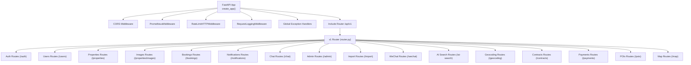
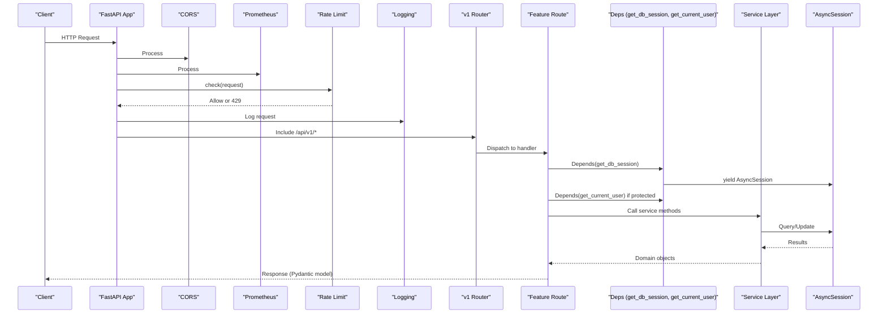
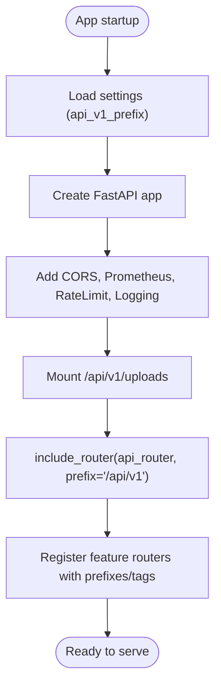
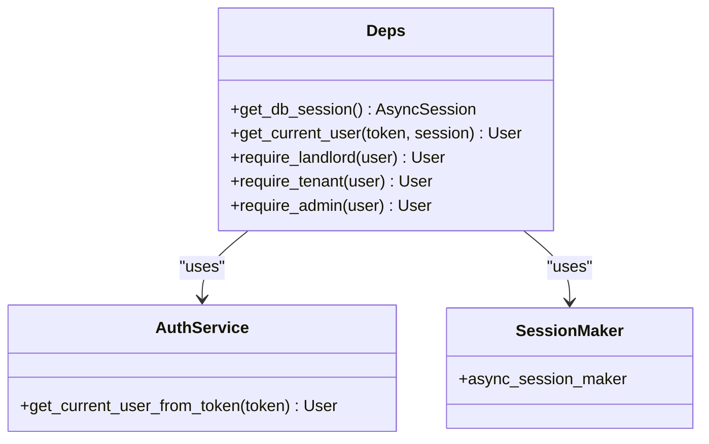
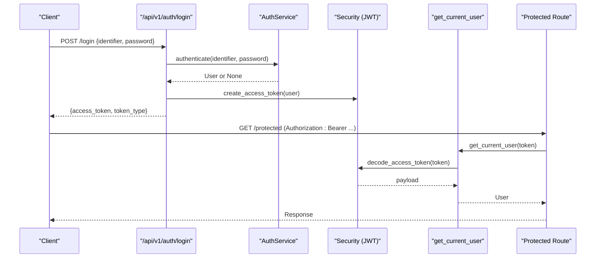
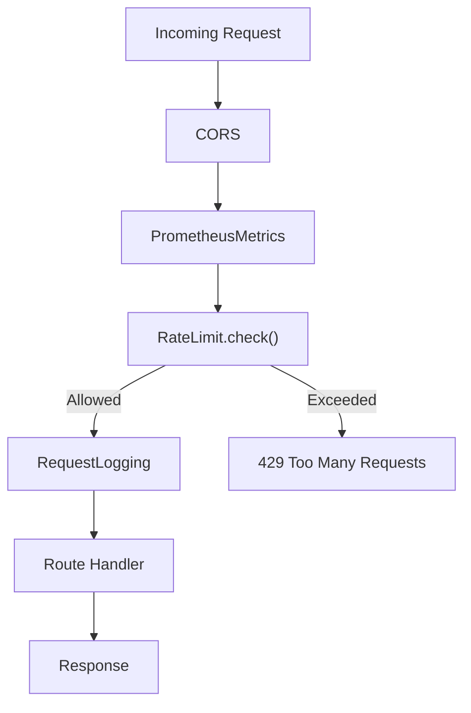
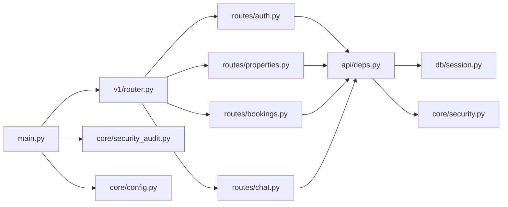

# API Layer & Routes

<cite>
**Referenced Files in This Document**
- [main.py](file://backend/app/main.py)
- [router.py](file://backend/app/api/v1/router.py)
- [deps.py](file://backend/app/api/deps.py)
- [session.py](file://backend/app/db/session.py)
- [security.py](file://backend/app/core/security.py)
- [security_audit.py](file://backend/app/core/security_audit.py)
- [config.py](file://backend/app/core/config.py)
- [auth.py](file://backend/app/api/v1/routes/auth.py)
- [properties.py](file://backend/app/api/v1/routes/properties.py)
- [bookings.py](file://backend/app/api/v1/routes/bookings.py)
- [chat.py](file://backend/app/api/v1/routes/chat.py)
- [auth_schemas.py](file://backend/app/schemas/auth.py)
- [property_schemas.py](file://backend/app/schemas/property.py)
- [booking_schemas.py](file://backend/app/schemas/booking.py)
</cite>

## Table of Contents
1. [Introduction](#introduction)
2. [Project Structure](#project-structure)
3. [Core Components](#core-components)
4. [Architecture Overview](#architecture-overview)
5. [Detailed Component Analysis](#detailed-component-analysis)
6. [Dependency Analysis](#dependency-analysis)
7. [Performance Considerations](#performance-considerations)
8. [Troubleshooting Guide](#troubleshooting-guide)
9. [Conclusion](#conclusion)
10. [Appendices](#appendices)

## Introduction
This document explains the FastAPI API layer and routing system, focusing on:
- Versioning strategy under /api/v1/
- Feature-based route organization (auth, properties, bookings, chat, etc.)
- Router registration pattern and individual route file structure
- Dependency injection for services and database sessions
- Request/response validation with Pydantic schemas
- Error handling strategies and response formatting
- Authentication decorators and authorization guards
- Middleware integration points including CORS, rate limiting, logging, and metrics
- Guidelines for adding new endpoints consistently

## Project Structure
The API is organized by feature modules under a versioned prefix:
- Application entrypoint creates the FastAPI app, configures middleware, mounts static files, and includes the v1 router under /api/v1/.
- The v1 router aggregates feature routers (auth, users, properties, images, bookings, notifications, chat, admin, imports, wechat, ai-search, geocoding, contracts, payments, pois, map).
- Each feature module defines its own APIRouter and routes.
- Shared dependencies (DB session, current user, role guards) live in deps.py.
- Pydantic schemas define request and response models per domain.

**Diagram sources**
- [main.py:17-82](file://backend/app/main.py#L17-L82)
- [router.py:1-23](file://backend/app/api/v1/router.py#L1-L23)

**Section sources**
- [main.py:17-82](file://backend/app/main.py#L17-L82)
- [router.py:1-23](file://backend/app/api/v1/router.py#L1-L23)

## Core Components
- Versioning and mounting:
  - The application sets api_v1_prefix from settings and includes the v1 router at that prefix.
  - Static uploads are mounted under /api/v1/uploads.
- Router aggregation:
  - The v1 router registers all feature routers with their prefixes and tags.
- Dependencies:
  - get_db_session provides an async SQLAlchemy session via dependency injection.
  - get_current_user validates bearer tokens and returns the authenticated User.
  - Role guards require_landlord, require_tenant, require_admin enforce RBAC.
- Security:
  - Password hashing/verification and JWT creation/decoding are centralized.
  - Refresh token support and rate limiting are provided as utilities/middleware.
- Configuration:
  - Settings include DB URLs, Redis URL, CORS origins, rate limits, upload settings, and third-party integrations.

**Section sources**
- [main.py:17-82](file://backend/app/main.py#L17-L82)
- [router.py:1-23](file://backend/app/api/v1/router.py#L1-L23)
- [deps.py:1-58](file://backend/app/api/deps.py#L1-L58)
- [security.py:1-34](file://backend/app/core/security.py#L1-L34)
- [security_audit.py:49-95](file://backend/app/core/security_audit.py#L49-L95)
- [config.py:7-167](file://backend/app/core/config.py#L7-L167)

## Architecture Overview
The runtime flow integrates middleware, dependency injection, and feature routes:

**Diagram sources**
- [main.py:17-82](file://backend/app/main.py#L17-L82)
- [router.py:1-23](file://backend/app/api/v1/router.py#L1-L23)
- [deps.py:14-30](file://backend/app/api/deps.py#L14-L30)
- [security_audit.py:49-95](file://backend/app/core/security_audit.py#L49-L95)

## Detailed Component Analysis

### API Versioning and Router Registration
- Versioning:
  - The app uses settings.api_v1_prefix ("/api/v1") when including the v1 router.
  - All feature routes are namespaced under this prefix.
- Router registration:
  - The v1 router imports each feature module and includes it with a path prefix and tag for grouping.
  - Example registrations include auth, users, properties, images, bookings, notifications, chat, admin, imports, wechat, ai-search, geocoding, contracts, payments, pois, map.

**Diagram sources**
- [main.py:17-82](file://backend/app/main.py#L17-L82)
- [router.py:1-23](file://backend/app/api/v1/router.py#L1-L23)

**Section sources**
- [main.py:17-82](file://backend/app/main.py#L17-L82)
- [router.py:1-23](file://backend/app/api/v1/router.py#L1-L23)

### Dependency Injection Pattern
- Database session:
  - get_db_session yields an AsyncSession using async_session_maker.
- Authentication:
  - OAuth2PasswordBearer configured to use /api/v1/auth/login.
  - get_current_user decodes the token, fetches the user, and raises 401 on failure.
- Authorization guards:
  - require_landlord, require_tenant, require_admin validate roles and raise 403 on violation.

**Diagram sources**
- [deps.py:14-57](file://backend/app/api/deps.py#L14-L57)
- [session.py:1-14](file://backend/app/db/session.py#L1-L14)

**Section sources**
- [deps.py:1-58](file://backend/app/api/deps.py#L1-58)
- [session.py:1-14](file://backend/app/db/session.py#L1-L14)

### Authentication and Authorization Flow
- Login issues access tokens; refresh endpoint supports rotating tokens.
- Protected endpoints depend on get_current_user or role guards.
- Token decoding and password hashing are centralized.

**Diagram sources**
- [auth.py:37-60](file://backend/app/api/v1/routes/auth.py#L37-L60)
- [deps.py:19-30](file://backend/app/api/deps.py#L19-L30)
- [security.py:22-33](file://backend/app/core/security.py#L22-L33)

**Section sources**
- [auth.py:1-94](file://backend/app/api/v1/routes/auth.py#L1-L94)
- [deps.py:1-58](file://backend/app/api/deps.py#L1-58)
- [security.py:1-34](file://backend/app/core/security.py#L1-L34)

### Request/Response Validation with Pydantic
- Input schemas:
  - Auth: RegisterRequest, LoginRequest, WeChatLoginRequest, WeChatPhoneRequest.
  - Properties: PropertyBase, PropertyCreate, PropertyUpdate, PropertyRead, PropertySearchResult.
  - Bookings: BookingCreate, BookingUpdate, BookingRead.
- Output schemas:
  - CurrentUserResponse, TokenResponse, PropertyRead, BookingRead, Chat Session/Message responses.
- Validation features:
  - Field constraints (min_length, max_length, ge, le, gt), enums, email validation, optional fields, and from_attributes for ORM mapping.

Examples of schema usage:
- Auth login/register handlers accept typed request bodies and return typed responses.
- Properties search accepts query parameters validated via Query(...) with constraints.
- Bookings enforce business rules and status transitions.

**Section sources**
- [auth_schemas.py:1-63](file://backend/app/schemas/auth.py#L1-L63)
- [property_schemas.py:1-79](file://backend/app/schemas/property.py#L1-L79)
- [booking_schemas.py:1-35](file://backend/app/schemas/booking.py#L1-L35)
- [auth.py:14-60](file://backend/app/api/v1/routes/auth.py#L14-L60)
- [properties.py:36-91](file://backend/app/api/v1/routes/properties.py#L36-L91)
- [bookings.py:14-41](file://backend/app/api/v1/routes/bookings.py#L14-L41)

### Error Handling Strategies and Response Formatting
- Consistent HTTP status codes:
  - 201 Created for resource creation, 204 No Content for deletions, 400 Bad Request for invalid inputs, 401 Unauthorized for auth failures, 403 Forbidden for insufficient roles, 404 Not Found for missing resources, 409 Conflict for duplicates, 422 Unprocessable Entity for validation errors, 429 Too Many Requests for rate limit.
- Centralized security exceptions:
  - get_current_user raises 401 with WWW-Authenticate header.
  - Role guards raise 403 with descriptive details.
- Global exception handlers are registered during app setup.
- Response models ensure consistent serialization and field exposure.

**Section sources**
- [deps.py:19-57](file://backend/app/api/deps.py#L19-L57)
- [auth.py:30-60](file://backend/app/api/v1/routes/auth.py#L30-L60)
- [properties.py:16-162](file://backend/app/api/v1/routes/properties.py#L16-L162)
- [bookings.py:14-112](file://backend/app/api/v1/routes/bookings.py#L14-L112)
- [main.py:62-63](file://backend/app/main.py#L62-L63)

### Middleware Integration Points
- CORS:
  - Configured with allow_origins from settings; relaxed in development, tightened in production.
- Metrics:
  - PrometheusMiddleware added; /metrics endpoint installed.
- Rate Limiting:
  - Redis-backed token-bucket style limiter; disabled in debug mode; wraps requests and raises 429 when exceeded.
- Logging:
  - RequestLoggingMiddleware captures request/response lifecycle.
- Static files:
  - Uploads directory mounted under /api/v1/uploads.

**Diagram sources**
- [main.py:27-60](file://backend/app/main.py#L27-L60)
- [security_audit.py:49-95](file://backend/app/core/security_audit.py#L49-L95)

**Section sources**
- [main.py:27-60](file://backend/app/main.py#L27-L60)
- [security_audit.py:49-95](file://backend/app/core/security_audit.py#L49-L95)
- [config.py:40-44](file://backend/app/core/config.py#L40-L44)
- [config.py:153-161](file://backend/app/core/config.py#L153-L161)

### Example Route Patterns

#### Authentication Endpoints
- POST /api/v1/auth/register: Creates user, logs audit event, returns CurrentUserResponse.
- POST /api/v1/auth/login: Authenticates user, returns TokenResponse.
- POST /api/v1/auth/refresh: Rotates tokens using refresh token.
- GET /api/v1/auth/me: Returns current user profile (requires authentication).

**Section sources**
- [auth.py:14-94](file://backend/app/api/v1/routes/auth.py#L14-L94)

#### Properties Endpoints
- POST /api/v1/properties: Create property (landlord/admin only).
- GET /api/v1/properties/search: Natural language and filter-based search with pagination.
- GET /api/v1/properties: List with skip/limit and filters.
- GET /api/v1/properties/{id}: Retrieve single property.
- PATCH /api/v1/properties/{id}: Update property (owner/admin only).
- DELETE /api/v1/properties/{id}: Delete property (owner/admin only).

**Section sources**
- [properties.py:16-162](file://backend/app/api/v1/routes/properties.py#L16-L162)

#### Bookings Endpoints
- POST /api/v1/bookings: Create booking (tenant only).
- GET /api/v1/bookings: List bookings scoped by role (tenant/landlord/admin).
- GET /api/v1/bookings/{id}: Get booking with ownership checks.
- PATCH /api/v1/bookings/{id}/status: Update status (landlord/admin only).
- PATCH /api/v1/bookings/{id}/cancel: Cancel booking (tenant/admin only).

**Section sources**
- [bookings.py:14-112](file://backend/app/api/v1/routes/bookings.py#L14-L112)

#### Chat Endpoints
- POST /api/v1/chat/sessions: Create chat session (authenticated).
- GET /api/v1/chat/sessions: List sessions (authenticated).
- GET /api/v1/chat/sessions/{id}/messages: List messages (authenticated).
- POST /api/v1/chat/sessions/{id}/messages: Stream AI responses via SSE (authenticated).
- DELETE /api/v1/chat/sessions/{id}: Delete session (authenticated).

**Section sources**
- [chat.py:47-143](file://backend/app/api/v1/routes/chat.py#L47-L143)

### Adding New API Endpoints: Guidelines
- Create a new route file under backend/app/api/v1/routes/<feature>.py:
  - Define an APIRouter instance.
  - Implement handlers with typed request/response models and dependency injection.
  - Use appropriate status codes and error handling patterns.
- Register the router in backend/app/api/v1/router.py:
  - Import the new module.
  - Include it with a meaningful prefix and tag.
- If needed, add shared dependencies or guards in backend/app/api/deps.py.
- Define Pydantic schemas in backend/app/schemas/<feature>.py for input/output validation.
- Follow existing conventions:
  - Use Depends(get_db_session) for DB access.
  - Use Depends(get_current_user) or role guards for protected routes.
  - Return typed response models for consistent serialization.
  - Raise HTTPException with clear detail messages and correct status codes.

[No sources needed since this section provides general guidance]

## Dependency Analysis
High-level relationships between core components:

**Diagram sources**
- [main.py:17-82](file://backend/app/main.py#L17-L82)
- [router.py:1-23](file://backend/app/api/v1/router.py#L1-L23)
- [deps.py:1-58](file://backend/app/api/deps.py#L1-58)
- [session.py:1-14](file://backend/app/db/session.py#L1-L14)
- [security.py:1-34](file://backend/app/core/security.py#L1-L34)
- [security_audit.py:49-95](file://backend/app/core/security_audit.py#L49-L95)
- [config.py:7-167](file://backend/app/core/config.py#L7-L167)

**Section sources**
- [main.py:17-82](file://backend/app/main.py#L17-L82)
- [router.py:1-23](file://backend/app/api/v1/router.py#L1-L23)
- [deps.py:1-58](file://backend/app/api/deps.py#L1-58)
- [session.py:1-14](file://backend/app/db/session.py#L1-L14)
- [security.py:1-34](file://backend/app/core/security.py#L1-L34)
- [security_audit.py:49-95](file://backend/app/core/security_audit.py#L49-L95)
- [config.py:7-167](file://backend/app/core/config.py#L7-L167)

## Performance Considerations
- Use async database sessions to avoid blocking.
- Keep response models minimal and avoid unnecessary transformations in handlers.
- Leverage query parameter validation to reduce server-side filtering.
- Rate limiting protects against abuse but should be tuned for environment.
- Streaming responses (e.g., chat SSE) reduce latency for long-running operations.

[No sources needed since this section provides general guidance]

## Troubleshooting Guide
- 401 Unauthorized:
  - Ensure Authorization header contains a valid Bearer token.
  - Check token expiry and refresh flow.
- 403 Forbidden:
  - Verify user role matches required guard (landlord/tenant/admin).
- 404 Not Found:
  - Confirm resource IDs exist before updates/deletes.
- 409 Conflict:
  - Duplicate entries (e.g., username/email/phone) handled in registration.
- 429 Too Many Requests:
  - Rate limit exceeded; respect Retry-After header.
- CORS issues:
  - In production, configure CORS_ORIGINS appropriately.
- Debugging tips:
  - Enable structured logging and review request/response logs.
  - Use Prometheus metrics to monitor performance and errors.

**Section sources**
- [deps.py:19-57](file://backend/app/api/deps.py#L19-L57)
- [auth.py:30-89](file://backend/app/api/v1/routes/auth.py#L30-L89)
- [properties.py:16-162](file://backend/app/api/v1/routes/properties.py#L16-L162)
- [bookings.py:14-112](file://backend/app/api/v1/routes/bookings.py#L14-L112)
- [security_audit.py:83-94](file://backend/app/core/security_audit.py#L83-L94)
- [main.py:27-39](file://backend/app/main.py#L27-L39)

## Conclusion
The API layer follows a clean, modular design with versioned routing, strong typing via Pydantic, robust dependency injection, and comprehensive middleware. By adhering to established patterns for route organization, validation, error handling, and security, teams can extend the API consistently and maintain high quality and reliability.

[No sources needed since this section summarizes without analyzing specific files]

## Appendices

### Quick Reference: Key Paths and Prefixes
- API version prefix: /api/v1
- Auth: /api/v1/auth
- Users: /api/v1/users
- Properties: /api/v1/properties
- Images: /api/v1/properties/images
- Bookings: /api/v1/bookings
- Notifications: /api/v1/notifications
- Chat: /api/v1/chat
- Admin: /api/v1/admin
- Imports: /api/v1/import
- WeChat: /api/v1/wechat
- AI Search: /api/v1/ai-search
- Geocoding: /api/v1/geocoding
- Contracts: /api/v1/contracts
- Payments: /api/v1/payments
- POIs: /api/v1/pois
- Map: /api/v1/map
- Uploads: /api/v1/uploads

**Section sources**
- [router.py:6-22](file://backend/app/api/v1/router.py#L6-L22)
- [main.py:71-76](file://backend/app/main.py#L71-L76)