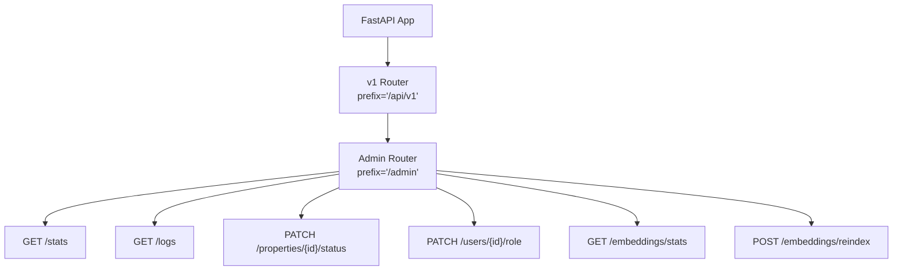
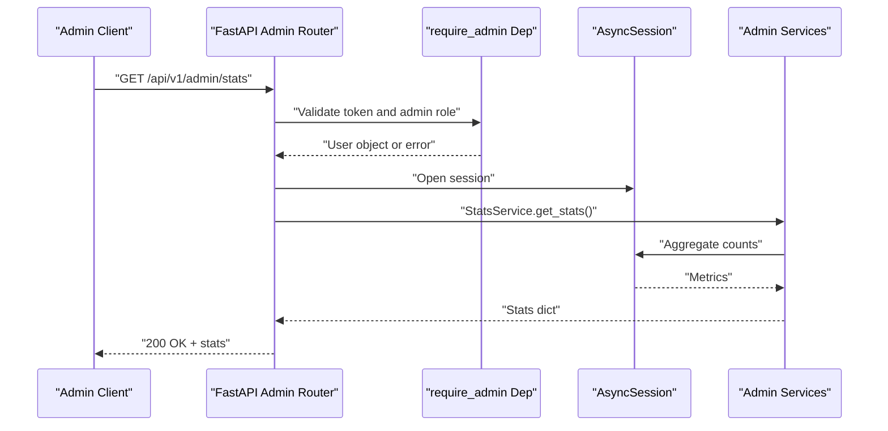
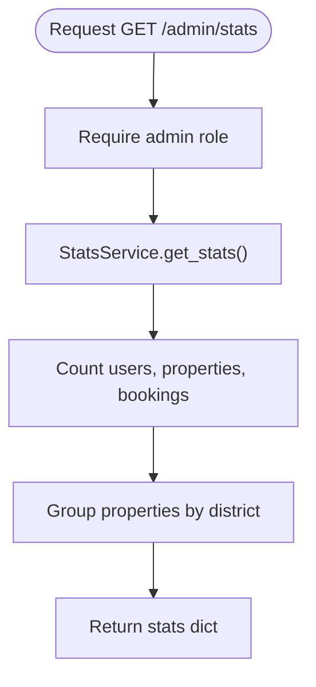
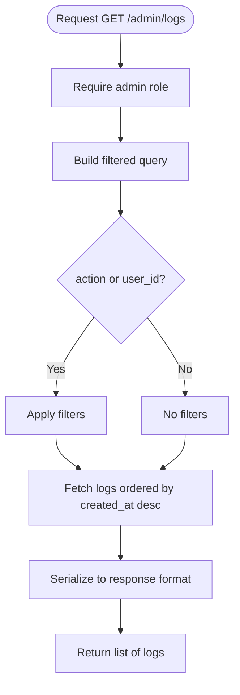
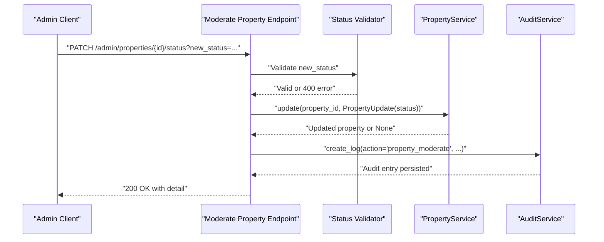
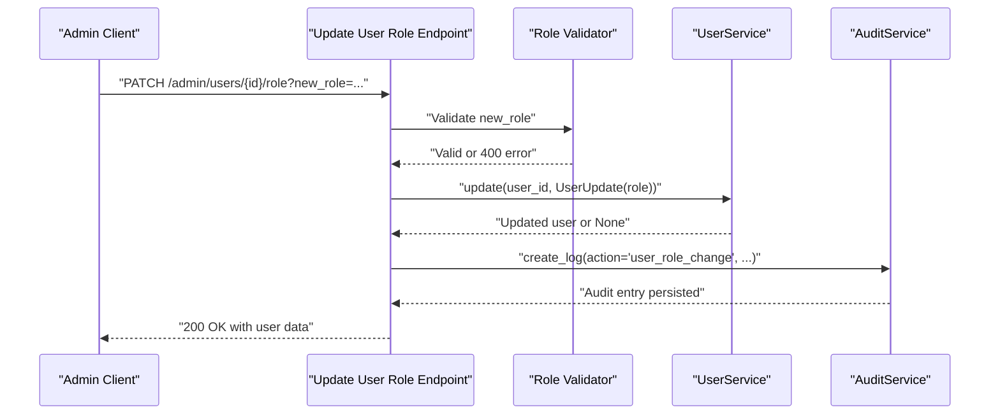
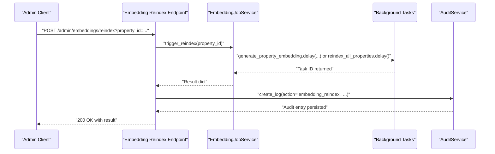
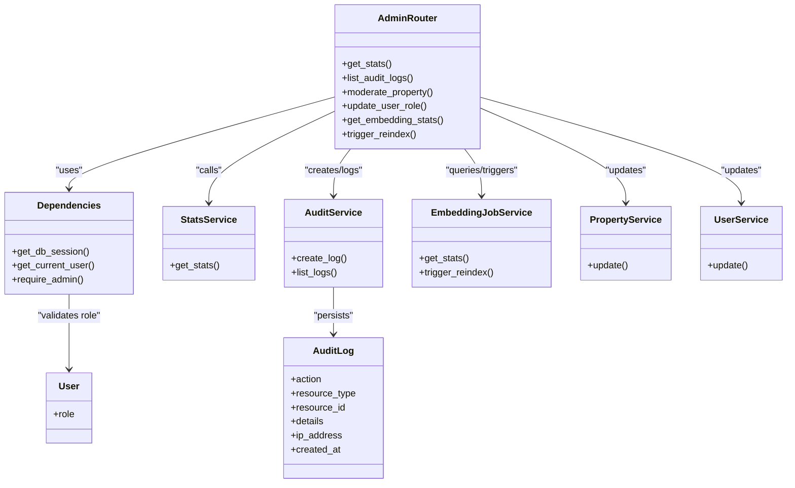

# Admin Management Routes

<cite>
**Referenced Files in This Document**
- [admin.py](file://backend/app/api/v1/routes/admin.py)
- [router.py](file://backend/app/api/v1/router.py)
- [deps.py](file://backend/app/api/deps.py)
- [security.py](file://backend/app/core/security.py)
- [audit_service.py](file://backend/app/services/audit_service.py)
- [stats_service.py](file://backend/app/services/stats_service.py)
- [embedding_job_service.py](file://backend/app/services/embedding_job_service.py)
- [property_service.py](file://backend/app/services/property_service.py)
- [user_service.py](file://backend/app/services/user_service.py)
- [audit_log.py](file://backend/app/models/audit_log.py)
- [user.py](file://backend/app/models/user.py)
- [health.py](file://backend/app/api/v1/routes/health.py)
- [test_admin.py](file://backend/tests/test_admin.py)
</cite>

## Table of Contents
1. [Introduction](#introduction)
2. [Project Structure](#project-structure)
3. [Core Components](#core-components)
4. [Architecture Overview](#architecture-overview)
5. [Detailed Component Analysis](#detailed-component-analysis)
6. [Dependency Analysis](#dependency-analysis)
7. [Performance Considerations](#performance-considerations)
8. [Troubleshooting Guide](#troubleshooting-guide)
9. [Conclusion](#conclusion)
10. [Appendices](#appendices)

## Introduction
This document provides comprehensive documentation for administrative API routes under /api/v1/admin/. It covers system administration, user management, property moderation, audit log retrieval, system statistics, embedding job monitoring, and health checks. It also explains admin-only operations, privilege escalation controls, security considerations, audit trail requirements, and compliance logging patterns.

## Project Structure
The admin routes are mounted under the v1 API router with a prefix of "/admin". The FastAPI application includes multiple route modules; the admin module is included with the "/admin" prefix.

**Diagram sources**
- [router.py:1-23](file://backend/app/api/v1/router.py#L1-L23)
- [admin.py:1-133](file://backend/app/api/v1/routes/admin.py#L1-L133)

**Section sources**
- [router.py:1-23](file://backend/app/api/v1/router.py#L1-L23)

## Core Components
- Authentication and authorization:
  - JWT-based authentication via OAuth2 password bearer scheme.
  - Role-based access control (RBAC) enforced by dependency functions that require specific roles.
- Services:
  - StatsService: aggregates system-wide metrics.
  - AuditService: persists and queries audit logs.
  - EmbeddingJobService: manages embedding job stats and reindex triggers.
  - PropertyService: updates property status during moderation.
  - UserService: updates user roles during role changes.
- Models:
  - User model defines roles and statuses.
  - AuditLog model stores structured audit events.

Security and privilege controls:
- All admin endpoints require an active JWT token and an "admin" role.
- Unauthorized requests receive 401 responses; non-admin users receive 403 responses.

Audit trails:
- Sensitive operations (e.g., property moderation, role changes, embedding reindex) create audit log entries with actor, action, resource type, resource id, details, and IP address.

**Section sources**
- [deps.py:1-58](file://backend/app/api/deps.py#L1-L58)
- [security.py:1-34](file://backend/app/core/security.py#L1-L34)
- [user.py:1-48](file://backend/app/models/user.py#L1-L48)
- [audit_log.py:1-25](file://backend/app/models/audit_log.py#L1-L25)
- [audit_service.py:1-55](file://backend/app/services/audit_service.py#L1-L55)
- [stats_service.py:1-44](file://backend/app/services/stats_service.py#L1-L44)
- [embedding_job_service.py:1-54](file://backend/app/services/embedding_job_service.py#L1-L54)
- [property_service.py:1-239](file://backend/app/services/property_service.py#L1-L239)
- [user_service.py:1-57](file://backend/app/services/user_service.py#L1-L57)

## Architecture Overview
The admin API follows a layered architecture:
- Route layer: FastAPI endpoints under /api/v1/admin/.
- Dependency layer: Authentication and authorization via get_current_user and require_admin.
- Service layer: Business logic encapsulated in service classes.
- Data layer: SQLAlchemy models and async sessions.

**Diagram sources**
- [admin.py:16-21](file://backend/app/api/v1/routes/admin.py#L16-L21)
- [deps.py:19-57](file://backend/app/api/deps.py#L19-L57)
- [stats_service.py:13-43](file://backend/app/services/stats_service.py#L13-L43)

## Detailed Component Analysis

### System Statistics Endpoint
- Method and path: GET /api/v1/admin/stats
- Authorization: Admin only
- Functionality: Returns total users, properties, bookings, pending bookings, and top districts by property count.
- Response fields:
  - total_users: integer
  - total_properties: integer
  - total_bookings: integer
  - pending_bookings: integer
  - properties_by_district: array of {district, count}

**Diagram sources**
- [admin.py:16-21](file://backend/app/api/v1/routes/admin.py#L16-L21)
- [stats_service.py:13-43](file://backend/app/services/stats_service.py#L13-L43)

**Section sources**
- [admin.py:16-21](file://backend/app/api/v1/routes/admin.py#L16-L21)
- [stats_service.py:13-43](file://backend/app/services/stats_service.py#L13-L43)

### Audit Log Retrieval Endpoint
- Method and path: GET /api/v1/admin/logs
- Authorization: Admin only
- Query parameters:
  - skip: integer >= 0 (default 0)
  - limit: integer between 1 and 200 (default 50)
  - action: optional string filter
  - user_id: optional integer filter
- Response: Array of audit log records including id, user_id, action, resource_type, resource_id, details, ip_address, created_at.

**Diagram sources**
- [admin.py:24-48](file://backend/app/api/v1/routes/admin.py#L24-L48)
- [audit_service.py:34-54](file://backend/app/services/audit_service.py#L34-L54)

**Section sources**
- [admin.py:24-48](file://backend/app/api/v1/routes/admin.py#L24-L48)
- [audit_service.py:34-54](file://backend/app/services/audit_service.py#L34-L54)

### Property Moderation Endpoint
- Method and path: PATCH /api/v1/admin/properties/{property_id}/status
- Authorization: Admin only
- Query parameters:
  - new_status: required string; must be one of "available", "rented", "maintenance", "offline"
- Behavior:
  - Validates status value.
  - Updates property status via PropertyService.update.
  - Creates an audit log entry with action "property_moderate".
- Responses:
  - 200 on success with detail message.
  - 400 if invalid status.
  - 404 if property not found.

**Diagram sources**
- [admin.py:51-80](file://backend/app/api/v1/routes/admin.py#L51-L80)
- [property_service.py:197-214](file://backend/app/services/property_service.py#L197-L214)
- [audit_service.py:11-32](file://backend/app/services/audit_service.py#L11-L32)

**Section sources**
- [admin.py:51-80](file://backend/app/api/v1/routes/admin.py#L51-L80)
- [property_service.py:197-214](file://backend/app/services/property_service.py#L197-L214)

### User Role Update Endpoint
- Method and path: PATCH /api/v1/admin/users/{user_id}/role
- Authorization: Admin only
- Query parameters:
  - new_role: required string; must be one of "tenant", "landlord", "admin"
- Behavior:
  - Validates role value.
  - Updates user role via UserService.update.
  - Creates an audit log entry with action "user_role_change".
- Responses:
  - 200 on success with updated user data.
  - 400 if invalid role.
  - 404 if user not found.

**Diagram sources**
- [admin.py:83-109](file://backend/app/api/v1/routes/admin.py#L83-L109)
- [user_service.py:37-47](file://backend/app/services/user_service.py#L37-L47)
- [audit_service.py:11-32](file://backend/app/services/audit_service.py#L11-L32)

**Section sources**
- [admin.py:83-109](file://backend/app/api/v1/routes/admin.py#L83-L109)
- [user_service.py:37-47](file://backend/app/services/user_service.py#L37-L47)

### Embedding Job Monitoring Endpoints
- Get stats:
  - Method and path: GET /api/v1/admin/embeddings/stats
  - Authorization: Admin only
  - Response: Counts of total, completed, failed, and pending embedding jobs.
- Trigger reindex:
  - Method and path: POST /api/v1/admin/embeddings/reindex
  - Authorization: Admin only
  - Query parameters:
    - property_id: optional integer; if provided, reindex single property; otherwise reindex all properties.
  - Behavior:
    - Dispatches background tasks for embedding generation or full reindex.
    - Creates an audit log entry with action "embedding_reindex".
  - Responses:
    - 200 with detail message indicating scope of reindex.

**Diagram sources**
- [admin.py:120-132](file://backend/app/api/v1/routes/admin.py#L120-L132)
- [embedding_job_service.py:45-53](file://backend/app/services/embedding_job_service.py#L45-L53)
- [audit_service.py:11-32](file://backend/app/services/audit_service.py#L11-L32)

**Section sources**
- [admin.py:112-132](file://backend/app/api/v1/routes/admin.py#L112-L132)
- [embedding_job_service.py:21-53](file://backend/app/services/embedding_job_service.py#L21-L53)

### Health Check Endpoint
- Method and path: GET /api/v1/health
- Authorization: None (public)
- Response: {"status": "ok"}

Note: While not under /api/v1/admin/, this endpoint supports system health monitoring and can be used by orchestration tools.

**Section sources**
- [health.py:1-9](file://backend/app/api/v1/routes/health.py#L1-L9)

## Dependency Analysis
The admin routes depend on shared dependencies for database sessions, authentication, and authorization. The following diagram shows key relationships:

**Diagram sources**
- [admin.py:1-133](file://backend/app/api/v1/routes/admin.py#L1-L133)
- [deps.py:1-58](file://backend/app/api/deps.py#L1-L58)
- [stats_service.py:1-44](file://backend/app/services/stats_service.py#L1-L44)
- [audit_service.py:1-55](file://backend/app/services/audit_service.py#L1-L55)
- [embedding_job_service.py:1-54](file://backend/app/services/embedding_job_service.py#L1-L54)
- [property_service.py:1-239](file://backend/app/services/property_service.py#L1-L239)
- [user_service.py:1-57](file://backend/app/services/user_service.py#L1-L57)
- [user.py:1-48](file://backend/app/models/user.py#L1-L48)
- [audit_log.py:1-25](file://backend/app/models/audit_log.py#L1-L25)

**Section sources**
- [deps.py:1-58](file://backend/app/api/deps.py#L1-L58)
- [admin.py:1-133](file://backend/app/api/v1/routes/admin.py#L1-L133)

## Performance Considerations
- Pagination and filtering:
  - Audit logs support skip/limit and optional filters to reduce payload size and improve query performance.
- Aggregation queries:
  - StatsService uses efficient SQL aggregations and grouping to minimize database load.
- Background tasks:
  - Embedding reindex operations are dispatched asynchronously to avoid blocking request handling.
- Optional caching:
  - Property search leverages Redis caching for non-vector queries; while not directly used by admin endpoints, it reduces overall system load.

[No sources needed since this section provides general guidance]

## Troubleshooting Guide
Common issues and resolutions:
- 401 Unauthorized:
  - Cause: Missing or invalid JWT token.
  - Resolution: Ensure Authorization header contains a valid Bearer token obtained from login.
- 403 Forbidden:
  - Cause: User lacks admin role.
  - Resolution: Verify user.role equals "admin".
- 400 Bad Request:
  - Cause: Invalid status or role values.
  - Resolution: Use allowed values ("available", "rented", "maintenance", "offline" for property status; "tenant", "landlord", "admin" for user role).
- 404 Not Found:
  - Cause: Target property or user does not exist.
  - Resolution: Confirm resource IDs are correct.

Validation and tests:
- Automated tests verify admin-only enforcement, successful operations, and error conditions for each endpoint.

**Section sources**
- [deps.py:19-57](file://backend/app/api/deps.py#L19-L57)
- [admin.py:51-109](file://backend/app/api/v1/routes/admin.py#L51-L109)
- [test_admin.py:1-202](file://backend/tests/test_admin.py#L1-L202)

## Conclusion
The /api/v1/admin/ API provides essential administrative capabilities with strong security controls and comprehensive audit logging. Endpoints cover system statistics, audit log retrieval, property moderation, user role management, and embedding job monitoring. All sensitive operations enforce admin-only access and record detailed audit trails to support compliance and operational oversight.

[No sources needed since this section summarizes without analyzing specific files]

## Appendices

### Security Considerations for Admin Operations
- Enforce JWT authentication and admin role checks on all admin endpoints.
- Validate input parameters strictly to prevent injection and misuse.
- Record detailed audit logs for all privileged actions.
- Limit exposure of sensitive information in responses.

### Audit Trail Requirements and Compliance Logging Patterns
- Each audit log entry includes:
  - Actor user_id
  - Action type
  - Resource type and identifier
  - Additional details as JSON
  - Source IP address
  - Timestamp in UTC
- Recommended practices:
  - Centralize audit logging through AuditService.
  - Include context-rich details for forensic analysis.
  - Retain logs according to compliance policies.

### Bulk User Operations and Property Moderation Tools
- Bulk operations:
  - Currently, individual user role updates are supported via PATCH /admin/users/{id}/role.
  - For bulk updates, consider implementing batch endpoints that iterate over user IDs and create corresponding audit logs per operation.
- Property moderation:
  - PATCH /admin/properties/{id}/status allows administrators to change property lifecycle states.
  - Extend with batch moderation endpoints if needed, ensuring each change is audited.

### System Configuration Management
- Configuration is managed via settings loaded at runtime.
- Admin endpoints do not expose configuration mutation; use secure deployment pipelines or secret managers for configuration changes.

### Logging Aggregation and Metrics Collection
- Audit logs are stored in the database and can be queried via /admin/logs.
- System metrics are available via /admin/stats.
- Embedding job metrics are available via /admin/embeddings/stats.
- Integrate with external monitoring systems by exporting these metrics periodically.

### Health Monitoring
- Public health check endpoint at /api/v1/health returns a simple status.
- Use this endpoint for liveness probes and readiness checks in containerized environments.

**Section sources**
- [audit_log.py:1-25](file://backend/app/models/audit_log.py#L1-L25)
- [audit_service.py:1-55](file://backend/app/services/audit_service.py#L1-L55)
- [admin.py:16-132](file://backend/app/api/v1/routes/admin.py#L16-L132)
- [health.py:1-9](file://backend/app/api/v1/routes/health.py#L1-L9)