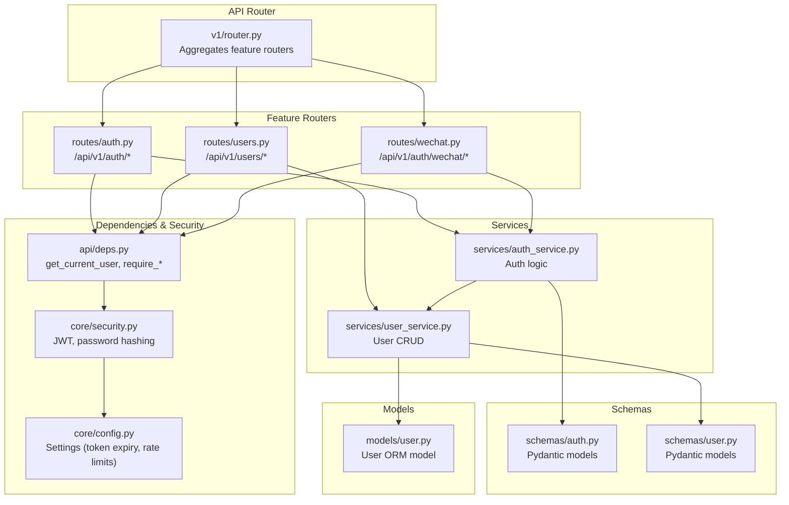
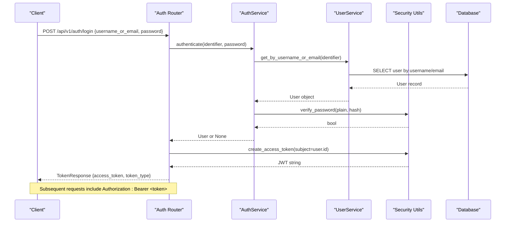
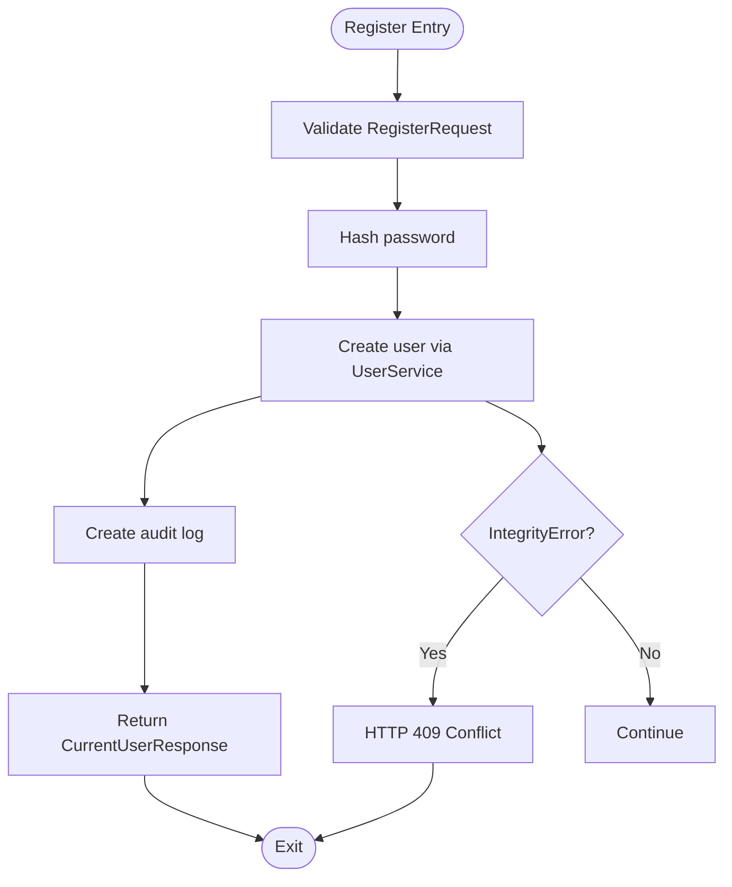
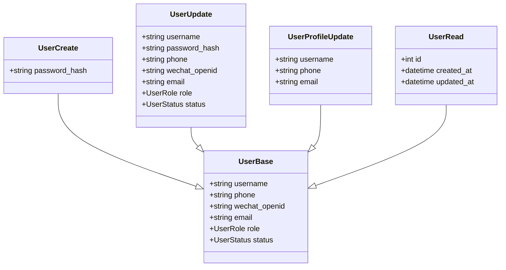
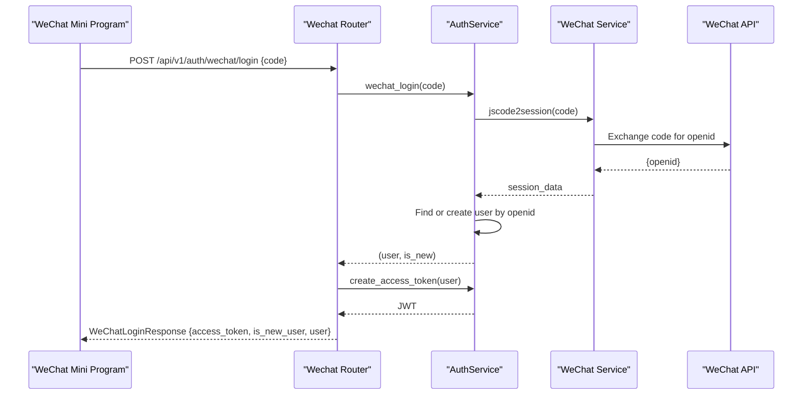
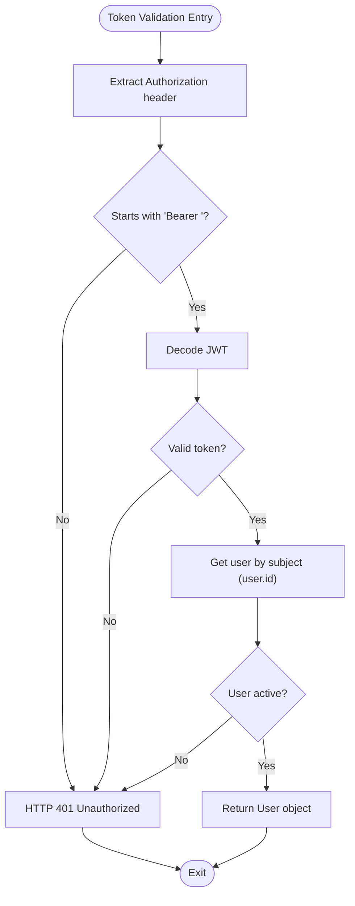
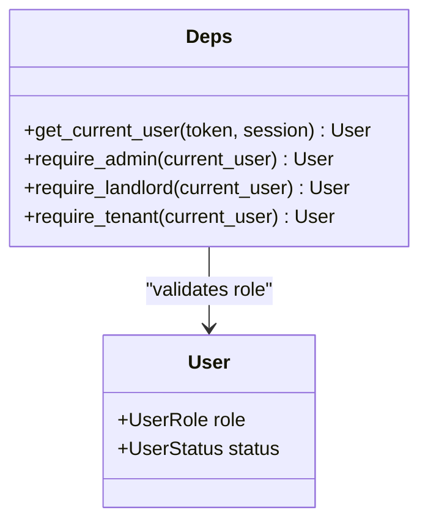
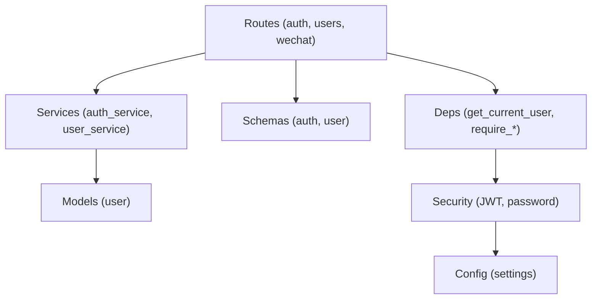

# Authentication Routes

<cite>
**Referenced Files in This Document**
- [router.py](file://backend/app/api/v1/router.py)
- [auth.py](file://backend/app/api/v1/routes/auth.py)
- [users.py](file://backend/app/api/v1/routes/users.py)
- [wechat.py](file://backend/app/api/v1/routes/wechat.py)
- [deps.py](file://backend/app/api/deps.py)
- [security.py](file://backend/app/core/security.py)
- [config.py](file://backend/app/core/config.py)
- [auth_service.py](file://backend/app/services/auth_service.py)
- [user_service.py](file://backend/app/services/user_service.py)
- [auth.py](file://backend/app/schemas/auth.py)
- [user.py](file://backend/app/schemas/user.py)
- [user.py](file://backend/app/models/user.py)
</cite>

## Table of Contents
1. [Introduction](#introduction)
2. [Project Structure](#project-structure)
3. [Core Components](#core-components)
4. [Architecture Overview](#architecture-overview)
5. [Detailed Component Analysis](#detailed-component-analysis)
6. [Dependency Analysis](#dependency-analysis)
7. [Performance Considerations](#performance-considerations)
8. [Troubleshooting Guide](#troubleshooting-guide)
9. [Conclusion](#conclusion)

## Introduction
This document provides comprehensive documentation for the authentication and user management API routes, focusing on:
- /api/v1/auth/ endpoints: login, registration, token refresh, and current user retrieval
- /api/v1/users/ endpoints: profile management, role assignment, and account operations
- JWT-based authentication flow and request/response schemas using Pydantic models
- Error handling patterns and security considerations (password hashing, token expiration, rate limiting configuration)
- WeChat Mini Program integration: login and phone number binding
- Role-based access control via dependency injection decorators

## Project Structure
The API is organized under FastAPI routers with a clear separation between routes, services, schemas, and core utilities. The v1 API router aggregates all feature routers and applies prefixes to define the final URL paths.

**Diagram sources**
- [router.py:1-23](file://backend/app/api/v1/router.py#L1-L23)
- [auth.py:1-94](file://backend/app/api/v1/routes/auth.py#L1-L94)
- [users.py:1-102](file://backend/app/api/v1/routes/users.py#L1-L102)
- [wechat.py:1-82](file://backend/app/api/v1/routes/wechat.py#L1-L82)
- [deps.py:1-58](file://backend/app/api/deps.py#L1-L58)
- [security.py:1-34](file://backend/app/core/security.py#L1-L34)
- [config.py:1-167](file://backend/app/core/config.py#L1-L167)
- [auth_service.py:1-77](file://backend/app/services/auth_service.py#L1-L77)
- [user_service.py:1-57](file://backend/app/services/user_service.py#L1-L57)
- [auth.py](file://backend/app/schemas/auth.py)
- [user.py](file://backend/app/schemas/user.py)
- [user.py](file://backend/app/models/user.py)

**Section sources**
- [router.py:1-23](file://backend/app/api/v1/router.py#L1-L23)

## Core Components
- Authentication routes (/api/v1/auth):
  - POST /register: Creates a new user with hashed password; returns current user info
  - POST /login: Authenticates by username or email and password; returns JWT access token
  - POST /refresh: Issues a new access token using a refresh token from Authorization header
  - GET /me: Returns authenticated user profile
- User management routes (/api/v1/users):
  - POST /: Create user (admin-only)
  - GET /: List users with pagination (admin-only)
  - GET /me: Get current user profile
  - PATCH /me: Update current user profile
  - GET /{user_id}: Get user by ID (admin-only)
  - PATCH /{user_id}: Update user by ID (admin-only)
  - DELETE /{user_id}: Delete user by ID (admin-only)
- WeChat Mini Program routes (/api/v1/auth/wechat):
  - POST /auth/wechat/login: Login via wx.login() code; returns JWT and user info
  - POST /auth/wechat/phone: Bind phone number using wx.getPhoneNumber() code
  - GET /wechat/config: Return WeChat appid for frontend initialization

Key dependencies:
- get_current_user: Extracts and validates JWT from Authorization header
- require_admin, require_landlord, require_tenant: Enforce role-based access control
- AuthService: Encapsulates auth workflows (register, authenticate, token creation, WeChat login)
- UserService: Encapsulates user CRUD operations
- Pydantic schemas: Validate requests and serialize responses
- Security utilities: Password hashing and JWT encoding/decoding

**Section sources**
- [auth.py:1-94](file://backend/app/api/v1/routes/auth.py#L1-L94)
- [users.py:1-102](file://backend/app/api/v1/routes/users.py#L1-L102)
- [wechat.py:1-82](file://backend/app/api/v1/routes/wechat.py#L1-L82)
- [deps.py:1-58](file://backend/app/api/deps.py#L1-L58)
- [auth_service.py:1-77](file://backend/app/services/auth_service.py#L1-L77)
- [user_service.py:1-57](file://backend/app/services/user_service.py#L1-L57)
- [auth.py](file://backend/app/schemas/auth.py)
- [user.py](file://backend/app/schemas/user.py)
- [security.py:1-34](file://backend/app/core/security.py#L1-L34)

## Architecture Overview
The authentication architecture uses JWT tokens for stateless session management. Clients send credentials to login, receive an access token, and include it in subsequent requests via the Authorization header. Role-based access control is enforced through dependency injection decorators that validate roles before allowing access to protected endpoints.

**Diagram sources**
- [auth.py:37-60](file://backend/app/api/v1/routes/auth.py#L37-L60)
- [auth_service.py:29-38](file://backend/app/services/auth_service.py#L29-L38)
- [user_service.py:22-30](file://backend/app/services/user_service.py#L22-L30)
- [security.py:22-28](file://backend/app/core/security.py#L22-L28)

## Detailed Component Analysis

### Authentication Endpoints (/api/v1/auth)
- POST /register
  - Request schema: RegisterRequest (username, password, optional phone/email, default role tenant)
  - Response: CurrentUserResponse
  - Behavior: Hashes password, creates user, logs audit event, returns user profile
  - Errors: 409 Conflict if username/email/phone already exists
- POST /login
  - Request schema: LoginRequest (username_or_email, password)
  - Response: TokenResponse (access_token, token_type)
  - Behavior: Validates credentials, logs audit event, issues JWT
  - Errors: 401 Unauthorized if invalid credentials
- POST /refresh
  - Header: Authorization: Bearer <refresh_token>
  - Response: TokenResponse (new access_token)
  - Behavior: Decodes refresh token and issues new access token
  - Errors: 401 Unauthorized if missing or invalid refresh token
- GET /me
  - Requires valid JWT
  - Response: CurrentUserResponse

**Diagram sources**
- [auth.py:14-34](file://backend/app/api/v1/routes/auth.py#L14-L34)
- [auth_service.py:19-27](file://backend/app/services/auth_service.py#L19-L27)
- [user_service.py:12-17](file://backend/app/services/user_service.py#L12-L17)

**Section sources**
- [auth.py:14-94](file://backend/app/api/v1/routes/auth.py#L14-L94)
- [auth_service.py:19-38](file://backend/app/services/auth_service.py#L19-L38)
- [auth.py](file://backend/app/schemas/auth.py)

### User Management Endpoints (/api/v1/users)
- POST /
  - Admin-only
  - Request schema: UserCreate (includes password_hash)
  - Response: UserRead
  - Errors: 409 Conflict on duplicate identifiers
- GET /
  - Admin-only
  - Query params: skip (>=0), limit (1..100)
  - Response: list[UserRead]
- GET /me
  - Requires valid JWT
  - Response: UserRead
- PATCH /me
  - Requires valid JWT
  - Request schema: UserProfileUpdate (forbid extra fields)
  - Response: UserRead
  - Errors: 404 Not Found if user not found; 409 Conflict on duplicates
- GET /{user_id}
  - Admin-only
  - Response: UserRead
  - Errors: 404 Not Found
- PATCH /{user_id}
  - Admin-only
  - Request schema: UserUpdate (partial update)
  - Response: UserRead
  - Errors: 404 Not Found; 409 Conflict on duplicates
- DELETE /{user_id}
  - Admin-only
  - Response: 204 No Content
  - Errors: 404 Not Found

**Diagram sources**
- [user.py](file://backend/app/schemas/user.py)

**Section sources**
- [users.py:13-102](file://backend/app/api/v1/routes/users.py#L13-L102)
- [user_service.py:12-57](file://backend/app/services/user_service.py#L12-L57)
- [user.py](file://backend/app/schemas/user.py)

### WeChat Mini Program Integration
- POST /api/v1/auth/wechat/login
  - Request schema: WeChatLoginRequest (code from wx.login())
  - Response: WeChatLoginResponse (access_token, is_new_user, user)
  - Behavior: Exchanges code for openid, finds or creates user, returns JWT
  - Errors: 400 Bad Request if code exchange fails
- POST /api/v1/auth/wechat/phone
  - Requires valid JWT
  - Request schema: WeChatPhoneRequest (code, optional iv/encrypted_data)
  - Behavior: Calls WeChat API to retrieve phone number, binds to current user
  - Errors: 400 Bad Request if WeChat API returns error
- GET /api/v1/auth/wechat/config
  - Response: WeChatConfigResponse (appid)
  - Behavior: Returns WeChat appid from settings

**Diagram sources**
- [wechat.py:19-38](file://backend/app/api/v1/routes/wechat.py#L19-L38)
- [auth_service.py:53-76](file://backend/app/services/auth_service.py#L53-L76)

**Section sources**
- [wechat.py:19-82](file://backend/app/api/v1/routes/wechat.py#L19-L82)
- [auth_service.py:53-76](file://backend/app/services/auth_service.py#L53-L76)
- [auth.py](file://backend/app/schemas/auth.py)

### JWT Token-Based Authentication Flow
- Token issuance:
  - Login endpoint verifies credentials and issues JWT with subject set to user.id and exp set to configured expire time
- Token validation:
  - get_current_user extracts Bearer token, decodes JWT, retrieves user by subject, checks active status
- Token refresh:
  - Refresh endpoint expects Authorization header with refresh token and issues new access token

**Diagram sources**
- [deps.py:19-30](file://backend/app/api/deps.py#L19-L30)
- [auth_service.py:40-51](file://backend/app/services/auth_service.py#L40-L51)
- [security.py:31-33](file://backend/app/core/security.py#L31-L33)

**Section sources**
- [deps.py:11-30](file://backend/app/api/deps.py#L11-L30)
- [auth_service.py:37-51](file://backend/app/services/auth_service.py#L37-L51)
- [security.py:22-33](file://backend/app/core/security.py#L22-L33)

### Role-Based Access Control Implementation
- Dependency injection decorators:
  - require_admin: Ensures UserRole.admin
  - require_landlord: Ensures UserRole.landlord or admin
  - require_tenant: Ensures UserRole.tenant or admin
- Usage:
  - Protected endpoints depend on these decorators to enforce authorization

**Diagram sources**
- [deps.py:33-57](file://backend/app/api/deps.py#L33-L57)
- [user.py](file://backend/app/models/user.py)

**Section sources**
- [deps.py:33-57](file://backend/app/api/deps.py#L33-L57)
- [user.py](file://backend/app/models/user.py)

## Dependency Analysis
The authentication system has clear separation of concerns:
- Routes handle HTTP concerns (request/response, status codes)
- Services encapsulate business logic (auth flows, user CRUD)
- Schemas validate input/output structures
- Dependencies provide reusable auth and RBAC utilities
- Security utilities manage cryptographic operations

**Diagram sources**
- [auth.py](file://backend/app/api/v1/routes/auth.py)
- [users.py](file://backend/app/api/v1/routes/users.py)
- [wechat.py](file://backend/app/api/v1/routes/wechat.py)
- [auth_service.py](file://backend/app/services/auth_service.py)
- [user_service.py](file://backend/app/services/user_service.py)
- [user.py](file://backend/app/models/user.py)
- [auth.py](file://backend/app/schemas/auth.py)
- [user.py](file://backend/app/schemas/user.py)
- [deps.py](file://backend/app/api/deps.py)
- [security.py](file://backend/app/core/security.py)
- [config.py](file://backend/app/core/config.py)

**Section sources**
- [router.py:1-23](file://backend/app/api/v1/router.py#L1-L23)

## Performance Considerations
- Database queries are optimized with selective field retrieval and proper indexing on unique fields (username, email, phone, wechat_openid)
- Pagination parameters (skip, limit) prevent large result sets
- JWT decoding is lightweight and stateless, reducing server-side session storage overhead
- Password hashing uses bcrypt, which is secure but computationally intensive; consider caching strategies for high-frequency verification scenarios
- Rate limiting configuration is available in settings but not yet implemented in middleware; consider adding rate limiting middleware for sensitive endpoints like login and refresh

## Troubleshooting Guide
Common errors and their causes:
- 401 Unauthorized: Invalid or expired JWT token; ensure Authorization header format is correct
- 403 Forbidden: Insufficient role permissions; verify user role matches required decorator
- 404 Not Found: User resource does not exist; check user_id parameter
- 409 Conflict: Duplicate username, email, phone, or wechat_openid; ensure uniqueness constraints are respected
- 400 Bad Request: WeChat API errors during login or phone binding; check WeChat service configuration and network connectivity

Debugging tips:
- Verify JWT secret key and algorithm settings match client expectations
- Check database connection and migration status
- Review audit logs for user actions (registration, login)
- Validate WeChat appid and secret configuration

**Section sources**
- [auth.py:30-34](file://backend/app/api/v1/routes/auth.py#L30-L34)
- [users.py:20-24](file://backend/app/api/v1/routes/users.py#L20-L24)
- [deps.py:24-30](file://backend/app/api/deps.py#L24-L30)
- [wechat.py:60-64](file://backend/app/api/v1/routes/wechat.py#L60-L64)

## Conclusion
The authentication and user management system provides a robust foundation for secure API access with JWT-based stateless sessions and role-based authorization. The modular architecture separates concerns effectively, making the system maintainable and extensible. Key areas for future enhancement include implementing rate limiting middleware, adding password reset functionality, and enhancing error response consistency across all endpoints.