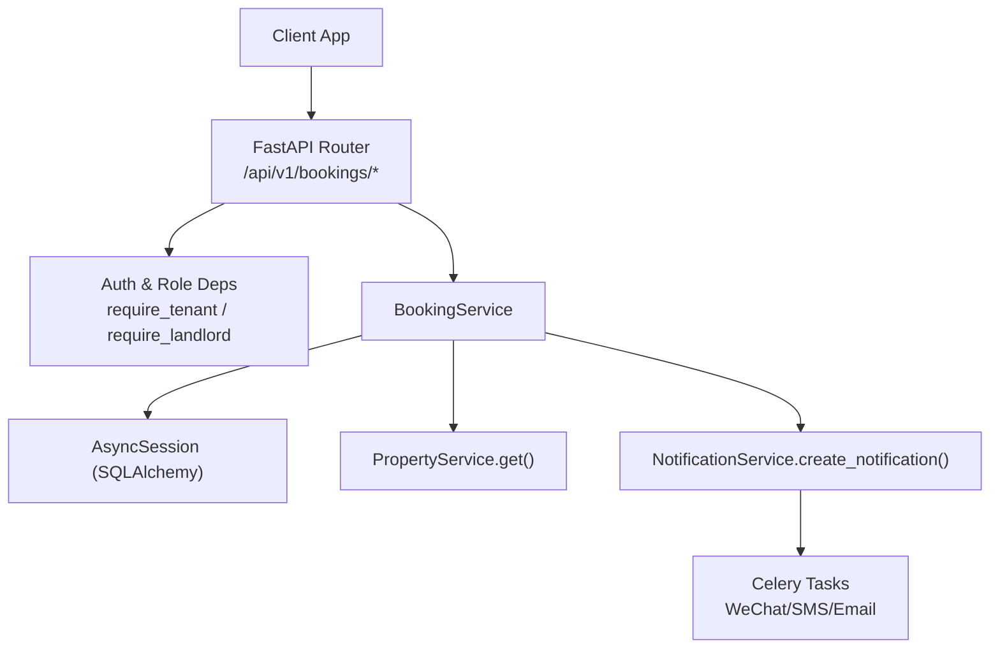
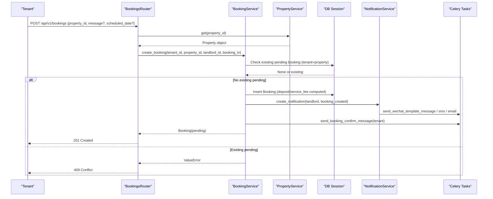
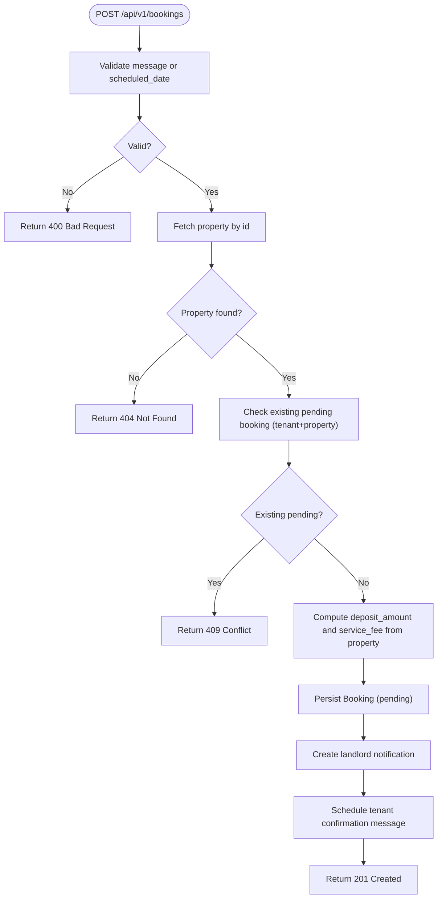
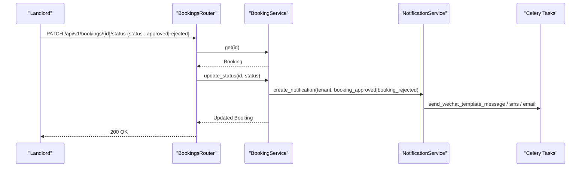
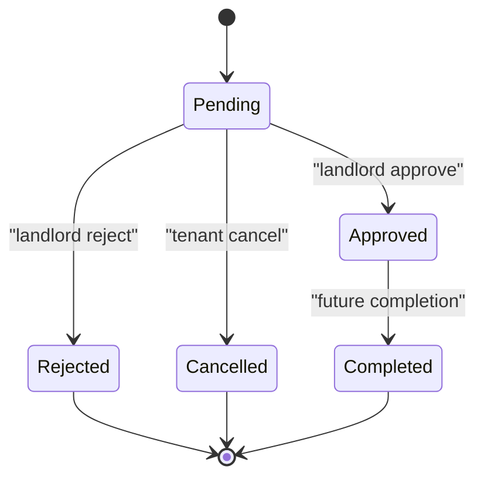
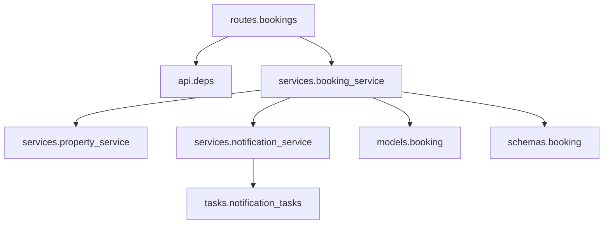

# Booking System Routes

<cite>
**Referenced Files in This Document**
- [bookings.py](file://backend/app/api/v1/routes/bookings.py)
- [booking_service.py](file://backend/app/services/booking_service.py)
- [booking.py](file://backend/app/models/booking.py)
- [booking.py (schemas)](file://backend/app/schemas/booking.py)
- [deps.py](file://backend/app/api/deps.py)
- [notification_service.py](file://backend/app/services/notification_service.py)
- [notification_tasks.py](file://backend/app/tasks/notification_tasks.py)
- [property_service.py](file://backend/app/services/property_service.py)
- [property.py](file://backend/app/models/property.py)
- [test_bookings.py](file://backend/tests/test_bookings.py)
</cite>

## Table of Contents
1. [Introduction](#introduction)
2. [Project Structure](#project-structure)
3. [Core Components](#core-components)
4. [Architecture Overview](#architecture-overview)
5. [Detailed Component Analysis](#detailed-component-analysis)
6. [Dependency Analysis](#dependency-analysis)
7. [Performance Considerations](#performance-considerations)
8. [Troubleshooting Guide](#troubleshooting-guide)
9. [Conclusion](#conclusion)

## Introduction
This document provides comprehensive API documentation for the booking system routes under /api/v1/bookings/. It covers the complete rental booking lifecycle from tenant request to landlord approval, including validation rules, status transitions, cancellation flows, notifications, and integration points with property data and payment fields. It also addresses concurrency considerations, transaction management patterns, and data consistency across services.

## Project Structure
The booking feature is implemented as a FastAPI route module that delegates business logic to a service layer, which interacts with SQLAlchemy models and external notification tasks. The key files are:
- API routes: define endpoints and authorization checks
- Service layer: encapsulates business logic, DB operations, and side effects
- Models and schemas: define data structures and constraints
- Dependencies: authentication and role-based access control
- Notifications: async task dispatch for WeChat, SMS, and email
- Tests: end-to-end scenarios validating core flows

**Diagram sources**
- [bookings.py:1-112](file://backend/app/api/v1/routes/bookings.py#L1-L112)
- [booking_service.py:1-164](file://backend/app/services/booking_service.py#L1-L164)
- [property_service.py:62-73](file://backend/app/services/property_service.py#L62-L73)
- [notification_service.py:43-69](file://backend/app/services/notification_service.py#L43-L69)
- [notification_tasks.py:53-97](file://backend/app/tasks/notification_tasks.py#L53-L97)

**Section sources**
- [bookings.py:1-112](file://backend/app/api/v1/routes/bookings.py#L1-L112)
- [booking_service.py:1-164](file://backend/app/services/booking_service.py#L1-L164)
- [deps.py:19-48](file://backend/app/api/deps.py#L19-L48)

## Core Components
- API Endpoints
  - POST /api/v1/bookings: Create a new booking request (tenant-only). Validates input, ensures property exists, prevents duplicate pending bookings, computes deposit/service fee from property, persists booking, and triggers notifications.
  - GET /api/v1/bookings: List bookings for current user; landlords/admin see their properties’ bookings; tenants see their own.
  - GET /api/v1/bookings/{booking_id}: Retrieve a single booking with ownership/access checks.
  - PATCH /api/v1/bookings/{booking_id}/status: Update booking status to approved or rejected (landlord/admin only).
  - PATCH /api/v1/bookings/{booking_id}/cancel: Cancel a booking (tenant/admin only).

- Business Logic (BookingService)
  - create_booking: Enforces uniqueness of pending bookings per tenant+property, calculates deposit_amount and service_fee based on property settings, persists booking, creates a unified notification for the landlord, and schedules a tenant confirmation message via Celery.
  - update_status: Transitions booking state and emits appropriate notifications to relevant parties.
  - list_by_tenant/list_by_landlord: Ordered retrieval by created_at descending.
  - get: Fetches a booking by ID.

- Data Models and Schemas
  - Booking model: stores tenant_id, property_id, landlord_id, status enum, optional message and scheduled_date, plus deposit-related fields and timestamps.
  - Schemas: BookingCreate, BookingUpdate, BookingRead define request/response contracts.

- Authorization and Access Control
  - require_tenant: restricts tenant-only endpoints.
  - require_landlord: restricts landlord-only endpoints.
  - Admin roles can perform both tenant and landlord actions where applicable.

**Section sources**
- [bookings.py:14-111](file://backend/app/api/v1/routes/bookings.py#L14-L111)
- [booking_service.py:15-160](file://backend/app/services/booking_service.py#L15-L160)
- [booking.py:10-46](file://backend/app/models/booking.py#L10-L46)
- [booking.py (schemas):8-35](file://backend/app/schemas/booking.py#L8-L35)
- [deps.py:33-48](file://backend/app/api/deps.py#L33-L48)

## Architecture Overview
The booking flow integrates API routing, service orchestration, database persistence, and asynchronous notifications. Property metadata influences deposit and fee calculations. Notifications are persisted and dispatched via Celery tasks to multiple channels.

**Diagram sources**
- [bookings.py:14-41](file://backend/app/api/v1/routes/bookings.py#L14-L41)
- [booking_service.py:15-79](file://backend/app/services/booking_service.py#L15-L79)
- [property_service.py:62-73](file://backend/app/services/property_service.py#L62-L73)
- [notification_service.py:43-69](file://backend/app/services/notification_service.py#L43-L69)
- [notification_tasks.py:53-97](file://backend/app/tasks/notification_tasks.py#L53-L97)

## Detailed Component Analysis

### Endpoint: POST /api/v1/bookings
- Purpose: Create a new booking request.
- Authentication: Tenant or admin required.
- Validation Rules:
  - At least one of message or scheduled_date must be provided.
  - Property must exist.
  - Duplicate pending booking for same tenant+property is rejected.
- Side Effects:
  - Deposit amount and service fee are derived from property defaults if not set.
  - Landlord receives a unified notification (DB + push channels).
  - Tenant receives a booking confirmation message via Celery.
- Responses:
  - 201 Created with BookingRead.
  - 400 Bad Request for missing inputs.
  - 404 Not Found if property does not exist.
  - 409 Conflict for duplicate pending booking.

**Diagram sources**
- [bookings.py:14-41](file://backend/app/api/v1/routes/bookings.py#L14-L41)
- [booking_service.py:15-79](file://backend/app/services/booking_service.py#L15-L79)

**Section sources**
- [bookings.py:14-41](file://backend/app/api/v1/routes/bookings.py#L14-L41)
- [booking_service.py:15-79](file://backend/app/services/booking_service.py#L15-L79)
- [property_service.py:62-73](file://backend/app/services/property_service.py#L62-L73)
- [property.py:75-76](file://backend/app/models/property.py#L75-L76)

### Endpoint: GET /api/v1/bookings
- Purpose: List bookings for the authenticated user.
- Behavior:
  - If user is landlord or admin: returns bookings for properties owned by the user.
  - Otherwise: returns bookings created by the user.
- Ordering: By created_at descending.

**Section sources**
- [bookings.py:44-52](file://backend/app/api/v1/routes/bookings.py#L44-L52)
- [booking_service.py:144-160](file://backend/app/services/booking_service.py#L144-L160)

### Endpoint: GET /api/v1/bookings/{booking_id}
- Purpose: Retrieve a specific booking.
- Authorization:
  - User must be the tenant, the landlord, or an admin.
- Responses:
  - 200 OK with BookingRead.
  - 404 Not Found if booking does not exist.
  - 403 Forbidden if user lacks access.

**Section sources**
- [bookings.py:55-68](file://backend/app/api/v1/routes/bookings.py#L55-L68)

### Endpoint: PATCH /api/v1/bookings/{booking_id}/status
- Purpose: Approve or reject a booking.
- Authorization: Landlord or admin only.
- Validation:
  - Status must be approved or rejected.
- Side Effects:
  - Emits notifications to tenant upon approval/rejection.
- Responses:
  - 200 OK with updated BookingRead.
  - 400 Bad Request for invalid status.
  - 404 Not Found if booking does not exist.
  - 403 Forbidden if user is not the landlord or admin.

**Diagram sources**
- [bookings.py:71-93](file://backend/app/api/v1/routes/bookings.py#L71-L93)
- [booking_service.py:81-142](file://backend/app/services/booking_service.py#L81-L142)
- [notification_service.py:43-69](file://backend/app/services/notification_service.py#L43-L69)
- [notification_tasks.py:53-97](file://backend/app/tasks/notification_tasks.py#L53-L97)

**Section sources**
- [bookings.py:71-93](file://backend/app/api/v1/routes/bookings.py#L71-L93)
- [booking_service.py:81-142](file://backend/app/services/booking_service.py#L81-L142)

### Endpoint: PATCH /api/v1/bookings/{booking_id}/cancel
- Purpose: Cancel a booking.
- Authorization: Tenant or admin only.
- Side Effects:
  - Emits a cancellation notification to landlord.
- Responses:
  - 200 OK with updated BookingRead.
  - 404 Not Found if booking does not exist.
  - 403 Forbidden if user is not the tenant or admin.

**Section sources**
- [bookings.py:96-111](file://backend/app/api/v1/routes/bookings.py#L96-L111)
- [booking_service.py:106-112](file://backend/app/services/booking_service.py#L106-L112)

### Booking State Transitions
- Initial state: pending
- Approved: landlord action; notifies tenant
- Rejected: landlord action; notifies tenant
- Cancelled: tenant action; notifies landlord
- Completed: future extension; would notify tenant and landlord

**Diagram sources**
- [booking.py:10-16](file://backend/app/models/booking.py#L10-L16)
- [booking_service.py:91-142](file://backend/app/services/booking_service.py#L91-L142)

**Section sources**
- [booking.py:10-16](file://backend/app/models/booking.py#L10-L16)
- [booking_service.py:91-142](file://backend/app/services/booking_service.py#L91-L142)

### Notification Triggers and Channels
- On booking creation:
  - Landlord notified via DB record and push channels (WeChat, SMS, Email).
  - Tenant receives a confirmation message via Celery task.
- On approval/rejection:
  - Tenant notified via DB record and push channels.
- On cancellation:
  - Landlord notified via DB record and push channels.
- On completion (future):
  - Both tenant and landlord notified via DB record and push channels.

**Section sources**
- [booking_service.py:55-78](file://backend/app/services/booking_service.py#L55-L78)
- [notification_service.py:43-69](file://backend/app/services/notification_service.py#L43-L69)
- [notification_tasks.py:53-97](file://backend/app/tasks/notification_tasks.py#L53-L97)

### Calendar Integration
- The scheduled_date field is stored as a string and can be used by clients to integrate with calendar systems. There is no server-side conflict detection or availability checking implemented in the current codebase. Clients should handle scheduling conflicts and display availability accordingly.

**Section sources**
- [booking.py (schemas):8-12](file://backend/app/schemas/booking.py#L8-L12)
- [booking.py:36-37](file://backend/app/models/booking.py#L36-L37)

### Landlord-Specific Operations
- Approve or reject bookings via PATCH /api/v1/bookings/{id}/status.
- View all bookings for their properties via GET /api/v1/bookings when logged in as landlord or admin.

**Section sources**
- [bookings.py:44-52](file://backend/app/api/v1/routes/bookings.py#L44-L52)
- [bookings.py:71-93](file://backend/app/api/v1/routes/bookings.py#L71-L93)

### Booking History Retrieval
- GET /api/v1/bookings returns ordered lists by created_at descending for either tenant or landlord context.

**Section sources**
- [booking_service.py:144-160](file://backend/app/services/booking_service.py#L144-L160)

### Reporting Endpoints
- There are no dedicated reporting endpoints for bookings in the current implementation. Aggregations can be built using the listing endpoints combined with client-side processing.

[No sources needed since this section summarizes absence of features]

### Concurrency Handling and Transaction Management
- Duplicate pending booking prevention:
  - A query checks for existing pending bookings for the same tenant+property before creating a new one.
- Transactions:
  - Each service method commits within its scope; there is no explicit multi-step atomic transaction wrapping across service calls.
- Consistency patterns:
  - Notifications are persisted first, then channel dispatch is attempted asynchronously. Failures in channel dispatch do not block DB writes.
  - Payment fields (deposit_amount, service_fee, deposit_status, payment_transaction_id) are present but not enforced by the booking routes at this time.

Recommendations:
- Use database-level unique constraints or advisory locks to prevent race conditions during concurrent booking creation.
- Wrap multi-step operations (e.g., booking creation + notification + payment setup) in a single transactional boundary where possible.
- Implement idempotency keys for booking creation to safely retry requests.

**Section sources**
- [booking_service.py:23-33](file://backend/app/services/booking_service.py#L23-L33)
- [booking_service.py:51-53](file://backend/app/services/booking_service.py#L51-L53)
- [notification_service.py:43-69](file://backend/app/services/notification_service.py#L43-L69)

### Validation Rules Summary
- Required fields:
  - property_id is required for creation.
  - At least one of message or scheduled_date must be provided.
- Optional fields:
  - message (max length), scheduled_date (string format).
- Derived fields:
  - deposit_amount and service_fee are computed from property defaults if not explicitly set.
- Access control:
  - Tenant-only for creation and cancellation.
  - Landlord-only for status updates.
  - Admin can act as both tenant and landlord.

**Section sources**
- [booking.py (schemas):8-18](file://backend/app/schemas/booking.py#L8-L18)
- [bookings.py:14-41](file://backend/app/api/v1/routes/bookings.py#L14-L41)
- [bookings.py:71-93](file://backend/app/api/v1/routes/bookings.py#L71-L93)
- [bookings.py:96-111](file://backend/app/api/v1/routes/bookings.py#L96-L111)
- [deps.py:33-48](file://backend/app/api/deps.py#L33-L48)

### Date Conflict Detection and Availability Checking
- Current behavior:
  - No server-side date conflict detection or availability checking is implemented.
- Client responsibility:
  - Clients should check for overlapping scheduled_date values and enforce availability policies.

**Section sources**
- [booking.py (schemas):8-12](file://backend/app/schemas/booking.py#L8-L12)
- [booking.py:36-37](file://backend/app/models/booking.py#L36-L37)

### Examples of Booking State Transitions
- Tenant creates booking → pending
- Landlord approves → approved (tenant notified)
- Landlord rejects → rejected (tenant notified)
- Tenant cancels → cancelled (landlord notified)
- Future completion → completed (both notified)

**Section sources**
- [booking_service.py:91-142](file://backend/app/services/booking_service.py#L91-L142)

### End-to-End Test Scenarios
- Creation and listing:
  - Registers landlord and tenant, creates property, posts booking, verifies 201 and pending status, lists bookings.
- Duplicate pending rejection:
  - Two identical booking requests return 409 on second attempt.
- Landlord approve/reject:
  - Landlord approves one booking and rejects another; statuses reflect changes.
- Tenant cancel:
  - Tenant cancels a booking; status becomes cancelled.
- Unauthenticated access:
  - Unauthenticated request returns 401.

**Section sources**
- [test_bookings.py:6-66](file://backend/tests/test_bookings.py#L6-L66)
- [test_bookings.py:68-117](file://backend/tests/test_bookings.py#L68-L117)
- [test_bookings.py:120-199](file://backend/tests/test_bookings.py#L120-L199)
- [test_bookings.py:202-252](file://backend/tests/test_bookings.py#L202-L252)
- [test_bookings.py:255-264](file://backend/tests/test_bookings.py#L255-L264)

## Dependency Analysis
The booking routes depend on authentication dependencies, property lookup, and notification services. The following diagram shows the runtime dependency graph.

**Diagram sources**
- [bookings.py:1-112](file://backend/app/api/v1/routes/bookings.py#L1-L112)
- [booking_service.py:1-164](file://backend/app/services/booking_service.py#L1-L164)
- [notification_service.py:1-164](file://backend/app/services/notification_service.py#L1-L164)
- [notification_tasks.py:1-217](file://backend/app/tasks/notification_tasks.py#L1-L217)
- [deps.py:1-58](file://backend/app/api/deps.py#L1-L58)

**Section sources**
- [bookings.py:1-112](file://backend/app/api/v1/routes/bookings.py#L1-L112)
- [booking_service.py:1-164](file://backend/app/services/booking_service.py#L1-L164)
- [notification_service.py:1-164](file://backend/app/services/notification_service.py#L1-L164)
- [notification_tasks.py:1-217](file://backend/app/tasks/notification_tasks.py#L1-L217)
- [deps.py:1-58](file://backend/app/api/deps.py#L1-L58)

## Performance Considerations
- Asynchronous operations:
  - Database sessions are async; notifications are dispatched asynchronously via Celery.
- Caching:
  - Property search uses Redis caching; booking operations do not currently cache results.
- Recommendations:
  - Add read-through caching for frequently accessed booking listings per user.
  - Introduce database indexes for tenant_id, property_id, and status to optimize queries.
  - Use connection pooling and tune AsyncSession lifetimes for high concurrency.

[No sources needed since this section provides general guidance]

## Troubleshooting Guide
Common issues and resolutions:
- 401 Unauthorized:
  - Ensure valid bearer token is provided.
- 403 Forbidden:
  - Verify user role matches endpoint requirements (tenant vs landlord).
- 404 Not Found:
  - Confirm property or booking IDs exist.
- 409 Conflict:
  - Prevent duplicate pending bookings for the same tenant+property.
- 400 Bad Request:
  - Provide at least one of message or scheduled_date; ensure status values are approved or rejected for status updates.

Operational notes:
- Notification delivery failures are logged but do not block DB writes.
- Celery tasks may fail due to missing user contact info (e.g., no phone/email); these are skipped gracefully.

**Section sources**
- [bookings.py:20-41](file://backend/app/api/v1/routes/bookings.py#L20-L41)
- [bookings.py:71-93](file://backend/app/api/v1/routes/bookings.py#L71-L93)
- [bookings.py:96-111](file://backend/app/api/v1/routes/bookings.py#L96-L111)
- [notification_service.py:122-163](file://backend/app/services/notification_service.py#L122-L163)
- [notification_tasks.py:142-173](file://backend/app/tasks/notification_tasks.py#L142-L173)

## Conclusion
The booking system provides a clear, role-based API for managing rental booking requests, approvals, rejections, and cancellations. While it includes robust validation and notification workflows, it currently lacks server-side date conflict detection and availability enforcement. Extending the service layer with transactional boundaries, idempotency, and conflict checks will improve reliability and scalability. Notifications are well-integrated with multiple channels, ensuring timely communication between tenants and landlords.