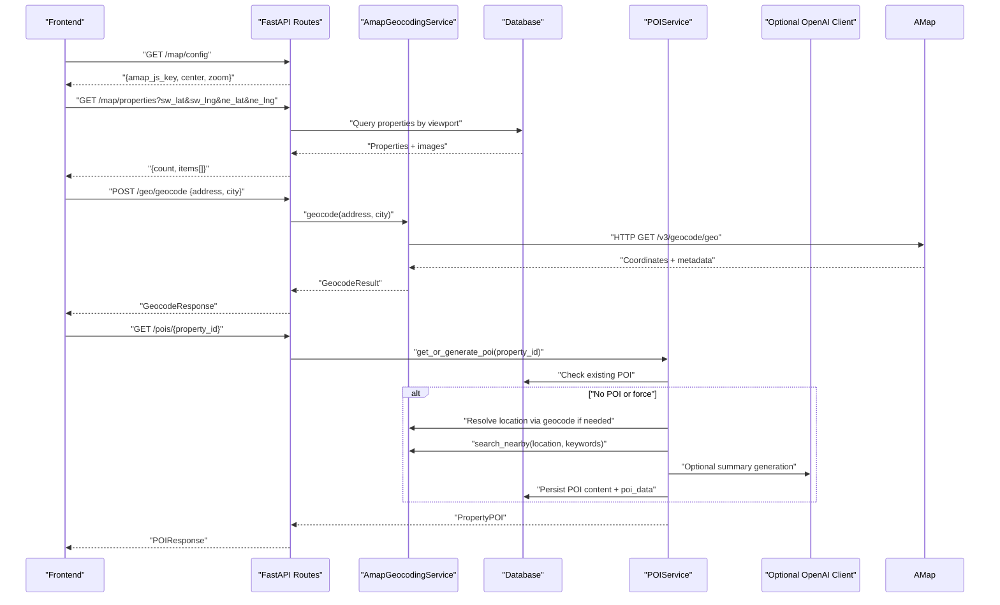
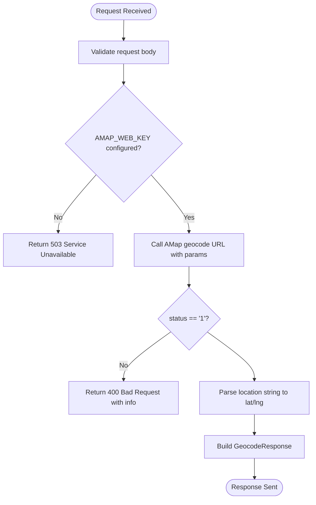
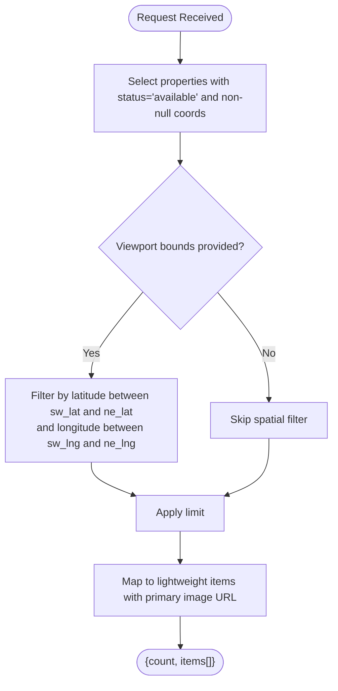
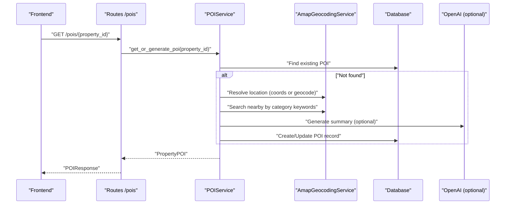
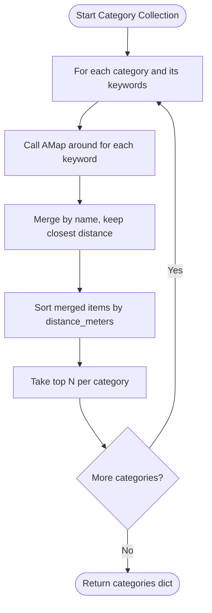
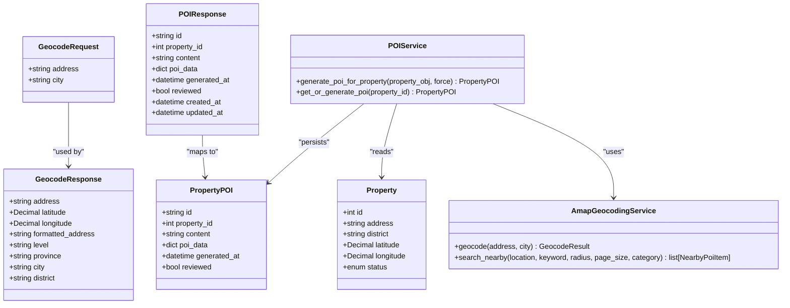

# Geographic & Mapping Routes

<cite>
**Referenced Files in This Document**
- [geocoding.py](file://backend/app/api/v1/routes/geocoding.py)
- [map_routes.py](file://backend/app/api/v1/routes/map_routes.py)
- [pois.py](file://backend/app/api/v1/routes/pois.py)
- [geocoding_service.py](file://backend/app/services/geocoding_service.py)
- [poi_service.py](file://backend/app/services/poi_service.py)
- [config.py](file://backend/app/core/config.py)
- [property.py](file://backend/app/models/property.py)
- [poi.py](file://backend/app/models/poi.py)
- [geocoding.py (schema)](file://backend/app/schemas/geocoding.py)
- [poi.py (schema)](file://backend/app/schemas/poi.py)
- [AmapMap.vue](file://frontend/src/components/AmapMap.vue)
- [map.ts](file://frontend/src/services/map.ts)
- [README.md](file://backend/README.md)
- [map-api-mapping.md](file://docs/map-api-mapping.md)
</cite>

## Table of Contents
1. Introduction
2. Project Structure
3. Core Components
4. Architecture Overview
5. Detailed Component Analysis
6. Dependency Analysis
7. Performance Considerations
8. Troubleshooting Guide
9. Conclusion

## Introduction
This document describes the geographic and mapping API routes, including geocoding endpoints for address-to-coordinate conversion, POI management for nearby amenities, and map routing endpoints for viewport-based property queries. It also explains AMap integration patterns, coordinate handling, proximity search logic, fallback mechanisms, and performance considerations for large datasets.

## Project Structure
The geographic and mapping features are implemented across FastAPI routes, services, schemas, models, and frontend components:
- Routes: /api/v1/geo, /api/v1/map, /api/v1/pois
- Services: AMap geocoding and nearby search; POI generation with fallbacks
- Schemas: Request/response models for geocoding and POI
- Models: Property coordinates and POI storage
- Frontend: AMap client-side rendering and viewport queries

```mermaid
graph TB
subgraph "Backend"
R1["routes/geocoding.py"]
R2["routes/map_routes.py"]
R3["routes/pois.py"]
S1["services/geocoding_service.py"]
S2["services/poi_service.py"]
C["core/config.py"]
M1["models/property.py"]
M2["models/poi.py"]
SC1["schemas/geocoding.py"]
SC2["schemas/poi.py"]
end
subgraph "Frontend"
F1["components/AmapMap.vue"]
F2["services/map.ts"]
end
R1 --> S1
R2 --> M1
R3 --> S2
S1 --> C
S2 --> S1
S2 --> M2
S2 --> M1
F1 --> R2
F2 --> R2
```

**Diagram sources**
- [geocoding.py:1-25](file://backend/app/api/v1/routes/geocoding.py#L1-L25)
- [map_routes.py:1-80](file://backend/app/api/v1/routes/map_routes.py#L1-L80)
- [pois.py:1-32](file://backend/app/api/v1/routes/pois.py#L1-L32)
- [geocoding_service.py:1-145](file://backend/app/services/geocoding_service.py#L1-L145)
- [poi_service.py:1-311](file://backend/app/services/poi_service.py#L1-L311)
- [config.py:74-97](file://backend/app/core/config.py#L74-L97)
- [property.py:38-86](file://backend/app/models/property.py#L38-L86)
- [poi.py:12-28](file://backend/app/models/poi.py#L12-L28)
- [geocoding.py (schema):1-19](file://backend/app/schemas/geocoding.py#L1-L19)
- [poi.py (schema):1-16](file://backend/app/schemas/poi.py#L1-L16)
- [AmapMap.vue:1-198](file://frontend/src/components/AmapMap.vue#L1-L198)
- [map.ts:1-57](file://frontend/src/services/map.ts#L1-L57)

**Section sources**
- [geocoding.py:1-25](file://backend/app/api/v1/routes/geocoding.py#L1-L25)
- [map_routes.py:1-80](file://backend/app/api/v1/routes/map_routes.py#L1-L80)
- [pois.py:1-32](file://backend/app/api/v1/routes/pois.py#L1-L32)
- [geocoding_service.py:1-145](file://backend/app/services/geocoding_service.py#L1-L145)
- [poi_service.py:1-311](file://backend/app/services/poi_service.py#L1-L311)
- [config.py:74-97](file://backend/app/core/config.py#L74-L97)
- [property.py:38-86](file://backend/app/models/property.py#L38-L86)
- [poi.py:12-28](file://backend/app/models/poi.py#L12-L28)
- [geocoding.py (schema):1-19](file://backend/app/schemas/geocoding.py#L1-L19)
- [poi.py (schema):1-16](file://backend/app/schemas/poi.py#L1-L16)
- [AmapMap.vue:1-198](file://frontend/src/components/AmapMap.vue#L1-L198)
- [map.ts:1-57](file://frontend/src/services/map.ts#L1-L57)

## Core Components
- Geocoding route: POST /api/v1/geo/geocode converts an address to latitude/longitude using AMap Web service.
- Map properties route: GET /api/v1/map/properties returns lightweight property markers within a viewport rectangle.
- Map config route: GET /api/v1/map/config returns AMap JS key and default center/zoom.
- POI routes: GET/POST /api/v1/pois/{property_id} retrieve or generate POI summaries and categories for a property.
- AMap service: Handles geocoding and nearby place searches with configurable timeouts and parameters.
- POI service: Orchestrates location resolution, nearby category aggregation, summary composition, and fallbacks.

**Section sources**
- [geocoding.py:1-25](file://backend/app/api/v1/routes/geocoding.py#L1-L25)
- [map_routes.py:14-80](file://backend/app/api/v1/routes/map_routes.py#L14-L80)
- [pois.py:11-32](file://backend/app/api/v1/routes/pois.py#L11-L32)
- [geocoding_service.py:38-145](file://backend/app/services/geocoding_service.py#L38-L145)
- [poi_service.py:109-311](file://backend/app/services/poi_service.py#L109-L311)

## Architecture Overview
The system integrates external mapping services (AMap) and optional AI summarization to enrich property listings with geospatial data and neighborhood insights.

**Diagram sources**
- [map_routes.py:14-80](file://backend/app/api/v1/routes/map_routes.py#L14-L80)
- [geocoding.py:9-25](file://backend/app/api/v1/routes/geocoding.py#L9-L25)
- [geocoding_service.py:46-85](file://backend/app/services/geocoding_service.py#L46-L85)
- [pois.py:23-32](file://backend/app/api/v1/routes/pois.py#L23-L32)
- [poi_service.py:123-195](file://backend/app/services/poi_service.py#L123-L195)
- [config.py:74-97](file://backend/app/core/config.py#L74-L97)

## Detailed Component Analysis

### Geocoding Endpoint: POST /api/v1/geo/geocode
- Purpose: Convert a human-readable address into latitude/longitude using AMap Web geocoding.
- Input: Address string and optional city.
- Output: Coordinates, formatted address, administrative levels (province/city/district).
- Error handling: Returns HTTP 503 when AMap key is missing; HTTP 400 for invalid responses from AMap.

**Diagram sources**
- [geocoding.py:9-25](file://backend/app/api/v1/routes/geocoding.py#L9-L25)
- [geocoding_service.py:46-85](file://backend/app/services/geocoding_service.py#L46-L85)
- [geocoding.py (schema):6-19](file://backend/app/schemas/geocoding.py#L6-L19)

**Section sources**
- [geocoding.py:1-25](file://backend/app/api/v1/routes/geocoding.py#L1-L25)
- [geocoding_service.py:38-85](file://backend/app/services/geocoding_service.py#L38-L85)
- [geocoding.py (schema):1-19](file://backend/app/schemas/geocoding.py#L1-L19)
- [README.md:122-162](file://backend/README.md#L122-L162)

### Map Properties Endpoint: GET /api/v1/map/properties
- Purpose: Return lightweight property markers within a viewport rectangle for map display.
- Query parameters: sw_lat, sw_lng, ne_lat, ne_lng, limit (default 500, max 1000).
- Behavior: Filters available properties with non-null coordinates; eagerly loads primary image; constructs minimal item payload.

**Diagram sources**
- [map_routes.py:14-68](file://backend/app/api/v1/routes/map_routes.py#L14-L68)
- [property.py:38-86](file://backend/app/models/property.py#L38-L86)

**Section sources**
- [map_routes.py:14-68](file://backend/app/api/v1/routes/map_routes.py#L14-L68)
- [property.py:38-86](file://backend/app/models/property.py#L38-L86)

### Map Config Endpoint: GET /api/v1/map/config
- Purpose: Provide AMap JS key and default map center/zoom for frontend initialization.
- Key selection: Uses amap_js_key, falling back to amap_api_key or amap_web_key if present.

**Section sources**
- [map_routes.py:71-80](file://backend/app/api/v1/routes/map_routes.py#L71-L80)
- [config.py:147-151](file://backend/app/core/config.py#L147-L151)

### POI Management Endpoints: GET/POST /api/v1/pois/{property_id}
- GET: Retrieve POI for a property; if absent, triggers on-demand generation.
- POST: Force-generate POI for a property.
- Generation flow:
  - Resolve location: use stored coordinates or geocode address.
  - Collect nearby categories: query AMap around places for predefined keyword sets per category.
  - Compose summary: optionally use OpenAI to summarize; deterministic fallback otherwise.
  - Persist POI content and poi_data JSON.

**Diagram sources**
- [pois.py:11-32](file://backend/app/api/v1/routes/pois.py#L11-L32)
- [poi_service.py:123-195](file://backend/app/services/poi_service.py#L123-L195)
- [geocoding_service.py:87-145](file://backend/app/services/geocoding_service.py#L87-L145)
- [poi.py:12-28](file://backend/app/models/poi.py#L12-L28)

**Section sources**
- [pois.py:1-32](file://backend/app/api/v1/routes/pois.py#L1-L32)
- [poi_service.py:109-311](file://backend/app/services/poi_service.py#L109-L311)
- [poi.py (schema):1-16](file://backend/app/schemas/poi.py#L1-L16)
- [poi.py:12-28](file://backend/app/models/poi.py#L12-L28)

### AMap Integration and Coordinate Handling
- Geocoding: Uses AMAP_GEOCODE_URL with timeout settings; parses “location” string into Decimal lat/lng.
- Nearby search: Uses AMAP_AROUND_URL with radius and page size defaults; sorts results by distance_meters.
- Frontend: AMapMap.vue dynamically loads AMap script with VITE_AMAP_KEY and renders markers; falls back to external link if key missing.
- Map config: Backend exposes amap_js_key for frontend initialization.

**Section sources**
- [geocoding_service.py:46-85](file://backend/app/services/geocoding_service.py#L46-L85)
- [geocoding_service.py:87-145](file://backend/app/services/geocoding_service.py#L87-L145)
- [config.py:74-97](file://backend/app/core/config.py#L74-L97)
- [AmapMap.vue:66-122](file://frontend/src/components/AmapMap.vue#L66-L122)
- [map_routes.py:71-80](file://backend/app/api/v1/routes/map_routes.py#L71-L80)

### Proximity Search Algorithm and Radius-Based Filtering
- Category plan: Predefined categories with multiple keywords (e.g., “交通”: ["地铁站", "公交站", "火车站"]).
- Deduplication: Merge results by name, keeping the closest entry based on normalized distance meters.
- Sorting: Final list sorted by distance_meters ascending; top N entries retained per category.
- Distance normalization: Converts strings like “500m”, “1km”, or numeric values to integer meters.

**Diagram sources**
- [poi_service.py:208-236](file://backend/app/services/poi_service.py#L208-L236)
- [geocoding_service.py:117-145](file://backend/app/services/geocoding_service.py#L117-L145)

**Section sources**
- [poi_service.py:100-107](file://backend/app/services/poi_service.py#L100-L107)
- [poi_service.py:208-236](file://backend/app/services/poi_service.py#L208-L236)
- [geocoding_service.py:117-145](file://backend/app/services/geocoding_service.py#L117-L145)

### Map Tile Serving
- The backend does not serve map tiles directly. It provides:
  - Viewport-based property markers via /map/properties.
  - AMap JS key via /map/config for client-side tile rendering.
- Frontend uses AMap’s web SDK to render tiles and markers.

**Section sources**
- [map_routes.py:71-80](file://backend/app/api/v1/routes/map_routes.py#L71-L80)
- [map.ts:38-56](file://frontend/src/services/map.ts#L38-L56)
- [AmapMap.vue:66-122](file://frontend/src/components/AmapMap.vue#L66-L122)

## Dependency Analysis
- Route dependencies:
  - Geocoding route depends on AmapGeocodingService and GeocodeRequest/Response schemas.
  - Map properties route depends on Property model and SQLAlchemy async session.
  - POI routes depend on POIService and PropertyPOI schema/model.
- Service dependencies:
  - AmapGeocodingService depends on Settings for keys and URLs.
  - POIService depends on AmapGeocodingService and optionally OpenAI client for summaries.
- Data dependencies:
  - Property stores latitude/longitude and status used for filtering.
  - PropertyPOI stores generated content and poi_data JSON.

**Diagram sources**
- [geocoding.py (schema):6-19](file://backend/app/schemas/geocoding.py#L6-L19)
- [poi.py (schema):6-16](file://backend/app/schemas/poi.py#L6-L16)
- [property.py:38-86](file://backend/app/models/property.py#L38-L86)
- [poi.py:12-28](file://backend/app/models/poi.py#L12-L28)
- [geocoding_service.py:38-145](file://backend/app/services/geocoding_service.py#L38-L145)
- [poi_service.py:109-311](file://backend/app/services/poi_service.py#L109-L311)

**Section sources**
- [geocoding.py (schema):1-19](file://backend/app/schemas/geocoding.py#L1-L19)
- [poi.py (schema):1-16](file://backend/app/schemas/poi.py#L1-L16)
- [property.py:38-86](file://backend/app/models/property.py#L38-L86)
- [poi.py:12-28](file://backend/app/models/poi.py#L12-L28)
- [geocoding_service.py:38-145](file://backend/app/services/geocoding_service.py#L38-L145)
- [poi_service.py:109-311](file://backend/app/services/poi_service.py#L109-L311)

## Performance Considerations
- Viewport queries:
  - Use bounding box filters to reduce dataset size; ensure indexes on latitude/longitude and status exist for efficient range scans.
  - Cap limit to prevent oversized payloads; consider pagination or clustering on the frontend.
- External calls:
  - AMap requests are asynchronous with configurable timeouts; tune AMAP_GEOCODE_TIMEOUT_SECONDS and AMAP_NEARBY_RADIUS_METERS for responsiveness.
  - Nearby search merges and sorts results; minimize keyword breadth and page sizes to reduce network overhead.
- Database I/O:
  - Eagerly load only necessary relations (e.g., primary image) to avoid N+1 queries.
  - Persist POI results to avoid repeated generation; leverage get_or_generate pattern.
- Frontend optimization:
  - Debounce viewport change events before calling /map/properties.
  - Cache AMap config and reuse marker clusters to reduce re-renders.

[No sources needed since this section provides general guidance]

## Troubleshooting Guide
- Missing AMap key:
  - Geocoding endpoint returns HTTP 503 if AMAP_WEB_KEY is not set.
  - Frontend AMapMap.vue shows a fallback message and opens an external AMap link if no key is configured.
- Invalid geocoding response:
  - When AMap returns non-success status or invalid location format, the service raises ValueError, mapped to HTTP 400.
- POI generation failures:
  - If AMap nearby search fails, POIService logs a warning and falls back to mock data per district.
  - If OpenAI summarization fails, it falls back to deterministic summary construction.

**Section sources**
- [geocoding.py:12-23](file://backend/app/api/v1/routes/geocoding.py#L12-L23)
- [geocoding_service.py:46-85](file://backend/app/services/geocoding_service.py#L46-L85)
- [poi_service.py:164-195](file://backend/app/services/poi_service.py#L164-L195)
- [AmapMap.vue:16-26](file://frontend/src/components/AmapMap.vue#L16-L26)

## Conclusion
The geographic and mapping subsystem provides robust geocoding, viewport-based property queries, and enriched POI summaries. It integrates AMap for location services, supports fallback strategies for reliability, and offers clear extension points for caching, indexing, and performance tuning. The frontend leverages AMap’s SDK for interactive maps while relying on backend endpoints for data and configuration.