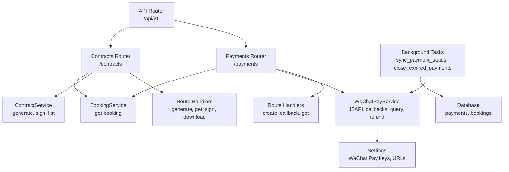
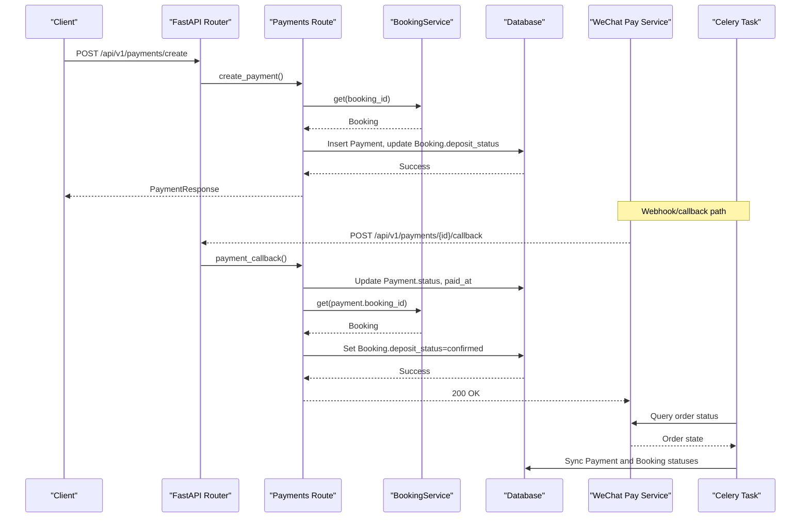
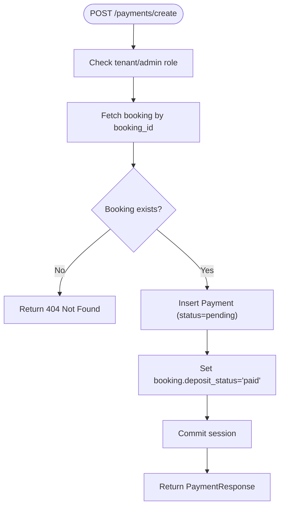
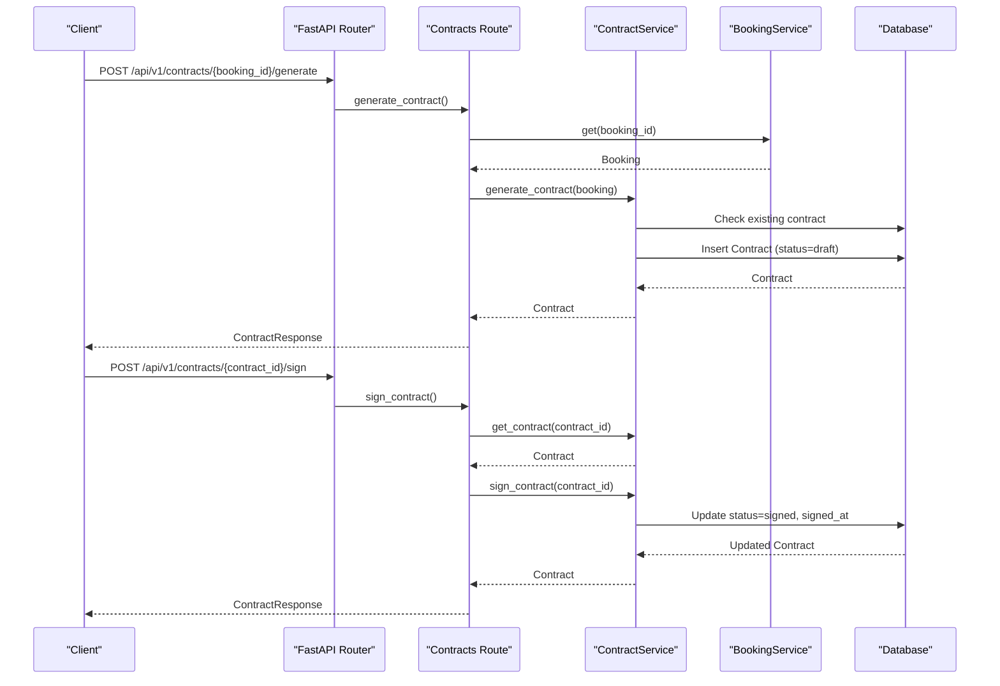
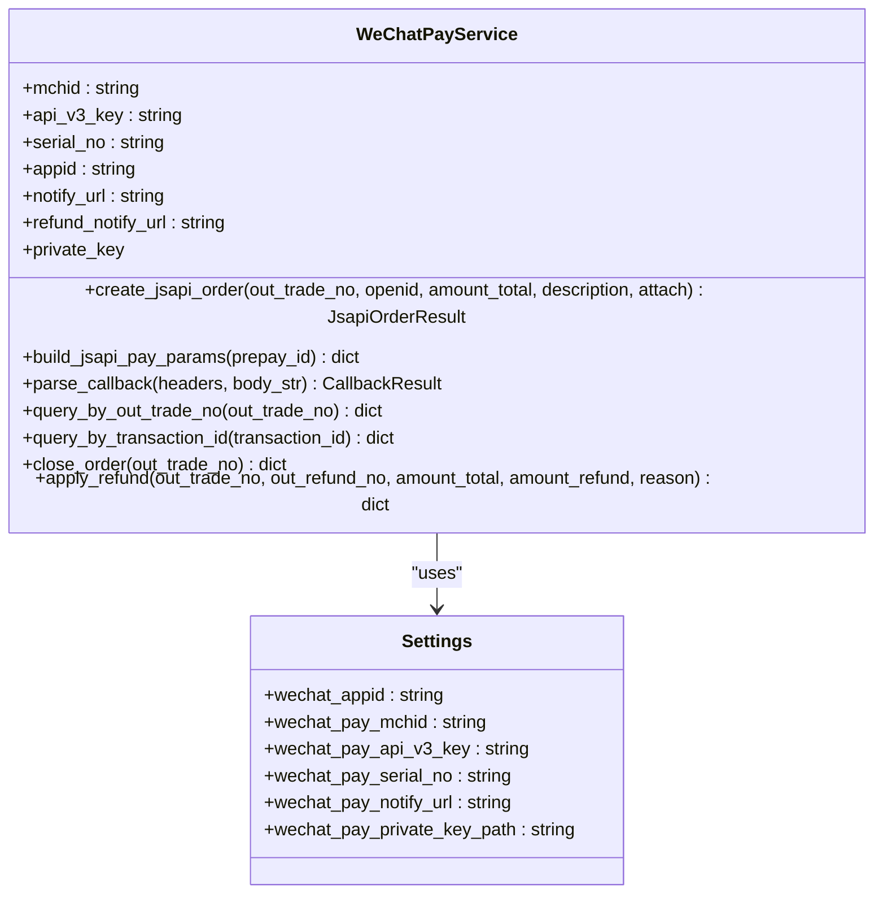
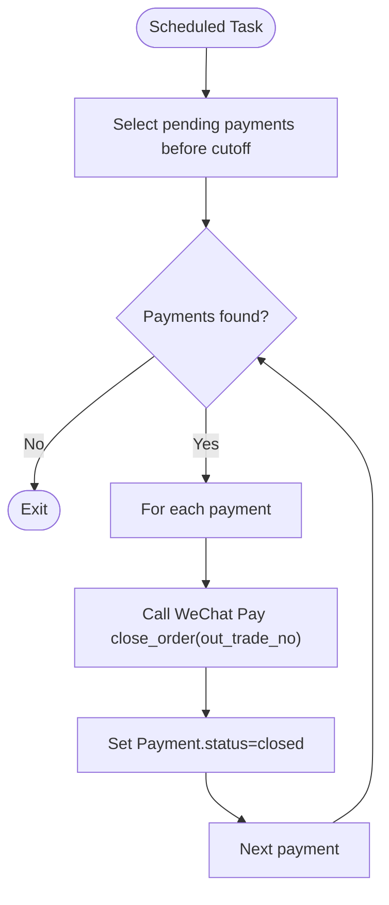
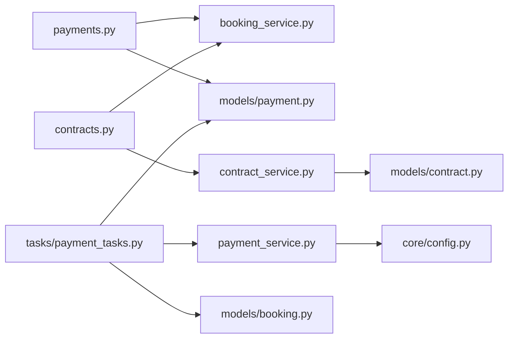

# Payment & Contract Routes

<cite>
**Referenced Files in This Document**
- [router.py](file://backend/app/api/v1/router.py)
- [payments.py](file://backend/app/api/v1/routes/payments.py)
- [contracts.py](file://backend/app/api/v1/routes/contracts.py)
- [payment_service.py](file://backend/app/services/payment_service.py)
- [contract_service.py](file://backend/app/services/contract_service.py)
- [booking_service.py](file://backend/app/services/booking_service.py)
- [payment.py](file://backend/app/models/payment.py)
- [contract.py](file://backend/app/models/contract.py)
- [booking.py](file://backend/app/models/booking.py)
- [payment_tasks.py](file://backend/app/tasks/payment_tasks.py)
- [security.py](file://backend/app/core/security.py)
- [config.py](file://backend/app/core/config.py)
</cite>

## Table of Contents
1. Introduction
2. Project Structure
3. Core Components
4. Architecture Overview
5. Detailed Component Analysis
6. Dependency Analysis
7. Performance Considerations
8. Troubleshooting Guide
9. Conclusion

## Introduction
This document provides comprehensive API documentation for payment processing and contract management routes under /api/v1/. It covers deposit collection, service fee processing, transaction management, digital contract generation, signing workflows, and document retrieval. It also explains WeChat Pay V3 integration, webhook handling for payment notifications, contract lifecycle management, security requirements, audit considerations, and reconciliation processes.

## Project Structure
The relevant backend components are organized by feature:
- API v1 router mounts sub-routers for payments and contracts.
- Route handlers implement HTTP endpoints and enforce authorization.
- Services encapsulate business logic (WeChat Pay integration, contract generation/signing).
- Models define persistent entities (Payment, Contract, Booking).
- Tasks perform background operations such as payment status synchronization and order closure.

**Diagram sources**
- [router.py:1-23](file://backend/app/api/v1/router.py#L1-L23)
- [payments.py:1-85](file://backend/app/api/v1/routes/payments.py#L1-L85)
- [contracts.py:1-88](file://backend/app/api/v1/routes/contracts.py#L1-L88)
- [payment_service.py:60-445](file://backend/app/services/payment_service.py#L60-L445)
- [contract_service.py:15-96](file://backend/app/services/contract_service.py#L15-L96)
- [booking_service.py:11-164](file://backend/app/services/booking_service.py#L11-L164)
- [payment_tasks.py:42-156](file://backend/app/tasks/payment_tasks.py#L42-L156)
- [config.py:107-167](file://backend/app/core/config.py#L107-L167)

**Section sources**
- [router.py:1-23](file://backend/app/api/v1/router.py#L1-L23)

## Core Components
- Payments API:
  - Create a deposit payment record and link to a booking.
  - Handle payment callback (simulated in route; production uses WeChat Pay service).
  - Retrieve payment details with authorization checks.
- Contracts API:
  - Generate a rental contract from booking data using a template.
  - Sign the contract (tenant-only).
  - Download contract content as plain text.
- WeChat Pay Integration:
  - JSAPI prepay order creation for mini program payments.
  - Callback signature verification and resource decryption.
  - Order query by merchant or platform transaction ID.
  - Refund application.
- Background Tasks:
  - Sync payment status from WeChat Pay.
  - Close expired pending orders.

**Section sources**
- [payments.py:15-85](file://backend/app/api/v1/routes/payments.py#L15-L85)
- [contracts.py:14-88](file://backend/app/api/v1/routes/contracts.py#L14-L88)
- [payment_service.py:245-445](file://backend/app/services/payment_service.py#L245-L445)
- [contract_service.py:19-96](file://backend/app/services/contract_service.py#L19-L96)
- [payment_tasks.py:42-156](file://backend/app/tasks/payment_tasks.py#L42-L156)

## Architecture Overview
The system follows a layered architecture:
- API Layer: FastAPI routers expose REST endpoints.
- Service Layer: Business logic for payments and contracts.
- Data Layer: SQLAlchemy models and async sessions.
- External Integrations: WeChat Pay V3 via HTTP client.
- Background Processing: Celery tasks for reconciliation and cleanup.

**Diagram sources**
- [payments.py:15-85](file://backend/app/api/v1/routes/payments.py#L15-L85)
- [booking_service.py:162-164](file://backend/app/services/booking_service.py#L162-L164)
- [payment_service.py:325-413](file://backend/app/services/payment_service.py#L325-L413)
- [payment_tasks.py:42-118](file://backend/app/tasks/payment_tasks.py#L42-L118)

## Detailed Component Analysis

### Payments API (/api/v1/payments/)
Endpoints:
- POST /api/v1/payments/create
  - Purpose: Create a deposit payment record linked to a booking.
  - Authorization: Tenant only (admin allowed).
  - Behavior: Creates Payment with status "pending", sets booking.deposit_status="paid", records transaction_id.
  - Response: PaymentResponse.
- POST /api/v1/payments/{payment_id}/callback
  - Purpose: Receive payment notification (simulated in route; production should use WeChat Pay service).
  - Behavior: Sets Payment.status="success", paid_at, updates booking.deposit_status="confirmed".
  - Response: PaymentResponse.
- GET /api/v1/payments/{payment_id}
  - Purpose: Retrieve payment details.
  - Authorization: Owner or admin.
  - Response: PaymentResponse.

Request/Response Schemas:
- PaymentCreate: booking_id, amount.
- PaymentResponse: id, booking_id, user_id, amount, transaction_id, status, payment_method, paid_at, created_at, updated_at.

Security:
- JWT-based authentication and role checks enforced via dependencies.

Integration Points:
- BookingService used to fetch and update booking deposit status.
- WeChatPayService available for real callback verification and order queries.

**Diagram sources**
- [payments.py:15-45](file://backend/app/api/v1/routes/payments.py#L15-L45)
- [booking_service.py:162-164](file://backend/app/services/booking_service.py#L162-L164)

**Section sources**
- [payments.py:15-85](file://backend/app/api/v1/routes/payments.py#L15-L85)
- [schemas.payment.py:6-23](file://backend/app/schemas/payment.py#L6-L23)
- [models.payment.py:11-34](file://backend/app/models/payment.py#L11-L34)
- [models.booking.py:18-47](file://backend/app/models/booking.py#L18-L47)

### Contracts API (/api/v1/contracts/)
Endpoints:
- POST /api/v1/contracts/{booking_id}/generate
  - Purpose: Generate a rental contract based on booking data.
  - Authorization: Tenant, landlord, or admin.
  - Behavior: Ensures no existing contract for booking, fills template fields, persists contract with status "draft".
  - Response: ContractResponse.
- GET /api/v1/contracts/{contract_id}
  - Purpose: Retrieve contract details.
  - Authorization: Tenant, landlord, or admin.
  - Response: ContractResponse.
- POST /api/v1/contracts/{contract_id}/sign
  - Purpose: Sign the contract (tenant-only).
  - Behavior: Prevents double-signing, sets status "signed" and signed_at timestamp.
  - Response: ContractResponse.
- GET /api/v1/contracts/{contract_id}/download
  - Purpose: Download contract content as plain text.
  - Authorization: Tenant, landlord, or admin.
  - Response: PlainTextResponse with content.

Request/Response Schemas:
- ContractCreate: booking_id.
- ContractResponse: id, booking_id, tenant_id, property_id, template_name, content, status, signed_at, file_path, created_at, updated_at.

Template Usage:
- Template name: standard_lease.
- Content includes property title/address, tenant name, rent, deposit, terms, dispute resolution, and signature lines.

Document Storage:
- file_path field is available for future storage integration; currently not set by generate_contract.

**Diagram sources**
- [contracts.py:14-72](file://backend/app/api/v1/routes/contracts.py#L14-L72)
- [contract_service.py:19-96](file://backend/app/services/contract_service.py#L19-L96)
- [booking_service.py:162-164](file://backend/app/services/booking_service.py#L162-L164)

**Section sources**
- [contracts.py:14-88](file://backend/app/api/v1/routes/contracts.py#L14-L88)
- [schemas.contract.py:6-23](file://backend/app/schemas/contract.py#L6-L23)
- [models.contract.py:12-37](file://backend/app/models/contract.py#L12-L37)

### WeChat Pay Integration
Capabilities:
- JSAPI prepay order creation for mini program payments.
- Build pay parameters for client-side wx.requestPayment().
- Parse and validate callback signatures and decrypt resources.
- Query order status by out_trade_no or transaction_id.
- Close unpaid orders and apply refunds.

Configuration:
- Merchant ID, APIv3 key, serial number, appid, notify URL, private key path.

**Diagram sources**
- [payment_service.py:60-116](file://backend/app/services/payment_service.py#L60-L116)
- [config.py:107-167](file://backend/app/core/config.py#L107-L167)

**Section sources**
- [payment_service.py:245-445](file://backend/app/services/payment_service.py#L245-L445)
- [config.py:107-167](file://backend/app/core/config.py#L107-L167)

### Background Tasks and Reconciliation
Tasks:
- sync_payment_status: Periodically query WeChat Pay for order states and reconcile local Payment and Booking statuses.
- close_expired_payments: Identify pending payments older than cutoff and close them locally and on WeChat Pay.

Reconciliation Flow:
- Fetch pending payments beyond cutoff.
- For each, call WeChat Pay close_order if out_trade_no exists.
- Update local status to closed and log details.

**Diagram sources**
- [payment_tasks.py:121-156](file://backend/app/tasks/payment_tasks.py#L121-L156)
- [payment_service.py:415-419](file://backend/app/services/payment_service.py#L415-L419)

**Section sources**
- [payment_tasks.py:42-156](file://backend/app/tasks/payment_tasks.py#L42-L156)

## Dependency Analysis
Key relationships:
- Payments and Contracts routers depend on services for business logic and database access.
- Payment route uses BookingService to update deposit status.
- Contract route uses ContractService for generation and signing.
- WeChatPayService depends on configuration settings for credentials and URLs.
- Background tasks depend on WeChatPayService and database engine/session.

**Diagram sources**
- [payments.py:1-85](file://backend/app/api/v1/routes/payments.py#L1-85)
- [contracts.py:1-88](file://backend/app/api/v1/routes/contracts.py#L1-88)
- [payment_service.py:60-116](file://backend/app/services/payment_service.py#L60-L116)
- [contract_service.py:15-96](file://backend/app/services/contract_service.py#L15-L96)
- [payment_tasks.py:42-156](file://backend/app/tasks/payment_tasks.py#L42-L156)
- [models.payment.py:11-34](file://backend/app/models/payment.py#L11-L34)
- [models.contract.py:12-37](file://backend/app/models/contract.py#L12-L37)
- [models.booking.py:18-47](file://backend/app/models/booking.py#L18-L47)
- [config.py:107-167](file://backend/app/core/config.py#L107-L167)

**Section sources**
- [router.py:1-23](file://backend/app/api/v1/router.py#L1-L23)

## Performance Considerations
- Use asynchronous database sessions and HTTP clients to avoid blocking I/O.
- Cache WeChat Pay platform certificates for efficient callback signature verification.
- Implement idempotency for payment callbacks to prevent duplicate state changes.
- Batch reconciliation tasks to minimize external API calls.
- Limit payload sizes for contract downloads and consider streaming large documents.

[No sources needed since this section provides general guidance]

## Troubleshooting Guide
Common issues and resolutions:
- 404 Not Found: Ensure booking or payment IDs exist and are accessible.
- 403 Forbidden: Verify user roles and ownership checks in routes.
- 409 Conflict: Prevent duplicate contract generation or re-signing.
- Payment callback failures: Validate headers and ensure correct APIv3 key usage; confirm AES-GCM decryption succeeds.
- Expired orders: Run close_expired_payments task regularly; check WeChat Pay order expiration policies.

Operational checks:
- Confirm environment variables for WeChat Pay are correctly set.
- Validate private key path accessibility for WeChat Pay service.
- Monitor Celery worker health and task queues.

**Section sources**
- [payments.py:48-69](file://backend/app/api/v1/routes/payments.py#L48-L69)
- [contracts.py:54-72](file://backend/app/api/v1/routes/contracts.py#L54-L72)
- [payment_service.py:325-377](file://backend/app/services/payment_service.py#L325-L377)
- [payment_tasks.py:121-156](file://backend/app/tasks/payment_tasks.py#L121-L156)

## Conclusion
The payment and contract APIs provide robust endpoints for deposit collection, transaction tracking, and contract lifecycle management. WeChat Pay V3 integration supports secure order creation, callback verification, and reconciliation through background tasks. Security controls enforce role-based access, while audit-friendly timestamps and statuses support compliance. Future enhancements include full callback signature verification with platform certificates, electronic signature handling, and document storage integration.

[No sources needed since this section summarizes without analyzing specific files]