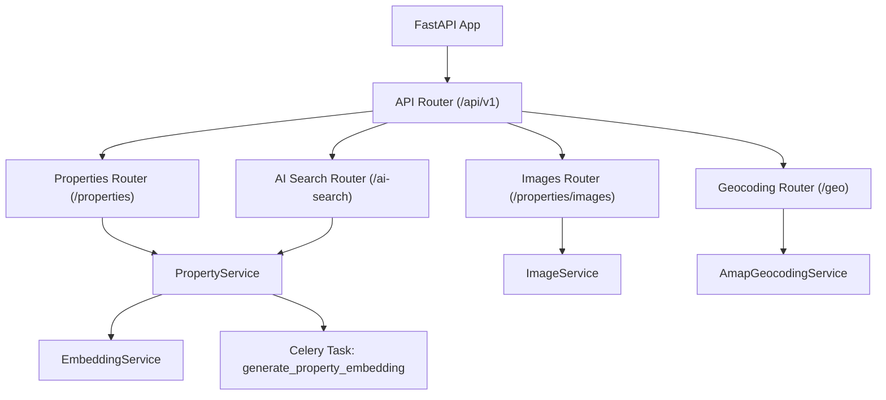
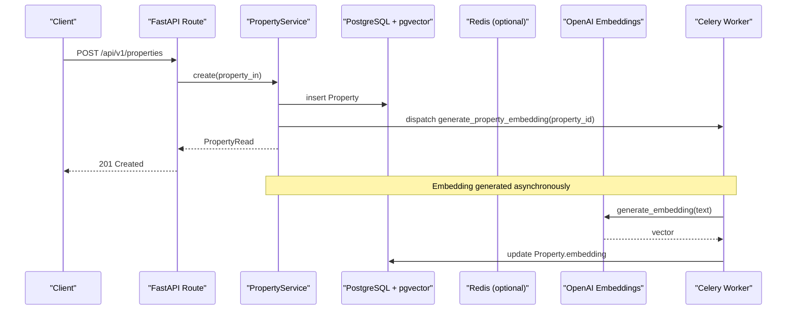
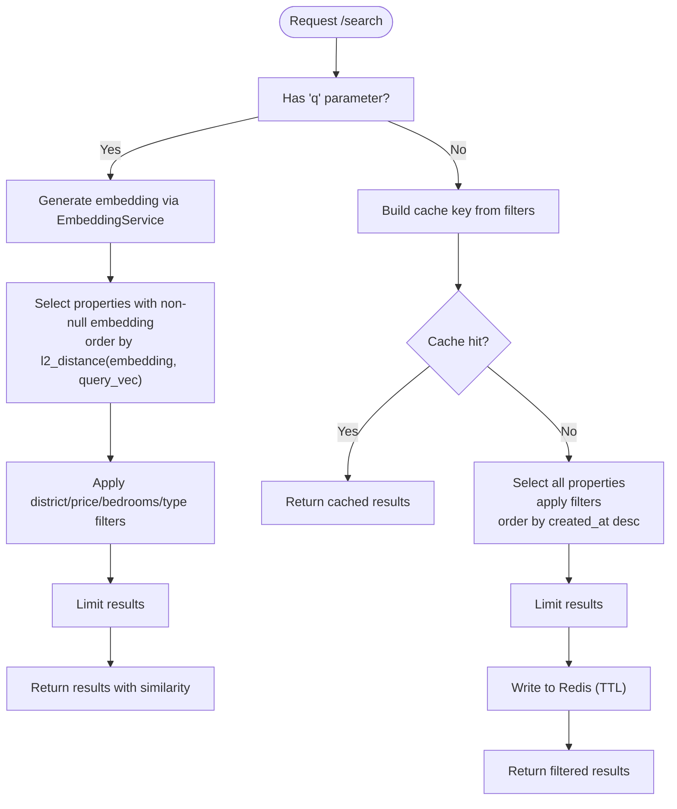
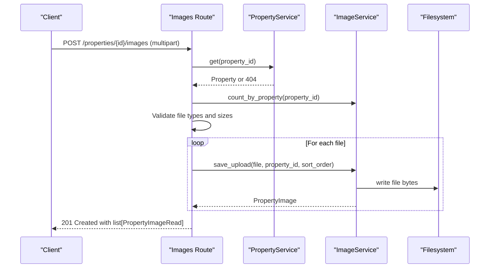
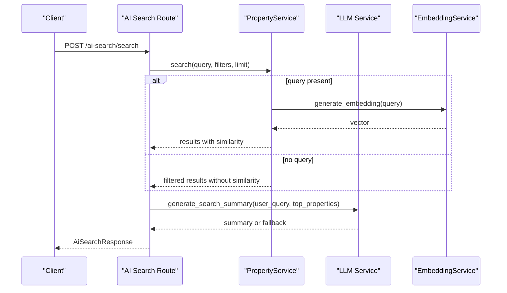
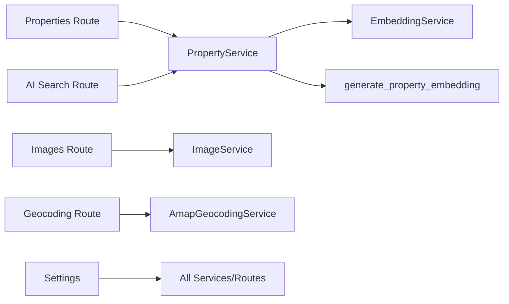

# Property Management Routes

<cite>
**Referenced Files in This Document**
- [router.py](file://backend/app/api/v1/router.py)
- [properties.py](file://backend/app/api/v1/routes/properties.py)
- [images.py](file://backend/app/api/v1/routes/images.py)
- [ai_search.py](file://backend/app/api/v1/routes/ai_search.py)
- [geocoding.py](file://backend/app/api/v1/routes/geocoding.py)
- [property_service.py](file://backend/app/services/property_service.py)
- [image_service.py](file://backend/app/services/image_service.py)
- [embedding_service.py](file://backend/app/services/embedding_service.py)
- [embedding_tasks.py](file://backend/app/tasks/embedding_tasks.py)
- [config.py](file://backend/app/core/config.py)
- [property.py](file://backend/app/models/property.py)
- [property_image.py](file://backend/app/models/property_image.py)
- [property_schema.py](file://backend/app/schemas/property.py)
- [property_image_schema.py](file://backend/app/schemas/property_image.py)
</cite>

## Table of Contents
1. [Introduction](#introduction)
2. [Project Structure](#project-structure)
3. [Core Components](#core-components)
4. [Architecture Overview](#architecture-overview)
5. [Detailed Component Analysis](#detailed-component-analysis)
6. [Dependency Analysis](#dependency-analysis)
7. [Performance Considerations](#performance-considerations)
8. [Troubleshooting Guide](#troubleshooting-guide)
9. [Conclusion](#conclusion)

## Introduction
This document provides comprehensive API documentation for property management routes, focusing on:
- CRUD operations under /api/v1/properties/
- Search and filtering with semantic search support
- Status management via admin endpoints
- Image upload and management under /api/v1/properties/images/
- AI embedding generation triggers and reindexing
- Geospatial query parameters and geocoding integration
- Validation rules and business constraints
- Performance characteristics and caching behavior

The system is built with FastAPI, SQLAlchemy async ORM, PostgreSQL with pgvector for vector similarity search, Redis for optional caching, and Celery for background tasks.

## Project Structure
Property-related routes are organized under the v1 API router and include:
- Properties CRUD and search
- Images management (upload, delete, set primary)
- AI search endpoint for natural language queries
- Geocoding helper endpoint
- Admin status management

**Diagram sources**
- [router.py:1-23](file://backend/app/api/v1/router.py#L1-L23)
- [properties.py:1-162](file://backend/app/api/v1/routes/properties.py#L1-L162)
- [images.py:1-151](file://backend/app/api/v1/routes/images.py#L1-L151)
- [ai_search.py:1-160](file://backend/app/api/v1/routes/ai_search.py#L1-L160)
- [geocoding.py:1-25](file://backend/app/api/v1/routes/geocoding.py#L1-L25)
- [property_service.py:1-239](file://backend/app/services/property_service.py#L1-L239)
- [image_service.py:1-95](file://backend/app/services/image_service.py#L1-L95)
- [embedding_service.py:1-32](file://backend/app/services/embedding_service.py#L1-L32)
- [embedding_tasks.py:1-112](file://backend/app/tasks/embedding_tasks.py#L1-L112)

**Section sources**
- [router.py:1-23](file://backend/app/api/v1/router.py#L1-L23)

## Core Components
- Property routes provide create, list, get, update, delete, and search capabilities.
- Image routes manage uploads, deletion, listing, and setting a primary image.
- AI search route composes natural language parsing and semantic search using embeddings.
- Geocoding route integrates external geocoding services to obtain coordinates.
- Services encapsulate business logic: PropertyService, ImageService, EmbeddingService.
- Background tasks handle asynchronous embedding generation and reindexing.

Key responsibilities:
- Validation and authorization at route layer
- Business rules and data access in service layer
- External integrations (OpenAI embeddings, AMap geocoding)
- Optional Redis caching for non-vector searches
- Celery task dispatch for embedding generation

**Section sources**
- [properties.py:1-162](file://backend/app/api/v1/routes/properties.py#L1-L162)
- [images.py:1-151](file://backend/app/api/v1/routes/images.py#L1-L151)
- [ai_search.py:1-160](file://backend/app/api/v1/routes/ai_search.py#L1-L160)
- [geocoding.py:1-25](file://backend/app/api/v1/routes/geocoding.py#L1-L25)
- [property_service.py:1-239](file://backend/app/services/property_service.py#L1-L239)
- [image_service.py:1-95](file://backend/app/services/image_service.py#L1-L95)
- [embedding_service.py:1-32](file://backend/app/services/embedding_service.py#L1-L32)
- [embedding_tasks.py:1-112](file://backend/app/tasks/embedding_tasks.py#L1-L112)

## Architecture Overview
The property management architecture separates concerns across routes, services, models, and background tasks. Vector similarity search uses pgvector and OpenAI embeddings. Caching improves performance for deterministic filter-only queries.

**Diagram sources**
- [properties.py:16-33](file://backend/app/api/v1/routes/properties.py#L16-L33)
- [property_service.py:48-60](file://backend/app/services/property_service.py#L48-L60)
- [embedding_tasks.py:16-80](file://backend/app/tasks/embedding_tasks.py#L16-L80)
- [embedding_service.py:17-32](file://backend/app/services/embedding_service.py#L17-L32)

## Detailed Component Analysis

### Properties CRUD and Search
Endpoints:
- POST /api/v1/properties
- GET /api/v1/properties/search
- GET /api/v1/properties
- GET /api/v1/properties/{property_id}
- PATCH /api/v1/properties/{property_id}
- DELETE /api/v1/properties/{property_id}

Behavior:
- Create requires landlord_id; validates landlord existence and ownership.
- List supports pagination (skip, limit), district filter, and status filter.
- Search supports natural language query q, district, price_min, price_max, bedrooms, property_type, and limit.
- Update enforces ownership or admin role.
- Delete enforces ownership or admin role.

Validation and constraints:
- Title length 1–200, address 1–300, district 1–100.
- Non-negative price_monthly, positive area_sqm if provided.
- Non-negative bedrooms/bathrooms.
- Latitude within [-90, 90], longitude within [-180, 180].
- Enumerated property_type and status values enforced by schema and model.

Search details:
- If q is provided, performs vector similarity search using l2_distance against Property.embedding.
- If q is absent, applies filters and orders by created_at desc.
- Optional Redis cache for non-vector queries with TTL.

Status management:
- Admin patch endpoint updates property status (see Admin section).

Examples:
- Creation payload includes title, description, address, district, price_monthly, area_sqm, bedrooms, bathrooms, property_type, status, latitude, longitude, deposit_amount, service_fee_rate, landlord_id.
- Search query parameters can be combined; limit capped between 1 and 100.

**Section sources**
- [properties.py:16-162](file://backend/app/api/v1/routes/properties.py#L16-L162)
- [property_schema.py:11-79](file://backend/app/schemas/property.py#L11-L79)
- [property.py:38-86](file://backend/app/models/property.py#L38-L86)
- [property_service.py:75-195](file://backend/app/services/property_service.py#L75-L195)

#### Search Flowchart

**Diagram sources**
- [property_service.py:91-195](file://backend/app/services/property_service.py#L91-L195)

### Image Upload and Management
Endpoints:
- POST /api/v1/properties/{property_id}/images
- GET /api/v1/properties/{property_id}/images
- PATCH /api/v1/properties/{property_id}/images/{image_id}/primary
- DELETE /api/v1/properties/{property_id}/images/{image_id}

Behavior:
- Upload accepts multiple files; validates file type and size against settings.
- Enforces maximum images per property.
- First uploaded image becomes primary automatically; can be changed via set primary.
- Deletion removes file from storage and database record.
- Listing returns images ordered by sort_order and id.

Storage backend:
- Local filesystem configured via upload_dir; filenames are UUID-based to ensure uniqueness.
- Settings control allowed_image_types, max_upload_size, max_images_per_property.

Security:
- Requires landlord ownership or admin role for write operations.
- Read access checks property existence only.

**Section sources**
- [images.py:26-151](file://backend/app/api/v1/routes/images.py#L26-L151)
- [image_service.py:27-95](file://backend/app/services/image_service.py#L27-L95)
- [config.py:99-105](file://backend/app/core/config.py#L99-L105)
- [property_image.py:8-23](file://backend/app/models/property_image.py#L8-L23)
- [property_image_schema.py:10-22](file://backend/app/schemas/property_image.py#L10-L22)

#### Image Upload Sequence

**Diagram sources**
- [images.py:26-80](file://backend/app/api/v1/routes/images.py#L26-L80)
- [image_service.py:27-52](file://backend/app/services/image_service.py#L27-L52)

### AI Search and Semantic Search
Endpoint:
- POST /api/v1/ai-search/search

Behavior:
- Accepts structured request including query text, district, keywords, price range, bedrooms, property_type, and limit.
- Composes a search query string from provided parts and delegates to PropertyService.search.
- Returns top IDs and full results with similarity scores.
- Generates an AI summary using an LLM service when available; gracefully degrades otherwise.

Natural language parsing:
- Separate parse endpoint extracts structured parameters and completeness report from free-form text.

Integration:
- Uses EmbeddingService to generate embeddings for query text.
- Relies on pgvector l2_distance for similarity ranking.

**Section sources**
- [ai_search.py:80-160](file://backend/app/api/v1/routes/ai_search.py#L80-L160)
- [property_service.py:91-195](file://backend/app/services/property_service.py#L91-L195)
- [embedding_service.py:17-32](file://backend/app/services/embedding_service.py#L17-L32)

#### AI Search Sequence

**Diagram sources**
- [ai_search.py:98-160](file://backend/app/api/v1/routes/ai_search.py#L98-L160)
- [property_service.py:91-195](file://backend/app/services/property_service.py#L91-L195)
- [embedding_service.py:17-32](file://backend/app/services/embedding_service.py#L17-L32)

### Geospatial Query Parameters and Geocoding
Geocoding endpoint:
- POST /api/v1/geo/geocode

Usage:
- Converts address and city into latitude/longitude coordinates via AMap geocoding service.
- Errors map to appropriate HTTP status codes (400 for invalid input, 503 for unavailable service).

Property creation/update:
- Clients may supply latitude and longitude fields validated by schema constraints.
- Coordinates are stored in Property model and used for POI and map features.

Note:
- No dedicated geospatial filter endpoints are exposed in the analyzed code; filtering by district and status is supported.

**Section sources**
- [geocoding.py:9-25](file://backend/app/api/v1/routes/geocoding.py#L9-L25)
- [property_schema.py:22-23](file://backend/app/schemas/property.py#L22-L23)
- [property.py:72-73](file://backend/app/models/property.py#L72-L73)

### Admin Status Management
Admin endpoint:
- PATCH /api/v1/admin/properties/{property_id}/status

Behavior:
- Updates property status to a new value (e.g., available, rented, maintenance, offline).
- Requires administrative privileges.

Status transitions:
- Controlled by PropertyStatus enum; validation enforced at schema/model level.

**Section sources**
- [admin.py:50-50](file://backend/app/api/v1/routes/admin.py#L50-L50)
- [property.py:31-36](file://backend/app/models/property.py#L31-L36)

### AI Embedding Generation Triggers and Reindexing
Triggers:
- On property create and update, PropertyService._dispatch_embedding_task schedules a Celery task to generate embeddings.
- Background task generate_property_embedding retrieves property data, generates embedding via EmbeddingService, and persists it.

Reindexing:
- Admin endpoint triggers reindex_all_properties to enqueue jobs for properties missing embeddings.

Error handling:
- Tasks track job status and error messages; retries with backoff are configured.

**Section sources**
- [property_service.py:225-239](file://backend/app/services/property_service.py#L225-L239)
- [embedding_tasks.py:16-80](file://backend/app/tasks/embedding_tasks.py#L16-L80)
- [embedding_tasks.py:83-112](file://backend/app/tasks/embedding_tasks.py#L83-L112)
- [embedding_service.py:17-32](file://backend/app/services/embedding_service.py#L17-L32)

### Data Models and Schemas
Models:
- Property: core entity with enums for type/status, indexes on district and status, check constraints for numeric fields, and vector column for embeddings.
- PropertyImage: metadata for uploaded images with primary flag and ordering.

Schemas:
- PropertyCreate/PropertyUpdate/PropertyRead enforce field constraints and expose computed primary_image_url.
- PropertyImageRead exposes image metadata.

**Section sources**
- [property.py:38-86](file://backend/app/models/property.py#L38-L86)
- [property_image.py:8-23](file://backend/app/models/property_image.py#L8-L23)
- [property_schema.py:11-79](file://backend/app/schemas/property.py#L11-L79)
- [property_image_schema.py:10-22](file://backend/app/schemas/property_image.py#L10-L22)

## Dependency Analysis
High-level dependencies among components:
- Routes depend on services for business logic.
- Services depend on models and external integrations (OpenAI, AMap).
- Background tasks depend on services and database sessions.
- Configuration centralizes settings for uploads, LLM, and geocoding.

**Diagram sources**
- [router.py:1-23](file://backend/app/api/v1/router.py#L1-L23)
- [properties.py:1-162](file://backend/app/api/v1/routes/properties.py#L1-L162)
- [images.py:1-151](file://backend/app/api/v1/routes/images.py#L1-L151)
- [ai_search.py:1-160](file://backend/app/api/v1/routes/ai_search.py#L1-L160)
- [geocoding.py:1-25](file://backend/app/api/v1/routes/geocoding.py#L1-L25)
- [property_service.py:1-239](file://backend/app/services/property_service.py#L1-L239)
- [image_service.py:1-95](file://backend/app/services/image_service.py#L1-L95)
- [embedding_service.py:1-32](file://backend/app/services/embedding_service.py#L1-L32)
- [config.py:1-167](file://backend/app/core/config.py#L1-L167)

**Section sources**
- [router.py:1-23](file://backend/app/api/v1/router.py#L1-L23)

## Performance Considerations
- Non-vector search queries are cached in Redis with a configurable TTL to reduce database load.
- Vector similarity search leverages pgvector indexes and l2_distance for efficient ranking.
- Background embedding generation avoids blocking API responses.
- File uploads validate size and type upfront to prevent large or unsupported payloads.
- Pagination limits are enforced to prevent excessive result sets.

Recommendations:
- Ensure Redis availability for optimal search performance.
- Monitor embedding generation queue depth and adjust worker concurrency.
- Tune upload size limits based on storage capacity and client expectations.

[No sources needed since this section provides general guidance]

## Troubleshooting Guide
Common issues and resolutions:
- 404 Not Found: Property or image not found; verify IDs and ownership.
- 403 Forbidden: Landlord attempting to modify another user's property; confirm current_user.id matches resource owner.
- 400 Bad Request: Unsupported file type or file too large; check allowed_image_types and max_upload_size settings.
- 503 Service Unavailable: Geocoding or LLM services down; retry later or configure fallbacks.
- Embedding failures: Inspect Celery task logs for error_message; ensure OpenAI API key and model configuration are correct.

Operational checks:
- Verify upload_dir exists and is writable.
- Confirm database connection strings and pgvector extension enabled.
- Validate Redis URL connectivity for caching.

**Section sources**
- [images.py:60-71](file://backend/app/api/v1/routes/images.py#L60-L71)
- [geocoding.py:14-23](file://backend/app/api/v1/routes/geocoding.py#L14-L23)
- [embedding_tasks.py:70-76](file://backend/app/tasks/embedding_tasks.py#L70-L76)
- [config.py:99-105](file://backend/app/core/config.py#L99-L105)

## Conclusion
The property management API provides robust CRUD, search, and image management capabilities with strong validation, security, and extensibility. Semantic search powered by embeddings and optional caching delivers responsive experiences. Admin controls enable operational oversight, while background tasks maintain consistency for AI-driven features. Adhering to the documented validation rules and best practices ensures reliable and scalable operation.

[No sources needed since this section summarizes without analyzing specific files]