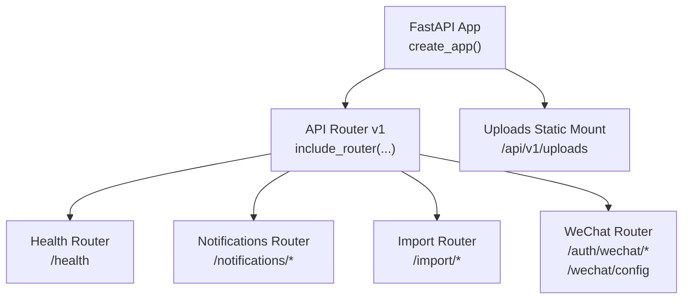
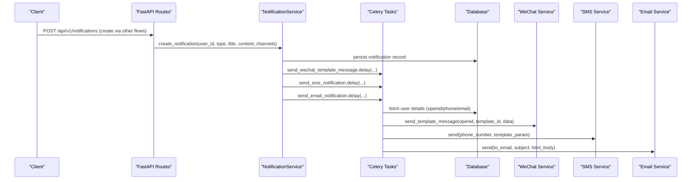
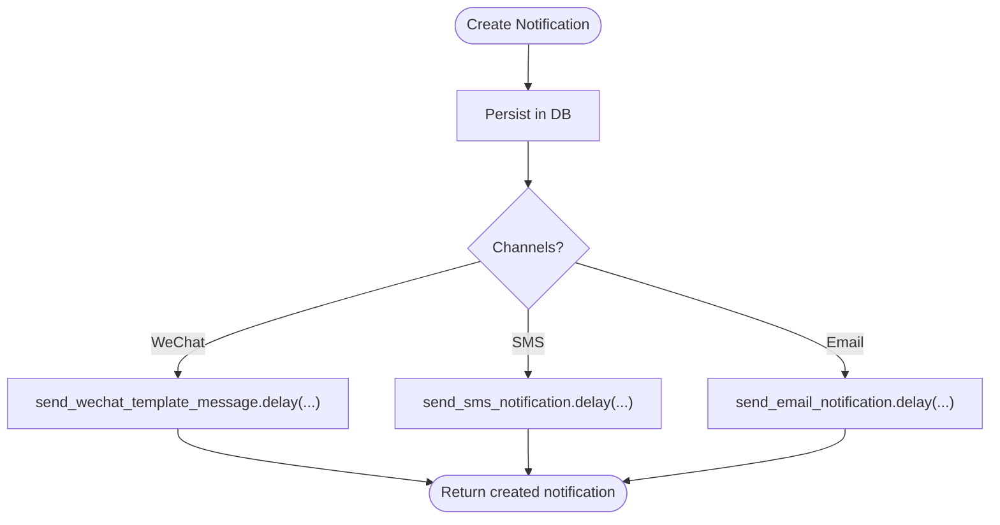
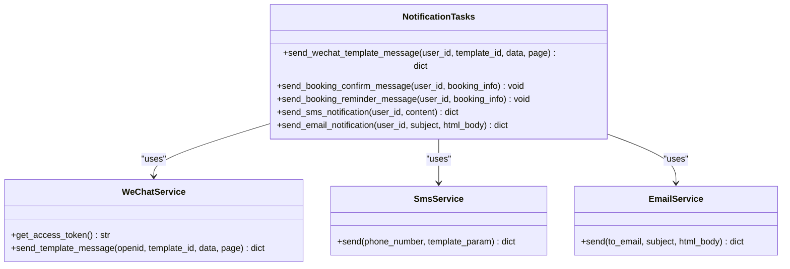
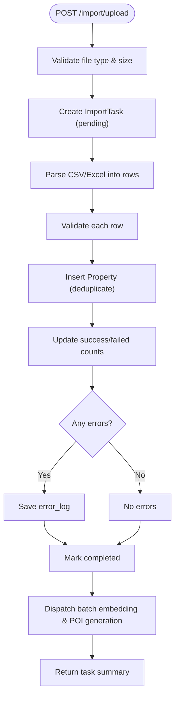
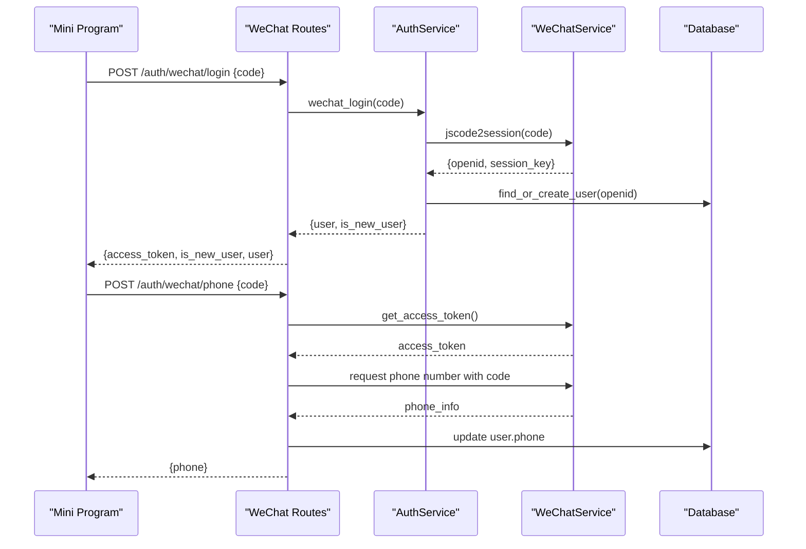
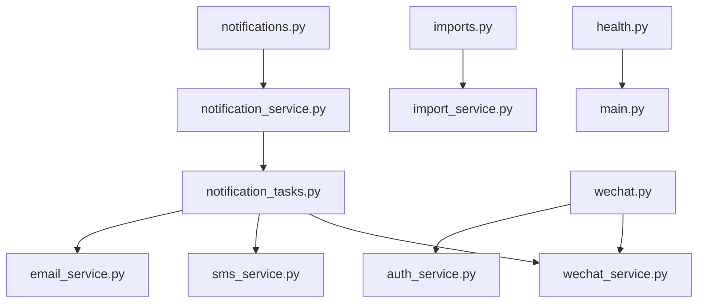

# System Integration Routes

<cite>
**Referenced Files in This Document**
- [main.py](file://backend/app/main.py)
- [router.py](file://backend/app/api/v1/router.py)
- [health.py](file://backend/app/api/v1/routes/health.py)
- [notifications.py](file://backend/app/api/v1/routes/notifications.py)
- [notification_service.py](file://backend/app/services/notification_service.py)
- [notification_tasks.py](file://backend/app/tasks/notification_tasks.py)
- [sms_service.py](file://backend/app/services/sms_service.py)
- [email_service.py](file://backend/app/services/email_service.py)
- [wechat_service.py](file://backend/app/services/wechat_service.py)
- [wechat.py](file://backend/app/api/v1/routes/wechat.py)
- [imports.py](file://backend/app/api/v1/routes/imports.py)
- [import_service.py](file://backend/app/services/import_service.py)
- [test_notifications.py](file://backend/tests/test_notifications.py)
- [test_import.py](file://backend/tests/test_import.py)
- [test_wechat.py](file://backend/tests/test_wechat.py)
</cite>

## Table of Contents
1. [Introduction](#introduction)
2. [Project Structure](#project-structure)
3. [Core Components](#core-components)
4. [Architecture Overview](#architecture-overview)
5. [Detailed Component Analysis](#detailed-component-analysis)
6. [Dependency Analysis](#dependency-analysis)
7. [Performance Considerations](#performance-considerations)
8. [Troubleshooting Guide](#troubleshooting-guide)
9. [Conclusion](#conclusion)
10. [Appendices](#appendices)

## Introduction
This document describes the system integration and utility API routes for notifications, data import/export, WeChat Mini Program integration, health checks, webhooks, event-driven patterns, and asynchronous processing. It provides a clear guide to endpoints, data flows, error handling, testing strategies, and best practices for adding new integrations while maintaining backward compatibility.

## Project Structure
The backend exposes versioned REST APIs under /api/v1. The application mounts routers for health, authentication, users, properties, bookings, notifications, chat, admin, imports, WeChat, AI search, geocoding, contracts, payments, POIs, and map routes. Health checks are provided for monitoring and load balancer integration.

**Diagram sources**
- [main.py:17-82](file://backend/app/main.py#L17-L82)
- [router.py:1-23](file://backend/app/api/v1/router.py#L1-L23)
- [health.py:1-9](file://backend/app/api/v1/routes/health.py#L1-L9)

**Section sources**
- [main.py:17-82](file://backend/app/main.py#L17-L82)
- [router.py:1-23](file://backend/app/api/v1/router.py#L1-L23)

## Core Components
- Notifications: List, mark read, mark all read, unread count; dispatches async tasks for email, SMS, and WeChat template messages.
- Import/Export: Admin-only CSV/Excel upload with validation, parsing, deduplication, retry, and background triggers for embeddings and POI generation.
- WeChat Mini Program: Login via code exchange, phone binding, and app configuration retrieval.
- Health Check: Simple readiness endpoint for monitoring and load balancers.

**Section sources**
- [notifications.py:1-50](file://backend/app/api/v1/routes/notifications.py#L1-L50)
- [notification_service.py:37-164](file://backend/app/services/notification_service.py#L37-L164)
- [notification_tasks.py:53-217](file://backend/app/tasks/notification_tasks.py#L53-L217)
- [sms_service.py:15-96](file://backend/app/services/sms_service.py#L15-L96)
- [email_service.py:11-76](file://backend/app/services/email_service.py#L11-L76)
- [imports.py:1-194](file://backend/app/api/v1/routes/imports.py#L1-L194)
- [import_service.py:34-403](file://backend/app/services/import_service.py#L34-L403)
- [wechat.py:1-82](file://backend/app/api/v1/routes/wechat.py#L1-L82)
- [wechat_service.py:23-146](file://backend/app/services/wechat_service.py#L23-L146)
- [health.py:1-9](file://backend/app/api/v1/routes/health.py#L1-L9)

## Architecture Overview
The system uses an event-driven architecture with Celery tasks for asynchronous delivery of notifications and background processing for import-related operations. External services include WeChat APIs, Alibaba Cloud SMS, and SMTP servers.

**Diagram sources**
- [notification_service.py:43-69](file://backend/app/services/notification_service.py#L43-L69)
- [notification_tasks.py:53-97](file://backend/app/tasks/notification_tasks.py#L53-L97)
- [notification_tasks.py:136-173](file://backend/app/tasks/notification_tasks.py#L136-L173)
- [notification_tasks.py:178-216](file://backend/app/tasks/notification_tasks.py#L178-L216)
- [wechat_service.py:90-119](file://backend/app/services/wechat_service.py#L90-L119)
- [sms_service.py:41-96](file://backend/app/services/sms_service.py#L41-L96)
- [email_service.py:17-58](file://backend/app/services/email_service.py#L17-L58)

## Detailed Component Analysis

### Health Check Endpoints
- GET /api/v1/health
  - Purpose: Readiness/liveness probe for monitoring and load balancers.
  - Response: JSON status object indicating operational state.

**Section sources**
- [health.py:6-8](file://backend/app/api/v1/routes/health.py#L6-L8)

### Notification Endpoints
- GET /api/v1/notifications
  - Lists notifications for the authenticated user.
- PATCH /api/v1/notifications/{notification_id}/read
  - Marks a specific notification as read; enforces ownership.
- PATCH /api/v1/notifications/read-all
  - Marks all notifications for the current user as read.
- GET /api/v1/notifications/unread-count
  - Returns the number of unread notifications for the current user.

Data flow:
- Routes call NotificationService methods to query or update records.
- On creation (via other flows), NotificationService persists the record and dispatches async tasks for push channels.

**Diagram sources**
- [notification_service.py:43-69](file://backend/app/services/notification_service.py#L43-L69)
- [notification_service.py:108-164](file://backend/app/services/notification_service.py#L108-L164)

**Section sources**
- [notifications.py:12-49](file://backend/app/api/v1/routes/notifications.py#L12-L49)
- [notification_service.py:71-105](file://backend/app/services/notification_service.py#L71-L105)

### Asynchronous Processing Triggers
- Celery tasks:
  - send_wechat_template_message: Sends WeChat template messages using cached access tokens and user openid.
  - send_sms_notification: Sends SMS via Alibaba Cloud SMS service if configured.
  - send_email_notification: Sends HTML emails via SMTP if configured.
- Retry behavior:
  - Tasks are configured with autoretry and backoff for resilience.

**Diagram sources**
- [notification_tasks.py:53-97](file://backend/app/tasks/notification_tasks.py#L53-L97)
- [notification_tasks.py:136-173](file://backend/app/tasks/notification_tasks.py#L136-L173)
- [notification_tasks.py:178-216](file://backend/app/tasks/notification_tasks.py#L178-L216)
- [wechat_service.py:67-119](file://backend/app/services/wechat_service.py#L67-L119)
- [sms_service.py:41-96](file://backend/app/services/sms_service.py#L41-L96)
- [email_service.py:17-58](file://backend/app/services/email_service.py#L17-L58)

**Section sources**
- [notification_tasks.py:53-216](file://backend/app/tasks/notification_tasks.py#L53-L216)
- [wechat_service.py:67-119](file://backend/app/services/wechat_service.py#L67-L119)
- [sms_service.py:41-96](file://backend/app/services/sms_service.py#L41-L96)
- [email_service.py:17-58](file://backend/app/services/email_service.py#L17-L58)

### Data Import/Export Endpoints
Admin-only endpoints for bulk operations and migration:
- POST /api/v1/import/upload
  - Accepts CSV or Excel files; validates size and extension; creates import task; parses and imports rows; returns task summary.
- GET /api/v1/import/tasks
  - Lists import tasks with pagination and optional status filter.
- GET /api/v1/import/tasks/{task_id}
  - Retrieves detailed task info including error logs.
- POST /api/v1/import/tasks/{task_id}/retry
  - Retries failed rows from previous runs.

Processing logic:
- Validation: Required fields enforced; numeric ranges validated; duplicates detected by title+address.
- Background triggers: After successful inserts, batch embedding and POI generation are dispatched asynchronously.

**Diagram sources**
- [imports.py:39-91](file://backend/app/api/v1/routes/imports.py#L39-L91)
- [import_service.py:77-136](file://backend/app/services/import_service.py#L77-L136)
- [import_service.py:357-402](file://backend/app/services/import_service.py#L357-L402)

**Section sources**
- [imports.py:1-194](file://backend/app/api/v1/routes/imports.py#L1-L194)
- [import_service.py:34-403](file://backend/app/services/import_service.py#L34-L403)

### WeChat Mini Program Integration Endpoints
- POST /api/v1/auth/wechat/login
  - Exchanges wx.login() code for JWT; creates or retrieves user by openid.
- POST /api/v1/auth/wechat/phone
  - Binds phone number to current user using WeChat phone number API.
- GET /api/v1/wechat/config
  - Returns WeChat app configuration (e.g., appid) for frontend initialization.

**Diagram sources**
- [wechat.py:19-38](file://backend/app/api/v1/routes/wechat.py#L19-L38)
- [wechat.py:41-74](file://backend/app/api/v1/routes/wechat.py#L41-L74)
- [wechat_service.py:45-65](file://backend/app/services/wechat_service.py#L45-L65)
- [wechat_service.py:67-88](file://backend/app/services/wechat_service.py#L67-L88)

**Section sources**
- [wechat.py:1-82](file://backend/app/api/v1/routes/wechat.py#L1-L82)
- [wechat_service.py:23-146](file://backend/app/services/wechat_service.py#L23-L146)

### Webhook Handlers and Event-Driven Patterns
- Webhooks:
  - No explicit webhook receiver endpoints are present in the analyzed routes.
- Event-driven patterns:
  - NotificationService dispatches Celery tasks for multi-channel delivery.
  - ImportService triggers background jobs for embeddings and POI generation after successful imports.

Best practices:
- Use idempotent handlers for external callbacks.
- Implement retries and dead-letter queues for failed tasks.
- Log outcomes and metrics for observability.

[No sources needed since this section summarizes patterns without analyzing specific files]

## Dependency Analysis
Key dependencies between components:
- Routes depend on services for business logic.
- Services interact with databases and external APIs.
- Celery tasks depend on services and database sessions within worker processes.
- Configuration is centralized and injected into services.

**Diagram sources**
- [notifications.py:1-50](file://backend/app/api/v1/routes/notifications.py#L1-L50)
- [notification_service.py:37-164](file://backend/app/services/notification_service.py#L37-L164)
- [notification_tasks.py:53-216](file://backend/app/tasks/notification_tasks.py#L53-L216)
- [wechat_service.py:23-146](file://backend/app/services/wechat_service.py#L23-L146)
- [sms_service.py:15-96](file://backend/app/services/sms_service.py#L15-L96)
- [email_service.py:11-76](file://backend/app/services/email_service.py#L11-L76)
- [imports.py:1-194](file://backend/app/api/v1/routes/imports.py#L1-L194)
- [import_service.py:34-403](file://backend/app/services/import_service.py#L34-L403)
- [wechat.py:1-82](file://backend/app/api/v1/routes/wechat.py#L1-L82)
- [health.py:1-9](file://backend/app/api/v1/routes/health.py#L1-L9)
- [main.py:17-82](file://backend/app/main.py#L17-L82)

**Section sources**
- [router.py:1-23](file://backend/app/api/v1/router.py#L1-L23)
- [main.py:17-82](file://backend/app/main.py#L17-L82)

## Performance Considerations
- Asynchronous processing:
  - Use Celery tasks for I/O-bound operations (external APIs, SMTP).
  - Configure retries and backoff to handle transient failures.
- Database efficiency:
  - Batch operations where possible; avoid N+1 queries.
  - Use indexes for frequently filtered fields (e.g., user_id, status).
- File uploads:
  - Enforce size limits and validate types early to reduce overhead.
- External API calls:
  - Cache access tokens (as implemented for WeChat) to minimize network requests.
- Observability:
  - Metrics middleware and logging are integrated; ensure tasks emit structured logs.

[No sources needed since this section provides general guidance]

## Troubleshooting Guide
Common issues and resolutions:
- Authentication failures:
  - Ensure proper bearer tokens for protected endpoints.
  - For WeChat login, verify code validity and app credentials.
- Notification delivery failures:
  - Check task logs for skipped reasons (missing openid/phone/email).
  - Verify external service configurations (SMS keys, SMTP settings).
- Import errors:
  - Inspect error_log in task detail for row-level issues.
  - Use retry endpoint to reprocess corrected rows.
- Health check:
  - If /health fails, inspect application startup logs and dependency availability.

**Section sources**
- [test_notifications.py:1-141](file://backend/tests/test_notifications.py#L1-L141)
- [test_import.py:1-376](file://backend/tests/test_import.py#L1-L376)
- [test_wechat.py:1-183](file://backend/tests/test_wechat.py#L1-L183)

## Conclusion
The system provides robust integration points for notifications, data import/export, WeChat Mini Program authentication and phone binding, and health monitoring. Event-driven patterns with Celery enable resilient asynchronous processing. Following the guidelines below will help maintain reliability and extensibility.

[No sources needed since this section summarizes without analyzing specific files]

## Appendices

### Adding New Integration Points
- Define a new route module under routes with FastAPI router and clear tags.
- Implement service logic in services to encapsulate external interactions.
- For asynchronous work, add Celery tasks in tasks and dispatch from services.
- Add configuration variables in core config and document required environment variables.
- Provide unit and integration tests covering happy paths and error scenarios.

### Maintaining Backward Compatibility
- Version APIs under /api/v1 and introduce new versions when breaking changes are necessary.
- Preserve existing response shapes; add new fields optionally.
- Deprecate endpoints gradually with documentation and deprecation headers.
- Keep validation rules additive; avoid removing required fields.

### Testing Strategies and Mocking
- Unit tests:
  - Mock external HTTP clients (httpx.AsyncClient) for WeChat, SMS, and SMTP.
  - Validate service methods independently of network calls.
- Integration tests:
  - Use AsyncClient to exercise full request/response cycles.
  - Assert status codes, response structures, and side effects (e.g., DB updates).
- Mock implementations:
  - Replace real external calls with AsyncMock responses for predictable outcomes.
  - Simulate failure modes (invalid codes, network errors) to verify error handling.

**Section sources**
- [test_wechat.py:10-102](file://backend/tests/test_wechat.py#L10-L102)
- [test_notifications.py:6-56](file://backend/tests/test_notifications.py#L6-L56)
- [test_import.py:44-78](file://backend/tests/test_import.py#L44-L78)