# Backend Architecture

<cite>
**Referenced Files in This Document**
- [main.py](file://backend/app/main.py)
- [router.py](file://backend/app/api/v1/router.py)
- [config.py](file://backend/app/core/config.py)
- [session.py](file://backend/app/db/session.py)
- [base.py](file://backend/app/db/base.py)
- [deps.py](file://backend/app/api/deps.py)
- [security.py](file://backend/app/core/security.py)
- [logging.py](file://backend/app/core/logging.py)
- [security_audit.py](file://backend/app/core/security_audit.py)
- [monitoring.py](file://backend/app/core/monitoring.py)
- [celery_app.py](file://backend/app/celery_app.py)
- [embedding_tasks.py](file://backend/app/tasks/embedding_tasks.py)
- [auth_service.py](file://backend/app/services/auth_service.py)
- [user.py](file://backend/app/models/user.py)
- [auth.py](file://backend/app/schemas/auth.py)
</cite>

## Table of Contents
1. [Introduction](#introduction)
2. [Project Structure](#project-structure)
3. [Core Components](#core-components)
4. [Architecture Overview](#architecture-overview)
5. [Detailed Component Analysis](#detailed-component-analysis)
6. [Dependency Analysis](#dependency-analysis)
7. [Performance Considerations](#performance-considerations)
8. [Troubleshooting Guide](#troubleshooting-guide)
9. [Conclusion](#conclusion)
10. [Appendices](#appendices)

## Introduction
This document describes the architecture of the FastAPI backend for a rental housing system. It explains the layered design separating API routes, service layer, data models, and business logic; the application factory pattern; middleware pipeline (CORS, rate limiting, logging, security); database session management with SQLAlchemy 2.0 async patterns; API versioning under /api/v1/; dependency injection across services; Celery task queue integration; request/response validation with Pydantic; error handling strategies; infrastructure requirements; scalability considerations; and deployment topology.

## Project Structure
The backend follows a feature-oriented layout with clear separation:
- API layer: v1 routers grouped by feature modules
- Services layer: business logic encapsulated per domain
- Data access: SQLAlchemy 2.0 async engine and sessions
- Models: ORM entities and enums
- Schemas: Pydantic request/response models
- Core: configuration, security utilities, logging, monitoring, and audit helpers
- Tasks: Celery background jobs
- App entrypoint: application factory and middleware wiring

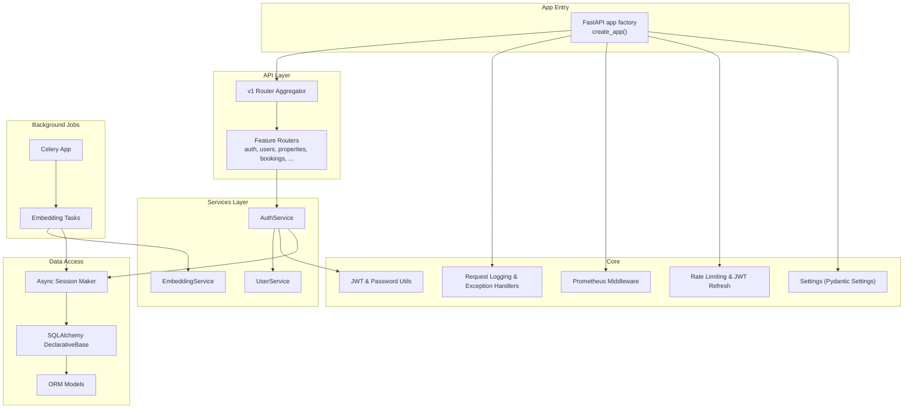

**Diagram sources**
- [main.py:17-78](file://backend/app/main.py#L17-L78)
- [router.py:1-23](file://backend/app/api/v1/router.py#L1-L23)
- [auth_service.py:14-77](file://backend/app/services/auth_service.py#L14-L77)
- [session.py:1-14](file://backend/app/db/session.py#L1-L14)
- [base.py:1-35](file://backend/app/db/base.py#L1-L35)
- [config.py:7-167](file://backend/app/core/config.py#L7-L167)
- [security.py:1-34](file://backend/app/core/security.py#L1-L34)
- [logging.py:124-231](file://backend/app/core/logging.py#L124-L231)
- [monitoring.py:126-176](file://backend/app/core/monitoring.py#L126-L176)
- [security_audit.py:49-95](file://backend/app/core/security_audit.py#L49-L95)
- [celery_app.py:9-31](file://backend/app/celery_app.py#L9-L31)
- [embedding_tasks.py:16-81](file://backend/app/tasks/embedding_tasks.py#L16-L81)

**Section sources**
- [main.py:17-78](file://backend/app/main.py#L17-L78)
- [router.py:1-23](file://backend/app/api/v1/router.py#L1-L23)
- [config.py:7-167](file://backend/app/core/config.py#L7-L167)
- [session.py:1-14](file://backend/app/db/session.py#L1-L14)
- [base.py:1-35](file://backend/app/db/base.py#L1-L35)

## Core Components
- Application Factory: create_app initializes settings, logging, CORS, metrics, rate limiting, exception handlers, mounts uploads, and includes v1 router.
- API Versioning: All endpoints are mounted under /api/v1 via a central router that aggregates feature-specific routers.
- Dependency Injection: FastAPI Depends provide AsyncSession, current user, and role-based guards to route handlers.
- Database Sessions: SQLAlchemy 2.0 async engine and sessionmaker configured from settings; Base class used by all models.
- Security: bcrypt password hashing, JWT creation/verification, refresh token support, and OWASP checklist utilities.
- Validation: Pydantic schemas define strict input/output contracts.
- Background Processing: Celery app configured with Redis broker/backend and task routing; tasks use asyncio + async engines.
- Observability: Prometheus middleware and signals collect HTTP and Celery metrics; structured JSON logging with sensitive field masking.

**Section sources**
- [main.py:17-78](file://backend/app/main.py#L17-L78)
- [router.py:1-23](file://backend/app/api/v1/router.py#L1-L23)
- [deps.py:14-57](file://backend/app/api/deps.py#L14-L57)
- [session.py:1-14](file://backend/app/db/session.py#L1-L14)
- [security.py:12-34](file://backend/app/core/security.py#L12-L34)
- [security_audit.py:49-149](file://backend/app/core/security_audit.py#L49-L149)
- [auth.py:8-63](file://backend/app/schemas/auth.py#L8-L63)
- [celery_app.py:9-31](file://backend/app/celery_app.py#L9-L31)
- [embedding_tasks.py:16-112](file://backend/app/tasks/embedding_tasks.py#L16-L112)
- [logging.py:77-122](file://backend/app/core/logging.py#L77-L122)
- [monitoring.py:126-176](file://backend/app/core/monitoring.py#L126-L176)

## Architecture Overview
High-level component interactions and data flows:

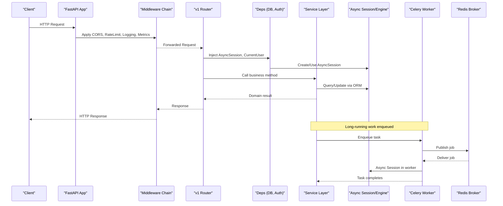

**Diagram sources**
- [main.py:17-78](file://backend/app/main.py#L17-L78)
- [router.py:1-23](file://backend/app/api/v1/router.py#L1-L23)
- [deps.py:14-57](file://backend/app/api/deps.py#L14-L57)
- [session.py:1-14](file://backend/app/db/session.py#L1-L14)
- [celery_app.py:9-31](file://backend/app/celery_app.py#L9-L31)
- [embedding_tasks.py:16-112](file://backend/app/tasks/embedding_tasks.py#L16-L112)

## Detailed Component Analysis

### Application Factory and Middleware Pipeline
- create_app loads settings, sets up logging, configures CORS based on environment, installs Prometheus middleware, conditionally adds Redis-backed rate limiter, registers global exception handlers, mounts /metrics, installs Celery metrics signals, includes v1 router, and mounts static uploads.
- Middleware order matters: logging wraps all requests; rate limiting is applied before request processing; metrics capture latency and counts.

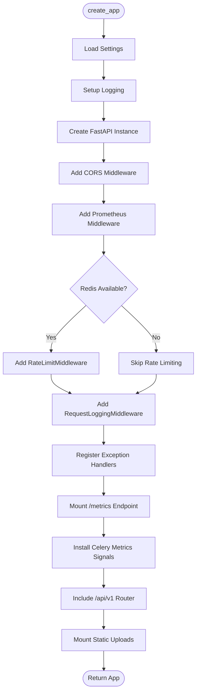

**Diagram sources**
- [main.py:17-78](file://backend/app/main.py#L17-L78)
- [monitoring.py:167-176](file://backend/app/core/monitoring.py#L167-L176)
- [security_audit.py:49-95](file://backend/app/core/security_audit.py#L49-L95)
- [logging.py:226-231](file://backend/app/core/logging.py#L226-L231)

**Section sources**
- [main.py:17-78](file://backend/app/main.py#L17-L78)
- [monitoring.py:126-176](file://backend/app/core/monitoring.py#L126-L176)
- [security_audit.py:49-95](file://backend/app/core/security_audit.py#L49-L95)
- [logging.py:124-231](file://backend/app/core/logging.py#L124-L231)

### API Versioning and Route Organization
- Central v1 router aggregates feature routers under consistent prefixes: auth, users, properties, images, bookings, notifications, chat, admin, import, wechat, ai-search, geo, contracts, payments, pois, map.
- Tags group endpoints for documentation and navigation.

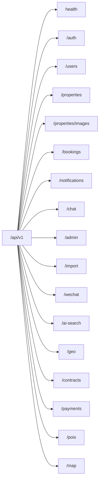

**Diagram sources**
- [router.py:1-23](file://backend/app/api/v1/router.py#L1-L23)

**Section sources**
- [router.py:1-23](file://backend/app/api/v1/router.py#L1-L23)

### Dependency Injection Pattern
- get_db_session provides an AsyncSession per request using async_session_maker.
- get_current_user validates bearer tokens and returns authenticated User.
- Role guards require_landlord, require_tenant, require_admin enforce authorization at route level.

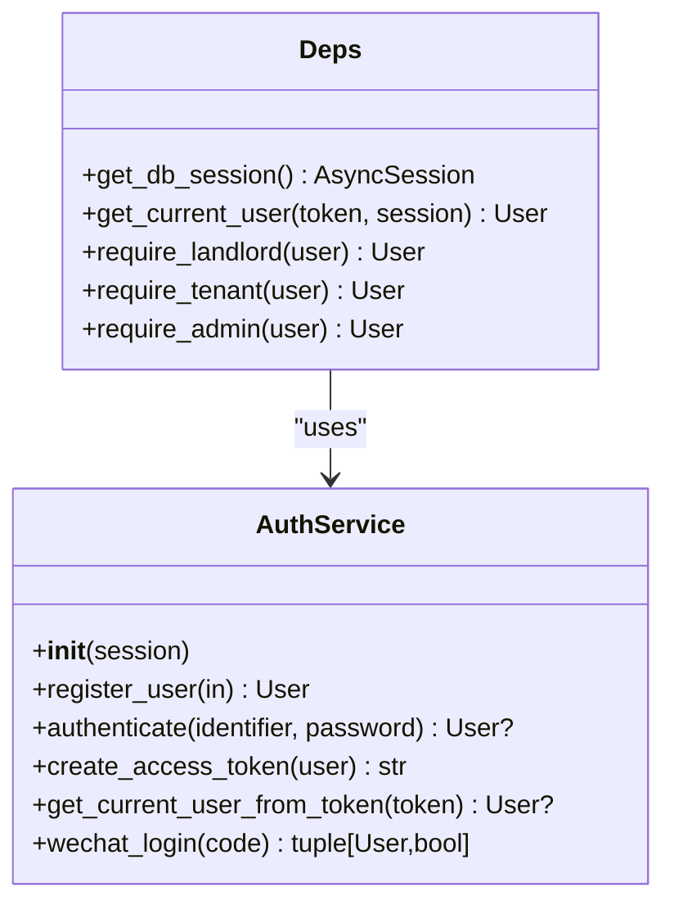

**Diagram sources**
- [deps.py:14-57](file://backend/app/api/deps.py#L14-L57)
- [auth_service.py:14-77](file://backend/app/services/auth_service.py#L14-L77)

**Section sources**
- [deps.py:14-57](file://backend/app/api/deps.py#L14-L57)
- [auth_service.py:14-77](file://backend/app/services/auth_service.py#L14-L77)

### Database Session Management (SQLAlchemy 2.0 Async)
- Engine created with async driver and echo controlled by debug flag.
- async_sessionmaker configured with expire_on_commit=False for predictable state after commits.
- Base class extends AsyncAttrs and DeclarativeBase; models inherit Base and TimestampMixin.

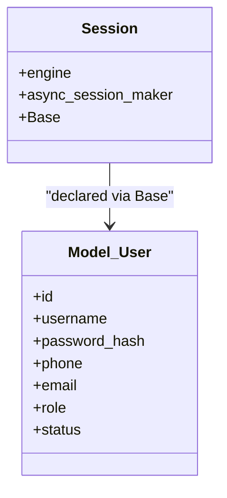

**Diagram sources**
- [session.py:1-14](file://backend/app/db/session.py#L1-L14)
- [base.py:1-35](file://backend/app/db/base.py#L1-L35)
- [user.py:24-48](file://backend/app/models/user.py#L24-L48)

**Section sources**
- [session.py:1-14](file://backend/app/db/session.py#L1-L14)
- [base.py:1-35](file://backend/app/db/base.py#L1-L35)
- [user.py:24-48](file://backend/app/models/user.py#L24-L48)

### Security Middleware and Authentication Flow
- Password hashing and verification via bcrypt.
- JWT access tokens with configurable expiry; refresh token flow supported.
- Rate limiting uses Redis sorted sets per client IP and endpoint prefix; development can bypass when debug enabled.
- Global exception handlers normalize errors and log with request context.

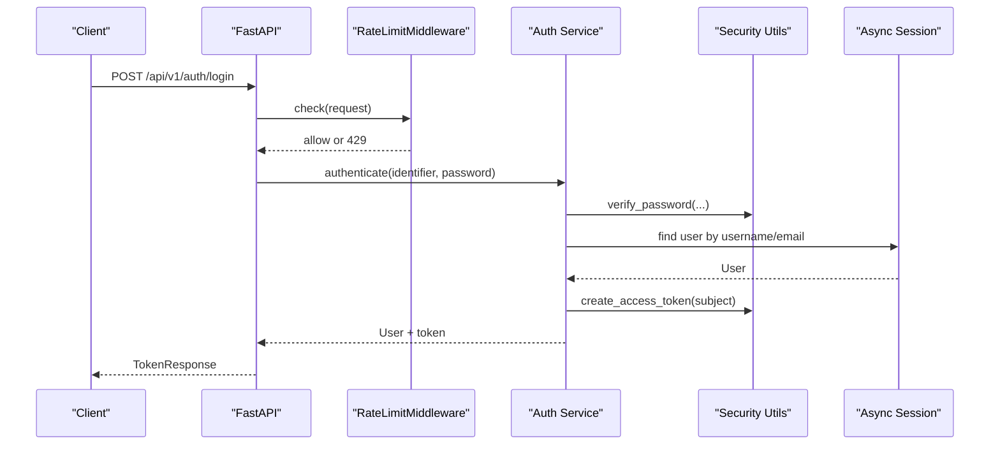

**Diagram sources**
- [security_audit.py:49-95](file://backend/app/core/security_audit.py#L49-L95)
- [auth_service.py:29-38](file://backend/app/services/auth_service.py#L29-L38)
- [security.py:12-34](file://backend/app/core/security.py#L12-L34)
- [deps.py:19-30](file://backend/app/api/deps.py#L19-L30)
- [logging.py:193-231](file://backend/app/core/logging.py#L193-L231)

**Section sources**
- [security.py:12-34](file://backend/app/core/security.py#L12-L34)
- [security_audit.py:49-149](file://backend/app/core/security_audit.py#L49-L149)
- [auth_service.py:29-51](file://backend/app/services/auth_service.py#L29-L51)
- [logging.py:193-231](file://backend/app/core/logging.py#L193-L231)

### Request/Response Validation with Pydantic
- Schemas define strict inputs (e.g., RegisterRequest, LoginRequest) and outputs (CurrentUserResponse).
- Validators include min/max lengths, email format, enum constraints, and computed fields.
- Validation errors are normalized by global handler into a consistent error envelope.

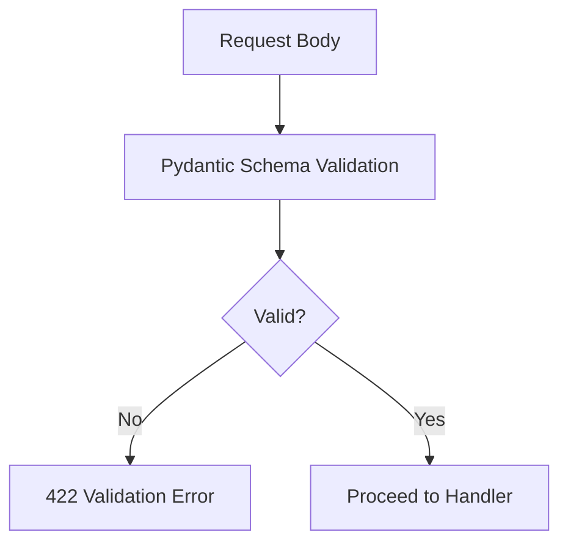

**Diagram sources**
- [auth.py:8-63](file://backend/app/schemas/auth.py#L8-L63)
- [logging.py:193-202](file://backend/app/core/logging.py#L193-L202)

**Section sources**
- [auth.py:8-63](file://backend/app/schemas/auth.py#L8-L63)
- [logging.py:193-202](file://backend/app/core/logging.py#L193-L202)

### Celery Task Queue Integration
- Celery app configured with Redis broker/backend and task serialization.
- Task routing assigns specific queues (e.g., embedding, import).
- Tasks manage their own async engines and sessions; they track job status and handle retries/backoff.

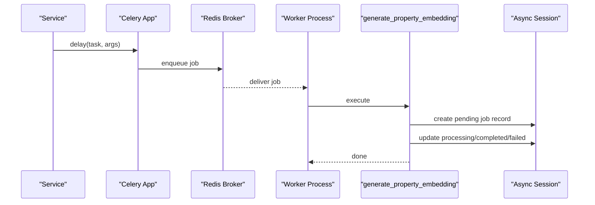

**Diagram sources**
- [celery_app.py:9-31](file://backend/app/celery_app.py#L9-L31)
- [embedding_tasks.py:16-112](file://backend/app/tasks/embedding_tasks.py#L16-L112)

**Section sources**
- [celery_app.py:9-31](file://backend/app/celery_app.py#L9-L31)
- [embedding_tasks.py:16-112](file://backend/app/tasks/embedding_tasks.py#L16-L112)

### Error Handling Strategy
- Global handlers for validation, HTTP exceptions, and unhandled exceptions produce a uniform JSON error structure.
- Structured logging captures request_id, method, path, status_code, duration_ms, and optional user_id.
- Sensitive fields are masked in logs to prevent leakage.

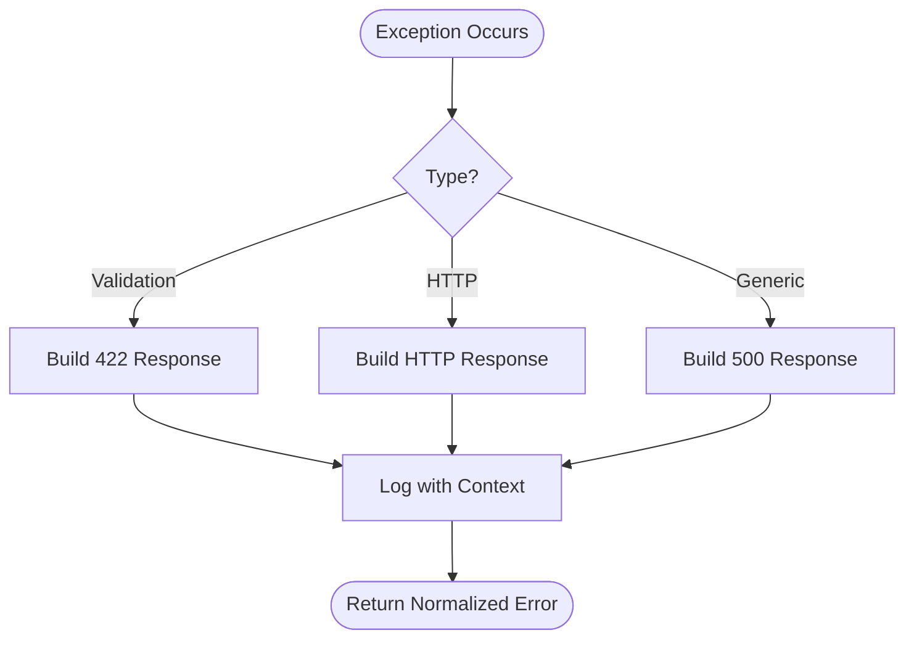

**Diagram sources**
- [logging.py:170-231](file://backend/app/core/logging.py#L170-L231)

**Section sources**
- [logging.py:170-231](file://backend/app/core/logging.py#L170-L231)

## Dependency Analysis
Key dependencies and relationships:

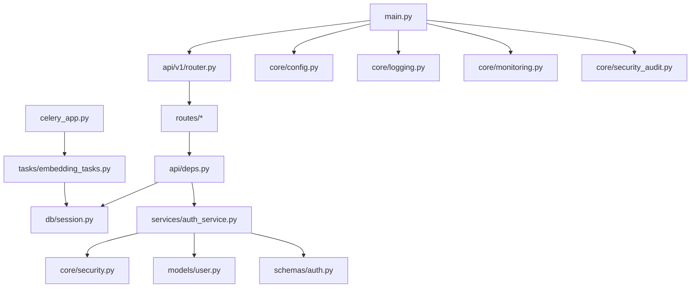

**Diagram sources**
- [main.py:17-78](file://backend/app/main.py#L17-L78)
- [router.py:1-23](file://backend/app/api/v1/router.py#L1-L23)
- [deps.py:14-57](file://backend/app/api/deps.py#L14-L57)
- [session.py:1-14](file://backend/app/db/session.py#L1-L14)
- [auth_service.py:14-77](file://backend/app/services/auth_service.py#L14-L77)
- [security.py:12-34](file://backend/app/core/security.py#L12-L34)
- [user.py:24-48](file://backend/app/models/user.py#L24-L48)
- [auth.py:8-63](file://backend/app/schemas/auth.py#L8-L63)
- [celery_app.py:9-31](file://backend/app/celery_app.py#L9-L31)
- [embedding_tasks.py:16-112](file://backend/app/tasks/embedding_tasks.py#L16-L112)

**Section sources**
- [main.py:17-78](file://backend/app/main.py#L17-L78)
- [router.py:1-23](file://backend/app/api/v1/router.py#L1-L23)
- [deps.py:14-57](file://backend/app/api/deps.py#L14-L57)
- [session.py:1-14](file://backend/app/db/session.py#L1-L14)
- [auth_service.py:14-77](file://backend/app/services/auth_service.py#L14-L77)
- [security.py:12-34](file://backend/app/core/security.py#L12-L34)
- [user.py:24-48](file://backend/app/models/user.py#L24-L48)
- [auth.py:8-63](file://backend/app/schemas/auth.py#L8-L63)
- [celery_app.py:9-31](file://backend/app/celery_app.py#L9-L31)
- [embedding_tasks.py:16-112](file://backend/app/tasks/embedding_tasks.py#L16-L112)

## Performance Considerations
- Connection Pooling: Use appropriate pool size and overflow limits for asyncpg; monitor pool gauges exposed by Prometheus middleware.
- Asynchronous I/O: Keep DB calls non-blocking; avoid blocking operations in request handlers.
- Rate Limiting: Tune window and max_requests based on expected traffic; consider per-endpoint policies if needed.
- Background Jobs: Offload long-running tasks (embeddings, imports) to Celery workers; scale workers horizontally.
- Caching: Consider caching frequent reads (e.g., property listings) behind Redis where appropriate.
- Metrics: Track request latency histograms and Celery task durations to identify bottlenecks.

## Troubleshooting Guide
- Authentication Failures: Check JWT secret and algorithm settings; ensure tokens are not expired; verify user status is active.
- Rate Limit Errors: Inspect Redis connectivity and keys; confirm environment/debug flags; adjust limits if necessary.
- Validation Errors: Review Pydantic schema constraints and request payloads; consult normalized error responses.
- Database Issues: Verify connection string, pool metrics, and migrations; ensure models are imported via base module.
- Celery Problems: Confirm broker/backend URLs, task routing, and worker logs; inspect job status records.

**Section sources**
- [security.py:22-34](file://backend/app/core/security.py#L22-L34)
- [security_audit.py:49-95](file://backend/app/core/security_audit.py#L49-L95)
- [logging.py:193-231](file://backend/app/core/logging.py#L193-L231)
- [session.py:1-14](file://backend/app/db/session.py#L1-L14)
- [celery_app.py:9-31](file://backend/app/celery_app.py#L9-L31)
- [embedding_tasks.py:16-112](file://backend/app/tasks/embedding_tasks.py#L16-L112)

## Conclusion
The backend employs a clean layered architecture with explicit separation between API routes, services, models, and core utilities. The application factory centralizes middleware and configuration, while dependency injection ensures testable and composable components. SQLAlchemy 2.0 async patterns and Redis-backed rate limiting and Celery integration enable scalable, observable operations. Strong validation and standardized error handling improve reliability and developer experience.

## Appendices

### Infrastructure Requirements
- Python runtime and virtual environment
- PostgreSQL with async driver (asyncpg)
- Redis for rate limiting, Celery broker/backend, and optional caching
- Optional: prometheus-client for metrics collection

### Scalability Considerations
- Horizontal scaling of FastAPI instances behind a reverse proxy/load balancer
- Multiple Celery workers per queue for heavy workloads
- Database read replicas for query-heavy features
- External object storage for uploads instead of local filesystem

### Deployment Topology
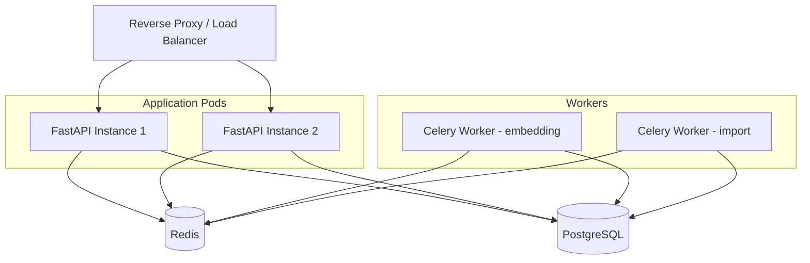