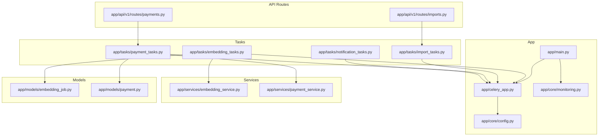
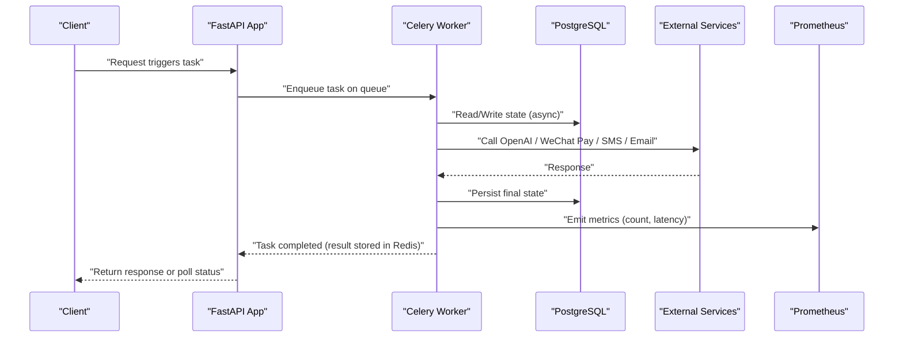
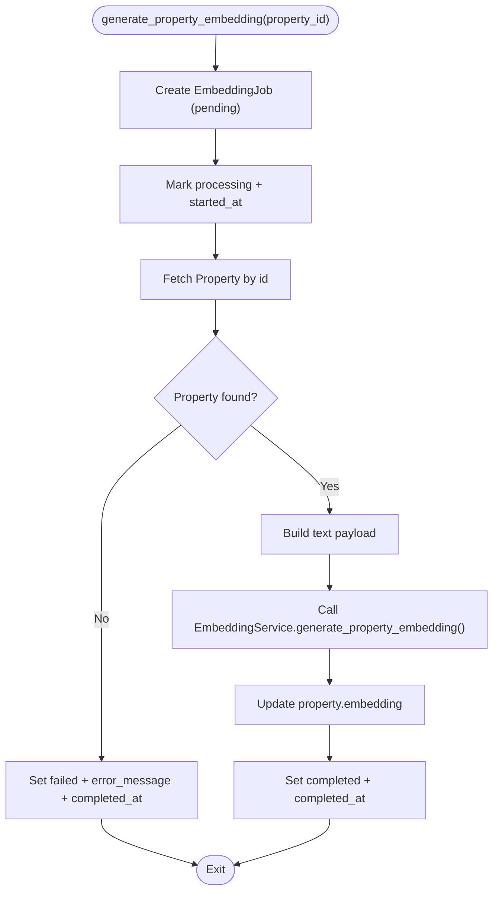
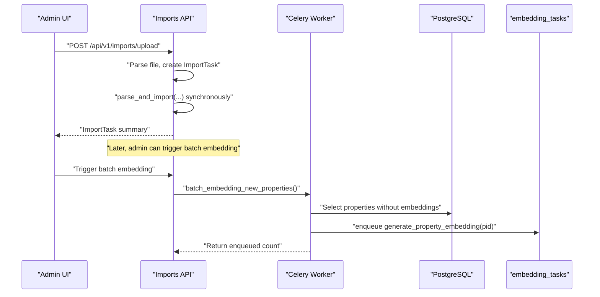
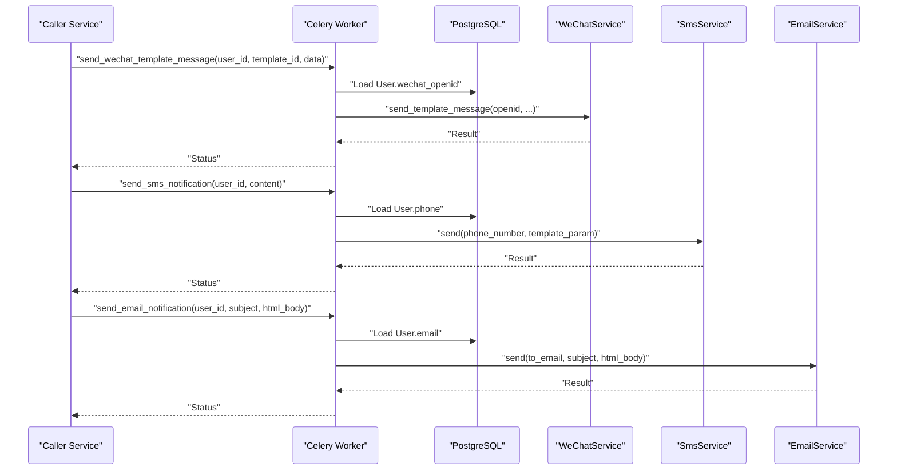
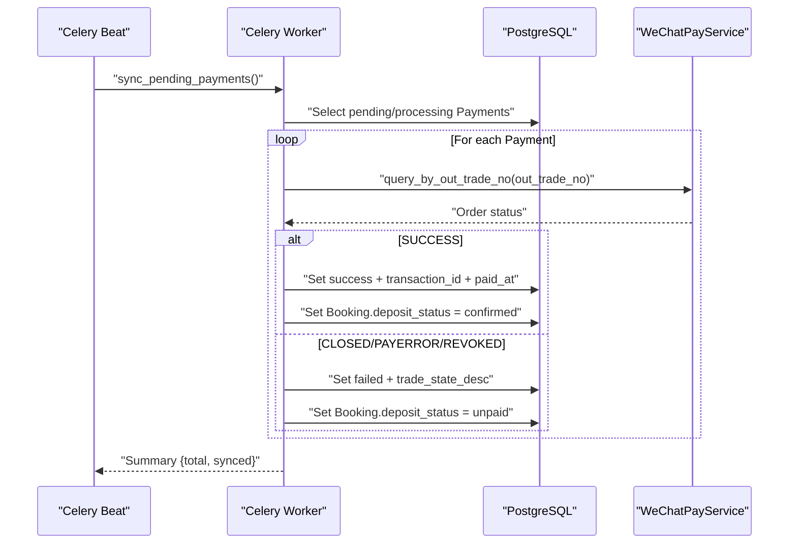
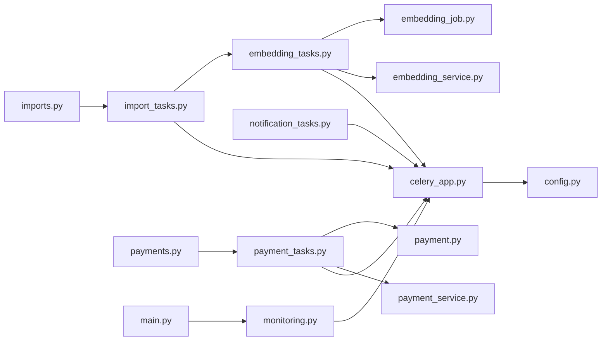

# Background Processing & Tasks

<cite>
**Referenced Files in This Document**
- [celery_app.py](file://backend/app/celery_app.py)
- [embedding_tasks.py](file://backend/app/tasks/embedding_tasks.py)
- [import_tasks.py](file://backend/app/tasks/import_tasks.py)
- [notification_tasks.py](file://backend/app/tasks/notification_tasks.py)
- [payment_tasks.py](file://backend/app/tasks/payment_tasks.py)
- [config.py](file://backend/app/core/config.py)
- [monitoring.py](file://backend/app/core/monitoring.py)
- [main.py](file://backend/app/main.py)
- [embedding_service.py](file://backend/app/services/embedding_service.py)
- [payment_service.py](file://backend/app/services/payment_service.py)
- [embedding_job.py](file://backend/app/models/embedding_job.py)
- [payment.py](file://backend/app/models/payment.py)
- [imports.py](file://backend/app/api/v1/routes/imports.py)
- [payments.py](file://backend/app/api/v1/routes/payments.py)
</cite>

## Table of Contents
1. [Introduction](#introduction)
2. [Project Structure](#project-structure)
3. [Core Components](#core-components)
4. [Architecture Overview](#architecture-overview)
5. [Detailed Component Analysis](#detailed-component-analysis)
6. [Dependency Analysis](#dependency-analysis)
7. [Performance Considerations](#performance-considerations)
8. [Troubleshooting Guide](#troubleshooting-guide)
9. [Conclusion](#conclusion)
10. [Appendices](#appendices)

## Introduction
This document explains the Celery-based background task processing system used by the application. It covers the Celery application setup, worker configuration, and queue routing; task implementations for AI embedding generation, bulk data import orchestration, notification dispatch (WeChat template messages, SMS, email), and payment processing synchronization; scheduling via Celery Beat; retry mechanisms; error handling; monitoring with Prometheus metrics and Flower dashboard guidance; result tracking and progress reporting; timeout management; scalability and resource management; and practical examples for creating new tasks, handling long-running operations, and debugging failures.

## Project Structure
The background processing subsystem is organized under backend/app:
- Celery app initialization and configuration
- Task modules grouped by domain (embedding, import, notification, payment)
- Services that encapsulate external integrations (OpenAI embeddings, WeChat Pay, SMS, Email)
- Models for job and payment state persistence
- API routes that trigger or coordinate background work
- Monitoring integration for Celery signals and metrics

**Diagram sources**
- [main.py:1-20](file://backend/app/main.py#L1-L20)
- [celery_app.py:1-31](file://backend/app/celery_app.py#L1-L31)
- [config.py:1-167](file://backend/app/core/config.py#L1-L167)
- [monitoring.py:178-213](file://backend/app/core/monitoring.py#L178-L213)
- [embedding_tasks.py:1-112](file://backend/app/tasks/embedding_tasks.py#L1-L112)
- [import_tasks.py:1-44](file://backend/app/tasks/import_tasks.py#L1-L44)
- [notification_tasks.py:1-217](file://backend/app/tasks/notification_tasks.py#L1-L217)
- [payment_tasks.py:1-241](file://backend/app/tasks/payment_tasks.py#L1-L241)
- [embedding_service.py:1-32](file://backend/app/services/embedding_service.py#L1-L32)
- [payment_service.py:1-445](file://backend/app/services/payment_service.py#L1-L445)
- [embedding_job.py:1-35](file://backend/app/models/embedding_job.py#L1-L35)
- [payment.py:1-34](file://backend/app/models/payment.py#L1-L34)
- [imports.py:1-194](file://backend/app/api/v1/routes/imports.py#L1-L194)
- [payments.py:1-85](file://backend/app/api/v1/routes/payments.py#L1-L85)

**Section sources**
- [celery_app.py:1-31](file://backend/app/celery_app.py#L1-L31)
- [config.py:1-167](file://backend/app/core/config.py#L1-L167)
- [monitoring.py:178-213](file://backend/app/core/monitoring.py#L178-L213)
- [main.py:1-20](file://backend/app/main.py#L1-L20)

## Core Components
- Celery Application and Broker/Backend
  - The Celery app is configured with a Redis broker and result backend using settings from environment variables.
  - Timezone and serialization are set to JSON with UTC enabled.
  - Connection timeouts and eager mode toggles are exposed via environment variables for development/testing.
  - Task routing maps specific task prefixes to dedicated queues (e.g., embedding, import).

- Task Modules
  - Embedding tasks: generate per-property embeddings and batch reindex jobs.
  - Import tasks: orchestrate batch embedding for properties missing embeddings.
  - Notification tasks: send WeChat template messages, SMS, and emails asynchronously.
  - Payment tasks: sync pending payments, close expired orders, and notify users about payment results.

- Services and Models
  - EmbeddingService wraps async OpenAI embeddings.
  - WeChatPayService implements JSAPI order creation, query, close, refund, and callback parsing.
  - EmbeddingJob model tracks status and timestamps for embedding jobs.
  - Payment model stores transaction details and status.

- Monitoring
  - Celery signal handlers install Prometheus metrics for task counts and latency.
  - Metrics endpoint is added to the FastAPI app.

**Section sources**
- [celery_app.py:1-31](file://backend/app/celery_app.py#L1-L31)
- [embedding_tasks.py:1-112](file://backend/app/tasks/embedding_tasks.py#L1-L112)
- [import_tasks.py:1-44](file://backend/app/tasks/import_tasks.py#L1-L44)
- [notification_tasks.py:1-217](file://backend/app/tasks/notification_tasks.py#L1-L217)
- [payment_tasks.py:1-241](file://backend/app/tasks/payment_tasks.py#L1-L241)
- [embedding_service.py:1-32](file://backend/app/services/embedding_service.py#L1-L32)
- [payment_service.py:1-445](file://backend/app/services/payment_service.py#L1-L445)
- [embedding_job.py:1-35](file://backend/app/models/embedding_job.py#L1-L35)
- [payment.py:1-34](file://backend/app/models/payment.py#L1-L34)
- [monitoring.py:178-213](file://backend/app/core/monitoring.py#L178-L213)
- [main.py:1-20](file://backend/app/main.py#L1-L20)

## Architecture Overview
The system uses Celery workers to execute long-running or I/O-bound tasks off the request path. Tasks interact with databases via async SQLAlchemy engines created within each task execution context, call external services (OpenAI, WeChat Pay, SMS, Email), and persist state changes back to the database. Monitoring hooks record task performance metrics.

**Diagram sources**
- [celery_app.py:1-31](file://backend/app/celery_app.py#L1-L31)
- [embedding_tasks.py:1-112](file://backend/app/tasks/embedding_tasks.py#L1-L112)
- [payment_tasks.py:1-241](file://backend/app/tasks/payment_tasks.py#L1-L241)
- [monitoring.py:178-213](file://backend/app/core/monitoring.py#L178-L213)

## Detailed Component Analysis

### Celery Application Setup and Configuration
- Broker and Backend: Redis URL provided by settings.
- Serialization: JSON for both task and result payloads.
- Timezone: Asia/Shanghai with UTC enabled.
- Connection behavior: Short timeout and no retries on startup; eager mode toggleable via environment variables.
- Routing: Dedicated queues for embedding and import tasks.

Operational notes:
- Use separate queues to scale workers independently for CPU-heavy vs I/O-heavy workloads.
- Enable eager mode only in tests or local dev.

**Section sources**
- [celery_app.py:1-31](file://backend/app/celery_app.py#L1-L31)
- [config.py:1-167](file://backend/app/core/config.py#L1-L167)

### Embedding Generation Tasks
Responsibilities:
- Create an EmbeddingJob record with pending status.
- Mark as processing, fetch property data, generate vector embedding via OpenAI, update property embedding, mark job completed.
- Handle errors by marking job failed and logging exceptions.
- Batch reindex: find all properties without embeddings and enqueue individual embedding tasks.

Key behaviors:
- Each task creates its own async engine and session scoped to the task lifecycle.
- Uses asyncio.run to execute async logic inside synchronous Celery tasks.
- Retries automatically on exceptions with exponential backoff and max retries.

**Diagram sources**
- [embedding_tasks.py:1-112](file://backend/app/tasks/embedding_tasks.py#L1-L112)
- [embedding_service.py:1-32](file://backend/app/services/embedding_service.py#L1-L32)
- [embedding_job.py:1-35](file://backend/app/models/embedding_job.py#L1-L35)

**Section sources**
- [embedding_tasks.py:1-112](file://backend/app/tasks/embedding_tasks.py#L1-L112)
- [embedding_service.py:1-32](file://backend/app/services/embedding_service.py#L1-L32)
- [embedding_job.py:1-35](file://backend/app/models/embedding_job.py#L1-L35)

### Bulk Data Import Orchestration
Responsibilities:
- Identify properties missing embeddings and enqueue them for processing.
- Return count of enqueued items for caller visibility.

Integration points:
- Calls into embedding task module to schedule per-property jobs.
- Uses async engine/session to query properties.

**Diagram sources**
- [imports.py:1-194](file://backend/app/api/v1/routes/imports.py#L1-L194)
- [import_tasks.py:1-44](file://backend/app/tasks/import_tasks.py#L1-L44)
- [embedding_tasks.py:1-112](file://backend/app/tasks/embedding_tasks.py#L1-L112)

**Section sources**
- [import_tasks.py:1-44](file://backend/app/tasks/import_tasks.py#L1-L44)
- [imports.py:1-194](file://backend/app/api/v1/routes/imports.py#L1-L194)

### Notification Dispatching Tasks
Responsibilities:
- Send WeChat template messages to users with openids.
- Send SMS notifications to users with phone numbers.
- Send email notifications to users with email addresses.
- Provide convenience tasks for booking confirmations and reminders.

Key behaviors:
- Each task loads user contact info from DB, then calls respective service.
- Skips sending if required contact info is missing and logs reasons.
- All tasks support auto-retry with backoff.

**Diagram sources**
- [notification_tasks.py:1-217](file://backend/app/tasks/notification_tasks.py#L1-L217)

**Section sources**
- [notification_tasks.py:1-217](file://backend/app/tasks/notification_tasks.py#L1-L217)

### Payment Processing Tasks
Responsibilities:
- Periodically sync pending/processing payments with WeChat Pay and update local state.
- Close expired pending payments and revert associated booking deposit status.
- Send payment result notifications to users via WeChat template messages.

Key behaviors:
- Uses WeChatPayService to query order status and close orders.
- Updates Payment and related Booking records atomically within a single session.
- Handles exceptions per payment to avoid failing entire batch.

**Diagram sources**
- [payment_tasks.py:1-241](file://backend/app/tasks/payment_tasks.py#L1-L241)
- [payment_service.py:1-445](file://backend/app/services/payment_service.py#L1-L445)
- [payment.py:1-34](file://backend/app/models/payment.py#L1-L34)

**Section sources**
- [payment_tasks.py:1-241](file://backend/app/tasks/payment_tasks.py#L1-L241)
- [payment_service.py:1-445](file://backend/app/services/payment_service.py#L1-L445)
- [payment.py:1-34](file://backend/app/models/payment.py#L1-L34)

### Monitoring and Observability
- Celery metrics: Signal handlers track task prerun/postrun to increment counters and observe latencies.
- Integration: Metrics are installed during app startup and exposed via a Prometheus endpoint.

Operational guidance:
- Ensure Celery workers run with the same app module so signals are registered.
- Use Flower for real-time monitoring of queues, workers, and task history.

**Section sources**
- [monitoring.py:178-213](file://backend/app/core/monitoring.py#L178-L213)
- [main.py:1-20](file://backend/app/main.py#L1-L20)

## Dependency Analysis
High-level dependencies between components:

**Diagram sources**
- [celery_app.py:1-31](file://backend/app/celery_app.py#L1-L31)
- [config.py:1-167](file://backend/app/core/config.py#L1-L167)
- [embedding_tasks.py:1-112](file://backend/app/tasks/embedding_tasks.py#L1-L112)
- [embedding_service.py:1-32](file://backend/app/services/embedding_service.py#L1-L32)
- [embedding_job.py:1-35](file://backend/app/models/embedding_job.py#L1-L35)
- [import_tasks.py:1-44](file://backend/app/tasks/import_tasks.py#L1-L44)
- [notification_tasks.py:1-217](file://backend/app/tasks/notification_tasks.py#L1-L217)
- [payment_tasks.py:1-241](file://backend/app/tasks/payment_tasks.py#L1-L241)
- [payment_service.py:1-445](file://backend/app/services/payment_service.py#L1-L445)
- [payment.py:1-34](file://backend/app/models/payment.py#L1-L34)
- [imports.py:1-194](file://backend/app/api/v1/routes/imports.py#L1-L194)
- [payments.py:1-85](file://backend/app/api/v1/routes/payments.py#L1-L85)
- [main.py:1-20](file://backend/app/main.py#L1-L20)
- [monitoring.py:178-213](file://backend/app/core/monitoring.py#L178-L213)

**Section sources**
- [celery_app.py:1-31](file://backend/app/celery_app.py#L1-L31)
- [embedding_tasks.py:1-112](file://backend/app/tasks/embedding_tasks.py#L1-L112)
- [import_tasks.py:1-44](file://backend/app/tasks/import_tasks.py#L1-L44)
- [notification_tasks.py:1-217](file://backend/app/tasks/notification_tasks.py#L1-L217)
- [payment_tasks.py:1-241](file://backend/app/tasks/payment_tasks.py#L1-L241)
- [monitoring.py:178-213](file://backend/app/core/monitoring.py#L178-L213)

## Performance Considerations
- Queue isolation: Route heavy tasks (embeddings) to dedicated queues to prevent contention with fast I/O tasks (notifications).
- Concurrency: Tune worker concurrency based on CPU-bound vs I/O-bound tasks. Embedding tasks may benefit from lower concurrency due to external API limits.
- Database connections: Each task opens its own async engine and session; ensure connection pool sizes match expected concurrent tasks.
- External rate limits: Respect OpenAI and WeChat Pay rate limits; consider adding throttling or circuit breakers at the service layer.
- Result backend: Keep Redis memory usage reasonable by configuring result expiration and avoiding storing large payloads.
- Monitoring: Use Prometheus metrics and Flower dashboards to identify bottlenecks and adjust scaling accordingly.

[No sources needed since this section provides general guidance]

## Troubleshooting Guide
Common issues and remedies:
- Task not executing:
  - Verify workers are running and subscribed to the correct queues.
  - Check broker connectivity and credentials.
- Frequent retries:
  - Inspect task logs for exceptions; ensure transient errors are handled appropriately.
  - Adjust max_retries and backoff parameters if necessary.
- Long-running tasks timing out:
  - Configure task time limits and worker soft/hard timeouts.
  - Break large jobs into smaller chunks and use chaining or grouping patterns.
- Missing results:
  - Confirm result backend is reachable and results are not expiring prematurely.
- Monitoring gaps:
  - Ensure Celery metrics installation runs at startup and metrics endpoint is accessible.

Practical checks:
- Review Celery logs for prerun/postrun metric emissions.
- Validate that task routing matches declared task names and queues.
- Confirm environment variables for Redis, database URLs, and external service keys.

**Section sources**
- [monitoring.py:178-213](file://backend/app/core/monitoring.py#L178-L213)
- [celery_app.py:1-31](file://backend/app/celery_app.py#L1-L31)

## Conclusion
The Celery-based background processing system cleanly separates long-running work from request handling, providing robust retry semantics, clear state persistence, and observability through Prometheus metrics. Domain-specific tasks cover AI embedding generation, import orchestration, multi-channel notifications, and payment synchronization. With proper queue routing, worker scaling, and monitoring, the system supports scalable and reliable operation across diverse workloads.

[No sources needed since this section summarizes without analyzing specific files]

## Appendices

### Creating New Tasks
- Define a new function decorated with the Celery app’s task decorator.
- Add autoretry_for, retry_backoff, and max_retries as appropriate.
- If the task performs async I/O, wrap it in asyncio.run within the task body.
- Optionally route to a dedicated queue by updating task_routes in the Celery config.

Example references:
- See existing task definitions for patterns and structure.

**Section sources**
- [embedding_tasks.py:1-112](file://backend/app/tasks/embedding_tasks.py#L1-L112)
- [notification_tasks.py:1-217](file://backend/app/tasks/notification_tasks.py#L1-L217)
- [payment_tasks.py:1-241](file://backend/app/tasks/payment_tasks.py#L1-L241)
- [celery_app.py:1-31](file://backend/app/celery_app.py#L1-L31)

### Handling Long-Running Operations
- Chunk large datasets and enqueue multiple small tasks.
- Track progress via persistent models (e.g., EmbeddingJob) and expose endpoints to query status.
- Use Celery Beat for periodic aggregation or cleanup tasks.

Example references:
- Batch embedding orchestrator and per-property embedding tasks.

**Section sources**
- [import_tasks.py:1-44](file://backend/app/tasks/import_tasks.py#L1-L44)
- [embedding_tasks.py:1-112](file://backend/app/tasks/embedding_tasks.py#L1-L112)
- [embedding_job.py:1-35](file://backend/app/models/embedding_job.py#L1-L35)

### Debugging Task Failures
- Inspect task logs for stack traces and error messages.
- Check result backend for failure states and error payloads.
- Use Flower to visualize task history, retries, and durations.
- Validate external service responses and credentials.

**Section sources**
- [monitoring.py:178-213](file://backend/app/core/monitoring.py#L178-L213)
- [celery_app.py:1-31](file://backend/app/celery_app.py#L1-L31)