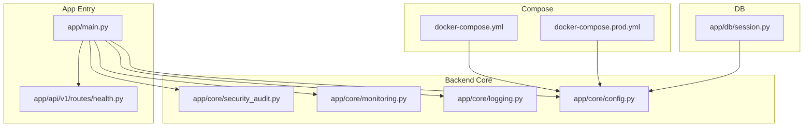
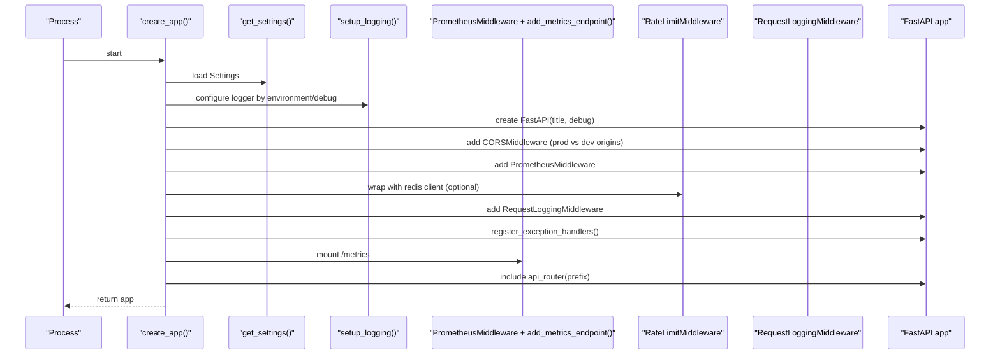
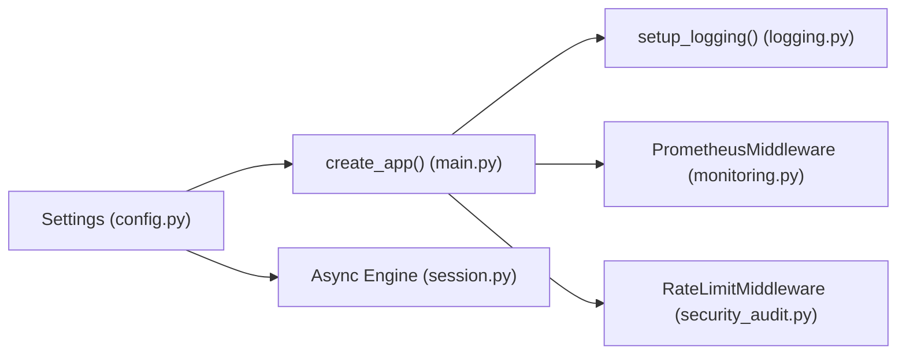

# Configuration & Environment Management

<cite>
**Referenced Files in This Document**
- [config.py](file://backend/app/core/config.py)
- [logging.py](file://backend/app/core/logging.py)
- [monitoring.py](file://backend/app/core/monitoring.py)
- [main.py](file://backend/app/main.py)
- [health.py](file://backend/app/api/v1/routes/health.py)
- [session.py](file://backend/app/db/session.py)
- [security_audit.py](file://backend/app/core/security_audit.py)
- [docker-compose.yml](file://docker-compose.yml)
- [docker-compose.prod.yml](file://docker-compose.prod.yml)
- [DEPLOYMENT.md](file://DEPLOYMENT.md)
</cite>

## Table of Contents
1. [Introduction](#introduction)
2. [Project Structure](#project-structure)
3. [Core Components](#core-components)
4. [Architecture Overview](#architecture-overview)
5. [Detailed Component Analysis](#detailed-component-analysis)
6. [Dependency Analysis](#dependency-analysis)
7. [Performance Considerations](#performance-considerations)
8. [Troubleshooting Guide](#troubleshooting-guide)
9. [Conclusion](#conclusion)
10. [Appendices](#appendices)

## Introduction
This document explains the configuration management and environment setup system for the backend service. It covers:
- Centralized configuration using Pydantic settings with environment variable overrides, type validation, and defaults
- Logging configuration with structured logging, request/response middleware, and environment-aware log levels
- Monitoring setup including Prometheus metrics collection, a health check endpoint, and performance profiling hooks
- Environment-specific configurations for development, staging, and production deployments
- Secrets management, configuration validation, and deployment-specific settings
- Practical examples for adding new configuration options and troubleshooting common issues

## Project Structure
The configuration and environment-related components are primarily located under the backend core package and compose files at the repository root. The FastAPI application wires these components during startup.

**Diagram sources**
- [main.py:17-78](file://backend/app/main.py#L17-L78)
- [config.py:7-166](file://backend/app/core/config.py#L7-L166)
- [logging.py:77-101](file://backend/app/core/logging.py#L77-L101)
- [monitoring.py:126-175](file://backend/app/core/monitoring.py#L126-L175)
- [health.py:6-8](file://backend/app/api/v1/routes/health.py#L6-L8)
- [session.py:6-9](file://backend/app/db/session.py#L6-L9)
- [docker-compose.yml:1-53](file://docker-compose.yml#L1-L53)
- [docker-compose.prod.yml:65-99](file://docker-compose.prod.yml#L65-L99)

**Section sources**
- [main.py:17-78](file://backend/app/main.py#L17-L78)
- [config.py:7-166](file://backend/app/core/config.py#L7-L166)
- [docker-compose.yml:1-53](file://docker-compose.yml#L1-L53)
- [docker-compose.prod.yml:65-99](file://docker-compose.prod.yml#L65-L99)

## Core Components
- Centralized Settings (Pydantic): A single source of truth for all runtime configuration, loaded from environment variables with strong typing and defaults.
- Logging: Structured JSON logs in production, colored console logs in development; request logging middleware and global exception handlers.
- Monitoring: Optional Prometheus metrics via middleware and an exposed /metrics endpoint; Celery task metrics; DB pool gauges.
- Health Check: Simple readiness probe endpoint.
- Rate Limiting: Redis-backed token-bucket limiter integrated as middleware.
- Database Session: Async engine created from centralized settings.

Key responsibilities:
- config.py defines typed fields, env aliases, and defaults; cached singleton access via get_settings().
- logging.py sets up formatters and middleware based on environment and debug flags.
- monitoring.py provides no-op-safe metrics when prometheus-client is absent and exposes /metrics.
- main.py wires middleware, CORS, rate limiting, metrics, and routers.
- health.py exposes a minimal health endpoint.
- session.py constructs async database engine from settings.
- security_audit.py implements rate limiting and JWT refresh utilities that depend on settings.

**Section sources**
- [config.py:7-166](file://backend/app/core/config.py#L7-L166)
- [logging.py:77-101](file://backend/app/core/logging.py#L77-L101)
- [monitoring.py:126-175](file://backend/app/core/monitoring.py#L126-L175)
- [main.py:17-78](file://backend/app/main.py#L17-L78)
- [health.py:6-8](file://backend/app/api/v1/routes/health.py#L6-L8)
- [session.py:6-9](file://backend/app/db/session.py#L6-L9)
- [security_audit.py:49-94](file://backend/app/core/security_audit.py#L49-L94)

## Architecture Overview
The application bootstraps configuration first, then initializes logging, registers middleware (CORS, Prometheus, rate limiting, request logging), mounts the metrics endpoint, and includes API routers.

**Diagram sources**
- [main.py:17-78](file://backend/app/main.py#L17-L78)
- [config.py:7-166](file://backend/app/core/config.py#L7-L166)
- [monitoring.py:126-175](file://backend/app/core/monitoring.py#L126-L175)
- [logging.py:77-101](file://backend/app/core/logging.py#L77-L101)

## Detailed Component Analysis

### Centralized Configuration (Pydantic Settings)
- Single class encapsulates all configuration with typed fields, default values, and environment variable aliases.
- Cached singleton via lru_cache to avoid repeated parsing.
- Supports .env file loading and ignores unknown extra keys.
- Covers databases (async and alembic), Redis, auth tokens, CORS, AI providers (OpenAI, DeepSeek), map services (AMap), uploads, WeChat, SMS, email, rate limiting, and more.

Environment-driven behavior:
- environment and debug control logging verbosity and rate limiting behavior.
- Production toggles stricter CORS and structured logging.

Adding a new configuration option:
- Add a typed field with a sensible default and a validation_alias mapping to an environment variable name.
- Optionally add custom validation logic if needed.
- Use get_settings() throughout the codebase to read it.

Validation and secrets:
- Types enforce basic validation (e.g., int, bool).
- Sensitive fields should be provided via environment variables or secret managers; avoid hardcoding secrets.

Example references:
- Field definitions and aliases
- Cached accessor function

**Section sources**
- [config.py:7-166](file://backend/app/core/config.py#L7-L166)

### Logging Configuration
- Environment-aware setup:
  - Development: colored console output, DEBUG level.
  - Production: structured JSON to stdout, INFO level, quieter third-party loggers.
- Request logging middleware attaches request_id, method, path, status_code, duration_ms, and optional user_id.
- Global exception handlers normalize error responses and log context.
- Sensitive data masking utility available for safe logging.

Operational notes:
- Ensure Docker logging drivers rotate logs in production.
- For containerized environments, prefer stdout for structured logs.

**Section sources**
- [logging.py:77-101](file://backend/app/core/logging.py#L77-L101)
- [logging.py:124-167](file://backend/app/core/logging.py#L124-L167)
- [logging.py:170-231](file://backend/app/core/logging.py#L170-L231)
- [docker-compose.prod.yml:94-98](file://docker-compose.prod.yml#L94-L98)

### Monitoring Setup (Prometheus, Health, Profiling Hooks)
- Prometheus metrics:
  - HTTP counters, histograms, and in-flight gauge via middleware.
  - Celery task count and latency signals.
  - DB pool size, overflow, and checked-out gauges.
  - No-op fallback when prometheus-client is not installed.
- Metrics endpoint:
  - GET /metrics serves text format for Prometheus scraping.
- Health check:
  - GET /api/v1/health returns a simple status object.

Performance profiling hooks:
- Duration tracking is already captured in request logs and Prometheus histograms.
- Additional CPU/memory profiling can be added via external tools or periodic tasks.

**Section sources**
- [monitoring.py:74-118](file://backend/app/core/monitoring.py#L74-L118)
- [monitoring.py:126-175](file://backend/app/core/monitoring.py#L126-L175)
- [monitoring.py:183-208](file://backend/app/core/monitoring.py#L183-L208)
- [monitoring.py:216-227](file://backend/app/core/monitoring.py#L216-L227)
- [health.py:6-8](file://backend/app/api/v1/routes/health.py#L6-L8)

### Application Bootstrap and Middleware Wiring
- Creates FastAPI app with title and debug flag from settings.
- Configures CORS: strict origins in production, permissive in development.
- Adds Prometheus middleware and /metrics endpoint.
- Integrates Redis-backed rate limiting (skipped gracefully if unavailable).
- Registers request logging and global exception handlers.
- Mounts static uploads directory.

**Section sources**
- [main.py:17-78](file://backend/app/main.py#L17-L78)

### Security and Rate Limiting Integration
- Rate limiting uses Redis and respects environment/debug flags to disable in local development.
- JWT refresh utilities rely on settings for algorithm and expiration.

**Section sources**
- [security_audit.py:49-94](file://backend/app/core/security_audit.py#L49-L94)
- [security_audit.py:102-149](file://backend/app/core/security_audit.py#L102-L149)

### Database Session Initialization
- Async engine created from centralized settings.database_url.
- Echoes SQL queries when debug is enabled.

**Section sources**
- [session.py:6-9](file://backend/app/db/session.py#L6-L9)

## Dependency Analysis
Configuration flows through multiple subsystems:

**Diagram sources**
- [config.py:7-166](file://backend/app/core/config.py#L7-L166)
- [main.py:17-78](file://backend/app/main.py#L17-L78)
- [logging.py:77-101](file://backend/app/core/logging.py#L77-L101)
- [monitoring.py:126-175](file://backend/app/core/monitoring.py#L126-L175)
- [security_audit.py:49-94](file://backend/app/core/security_audit.py#L49-L94)
- [session.py:6-9](file://backend/app/db/session.py#L6-L9)

**Section sources**
- [config.py:7-166](file://backend/app/core/config.py#L7-L166)
- [main.py:17-78](file://backend/app/main.py#L17-L78)

## Performance Considerations
- Prefer production logging mode (structured JSON) to reduce overhead and improve log aggregation.
- Keep Prometheus buckets aligned with expected latency distributions; adjust if necessary.
- Tune rate limiting thresholds based on traffic patterns and Redis capacity.
- Monitor DB pool gauges to detect connection saturation; adjust pool sizes accordingly.
- Avoid enabling debug=True in production to prevent verbose SQL logging and potential information leakage.

[No sources needed since this section provides general guidance]

## Troubleshooting Guide
Common issues and resolutions:
- Missing environment variables:
  - Symptoms: Validation errors or empty secrets causing downstream failures.
  - Action: Verify required variables are set in the environment or .env file; ensure correct aliases.
- Incorrect database URL:
  - Symptoms: Connection errors at startup.
  - Action: Confirm DATABASE_URL and ALEMBIC_DATABASE_URL match your deployment targets.
- Redis connectivity:
  - Symptoms: Rate limiting disabled or errors.
  - Action: Validate REDIS_URL and network reachability; check password and port.
- CORS failures:
  - Symptoms: Browser blocking requests.
  - Action: Set CORS_ORIGINS appropriately for production; verify frontend origin.
- Logs not rotating:
  - Symptoms: Disk filling up.
  - Action: Ensure Docker logging driver rotation options are configured in production compose.
- Health and metrics endpoints:
  - Verify GET /api/v1/health responds with ok.
  - Verify GET /metrics returns Prometheus text format.

Operational references:
- Deployment guide with commands and checks
- Compose files for environment differences

**Section sources**
- [DEPLOYMENT.md:86-91](file://DEPLOYMENT.md#L86-L91)
- [docker-compose.prod.yml:94-98](file://docker-compose.prod.yml#L94-L98)
- [health.py:6-8](file://backend/app/api/v1/routes/health.py#L6-L8)
- [monitoring.py:167-175](file://backend/app/core/monitoring.py#L167-L175)

## Conclusion
The system centralizes configuration using strongly-typed Pydantic settings, applies environment-aware logging, and integrates Prometheus-based observability with a simple health check. Environment-specific behaviors are controlled via environment variables, and production deployments use explicit compose configurations for isolation, resource limits, and log rotation. Following the guidelines here will help you extend configuration safely, operate reliably across environments, and troubleshoot effectively.

[No sources needed since this section summarizes without analyzing specific files]

## Appendices

### Environment-Specific Configuration Summary
- Development:
  - Debug enabled, relaxed CORS, detailed logs, local defaults for services.
  - Compose starts Postgres and Redis locally.
- Production:
  - Strict CORS, structured JSON logs, resource limits, separate networks, log rotation.
  - Explicit environment variables for DB, Redis, and feature toggles.

**Section sources**
- [docker-compose.yml:1-53](file://docker-compose.yml#L1-L53)
- [docker-compose.prod.yml:65-99](file://docker-compose.prod.yml#L65-L99)

### Adding a New Configuration Option
Steps:
1. Define a new field in the Settings class with a default value and a validation_alias for the environment variable name.
2. Use get_settings() to read the value where needed.
3. If the setting affects behavior (e.g., toggling features), branch on environment or boolean flags.
4. Update documentation and tests to assert presence and behavior.

References:
- Existing pattern for typed fields and aliases
- Cached accessor usage

**Section sources**
- [config.py:7-166](file://backend/app/core/config.py#L7-L166)

### Secrets Management Best Practices
- Provide secrets via environment variables or secret managers; never commit secrets to version control.
- Rotate secrets by updating environment variables and restarting services.
- Enforce minimum complexity for sensitive keys (e.g., AUTH_SECRET_KEY).
- Audit usage of sensitive fields in logs using the provided masking utilities.

**Section sources**
- [logging.py:103-121](file://backend/app/core/logging.py#L103-L121)
- [DEPLOYMENT.md:106-110](file://DEPLOYMENT.md#L106-L110)