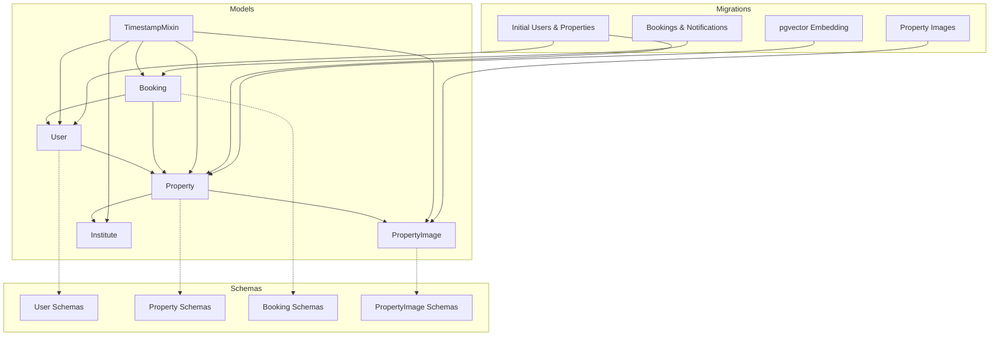
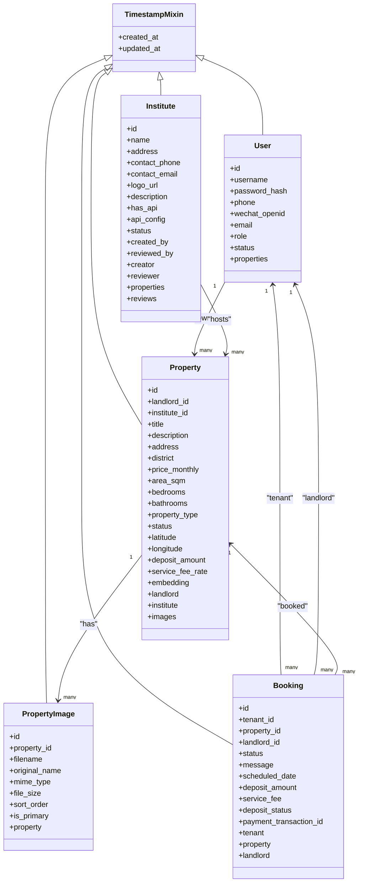
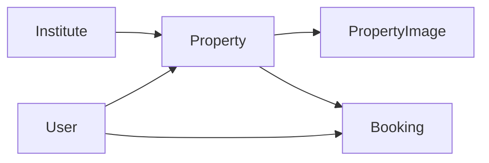

# Core Data Models

<cite>
**Referenced Files in This Document**
- [user.py](file://backend/app/models/user.py)
- [property.py](file://backend/app/models/property.py)
- [booking.py](file://backend/app/models/booking.py)
- [mixins.py](file://backend/app/models/mixins.py)
- [property_image.py](file://backend/app/models/property_image.py)
- [institute.py](file://backend/app/models/institute.py)
- [user_schema.py](file://backend/app/schemas/user.py)
- [property_schema.py](file://backend/app/schemas/property.py)
- [booking_schema.py](file://backend/app/schemas/booking.py)
- [property_image_schema.py](file://backend/app/schemas/property_image.py)
- [20260617_0001_initial_users_properties.py](file://backend/alembic/versions/20260617_0001_initial_users_properties.py)
- [20260620_0002_pgvector_embedding.py](file://backend/alembic/versions/20260620_0002_pgvector_embedding.py)
- [20260620_0003_property_images.py](file://backend/alembic/versions/20260620_0003_property_images.py)
- [20260620_0004_booking_and_notification.py](file://backend/alembic/versions/20260620_0004_booking_and_notification.py)
</cite>

## Table of Contents
1. [Introduction](#introduction)
2. [Project Structure](#project-structure)
3. [Core Components](#core-components)
4. [Architecture Overview](#architecture-overview)
5. [Detailed Component Analysis](#detailed-component-analysis)
6. [Dependency Analysis](#dependency-analysis)
7. [Performance Considerations](#performance-considerations)
8. [Troubleshooting Guide](#troubleshooting-guide)
9. [Conclusion](#conclusion)

## Introduction
This document provides comprehensive documentation for the core data models: User, Property, and Booking. It covers multi-role support, authentication fields, status management, geospatial data, pgvector embeddings for semantic search, image associations, availability tracking, booking lifecycle states, approval workflows, and relationships between entities. Field definitions, validation rules, constraints, and business logic embedded in the models are explained, along with examples of common queries and operations for each model.

## Project Structure
The core data models reside under backend/app/models, with Pydantic schemas under backend/app/schemas and database migrations under backend/alembic/versions. The following diagram shows how the primary models relate to each other and their supporting components.

**Diagram sources**
- [user.py:1-48](file://backend/app/models/user.py#L1-L48)
- [property.py:1-86](file://backend/app/models/property.py#L1-L86)
- [booking.py:1-47](file://backend/app/models/booking.py#L1-L47)
- [property_image.py:1-23](file://backend/app/models/property_image.py#L1-L23)
- [institute.py:1-48](file://backend/app/models/institute.py#L1-L48)
- [mixins.py:1-19](file://backend/app/models/mixins.py#L1-L19)
- [user_schema.py:1-45](file://backend/app/schemas/user.py#L1-L45)
- [property_schema.py:1-79](file://backend/app/schemas/property.py#L1-L79)
- [booking_schema.py:1-35](file://backend/app/schemas/booking.py#L1-L35)
- [property_image_schema.py:1-22](file://backend/app/schemas/property_image.py#L1-L22)
- [20260617_0001_initial_users_properties.py:1-94](file://backend/alembic/versions/20260617_0001_initial_users_properties.py#L1-L94)
- [20260620_0002_pgvector_embedding.py:1-40](file://backend/alembic/versions/20260620_0002_pgvector_embedding.py#L1-L40)
- [20260620_0003_property_images.py:1-46](file://backend/alembic/versions/20260620_0003_property_images.py#L1-L46)
- [20260620_0004_booking_and_notification.py:1-72](file://backend/alembic/versions/20260620_0004_booking_and_notification.py#L1-L72)

**Section sources**
- [user.py:1-48](file://backend/app/models/user.py#L1-L48)
- [property.py:1-86](file://backend/app/models/property.py#L1-L86)
- [booking.py:1-47](file://backend/app/models/booking.py#L1-L47)
- [property_image.py:1-23](file://backend/app/models/property_image.py#L1-L23)
- [institute.py:1-48](file://backend/app/models/institute.py#L1-L48)
- [mixins.py:1-19](file://backend/app/models/mixins.py#L1-L19)
- [user_schema.py:1-45](file://backend/app/schemas/user.py#L1-L45)
- [property_schema.py:1-79](file://backend/app/schemas/property.py#L1-L79)
- [booking_schema.py:1-35](file://backend/app/schemas/booking.py#L1-L35)
- [property_image_schema.py:1-22](file://backend/app/schemas/property_image.py#L1-L22)
- [20260617_0001_initial_users_properties.py:1-94](file://backend/alembic/versions/20260617_0001_initial_users_properties.py#L1-L94)
- [20260620_0002_pgvector_embedding.py:1-40](file://backend/alembic/versions/20260620_0002_pgvector_embedding.py#L1-L40)
- [20260620_0003_property_images.py:1-46](file://backend/alembic/versions/20260620_0003_property_images.py#L1-L46)
- [20260620_0004_booking_and_notification.py:1-72](file://backend/alembic/versions/20260620_0004_booking_and_notification.py#L1-L72)

## Core Components
This section summarizes the three core entities and their key responsibilities:
- User: Multi-role identity (tenant, landlord, BD manager, admin), authentication fields, and status management.
- Property: Listing details, geospatial coordinates, pgvector embedding for semantic search, images, and availability status.
- Booking: Request-to-rent workflow with lifecycle states and approvals, linking tenant, property, and landlord.

Common cross-cutting features:
- TimestampMixin adds created_at and updated_at timestamps to all models.
- Pydantic schemas enforce input validation and provide read responses.
- Database migrations define indexes, constraints, and extensions (e.g., pgvector).

**Section sources**
- [mixins.py:1-19](file://backend/app/models/mixins.py#L1-L19)
- [user_schema.py:1-45](file://backend/app/schemas/user.py#L1-L45)
- [property_schema.py:1-79](file://backend/app/schemas/property.py#L1-L79)
- [booking_schema.py:1-35](file://backend/app/schemas/booking.py#L1-L35)

## Architecture Overview
The data layer is implemented using SQLAlchemy ORM models with PostgreSQL as the target database. Key architectural highlights:
- Role-based access control via UserRole enum on User.
- Geospatial indexing and filtering on Property district and status.
- Semantic search enabled by pgvector extension and an IVFFlat index on Property.embedding.
- Image assets associated with properties through a dedicated table with ordering and primary selection.
- Booking lifecycle managed via BookingStatus enum and foreign keys to both users and properties.

**Diagram sources**
- [user.py:1-48](file://backend/app/models/user.py#L1-L48)
- [property.py:1-86](file://backend/app/models/property.py#L1-L86)
- [property_image.py:1-23](file://backend/app/models/property_image.py#L1-L23)
- [institute.py:1-48](file://backend/app/models/institute.py#L1-L48)
- [booking.py:1-47](file://backend/app/models/booking.py#L1-L47)
- [mixins.py:1-19](file://backend/app/models/mixins.py#L1-L19)

## Detailed Component Analysis

### User Model
Purpose:
- Represents system actors with multi-role support: tenant, landlord, BD manager, admin.
- Provides authentication identifiers (username, password hash, phone, WeChat OpenID, email).
- Manages account status (active, disabled, deleted).

Key fields and constraints:
- id: integer primary key with index.
- username: unique string up to 100 characters; indexed.
- password_hash: optional string up to 255 characters.
- phone: optional unique string up to 32 characters; indexed.
- wechat_openid: optional unique string up to 128 characters; indexed.
- email: optional unique string up to 255 characters; indexed.
- role: enum defaulting to tenant; required.
- status: enum defaulting to active; required.
- properties: one-to-many relationship to Property owned by this landlord.

Validation and business logic:
- Unique constraints enforced at DB level for username, phone, wechat_openid, email.
- Role and status enums restrict allowed values.
- Status supports lifecycle management (active/disabled/deleted).

Common queries and operations:
- Find user by username or email.
- List landlords by role.
- Toggle user status for deactivation or deletion.
- Retrieve properties owned by a landlord.

Example operations (descriptive):
- Create a new tenant with username, email, and optional phone.
- Update user profile fields (username, phone, email).
- Assign or change role (e.g., promote to landlord or admin).
- Disable or delete a user account.

**Section sources**
- [user.py:1-48](file://backend/app/models/user.py#L1-L48)
- [user_schema.py:1-45](file://backend/app/schemas/user.py#L1-L45)
- [20260617_0001_initial_users_properties.py:1-94](file://backend/alembic/versions/20260617_0001_initial_users_properties.py#L1-L94)

### Property Model
Purpose:
- Describes rental listings with rich attributes, geospatial data, and semantic search capability.
- Tracks availability via status and links to landlord and institute.

Key fields and constraints:
- id: integer primary key with index.
- landlord_id: foreign key to users.id with cascade delete; indexed.
- institute_id: optional foreign key to institutes.id with SET NULL on delete; indexed.
- title: required string up to 200 characters.
- description: optional text.
- address: required string up to 300 characters.
- district: required string up to 100 characters; indexed.
- price_monthly: numeric(12,2); non-negative check constraint.
- area_sqm: numeric(8,2); positive if provided.
- bedrooms: integer; non-negative.
- bathrooms: integer; non-negative.
- property_type: enum (apartment, house, studio, shared); default apartment.
- status: enum (available, rented, maintenance, offline); default available; indexed.
- latitude, longitude: numeric(9,6) optional geospatial coordinates.
- deposit_amount: optional integer; default 1000.
- service_fee_rate: optional float; default 0.10.
- embedding: vector column (1536-dim) for semantic similarity search; stored via TypeDecorator mapping to pgvector on PostgreSQL.
- Relationships: landlord (User), institute (Institute), images (list of PropertyImage).

Indexes and constraints:
- Composite index on district and status for efficient filtering.
- Check constraints ensure price_monthly >= 0, area_sqm > 0 when present, bedrooms >= 0, bathrooms >= 0.
- pgvector index uses IVFFlat with L2 distance for approximate nearest neighbor search.

Availability tracking:
- status indicates listing availability; typical flow: available -> rented -> maintenance/offline.

Semantic search:
- embedding stores high-dimensional vectors generated from property descriptions or metadata.
- Similarity queries use vector operators against the IVFFlat index.

Common queries and operations:
- Filter by district and status.
- Search by price range, room counts, and type.
- Geospatial queries using latitude/longitude.
- Vector similarity search using embedding.
- Attach and manage images with ordering and primary selection.

Example operations (descriptive):
- Create a property with landlord_id, basic info, pricing, and optional geolocation.
- Update property status to rented upon successful booking completion.
- Generate and store embedding for semantic search.
- Upload multiple images, set primary image, and order them.

**Section sources**
- [property.py:1-86](file://backend/app/models/property.py#L1-L86)
- [property_schema.py:1-79](file://backend/app/schemas/property.py#L1-L79)
- [property_image.py:1-23](file://backend/app/models/property_image.py#L1-L23)
- [property_image_schema.py:1-22](file://backend/app/schemas/property_image.py#L1-L22)
- [20260617_0001_initial_users_properties.py:1-94](file://backend/alembic/versions/20260617_0001_initial_users_properties.py#L1-L94)
- [20260620_0002_pgvector_embedding.py:1-40](file://backend/alembic/versions/20260620_0002_pgvector_embedding.py#L1-L40)
- [20260620_0003_property_images.py:1-46](file://backend/alembic/versions/20260620_0003_property_images.py#L1-L46)

### Booking Model
Purpose:
- Captures tenant interest in a property and manages the approval workflow.
- Links tenant, property, and landlord; tracks scheduling and payment-related fields.

Key fields and constraints:
- id: integer primary key with index.
- tenant_id: foreign key to users.id with cascade delete; indexed.
- property_id: foreign key to properties.id with cascade delete; indexed.
- landlord_id: foreign key to users.id with cascade delete; indexed.
- status: enum (pending, approved, rejected, cancelled, completed); default pending.
- message: optional text for notes or communication.
- scheduled_date: optional string (up to 32 chars) for proposed visit or move-in date.
- deposit_amount: optional integer.
- service_fee: optional integer.
- deposit_status: string (default unpaid) indicating deposit payment state.
- payment_transaction_id: optional string referencing external payment transaction.
- Relationships: tenant (User), property (Property), landlord (User).

Lifecycle states and approval workflow:
- pending: initial state after creation.
- approved: landlord accepts the request.
- rejected: landlord declines.
- cancelled: tenant or system cancels before completion.
- completed: final state after fulfillment (e.g., contract signed, deposit paid).

Business logic considerations:
- Ensure property status aligns with booking state transitions (e.g., mark rented upon completion).
- Validate deposit and fee fields when moving towards completion.
- Maintain referential integrity via foreign keys and cascades.

Common queries and operations:
- List bookings by tenant or landlord.
- Approve or reject a pending booking.
- Cancel a booking before completion.
- Complete a booking and update related property status.

Example operations (descriptive):
- Create a booking for a property with optional message and scheduled date.
- Landlord reviews and approves/rejects the booking.
- Tenant pays deposit; update deposit_status and payment_transaction_id.
- Mark booking as completed and transition property to rented.

**Section sources**
- [booking.py:1-47](file://backend/app/models/booking.py#L1-L47)
- [booking_schema.py:1-35](file://backend/app/schemas/booking.py#L1-L35)
- [20260620_0004_booking_and_notification.py:1-72](file://backend/alembic/versions/20260620_0004_booking_and_notification.py#L1-L72)

### Supporting Models and Schemas

#### PropertyImage
- Associates media assets with properties.
- Fields include filename, original name, MIME type, file size, sort order, and primary flag.
- Enforces unique filename and cascade delete on property removal.
- Supports ordered display and primary image selection.

**Section sources**
- [property_image.py:1-23](file://backend/app/models/property_image.py#L1-L23)
- [property_image_schema.py:1-22](file://backend/app/schemas/property_image.py#L1-L22)
- [20260620_0003_property_images.py:1-46](file://backend/alembic/versions/20260620_0003_property_images.py#L1-L46)

#### Institute
- Represents large apartment management organizations entered by BD managers.
- Includes contact info, API integration flags, and review workflow fields.
- Linked to properties and reviews.

**Section sources**
- [institute.py:1-48](file://backend/app/models/institute.py#L1-L48)

#### TimestampMixin
- Adds created_at and updated_at columns with server defaults and auto-update behavior.

**Section sources**
- [mixins.py:1-19](file://backend/app/models/mixins.py#L1-L19)

## Dependency Analysis
Relationships and coupling:
- User has a one-to-many relationship with Property (landlord ownership).
- Property depends on User (landlord) and Institute (optional host).
- PropertyImage depends on Property with cascade delete.
- Booking depends on User (tenant and landlord) and Property with cascade deletes.
- All models inherit TimestampMixin for consistent auditability.

External dependencies:
- pgvector extension enables vector storage and similarity search on Property.embedding.
- Alembic migrations define schema evolution, including indexes and constraints.

Potential circular dependencies:
- None observed among core models; relationships are unidirectional where appropriate.

**Diagram sources**
- [user.py:1-48](file://backend/app/models/user.py#L1-L48)
- [property.py:1-86](file://backend/app/models/property.py#L1-L86)
- [property_image.py:1-23](file://backend/app/models/property_image.py#L1-L23)
- [institute.py:1-48](file://backend/app/models/institute.py#L1-L48)
- [booking.py:1-47](file://backend/app/models/booking.py#L1-L47)

**Section sources**
- [user.py:1-48](file://backend/app/models/user.py#L1-L48)
- [property.py:1-86](file://backend/app/models/property.py#L1-L86)
- [property_image.py:1-23](file://backend/app/models/property_image.py#L1-L23)
- [institute.py:1-48](file://backend/app/models/institute.py#L1-L48)
- [booking.py:1-47](file://backend/app/models/booking.py#L1-L47)

## Performance Considerations
- Indexes:
  - District and status composite index on Property improves filtered queries.
  - IVFFlat index on Property.embedding accelerates approximate nearest neighbor searches.
- Constraints:
  - Check constraints prevent invalid data (e.g., negative prices or areas).
- Vector dimensionality:
  - Embeddings are 1536-dimensional; consider batching updates and periodic re-indexing for performance.
- Eager loading:
  - Property.images uses selectin strategy to reduce N+1 queries when reading properties with images.
- Cascading deletes:
  - Foreign keys with CASCADE simplify cleanup but should be used carefully to avoid unintended deletions.

[No sources needed since this section provides general guidance]

## Troubleshooting Guide
Common issues and resolutions:
- Missing pgvector extension:
  - Ensure the vector extension is enabled in PostgreSQL; migration creates it automatically during upgrade.
- Invalid enum values:
  - Verify that role, status, property_type, property_status, and booking_status values match defined enums.
- Constraint violations:
  - Negative price or zero/negative area will fail due to check constraints; validate inputs before insert/update.
- Duplicate identifiers:
  - Username, phone, wechat_openid, email must be unique; handle conflicts gracefully in application logic.
- Vector index not found:
  - Confirm IVFFlat index exists on Property.embedding; rebuild if necessary after bulk updates.

**Section sources**
- [20260620_0002_pgvector_embedding.py:1-40](file://backend/alembic/versions/20260620_0002_pgvector_embedding.py#L1-L40)
- [20260617_0001_initial_users_properties.py:1-94](file://backend/alembic/versions/20260617_0001_initial_users_properties.py#L1-L94)

## Conclusion
The core data models provide a robust foundation for a rental housing platform. User roles enable flexible access control, Property supports rich metadata and semantic search via pgvector, and Booking encapsulates the end-to-end rental request workflow. Together with strong validation, constraints, and indexes, these models ensure data integrity, performance, and scalability.

[No sources needed since this section summarizes without analyzing specific files]