# Database & Data Models

<cite>
**Referenced Files in This Document**
- [session.py](file://backend/app/db/session.py)
- [base.py](file://backend/app/db/base.py)
- [indexes.py](file://backend/app/db/indexes.py)
- [mixins.py](file://backend/app/models/mixins.py)
- [user.py](file://backend/app/models/user.py)
- [property.py](file://backend/app/models/property.py)
- [booking.py](file://backend/app/models/booking.py)
- [contract.py](file://backend/app/models/contract.py)
- [payment.py](file://backend/app/models/payment.py)
- [audit_log.py](file://backend/app/models/audit_log.py)
- [embedding_job.py](file://backend/app/models/embedding_job.py)
- [institute.py](file://backend/app/models/institute.py)
- [config.py](file://backend/app/core/config.py)
- [env.py](file://backend/alembic/env.py)
- [alembic.ini](file://backend/alembic.ini)
- [20260617_0001_initial_users_properties.py](file://backend/alembic/versions/20260617_0001_initial_users_properties.py)
- [20260620_0002_pgvector_embedding.py](file://backend/alembic/versions/20260620_0002_pgvector_embedding.py)
</cite>

## Table of Contents
1. [Introduction](#introduction)
2. [Project Structure](#project-structure)
3. [Core Components](#core-components)
4. [Architecture Overview](#architecture-overview)
5. [Detailed Component Analysis](#detailed-component-analysis)
6. [Dependency Analysis](#dependency-analysis)
7. [Performance Considerations](#performance-considerations)
8. [Troubleshooting Guide](#troubleshooting-guide)
9. [Conclusion](#conclusion)
10. [Appendices](#appendices)

## Introduction
This document describes the database architecture and SQLAlchemy 2.0 async models for the rental housing system. It covers session management with connection pooling, async query patterns, transaction handling, data models (User, Property, Booking, Contract, Payment), relationships, base model mixins, audit logging, soft delete considerations, indexes (including pgvector embeddings), Alembic migrations, validation rules, security, backup strategies, and scaling considerations.

## Project Structure
The database layer is organized under backend/app/db with a clear separation between engine/session configuration, declarative base registration, and index utilities. Models live under backend/app/models and are registered centrally to ensure metadata consistency for Alembic.

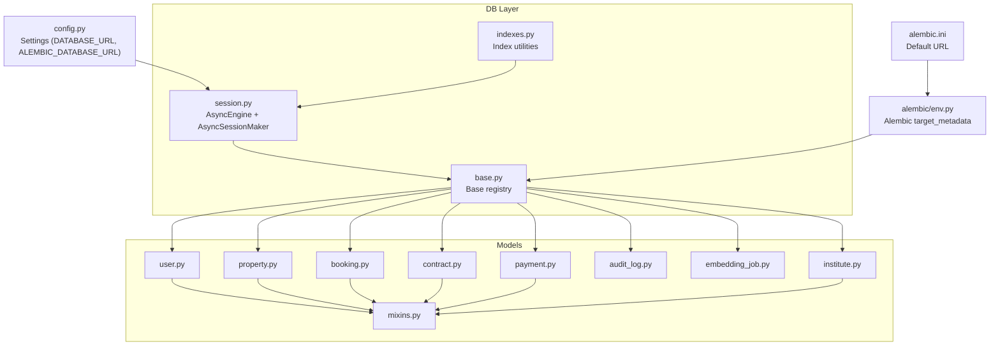

**Diagram sources**
- [session.py:1-14](file://backend/app/db/session.py#L1-L14)
- [base.py:1-35](file://backend/app/db/base.py#L1-L35)
- [indexes.py:1-118](file://backend/app/db/indexes.py#L1-L118)
- [user.py:1-48](file://backend/app/models/user.py#L1-L48)
- [property.py:1-86](file://backend/app/models/property.py#L1-L86)
- [booking.py:1-47](file://backend/app/models/booking.py#L1-L47)
- [contract.py:1-37](file://backend/app/models/contract.py#L1-L37)
- [payment.py:1-34](file://backend/app/models/payment.py#L1-L34)
- [audit_log.py:1-25](file://backend/app/models/audit_log.py#L1-L25)
- [embedding_job.py:1-35](file://backend/app/models/embedding_job.py#L1-L35)
- [institute.py:1-48](file://backend/app/models/institute.py#L1-L48)
- [mixins.py:1-19](file://backend/app/models/mixins.py#L1-L19)
- [config.py:1-167](file://backend/app/core/config.py#L1-L167)
- [env.py:1-51](file://backend/alembic/env.py#L1-L51)
- [alembic.ini:1-43](file://backend/alembic.ini#L1-L43)

**Section sources**
- [session.py:1-14](file://backend/app/db/session.py#L1-L14)
- [base.py:1-35](file://backend/app/db/base.py#L1-L35)
- [indexes.py:1-118](file://backend/app/db/indexes.py#L1-L118)
- [config.py:1-167](file://backend/app/core/config.py#L1-L167)
- [env.py:1-51](file://backend/alembic/env.py#L1-L51)
- [alembic.ini:1-43](file://backend/alembic.ini#L1-L43)

## Core Components
- Async Engine and Session Management
  - An async engine is created from settings.database_url and an async_sessionmaker is configured with expire_on_commit=False to avoid unnecessary reloads after commit.
  - The Base class inherits from DeclarativeBase and AsyncAttrs to support async ORM operations.
- Central Model Registration
  - All ORM models are imported into a single module to register their metadata with Base.metadata, ensuring Alembic can discover them.
- Index Utilities
  - Functions create IVFFlat indexes on property embeddings when row count warrants it, and composite indexes for bookings. They also provide EXPLAIN ANALYZE helpers.

Key implementation references:
- [session.py:1-14](file://backend/app/db/session.py#L1-L14)
- [base.py:1-35](file://backend/app/db/base.py#L1-L35)
- [indexes.py:16-88](file://backend/app/db/indexes.py#L16-L88)

**Section sources**
- [session.py:1-14](file://backend/app/db/session.py#L1-L14)
- [base.py:1-35](file://backend/app/db/base.py#L1-L35)
- [indexes.py:16-88](file://backend/app/db/indexes.py#L16-L88)

## Architecture Overview
The application uses PostgreSQL with asyncpg for high-performance async I/O. SQLAlchemy 2.0 declarative models define the schema, while Alembic manages migrations. pgvector enables semantic search via vector embeddings on properties.

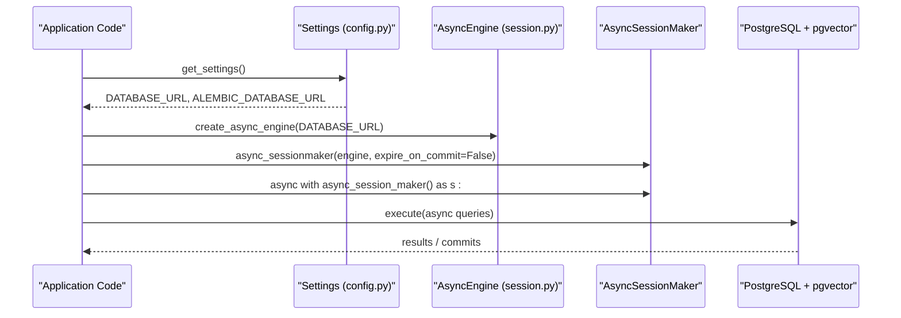

**Diagram sources**
- [config.py:15-22](file://backend/app/core/config.py#L15-L22)
- [session.py:1-14](file://backend/app/db/session.py#L1-L14)

## Detailed Component Analysis

### Base Model Mixins and Audit Logging
- TimestampMixin provides created_at and updated_at columns with server defaults and automatic updates.
- AuditLog records user actions with JSON details, IP address, and timestamps. It does not inherit TimestampMixin; it defines its own created_at.

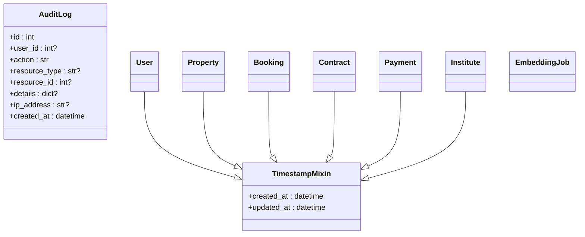

**Diagram sources**
- [mixins.py:1-19](file://backend/app/models/mixins.py#L1-L19)
- [audit_log.py:1-25](file://backend/app/models/audit_log.py#L1-L25)
- [user.py:24-48](file://backend/app/models/user.py#L24-L48)
- [property.py:38-86](file://backend/app/models/property.py#L38-L86)
- [booking.py:18-47](file://backend/app/models/booking.py#L18-L47)
- [contract.py:12-37](file://backend/app/models/contract.py#L12-L37)
- [payment.py:11-34](file://backend/app/models/payment.py#L11-L34)
- [institute.py:16-48](file://backend/app/models/institute.py#L16-L48)

**Section sources**
- [mixins.py:1-19](file://backend/app/models/mixins.py#L1-L19)
- [audit_log.py:1-25](file://backend/app/models/audit_log.py#L1-L25)

### User Model
- Fields include username, phone, wechat_openid, email, role, status, and timestamps.
- Relationships: one-to-many to Property (landlord).
- Validation: unique constraints on identifiers; enums for role/status.

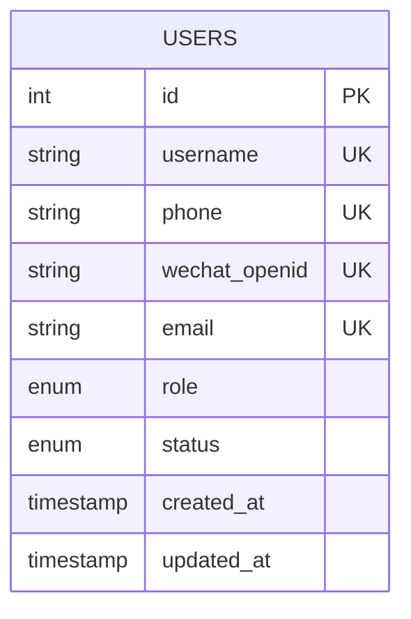

**Diagram sources**
- [user.py:11-48](file://backend/app/models/user.py#L11-L48)

**Section sources**
- [user.py:11-48](file://backend/app/models/user.py#L11-L48)

### Property Model
- Fields include landlord_id, institute_id, title, description, address, district, price_monthly, area_sqm, bedrooms, bathrooms, property_type, status, coordinates, deposit_amount, service_fee_rate, embedding (pgvector).
- Constraints: non-negative price, positive area, non-negative rooms/bathrooms.
- Indexes: district, status, and composite district+status.
- Relationships: many-to-one to User (landlord), many-to-one to Institute, one-to-many to PropertyImage.

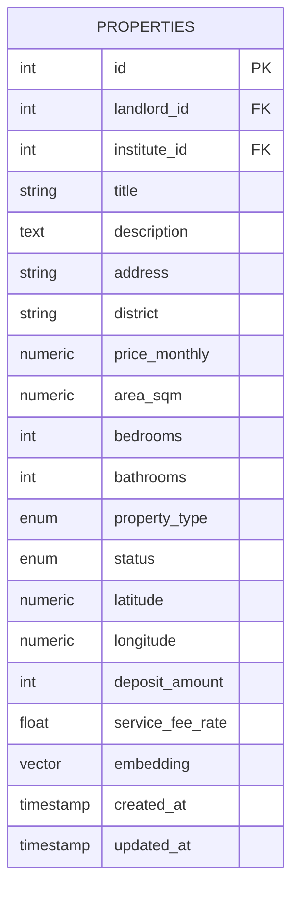

**Diagram sources**
- [property.py:12-86](file://backend/app/models/property.py#L12-L86)

**Section sources**
- [property.py:12-86](file://backend/app/models/property.py#L12-L86)

### Booking Model
- Links tenant, landlord, and property; tracks status, message, scheduled_date, deposit/service fee amounts, deposit status, and payment transaction id.
- Relationships: to User (tenant and landlord), to Property.

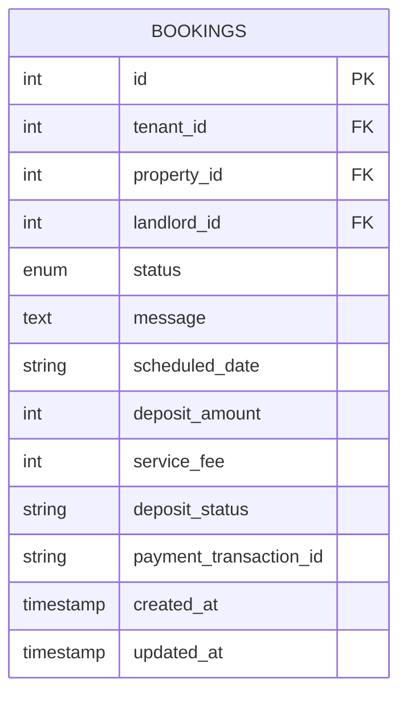

**Diagram sources**
- [booking.py:10-47](file://backend/app/models/booking.py#L10-L47)

**Section sources**
- [booking.py:10-47](file://backend/app/models/booking.py#L10-L47)

### Contract Model
- Tied to a booking with unique constraint; stores template name, content, status, signed_at, file_path.
- Relationships: to Booking, to User (tenant), to Property.

```mermaid
erDiagram
CONTRACTS {
string id PK
int booking_id FK UK
int tenant_id FK
int property_id FK
string template_name
text content
string status
timestamp signed_at
string file_path
timestamp created_at
timestamp updated_at
}
```

**Diagram sources**
- [contract.py:12-37](file://backend/app/models/contract.py#L12-L37)

**Section sources**
- [contract.py:12-37](file://backend/app/models/contract.py#L12-L37)

### Payment Model
- Tracks payments linked to bookings and users; includes amount, external transaction id, status, method, paid_at.
- Relationships: to Booking, to User.

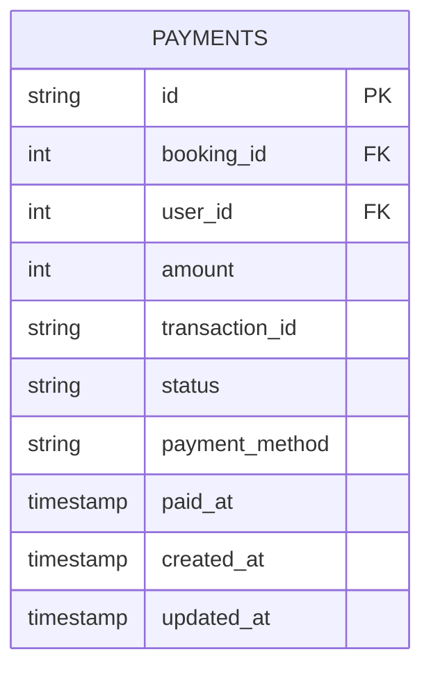

**Diagram sources**
- [payment.py:11-34](file://backend/app/models/payment.py#L11-L34)

**Section sources**
- [payment.py:11-34](file://backend/app/models/payment.py#L11-L34)

### Institute Model
- Represents large apartment management entities; fields include contact info, API flags/config, status, creator/reviewer links.
- Relationships: to User (creator/reviewer), to Property, to Review.

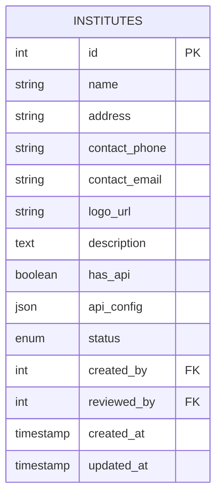

**Diagram sources**
- [institute.py:10-48](file://backend/app/models/institute.py#L10-L48)

**Section sources**
- [institute.py:10-48](file://backend/app/models/institute.py#L10-L48)

### Embedding Job Model
- Tracks asynchronous embedding generation jobs for properties with status and timestamps.

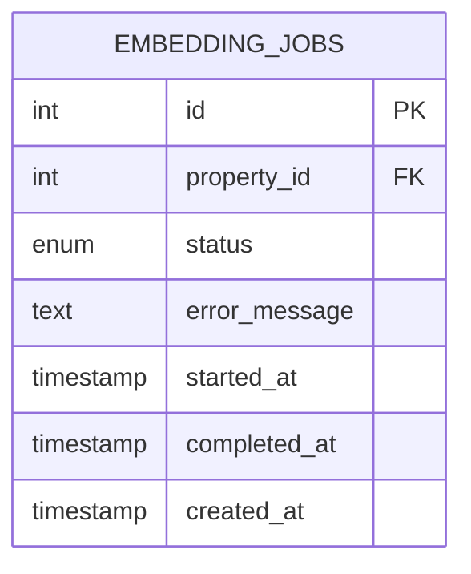

**Diagram sources**
- [embedding_job.py:10-35](file://backend/app/models/embedding_job.py#L10-L35)

**Section sources**
- [embedding_job.py:10-35](file://backend/app/models/embedding_job.py#L10-L35)

### Entity Relationship Diagram (Selected Entities)
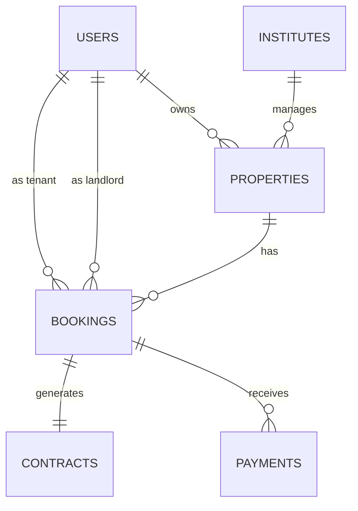

**Diagram sources**
- [user.py:44-48](file://backend/app/models/user.py#L44-L48)
- [property.py:80-86](file://backend/app/models/property.py#L80-L86)
- [booking.py:44-47](file://backend/app/models/booking.py#L44-L47)
- [contract.py:35-37](file://backend/app/models/contract.py#L35-L37)
- [payment.py:33-34](file://backend/app/models/payment.py#L33-L34)
- [institute.py:42-47](file://backend/app/models/institute.py#L42-L47)

## Dependency Analysis
- Configuration drives both runtime engine and Alembic:
  - Runtime uses DATABASE_URL for async operations.
  - Alembic uses ALEMBIC_DATABASE_URL for migrations.
- Base.metadata is centralized via imports in base.py so Alembic discovers all models.
- Index utilities depend on AsyncSession and raw SQL via SQLAlchemy text.

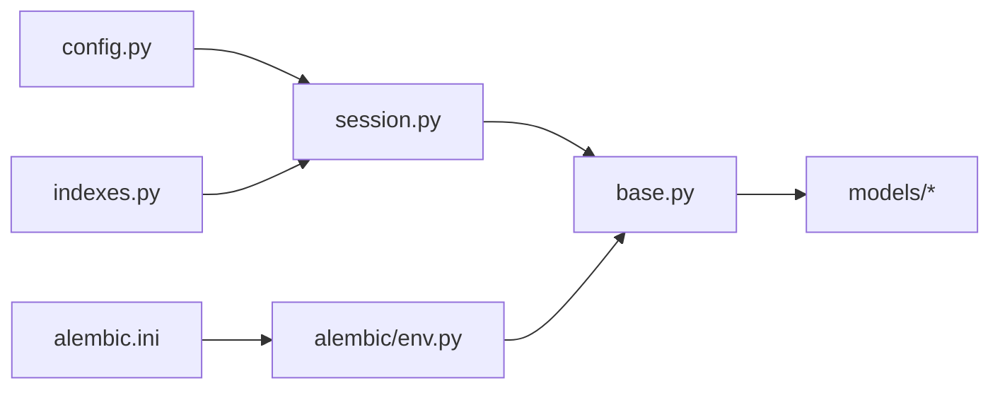

**Diagram sources**
- [config.py:15-22](file://backend/app/core/config.py#L15-L22)
- [session.py:1-14](file://backend/app/db/session.py#L1-L14)
- [base.py:1-35](file://backend/app/db/base.py#L1-L35)
- [env.py:14-17](file://backend/alembic/env.py#L14-L17)
- [alembic.ini:6](file://backend/alembic.ini#L6)
- [indexes.py:1-14](file://backend/app/db/indexes.py#L1-L14)

**Section sources**
- [config.py:15-22](file://backend/app/core/config.py#L15-L22)
- [session.py:1-14](file://backend/app/db/session.py#L1-L14)
- [base.py:1-35](file://backend/app/db/base.py#L1-L35)
- [env.py:14-17](file://backend/alembic/env.py#L14-L17)
- [alembic.ini:6](file://backend/alembic.ini#L6)
- [indexes.py:1-14](file://backend/app/db/indexes.py#L1-L14)

## Performance Considerations
- Connection Pooling
  - The async engine uses default pool settings; tune pool size, max overflow, and recycle based on workload and concurrency.
- Async Query Patterns
  - Use async sessions and async execution paths consistently. Avoid synchronous calls within async contexts.
- Transaction Handling
  - Wrap related writes in a single async session scope and commit once to reduce round-trips and ensure atomicity.
- Index Strategy
  - IVFFlat index on property.embedding is created conditionally based on row count and lists parameter tuned to sqrt(row_count). Composite indexes on bookings improve common filters by tenant/landlord/property and status.
- Vector Search
  - For small datasets (<1000 rows), exact scan may be faster than IVFFlat; the utility skips index creation accordingly.

**Section sources**
- [indexes.py:16-88](file://backend/app/db/indexes.py#L16-L88)
- [indexes.py:91-118](file://backend/app/db/indexes.py#L91-L118)

## Troubleshooting Guide
- Migration Issues
  - Ensure alembic.ini or env overrides point to the correct ALEMBIC_DATABASE_URL.
  - Confirm Base.metadata is populated by importing all models in base.py.
- pgvector Extension
  - Verify the vector extension is enabled in the database before running migrations that add embeddings.
- Index Recreate Logic
  - If IVFFlat index already exists, recreation is skipped; verify existing index names if troubleshooting performance regressions.
- Query Performance
  - Use provided EXPLAIN ANALYZE helpers to inspect plans for hot queries.

**Section sources**
- [env.py:14-17](file://backend/alembic/env.py#L14-L17)
- [base.py:1-35](file://backend/app/db/base.py#L1-L35)
- [20260620_0002_pgvector_embedding.py:21-35](file://backend/alembic/versions/20260620_0002_pgvector_embedding.py#L21-L35)
- [indexes.py:34-48](file://backend/app/db/indexes.py#L34-L48)
- [indexes.py:91-118](file://backend/app/db/indexes.py#L91-L118)

## Conclusion
The system employs a modern, async-first SQLAlchemy 2.0 stack with PostgreSQL and pgvector for semantic search. Centralized metadata registration, robust indexing, and Alembic-driven migrations provide a solid foundation. Careful attention to connection pooling, transaction boundaries, and index tuning will help maintain performance at scale.

## Appendices

### Data Validation Rules
- Properties
  - Non-negative monthly price, positive area when present, non-negative bedrooms/bathrooms enforced via check constraints.
- Users
  - Unique constraints on username, phone, wechat_openid, email; enumerated roles and statuses.
- Bookings/Contracts/Payments
  - Referential integrity via foreign keys; status fields constrained by application logic and enums where applicable.

**Section sources**
- [property.py:40-46](file://backend/app/models/property.py#L40-L46)
- [user.py:27-42](file://backend/app/models/user.py#L27-L42)
- [booking.py:31-42](file://backend/app/models/booking.py#L31-L42)
- [contract.py:28-31](file://backend/app/models/contract.py#L28-L31)
- [payment.py:25-30](file://backend/app/models/payment.py#L25-L30)

### Database Security
- Use strong credentials and TLS for database connections.
- Restrict database user privileges to minimum required.
- Store secrets via environment variables and secure secret managers.
- Enable audit logging for sensitive operations.

[No sources needed since this section provides general guidance]

### Backup Strategies
- Schedule regular logical backups (e.g., pg_dump) and physical backups (WAL archiving).
- Test restore procedures regularly.
- Back up vector extensions and custom types safely.

[No sources needed since this section provides general guidance]

### Scaling Considerations
- Horizontal read scaling with read replicas; route reads to replicas and writes to primary.
- Tune async engine pool parameters per CPU cores and expected concurrency.
- Monitor and adjust IVFFlat lists parameter as dataset grows.
- Partition large tables (e.g., audit_logs, payments) by time if necessary.

[No sources needed since this section provides general guidance]

### Soft Delete Pattern Note
- The current models do not implement a generic soft-delete mixin. The UserStatus enum includes a deleted state which can be used for logical deletion at the application level. To standardize soft deletes across models, consider introducing a dedicated mixin and updating queries to filter out soft-deleted records.

**Section sources**
- [user.py:18-22](file://backend/app/models/user.py#L18-L22)