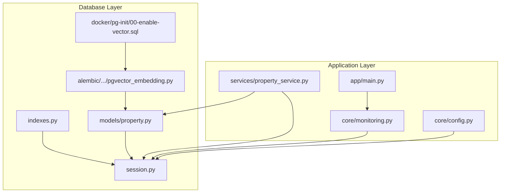
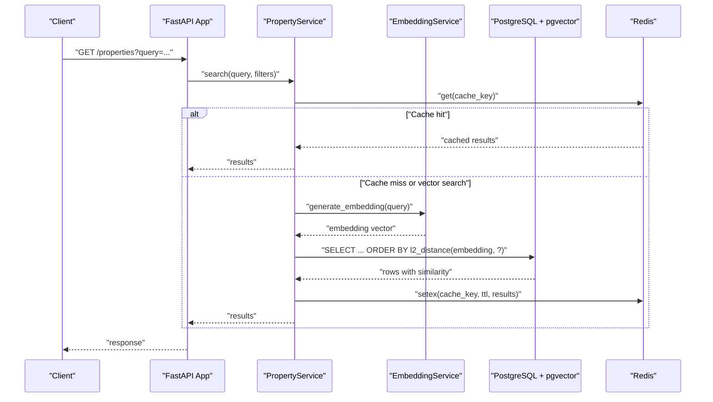
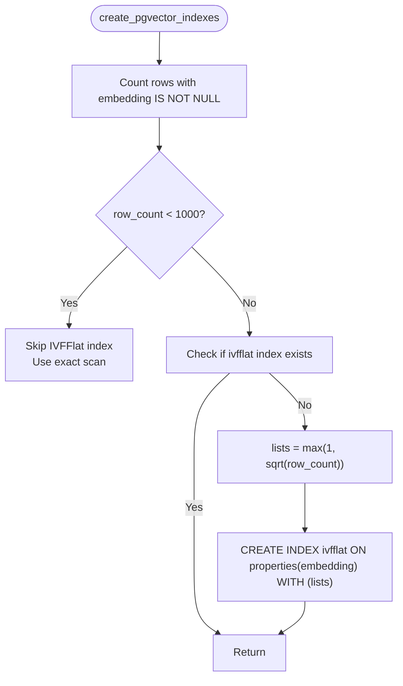
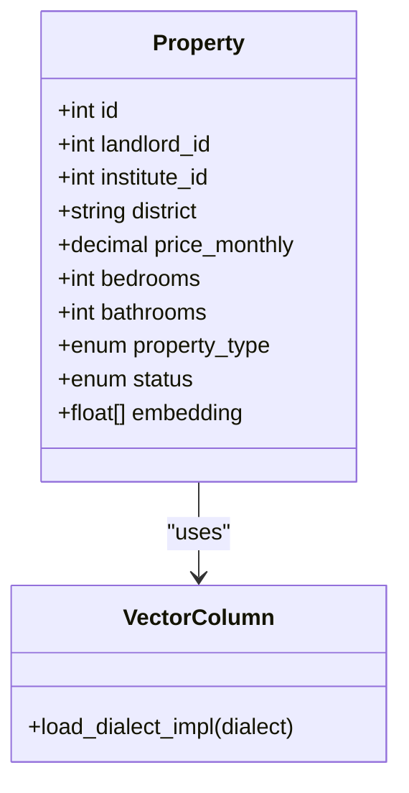
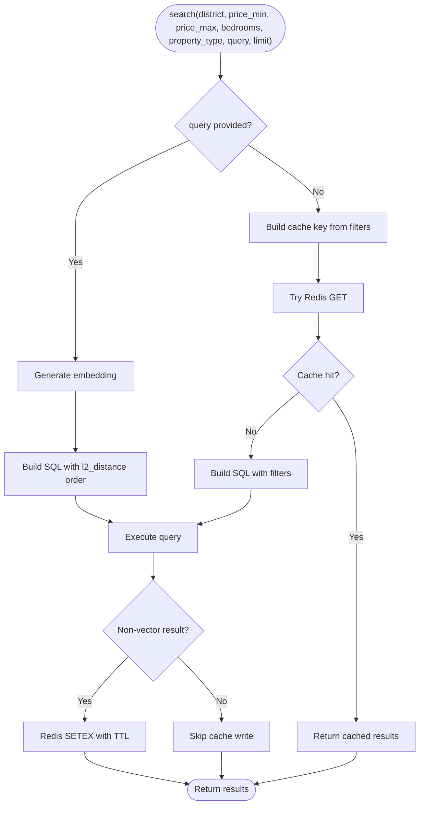
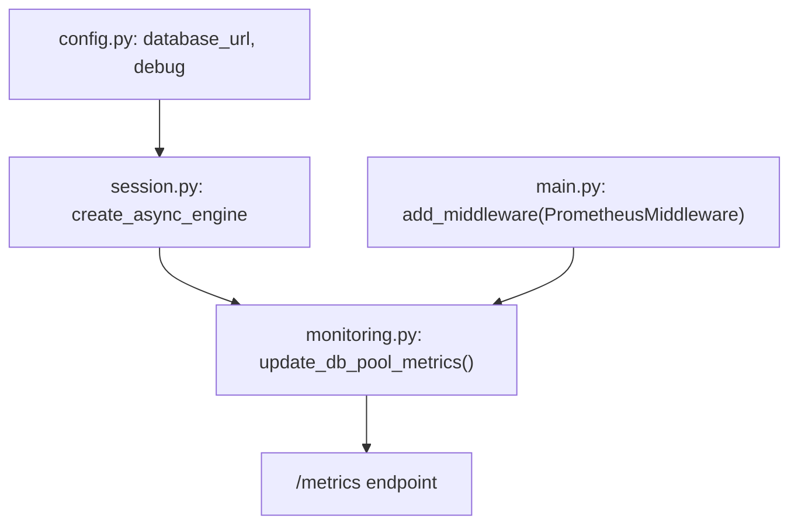
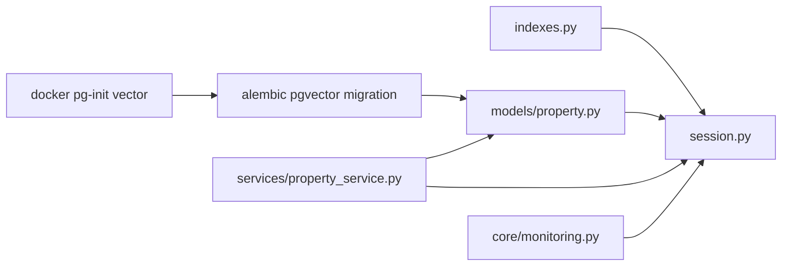

# Database Indexing & Performance

<cite>
**Referenced Files in This Document**
- [indexes.py](file://backend/app/db/indexes.py)
- [session.py](file://backend/app/db/session.py)
- [config.py](file://backend/app/core/config.py)
- [monitoring.py](file://backend/app/core/monitoring.py)
- [property.py](file://backend/app/models/property.py)
- [20260620_0002_pgvector_embedding.py](file://backend/alembic/versions/20260620_0002_pgvector_embedding.py)
- [00-enable-vector.sql](file://docker/pg-init/00-enable-vector.sql)
- [property_service.py](file://backend/app/services/property_service.py)
- [main.py](file://backend/app/main.py)
</cite>

## Table of Contents
1. [Introduction](#introduction)
2. [Project Structure](#project-structure)
3. [Core Components](#core-components)
4. [Architecture Overview](#architecture-overview)
5. [Detailed Component Analysis](#detailed-component-analysis)
6. [Dependency Analysis](#dependency-analysis)
7. [Performance Considerations](#performance-considerations)
8. [Troubleshooting Guide](#troubleshooting-guide)
9. [Conclusion](#conclusion)

## Introduction
This document explains database indexing strategies and performance optimization for the application, focusing on:
- Custom indexes defined in the indexes module
- Composite indexes for high-frequency queries
- Full-text and semantic search optimization using pgvector
- Connection pooling configuration and monitoring
- Query optimization patterns and caching strategies
- Performance monitoring, slow query analysis, and scaling considerations

The goal is to provide actionable guidance for selecting index types based on query patterns and maintaining strong performance as data grows.

## Project Structure
Relevant components for database indexing and performance are organized under backend/app/db, backend/app/models, backend/app/services, backend/app/core, and docker/pg-init. The key files include:
- Index creation utilities and performance checks
- SQLAlchemy async engine and session setup
- Model-level indexes and vector column type
- Alembic migration for pgvector extension and initial index
- Docker initialization script to enable pgvector
- Service layer with Redis-backed caching for search results
- Prometheus metrics middleware and DB pool gauges

**Diagram sources**
- [indexes.py:1-118](file://backend/app/db/indexes.py#L1-L118)
- [session.py:1-14](file://backend/app/db/session.py#L1-L14)
- [property.py:1-86](file://backend/app/models/property.py#L1-L86)
- [20260620_0002_pgvector_embedding.py:1-40](file://backend/alembic/versions/20260620_0002_pgvector_embedding.py#L1-L40)
- [00-enable-vector.sql:1-3](file://docker/pg-init/00-enable-vector.sql#L1-L3)
- [property_service.py:100-239](file://backend/app/services/property_service.py#L100-L239)
- [monitoring.py:1-227](file://backend/app/core/monitoring.py#L1-L227)
- [main.py:1-82](file://backend/app/main.py#L1-L82)
- [config.py:1-167](file://backend/app/core/config.py#L1-L167)

**Section sources**
- [indexes.py:1-118](file://backend/app/db/indexes.py#L1-L118)
- [session.py:1-14](file://backend/app/db/session.py#L1-L14)
- [property.py:1-86](file://backend/app/models/property.py#L1-L86)
- [20260620_0002_pgvector_embedding.py:1-40](file://backend/alembic/versions/20260620_0002_pgvector_embedding.py#L1-L40)
- [00-enable-vector.sql:1-3](file://docker/pg-init/00-enable-vector.sql#L1-L3)
- [property_service.py:100-239](file://backend/app/services/property_service.py#L100-L239)
- [monitoring.py:1-227](file://backend/app/core/monitoring.py#L1-L227)
- [main.py:1-82](file://backend/app/main.py#L1-L82)
- [config.py:1-167](file://backend/app/core/config.py#L1-L167)

## Core Components
- Index creation utilities:
  - IVFFlat index creation for property embeddings with adaptive lists parameter based on row count
  - Composite indexes for bookings (tenant_id + status, landlord_id + status, property_id + status)
  - Performance check helpers that run EXPLAIN ANALYZE on representative queries
- Model-level indexes:
  - Composite index on properties(district, status)
  - Single-column indexes on frequently filtered fields
- Vector support:
  - VectorColumn TypeDecorator mapping to pgvector Vector(1536) on PostgreSQL
  - Migration enabling vector extension and creating an initial IVFFlat index
  - Docker init script ensuring vector extension availability
- Caching:
  - Redis-backed cache for non-vector search results with TTL
- Monitoring:
  - Prometheus middleware for request latency and counts
  - DB pool gauges for size, overflow, and checked-out connections
- Configuration:
  - Async database URL and debug flag used by the async engine

**Section sources**
- [indexes.py:16-88](file://backend/app/db/indexes.py#L16-L88)
- [indexes.py:91-118](file://backend/app/db/indexes.py#L91-L118)
- [property.py:45-78](file://backend/app/models/property.py#L45-L78)
- [20260620_0002_pgvector_embedding.py:21-35](file://backend/alembic/versions/20260620_0002_pgvector_embedding.py#L21-L35)
- [00-enable-vector.sql:1-3](file://docker/pg-init/00-enable-vector.sql#L1-L3)
- [property_service.py:100-195](file://backend/app/services/property_service.py#L100-L195)
- [monitoring.py:126-176](file://backend/app/core/monitoring.py#L126-L176)
- [monitoring.py:216-226](file://backend/app/core/monitoring.py#L216-L226)
- [session.py:8-9](file://backend/app/db/session.py#L8-L9)
- [config.py:15-22](file://backend/app/core/config.py#L15-L22)

## Architecture Overview
The system combines relational indexes, vector indexes, and caching to optimize both structured and semantic searches. The flow below shows how a semantic search request leverages embedding generation, pgvector similarity, and optional caching.

**Diagram sources**
- [property_service.py:134-195](file://backend/app/services/property_service.py#L134-L195)
- [property_service.py:100-133](file://backend/app/services/property_service.py#L100-L133)
- [property.py:78](file://backend/app/models/property.py#L78)
- [20260620_0002_pgvector_embedding.py:27-35](file://backend/alembic/versions/20260620_0002_pgvector_embedding.py#L27-L35)

## Detailed Component Analysis

### Index Creation Utilities (indexes.py)
Responsibilities:
- Create IVFFlat index on properties.embedding when there are enough rows; otherwise skip to prefer exact scan
- Create composite indexes on bookings for common access patterns
- Provide EXPLAIN ANALYZE helper and sample performance checks

Key behaviors:
- Row-count threshold to decide between IVFFlat and exact scan
- Idempotent index creation via existence checks
- Adaptive lists parameter computed from sqrt(row_count)

**Diagram sources**
- [indexes.py:16-48](file://backend/app/db/indexes.py#L16-L48)

**Section sources**
- [indexes.py:16-48](file://backend/app/db/indexes.py#L16-L48)
- [indexes.py:51-82](file://backend/app/db/indexes.py#L51-L82)
- [indexes.py:84-88](file://backend/app/db/indexes.py#L84-L88)
- [indexes.py:91-118](file://backend/app/db/indexes.py#L91-L118)

### Model-Level Indexes and Vector Column (models/property.py)
Highlights:
- Composite index on properties(district, status) supports filtering by district and status efficiently
- Single-column indexes on id, landlord_id, institute_id, district, status
- VectorColumn TypeDecorator maps to pgvector Vector(1536) on PostgreSQL and falls back to text on other dialects

**Diagram sources**
- [property.py:38-86](file://backend/app/models/property.py#L38-L86)
- [property.py:12-22](file://backend/app/models/property.py#L12-L22)

**Section sources**
- [property.py:45-78](file://backend/app/models/property.py#L45-L78)
- [property.py:12-22](file://backend/app/models/property.py#L12-L22)

### Alembic Migration for pgvector (20260620_0002_pgvector_embedding.py)
Highlights:
- Enables vector extension
- Adds embedding column of dimension 1536
- Creates IVFFlat index with fixed lists parameter during migration

Operational note:
- Runtime index creation in indexes.py adapts lists based on actual row count, complementing the static migration index.

**Section sources**
- [20260620_0002_pgvector_embedding.py:21-35](file://backend/alembic/versions/20260620_0002_pgvector_embedding.py#L21-L35)

### Docker Initialization for pgvector (00-enable-vector.sql)
Ensures the vector extension is available at container startup.

**Section sources**
- [00-enable-vector.sql:1-3](file://docker/pg-init/00-enable-vector.sql#L1-L3)

### Search Service and Caching (services/property_service.py)
Highlights:
- For non-vector searches, builds a deterministic cache key and uses Redis to cache results with TTL
- For vector searches, generates embedding and orders by l2_distance over embedding
- Graceful fallback when Redis is unavailable

**Diagram sources**
- [property_service.py:100-195](file://backend/app/services/property_service.py#L100-L195)

**Section sources**
- [property_service.py:100-195](file://backend/app/services/property_service.py#L100-L195)

### Connection Pooling and Monitoring
- Engine and session:
  - Async engine created with database_url from settings
  - Debug flag controls echo
- Prometheus metrics:
  - Request counters, histograms, and in-flight gauge
  - DB pool gauges for size, overflow, and checked-out connections
  - /metrics endpoint exposed

**Diagram sources**
- [config.py:15-22](file://backend/app/core/config.py#L15-L22)
- [session.py:8-9](file://backend/app/db/session.py#L8-L9)
- [monitoring.py:126-176](file://backend/app/core/monitoring.py#L126-L176)
- [monitoring.py:216-226](file://backend/app/core/monitoring.py#L216-L226)
- [main.py:41-66](file://backend/app/main.py#L41-L66)

**Section sources**
- [session.py:8-9](file://backend/app/db/session.py#L8-L9)
- [monitoring.py:126-176](file://backend/app/core/monitoring.py#L126-L176)
- [monitoring.py:216-226](file://backend/app/core/monitoring.py#L216-L226)
- [main.py:41-66](file://backend/app/main.py#L41-L66)
- [config.py:15-22](file://backend/app/core/config.py#L15-L22)

## Dependency Analysis
Index-related dependencies and interactions:
- indexes.py depends on AsyncSession and raw SQL via SQLAlchemy text
- models/property.py defines indexes and vector column type
- alembic migration creates vector extension and initial index
- docker init ensures vector extension availability
- services/property_service.py uses pgvector distance functions and caches results in Redis
- monitoring.py reads pool stats from the async engine

**Diagram sources**
- [indexes.py:1-118](file://backend/app/db/indexes.py#L1-L118)
- [session.py:1-14](file://backend/app/db/session.py#L1-L14)
- [property.py:1-86](file://backend/app/models/property.py#L1-L86)
- [20260620_0002_pgvector_embedding.py:1-40](file://backend/alembic/versions/20260620_0002_pgvector_embedding.py#L1-L40)
- [00-enable-vector.sql:1-3](file://docker/pg-init/00-enable-vector.sql#L1-L3)
- [property_service.py:100-239](file://backend/app/services/property_service.py#L100-L239)
- [monitoring.py:1-227](file://backend/app/core/monitoring.py#L1-L227)

**Section sources**
- [indexes.py:1-118](file://backend/app/db/indexes.py#L1-L118)
- [session.py:1-14](file://backend/app/db/session.py#L1-L14)
- [property.py:1-86](file://backend/app/models/property.py#L1-L86)
- [20260620_0002_pgvector_embedding.py:1-40](file://backend/alembic/versions/20260620_0002_pgvector_embedding.py#L1-L40)
- [00-enable-vector.sql:1-3](file://docker/pg-init/00-enable-vector.sql#L1-L3)
- [property_service.py:100-239](file://backend/app/services/property_service.py#L100-L239)
- [monitoring.py:1-227](file://backend/app/core/monitoring.py#L1-L227)

## Performance Considerations
- Index selection guidelines:
  - Use B-tree composite indexes for equality and range filters (e.g., district + status)
  - Use IVFFlat for approximate nearest neighbor search on vectors; tune lists ≈ sqrt(row_count)
  - Avoid IVFFlat when dataset is small; exact scans can be faster
- Query optimization patterns:
  - Prefer indexed columns in WHERE clauses
  - Order by indexed or computed expressions only when necessary
  - Limit result sets to reduce I/O
- Caching strategy:
  - Cache deterministic filter-based queries with short TTL
  - Do not cache vector search results unless embeddings are stable and queries are repeated
- Monitoring and tuning:
  - Track DB pool utilization via Prometheus gauges
  - Use EXPLAIN ANALYZE to validate plans after index changes
- Scaling considerations:
  - Increase connection pool size and timeouts as concurrency grows
  - Rebalance IVFFlat lists as data volume increases
  - Consider read replicas for heavy analytical queries

[No sources needed since this section provides general guidance]

## Troubleshooting Guide
- Slow queries:
  - Run EXPLAIN ANALYZE on representative queries to identify full table scans or missing indexes
  - Validate that composite indexes match the leading columns in WHERE clauses
- Vector search issues:
  - Ensure vector extension is enabled and embedding column exists
  - Confirm IVFFlat index exists and lists parameter is appropriate for current row count
- Connection pool saturation:
  - Monitor db_pool_size, db_pool_overflow, and db_pool_checked_out
  - Adjust pool parameters if overflow persists under load
- Caching problems:
  - Verify Redis connectivity and TTL behavior
  - Inspect cache keys for determinism and collisions

**Section sources**
- [indexes.py:91-118](file://backend/app/db/indexes.py#L91-L118)
- [monitoring.py:105-118](file://backend/app/core/monitoring.py#L105-L118)
- [monitoring.py:216-226](file://backend/app/core/monitoring.py#L216-L226)
- [property_service.py:100-195](file://backend/app/services/property_service.py#L100-L195)
- [00-enable-vector.sql:1-3](file://docker/pg-init/00-enable-vector.sql#L1-L3)
- [20260620_0002_pgvector_embedding.py:21-35](file://backend/alembic/versions/20260620_0002_pgvector_embedding.py#L21-L35)

## Conclusion
By combining targeted composite indexes, adaptive IVFFlat vector indexes, and Redis caching, the system achieves efficient performance across both structured and semantic searches. Continuous monitoring and periodic re-tuning of indexes ensure sustained performance as data and workload evolve.

[No sources needed since this section summarizes without analyzing specific files]